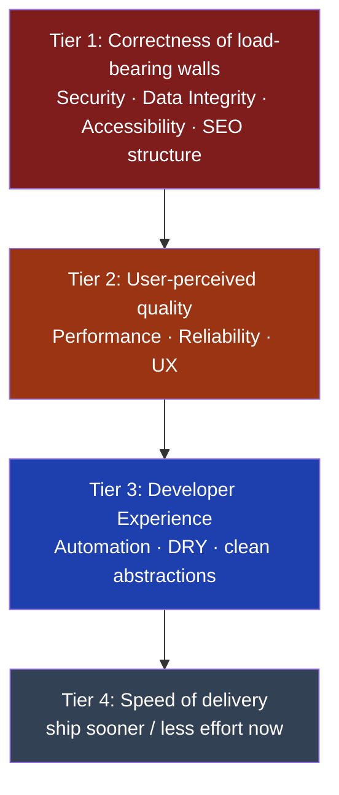

# 00 — Engineering Principles

> **Status:** Draft v1 · **Owner:** CTO / Principal Architect · **Audience:** Every engineer, present and future
> **Type:** Constitution (highest authority document). Every other document in `docs/` must be consistent with this one. If a later document contradicts this file, this file wins until it is formally amended.

---

## 1. Purpose of This Document

This is the **engineering constitution** of UToolios.

A constitution is not a tutorial and not a style guide. It is the small set of rules that everything else inherits from. When an engineer — human or AI — has to make a decision that this documentation does not explicitly cover, they resolve it by returning to these principles. When two good ideas conflict, this document tells you which one wins.

**Simple explanation:** think of these principles as the "house rules." A recipe (a specific feature) can change every week. The house rules (never serve raw chicken, always wash your hands) almost never change. This document is the house rules.

**Why we need this before writing any code:** We are building for a 10-year horizon with the intent of reaching 2–5 million monthly visitors, 1,000+ tools, multiple teams, and AI-generated features. At that scale, the expensive mistakes are not bugs — they are *inconsistent decisions* made by hundreds of people (and prompts) over years. A constitution makes decisions repeatable, so the platform stays coherent even as the people building it change.

### How to use this document

1. Read it fully before contributing.
2. Reference it by number in code reviews, design docs, and pull requests (e.g. "This violates Principle 4.3 — Configuration over Hardcoding").
3. Propose amendments through the process in Section 8. Principles are not sacred, but changing them is deliberate and rare.

---

## 2. The Prime Directive

> **We optimize for *correct*, never for *quick* — but "correct" includes shipping something real to real users.**

You told me: *"Never optimize for quick. Always optimize for correct."* I agree with the spirit, and I want to sharpen it, because taken literally this sentence is the single most dangerous instruction a solo-founder-scale startup can follow. Here is my CTO position, and it becomes a principle:

**"Correct" means "the right thing for a 10-year platform," not "the maximum possible engineering."** A payment system with no input validation is *incorrect*. But building a Kubernetes cluster, a service mesh, and an event-sourcing pipeline for a website with zero users is *also incorrect* — it is correctness theatre. It burns the one resource you cannot buy back: your daily building time before revenue arrives.

**Simple explanation:** "Correct" is like building a house with a proper foundation, real plumbing, and up-to-code wiring. It is *not* installing a chandelier in every room before anyone has moved in. Solid bones now; luxury later, when there's a reason.

So the Prime Directive has two enforcement rules:

- **Never cut a corner that is expensive to add back later** (security, data integrity, SEO structure, the plugin contract, accessibility). These are "load-bearing walls" — retrofitting them costs 10x.
- **Always defer work whose cost is cheap to add later** (a second search engine, a mobile app, enterprise SSO, a microservice split). These are "furniture" — you add them when the need is real.

This is the tension we manage on every decision. Sections 3–5 give you the tools to resolve it.

---

## 3. The Non-Negotiables ("Load-Bearing Walls")

These are the things we get right from day one because they are structurally hard to add later. Compromising any of these is a blocking issue in review, regardless of deadline.

| # | Non-Negotiable | Why it must exist from day one | What "cheap to skip now, brutal to add later" looks like |
|---|----------------|-------------------------------|----------------------------------------------------------|
| N1 | **Security by default** | A single data leak or XSS at scale is an existential, brand-ending event. | Bolting auth/CSP onto a live platform means auditing thousands of endpoints later. |
| N2 | **The tool plugin contract** | 1,000+ tools only stay maintainable if every tool obeys one interface. | If tools #1–100 are hand-built pages, migrating them to plugins is a rewrite. |
| N3 | **SEO structure (URLs, metadata, structured data)** | Organic traffic *is* the business model. URLs and canonical strategy are near-impossible to change once indexed. | Renaming URLs after Google indexes millions of pages destroys ranking. |
| N4 | **Accessibility semantics** | Legal risk, plus ~15% of users, plus SEO overlap. Retrofitting ARIA/semantics is a full re-test of every tool. | "We'll add a11y later" means re-auditing 1,000 tools. |
| N5 | **Type safety & validated boundaries** | AI-generated tools *will* produce subtle bugs; types + schema validation are the safety net. | Adding validation after data is corrupted means data cleanup, not just code changes. |
| N6 | **Observability hooks** | You cannot fix what you cannot see; at scale, "it's slow" is unactionable without traces. | Retrofitting tracing means touching every service path. |
| N7 | **Testability** | AI-assisted development is only safe if a test suite catches regressions automatically. | Untested code becomes "do not touch" code — the definition of technical debt. |

**Simple explanation of N2 (the most unusual one):** Imagine every tool is a USB device. USB works because every device — mouse, keyboard, drive — speaks the same plug standard. We decide the "plug shape" for tools *now*, so that tool #501 just plugs in and the platform automatically gives it a route, SEO, ads, and search. If we let early tools use different "plugs," the platform can't automate anything. (Full spec: `13-TOOL-PLUGIN-ARCHITECTURE.md`.)

---

## 4. The Core Principles

These guide *how* we build. Each has a plain-language meaning and an example. They are grouped, and the groups are ordered by priority — see Section 5 for how to resolve conflicts.

### 4.1 Security First
Every feature assumes hostile input. We validate at the boundary, escape on output, and use parameterized queries always.
**Example:** A "Word Counter" seems harmless — but if it renders user text back to the screen without escaping, it's an XSS hole. Security First means even a text tool escapes output. *(Detail: `25-SECURITY.md`, `26-OWASP-COMPLIANCE.md`.)*

### 4.2 SEO First
The architecture generates correct URLs, metadata, and structured data automatically. SEO is not a marketing afterthought bolted on at the end; it is a property of the system.
**Example:** When a developer adds a "Tile Calculator" folder, the platform automatically produces `/home/tile-calculator`, a `<title>`, an Open Graph card, and `HowTo` JSON-LD — with zero manual SEO work. *(Detail: `14-SEO-ARCHITECTURE.md`.)*

### 4.3 Performance First
We target 100 Lighthouse and excellent Core Web Vitals as a *default state*, not a cleanup task. Most tools are pure client-side functions, so they should ship almost no JavaScript beyond what they need.
**Example:** A BMI calculator should be interactive instantly, not wait on a 500KB bundle. We lean on Server Components and code-splitting so each tool only loads its own logic. *(Detail: `20-PERFORMANCE.md`.)*

### 4.4 Accessibility First
Tools are usable by keyboard, screen reader, and assistive tech by default. This overlaps heavily with SEO (semantic HTML helps both).
**Example:** A "Decision Wheel" must be operable without a mouse and announce results to a screen reader — not just be a pretty animation. *(Detail: `37-ACCESSIBILITY.md`.)*

### 4.5 Automation First
If a task is done more than twice, we automate it. Humans make inconsistent decisions; scripts do not. This is how one person maintains 1,000 tools.
**Example:** Sitemaps, JSON-LD, and internal links are *generated* from tool config, never hand-maintained. Adding a tool never means editing a sitemap file.

### 4.6 Configuration over Hardcoding
Behavior that varies between tools lives in data (`tool.config.ts`), not in branching code.
**Example:** Instead of `if (tool === 'mortgage') showAds()`, every tool declares `ads: true` in its config, and the platform reads it. New tools need no changes to platform code. *(This is the practical engine behind N2.)*

### 4.7 Convention over Configuration
Where behavior is the *same* for all tools, it is implied by structure, not re-declared.
**Example:** A tool folder named `mortgage-calculator` inside `finance/` automatically becomes the URL `/finance/mortgage-calculator`. Nobody writes a route. The folder name *is* the configuration. (Note 4.6 and 4.7 are partners: configure what differs, convention-ize what's shared.)

### 4.8 Clean Architecture, SOLID, DRY, KISS, YAGNI
- **Clean Architecture:** business rules (a tool's formula) never depend on frameworks (Next.js). You could swap the UI framework without rewriting the math. *Example:* `calculator.ts` has no `import 'react'`.
- **SOLID:** each module has one job and depends on abstractions. *Example:* an ad component depends on an `AdProvider` interface, so swapping AdSense → Mediavine touches one file.
- **DRY:** one source of truth. *Example:* a tool's title exists in exactly one place; the page, the sitemap, and the OG card all read from it.
- **KISS:** the simplest solution that satisfies the non-negotiables wins.
- **YAGNI ("You Aren't Gonna Need It"):** we do not build for imagined futures. *Example:* we do not build a white-label API layer until a paying customer needs one — but we *do* keep the plugin contract clean so it's possible later.

> **CTO note:** KISS and YAGNI are here as a deliberate counterweight to the "always maximal" reading of your brief. They are the principles that stop us from over-engineering. Treat them as equal citizens, not footnotes.

### 4.9 Feature-First (Domain-Oriented) Organization
Code is organized by *what it does for the product* (the tool, the category), not by technical type. You should be able to delete a tool by deleting one folder.
**Example:** everything about the mortgage calculator — formula, tests, content, SEO — lives together in `tools/finance/mortgage-calculator/`, not scattered across `/components`, `/utils`, `/tests`. *(Detail: `06-REPOSITORY-STRUCTURE.md`.)*

### 4.10 Everything Testable, Observable, Documented, Replaceable
- **Testable:** logic is written so it can be tested in isolation. If it's hard to test, the design is wrong.
- **Observable:** we can answer "is it working, and how fast?" from dashboards, not guesses.
- **Documented:** the *why* is written down; code shows *how*, docs show *why*.
- **Replaceable:** every third-party dependency (search engine, ad network, database host) sits behind our own interface, so it can be swapped without a rewrite.
**Example of Replaceable:** we use Meilisearch, but our code calls `search.query()`, our own interface — not Meilisearch's SDK directly. If we outgrow it, we swap the implementation, not the whole app.

---

## 5. Priority Order — How to Resolve Conflicts

Principles will collide. A CTO's real job is having a *pre-agreed answer* for when they do, so decisions don't depend on who is in the room that day.

**When two principles conflict, the higher tier wins:**

**Worked examples:**

| Conflict | Resolution | Reasoning |
|----------|-----------|-----------|
| A fancy animation improves UX but hurts CLS/LCP | Performance wins (Tier 2 > raw UX polish) | Core Web Vitals are ranking + revenue; polish is negotiable |
| Escaping output adds a few ms | Security wins (Tier 1 > Tier 2) | Never trade a load-bearing wall for speed |
| A shared abstraction would save dev time but adds a slow indirection on the hot path | Performance wins (Tier 2 > Tier 3) | DX serves us; performance serves users and revenue |
| Full i18n now would delay the first 50 tools | Delivery-of-fundamentals wins; i18n deferred (YAGNI) but URLs stay i18n-ready (Tier 1 structure preserved) | Don't build the feature yet; don't block it either |

**The tie-breaker question for any decision:** *"Is this a load-bearing wall or furniture?"* Walls get built right, now. Furniture waits until there's a room to put it in.

---

## 6. Principles Specific to How *We* Build (Solo → Team → AI)

This platform has an unusual builder profile: it starts as **one founder building daily**, grows into **multiple teams**, and increasingly uses **AI to generate tools**. Three extra principles come from that reality.

- **6.1 Optimize for the next contributor, who might be a prompt.** Every convention must be explainable in one sentence so an AI can follow it reliably. Ambiguity that a senior human would "just know" is a bug when the contributor is Claude. *Example:* "every tool exports a default `ToolConfig`" is AI-safe; "structure it sensibly" is not.
- **6.2 Consistency beats cleverness.** One boring, repeated pattern across 1,000 tools is worth more than a clever pattern that only works for 10. The platform's value is uniformity.
- **6.3 The build must survive being put down and picked up.** Because you build in daily increments, state must live in the repo and docs, never in someone's head. If you disappeared for two weeks, another engineer (or prompt) should be able to continue from the docs alone. This is why documentation is a non-negotiable output, not a nicety.

---

## 7. Anti-Principles (What We Explicitly Reject)

Naming the failure modes is as important as naming the goals.

| Anti-Principle | What it looks like | Why we reject it |
|----------------|--------------------|--------------------|
| **Gold-plating** | Building enterprise SSO for zero enterprise customers | Violates YAGNI; steals time from revenue |
| **Copy-paste tooling** | Tool #12 forked by copying tool #11's page | Violates the plugin contract (N2); creates 1,000 divergent snowflakes |
| **"We'll fix SEO later"** | Shipping tools with placeholder metadata | Violates N3; re-indexing cost is catastrophic |
| **Hidden coupling** | A tool that imports another tool's internals | Breaks Replaceable + Feature-First; you can no longer delete one folder cleanly |
| **Silent failure** | Swallowing errors to "keep the page up" | Breaks Observability; you learn about problems from users, not dashboards |
| **Framework lock-in in business logic** | Formula code importing React/Next | Breaks Clean Architecture; a framework change becomes a rewrite |

---

## 8. Governance — How Principles Change

Principles are stable, not frozen. To amend this document:

1. **Propose** in writing: which principle, what change, what triggered it (a real problem, not a preference).
2. **State the trade-off:** what we gain and what we give up.
3. **Get sign-off** from the architecture owner (currently the CTO; later, a small architecture group).
4. **Version it:** bump the version, date the change, and record the reasoning in a changelog at the bottom of this file. Future engineers must be able to see *why* a rule changed.

**Simple explanation:** we treat the constitution like a contract. You don't secretly rewrite a contract; you sign a dated amendment everyone can read.

---

## 9. Definition of Done (applies to every future document and feature)

Nothing is "done" until:

- [ ] It satisfies all Non-Negotiables (Section 3).
- [ ] Conflicts were resolved using the Priority Order (Section 5).
- [ ] The *why* is documented, not just the *how*.
- [ ] It is testable, observable, and replaceable (Principle 4.10).
- [ ] It does not trip an Anti-Principle (Section 7).

---

## 10. Summary

- We build for **correct**, where correct means *right for a 10-year platform* — which explicitly includes **not over-building** before there are users.
- A short list of **load-bearing walls** (security, plugin contract, SEO structure, accessibility, types, observability, testability) is non-negotiable from day one.
- Everything else is **furniture**: added when a real need appears.
- When principles conflict, the **priority tiers** decide, so decisions are consistent no matter who (or what) is building.
- Because this platform is built daily, sometimes by AI, **clarity and consistency are themselves architecture.**

> This document governs all others. `01-VISION.md` will build directly on it by defining *what we are trying to become* over the next 10 years.

---

### Changelog
| Version | Date | Change | Reason |
|---------|------|--------|--------|
| v1 | (draft) | Initial constitution | Project inception |
