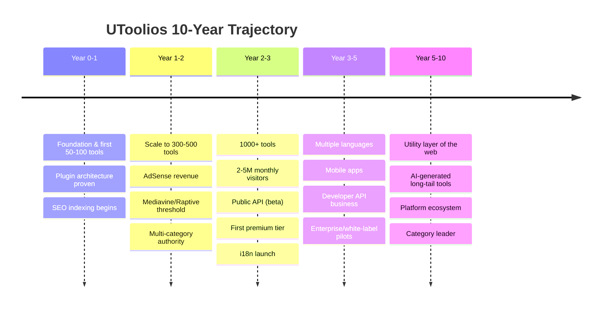
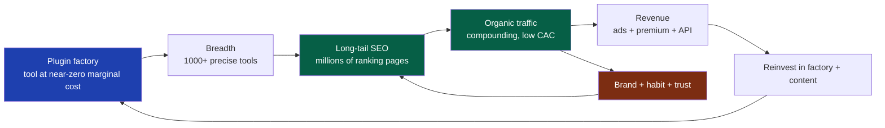

# 01 — Vision

> **Status:** Draft v1 · **Owner:** CTO / Founder · **Audience:** Everyone building UToolios
> **Governed by:** `00-ENGINEERING-PRINCIPLES.md`. This document explains *what we are trying to become*; the constitution explains *how we are allowed to build it*.

---

## 1. Why a Vision Document Exists (and why engineers should care)

A vision document is not marketing fluff. For an engineering team, it is the **tie-breaker for architecture decisions that only pay off years from now.**

When someone asks "should we spend three days making URLs perfectly stable, or one day shipping a quick route?", the answer depends entirely on where we're going. If we're building a weekend project, the quick route wins. If we're building a platform that will have *millions of indexed pages a decade from now*, stable URLs are worth three days — or three weeks.

**Simple explanation:** the vision is the destination on the map. You can't judge whether a road is "the right road" until you know where you're driving. Every "is this over-engineering or under-engineering?" argument (the core tension from `00`) is really an argument about the destination. This document fixes the destination so those arguments end quickly.

---

## 2. Mission, Vision, and North Star

### Mission (why we exist — present tense)
> **To solve everyday problems for everyone on earth, one small, free, excellent tool at a time.**

Every tool solves *one* problem *extremely well*. A person with a question — "how much paint do I need?", "what's my mortgage payment?", "decode this JWT" — should find a UToolios tool that answers it in seconds, for free, on any device, in their language.

### Vision (what we become — future state)
> **UToolios becomes the default utility layer of the internet: the place people and machines reach for when they need to compute, convert, format, estimate, or decide.**

"Default utility layer" is deliberate. Google is the default place to search. We intend to be the default place to *do a small computation*. When that behavior becomes a habit for millions of people, the business (ads, premium, APIs) follows automatically.

### North Star Metric
Our single guiding number is:

> **Monthly Successful Tool Completions (MSTC)** — the number of times per month a user opens a tool and actually gets the answer they came for.

**Why this metric and not "page views":** page views can be inflated by clickbait and reward shallow content. MSTC rewards the thing that actually builds a durable business — tools that *work* and *help*. A high MSTC means high engagement, high return visits, strong SEO signals (low bounce, high dwell), and a healthy base for ads and premium. Every architectural decision should be checkable against one question: *does this increase MSTC, or just vanity numbers?*

**Simple explanation:** we don't count how many people walked into the shop. We count how many walked out with what they needed. That's the number that turns into money and reputation.

---

## 3. The 10-Year Picture

The trajectory is **breadth first, then depth, then monetization depth, then ecosystem.** We do not try to do everything in year one. We build the *machine that produces tools cheaply and correctly*, then let that machine run.

**Simple explanation:** in year one we're not trying to build 1,000 tools. We're building the *factory* that can stamp out tool #501 by adding one folder (Principle N2). Once the factory works, adding tools becomes almost free — and *that* is what compounds into millions of pages and millions of visitors.

---

## 4. The Strategic Bets (and what each demands from the architecture)

A vision is a set of bets. Naming them makes them debatable and testable. Here are ours, each paired with the architectural obligation it creates.

| # | The Bet | What we're betting is true | Architectural obligation it creates |
|---|---------|----------------------------|-------------------------------------|
| B1 | **Long-tail SEO compounds** | Thousands of small, precise tool pages will out-rank a few big ones, and the traffic compounds over years | Programmatic SEO, perfect per-page metadata, stable URLs (`14`, `17`) |
| B2 | **Uniformity scales, snowflakes don't** | One repeatable tool contract lets a tiny team (or AI) run 1,000+ tools | The plugin architecture is the whole company's leverage (`13`) |
| B3 | **AI makes tool creation nearly free** | Most of a tool (formula, content, tests, schema) can be generated | The contract must be machine-writable and machine-verifiable (`35`) |
| B4 | **Speed + free = habit** | Instant, free tools create return-visit habits that ads/premium monetize | Performance and cost-efficiency are core, not polish (`20`, `21`) |
| B5 | **Trust is the moat** | Correct results + privacy + accessibility create a brand people return to | Security, a11y, and correctness are non-negotiable (`25`, `37`, `39`) |

> **CTO note on B1 & B2:** These two bets are *why* the plugin architecture is a load-bearing wall in `00`, not a nice-to-have. If either bet is right, uniformity and stable URLs are worth almost any up-front cost. If we're wrong about them, we've built a very clean website — still not a disaster. This is an asymmetric bet: large upside, limited downside. That is exactly the kind of bet a startup should make.

---

## 5. What "Winning" Looks Like — Concrete Milestones

Vision without measurable checkpoints is a daydream. Here is what success looks like at each stage, in terms an engineer can verify.

| Horizon | Product state | Engineering proof it's real | Business proof it's real |
|---------|---------------|-----------------------------|--------------------------|
| **M1 — Foundation** | 20–50 tools live | New tool = one folder, auto-routed, 100 Lighthouse SEO | First pages indexed by Google |
| **M2 — Traction** | 200–500 tools | AI can generate a passing tool from a spec | AdSense active; approaching Mediavine's traffic bar |
| **M3 — Scale** | 1,000+ tools; multi-language | Adding a language = config, not rewrite | 2–5M monthly visitors; premium tier live |
| **M4 — Platform** | Public + white-label APIs; mobile | API is same tool logic, no duplication | API revenue + enterprise pilots |
| **M5 — Category leader** | The reflexive "utility layer" habit | Long-tail tools AI-generated at low marginal cost | Diversified revenue; defensible moat |

**Simple explanation of the M1 proof:** the definition of a working foundation is not "the site looks nice." It's a *mechanical test*: can I add one folder and get a fully SEO-optimized, indexed, ad-ready tool with no other code changes? If yes, the factory works. If no, we haven't reached M1 no matter how pretty the homepage is.

---

## 6. Our Moats — Why This Is Defensible

Anyone can build a mortgage calculator in an afternoon. So why won't a competitor just copy us? A vision must answer the "why can't this be copied" question, because defensibility is what makes the architecture worth its cost.

Our moats are **compounding, not clever**:

1. **The content/SEO flywheel** (the loop above). Traffic funds tools; tools create pages; pages create traffic. A competitor starting at zero must out-run a compounding loop — very hard.
2. **Cost structure.** Because tools are near-free to produce (B3) and mostly client-side (B4), our cost per tool and per visit is tiny. A competitor with hand-built pages has a higher cost structure and can't match our breadth profitably.
3. **Uniform quality.** Trust (B5) compounds: users learn "UToolios tools just work." That reputation is not copyable in a weekend.
4. **Data & habit.** Over years, we learn which tools people want next (from search demand and MSTC) and generate them first. We're always one step ahead of the long tail.

**Simple explanation:** our advantage isn't one genius tool. It's a *machine plus a compounding loop*. Copying one tool is easy; copying a factory that's been compounding traffic for three years is nearly impossible. That's why the architecture investment is justified — it's building the machine, not the tool.

---

## 7. Explicit Non-Goals (What We Are *Not* Building)

Saying no is a strategy. These non-goals prevent scope creep and protect the YAGNI principle from `00`.

| Non-Goal | Why not | When (if ever) we'd revisit |
|----------|---------|------------------------------|
| A social network / user-generated content platform | Massive moderation + trust cost; not our loop | Never (out of mission) |
| A single "mega app" with hundreds of features on one page | Kills performance, SEO, and the one-tool-one-problem philosophy | Never |
| Heavy custom backend for tools that are pure functions | Violates KISS/YAGNI; most tools need no server | Only per-tool, when a tool genuinely needs server compute (e.g. OCR) |
| Native mobile before mobile web is excellent | Web-first reaches everyone and feeds SEO | M4, once web + traffic justify it |
| Enterprise/white-label features before product-market fit | Gold-plating; zero customers today | M4+, when a paying customer pulls it |
| Chasing every framework trend | Stability > novelty for a 10-year platform | Only on clear, evidence-backed benefit |

> **CTO note:** These non-goals are commitments, not suggestions. When a future idea shows up ("let's add user profiles and comments!"), the first question is: *does this serve the mission and the flywheel, or is it a shiny distraction?* If it's not on the roadmap and not on the flywheel, the default answer is no.

---

## 8. Values That Shape Engineering Choices

The vision implies a few cultural values that will repeatedly influence technical decisions:

- **Radical usefulness over cleverness.** A boring tool that reliably gives the right answer beats a flashy one that occasionally lies. Correctness is a feature.
- **Respect the user's time, device, data, and battery.** Fast, light, private. No dark patterns, no bloat. (This directly supports B4 and B5.)
- **Free is a feature, not a limitation.** The free tier must be genuinely excellent; monetization sits *around* the tool, never *in front of* it. We never hold the answer hostage behind a paywall for the core free tools.
- **Build in public increments.** Because this is built daily (`00`, §6.3), we value small, shippable, well-documented steps over big-bang launches.

**Simple explanation:** we win by being the most *helpful* option, not the most *impressive* one. Every value above is really a rule for keeping users' trust, because trust is the moat.

---

## 9. How the Vision Maps to the Rest of This Documentation

This chapter sets direction; downstream chapters implement it. The mapping:

| Vision element | Where it's engineered |
|----------------|------------------------|
| B1 Long-tail SEO / millions of pages | `14-SEO-ARCHITECTURE`, `15-METADATA-ENGINE`, `16-STRUCTURED-DATA`, `17-PROGRAMMATIC-SEO`, `18-INTERNAL-LINKING` |
| B2 Uniform plugin factory | `13-TOOL-PLUGIN-ARCHITECTURE`, `05-MONOREPO-STRATEGY`, `06-REPOSITORY-STRUCTURE` |
| B3 AI-generated tools | `35-AI-TOOL-GENERATION`, `34-CONTENT-ENGINE`, `39-TESTING` |
| B4 Speed + free habit | `20-PERFORMANCE`, `21-CACHING`, `19-ADS-ARCHITECTURE` |
| B5 Trust moat | `25-SECURITY`, `26-OWASP-COMPLIANCE`, `37-ACCESSIBILITY`, `39-TESTING` |
| Monetization horizons | `03-BUSINESS-MODEL`, `19-ADS-ARCHITECTURE`, `22-API-STANDARDS` |
| Global / multi-language | `36-LOCALIZATION`, `14-SEO-ARCHITECTURE` |

If a future proposal can't be traced to a vision element here, that's a signal to ask whether we should be doing it at all.

---

## 10. Summary

- **Mission:** solve everyday problems for everyone, one small free excellent tool at a time.
- **Vision:** become the internet's default *utility layer*.
- **North Star:** Monthly Successful Tool Completions — the count of people who got what they came for, because that's what turns into revenue and reputation.
- **Strategy:** build the *factory* first (B2), let long-tail SEO compound (B1), make tools near-free with AI (B3), win habit with speed + free (B4), defend with trust (B5).
- **Moat:** a compounding content/SEO flywheel plus a low-cost structure — hard to copy because it's a machine that's been running for years, not a single clever product.
- **Discipline:** explicit non-goals protect us from gold-plating; every downstream document must trace back to a vision element here.

> Next: `02-PRODUCT-PHILOSOPHY.md` translates this vision into the rules for *what makes a good UToolios tool* — the product-level standards that the plugin architecture will then enforce technically.

---

### Changelog
| Version | Date | Change | Reason |
|---------|------|--------|--------|
| v1 | (draft) | Initial vision | Project inception |
