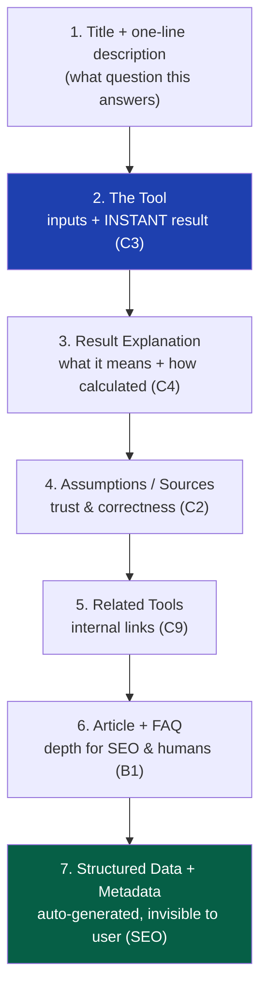

# 02 — Product Philosophy

> **Status:** Draft v1 · **Owner:** CTO / Product Architect · **Audience:** Everyone who designs, builds, or generates a tool
> **Governed by:** `00-ENGINEERING-PRINCIPLES.md` and `01-VISION.md`. This document defines *what makes a good UToolios tool* at the product level. The technical enforcement of these rules lives in `13-TOOL-PLUGIN-ARCHITECTURE.md`.

---

## 1. Why a Product Philosophy Document Exists

`00` told us *how we're allowed to build*. `01` told us *where we're going*. This document answers the question that comes up every single day: **"What does a good tool actually look like?"**

Without a shared answer, 1,000 tools built by different people (and prompts) become 1,000 different experiences — different layouts, different quality bars, different tones. That kills the two things the vision depends on: **uniformity** (B2) and **trust** (B5). This document is the product-level rulebook that keeps every tool feeling like it came from the same company.

**Simple explanation:** think of UToolios like a restaurant chain. `00` is the health code, `01` is "we want to be the most-loved chain in the country," and *this* document is the recipe standard — every location makes the burger the same way, to the same quality, so customers trust any location. A tool is our burger. This is the recipe standard.

**Why engineers care:** these product rules become *technical contracts* later. "Every tool must give an instant answer" becomes a performance budget. "Every tool must explain its formula" becomes a required content field in `tool.config.ts`. Getting the philosophy right here is what lets us automate quality downstream.

---

## 2. The One-Sentence Definition of a Tool

> **A UToolios tool takes a small, specific, real-world question and returns a correct, instant, and clearly-explained answer — for free, on any device, in the user's language.**

Every word is load-bearing. Let's break it down, because this sentence becomes our acceptance test for whether something should even *be* a tool.

| Phrase | What it means | Example of getting it wrong |
|--------|---------------|------------------------------|
| **small, specific** | One problem, not ten | A "Finance Super Tool" with 30 tabs — violates one-tool-one-problem |
| **real-world question** | Someone actually searches for this | A tool nobody looks for — no SEO demand, no MSTC |
| **correct** | The answer is right, always | A mortgage calc that rounds wrong — destroys trust (B5) |
| **instant** | Answer appears with no waiting | A calculator that spins for 3 seconds — kills the habit (B4) |
| **clearly-explained** | User understands the result | A number with no context — low trust, low dwell time |
| **free** | Core answer is never paywalled | Blurring the result until you sign up — a dark pattern we reject |
| **any device, any language** | Works everywhere | Desktop-only, English-only — abandons most of the market |

**Simple explanation:** if you can't fit a tool's purpose into "it answers *this one question*," it's not one tool — it's several, and it should be split. When in doubt, split.

---

## 3. The Ten Product Commandments

These are the product rules every tool must satisfy. They are ordered roughly by importance, and they map directly to the priority tiers in `00`.

### C1 — One Tool, One Job (Single Responsibility for products)
A tool solves exactly one problem. If users need a related thing, that's a *different tool* we link to, not a feature we cram in.
**Example:** "Mortgage Calculator" computes payments. "Mortgage Affordability Calculator" is a *separate* tool. We link them as "Related Tools" (which feeds internal linking / SEO, `18`) instead of merging them into one bloated page.
**Why:** matches the vision's one-problem philosophy, keeps each page tightly focused (great for SEO), and keeps each tool simple enough for AI to generate reliably.

### C2 — Correctness Is Sacred
The answer must be right, with correct units, rounding, and edge-case handling. A tool that is *usually* right is worse than no tool, because it silently erodes trust.
**Example:** a "Tax Calculator" must state its assumptions (tax year, region, brackets) and be tested against known values. Every formula ships with tests (`39-TESTING`) and a stated source/assumptions block.
**Why:** trust is the moat (B5). One viral "this tool is wrong" screenshot damages the whole brand, not one tool.

### C3 — Instant by Default
The core answer must feel immediate. Most tools are pure functions that run in the browser — no server round-trip, no spinner.
**Example:** a BMI calculator updates the result *as you type*, with zero network calls. A tool that *must* hit a server (e.g. OCR) shows an honest, fast loading state and is the exception, not the rule.
**Why:** speed creates the return-visit habit (B4) and is a Core Web Vitals ranking factor (B1).

### C4 — Explain the Answer
Every result comes with plain-language context: what it means, how it was calculated, and what assumptions were used. This is the difference between a "calculator" and a "helpful tool."
**Example:** after "Your monthly payment: $1,432," we show "Here's how we calculated it," the formula, and "This assumes a fixed rate and doesn't include property tax or insurance."
**Why:** explanation increases dwell time and trust (both SEO and B5), and it's what makes content-rich pages rank (B1).

### C5 — Privacy by Default
User input stays on the user's device whenever technically possible. We don't send data to a server unless the tool genuinely requires it, and we say so plainly when we do.
**Example:** a "JWT Decoder" decodes entirely in the browser — the token *never* touches our servers. We state "Your token is never sent to us" on the page.
**Why:** privacy is a trust differentiator (B5) and reduces our security surface and cost. Client-side tools also can't leak what they never receive.

### C6 — Accessible to Everyone
Every tool is fully usable by keyboard and screen reader, with sufficient contrast and clear labels. Accessibility is a load-bearing wall (`00`, N4), not a polish task.
**Example:** the "Decision Wheel" is operable via keyboard, announces its result to assistive tech, and doesn't rely on color alone to convey meaning.
**Why:** ~15% of users, legal risk, and heavy overlap with SEO (semantic HTML helps both).

### C7 — Honest Monetization
Ads and premium prompts sit *around* the tool, never *in front of* the answer. We never blur, delay, or paywall the core free result. No pop-ups over the input. No "answer in 5 seconds…" fake delays.
**Example:** ads appear below the result and in the article content, never as an interstitial the user must dismiss to see their answer.
**Why:** the vision says "free is a feature" (`01`, §8). Aggressive monetization spikes short-term revenue and destroys the long-term habit and trust that are the actual business.

### C8 — Self-Contained and Deletable
A tool owns everything it needs — logic, content, SEO, tests — in its own folder, and never reaches into another tool's internals. You can delete a tool by deleting one folder.
**Example:** the tile calculator does not import a function from inside the paint calculator. If both need the same helper, that helper lives in a shared package (`05-MONOREPO-STRATEGY`), not inside a sibling tool.
**Why:** this is the product-side expression of the plugin contract (`00`, N2) and Feature-First organization. It's what makes 1,000 tools maintainable.

### C9 — Discoverable and Connected
Every tool is findable (search, categories, sitemap) and connected to related tools. No tool is an island.
**Example:** the mortgage calculator links to affordability, interest, and property-tax tools; those links are generated from each tool's `related.ts`, not hand-typed.
**Why:** internal linking spreads SEO authority (B1, `18`) and increases MSTC by guiding users to the *next* thing they need.

### C10 — Consistent Experience
Layout, interaction patterns, tone of voice, and result presentation are consistent across all tools. Users learn the pattern once and apply it everywhere.
**Example:** every tool has the same shape: title → short intro → input → instant result → explanation → related tools → article/FAQ. Users never have to relearn "how does *this* tool work."
**Why:** consistency *is* architecture (`00`, §6.2). It's why the platform feels trustworthy and why AI can generate tools that "fit."

---

## 4. The Anatomy of Every Tool Page

Because of C10 (Consistency), every tool page follows the same skeleton. This is a product decision here; it becomes a layout contract in `10-FRONTEND-ARCHITECTURE.md`.



**Simple explanation:** every tool is like a well-organized answer to a question. First the answer (the tool + result), then the *why* (explanation, assumptions), then "you might also need…" (related tools), then deeper reading (article/FAQ) for people and search engines who want more. The same shape every time.

**Why this exact order:** the user's *answer* comes first (respecting their time, C3), and the SEO-heavy content (article, FAQ, structured data) comes after — so we serve the human first and the search engine second, and both are satisfied.

---

## 5. Tool Quality Tiers — The Bar for "Done"

Not every tool is equal in effort, but every tool must clear a minimum bar. We define three tiers so that "is this good enough to ship?" has a concrete answer.

| Tier | Description | Minimum bar to ship |
|------|-------------|---------------------|
| **Bronze (never ship below this)** | Correct, instant, accessible, explained | Passes tests, 100 Lighthouse a11y/SEO, has explanation + assumptions, obeys plugin contract |
| **Silver (target for most tools)** | Bronze + rich article, FAQ, examples, related tools | Adds FAQ schema, HowTo where relevant, 3+ related tools, worked examples |
| **Gold (flagship / high-traffic tools)** | Silver + interactive extras, charts, presets, deep content | Adds visualizations, saved states, extended content clusters (`17`, `18`) |

**Rule:** a tool must reach **Bronze** before it can be published. We aim most tools at **Silver**. We invest in **Gold** only for tools that traffic data shows deserve it (respecting YAGNI — we don't gold-plate a tool nobody uses).

**Simple explanation:** Bronze is "safe to serve customers." Silver is "the standard meal we're proud of." Gold is "the signature dish we perfect because it's the reason people come." You don't perfect a dish nobody orders.

> **CTO note:** this tiering is how we reconcile "always correct" (`00`) with "don't over-engineer" (`00` YAGNI). *Correctness* (Bronze) is mandatory for every tool. *Richness* (Gold) is earned by demand. This prevents both under-building (shipping broken tools) and over-building (perfecting dead tools).

---

## 6. How We Decide Which Tools to Build

A universal utility platform could build infinite tools. Deciding *which* and *in what order* is a product discipline, or we drown in low-value work.

**The prioritization formula (conceptual, not a rigid score):**

```
Priority ≈ (Search Demand × Monetization Potential × Strategic Fit)
           ÷ (Build Complexity × Maintenance Cost)
```

| Factor | Question it answers | Example |
|--------|---------------------|---------|
| Search Demand | Are people actually searching for this? | "Mortgage calculator" = huge; "quokka age calculator" = tiny |
| Monetization Potential | Does this attract valuable ads/affiliates? | Finance/insurance tools attract high-value ads |
| Strategic Fit | Does it strengthen a category cluster? | A 6th finance tool deepens topic authority (`17`) |
| Build Complexity | Pure function or needs a server? | BMI = trivial; Background Removal = heavy |
| Maintenance Cost | Will the data go stale? | A tax tool needs yearly updates; a UUID generator never does |

**Simple explanation:** we build tools that lots of people want, that make money, that reinforce a category we're already strong in — and that are cheap to build and keep alive. A tool that's high-demand and low-maintenance (like a unit converter) is a dream. A tool that's low-demand and high-maintenance (a niche tool with data that constantly changes) is a trap.

**Strategic clustering:** we deliberately build *clusters* (all the finance tools, all the developer tools) rather than scattering. Clusters build "topic authority" — Google trusts a site that clearly owns a subject (`17-PROGRAMMATIC-SEO`). Ten related finance tools out-perform ten unrelated random tools.

---

## 7. What a Tool Is *Not* (Product Anti-Patterns)

| Anti-Pattern | Why it's forbidden | Commandment it violates |
|--------------|--------------------|-------------------------|
| The "kitchen sink" tool (does 10 things) | Kills focus, SEO, and simplicity | C1 |
| The "sometimes wrong" tool | Silently destroys trust | C2 |
| The "loading spinner for a math problem" tool | Kills the instant habit | C3 |
| The "bare number, no context" tool | Low trust, low dwell, poor SEO | C4 |
| The "sends your data to us for no reason" tool | Privacy + security risk | C5 |
| The "answer hidden behind an ad/paywall" tool | Dark pattern, breaks trust | C7 |
| The "copy-pasted from another tool" tool | Creates unmaintainable snowflakes | C8 |
| The "orphan" tool (no links, not in search) | Wastes SEO potential | C9 |

**Simple explanation:** every anti-pattern above is a short-term shortcut that trades away long-term trust or maintainability — exactly the trade the constitution forbids (`00`, Anti-Principles).

---

## 8. How Product Philosophy Becomes Technical Enforcement

The whole point of writing these rules down is that they don't stay as good intentions — they become *enforced by the system*, so quality is automatic rather than dependent on discipline.

| Product rule | How it's technically enforced (and where) |
|--------------|--------------------------------------------|
| C2 Correctness | Every tool ships tests; CI blocks merge if they fail (`39`, `40`) |
| C3 Instant | Performance budget per tool; CI fails on bundle bloat (`20`) |
| C4 Explain | `tool.config.ts` requires explanation/assumptions fields (`13`, `15`) |
| C6 Accessible | Automated a11y checks in CI; 100 Lighthouse gate (`37`, `40`) |
| C8 Self-contained | Lint rule forbids cross-tool imports (`08`, `13`) |
| C9 Connected | `related.ts` required; internal links auto-generated (`18`) |
| C10 Consistent | Shared layout component; tools can't define their own page shell (`10`) |

**Simple explanation:** we don't *hope* engineers follow the rules. The build system *refuses* to ship a tool that breaks them. A missing explanation, a failing test, a slow bundle, an inaccessible input — the pipeline says no. Good behavior is the path of least resistance.

> **CTO note:** this is the deepest idea in this document. Product quality that depends on human memory *degrades* at scale. Product quality that's enforced by the pipeline *holds* at scale — even when the "engineer" is an AI prompt (B3). Every rule above is designed to be machine-checkable for exactly this reason.

---

## 9. Summary

- A tool is **one small, specific, real question answered correctly, instantly, and clearly — free, on any device, in any language.**
- **Ten Commandments** define quality: one job, correctness, instant, explained, private, accessible, honestly monetized, self-contained, connected, consistent.
- Every tool follows the **same page anatomy** (answer first, SEO depth last) for consistency and trust.
- **Quality tiers** (Bronze/Silver/Gold) reconcile "always correct" with "don't over-build": correctness is mandatory, richness is earned by demand.
- We **prioritize tools** by demand × monetization × fit ÷ complexity × maintenance, and build in **strategic clusters** for topic authority.
- Crucially, these product rules become **machine-enforced technical contracts** — so quality holds at 1,000+ tools and survives AI-generated development.

> Next: `03-BUSINESS-MODEL.md` defines how these tools make money over time (ads → premium → APIs → enterprise) and the architectural hooks each revenue stream requires.

---

### Changelog
| Version | Date | Change | Reason |
|---------|------|--------|--------|
| v1 | (draft) | Initial product philosophy | Project inception |
