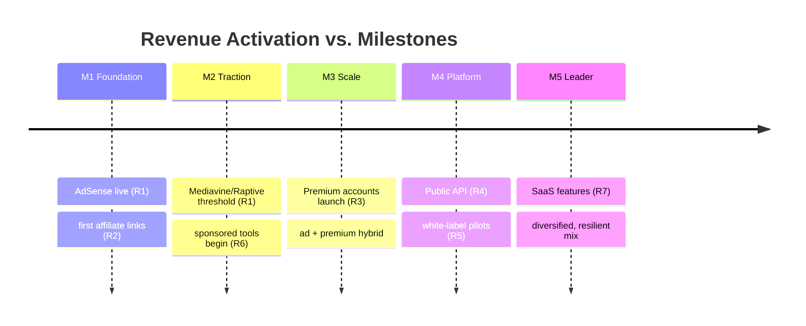
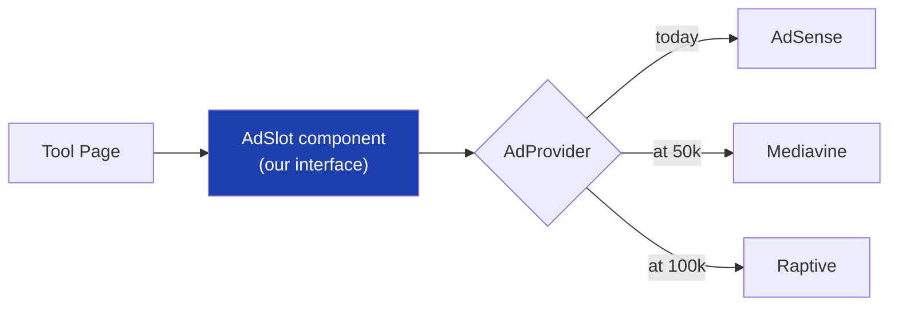
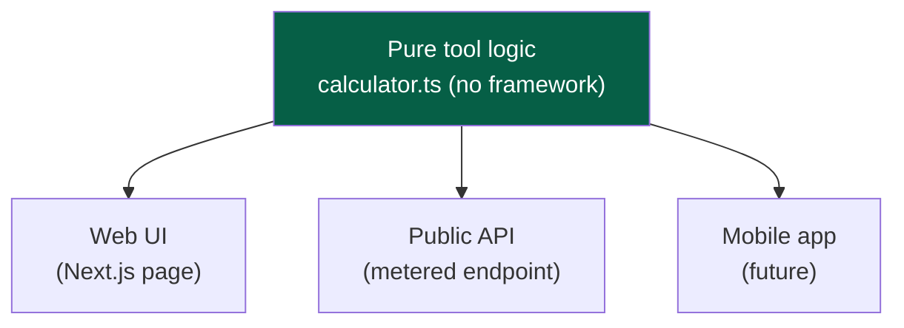
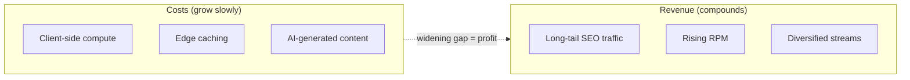

# 03 — Business Model

> **Status:** Draft v1 · **Owner:** CTO / Technical Product Manager · **Audience:** Engineers, so they understand *what pays for the servers* and build the hooks each revenue stream needs
> **Governed by:** `00-ENGINEERING-PRINCIPLES.md`, `01-VISION.md`, `02-PRODUCT-PHILOSOPHY.md`.

---

## 1. Why Engineers Need a Business Model Document

Most engineering docs never mention money. That is a mistake for a company whose *architecture is its business*. At UToolios, revenue comes from ads, APIs, and premium features — and each of those requires specific technical scaffolding that is painful to retrofit. If engineers don't understand the money, they'll build things that quietly make money impossible later.

**Simple explanation:** imagine building a shopping mall but forgetting to leave space for shops, wiring, or cash registers. The building "works," but it can never earn rent. This document makes sure we leave the right space in the architecture *from day one*, so revenue can move in later without knocking down walls.

**The one rule that connects money to code:**
> **We design the *hooks* for every future revenue stream now, but we only *activate* a stream when the business is ready for it.**

A "hook" is a cheap, clean seam in the code where a revenue feature will slot in. Building the hook is a load-bearing wall (`00`, N-tier). Building the full feature before it's needed is gold-plating (YAGNI). This document draws that line for each stream.

---

## 2. The Revenue Portfolio at a Glance

We are not a one-revenue company. We diversify deliberately, because a platform dependent on a single ad network is one policy change away from zero. Here is the full portfolio and its maturity.

| # | Revenue Stream | When it activates | Depends on | Risk if it's our only income |
|---|----------------|-------------------|------------|------------------------------|
| R1 | **Display Advertising** (AdSense → Mediavine → Raptive) | Day 1 (AdSense); traffic-gated for premium networks | Traffic volume | Ad network policy / rate changes |
| R2 | **Affiliate Marketing** | Early, per relevant tool | Relevant tools + audience intent | Merchant program changes |
| R3 | **Premium Accounts** | M3 (once traffic + features justify) | Auth, billing, feature gating | Low conversion if free is too good |
| R4 | **Public APIs** | M4 | Same tool logic exposed as API + metering | Abuse, cost overrun |
| R5 | **White-label APIs** | M4+ | R4 + tenancy + SLAs | Support burden |
| R6 | **Sponsored Tools** | M2+ | Traffic + sponsor demand | Trust erosion if not labeled |
| R7 | **Future SaaS features** | M5 | Product-market signals | Distraction from core |

**Simple explanation:** we stack income sources like layers. Ads are the foundation (they pay from day one). Everything above — affiliates, premium, APIs — gets added as the audience grows, so that no single layer collapsing takes down the whole business.

---

## 3. The Revenue Timeline

Revenue maturity tracks the milestones from `01-VISION.md`. You don't build R4 before R1 is producing.

**Why this order (the CTO reasoning):**
- **Ads first (R1)** because they require no user accounts, no billing, and start earning with the very first indexed pages. Lowest friction, fastest to cash.
- **Premium (R3) waits** until we have enough traffic that even a 1–2% conversion is meaningful, and enough premium-worthy features to justify paying. Launching premium at 10k users/month is wasted engineering.
- **APIs (R4) wait** until the tool library is broad and stable, because an API is a *contract* — once developers depend on it, breaking it is very costly. We stabilize internally first, expose externally later.

> **CTO note — challenge to a common instinct:** it's tempting to build accounts, billing, and premium tiers early because they feel "real." I strongly advise against it. Every hour on billing before we have traffic is an hour *not* spent on the tool factory and SEO that *create* the traffic that makes billing worthwhile. Premium is a *multiplier* on an audience — build the audience first, or you're multiplying by zero.

---

## 4. R1 — Display Advertising (The Foundation)

This is the primary revenue engine, so it gets the most architectural attention.

### How it works
Advertisers pay to show ads on our pages. We earn per impression (RPM = revenue per thousand views) and sometimes per click. More quality traffic on quality content = more revenue.

### The AdSense → Mediavine → Raptive ladder
Ad networks have traffic minimums and pay very different rates. We climb the ladder as traffic grows.

| Network | Rough traffic bar | Relative RPM | Notes |
|---------|-------------------|--------------|-------|
| **Google AdSense** | None (day 1) | Baseline (1x) | Easy start, lowest rate |
| **Mediavine** | ~50k sessions/mo | ~3–5x AdSense | Higher quality, stricter approval |
| **Raptive (AdThrive)** | ~100k pageviews/mo | ~3–6x AdSense | Premium, highest support |

**Simple explanation:** AdSense is the entry-level job that anyone can get. Mediavine/Raptive are the senior roles that pay several times more but require a track record (traffic). We start at entry level and get promoted as our "résumé" (traffic) grows.

### The critical architectural requirement: ads must be *swappable*
Because we will switch networks over time, our code must **never** hardcode a specific ad provider. Instead, ads sit behind our own `AdSlot` abstraction (Principle 4.10, Replaceable).

Switching networks then means changing one provider implementation, not editing 1,000 tool pages. (Full design: `19-ADS-ARCHITECTURE.md`.)

### The non-negotiable constraint: ads must not break the product
This is where business and `02-PRODUCT-PHILOSOPHY.md` collide, and product wins:
- Ads must **not** hurt Core Web Vitals — reserved space to prevent layout shift (CLS), lazy-loaded below the fold, no render-blocking scripts. A slow ad that tanks our Lighthouse score costs us *more* in lost SEO traffic than it earns (`20-PERFORMANCE`).
- Ads sit **around** the answer, never in front of it (C7). No interstitials over the tool.

> **CTO note:** the biggest self-inflicted wound in ad-funded platforms is letting ad scripts destroy performance and then wondering why traffic (and thus ad revenue) stalls. Our rule: **the ad layer serves the content; the content never serves the ad layer.** Performance budgets in CI will treat ad weight as a first-class cost.

---

## 5. R2 — Affiliate Marketing

### How it works
When a tool's topic naturally leads to a product, we include a relevant, clearly-labeled affiliate link. If the user buys, we earn a commission — at no extra cost to them.

**Example:** a "Mortgage Calculator" can responsibly link to mortgage/refinance comparison services. A "Paint Calculator" can link to paint retailers. A "Protein Calculator" can link to supplements.

### Architectural hook
Affiliate links are **data, not code** — declared in a tool's config (or a central affiliate registry), so we can update, rotate, or disclose them without touching tool logic. This also lets us centrally enforce `rel="sponsored"` and disclosure labels for compliance.

**Simple explanation:** we treat affiliate links like ingredients on a label — declared in one place, always disclosed, easy to swap when a better partner appears. We never bury them in the code of individual tools.

### The trust guardrail
Affiliate links must be **genuinely relevant** and **clearly disclosed**. An irrelevant or hidden affiliate link violates C7 (honest monetization) and B5 (trust). We would rather show no affiliate link than a misleading one.

---

## 6. R3 — Premium Accounts

### How it works
A paid tier removes ads and unlocks power features (saved history, bulk operations, higher limits, exclusive Gold-tier tools, API access).

### What premium is *not*
Premium never paywalls the *core free answer* (C7). The free tier stays genuinely excellent (`01`, §8). Premium sells *convenience, power, and ad-removal* — not the basic utility.

**Example:** free users get the full JSON Formatter. Premium users get batch formatting, saved snippets, an ad-free view, and API access. The core tool is identical.

### Architectural hooks required (build the seams, not the feature)
Even before we launch premium, the architecture must not *prevent* it:
- **Auth-ready** (`23-AUTHENTICATION`): a clean user/session model can be added without reworking the app.
- **Entitlement checks** (`24-AUTHORIZATION`): features check a capability (`can('use', 'batch-mode')`), not a hardcoded `if (isFree)`.
- **Billing seam**: a payment provider (e.g. Stripe) sits behind our own billing interface (Replaceable, 4.10).

**Simple explanation:** we don't install the paid turnstile on day one, but we make sure there's a clean doorway where a turnstile *can* go later. Retrofitting a turnstile into a wall with no doorway is the expensive mistake we're avoiding.

> **CTO note — challenge:** the brief lists premium as a core stream. I agree it belongs, but I'd caution that **for a utility site, premium conversion is typically very low** (utilities are low-emotional-attachment, easily bookmarked, easily substituted). Realistically, ads + APIs will likely dwarf premium revenue. So we build premium *hooks* cheaply but resist over-investing engineering in premium features until data proves willingness to pay. Set expectations accordingly in the roadmap (`52`).

---

## 7. R4 & R5 — Public and White-Label APIs

### How it works
Developers pay to call our tool logic programmatically. **This is the highest-leverage stream architecturally**, because of one design decision we make early:

> **A tool's core logic (`calculator.ts`) is pure and framework-free (`00`, Clean Architecture). The same function that powers the web page can power an API endpoint with zero duplication.**

**Simple explanation:** we write the mortgage math *once*. That one function feeds the website, the API, and eventually the mobile app. We never rewrite it three times. This is why Clean Architecture in `00` is a *business* decision, not just an engineering aesthetic — it's what makes the API stream nearly free to launch.

### What R4/R5 additionally require
- **Metering & rate limiting** (`22-API-STANDARDS`): count usage, enforce quotas per key.
- **API keys & tenancy** (`23`, `24`): identify and isolate customers.
- **Versioning** (`49-VERSIONING`): an API is a promise; we version it so we can evolve without breaking customers.
- **White-label (R5)** adds multi-tenancy, custom domains, and SLAs — deferred until a paying customer pulls it (YAGNI).

> **CTO note:** the API business is where the "pure logic" investment pays off enormously. But an API is also an *attack surface and a cost center* (someone else's traffic on our servers). We do not expose it until rate limiting, metering, and abuse protection (`25-SECURITY`) are solid. An unmetered public API is a bill waiting to explode.

---

## 8. R6 — Sponsored Tools

### How it works
A sponsor pays to underwrite a tool relevant to their business (e.g. a bank sponsors a savings calculator). The tool remains free, accurate, and unbiased; the sponsorship is clearly labeled.

### The hard guardrail
Sponsorship must **never** compromise correctness or neutrality (C2). A sponsored tool that skews its results to favor the sponsor destroys trust (B5) — the one thing we can't rebuild. Sponsorship funds the tool; it does not buy the answer. Labeling is mandatory and enforced in the layout.

**Simple explanation:** like public-radio sponsorship — "this tool is brought to you by X" is fine; "this tool secretly recommends X's product regardless of the real answer" is forbidden and brand-fatal.

---

## 9. Unit Economics — Why This Model Can Actually Be Profitable

A business model is only real if the money in exceeds the money out. Here's the shape of our economics and why it's favorable.

| Cost driver | Why ours is low |
|-------------|-----------------|
| Compute per tool | Most tools run **client-side** (C3/C5) — the user's device does the work, not our servers |
| Cost per new tool | Near-zero marginal cost via the plugin factory + AI generation (B2, B3) |
| Bandwidth | Static/edge-cached pages via Cloudflare CDN (`43`) — cheap and fast |
| Content | AI-assisted generation (`34`, `35`) drives content cost down |

| Revenue driver | Why ours compounds |
|----------------|--------------------|
| Traffic | Long-tail SEO compounds for free over years (B1) |
| RPM | Climbs as we move up the ad-network ladder |
| Diversification | Multiple streams reduce dependence on any one |

**Simple explanation:** the magic of this model is that **costs stay flat-ish while traffic (and revenue) compounds.** Because tools mostly run on the user's device and pages are cached at the edge, serving 10x more visitors costs far less than 10x more money. That gap between compounding revenue and near-flat cost is the profit.

> **CTO note:** the biggest threat to these economics is **letting server-dependent tools proliferate.** Every tool that "needs a server" (OCR, background removal, heavy image work) turns a fixed cost into a variable, per-use cost. Those tools are fine — but they must be *identified, isolated, cost-modeled, and possibly premium-gated or rate-limited* so a viral free server-tool doesn't produce a surprise cloud bill. This is a recurring theme: **know which tools cost money to run.**

---

## 10. How the Business Model Maps to Architecture

| Revenue stream | Primary architectural dependencies |
|----------------|-------------------------------------|
| R1 Ads | `19-ADS-ARCHITECTURE`, `20-PERFORMANCE`, `43-CLOUDFLARE` |
| R2 Affiliate | `13-TOOL-PLUGIN-ARCHITECTURE` (config-driven links), compliance labeling |
| R3 Premium | `23-AUTHENTICATION`, `24-AUTHORIZATION`, billing seam |
| R4/R5 APIs | `22-API-STANDARDS`, pure logic (`11`), `49-VERSIONING`, `25-SECURITY` |
| R6 Sponsored | `10-FRONTEND-ARCHITECTURE` (labeling), `02` (C2 neutrality) |
| All | `28-OBSERVABILITY`, `31-ANALYTICS` (you can't optimize revenue you can't measure) |

**Simple explanation:** every way we make money has a "home" in a later chapter. This table is the promise that we won't forget to build the plumbing for each revenue stream when we get to that chapter.

---

## 11. Summary

- Revenue is a **diversified portfolio** (ads → affiliate → premium → APIs → sponsored → SaaS), not a single stream — so no one policy change can zero us out.
- **The golden rule:** build the cheap *hooks* for every stream now (load-bearing); activate each stream only when the business is ready (anti-gold-plating).
- **Ads (R1) are the foundation** — day one, provider-swappable, and never allowed to harm performance or the user's answer.
- **APIs (R4) are the highest-leverage stream** because pure, framework-free tool logic (`00`) means the *same code* powers web, API, and mobile — no duplication.
- The **unit economics work** because costs stay near-flat (client-side compute + edge caching + AI content) while traffic and revenue compound (long-tail SEO). The gap is profit.
- The **standing risk** is server-dependent tools quietly turning fixed costs into variable ones — they must be identified, isolated, and cost-controlled.
- Every revenue stream is **traced to the chapters** that build its technical plumbing.

> Next: `04-ARCHITECTURE-OVERVIEW.md` — the big-picture system design that ties the vision, product, and business model into one coherent technical shape. This is where I'll make the full case on the backend/infra question I flagged earlier.

---

### Changelog
| Version | Date | Change | Reason |
|---------|------|--------|--------|
| v1 | (draft) | Initial business model | Project inception |
