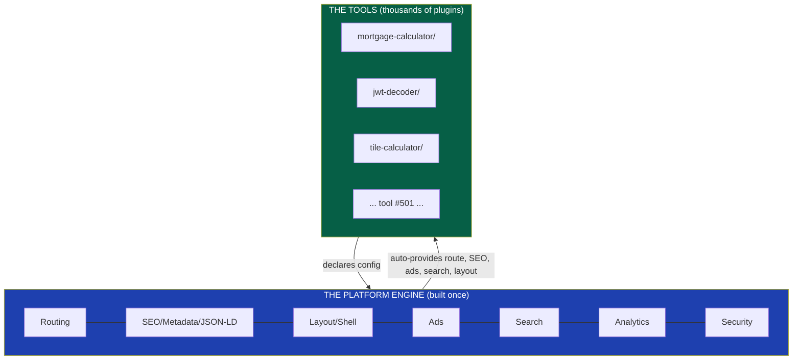
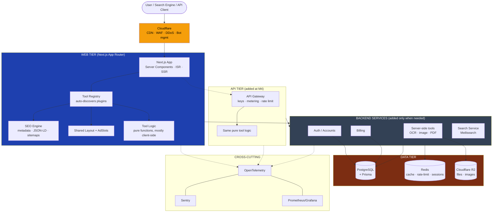
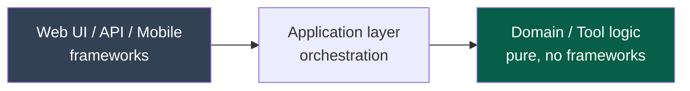
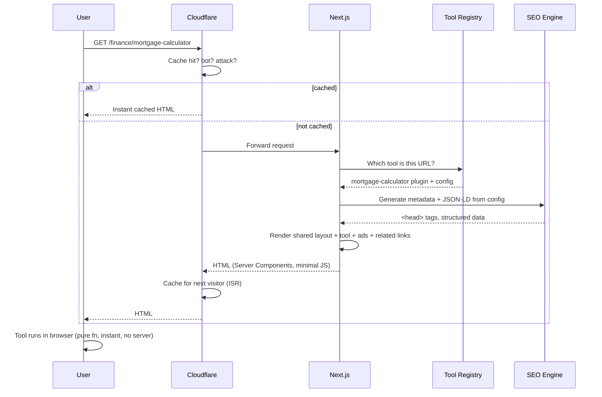

# 04 — Architecture Overview

> **Status:** Draft v1 · **Owner:** CTO / Principal Architect · **Audience:** All engineers — this is the map everyone navigates by
> **Governed by:** `00`–`03`. This document is the *system-level* picture. Individual layers get their own deep-dive chapters (`10`–`13`, `20`–`25`, etc.); this one shows how they fit together and *why the shape is what it is*.

---

## 1. Purpose — The Map Before the Territory

Every chapter after this one zooms into one component. This chapter is the **whole map**: what the major pieces are, how a request flows through them, where data lives, and — most importantly — *what we deliberately do NOT build yet*.

**Simple explanation:** before builders start on individual rooms, everyone looks at one blueprint of the whole house — where the plumbing runs, where the load-bearing walls are, which rooms exist now and which are "future extension, foundation only." This is that blueprint. If a later decision contradicts this map, we either update the map deliberately or reject the decision.

---

## 2. The Central Architectural Idea

Everything in UToolios flows from one decision:

> **The tool is a self-contained plugin. The platform is a thin, powerful engine that discovers plugins and gives each one a fully-optimized home automatically.**

This single idea is the source of nearly every technical decision in the rest of the docs. Two layers, cleanly separated:

- **The Platform Engine** — routing, SEO generation, ads, search, layout, analytics, security. Written once. Rarely changes.
- **The Tools** — thousands of independent plugins. Each is a folder. Each declares what it is; the engine does the rest.

**Simple explanation:** think of a shopping mall. The mall (engine) provides the building, security, signage, parking, and foot traffic. Each shop (tool) just moves into a standard unit and starts selling. The shop doesn't build its own plumbing or hire its own security — the mall provides all of that. Adding shop #501 means signing one lease (adding one folder), not constructing a new building.

Why this matters: it's the technical expression of Bet B2 (uniformity scales). Get this separation right and the platform's cost per tool approaches zero. Get it wrong and every tool becomes a custom project.

---

## 3. The System at 30,000 Feet

Here is the full system as it will exist at scale (M3–M4). Not all of it is built on day one — Section 6 shows what's built now vs. later.

**Simple explanation of the flow:** a visitor hits Cloudflare (which caches, filters bots, and blocks attacks), then reaches the Next.js app. The app looks up which tool the URL maps to, wraps it in the standard layout with SEO and ads, and serves it — mostly as fast static/cached HTML. Only tools that truly need a server (or logged-in/API features) reach the backend services and database.

---

## 4. The Layers, Explained

| Layer | Responsibility | Key technologies | Deep-dive chapter |
|-------|----------------|------------------|-------------------|
| **Edge / CDN** | Cache, protect, route globally | Cloudflare CDN, WAF, R2 | `43` |
| **Web Tier** | Render tools, SEO, layout, ads | Next.js App Router, React, TS, Tailwind | `10`, `14`–`19` |
| **Tool Plugins** | The actual utilities | TS pure functions + config | `13` |
| **API Tier** | Expose tool logic programmatically | Route handlers / gateway, metering | `22` |
| **Backend Services** | Auth, billing, heavy compute, search | NestJS (*when justified*), Meilisearch | `11`, `23`, `24`, `32` |
| **Data Tier** | Persist state and cache | PostgreSQL + Prisma, Redis, R2 | `12`, `21` |
| **Cross-cutting** | See everything, stay secure | OpenTelemetry, Sentry, Prometheus/Grafana | `25`, `28`–`30` |

**The dependency rule (Clean Architecture, `00`):** dependencies point *inward* toward pure logic. The tool's math (`calculator.ts`) knows nothing about React, Next.js, or the database. The web tier depends on the logic; the logic never depends on the web tier. This is what lets the same logic power web, API, and mobile (`03`, R4).

**Simple explanation:** the valuable core (the math and rules) sits in the middle, protected, knowing nothing about the outside world. Frameworks are like removable adapters plugged in around it. Swap Next.js for something else in five years? The core is untouched. This is *why* the platform can survive 10 years without a rewrite — the part most likely to change (frameworks) is kept away from the part that must stay stable (logic).

---

## 5. Request Lifecycle — Following One Visit

To make the architecture concrete, here's what happens when someone visits `/finance/mortgage-calculator`:

**Simple explanation:** most visits never touch our servers at all — Cloudflare serves a cached copy instantly. When it does reach Next.js, the engine looks up the tool, auto-generates all its SEO, wraps it in the standard layout, and sends back lightweight HTML. The actual calculation then runs on the user's device. This is *why* it's fast (B4), cheap (`03` economics), and scalable — the expensive path (our servers) is the rare path.

---

## 6. What We Build Now vs. Later — The Phased Architecture

This is the most important section for a solo founder building daily. We do **not** build the full diagram in Section 3 on day one. We build the load-bearing walls and defer the furniture (`00`, Prime Directive).

```mermaid
flowchart LR
    subgraph P1["PHASE 1 — Foundation (build now)"]
        A1[Next.js app + plugin engine]
        A2[Tool registry + SEO engine]
        A3[Cloudflare CDN/WAF]
        A4[Client-side tools]
        A5[Static search index]
    end
    subgraph P2["PHASE 2 — Traction"]
        B1[PostgreSQL + Redis]
        B2[Meilisearch]
        B3[Server-side tools isolated]
        B4[Analytics + observability]
    end
    subgraph P3["PHASE 3 — Scale/Platform"]
        C1[Auth + accounts]
        C2[Premium + billing]
        C3[Public API + metering]
        C4[Dedicated backend services]
    end
    P1 --> P2 --> P3
    style P1 fill:#065f46,color:#fff
    style P2 fill:#1e40af,color:#fff
    style P3 fill:#334155,color:#fff
```

| Phase | Build | Deliberately DON'T build yet | Reasoning |
|-------|-------|------------------------------|-----------|
| **1 (now)** | Plugin engine, SEO engine, client-side tools, CDN | Database, backend, auth, API, search service | Zero users; a pure static/edge site needs almost no backend and gets 100 Lighthouse cheaply |
| **2** | DB, Redis, Meilisearch, observability, isolated server-tools | Auth, billing, public API | Traffic exists; now we need search-at-scale + measurement |
| **3** | Auth, premium, billing, public/white-label API | Enterprise unless a customer pulls it | Audience is large enough that monetization multiplies real numbers |

**Simple explanation:** we lay the foundation and frame the whole house (Phase 1), but we only furnish and wire the rooms people actually start using (Phases 2–3). Crucially, Phase 1 leaves the *doorways* for later phases (auth seam, API seam, replaceable interfaces) so nothing later requires knocking down walls.

---

## 7. The Backend Question — My Full CTO Recommendation

You specified **NestJS** for the backend. I owe you a real argument here, because this is a genuine fork in the road (`00`: challenge assumptions).

### My position
> **Keep NestJS in the *target* architecture, but do NOT build a NestJS service in Phase 1. Start with Next.js Route Handlers for the little backend logic we need, and introduce NestJS only when we have real, sustained server-side complexity (Phase 2–3).**

### Why (the reasoning)

**Fact 1 — Most tools need no backend at all.** By `02` (C3/C5), the majority of tools are pure client-side functions. A mortgage calculator, JWT decoder, or word counter runs entirely in the browser. For these, *any* backend is dead weight.

**Fact 2 — The web tier already has a backend.** Next.js App Router ships Server Components and Route Handlers — a capable server runtime. For Phase 1's needs (sitemaps, a contact form, light API stubs), this is sufficient and requires *zero* extra service to deploy, secure, and monitor.

**Fact 3 — Running a second service has real, ongoing cost.** A standalone NestJS service means another container, another deploy pipeline, another thing to secure, patch, monitor, and pay for — at a stage with zero revenue. That's operational overhead bought before there's anything to run in it.

**Fact 4 — NestJS earns its keep later, and we preserve that.** NestJS shines when you have substantial server-side domains: accounts, billing, a metered public API, background jobs, complex authorization. Those are real (Phase 3). Because our tool logic is *framework-free* (`00`), lifting it into a NestJS service later is a *move*, not a *rewrite*.

### The trade-off, honestly stated

| Approach | Pros | Cons |
|----------|------|------|
| **NestJS from day 1 (as briefed)** | One "final" backend; no migration later; clear structure | Overhead with no users; slows Phase 1; violates YAGNI; a service with almost nothing in it |
| **Next.js handlers now → NestJS later (my rec)** | Ship faster, cheaper, simpler now; add NestJS when it's justified | One future "extract to NestJS" migration (made cheap by Clean Architecture) |

**Simple explanation:** NestJS is a big, well-organized office building for a large team. Right now we're one founder — renting an entire office tower before hiring anyone is waste. We keep the *plans* for the tower (target architecture) and design our current setup so moving in later is easy, but we don't pay the tower's rent until we have people (complexity) to fill it.

> **CTO note:** this is not rejecting your stack — NestJS stays in the target design and gets its own chapter (`11`). It's *sequencing* the stack to match reality. This is the exact discipline `00` demands: build load-bearing walls (framework-free logic, clean seams) now; add the heavy service (furniture) when there's a real need. If you want NestJS in Phase 1 regardless, I'll design it that way — but I'd be doing you a disservice not to state the cost first.

### The same logic applies to other Phase-1 deferrals
- **Meilisearch:** at <100 tools, a *static, prebuilt search index* served from the edge is faster, free, and simpler. Meilisearch earns its place when the catalog and query volume grow (Phase 2). (`32-SEARCH`.)
- **PostgreSQL/Redis:** unnecessary until we store state (accounts, saved data, metering). Phase 1 tools are stateless. (`12`, `21`.)

---

## 8. Cross-Cutting Concerns (Present in Every Layer)

Some concerns aren't a "layer" — they run through everything. They are designed in from the start because retrofitting them is the expensive kind of work (`00`, non-negotiables).

| Concern | How it's woven in | Chapter |
|---------|-------------------|---------|
| **Security** | CSP, headers, validation at every boundary, WAF at edge | `25`, `26` |
| **SEO** | Auto-generated per tool from config | `14`–`18` |
| **Performance** | Budgets enforced in CI; edge caching default | `20`, `21` |
| **Accessibility** | Shared accessible components; CI a11y gates | `37` |
| **Observability** | OpenTelemetry traces across web/API/services | `28`–`30` |
| **Type safety** | TypeScript end-to-end; schema validation at boundaries | `08`, `12` |

**Simple explanation:** these are like the electrical and plumbing of the house — they don't belong to one room, they run behind every wall. You install them while framing the house, not after the drywall is up.

---

## 9. Why This Architecture Survives 10 Years Without a Rewrite

The brief's core demand is "no architectural rewrites for 10 years." Here's specifically how this design delivers that:

1. **Framework-independent core.** The part most likely to change (Next.js, ad networks, search engines) is kept *outside* the stable core (tool logic). Swapping any of them is a contained change (`00`, 4.10 Replaceable).
2. **Plugin isolation.** 1,000 tools can't create 1,000 architectural entanglements because each is a sealed folder that only talks to the engine through one contract (`13`).
3. **Phased growth with pre-built seams.** We never "discover" we need auth/API/backend and have to tear things open — the seams are there from Phase 1, just unused.
4. **Everything replaceable.** No vendor (Cloudflare, AdSense, Meilisearch, even the DB host) is welded in; each sits behind our own interface.

**Simple explanation:** rewrites happen when a change you didn't plan for forces you to rip out the foundations. We prevent that two ways: keep the foundation (logic) independent of the things that change (frameworks/vendors), and pre-install the doorways for growth. Change then means *swapping a part* or *walking through a doorway* — never *demolishing the house*.

---

## 10. Summary

- **One central idea:** a thin, powerful **engine** + thousands of self-contained **tool plugins**. This is the source of almost every other decision.
- **Clean layering** with dependencies pointing inward to **framework-free tool logic** — the reason the same code serves web, API, and mobile, and the reason we avoid rewrites.
- **Most requests never hit our servers** (edge-cached, client-side compute) — the source of our speed and favorable economics.
- **Phased build:** foundation + walls now (engine, SEO, CDN, client-side tools); database, search, and backend services added as traction demands; auth/premium/API at scale — always with **seams pre-built** so nothing later requires a rewrite.
- **My key recommendation:** keep NestJS/Meilisearch/Postgres in the *target* architecture but **defer them past Phase 1**; start with Next.js Route Handlers and a static search index. This matches reality (zero users, most tools client-side) without foreclosing the future.
- **Cross-cutting concerns** (security, SEO, performance, a11y, observability, types) are woven into every layer from the start, because they're the expensive things to retrofit.

> Next: `05-MONOREPO-STRATEGY.md` — how we physically organize all of this code (pnpm workspace + Turborepo) so the engine, the tools, and shared packages coexist cleanly and build fast.

---

### Changelog
| Version | Date | Change | Reason |
|---------|------|--------|--------|
| v1 | (draft) | Initial architecture overview | Project inception |
