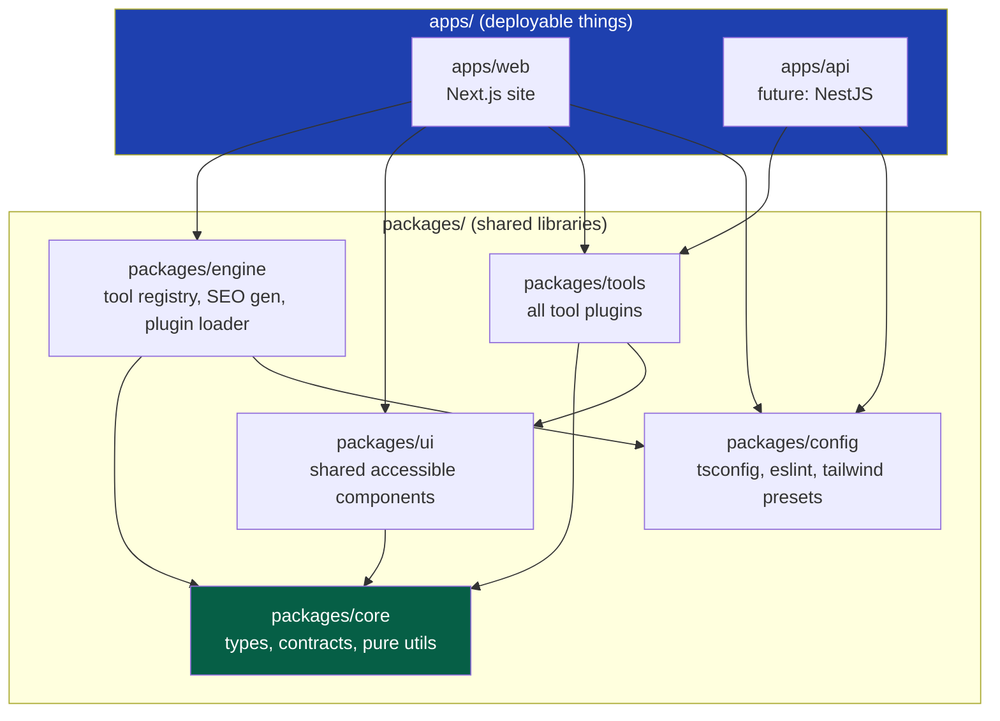
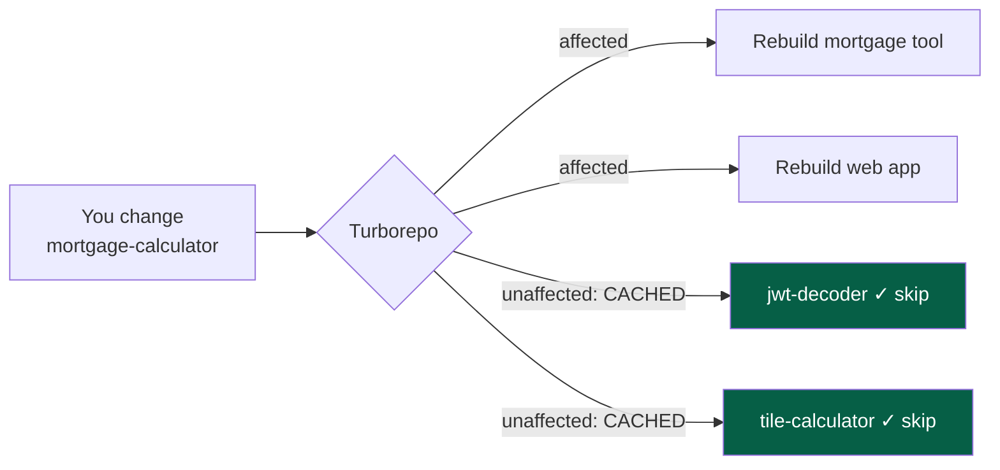
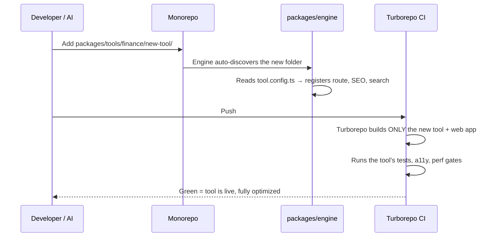

# 05 — Monorepo Strategy

> **Status:** Draft v1 · **Owner:** CTO / Platform Architect · **Audience:** All engineers; especially anyone setting up the repo or adding a package
> **Governed by:** `00`–`04`. This document decides *how all our code physically lives together* — one repository, many packages — and why. The concrete folder tree is detailed in `06-REPOSITORY-STRUCTURE.md`; this chapter is the *strategy and reasoning* behind it.

---

## 1. The Decision in One Sentence

> **We use a single repository (a monorepo) containing multiple packages, managed by a pnpm workspace and orchestrated by Turborepo.**

Everything — the web app, the tool plugins, shared UI, shared config, the future API and backend — lives in **one Git repository**, split into clearly-bounded **packages** that can depend on each other in controlled ways.

**Simple explanation:** think of a monorepo as one big, well-organized filing cabinet for the whole company, with labeled drawers (packages) for each area. The alternative — a separate cabinet in a separate room for every area (many repos) — means constantly walking between rooms to keep things in sync. For a small team building many interconnected tools, one well-organized cabinet is far easier to manage.

---

## 2. Monorepo vs. Polyrepo — Why We Chose One Repo

This is a foundational decision with long-term consequences, so it deserves a real justification (`00`: explain *why*).

| Dimension | Monorepo (our choice) | Polyrepo (many repos) |
|-----------|----------------------|------------------------|
| **Sharing code** | Import a shared package directly; one version everywhere | Publish/version packages; painful sync |
| **Atomic changes** | One commit can change engine + all affected tools | Coordinated PRs across repos; drift |
| **Consistency** | One lint config, one TS config, one CI | Each repo drifts into its own conventions |
| **Onboarding** | Clone once, see everything | Hunt for which repos matter |
| **Refactoring** | Rename across the whole codebase in one PR | Cross-repo refactor is a multi-day saga |
| **Tooling cost** | Needs Turborepo to stay fast | Simpler per-repo, but N times the setup |
| **Access control** | Coarser (whole repo) | Fine-grained per repo |

### Why monorepo wins *for us specifically*

**Reason 1 — The engine and tools are tightly coupled by design.** Our whole architecture (`04`) is "one engine + many plugins." The engine and the plugins evolve together. In a polyrepo, changing the plugin contract would mean a synchronized release across 1,000 tool repos — an operational nightmare. In a monorepo, it's one commit and CI validates every tool at once.

**Reason 2 — One founder / small team.** The main downside of monorepos (fine-grained access control, team autonomy) doesn't apply when the team is tiny. The main upside (everything in one place, consistent, refactorable) is exactly what a solo daily builder needs.

**Reason 3 — Consistency is our architecture (`00`, §6.2).** A monorepo lets us enforce one set of standards (lint, format, TS, test, CI) across everything. Polyrepos inevitably drift — repo #40 ends up with different rules than repo #1.

**Reason 4 — AI-assisted development (B3).** An AI generating a new tool needs to *see* the conventions and shared packages to follow them. In a monorepo, all the context is in one place. Across many repos, the AI lacks the full picture.

> **CTO note:** The classic monorepo objection is "it gets slow and huge at scale." That's real for giant companies (Google-scale), and it's solved by tooling — which is exactly why Turborepo is in our stack. For our scale (thousands of small tool folders, not billions of lines), a monorepo stays comfortably fast with proper caching. We are not big enough to hit the problems polyrepos solve, but we are complex enough to feel the pain polyrepos cause.

---

## 3. The Package Topology

Inside the one repo, code is split into packages with a strict dependency direction. This is the physical embodiment of Clean Architecture (`04`, §4).

**The golden dependency rule:** arrows point *toward* `packages/core`, never away from it. `core` (types, contracts, pure utilities) depends on **nothing**. Tools depend on core (and shared UI). Apps depend on everything. Nothing depends on the apps.

**Simple explanation:** `core` is the trunk of the tree; everything else is branches growing outward. A branch can lean on the trunk, but the trunk never leans on a branch. This is why we can change the website (`apps/web`) freely without breaking tool logic — the logic never depends on the app.

### What each package is for

| Package | Contains | Depends on | Why it's separate |
|---------|----------|------------|-------------------|
| `apps/web` | The Next.js site (routes, pages, layout) | engine, ui, tools, config | The deployable web product |
| `apps/api` *(later)* | The public/backend API (NestJS in Phase 3) | tools, core, config | Separate deployable; reuses tool logic |
| `packages/core` | Types, the ToolConfig contract, pure helpers | nothing | The stable center; must never depend on frameworks |
| `packages/engine` | Tool discovery, SEO generation, registry | core | The reusable platform brain |
| `packages/tools` | Every tool plugin (one folder each) | core, ui | The product content; isolated per tool |
| `packages/ui` | Shared accessible React components | core | One consistent, accessible design system |
| `packages/config` | Shared tsconfig, eslint, prettier, tailwind | nothing | Single source of truth for standards |

> **CTO note on `packages/tools`:** whether tools live in one package or many is a real decision. We start with **one `tools` package containing category subfolders**, because at Phase 1 scale that's simplest (KISS). If build performance ever demands it, Turborepo lets us split tools into per-category packages *without changing the plugin contract* — another example of a pre-built seam (`04`, §9). We defer that split until data says we need it (YAGNI).

---

## 4. Why pnpm (Not npm or Yarn)

The brief specifies pnpm; I fully agree, and here's the reasoning so the team understands it rather than just obeying it.

| Feature | Why it matters for us |
|---------|------------------------|
| **Disk efficiency (content-addressable store)** | pnpm stores each package version once on disk and hard-links it. With many packages sharing dependencies, this saves gigabytes and speeds installs. |
| **Strict dependency isolation** | pnpm doesn't flatten `node_modules`, so a package can only import what it *explicitly* declares. This *prevents* the accidental hidden coupling that `00` forbids (Anti-Principle "hidden coupling"). |
| **First-class workspaces** | Native support for `workspace:*` dependencies — packages reference each other by name, always the local version. |
| **Speed** | Faster, more reliable installs than npm/Yarn Classic, which matters for CI and daily dev. |

**Simple explanation of "strict isolation":** with npm, all dependencies get dumped into one shared pile, so a package can accidentally use something it never asked for — and then break when that thing moves. pnpm gives each package its own clearly-labeled shelf; you can only use what's on *your* shelf. This catches coupling bugs at install time instead of in production.

**Example of the isolation benefit:** if `packages/tools` tries to `import` something only `apps/web` installed, pnpm errors immediately — "you didn't declare this dependency." That error is a *good thing*: it caught a Clean Architecture violation (a tool reaching into the app) before it shipped.

---

## 5. Why Turborepo

A monorepo without a task orchestrator becomes slow — every change rebuilds and re-tests everything. Turborepo fixes this with a smart build graph and caching.

### What Turborepo gives us

| Capability | What it does | Why it matters |
|------------|--------------|----------------|
| **Task graph** | Understands which packages depend on which | Knows the correct build/test order automatically |
| **Affected-only** | Only rebuilds/tests packages touched by a change | Editing one tool doesn't rebuild 999 others |
| **Local caching** | Reuses previous results if inputs unchanged | Re-running an unchanged build is instant |
| **Remote caching** | Shares cache across machines/CI | CI reuses your local build; teammates reuse each other's |
| **Parallelism** | Runs independent tasks concurrently | Faster overall builds |

**Simple explanation:** Turborepo is a smart foreman. When you change one tool, it says "only this tool and the web app are affected — I'll rebuild those and skip the other 999, and if I've built any of this exact code before, I'll reuse the result instead of redoing it." This is what keeps a monorepo of 1,000+ tools fast enough to build daily.

**Concrete payoff:** without Turborepo, adding tool #501 might trigger a full rebuild/test of all 500 existing tools — minutes of waiting on every change. With it, only the new tool and the app rebuild — seconds. This directly protects developer experience (`00`, Tier 3) and CI cost.

---

## 6. How This Serves the "One Folder = One Tool" Promise

The vision's core mechanical test (`01`, M1) is: *adding a tool = adding one folder, no other code changes.* The monorepo strategy is what makes that literally true.

**Simple explanation:** because all tools live in one predictable place (`packages/tools`) and the engine scans that place, dropping in a new folder is *automatically* seen. Because Turborepo only builds what changed, adding that folder is fast. Because everything shares one CI config, the new tool is held to the exact same quality bar as every other tool — automatically. The monorepo is the machinery that makes "one folder" real.

---

## 7. Trade-offs We Accept (Honesty About the Downsides)

No decision is free. Here's what we're accepting and how we mitigate it.

| Downside of monorepo | Severity for us | Mitigation |
|----------------------|-----------------|------------|
| Single repo can grow large | Low–Medium | Turborepo caching; git sparse-checkout if ever needed |
| Coarse access control | Low (small team) | Revisit with `CODEOWNERS` when teams grow |
| One broken commit can affect everything | Medium | Strong CI gates (`40`), required checks, branch protection (`48`) |
| Everyone sees all code | Low | Acceptable now; a benefit for AI context and consistency |
| Tooling learning curve (Turborepo/pnpm) | Low | Documented here + `07-DEVELOPMENT-WORKFLOW` |

> **CTO note:** the "one broken commit affects everything" risk is the one to take seriously. It's why the monorepo strategy is *inseparable* from strong CI (`40-CI-CD`) and branch protection (`48-BRANCHING`). The monorepo gives us the power to change everything at once; CI is the seatbelt that stops us from breaking everything at once. Never run this monorepo without that seatbelt.

---

## 8. Migration Path (If We Ever Outgrow a Pure Monorepo)

We don't expect to, but a 10-year document plans for it. Because packages have clean boundaries and `core` depends on nothing, any package *could* be extracted to its own repo later with limited pain. The clean dependency direction (Section 3) is what keeps that door open — yet another pre-built seam (`04`, §9).

**Simple explanation:** we're renting one big house now, but every room has its own clearly-defined walls and its own door. If one room ever needs to become a separate building, we can lift it out cleanly — because we never let the rooms grow into each other.

---

## 9. Summary

- **One repository, many packages**, via **pnpm workspace + Turborepo** — because our engine and tools are tightly coupled by design, our team is small, and consistency is our architecture.
- **Strict dependency direction** toward `packages/core` (which depends on nothing) — the physical form of Clean Architecture and the reason the site can change without breaking tool logic.
- **pnpm** gives disk efficiency and, crucially, **strict isolation** that catches hidden-coupling bugs at install time.
- **Turborepo** keeps a 1,000+ tool monorepo fast by rebuilding/testing only what changed and caching everything else — the machinery behind the "one folder = one tool" promise.
- We **accept the trade-offs honestly**, and pair the monorepo's power with strong CI/branch protection as its mandatory seatbelt.
- Clean package boundaries keep the **door open** to extracting any package to its own repo later, if we ever outgrow this — but we don't build for that day now (YAGNI).

> Next: `06-REPOSITORY-STRUCTURE.md` — the exact folder tree: what every directory is, where a tool's files go, and the naming that makes the whole thing navigable by humans and AI alike.

---

### Changelog
| Version | Date | Change | Reason |
|---------|------|--------|--------|
| v1 | (draft) | Initial monorepo strategy | Project inception |
