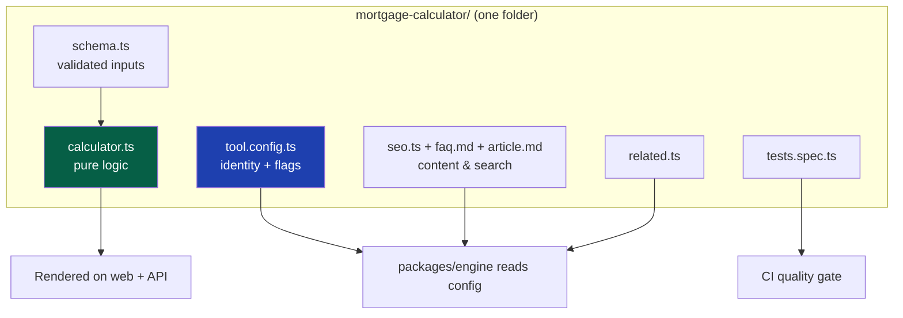
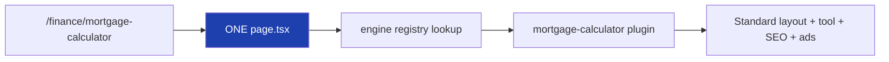
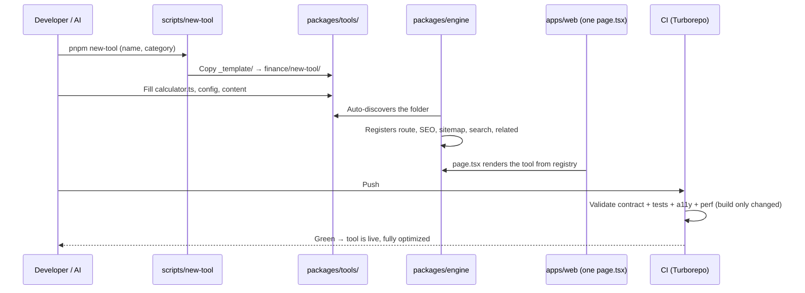

# 06 — Repository Structure

> **Status:** Draft v1 · **Owner:** CTO / Platform Architect · **Audience:** Everyone who opens the repo, adds a file, or generates a tool (human or AI)
> **Governed by:** `00`–`05`. `05-MONOREPO-STRATEGY.md` decided *one repo, many packages, and why*. This document defines the *exact folder tree*: what every directory is, where each file goes, and the conventions that let anyone (or any AI) navigate it without guessing.

---

## 1. Why the Folder Structure Is Architecture, Not Housekeeping

Where files live is not cosmetic. In a plugin platform, **the folder structure *is* the API for adding a tool.** Because the engine auto-discovers tools by scanning folders (`04`, §2), a wrongly-placed file means a tool that doesn't register, doesn't get SEO, or doesn't build. The layout must be so predictable that "where does this go?" never has two answers.

**Simple explanation:** in a library, books are shelved by a strict system (fiction A–Z, then non-fiction by subject). You can find any book without asking a librarian, and shelving a new book has exactly one correct spot. Our repo is that library. This document is the shelving system. If everyone shelves the same way, a tiny team (and AI) can manage a huge collection.

**Why this matters most for AI (B3):** a human can *guess* where a file probably goes. An AI generating tool #501 needs a rule so precise there's nothing to guess. Every convention below is written to be mechanically followable.

---

## 2. The Top-Level Tree

```
utoolios/
├── apps/                      # Deployable applications
│   ├── web/                   # The Next.js website (the product)
│   └── api/                   # (Phase 3) Public/backend API — NestJS
│
├── packages/                  # Shared libraries (not directly deployed)
│   ├── core/                  # Types, the ToolConfig contract, pure utils (depends on NOTHING)
│   ├── engine/                # Tool registry, SEO generation, plugin loader
│   ├── tools/                 # ALL tool plugins live here (the product content)
│   ├── ui/                    # Shared, accessible React components (design system)
│   └── config/                # Shared tsconfig, eslint, prettier, tailwind presets
│
├── docs/                      # This engineering constitution (00–52)
│
├── scripts/                   # Automation: generators, validators, migrations
│
├── .github/                   # GitHub Actions workflows, issue/PR templates, CODEOWNERS
│
├── turbo.json                 # Turborepo task graph + cache config
├── pnpm-workspace.yaml        # Declares which folders are workspace packages
├── package.json               # Root scripts + dev dependencies
├── tsconfig.base.json         # Base TypeScript config extended by all packages
└── README.md                  # Entry point: how to run, where to look
```

**Simple explanation:** three top-level ideas. `apps/` = things we *ship* (the website). `packages/` = shared building blocks the apps are made of. `docs/` = the rulebook. Everything else at the root is configuration and automation. If you're looking for a *feature*, it's in `packages/`. If you're looking for the *running product*, it's in `apps/`.

### The mapping to `05`'s package topology

| Folder | Role (from `05`) | Depends on |
|--------|------------------|------------|
| `apps/web` | Deployable web product | engine, ui, tools, config |
| `apps/api` | Deployable API (Phase 3) | tools, core, config |
| `packages/core` | Stable center | nothing |
| `packages/engine` | Platform brain | core |
| `packages/tools` | All tool plugins | core, ui |
| `packages/ui` | Design system | core |
| `packages/config` | Shared standards | nothing |

---

## 3. Inside `packages/tools/` — The Heart of the Platform

This is where the product actually lives. Tools are grouped by **category**, and each tool is **one self-contained folder** (`02`, C8).

```
packages/tools/
├── finance/
│   ├── mortgage-calculator/
│   ├── salary-calculator/
│   ├── interest-calculator/
│   └── ...
├── developer/
│   ├── jwt-decoder/
│   ├── json-formatter/
│   ├── regex-tester/
│   └── ...
├── home/
│   ├── paint-calculator/
│   ├── tile-calculator/
│   └── ...
├── health/
│   ├── bmi-calculator/
│   └── ...
├── _template/                 # The canonical starter every new tool is copied from
└── index.ts                   # Auto-generated registry export (never hand-edited)
```

**Why category folders:** they map directly to URLs (`/finance/mortgage-calculator`, via Convention over Configuration, `00`, 4.7) *and* to SEO content clusters (`17`, topic authority). The folder structure and the SEO strategy are the same structure — no translation layer.

**Simple explanation:** categories are like departments in a store. "Finance" is one aisle, "Developer" is another. A tool lives in exactly one aisle, and that aisle name becomes part of its web address automatically. Organizing shelves and organizing the website are the same act.

> **CTO note on the `_template/` folder:** this is deliberately the single most important folder for scaling. Every new tool — human- or AI-made — is a *copy of `_template/`* with the blanks filled in. This guarantees uniformity (`00`, §6.2) and gives AI a concrete example to follow rather than a description to interpret. The underscore prefix keeps it sorted to the top and signals "not a real tool." We invest heavily in keeping `_template/` perfect, because its quality is inherited by every tool after it.

---

## 4. Inside a Single Tool Folder — The Plugin Contract Files

This is the exact structure the brief specified, with the reasoning for each file. Every tool has *these files, with these names*. Predictable names are what make auto-discovery and AI generation possible.

```
mortgage-calculator/
├── tool.config.ts     # WHO the tool is: id, title, category, flags (ads, related, etc.)
├── schema.ts          # WHAT inputs it accepts: validated input/output shapes (Zod)
├── calculator.ts      # THE LOGIC: pure function, no framework imports (the "brain")
├── seo.ts             # SEO specifics: keywords, description, canonical hints
├── faq.md             # FAQ content → powers FAQ JSON-LD + on-page FAQ
├── article.md         # Long-form content for SEO depth + human help
├── examples.ts        # Worked examples (used in content + as test fixtures)
├── related.ts         # IDs of related tools → internal linking (18)
├── tests.spec.ts      # Correctness tests (C2) — CI blocks merge if failing
└── icon.svg           # The tool's icon (accessible, optimized)
```

### What each file is responsible for

| File | Responsibility | Simple explanation | Enforces (from `02`) |
|------|----------------|--------------------|-----------------------|
| `tool.config.ts` | Identity + platform flags | The tool's "ID card" the engine reads | C10 consistency |
| `schema.ts` | Input/output validation | The "form rules" — what's allowed in | Security, C2 correctness |
| `calculator.ts` | Pure business logic | The "brain" — just math, no UI | Clean Architecture, C3 |
| `seo.ts` | Search metadata | The "signboard" for Google | SEO (B1) |
| `faq.md` | Questions & answers | Common questions, in one place | C4 explain |
| `article.md` | Long-form content | The "help article" for depth | SEO depth (B1) |
| `examples.ts` | Worked examples | "Here's a real one worked out" | C4 explain |
| `related.ts` | Links to sibling tools | "You might also need…" | C9 connected |
| `tests.spec.ts` | Automated correctness checks | The "quality inspector" | C2 correctness |
| `icon.svg` | Visual identity | The tool's face | C10 consistency |



**Simple explanation of the whole folder:** everything one tool needs — its identity, its rules, its math, its content, its links, its tests, its icon — lives together in one box. You can understand a tool by opening one folder, and you can delete a tool by deleting one folder (`02`, C8). Nothing about the mortgage calculator is scattered anywhere else in the repo.

**Why separate files instead of one big file:** separation of concerns (`00`, SOLID). The *logic* (`calculator.ts`) can be tested and reused (for the API) without touching content. The *content* (`article.md`) can be edited by a writer or AI without risking the math. Each file has one job and one reason to change.

---

## 5. Inside `packages/engine/` — The Platform Brain

The engine is what turns a folder into a live, optimized tool. It's built once and rarely changes.

```
packages/engine/
├── registry/          # Discovers tool folders, builds the master list of tools
├── seo/               # Generates metadata, JSON-LD, canonical URLs from tool config
├── sitemap/           # Generates sitemap.xml, image sitemaps from the registry
├── routing/           # Maps category/slug → tool (Convention over Configuration)
├── related/           # Resolves related.ts IDs into real links
├── search/            # Builds the search index from tool metadata
└── validation/        # Validates every tool against the contract at build time
```

**Simple explanation:** if `packages/tools` is the content, `packages/engine` is the machine that *displays and optimizes* that content. When you add a tool folder, the engine's `registry` notices it, `routing` gives it a URL, `seo` writes its Google tags, `sitemap` adds it to the sitemap, and `validation` checks it follows the rules. The tool author writes none of that — the engine does it all from the config.

> **CTO note:** `validation/` is the unsung hero. It runs at build time and *rejects* any tool that breaks the contract — missing `calculator.ts`, no tests, malformed config. This is how the plugin contract (`00`, N2) goes from "a rule we hope people follow" to "a rule the build enforces." Without it, the plugin architecture degrades into 1,000 slightly-different snowflakes over time.

---

## 6. Inside `apps/web/` — The Website

```
apps/web/
├── app/                       # Next.js App Router
│   ├── [category]/            # Dynamic route → category pages
│   │   └── [tool]/            # Dynamic route → individual tool pages
│   │       └── page.tsx       # ONE page file renders ANY tool (from registry)
│   ├── (marketing)/           # Homepage, about, etc.
│   ├── sitemap.ts             # Reads engine's sitemap generator
│   ├── robots.ts              # robots.txt
│   └── layout.tsx             # Root layout: shell, ads, analytics, SEO defaults
├── components/                # Web-only components (not shared → those go in packages/ui)
├── lib/                       # Web-only helpers
└── public/                    # Static assets, ads.txt, favicons
```

**The single most important file: `app/[category]/[tool]/page.tsx`.** There is **one** page file that renders **every** tool. It reads the URL, asks the engine for the matching tool, and renders it in the standard layout. This is the technical realization of "no frontend code changes to add a tool" (the brief's core requirement).

**Simple explanation:** we do *not* have 1,000 page files for 1,000 tools. We have *one* page template that knows how to display any tool by looking it up. Adding a tool adds a folder in `packages/tools`; the one page file automatically renders it. This is the difference between a plugin platform and a pile of pages.



---

## 7. Supporting Folders

| Folder | Contains | Why it exists |
|--------|----------|----------------|
| `scripts/` | Tool generator, contract validator, data migrations | Automation First (`00`, 4.5) — e.g. `pnpm new-tool` scaffolds from `_template/` |
| `docs/` | Chapters 00–52 | The constitution; the source of truth for *why* |
| `.github/` | CI workflows, PR/issue templates, `CODEOWNERS` | The seatbelt (`05`, §7): quality gates + branch protection |
| `config/` (package) | Shared lint/TS/format/tailwind | One source of standards; no per-package drift |

**Simple explanation of `scripts/new-tool`:** instead of hand-copying `_template/`, a developer (or AI) runs one command, answers a few prompts (name, category), and gets a correctly-structured, ready-to-fill tool folder. This makes the "right way" also the "easy way" — the best kind of enforcement.

---

## 8. Naming and Placement Rules (The Non-Negotiable Conventions)

These rules are what make the structure *predictable enough to automate*. They are enforced by lint rules and the engine validator where possible.

| Rule | Example | Why |
|------|---------|-----|
| Tool folder = `kebab-case`, matches its slug | `mortgage-calculator` → `/finance/mortgage-calculator` | URL = folder (Convention over Config) |
| Category folder = single lowercase word | `finance`, `developer`, `home` | Clean, stable URL segments |
| Contract files use exact fixed names | `calculator.ts`, not `calc.ts` or `logic.ts` | Auto-discovery needs zero guessing |
| Shared code goes in `packages/`, never duplicated in a tool | A shared date helper → `packages/core` | DRY (`00`); no cross-tool imports (C8) |
| Web-only code stays in `apps/web` | A homepage hero → `apps/web/components` | Keeps `packages/` reusable & framework-light |
| No tool imports another tool | mortgage never imports from tile | Deletable, isolated (C8) |
| `_`-prefixed = not a real tool | `_template/` | Sorts to top; excluded from registry |

> **CTO note:** the "exact fixed file names" rule is the linchpin of AI generation. Because *every* tool has a `calculator.ts` in the same place, an AI prompt can be "put the logic in `calculator.ts`" and it works every time. If we allowed `calc.ts`, `logic.ts`, `index.ts` interchangeably, the engine couldn't auto-discover and AI couldn't reliably generate. **Boring, rigid naming is a feature, not a limitation** — it's what buys us automation.

(Full naming conventions across the codebase — variables, components, functions — are in `09-NAMING-CONVENTIONS.md`. This chapter covers *folder and file* placement specifically.)

---

## 9. How a New Tool Flows Through the Structure

Tying it together — the end-to-end path of adding tool #501:



**Simple explanation:** run one command, fill in one folder, push. The structure and the engine do everything else — routing, SEO, sitemap, search, related links, quality checks. That's the whole promise of the platform, made physical by this folder layout.

---

## 10. Summary

- The **folder structure is the API for adding a tool** — so it's designed to be so predictable there's never a second guess about where a file goes.
- **Three top-level ideas:** `apps/` (what we ship), `packages/` (shared building blocks), `docs/` (the rulebook) — plus root config and `scripts/` automation.
- **`packages/tools/`** groups tools by **category** (which becomes the URL and the SEO cluster), each tool a **single self-contained folder** with **fixed-name contract files** (`calculator.ts`, `tool.config.ts`, etc.).
- **`packages/engine/`** turns folders into optimized live tools; its `validation/` step *enforces* the plugin contract at build time.
- **`apps/web`** renders every tool through **one `page.tsx`** — the technical proof that adding a tool needs no frontend changes.
- **Rigid naming conventions** are deliberate: boring, fixed names are exactly what makes auto-discovery and AI generation reliable.
- The **`_template/` folder + `scripts/new-tool`** make the correct way the easy way, so uniformity holds across 1,000+ tools.

> Next: `07-DEVELOPMENT-WORKFLOW.md` — the day-to-day loop: how you set up the repo, run it locally, create a tool, test it, and get it reviewed and merged. The human (and AI) routine that this structure supports.

---

### Changelog
| Version | Date | Change | Reason |
|---------|------|--------|--------|
| v1 | (draft) | Initial repository structure | Project inception |
