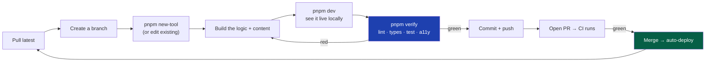
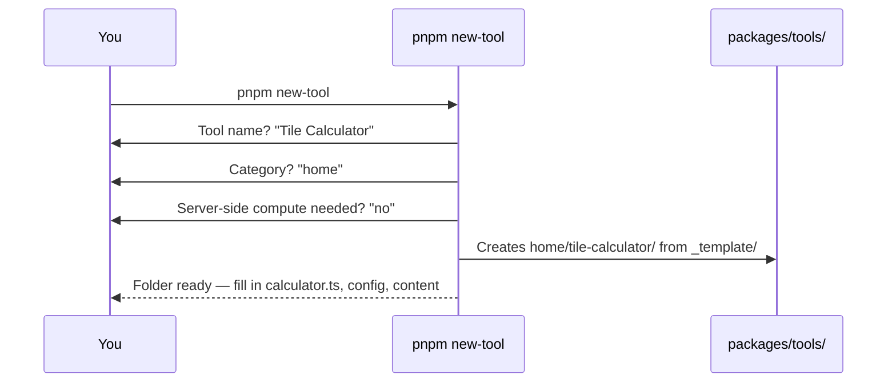
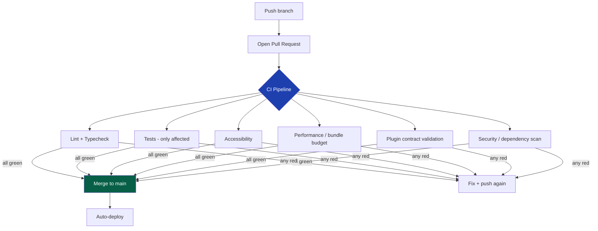
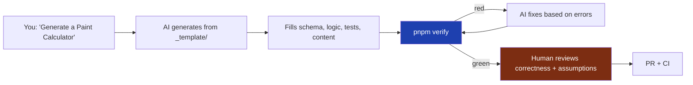

# 07 — Development Workflow

> **Status:** Draft v1 · **Owner:** CTO / Developer Experience Lead · **Audience:** Anyone writing code or generating tools — human or AI
> **Governed by:** `00`–`06`. `06` defined *where code lives*. This document defines *the day-to-day loop*: how you set up, run, build a tool, test it, and merge it. It is the routine that turns the architecture into daily progress.

---

## 1. Why a Documented Workflow Matters (Especially for a Solo Daily Builder)

You told me you'll work on this **every day until it earns income**. That fact shapes this entire chapter. A solo daily builder's biggest enemies are:
- **Context loss** — you stop for three days, come back, and can't remember how to run things.
- **Inconsistency** — you do it slightly differently each time, and drift creeps in.
- **Friction** — every extra manual step is a tax you pay every single day.

A documented, automated workflow kills all three. It means you (or a collaborator, or an AI) can sit down on any given day and be productive in minutes, doing things the same correct way every time.

**Simple explanation:** a good workflow is like a pilot's checklist. Pilots are experts, yet they use a checklist every flight — because the checklist guarantees nothing important is skipped, no matter how tired or distracted they are. This document is your daily flight checklist. Follow it and you never crash on the routine stuff.

> **CTO note:** this connects directly to `00`, §6.3 ("the build must survive being put down and picked up"). The workflow is the *mechanism* that makes that principle real. If your workflow lives only in your head, the project dies the week you're too busy to build. If it lives here, the project survives.

---

## 2. The Golden Path (The One Loop to Memorize)

Everything below is detail. This is the whole workflow in one picture — the loop you repeat daily:



**Simple explanation:** get the latest code, make a safe workspace (branch), build your tool, watch it work locally, run the one command that checks everything, and if it's green, ship it. Then repeat. Memorize this loop; the rest of this chapter just explains each box.

---

## 3. One-Time Setup (New Machine / New Contributor)

The setup must be short enough that a new environment is ready in minutes. Long setups are abandoned setups.

| Step | Command | What it does |
|------|---------|--------------|
| 1. Clone | `git clone <repo>` | Get the whole monorepo (one clone = everything, `05`) |
| 2. Install Node | `nvm use` (reads `.nvmrc`) | Guarantees everyone uses the same Node version |
| 3. Enable pnpm | `corepack enable` | Pins the exact pnpm version (no "works on my machine") |
| 4. Install deps | `pnpm install` | Installs all packages efficiently (pnpm store) |
| 5. Env file | `cp .env.example .env.local` | Local config; secrets never committed (`45`) |
| 6. Verify | `pnpm verify` | Confirms the whole repo is healthy before you start |

**Simple explanation:** six steps, all standard, all fast. Pinning Node (`.nvmrc`) and pnpm (`corepack`) means *everyone's toolbox is identical* — the classic "it works on my machine" bug is prevented at the source. The `.env.example` file documents what config exists without ever exposing real secrets.

> **CTO note:** `.nvmrc` + `corepack` are small but high-leverage. Version drift in the toolchain is a silent, recurring time-sink. Locking it once here saves hours over the project's life and is a prerequisite for reproducible CI (`40`).

---

## 4. The Daily Local Loop

### Start of a session
```
git pull                 # get latest (or git fetch + rebase, see 47)
pnpm install             # only if dependencies changed
git checkout -b feat/tile-calculator   # a fresh branch per task (48)
```

### Running the site locally
```
pnpm dev                 # starts Next.js with hot reload
```
This launches the site at `localhost:3000`. Thanks to Turborepo (`05`), only what you touch rebuilds, so the dev server stays fast even with hundreds of tools. You see changes instantly as you type — essential for the "instant" product feel (`02`, C3) you're building.

**Simple explanation:** `pnpm dev` is your live workshop. You edit a file, the browser updates in a second, you see if it's right. No manual refresh, no waiting for a full rebuild.

---

## 5. Creating a New Tool (The Core Daily Activity)

This is the heartbeat of the platform. It must be frictionless, because you'll do it hundreds of times.

```
pnpm new-tool
```

This scaffolding script (from `scripts/`, `06`) asks a few questions and generates a correct tool folder from `_template/`:



Then you fill in the blanks, in a sensible order:

1. **`schema.ts`** — define the inputs (e.g. room length, width, tile size). *Start here: decide what the tool takes in.*
2. **`calculator.ts`** — write the pure logic (the math). No React, no fetch. *The brain.*
3. **`tests.spec.ts`** — write tests with known-correct values *before or alongside* the logic (`39`, C2). *Prove it's right.*
4. **`tool.config.ts`** — identity, title, flags.
5. **`seo.ts`, `faq.md`, `article.md`, `examples.ts`** — the content and SEO.
6. **`related.ts`** — link to sibling tools.

**Simple explanation:** the script hands you a pre-built, correctly-shaped folder — you never start from a blank page. You then fill it in like a form: what goes in, what it computes, proof it's correct, then the words and links around it. Because the shape is always the same, this becomes muscle memory.

> **CTO note — write the test with the logic, not after:** for a platform where *correctness is sacred* (`02`, C2) and tools may be AI-generated (B3), the test is not optional cleanup — it's the definition of "the math is right." A tool without a passing test proving a known value is not done, it's a guess. This is enforced in CI, but the habit belongs here in the workflow.

---

## 6. The Verify Command (Your Personal Quality Gate)

Before committing, run one command:

```
pnpm verify
```

This runs the full local quality suite — the *same checks CI will run* — so you catch problems before pushing:

| Check | What it catches | Chapter |
|-------|-----------------|---------|
| `lint` | Style/convention violations, cross-tool imports | `08`, `09` |
| `typecheck` | Type errors across all packages | `08` |
| `test` | Broken logic (correctness) | `39` |
| `a11y` | Accessibility violations | `37` |
| `contract` | Tool that breaks the plugin contract | `13` |

**Simple explanation:** `pnpm verify` is a dress rehearsal for CI. It runs on your machine the exact checks the pipeline will run on the server. If `pnpm verify` is green, CI will almost certainly be green too — so you rarely get the frustrating "pushed, then CI failed" cycle.

> **CTO note — why local checks mirror CI exactly:** nothing wastes a builder's time like a check that only exists on the server. By making `pnpm verify` identical to CI, we shift failure *left* — you find it in seconds locally instead of minutes later in the pipeline. This is a core Developer Experience investment (`00`, Tier 3). The rule: **any check CI runs, `pnpm verify` must run too.**

---

## 7. Committing and Pushing

```
git add .
git commit -m "feat(home): add tile calculator"
git push -u origin feat/tile-calculator
```

- **Commit messages follow Conventional Commits** (`feat:`, `fix:`, `docs:`, etc.) — details in `47-GIT-STRATEGY`. This isn't bureaucracy: it lets us auto-generate changelogs and drive versioning (`49`).
- **A pre-commit hook** runs a fast subset of checks (lint + format on changed files) so obviously-broken commits never leave your machine. Fast enough not to annoy; strict enough to keep the history clean.

**Simple explanation:** commit messages describe *what kind* of change this is in a machine-readable way. "feat" means a new feature, "fix" means a bug fix. Later, tools read these to automatically write release notes and decide version numbers — so a small discipline now buys free automation later.

---

## 8. Pull Request and CI

Even as a solo founder, we use pull requests — because they're where automated review happens and where the deploy safety net lives.



**Simple explanation:** opening a PR triggers the robot reviewer (CI). It re-runs everything `pnpm verify` did, plus heavier checks (performance budgets, security scans). Only when *all* checks pass can the change merge — and merging auto-deploys. The PR is the gate that guarantees `main` is always shippable.

> **CTO note — why PRs even when solo:** it feels like overhead for one person. It isn't. The PR is where the *seatbelt* from `05` (§7) actually buckles: branch protection means `main` can't receive un-verified code, even from you on a tired evening. It also creates a reviewable record, makes AI-generated changes safe to accept, and is already in place when the second engineer joins — no retrofit. The cost is tiny; the protection is large.

---

## 9. The AI-Assisted Workflow

Because AI will generate tools (B3), the workflow explicitly supports it. The AI follows the *same golden path* — it's just faster at the middle steps.



**The rules that make AI generation safe:**
1. **AI generates into the standard structure** (`06`) — same folder, same file names. No special path.
2. **AI must produce passing tests** — the same `pnpm verify` gate applies. The AI's work is only "done" when the same checks a human faces are green.
3. **A human reviews *correctness and assumptions*** — the one thing automation can't fully verify is whether the formula is *conceptually* right (e.g. "is this the correct tax formula for this year?"). That human judgment is the required checkpoint.
4. **CI is the final, identical gate** — AI-generated and human-generated tools pass through exactly the same pipeline. No shortcuts for machines.

**Simple explanation:** the AI is treated like a very fast junior engineer. It does the tedious middle work quickly, but it must still pass every automated check *and* get a human to confirm the logic actually makes sense before anything ships. Speed on the mechanics; human judgment on the truth.

> **CTO note:** the danger with AI generation is *plausible-but-wrong* output — code that runs, has tests, and is subtly incorrect (an AI can write a test that agrees with its own wrong formula). That's exactly why rule #3 exists: the human checkpoint is specifically about *conceptual correctness and stated assumptions*, not about whether the code runs. Never let "the tests pass" substitute for "the formula is actually right."

---

## 10. Definition of Done (Workflow Level)

A change is not "done" until every box is checked. This is the concrete, per-change version of the constitution's Definition of Done (`00`, §9).

- [ ] Runs correctly in `pnpm dev` (you *saw* it work).
- [ ] `pnpm verify` is fully green locally.
- [ ] Tests prove correctness against known values (`02`, C2).
- [ ] Content (explanation, assumptions, FAQ) is present (`02`, C4).
- [ ] Related tools are linked (`02`, C9).
- [ ] Commit follows Conventional Commits.
- [ ] PR opened; CI fully green.
- [ ] (If AI-generated) a human confirmed the formula and assumptions.

**Simple explanation:** "done" is not "I think it works." Done is "I watched it work, every automated check is green, the math is proven, the content is there, and it's merged through the gate." No exceptions, no "I'll add the test later."

---

## 11. Summary

- The workflow exists to defeat the three enemies of a **solo daily builder**: context loss, inconsistency, and friction — and to keep the project alive across the weeks you're too busy to build (`00`, §6.3).
- **The Golden Path** is one memorable loop: pull → branch → build → run → verify → commit → PR → merge → deploy. Everything else is detail.
- **Setup is six fast steps** with pinned Node/pnpm, so every environment is identical.
- **`pnpm new-tool`** scaffolds a correct folder from `_template/`; you fill it in schema → logic → tests → config → content — always the same order, so it becomes muscle memory.
- **`pnpm verify`** is your personal quality gate, running the *exact same checks as CI* to shift failures left and save daily time.
- **PRs + CI are used even solo**, because that's where branch protection buckles the seatbelt and where AI-generated changes become safe to accept.
- The **AI workflow follows the same golden path** with one mandatory human checkpoint: confirming *conceptual correctness and assumptions*, because passing tests never proves a formula is actually right.

> Next: `08-CODING-STANDARDS.md` — the language-level rules (TypeScript strictness, patterns to use and avoid, error handling style, file size limits) that keep the code inside this workflow consistent and safe.

---

### Changelog
| Version | Date | Change | Reason |
|---------|------|--------|--------|
| v1 | (draft) | Initial development workflow | Project inception |
