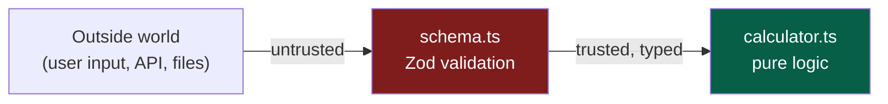
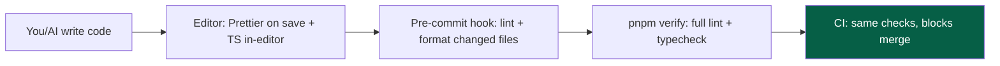

# 08 — Coding Standards

> **Status:** Draft v1 · **Owner:** CTO / Principal Engineer · **Audience:** Everyone who writes TypeScript here — human or AI
> **Governed by:** `00`–`07`. This document sets the *language-level rules*: how we write TypeScript so that code across 1,000+ tools and multiple authors reads as if one careful person wrote it. `09-NAMING-CONVENTIONS.md` covers naming specifically; this covers everything else about how code is written.

---

## 1. Why Coding Standards Are a Load-Bearing Wall

At small scale, coding style feels like preference. At our target scale — thousands of tools, multiple engineers, and AI generation — it becomes structural. Inconsistent code is code that *each reader must re-learn*, and that no automated tool or AI can reliably transform. Standards are how we make the whole codebase behave like one predictable system.

**Simple explanation:** imagine a book where every chapter uses different fonts, spelling, and grammar rules. It's exhausting to read even if each chapter is individually fine. Coding standards are the shared style guide that lets any engineer (or AI) read *any* part of the codebase at full speed, and lets automated tools reshape it safely.

**Why this matters even more for AI (B3):** an AI generates code by pattern-matching what it sees. If our codebase is consistent, the AI's output is consistent and correct. If our codebase is a patchwork, the AI amplifies the patchwork. **Consistent standards make AI generation reliable; inconsistent code makes it a liability.**

> **CTO note:** the single most important idea in this chapter — **as much of this as possible is enforced by tools, not by memory.** A standard that relies on humans remembering it degrades at scale (`02`, §8). A standard enforced by the compiler, ESLint, or Prettier holds forever. Every rule below is tagged with how it's enforced: `[auto]` (tooling blocks it), `[review]` (humans check it), or `[both]`.

---

## 2. TypeScript: Strict, Always `[auto]`

TypeScript is our safety net, and it only works if it's set to maximum strictness. A loosely-typed TypeScript codebase gives the *illusion* of safety without the substance.

### Non-negotiable compiler settings (in `tsconfig.base.json`)

| Setting | Value | What it prevents |
|---------|-------|------------------|
| `strict` | `true` | Turns on the whole strict family below |
| `noImplicitAny` | `true` | Untyped variables silently becoming `any` |
| `strictNullChecks` | `true` | The billion-dollar mistake: unhandled `null`/`undefined` |
| `noUncheckedIndexedAccess` | `true` | Assuming `array[i]` exists when it might not |
| `noImplicitReturns` | `true` | Functions that return a value on some paths but not others |
| `noFallthroughCasesInSwitch` | `true` | Accidental `switch` fallthrough bugs |
| `exactOptionalPropertyTypes` | `true` | Confusing "missing" with "explicitly undefined" |

**Simple explanation:** these settings make TypeScript *pessimistic* — it assumes things can be missing, null, or wrong, and forces you to handle those cases. That's exactly what we want: the compiler catches the "what if this is empty?" bugs before a user ever hits them. A calculator that crashes on an empty input field is caught at compile time, not in production.

### The `any` rule

> **`any` is banned.** `[auto]` (ESLint error, blocks CI)

`any` disables type checking for that value — it's a hole in the safety net. When you genuinely don't know a type, use `unknown` and *narrow* it (check what it is before using it).

**Example:**
```
// BANNED — turns off all checking
function parse(input: any) { return input.value * 2 }   // crashes if input has no .value

// CORRECT — forces you to check
function parse(input: unknown) {
  const parsed = InputSchema.parse(input)   // validate first (schema.ts)
  return parsed.value * 2                    // now safe
}
```

**Simple explanation:** `any` is like telling the compiler "trust me, don't check." `unknown` is "I don't know yet, so make me prove what it is before I use it." We always choose "make me prove it," because unchecked trust is how bugs reach production.

> **CTO note:** the rare, legitimate need to escape the type system exists (third-party types, edge cases). For those, we require an explicit, commented `// eslint-disable-next-line` with a *reason* — so an escape hatch is always visible and justified, never silent. A codebase with hidden `any`s is a codebase that only *pretends* to be type-safe.

---

## 3. Validate at the Boundary `[both]`

**Rule:** all external input (form data, URL params, API requests, file contents) is validated with a schema **at the boundary** before it's used. We use **Zod** (declared in each tool's `schema.ts`, `06`).



**Why:** this is where type safety (compile-time) meets security (`00`, N1) and correctness (`02`, C2). TypeScript types vanish at runtime — they don't check *actual* incoming data. A schema checks the *real* value at runtime and hands your logic something both typed *and* verified.

**Simple explanation:** think of `schema.ts` as the security checkpoint at an airport. Nothing untrusted gets past it into the secure area (`calculator.ts`). Inside the secure area, everyone's already been checked, so the logic can trust its inputs completely. The checkpoint is the *one* place we validate — so the logic never has to second-guess.

**Example:** a mortgage tool's `schema.ts` declares "principal is a positive number, rate is 0–100, years is a positive integer." If a user (or a malicious API caller) sends "principal = -5" or "rate = 'hello'", the schema rejects it with a clear error *before* the math runs. The math never has to defend itself.

> **CTO note:** "types are not validation" is a mistake I've seen sink teams. A TypeScript `type` describes what you *expect*; a Zod schema checks what you *got*. At the boundary you always need the second one. This single rule prevents a large fraction of security and correctness bugs, which is why it's a standard, not a suggestion.

---

## 4. Purity and Side-Effect Discipline `[both]`

**Rule:** tool logic (`calculator.ts`) is **pure** — same input always gives same output, no side effects (no network, no disk, no global state, no `Date.now()` baked in).

**Why:** purity is what makes logic testable (`00`, 4.10), reusable across web/API/mobile (`03`, R4), and safe for AI to generate. A pure function is trivially verifiable: give it inputs, assert the output.

**Example:**
```
// IMPURE — depends on hidden state, hard to test, differs by when it runs
function daysUntilDeadline() {
  return differenceInDays(loadDeadlineFromDB(), new Date())   // DB + clock hidden inside
}

// PURE — everything it needs is passed in; trivially testable
function daysUntil(deadline: Date, today: Date): number {
  return differenceInDays(deadline, today)
}
```

**Simple explanation:** a pure function is like a vending machine — press B4, always get the same snack. An impure function is like asking a friend "what should I eat?" — the answer changes based on their mood, the time, what's in the fridge. Vending machines are testable and predictable; moody friends are not. Our tool logic must be vending machines.

**Where side effects *do* live:** at the edges — the web layer fetches data and passes it *into* pure logic; the API layer reads the request and passes it *in*. Side effects are pushed outward to a thin shell around a pure core (Clean Architecture, `04`).

---

## 5. Error Handling `[both]`

Errors are part of the product, not an afterthought. A tool that fails silently or crashes ugly violates both trust (`02`, C2) and observability (`00`, N6).

### The rules

| Rule | Why | Enforcement |
|------|-----|-------------|
| **Never swallow errors silently** | Silent failure = the Anti-Principle from `00` | `[both]` |
| **Fail fast at boundaries, degrade gracefully in UI** | Catch bad input early; never show users a stack trace | `[review]` |
| **Use typed, meaningful errors** — not bare `throw 'oops'` | Callers can handle specific cases; logs are searchable | `[both]` |
| **Every caught error is logged with context** | You can't fix what you can't see (`28`–`29`) | `[both]` |
| **User-facing messages are human, never technical** | "Please enter a positive number", not "NaN at line 42" | `[review]` |

**Simple explanation:** three layers of error handling. (1) The schema stops bad input at the door with a *helpful* message ("rate must be between 0 and 100"). (2) If something unexpected breaks, we log the full technical detail *for us* and show a calm, human message *to the user*. (3) We never just hide an error and pretend everything's fine — that's how bugs live for months undetected.

**Example of the split:**
```
try {
  const result = calculate(validatedInput)
} catch (err) {
  logger.error('mortgage calc failed', { err, input: validatedInput })  // full detail for us
  showUser('Something went wrong calculating your result. Please try again.') // calm message for them
}
```

> **CTO note:** the discipline that pays off most here is **logging with context**. `logger.error('failed')` is nearly useless at 3am when the site is down. `logger.error('mortgage calc failed', { input, toolId })` tells you *which tool*, *which input*, *what broke* — turning a mystery into a five-minute fix. Context-rich logging is cheap to write and priceless to have. (Standardized in `29-LOGGING`.)

---

## 6. Functions, Files, and Complexity Limits `[auto]`

Small, focused units are easier to read, test, generate, and review. We put soft, tool-enforced limits on size — not as bureaucracy, but as an early-warning signal.

| Limit | Threshold | What it signals |
|-------|-----------|-----------------|
| Function length | ~40 lines (warn) | A function doing too many things → split it |
| File length | ~300 lines (warn) | A file with too many responsibilities → split it |
| Cyclomatic complexity | ~10 (warn) | Too many branches → simplify the logic |
| Function parameters | ~4 (warn) | Too many args → pass an object |
| Nesting depth | ~4 (warn) | Deep `if` pyramids → use early returns |

**Simple explanation:** these aren't hard bans — they're smoke detectors. When a function crosses ~40 lines, the linter gently warns "this might be doing too much." Usually it's right. Small functions read like sentences; giant functions read like legal contracts. We favor sentences.

**Example — early returns over nesting:**
```
// Deeply nested (hard to follow)
function classify(bmi) {
  if (bmi) {
    if (bmi < 18.5) { return 'underweight' }
    else { if (bmi < 25) { return 'normal' } else { return 'overweight' } }
  }
}

// Early returns (reads top-to-bottom)
function classify(bmi: number): Category {
  if (bmi < 18.5) return 'underweight'
  if (bmi < 25)   return 'normal'
  return 'overweight'
}
```

> **CTO note:** these are *warnings*, not *errors*, on purpose. A hard limit invites gaming (splitting a function awkwardly just to dodge the linter). A warning invites a *judgment call* recorded in review. The goal is code that's easy to read, not code that satisfies a number. Standards should guide judgment, not replace it.

---

## 7. Patterns We Use and Patterns We Avoid `[review]`

| Prefer | Avoid | Why |
|--------|-------|-----|
| `const` everywhere; `let` only when reassigning | `var` (banned `[auto]`) | Predictable, block-scoped, no accidental reassignment |
| Immutability (create new, don't mutate) | Mutating shared objects/arrays in place | Prevents spooky action-at-a-distance bugs |
| Pure functions + composition | Deep class hierarchies | Simpler to test and reason about (KISS) |
| Explicit return types on exported functions | Relying on inference across module boundaries | Public contracts should be visible and stable |
| Named exports | Default exports (except where a framework requires, e.g. Next.js pages) | Better refactoring, autocomplete, no rename drift |
| `async/await` | Raw `.then()` chains | Readable, easier error handling |
| Early returns / guard clauses | Deep nesting | Flatter, more readable control flow |
| Small composable utilities in `packages/core` | Copy-pasted helpers per tool | DRY; one source of truth (`00`) |

**Simple explanation:** the left column is "the grain of the wood" — writing with it is smooth. The right column is "against the grain" — it works but splinters over time. We write with the grain so the codebase stays smooth to work in for years.

**Two rules worth calling out:**
- **Immutability by default.** Don't change data in place; make a new copy with the change. *Example:* to add a tag, write `[...tags, newTag]`, not `tags.push(newTag)`. This prevents the whole class of bugs where one part of the code changes data another part was relying on.
- **Explicit return types on exported functions.** Inside a function, let TypeScript infer. But anything *exported* (a public contract) states its return type, so the contract is visible and can't silently change.

---

## 8. Comments and Documentation-in-Code `[review]`

**Rule:** code explains *how*; comments explain *why*. We don't comment the obvious; we comment the non-obvious decision.

| Comment this | Don't comment this |
|--------------|--------------------|
| *Why* a formula uses a specific constant or rounding rule | `// increment i` above `i++` |
| A non-obvious edge case being handled | Restating what the code plainly says |
| A link to the source/spec a formula came from (`02`, C2) | Commented-out old code (delete it; git remembers) |
| A `TODO(owner): reason` with an owner | Vague `// fix later` with no owner |

**Simple explanation:** good code reads like clear prose, so it needs few comments to explain *what* it does. Comments are reserved for the things code *can't* say: *why* we chose this approach, *where* a magic number came from, *what* subtle case we're guarding against. A comment saying "add one to i" is noise; a comment saying "rate capped at 100% because the tax authority spec §4.2 defines it so" is gold.

**Example (a good comment):**
```
// UK 2024/25 personal allowance. Tapers £1 for every £2 over £100k (HMRC rule).
// Source: gov.uk/income-tax-rates. Update annually — see article.md assumptions.
const PERSONAL_ALLOWANCE = 12_570
```
This comment explains *why* the number is what it is and *when* it needs updating — exactly the context a future maintainer (or AI) needs.

> **CTO note:** for a platform where tools encode real-world rules (tax, finance, health) and get AI-generated, **comments that cite the source and state the review date are a correctness tool, not decoration.** They're how we know whether a tool's assumptions are stale. This ties directly to `02`'s C2 (correctness is sacred) and the assumptions block in the tool page anatomy.

---

## 9. How the Standards Are Enforced

The stack that makes these standards automatic rather than aspirational:



| Tool | Enforces | When |
|------|----------|------|
| **TypeScript (strict)** | Types, null safety | Editor + `verify` + CI |
| **ESLint** | `no-any`, `no-var`, complexity, import rules, cross-tool imports | Editor + pre-commit + CI |
| **Prettier** | Formatting (zero style debates) | On save + pre-commit |
| **Pre-commit hook** | Fast checks on changed files | Every commit |
| **CI** | Everything, as the final gate | Every PR (`40`) |

**Simple explanation:** the rules aren't a document you have to memorize and self-police. They're wired into your editor (which fixes formatting as you type), your commit (which blocks obviously-broken code), and CI (which is the final gate). Following the standards is the *default*, and breaking them takes active effort — which is exactly backwards from how it feels in an undisciplined codebase. **Prettier especially ends all style arguments: there's one format, applied automatically, forever.**

---

## 10. Summary

- Coding standards are a **load-bearing wall** at our scale: consistent code is readable by anyone, transformable by tools, and reliably generatable by AI — inconsistent code amplifies chaos.
- **TypeScript runs at maximum strictness**, `any` is banned in favor of `unknown` + narrowing, so the compiler catches "what if it's empty/null/wrong?" before users do.
- **Validate at the boundary** with Zod schemas — because *types describe expectations, schemas check reality*; this is where type safety, security, and correctness meet.
- **Tool logic is pure** (vending machine, not moody friend), pushing side effects to a thin outer shell — the foundation of testability and web/API reuse.
- **Errors are never swallowed**: helpful messages at the boundary, calm messages to users, context-rich logs for us.
- **Soft, tool-enforced size limits** act as smoke detectors, favoring code that reads like sentences.
- **Comments explain *why*, cite sources, and state review dates** — a correctness tool for a platform encoding real-world rules.
- Above all: **the standards are enforced by tools (TypeScript, ESLint, Prettier, CI), not by memory** — so good practice is the path of least resistance.

> Next: `09-NAMING-CONVENTIONS.md` — the specific naming rules (files, folders, variables, functions, types, tools) that make the codebase searchable and predictable for humans and AI.

---

### Changelog
| Version | Date | Change | Reason |
|---------|------|--------|--------|
| v1 | (draft) | Initial coding standards | Project inception |
