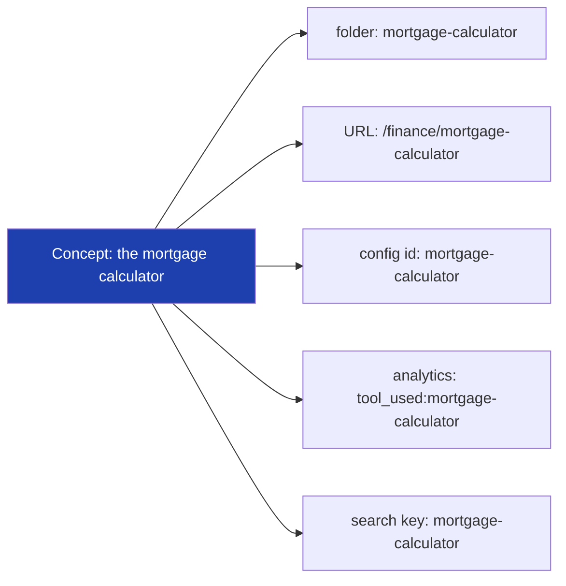
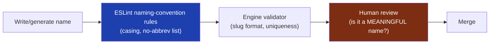

# 09 — Naming Conventions

> **Status:** Draft v1 · **Owner:** CTO / Principal Engineer · **Audience:** Everyone who names anything — files, folders, variables, tools, URLs, database columns — human or AI
> **Governed by:** `00`–`08`. `06` covered *folder placement*; `08` covered *how code is written*. This document covers *what things are called*. Naming is small in each instance and enormous in aggregate — it's the single most frequent decision in the codebase.

---

## 1. Why Naming Deserves Its Own Chapter

You make naming decisions hundreds of times a day and almost never think about them. That's exactly why they need rules: an unconscious, un-ruled decision made thousands of times produces chaos. Good naming is the difference between a codebase you can *search* and one you have to *spelunk*.

**Simple explanation:** naming conventions are like a country deciding which side of the road to drive on. It barely matters *which* side — what matters enormously is that *everyone picks the same side*. A consistent convention that's slightly imperfect beats a "better" convention applied inconsistently. Once we pick a side here, everyone drives on it.

**Why naming is a first-class concern for us specifically:**
- **Search-driven development.** With 1,000+ tools, you find things by searching names. `getMortgagePayment` is findable; `calc2` is not.
- **AI generation (B3).** An AI names things by imitating patterns. Rigid naming rules mean the AI names things correctly by default. Loose rules mean it invents inconsistent names that humans then have to fix.
- **URLs are names too.** Our tool folder names *become* public URLs (`06`). A naming mistake isn't just internal — it's a permanent public URL that SEO depends on (`00`, N3).

> **CTO note:** most naming rules below are **`[auto]` enforced** by ESLint/naming-convention rules or the engine validator. Where a rule can't be automated (semantic quality — is the name *meaningful*?), it's `[review]`. The philosophy from `08` holds: automate what we can, and reserve human judgment for the part machines can't check — *whether a correct-format name is actually a good name.*

---

## 2. The Casing Rules (The Foundation)

Every kind of identifier has exactly one casing style. This table is the reference the whole team returns to.

| Thing | Casing | Example | Enforcement |
|-------|--------|---------|-------------|
| **Folders (general)** | `kebab-case` | `mortgage-calculator/` | `[auto]` |
| **Tool folder / slug** | `kebab-case` | `tile-calculator/` → `/home/tile-calculator` | `[auto]` |
| **Category folder** | `lowercase`, single word | `finance/`, `developer/` | `[auto]` |
| **TS/TSX files (code)** | `kebab-case` | `mortgage-payment.ts` | `[auto]` |
| **React component files** | `PascalCase` | `ResultCard.tsx` | `[auto]` |
| **Fixed contract files** | exact fixed names | `calculator.ts`, `tool.config.ts` | `[auto]` (`06`) |
| **Variables & functions** | `camelCase` | `monthlyPayment`, `getMortgagePayment()` | `[auto]` |
| **Types & interfaces** | `PascalCase` | `MortgageInput`, `ToolConfig` | `[auto]` |
| **React components** | `PascalCase` | `<ResultCard />` | `[auto]` |
| **Constants (true constants)** | `UPPER_SNAKE_CASE` | `MAX_RATE`, `DEFAULT_CURRENCY` | `[auto]` |
| **Enums / enum members** | `PascalCase` | `Category.Finance` | `[auto]` |
| **Booleans** | `is/has/should/can` prefix | `isValid`, `hasResult`, `canExport` | `[review]` |
| **Env variables** | `UPPER_SNAKE_CASE`, prefixed | `UTOOLIOS_DATABASE_URL` | `[auto]` |
| **DB tables** | `snake_case`, plural | `tool_usages` | `[auto]` (`12`) |
| **DB columns** | `snake_case` | `created_at` | `[auto]` (`12`) |
| **CSS / Tailwind custom** | `kebab-case` | `--color-brand` | `[review]` |

**Simple explanation:** each *category* of thing has one costume. Folders and URLs wear `kebab-case` (lowercase-with-dashes). Regular code variables wear `camelCase`. Types and components wear `PascalCase`. Real constants shout in `UPPER_SNAKE_CASE`. Once you know the costume for each category, you never have to decide again.

> **CTO note — why `kebab-case` for code files but `PascalCase` for components:** this is a deliberate, common React convention. A `PascalCase` filename signals "this file exports a React component" at a glance; a `kebab-case` filename signals "this is plain logic/utilities." The *filename casing itself carries information* about what's inside. Consistency here lets you know a file's nature before opening it.

---

## 3. Semantic Naming Rules (The Part That Needs Judgment) `[review]`

Casing is mechanical. *Meaning* is not. These rules govern whether a correctly-cased name is actually a *good* name.

### Rule 1 — Names reveal intent, not implementation
A name should say *what* something is for, not *how* it's built.

| Good (intent) | Bad (implementation/vague) | Why |
|---------------|-----------------------------|-----|
| `monthlyPayment` | `result`, `x`, `temp` | Says what it means |
| `activeUsers` | `arr`, `data`, `list` | Describes contents |
| `formatCurrency()` | `doStuff()`, `handle()` | Describes the action |
| `MortgageInput` | `Data`, `Obj`, `Params` | Describes the shape |

**Simple explanation:** a name is a tiny piece of documentation you read every time you see it. `monthlyPayment` tells the next person (or AI) exactly what it holds. `x` forces them to hunt for the meaning. Spend the extra characters — you write a name once and read it a hundred times.

### Rule 2 — Length matches scope
Short names for tiny scopes; descriptive names for wide scopes.

**Example:** a one-line loop index can be `i`. A value exported from `packages/core` and used across 1,000 tools must be fully descriptive (`DEFAULT_ROUNDING_PRECISION`). The wider a name travels, the more it must explain itself.

### Rule 3 — No abbreviations except a tiny, agreed set
Abbreviations are a private language that new people (and AI) don't share. We ban them, with a short allowlist of universally-understood ones.

| Allowed (universal) | Banned (ambiguous) |
|---------------------|--------------------|
| `id`, `url`, `api`, `db`, `ui`, `seo`, `faq` | `calc`, `cfg`, `mgr`, `svc`, `tmp`, `val`, `res` |

**Simple explanation:** `url` is understood by everyone on earth. `mgr` could be "manager," "merger," or "migrator" — you have to guess. We keep only the abbreviations *nobody* has to guess, and spell out everything else. `calculator`, not `calc`. `config`, not `cfg`.

### Rule 4 — Booleans read like yes/no questions
Prefix with `is`, `has`, `should`, or `can` so the name reads as a true/false statement.

**Example:** `if (isValid)` reads naturally; `if (valid)` is weaker; `if (validity)` is confusing. `hasResult`, `shouldShowAds`, `canExport` — each one obviously answers yes or no.

### Rule 5 — Functions are verbs, values are nouns
A function *does* something (`calculatePayment`, `formatDate`, `validateInput`). A value *is* something (`payment`, `formattedDate`, `input`). This makes code read like plain sentences.

**Simple explanation:** in English, "the *calculation* calculated the *payment*" — the verb acts, the noun is the thing. Code should read the same way. When you see `formatCurrency(amount)`, you instantly know a *verb* (format) acts on a *noun* (amount). Mixing this up (a noun that's secretly a function) makes code lie about what it is.

---

## 4. Naming Tools (The Public-Facing, Permanent Names)

Tool names are the highest-stakes names in the whole system, because they become **public URLs** that Google indexes — and per `00` N3, URLs are near-impossible to change once indexed. A bad tool name is a permanent SEO liability.

### The tool-naming formula

```
[subject] + [tool-type]     →  kebab-case slug
```

| Tool | Slug | URL |
|------|------|-----|
| Mortgage Calculator | `mortgage-calculator` | `/finance/mortgage-calculator` |
| JWT Decoder | `jwt-decoder` | `/developer/jwt-decoder` |
| Tile Calculator | `tile-calculator` | `/home/tile-calculator` |
| Word Counter | `word-counter` | `/text/word-counter` |

### The rules for tool slugs (`[both]` — format `[auto]`, quality `[review]`)

| Rule | Reason |
|------|--------|
| Use the term **people actually search** (`mortgage-calculator`, not `home-loan-computer`) | The slug *is* the SEO keyword (`14`, `17`) |
| Include the tool-type word (`-calculator`, `-converter`, `-generator`, `-checker`) | Matches search intent; disambiguates |
| Singular subject unless the domain is inherently plural | Consistency; matches search patterns |
| No dates, versions, or years in the slug | `tax-calculator`, not `tax-calculator-2024` — the tool updates in place; the URL is permanent |
| No brand/internal codenames | Users search for the function, not our names |
| Slug must be unique platform-wide | One tool, one URL (no ambiguity) |

**Simple explanation:** we name tools the way our future visitor *types their problem into Google*. Someone needing paint math searches "paint calculator" — so the tool is `paint-calculator` and lives at `/home/paint-calculator`. We name for the searcher, not for us. And we never put a year in the URL, because the URL lives forever while the tool's data gets updated in place.

> **CTO note — the deepest reason tool names get their own section:** a variable name is a private decision you can rename in one commit. A tool slug is a *public contract with the entire internet* the moment Google indexes it. Renaming it later means broken links, lost rankings, and redirect complexity (`00`, N3). So tool naming gets extra scrutiny in review (`[review]`) precisely because it's the one naming decision that's effectively irreversible. Get it right the first time; there is no cheap second time.

---

## 5. Naming Across Layers — One Concept, One Name

A single concept should have the *same name everywhere it appears* — the URL, the folder, the config `id`, the analytics event, the database row. Different names for the same thing is how systems drift into confusion.



**The rule:** the tool's `kebab-case` slug is the **canonical identifier** used across *all* systems. The folder name, the URL, the `id` in `tool.config.ts`, the analytics event, and the search index key are all the same string.

**Simple explanation:** the mortgage calculator is called "mortgage-calculator" *everywhere* — in the folder, the web address, the analytics, the search. You never have to translate "the folder is X but the analytics call it Y." One concept, one name, everywhere. This makes debugging trivial: you can trace one tool through folder, URL, logs, and analytics using a single search term.

> **CTO note:** this "one canonical name" rule is what makes observability (`28`) and analytics (`31`) actually usable. When a metric spikes for `tool_used:tile-calculator`, you can *immediately* find the folder, the URL, and the logs — because they all share that exact string. If the folder were `tiles` but analytics said `tile-calc`, every investigation would start with a frustrating translation step. The naming consistency *is* the debugging tool.

---

## 6. Naming Anti-Patterns (Explicitly Banned)

| Anti-pattern | Example | Why it's banned |
|--------------|---------|-----------------|
| Meaningless names | `data`, `info`, `temp`, `obj`, `foo` | Reveals nothing; forces the reader to investigate |
| Numbered names | `user1`, `user2`, `handleClick2` | A sign the code needs restructuring, not counting |
| Type in the name (Hungarian) | `strName`, `arrItems`, `bIsValid` | TypeScript already knows the type; it's noise |
| Negated booleans | `isNotValid`, `disableIfNotEnabled` | Double negatives melt brains; use `isValid` |
| Inconsistent term for one concept | `user` here, `account` there, `member` elsewhere | Pick one word per concept and never switch |
| Abbreviations outside the allowlist | `calc`, `mgr`, `usr` | Private language; ambiguous |
| Misleading names | `getUser()` that also *deletes* something | A name that lies is worse than no name |

**Simple explanation:** each banned pattern is a small lie or a small mystery. `temp` lies (it's rarely temporary). `getUser()` that deletes lies (it does more than get). `user1`/`user2` is a mystery (why two? what's different?). We ban them because at 1,000 tools, thousands of tiny mysteries add up to a codebase nobody can move quickly in.

> **CTO note — "one word per concept" is subtle but vital:** decide early whether a person is a `user`, an `account`, or a `member`, and then use *that one word* forever — in code, database, analytics, and docs. Teams that let synonyms creep in end up with `user_id`, `account_id`, and `member_id` all meaning the same thing, and endless bugs from developers assuming they're different. Vocabulary discipline is cheap now and priceless later. We'll maintain a small glossary of canonical terms as the domain grows.

---

## 7. How Naming Is Enforced



| Layer | Catches | Type |
|-------|---------|------|
| ESLint `@typescript-eslint/naming-convention` | Wrong casing, banned abbreviations, boolean prefixes | `[auto]` |
| Engine validator (`06`) | Bad slug format, duplicate slugs, wrong file names | `[auto]` |
| Prettier | (formatting, not naming — but keeps it tidy) | `[auto]` |
| Human review | *Meaning*: is `monthlyPayment` clearer than `mp`? Is the slug the real search term? | `[review]` |

**Simple explanation:** the tools catch *format* mistakes automatically — wrong casing, banned abbreviations, duplicate slugs all fail before merge. The one thing tools *can't* judge is whether a name is genuinely *meaningful* — that's the human's job in review. So the machine guarantees names are well-formed; the human guarantees they're well-chosen.

---

## 8. Summary

- Naming is the **most frequent decision** in the codebase, so consistency matters more than perfection — like choosing a side of the road, the win is everyone picking the same one.
- **Every kind of identifier has exactly one casing** (folders/URLs `kebab-case`, variables `camelCase`, types/components `PascalCase`, constants `UPPER_SNAKE_CASE`) — memorize the costume per category and never decide again.
- **Semantic rules need judgment:** names reveal intent not implementation, length matches scope, no abbreviations outside a tiny allowlist, booleans read as yes/no questions, functions are verbs and values are nouns.
- **Tool slugs are the highest-stakes names** — they become permanent public URLs, so they use the term people actually search, carry no dates/versions, and get extra review because they're effectively irreversible (`00`, N3).
- **One concept, one canonical name everywhere** (folder = URL = config id = analytics event = search key) — which is what makes debugging and observability actually work.
- **Anti-patterns are banned** (meaningless names, numbered names, Hungarian notation, negated booleans, synonym drift) because thousands of tiny mysteries add up to an unmovable codebase.
- Enforcement splits cleanly: **tools guarantee names are well-*formed*; humans guarantee they're well-*chosen*.**

> Next: `10-FRONTEND-ARCHITECTURE.md` — how the Next.js App Router, Server Components, the shared layout, and the tool-rendering system are structured to hit 100 Lighthouse while rendering any tool from a single page.

---

### Changelog
| Version | Date | Change | Reason |
|---------|------|--------|--------|
| v1 | (draft) | Initial naming conventions | Project inception |
