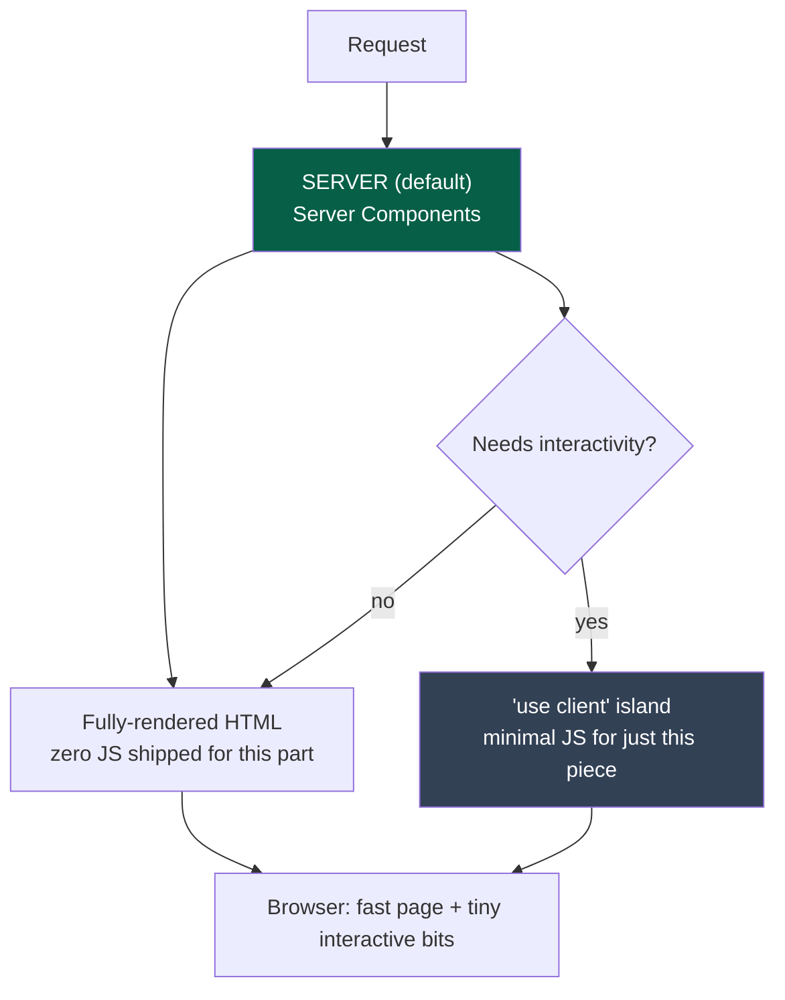
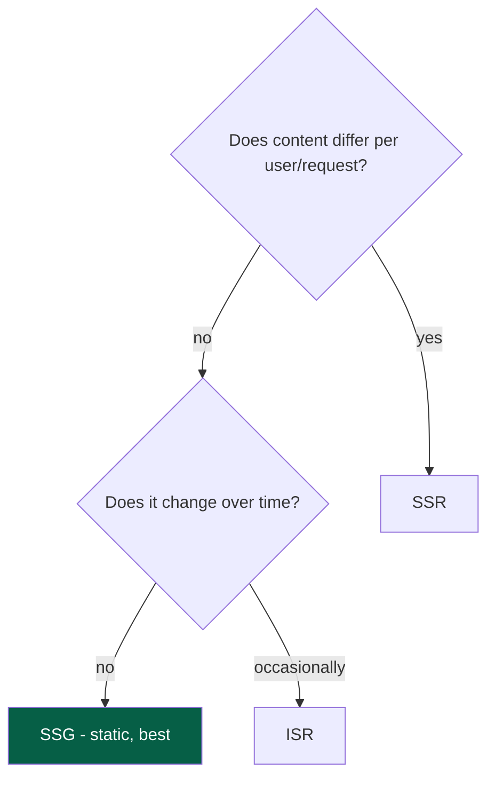
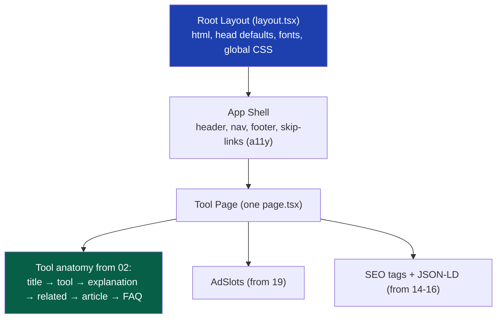
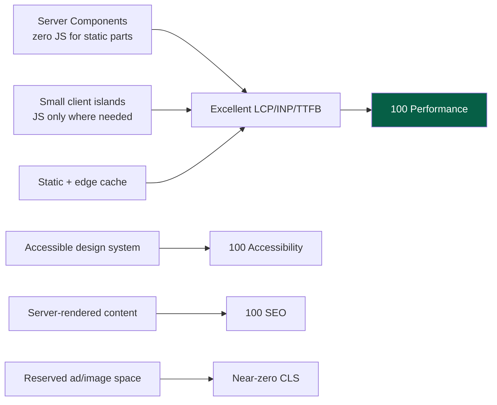

# 10 — Frontend Architecture

> **Status:** Draft v1 · **Owner:** CTO / Principal Frontend Engineer · **Audience:** Everyone building UI — the web app, shared components, or a tool's interactive part
> **Governed by:** `00`–`09`. This document defines *how the Next.js frontend is structured* so that one page renders any tool, ships almost no JavaScript, and hits 100 Lighthouse by default. Performance details live in `20`; this is the *architecture* that makes that performance achievable.

---

## 1. The Frontend's Job (and Why It's Unusual)

Most web apps are one product with many features. UToolios is the opposite: **one thin frame around thousands of tiny, independent products.** The frontend's job is not to "be a website" — it's to be a *rendering engine* that takes any tool plugin and presents it perfectly, with SEO, ads, and accessibility applied automatically.

This changes everything about how we architect the frontend. We are not building 1,000 pages. We are building **one excellent page template and a system that feeds any tool into it** (`06`, §6).

**Simple explanation:** think of the frontend like a picture frame in a gallery. The gallery has *one beautifully designed frame* (the layout, SEO, ads, accessibility). Each tool is a different painting that goes *into* that frame. We perfect the frame once; every painting then looks professionally presented automatically. We don't build a new frame for each painting.

> **CTO note:** the biggest frontend mistake we could make is treating each tool as a bespoke page. That path leads to 1,000 divergent pages, inconsistent performance, and no way to apply a global improvement. The whole frontend architecture is designed to make that mistake *impossible* — there is literally one page file (`06`, §6), and tools can't override the frame.

---

## 2. The Foundational Choice: Server Components First

Next.js App Router lets code run in two places: on the **server** (React Server Components, RSC) or in the **browser** (Client Components). Our default is **server**, and we drop to the client only when interactivity demands it.



### Why server-first is the right default for us

**Reason 1 — Most of a tool page is static.** The title, description, article, FAQ, related links, and even the *result explanation* don't need JavaScript. They can be rendered to HTML on the server and shipped as plain, instant, SEO-perfect markup. Only the *interactive calculator itself* needs client JS.

**Reason 2 — SEO loves server-rendered HTML.** Search engines get complete content immediately, not a blank page that fills in via JavaScript. This directly serves Bet B1 (long-tail SEO).

**Reason 3 — Performance by default.** Less JavaScript shipped = faster load, better Core Web Vitals (`20`), better Lighthouse. Server Components ship *zero* JS for the parts that don't need it.

**Simple explanation:** by default, we build the page on our server and send the browser finished HTML — like sending someone a printed document instead of a build-it-yourself kit. The browser shows it instantly. Only the small interactive part (the actual input-and-calculate widget) gets sent as a "kit" that assembles in the browser. Most of the page is the printed document; a small corner is the interactive kit.

### The "islands" model

The interactive parts of a page are **islands** in a sea of static HTML. A tool page is mostly static (server-rendered) with a small interactive island (the calculator inputs and live result).

```
Tool Page (server-rendered HTML)
├── Title + intro            ← static (server)
├── [ Calculator island ]    ← interactive (client, 'use client')
├── Result explanation       ← static (server)
├── Assumptions              ← static (server)
├── Related tools            ← static (server)
├── Article + FAQ            ← static (server)
└── Ads                      ← lazy-loaded island (client, below fold)
```

**Why this matters:** the JavaScript we ship is proportional to the *interactivity*, not the page size. A content-heavy tool page might ship only a few KB of JS for its one calculator island — everything else is free static HTML.

> **CTO note:** `'use client'` is a deliberate cost, not a default. Every time we mark a component `'use client'`, we're choosing to ship JavaScript. The rule: **push `'use client'` as far down the tree as possible** — make the *button* interactive, not the whole page. This "client boundary discipline" is the single biggest lever on our JS budget (`20`), and it's a `[review]` checklist item on every PR.

---

## 3. The Rendering Strategies (When Each Is Used)

Next.js offers several ways to render. We choose per-route based on how the content behaves. This is a key architecture decision because it directly determines speed and cost (`03` economics).

| Strategy | What it means | Where we use it | Why |
|----------|---------------|-----------------|-----|
| **SSG (Static)** | Rendered once at build time | Tool pages, category pages, marketing | Tools rarely change; static = fastest + cheapest + edge-cacheable |
| **ISR (Incremental Static Regen)** | Static, but re-generated periodically | Tools whose content updates (e.g. tax rates), listing pages | Fresh content without rebuilding the whole site |
| **SSR (Server-rendered per request)** | Rendered fresh on each request | Personalized/logged-in views (later), search results | Content that genuinely differs per request |
| **Client rendering** | Rendered in browser | The interactive island only | Live calculation as the user types |



**Simple explanation:** we ask two questions about any page. *Does it look different for different people?* If no — *does it change over time?* If it never changes, we build it once (SSG) — the fastest, cheapest option, servable straight from Cloudflare's edge. If it changes occasionally (like a tax tool when rates update), we use ISR to refresh it on a schedule without rebuilding everything. Only genuinely personalized pages get rendered fresh every time (SSR), and we have very few of those.

**The default is SSG.** Because most tools are stateless pure functions (`02`, C3), most pages are fully static and served from the edge — this is *why* the economics work (`03`, §9). We only move up the cost ladder (ISR → SSR) when the content genuinely requires it.

> **CTO note — challenge to a common instinct:** it's tempting to make everything SSR "to be safe" or "for freshness." That's a costly mistake — SSR runs our servers on every visit, turning a free static page into a per-request cost. For a high-traffic, ad-funded site, defaulting to SSR would wreck both performance and margins. **Static-by-default is a financial decision as much as a performance one.** We justify every deviation from SSG.

---

## 4. The Layout System — The Frame Everyone Shares

The shared layout is the "frame" from Section 1. It's defined once and *every* tool renders inside it. Tools cannot replace it (that's what guarantees consistency, `02`, C10).



### What the layout owns (so tools don't have to)

| Layout responsibility | Why it's centralized |
|-----------------------|----------------------|
| Header, navigation, footer | Consistency; one place to update site-wide (`02`, C10) |
| Skip links, landmark roles, focus management | Accessibility applied to *every* tool automatically (`37`) |
| Font loading strategy | One optimized strategy; no per-tool font bloat (`20`) |
| Global CSS reset + Tailwind base | One consistent visual foundation |
| Ad slot positions | Ads placed correctly and consistently everywhere (`19`) |
| SEO defaults (OG image fallback, site name) | Baseline SEO even before a tool customizes it (`14`) |
| Breadcrumbs | Auto-generated from category/slug (`18`) |

**Simple explanation:** the layout is the part of every page that's *the same* — the header, footer, navigation, accessibility features, and ad positions. By defining it once and forcing every tool through it, we guarantee that adding a tool automatically gives it a correct header, working keyboard navigation, proper ad slots, and baseline SEO — with zero effort from the tool author. The tool only provides its *unique middle part*; the frame provides everything else.

**The tool page anatomy (from `02`, §4) is rendered by the layout+page**, so every tool has the identical structure — answer first, content later. The tool plugs its pieces (inputs, result, article) into fixed slots.

---

## 5. The Component Architecture

Components are split by *where they belong* and *who owns them*, following the monorepo boundaries (`05`).

| Component type | Lives in | Example | Rule |
|----------------|----------|---------|------|
| **Design system (shared, reusable)** | `packages/ui` | `Button`, `Input`, `ResultCard`, `Accordion` | Accessible by default; used everywhere |
| **Web-app-specific** | `apps/web/components` | `SiteHeader`, `HomepageHero` | Not reused by API/mobile; app-only |
| **Tool-specific interactive island** | the tool's folder (`06`) | the mortgage form widget | Only the interactive bit; imports from `packages/ui` |

### The design system is the accessibility and consistency guarantee

Every shared component in `packages/ui` is built **accessible and consistent once**, so every tool inherits it. A tool author uses `<Input label="Loan amount" />` and *automatically* gets a properly-labeled, keyboard-navigable, screen-reader-friendly input — they can't accidentally build an inaccessible one.

**Simple explanation:** the design system is a box of pre-approved, high-quality building blocks. A tool author assembles their widget from these blocks (a labeled input here, a result card there) rather than crafting raw HTML. Because every block is already accessible and on-brand, the assembled tool is automatically accessible and on-brand. It's much harder to build something *wrong* than to build it *right*.

> **CTO note:** this is how we make accessibility (`00`, N4) scale to 1,000 tools *without* auditing 1,000 tools. We audit the ~30 shared components in `packages/ui` deeply, and every tool inherits that correctness. Accessibility becomes a property of the *building blocks*, not a task per tool. Concentrate the hard work where it multiplies.

---

## 6. Styling — Tailwind CSS with Constraints

We use Tailwind, but with guardrails so it produces a consistent design system rather than 1,000 ad-hoc styles.

| Rule | Why |
|------|-----|
| Design tokens (colors, spacing, fonts) defined once in the Tailwind preset (`packages/config`) | One source of visual truth; theme changes are one edit |
| Tools use tokens, never arbitrary values (`text-[13px]` discouraged) | Prevents visual drift; keeps the design coherent |
| Shared component variants over per-tool custom CSS | Consistency (`02`, C10); no snowflake styling |
| Dark mode + reduced-motion via tokens/media queries | Accessibility + user preference respected everywhere |

**Simple explanation:** Tailwind gives us styling "words" (utility classes). We define an approved *vocabulary* (our colors, our spacing scale, our fonts) in one place, and tools build from that vocabulary. This keeps every tool visually consistent — the same blue, the same spacing rhythm — instead of each tool inventing its own slightly-different look. Change the brand color once in the preset, and all 1,000 tools update.

> **CTO note:** Tailwind's flexibility is a double-edged sword. Unconstrained, it produces exactly the visual chaos we're trying to prevent (arbitrary one-off values everywhere). The discipline — *tokens, not arbitrary values* — is what turns Tailwind from a liability into a design system. This is a lint-enforced (`[auto]` where possible) constraint, not a suggestion.

---

## 7. Data Fetching and State

Because most tools are pure client-side functions, **most tools need no data fetching and no global state at all.** This is a feature, not a limitation.

| Scenario | Approach |
|----------|----------|
| Pure calculation (most tools) | No fetching, no state library — just local component state for inputs |
| Server data needed at render (e.g. tax rates) | Fetched in a Server Component, passed into the tool |
| Client-side interactivity | Local React state (`useState`) — kept minimal |
| Cross-tool shared state (rare) | Avoided; if truly needed, a small, explicit context |

**Simple explanation:** a BMI calculator doesn't need to fetch anything or manage complex state — it just reads two inputs and shows a number, all in the browser. We don't reach for heavy state-management libraries (Redux and friends) because we almost never have the complex, shared state that would justify them (YAGNI, `00`). Keeping state local and minimal keeps tools simple, fast, and easy for AI to generate.

> **CTO note:** resist the reflex to add a global state library "because real apps have one." For a platform of independent pure-function tools, global client state is mostly *absent by design*. Adding Redux/Zustand globally would be solving a problem we don't have and burdening every tool with complexity it doesn't need. If a specific *Gold-tier* tool needs richer state, it handles that locally — it doesn't impose it on the platform.

---

## 8. How the Frontend Hits 100 Lighthouse by Default

The architecture above is *why* 100 Lighthouse is the default state, not a cleanup task (`00`, Performance First). Tying the pieces together:



| Lighthouse category | What earns the score |
|---------------------|----------------------|
| **Performance** | Server-first, tiny JS islands, static+edge, image optimization (`20`) |
| **SEO** | Server-rendered content, auto metadata + structured data (`14`–`16`) |
| **Accessibility** | Accessible-by-default design system + layout landmarks (`37`) |
| **Best Practices** | Strict CSP, HTTPS, no console errors, secure headers (`25`) |

**Simple explanation:** we don't "optimize for Lighthouse" at the end. The architecture is *built* so that a correctly-made tool is fast, accessible, and SEO-perfect the moment it exists. The server-first rendering makes it fast and SEO-friendly; the design system makes it accessible; the layout makes it structured. A 100 score is the *natural result* of following the architecture, not a separate task.

---

## 9. Summary

- The frontend is not "a website" — it's a **rendering engine** that presents any tool plugin inside one shared, perfect frame (the picture-frame model).
- **Server Components are the default**; we drop to client-side `'use client'` islands *only* for genuine interactivity — pushing the client boundary as far down as possible to minimize shipped JavaScript.
- **Static (SSG) is the default rendering strategy**, escalating to ISR/SSR only when content genuinely requires it — a decision that is financial (server cost) as much as performance.
- The **shared layout owns everything common** (header, footer, a11y landmarks, ad slots, SEO defaults, breadcrumbs) so tools inherit correctness automatically and can't break consistency.
- The **`packages/ui` design system** makes accessibility and visual consistency a property of ~30 shared building blocks — audited once, inherited by all 1,000 tools.
- **Tailwind with token constraints** gives a coherent design system, not utility-class chaos.
- **Most tools need no fetching and no global state** — we deliberately avoid heavy state libraries (YAGNI).
- **100 Lighthouse is the natural result** of this architecture, not a separate optimization pass.

> Next: `11-BACKEND-ARCHITECTURE.md` — the backend design: what runs server-side, where NestJS fits in the target architecture (and why it's deferred per `04`), and how server-dependent tools are isolated and cost-controlled.

---

### Changelog
| Version | Date | Change | Reason |
|---------|------|--------|--------|
| v1 | (draft) | Initial frontend architecture | Project inception |
