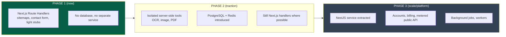
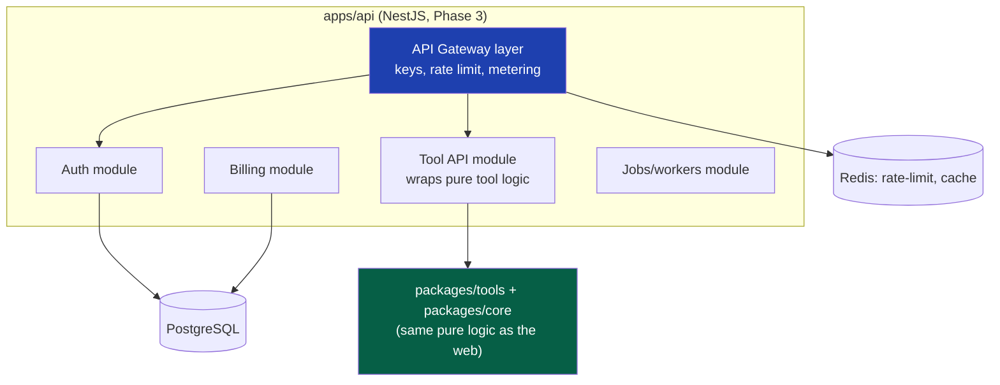
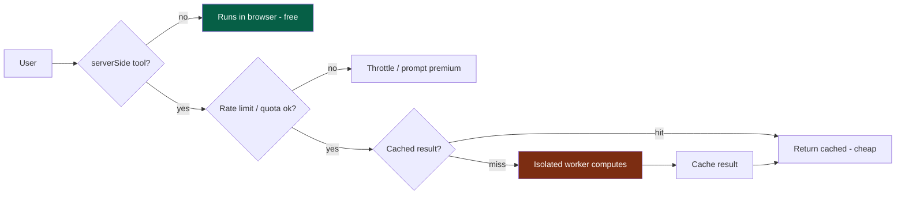

# 11 — Backend Architecture

> **Status:** Draft v1 · **Owner:** CTO / Principal Backend Engineer · **Audience:** Everyone building server-side logic, APIs, or server-dependent tools
> **Governed by:** `00`–`10`, and especially the phased-backend decision in `04`, §7. This document defines *what runs on our servers*, *where NestJS fits*, and *how server-dependent tools are isolated and cost-controlled*. It respects the phasing you approved: build the seams now, add the heavy service when complexity justifies it.

---

## 1. The Backend's Job (and What It Deliberately Is Not)

For most platforms, the backend is the center of gravity. For UToolios, it is deliberately *minimal* for a long time, because most tools are pure client-side functions (`02`, C3) that need no server at all. The backend exists only for the things that genuinely *cannot* happen in the browser.

**What genuinely needs a server:**
- **Heavy computation** — OCR, background removal, image/PDF processing (can't run well or securely in a browser).
- **Persistence** — accounts, saved data, usage metering (needs a database).
- **Secrets** — anything requiring an API key we can't expose to the client.
- **The public API** — programmatic access to tool logic (`03`, R4).
- **Cross-cutting server jobs** — sitemaps at scale, scheduled data refreshes, email.

**What does NOT need a server (and must never be pushed to one):**
- Any pure calculation (mortgage, BMI, unit conversion, JWT decode, text tools).

**Simple explanation:** the backend is the *specialist workshop* out back, not the storefront. The storefront (the browser) handles almost everything customers do — the instant calculators. The workshop only handles the few jobs that need heavy machinery (OCR), a locked cabinet (secrets), or a filing system (the database). We keep the workshop small and only send it work that truly belongs there.

> **CTO note:** the standing risk from `03`, §9 lives here. Every piece of logic we move to the server converts a *free, client-side* operation into a *paid, per-request* one. So the backend's guiding principle is **"server only when unavoidable."** A backend that grows because it's convenient rather than necessary quietly destroys our unit economics. Every new server endpoint must justify why it can't be client-side.

---

## 2. The Phased Backend (Recap and Commitment)

Per `04`, §7, we build the backend in phases. This is the commitment restated so it governs the rest of this chapter.

| Phase | Backend shape | Why |
|-------|---------------|-----|
| **1 (now)** | Next.js Route Handlers only | Zero users; most tools client-side; a second service is pure overhead |
| **2** | + isolated server-tools, + Postgres/Redis | Traffic exists; some tools need compute; we start storing state |
| **3** | + NestJS service | Real server-side domains (accounts, billing, API) justify a structured backend |

**Simple explanation:** we don't build the big backend office (NestJS) on day one. We use the small "back room" that Next.js already gives us (Route Handlers) for the little server work we have now. When we accumulate enough real server work — accounts, billing, a public API — *then* we build the proper office. Because our tool logic is framework-free (`08`), moving into that office later is a *relocation*, not a *rebuild*.

---

## 3. Phase 1: The Next.js Route Handler Backend

In Phase 1, the "backend" is just the server side of our Next.js app — Route Handlers (`app/api/.../route.ts`) and Server Components. This is enough for everything we actually need now.

| Phase-1 server need | Handled by | Why not a separate service |
|---------------------|------------|-----------------------------|
| `sitemap.xml`, `robots.txt` | Next.js `sitemap.ts` / `robots.ts` (`14`) | Built into the framework; free |
| Contact / feedback form | A single Route Handler | One endpoint doesn't justify a service |
| Server-fetched data (e.g. tax rates) | Server Component fetch | Runs at render/build; no standing service |
| Light API stubs (future-proofing) | Route Handlers behind our own interface | Establishes the API *seam* without the weight |

**Simple explanation:** Next.js isn't just a frontend framework — it has a capable server built in. For the handful of server tasks we have at launch (generating the sitemap, handling a contact form, fetching some data), that built-in server does the job perfectly. Standing up a whole separate backend service to handle a contact form would be like renting a warehouse to store one box.

> **CTO note:** the critical discipline in Phase 1 is to build these behind *our own interfaces* (`00`, 4.10 Replaceable), even though they're simple. A contact form handler calls `notify.send()`, not a hardcoded email SDK. This way, when NestJS arrives in Phase 3, moving the logic is a matter of re-pointing an interface, not rewriting call sites scattered through the app. Cheap seam now, cheap migration later.

---

## 4. Phase 3: Why and How NestJS

NestJS enters when we have **real, sustained server-side complexity** — not before. This section documents the *target* design so it's ready when the trigger arrives.

### The trigger conditions (any of these justifies extracting NestJS)
- We're building **user accounts and authentication** (`23`).
- We're building **billing** (`03`, R3).
- We're launching the **metered public API** (`03`, R4, `22`).
- We need **background workers / job queues** (scheduled data refresh, async image jobs).
- Route Handlers are becoming a tangle of ad-hoc server logic that wants real structure.

### Why NestJS (when the time comes)

| NestJS strength | Why it matters at Phase 3 |
|-----------------|----------------------------|
| **Opinionated modular structure** | Enforces organization across a growing backend team (consistency, `00`) |
| **Dependency injection** | Makes services testable and swappable (`00`, 4.10) |
| **Built-in patterns** for guards, interceptors, pipes | Auth, rate limiting, validation as first-class, reusable concerns |
| **Strong TypeScript integration** | Same language and type discipline as the frontend (`08`) |
| **Mature ecosystem** | Queues, scheduling, WebSockets, GraphQL if ever needed |

**Simple explanation:** NestJS is a well-organized office building with rooms already laid out for common needs (security desk, mail room, meeting rooms). When we have enough server-side "staff" (accounts, billing, API, jobs) to fill it, that structure keeps everyone organized. Before we have that staff, the empty building is just overhead — which is exactly why we wait.

### The target backend module shape

**The keystone:** the NestJS Tool API module **reuses the exact same `calculator.ts` logic** the website uses. It does *not* reimplement any tool. This is the payoff of Clean Architecture (`04`) and framework-free logic (`08`) — the API is a *new door into the same room*, not a second copy of the house (`03`, R4).

---

## 5. Server-Dependent Tools — Isolation and Cost Control

Some tools genuinely need a server (OCR, background removal, image/PDF processing). These are the economic danger zone (`03`, §9), so they get special architectural treatment.

### The rules for server-dependent tools

| Rule | Why |
|------|-----|
| **Clearly flagged in `tool.config.ts`** (`serverSide: true`) | The platform knows to treat them differently (cost, caching, limits) |
| **Rate-limited by default** | A viral free server-tool can't produce a runaway bill |
| **Isolated execution** | Heavy/untrusted processing runs sandboxed, never in the main app process (`25`) |
| **Cost-modeled before launch** | We estimate cost-per-use and set limits accordingly |
| **Candidates for premium gating** (`03`, R3) | Expensive tools may be limited for free users, fuller for premium |
| **Aggressively cached where possible** | Same input → cached result, avoiding recompute cost |

**Simple explanation:** a client-side tool (BMI) costs us nothing — the user's device does the work. A server-side tool (OCR) costs us real money each time it runs on our machines. So for server-side tools we add a meter (rate limits), a lock (sandbox), and a memory (cache) — so we can't get a surprise bill, untrusted files can't harm us, and repeated requests reuse work instead of redoing it. Some may become premium features because they genuinely cost money to provide.

> **CTO note — this is one of the most important cost decisions in the whole platform.** The failure mode is subtle: a free OCR tool goes viral, thousands of users upload huge files, and our cloud bill explodes overnight with no corresponding revenue. The isolation + rate-limit + cache pattern is our insurance against that. **We identify and cost-model every `serverSide: true` tool *before* it launches** — never after the bill arrives. This is a hard gate, not a nice-to-have.

---

## 6. API Design Principles (Backend-Internal)

Even before the public API (`22`), our internal server endpoints follow consistent principles so they're ready to become public later.

| Principle | Meaning | Why |
|-----------|---------|-----|
| **Stateless** | Each request carries what it needs; no server-side session assumptions | Scales horizontally; any server can handle any request |
| **Validated at the edge** | Every endpoint validates input with a schema (`08`, §3) | Security (`25`) + correctness (`02`) |
| **Consistent shape** | Uniform success/error response envelope | Predictable for clients and for our own frontend |
| **Versioned when public** | Public contracts are versioned (`49`) | An API is a promise; we evolve without breaking clients |
| **Observable** | Every endpoint emits traces/metrics (`28`) | We can see latency, errors, usage per endpoint |

**Simple explanation:** we design even our internal endpoints as if they might become public one day (many will — that's the API business). That means: don't assume hidden state, always check inputs, always respond in the same predictable shape, and always emit the data that lets us watch how it's performing. Building this discipline in from the first endpoint means the public API is a *promotion* of existing endpoints, not a rewrite.

> **CTO note:** "stateless" is the one to internalize. A stateless backend can run as many identical copies as traffic demands, behind a load balancer, with any copy handling any request. A stateful backend (where server memory holds session data) can't scale that way and becomes a bottleneck. Statelessness is what lets the backend scale to millions of API requests (`01` scale target) — we bake it in from endpoint #1.

---

## 7. How the Backend Stays Replaceable and Testable

Two constitution principles (`00`, 4.10) get concrete backend expression:

**Replaceable:** every external dependency sits behind our own interface.
- Database access goes through Prisma + a repository layer, not raw SQL scattered everywhere (`12`).
- Email/notifications go through `notify.send()`, not a vendor SDK directly.
- File storage goes through a `storage` interface, so R2/S3 is swappable (`42`, `43`).

**Testable:** backend logic is testable without spinning up the whole world.
- Pure tool logic tests need no server or DB (it's pure, `08`).
- Service logic uses dependency injection so tests supply fakes (no real DB/email in unit tests).
- Integration tests run against a disposable test database (`39`).

**Simple explanation:** we never let the backend get "welded" to a specific vendor or require the full system to be running just to test one piece. Each external thing (database, email, storage) is behind a labeled plug we can swap or fake. This keeps us free to change providers (Replaceable) and to test any piece in isolation (Testable) — both of which matter enormously over a 10-year life.

---

## 8. Summary

- The backend is deliberately **minimal and grows only when unavoidable**, because most tools are pure client-side functions and every server operation converts a free action into a paid one.
- We follow the **approved phasing**: Phase 1 uses only **Next.js Route Handlers** (sitemaps, contact form, light stubs) behind our own interfaces; Phase 2 adds isolated server-tools + Postgres/Redis; Phase 3 extracts **NestJS** when real server-side domains (accounts, billing, metered API, jobs) justify it.
- **NestJS reuses the exact same pure tool logic** as the web — the API is a *new door into the same room*, never a second implementation (`04`, `08`).
- **Server-dependent tools are the economic danger zone** and get mandatory treatment: flagged, rate-limited, sandboxed, cost-modeled *before launch*, cached, and possibly premium-gated — our insurance against a viral tool producing a surprise cloud bill.
- Internal endpoints follow **public-ready principles** (stateless, validated, consistent shape, versioned-when-public, observable) so the public API is a promotion, not a rewrite. **Statelessness** is what lets the backend scale to millions of requests.
- Everything external sits behind **our own interfaces** (Replaceable) and backend logic is **testable in isolation** via dependency injection.

> Next: `12-DATABASE-ARCHITECTURE.md` — the data layer: PostgreSQL + Prisma modeling, when data is introduced (Phase 2), schema conventions, migrations, and how we keep the database a safe, evolvable foundation.

---

### Changelog
| Version | Date | Change | Reason |
|---------|------|--------|--------|
| v1 | (draft) | Initial backend architecture | Project inception |
