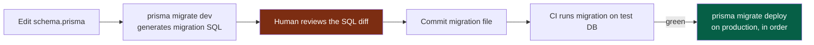

# 12 — Database Architecture

> **Status:** Draft v1 · **Owner:** CTO / Principal Backend Engineer · **Audience:** Everyone who models data, writes queries, or changes the schema
> **Governed by:** `00`–`11`. Per `04`/`11`, the database is a **Phase 2** introduction — we don't build it while tools are stateless. This document defines *how we model, evolve, and protect data* when it arrives, so the data layer is a safe, evolvable foundation for the next decade.

---

## 1. When (and Why) the Database Arrives

We introduce PostgreSQL only when we have **state to persist** — which, per the phasing (`11`, §2), is Phase 2 onward. Phase 1 tools are pure functions with nothing to store.

**What first requires a database:**
- **Usage metering** — counting tool usage / API calls (feeds analytics and future API billing).
- **Saved user data** — once accounts exist (premium, `03`, R3).
- **Content that outgrows files** — if tool content/config moves from files to a CMS (`33`).
- **Audit logs** — security-relevant events (`25`).

**Simple explanation:** a database is long-term memory. Phase 1 tools have no memory — you calculate, you get an answer, nothing is remembered, and that's fine. The moment we need to *remember* something across visits — who's a premium user, how often a tool is used — we need that long-term memory. We add it exactly when the first real need appears, not before (YAGNI, `00`).

> **CTO note:** resist adding a database "because real apps have one." A database is a stateful, backup-requiring, migration-managing commitment. Introducing it before there's data to store adds operational weight (hosting, backups, connection management) with zero benefit. **The trigger is a concrete need to persist something, not a milestone on a calendar.**

---

## 2. Why PostgreSQL

The brief specifies PostgreSQL; I fully endorse it. Here's the reasoning so the choice is understood, not just followed.

| PostgreSQL strength | Why it matters for us |
|---------------------|------------------------|
| **Rock-solid relational integrity** | Metering, billing, accounts need correctness and constraints (foreign keys, transactions) |
| **JSONB support** | Flexible semi-structured data (e.g. tool config, event payloads) *without* leaving SQL |
| **Mature, battle-tested, everywhere** | 30 years of reliability; available on every cloud; huge talent pool |
| **Powerful indexing & full-text** | Scales queries well; can even do basic search before Meilisearch (`32`) |
| **Extensions** (e.g. `pg_stat`, PostGIS if ever needed) | Grows with us without switching engines |
| **Strong TypeScript tooling** (Prisma) | Type-safe access matching our `08` standards |

**Simple explanation:** PostgreSQL is the "boring, dependable" choice — and boring is exactly what you want for the thing that holds your business's memory. It's relational (great for structured data like accounts and billing) but *also* handles flexible JSON when we need it, so we rarely have to reach for a second database. One dependable engine covers almost all our needs.

> **CTO note — why not a NoSQL database?** For our data (accounts, metering, billing — inherently relational with integrity requirements), a relational database is the correct tool. NoSQL shines for massive, schema-loose, denormalized workloads we don't have. And PostgreSQL's JSONB gives us NoSQL-style flexibility *inside* a relational engine when we occasionally want it. Running one database we understand deeply beats running two we understand shallowly (KISS, `00`).

---

## 3. Why Prisma (the ORM)

Prisma is our interface to PostgreSQL. It sits behind our own repository layer (`11`, §7, Replaceable).

| Prisma strength | Why it matters |
|-----------------|----------------|
| **Type-safe queries** | The database schema generates TypeScript types — queries are checked at compile time (`08`) |
| **Single source of schema truth** | One `schema.prisma` file describes all tables; no drift between code and DB |
| **First-class migrations** | Schema changes are versioned, reviewable, and repeatable (§6) |
| **Readable query API** | Clear, discoverable — good for humans and AI (B3) |
| **Connection pooling awareness** | Handles serverless/edge connection concerns (important with Next.js) |

**Simple explanation:** Prisma is a type-safe translator between our TypeScript code and the database. We describe our tables once in a schema file; Prisma generates matching TypeScript types, so if we write a query that asks for a column that doesn't exist, the *compiler* catches it — not a user at runtime. It turns whole classes of database bugs into compile errors.

**Example of the safety:** if a query tries to read `user.emailAddress` but the column is `user.email`, TypeScript fails the build immediately. Without Prisma's generated types, that mistake would ship and crash in production.

> **CTO note — the repository layer over Prisma:** we don't call Prisma directly all over the codebase. Data access goes through a thin **repository layer** (e.g. `userRepository.findById()`). Two reasons: (1) Replaceable — if we ever swap ORMs, we change the repository internals, not hundreds of call sites; (2) it's the natural place for consistent access patterns, soft-delete rules, and audit hooks. Prisma is excellent, but we still don't weld the whole app to it.

---

## 4. Schema Design Principles

How we model tables so the schema stays clean, correct, and evolvable.

| Principle | Meaning | Example |
|-----------|---------|---------|
| **Normalize by default, denormalize with evidence** | Avoid duplicated data unless a measured performance need justifies it | One `users` table, referenced by `user_id`, not copied |
| **Every table has a surrogate primary key** | Use a stable `id` (UUID or CUID), not a natural key that might change | `id` for users, not email |
| **Foreign keys enforce relationships** | The database guarantees referential integrity | A `usage` row can't reference a non-existent tool |
| **Timestamps everywhere** | `created_at`, `updated_at` on every table | Enables auditing, debugging, time-based queries |
| **Soft-delete where history matters** | `deleted_at` instead of hard delete for important records | Recover from mistakes; keep audit trail |
| **Constraints in the DB, not just the app** | `NOT NULL`, `UNIQUE`, `CHECK` at the database level | The DB is the last line of defense for data integrity |
| **JSONB for genuinely flexible data only** | Structured columns for known fields; JSONB for variable payloads | Event metadata in JSONB; email in a real column |

**Simple explanation:** we design tables like a careful librarian designs a catalog. Every record has a permanent ID that never changes (even if the person's email does). Relationships are enforced by the database itself, so you *can't* accidentally record usage for a tool that doesn't exist. Every record knows when it was created and last changed. Important things are marked deleted rather than truly erased, so mistakes are recoverable. And the database enforces its own rules, so even a buggy piece of code can't corrupt the data.

> **CTO note — "constraints in the DB, not just the app" is a hill worth defending.** Application-level validation (our Zod schemas, `08`) catches most bad data, but the database constraint is the *last* guarantee — it holds even if a bug bypasses the app, a migration script runs, or a future service writes directly. Data outlives code; the database's own rules are what keep years of accumulated data trustworthy. Never rely solely on the app to protect data integrity.

---

## 5. Naming and Conventions (Database-Specific)

Consistent with `09`, database objects have their own casing rules (SQL convention differs from TypeScript).

| Object | Convention | Example |
|--------|-----------|---------|
| Tables | `snake_case`, **plural** | `tool_usages`, `users`, `audit_logs` |
| Columns | `snake_case` | `created_at`, `user_id`, `tool_slug` |
| Foreign keys | `<referenced_singular>_id` | `user_id`, `tool_id` |
| Primary key | `id` | `id` |
| Indexes | `idx_<table>_<columns>` | `idx_tool_usages_tool_slug` |
| Booleans | `is_`/`has_` prefix | `is_active`, `has_verified_email` |
| Timestamps | `_at` suffix | `created_at`, `deleted_at` |

**The one-canonical-name rule holds across the boundary (`09`, §5):** a tool's `kebab-case` slug (`mortgage-calculator`) is what's stored in a `tool_slug` column. Prisma maps the `snake_case` DB world to our `camelCase` TypeScript world automatically, so each side follows its own convention without manual translation.

**Simple explanation:** databases traditionally use `snake_case` (lowercase with underscores) and plural table names — so we follow that tradition inside the database. Prisma automatically translates between the database's `snake_case` and our code's `camelCase`, so nobody has to think about it. The tool's canonical name (its slug) is the *same string* in the database as in the URL and analytics — so tracing one tool across the whole system is still one search.

---

## 6. Migrations — Evolving the Schema Safely

The schema *will* change over 10 years. Migrations are how we change it without losing data or breaking production. This is a core safety topic.

### Migration rules

| Rule | Why |
|------|-----|
| **Migrations are versioned files, committed to git** | The schema's full history is reviewable and reproducible |
| **Migrations are reviewed like code** | A bad migration can lose data — it deserves the same scrutiny as logic |
| **Forward-only in production; never edit a shipped migration** | Editing history desyncs environments; write a new migration to fix |
| **Expand → migrate → contract for breaking changes** | Add new, backfill, switch, then remove old — zero-downtime |
| **Test migrations on a copy before production** | Catch data-loss or lock issues before they hit users (`39`) |
| **Backup before risky migrations** | The safety net if a migration goes wrong (`44`) |

**The expand/contract pattern (simple explanation):** say we rename a column. Doing it in one step would break any running code still using the old name. Instead: (1) *Expand* — add the new column alongside the old; (2) *Migrate* — copy data over and update code to write both/read new; (3) *Contract* — once nothing uses the old column, remove it. Like renovating a bridge one lane at a time so traffic never stops. This is how we change the schema on a live site with millions of users and zero downtime.

> **CTO note:** migrations are the single most dangerous routine operation on a data-bearing system. A careless `DROP COLUMN` or an unindexed change that locks a huge table can cause data loss or an outage. That's why migrations get *human review of the generated SQL* (not just the schema change) and are tested on a real copy first. **We never let an auto-generated migration reach production unreviewed** — this is a hard rule, especially important as AI generates schema changes (B3).

---

## 7. Performance and Scaling the Data Layer

The database must scale toward the `01` target (millions of users, millions of API requests). We plan the growth path now, build it as needed.

| Concern | Approach | When |
|---------|----------|------|
| **Indexing** | Index columns used in `WHERE`/`JOIN`/`ORDER BY`; review query plans | From first tables |
| **Connection pooling** | Pooler (e.g. PgBouncer / provider pooling) — vital with serverless | When traffic grows |
| **Caching hot reads** | Redis in front of frequent, rarely-changing queries (`21`) | Phase 2 |
| **Read replicas** | Route read-heavy queries to replicas | When reads dominate at scale |
| **Partitioning** | Partition huge time-series tables (e.g. `tool_usages` by month) | When a table gets very large |
| **Archiving** | Move old, cold data out of hot tables | When retention grows |

**Simple explanation:** we scale the database in stages, matched to real load. First, good indexes (so queries don't scan whole tables). Then connection pooling (so thousands of visitors don't each open a separate database connection and exhaust it). Then Redis caching for the same-answer-every-time queries. Later, read replicas (extra copies for reading) and partitioning (splitting giant tables into manageable chunks). Each step is added when metrics show it's needed — not speculatively.

> **CTO note — the metering table is the one to watch.** Usage/analytics tables grow *fast* (a row per tool use across millions of uses). Left unmanaged, they become the biggest, slowest table and drag down everything. We plan from the start to partition them by time and archive old data. Also — for pure high-volume analytics, we may keep detailed events *out* of PostgreSQL entirely and in a purpose-built store (`31`), using Postgres only for the aggregates that need relational integrity. Right tool for each data shape.

---

## 8. Data Integrity, Security, and Privacy

The database holds our most sensitive assets (user data, once we have it), so it inherits the security non-negotiable (`00`, N1) directly.

| Practice | Why | Chapter |
|----------|-----|---------|
| **Parameterized queries only** (Prisma does this) | Prevents SQL injection (OWASP) | `25`, `26` |
| **Least-privilege DB credentials** | App user can't drop tables; admin access separated | `25`, `45` |
| **Encryption at rest and in transit** | Data protected on disk and over the wire | `42`, `43` |
| **PII minimization** | Store the least personal data necessary | `36` (privacy), `25` |
| **Audit logging of sensitive changes** | Trace who changed what (accounts, billing) | `25`, `29` |
| **Backups + tested restore** | Data survives failure; restore is *proven*, not assumed | `44` |

**Simple explanation:** the database is the vault. We only let the application in with a limited key (it can read/write data but can't destroy tables). We store as little personal information as possible (you can't leak what you don't hold). Everything is encrypted. Sensitive changes are logged. And we don't just *make* backups — we *practice restoring* them, because a backup you've never tested is just a hope.

> **CTO note — "tested restore, not just backup" is a lesson many learn the hard way.** Countless teams have backups that turn out to be corrupt or incomplete *exactly* when they're needed. A backup is worthless until you've proven you can restore from it. Our disaster-recovery plan (`44`) includes *scheduled restore drills*, not just backup schedules. The measure of a backup system is a successful restore, full stop.

---

## 9. Summary

- The database is a **Phase 2 arrival** — introduced only when there's genuine state to persist (metering, accounts, audit logs), never speculatively (YAGNI).
- **PostgreSQL** is the dependable, relational-plus-JSONB choice that covers almost all our needs with one well-understood engine; **Prisma** gives type-safe access that turns database mistakes into compile errors — behind our own repository layer for replaceability.
- **Schema principles** keep data trustworthy: surrogate keys, enforced foreign keys, timestamps everywhere, soft-deletes where history matters, and **constraints in the database itself** as the last line of defense — because data outlives code.
- **Database naming** follows SQL convention (`snake_case`, plural tables); Prisma auto-translates to our `camelCase` code, and the tool slug stays the one canonical name across the boundary.
- **Migrations are the most dangerous routine operation** — versioned, human-reviewed at the SQL level, tested on a copy, forward-only in production, and done via **expand/contract for zero-downtime** breaking changes. AI-generated migrations are never merged unreviewed.
- **Scaling is staged** (indexes → pooling → Redis cache → replicas → partitioning), added on evidence; the fast-growing **metering table** is planned for partitioning/archiving from the start, and may live partly outside Postgres.
- The database inherits **security by default**: parameterized queries, least privilege, encryption, PII minimization, and — critically — **backups with *tested* restores**, because an untested backup is only a hope.

> Next: `13-TOOL-PLUGIN-ARCHITECTURE.md` — the heart of the platform: the exact plugin contract, how the engine discovers and validates tools, and how one folder becomes a fully-optimized live tool. This is the chapter every other one has been pointing toward.

---

### Changelog
| Version | Date | Change | Reason |
|---------|------|--------|--------|
| v1 | (draft) | Initial database architecture | Project inception |
