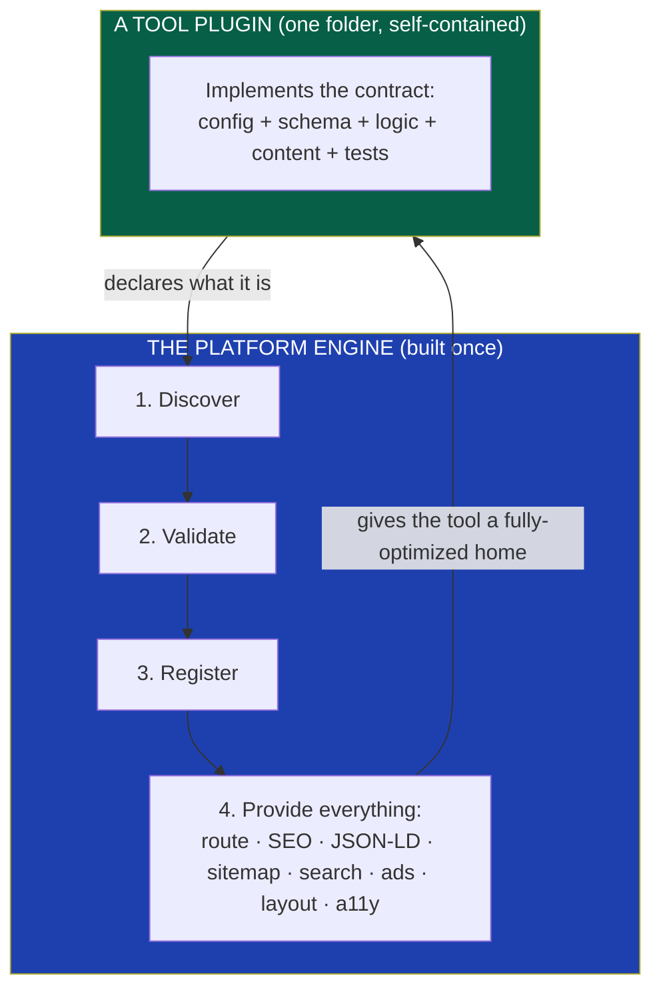
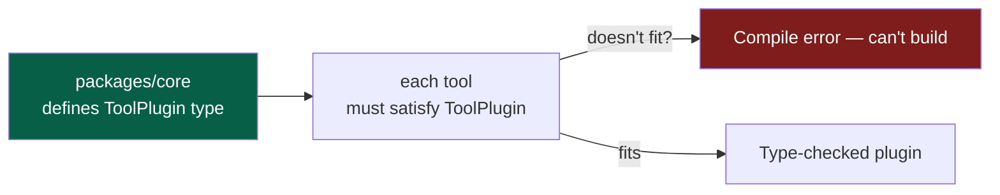
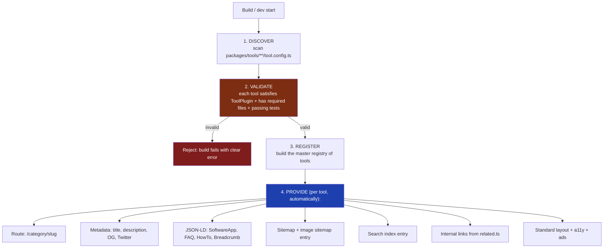
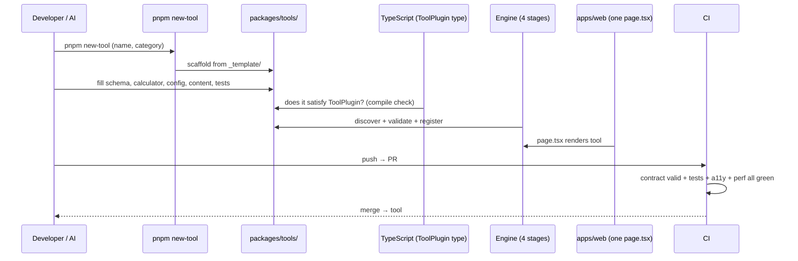

# 13 — Tool Plugin Architecture

> **Status:** Draft v1 · **Owner:** CTO / Principal Architect · **Audience:** Everyone — this is the contract every tool obeys and every part of the platform depends on
> **Governed by:** `00`–`12`. This is the chapter the whole documentation has pointed toward. It defines the **plugin contract** (`00`, N2): the exact shape of a tool, how the engine discovers and validates it, and how one folder becomes a fully-optimized live tool with zero platform code changes.

---

## 1. Why This Is the Most Important Chapter

Everything else in this documentation exists to support one mechanism: **a tool is a self-contained plugin, and the platform is an engine that turns any plugin into a fully-optimized live tool automatically** (`04`, §2). If this contract is right, the platform scales to 1,000+ tools maintained by a tiny team and generated by AI (Bets B2, B3). If it's wrong, every tool becomes a custom project and the whole business model collapses.

**The promise this chapter must deliver (the brief's core requirement):**
> Adding Tool #501 requires only adding one plugin folder. No frontend code changes. The platform automatically registers the route, generates metadata, JSON-LD, sitemap entries, breadcrumbs, internal links, search registration, analytics, ads, layout, SEO, accessibility, and security.

**Simple explanation:** this is the "USB standard" for tools (`00`, N2). We define one plug shape. Any tool that fits the plug gets everything — power, connection, recognition — automatically. This chapter is the exact specification of that plug. Get it precise enough and adding a tool becomes as simple as plugging in a USB device: it just works, no configuration.

> **CTO note:** the discipline here is *ruthless precision*. A vague contract ("tools should export their config somehow") is worthless — humans interpret it differently and AI can't follow it reliably. Every field, every filename, every type must be exact, so that discovery is mechanical and generation is deterministic. **This contract is the platform's constitution-within-the-constitution.** We change it rarely and carefully, because 1,000 tools depend on it.

---

## 2. The Two-Layer Model



**The division of labor:**
- **The tool declares *what it is*** (its identity, inputs, logic, content) — and *nothing about how the platform works*. A tool never touches routing, SEO tags, or ad placement.
- **The engine provides *everything about how it's presented*** — reading the tool's declaration and generating all the platform machinery around it.

**Simple explanation:** the tool is a *tenant* who fills out a simple move-in form (name, what they do, their content). The engine is the *building management* that reads the form and handles everything else — the address, the directory listing, the signage, security, utilities. The tenant never wires their own electricity; they just declare who they are and management does the rest.

---

## 3. The Plugin Contract — The Exact Shape

Every tool is a folder (`06`) containing these files. This is the contract. The engine relies on these *exact* names and shapes.

```
mortgage-calculator/
├── tool.config.ts     # Identity + platform flags (the "move-in form")
├── schema.ts          # Input/output validation (Zod)
├── calculator.ts      # Pure logic (the brain) — no framework imports
├── seo.ts             # SEO specifics
├── faq.md             # FAQ content → FAQ JSON-LD
├── article.md         # Long-form SEO/help content
├── examples.ts        # Worked examples (content + test fixtures)
├── related.ts         # Related tool IDs → internal linking
├── tests.spec.ts      # Correctness tests
└── icon.svg           # Tool icon
```

### 3.1 `tool.config.ts` — The Identity and Flags

This is the file the engine reads first. It's the tool's "ID card." Conceptually:

| Field | Purpose | Example |
|-------|---------|---------|
| `id` / `slug` | Canonical name (= folder = URL = analytics, `09`) | `mortgage-calculator` |
| `title` | Human-facing title | `Mortgage Calculator` |
| `category` | Which category cluster | `finance` |
| `summary` | One-line description (used in meta + listings) | `Calculate your monthly mortgage payment.` |
| `tags` | Keywords for search/related | `['mortgage','loan','finance']` |
| `serverSide` | Does it need a server? (`11`, §5) | `false` |
| `tier` | Bronze/Silver/Gold (`02`, §5) | `silver` |
| `flags` | Platform behaviors (ads, related, etc.) | `{ ads: true, showRelated: true }` |
| `status` | draft / published | `published` |

**Simple explanation:** `tool.config.ts` is a small, structured "about me" file. It tells the engine the tool's name, category, what it's for, whether it needs a server, and which platform features to switch on. Everything the engine needs to *place* and *present* the tool comes from here. No logic — just declaration.

### 3.2 `schema.ts` — The Validated Inputs and Outputs

Defines, with Zod, exactly what the tool accepts and returns (`08`, §3).

**Simple explanation:** the tool's "form rules." It says the mortgage tool takes a positive principal, a rate between 0–100, and a positive number of years — and returns a monthly payment and a total. This single file powers input validation, the web form's constraints, the API's request validation, and TypeScript types — all from one declaration (DRY, `00`).

### 3.3 `calculator.ts` — The Pure Logic

The tool's actual work: a pure function (`08`, §4) from validated input to output. No React, no fetch, no framework.

**Simple explanation:** the brain. Give it the validated inputs, it returns the answer. Because it's pure, it's trivially testable, reusable by the API and mobile (`03`, R4), and safe for AI to generate. This is the *only* file that contains the tool's unique intelligence — everything else is declaration and content.

### 3.4 The Content Files (`seo.ts`, `faq.md`, `article.md`, `examples.ts`)

Declarative content that the engine turns into SEO and on-page help.

**Simple explanation:** these are the words. `seo.ts` gives search-specific hints; `faq.md` becomes both on-page FAQs *and* FAQ structured data for Google; `article.md` is the in-depth help content that makes the page rank; `examples.ts` are worked examples shown to users *and* reused as test data. Content lives with the tool, editable by a writer or AI without touching the logic.

### 3.5 `related.ts` and `tests.spec.ts`

- `related.ts` — the IDs of sibling tools; the engine turns these into internal links (`18`).
- `tests.spec.ts` — correctness tests proving the logic against known values (`02`, C2; `39`).

**Simple explanation:** `related.ts` is the tool saying "people who use me often need these too" — which becomes the internal links that spread SEO authority. `tests.spec.ts` is the proof the math is right — the quality gate that CI enforces before the tool can go live.

---

## 4. The Contract as a Type (What Makes It Enforceable)

The contract isn't just a convention — it's a **TypeScript type** defined in `packages/core` (`05`). Every tool must satisfy it, or the code doesn't compile.



**Conceptually**, `packages/core` exports a `ToolPlugin` interface: the required config fields, the schema shape, the logic signature, the content fields. A tool's files together must form a valid `ToolPlugin`. If a tool forgets a required field or gives it the wrong type, **TypeScript fails the build** (`08`).

**Simple explanation:** the contract is written as a strict "shape" in code. A tool is checked against that shape by the compiler. If the tool is missing its category, or its logic has the wrong signature, the build fails *immediately* — the same way a USB device with the wrong pins physically won't fit. This turns "please follow the contract" into "you literally cannot build a tool that breaks the contract." That's the difference between a hope and a guarantee.

> **CTO note:** making the contract a *type* is the single most important technical decision in this chapter. A documented convention degrades; a compiler-enforced type cannot. It's also what makes AI generation safe — the AI's output is checked against the exact same type, so a malformed AI-generated tool fails the build instead of shipping broken (`07`, §9). The type *is* the contract; the prose in this doc just explains it.

---

## 5. The Engine — How a Folder Becomes a Live Tool

The engine (`packages/engine`, `06`) runs four stages. This is the machinery behind the brief's promise.



### Stage 1 — Discover
The engine scans `packages/tools/**` for `tool.config.ts` files. Each one found is a candidate tool. **No manual registration list** — presence of the folder *is* the registration (Convention over Configuration, `00`, 4.7).

### Stage 2 — Validate
Each candidate is checked against the contract (`04`): does it satisfy `ToolPlugin`? Does it have all required files? Do its tests pass? Is the slug unique? **A tool that fails validation fails the build** — it can never reach production broken (`06`, §5).

### Stage 3 — Register
Valid tools are compiled into a **registry** — the master list the rest of the platform reads. Categories, counts, and relationships are computed here.

### Stage 4 — Provide
For every registered tool, the engine automatically generates *everything*:

| The engine auto-generates | From | Chapter |
|---------------------------|------|---------|
| The route `/category/slug` | folder path (`09`) | `10` |
| Page metadata (title, description, OG, Twitter) | `tool.config.ts` + `seo.ts` | `15` |
| JSON-LD (SoftwareApplication, FAQ, HowTo, Breadcrumb) | config + `faq.md` + `article.md` | `16` |
| Sitemap + image sitemap entry | registry + `icon.svg` | `14` |
| Breadcrumbs | category + slug | `18` |
| Internal links (related tools) | `related.ts` | `18` |
| Search index entry | config + tags | `32` |
| Analytics event wiring | canonical slug (`09`) | `31` |
| Ad slots | layout + `flags.ads` | `19` |
| Accessible layout | shared layout + `packages/ui` | `10`, `37` |
| Security (CSP, headers) | platform defaults | `25` |

**Simple explanation:** you drop in a folder. The engine finds it, checks it's valid (rejecting it loudly if not), adds it to the master list, and then *automatically* builds its web address, its Google tags, its sitemap entry, its search listing, its related links, its ads, and its accessible layout. The tool author wrote none of that — they wrote the logic and the content, and the engine did all the platform work. **This is the entire promise of the platform, made mechanical.**

---

## 6. The End-to-End Flow: Adding Tool #501

Tying it all together — the complete lifecycle:



**Nothing in `apps/web`, `packages/engine`, or any other tool changed.** Tool #501 is live with full SEO, ads, search, internal links, and accessibility — because the engine provided all of it from the one new folder. This is the brief's requirement, satisfied by construction.

---

## 7. Versioning the Contract Itself

The contract will evolve over 10 years (new optional fields, new content types). We must evolve it *without breaking 1,000 existing tools*.

| Rule | Why |
|------|-----|
| **New fields are optional or defaulted** | Existing tools keep compiling; no mass edits |
| **Breaking changes use a contract version + codemod** | A script migrates all tools at once (automation, `00`, 4.5) |
| **The `ToolPlugin` type is the source of truth** | One place to change; the compiler flags every tool that needs updating |
| **Deprecate before remove** | Mark old fields deprecated, migrate, then remove (like DB expand/contract, `12`) |

**Simple explanation:** when we improve the tool contract, we add new things as *optional* so old tools still work untouched. If we ever *must* make a breaking change, we write a script (a "codemod") that automatically updates all 1,000 tools in one pass, and the compiler tells us if we missed any. We never hand-edit 1,000 folders — that's exactly the kind of manual toil the platform exists to eliminate.

> **CTO note:** the ability to evolve the contract safely is what makes it survivable for 10 years. Because the contract is *one TypeScript type* and tools are *uniform*, a change to the type immediately reveals (via compile errors) every tool affected, and a codemod can fix them mechanically. This is uniformity paying its biggest dividend: **you can improve all 1,000 tools at once precisely because they're all the same shape.** A codebase of snowflakes could never do this.

---

## 8. Why This Architecture Delivers the Business Model

Connecting the contract back to why it matters commercially:

| Contract property | Business payoff |
|-------------------|-----------------|
| One folder = one tool, zero platform changes | Near-zero marginal cost per tool (`03` economics, B2) |
| Compiler-enforced uniformity | AI can generate tools reliably (`03`, B3; `07`, §9) |
| Auto-generated SEO per tool | Long-tail SEO at scale (`01`, B1) |
| Pure logic reused everywhere | Same code powers web + API + mobile (`03`, R4) |
| Validation rejects broken tools | Trust/quality holds at scale (`01`, B5) |
| Contract versioning + codemods | Improve 1,000 tools at once; no rewrites (10-year goal) |

**Simple explanation:** every strategic bet in `01` and every revenue stream in `03` depends on this contract working. Cheap tools (factory), reliable AI generation, long-tail SEO, the API business, trustworthy quality — all of them are *consequences* of getting this plugin contract right. This is why it's the heart of the platform: it's the single mechanism the entire business rests on.

---

## 9. Summary

- The plugin contract is the **platform's core mechanism**: a tool declares *what it is*; the engine provides *everything about how it's presented* — the tenant/building-management model.
- A tool is **one folder** with **exact, fixed-name contract files** (`tool.config.ts`, `schema.ts`, `calculator.ts`, content, `related.ts`, `tests.spec.ts`, `icon.svg`).
- The contract is a **TypeScript type (`ToolPlugin`) in `packages/core`** — so "follow the contract" becomes "you cannot compile a tool that breaks it." This is what makes it a guarantee, not a hope, and what makes AI generation safe.
- The **engine runs four stages** — Discover (scan folders), Validate (reject broken tools at build), Register (master list), Provide (auto-generate route, metadata, JSON-LD, sitemap, breadcrumbs, internal links, search, ads, layout, a11y, security).
- **Adding tool #501 changes no platform code and no other tool** — the brief's core requirement, satisfied by construction.
- The contract **evolves safely** via optional fields and codemods driven by the single `ToolPlugin` type — uniformity's biggest dividend is being able to improve all 1,000 tools at once.
- **Every strategic bet and revenue stream** (cheap factory, AI generation, long-tail SEO, API reuse, trusted quality) is a direct consequence of this contract — which is why it's the heart of the platform.

> Next: `14-SEO-ARCHITECTURE.md` — how the engine's "Provide" stage delivers world-class SEO automatically: URL strategy, canonicals, sitemaps, robots, indexation, and the overall system that turns the plugin architecture into millions of ranking pages.

---

### Changelog
| Version | Date | Change | Reason |
|---------|------|--------|--------|
| v1 | (draft) | Initial tool plugin architecture | Project inception |
