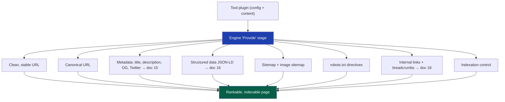
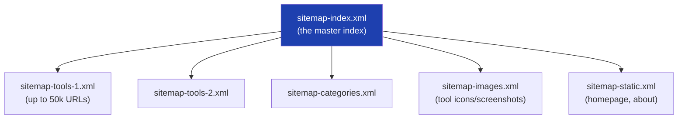

# 14 — SEO Architecture

> **Status:** Draft v1 · **Owner:** CTO / Senior SEO Architect · **Audience:** Everyone — SEO is not one team's job here; it's a property of the system every tool inherits
> **Governed by:** `00`–`13`. SEO is where the plugin engine's "Provide" stage (`13`, §5) meets the business model (`03`). This chapter defines the *overall SEO system*: URLs, canonicals, sitemaps, robots, indexation. Metadata detail is `15`, structured data is `16`, programmatic SEO is `17`, internal linking is `18`.

---

## 1. Why SEO Is Architecture, Not Marketing

For UToolios, organic search traffic *is* the business (`01`, B1; `03`, R1). We don't buy traffic; we earn it by having thousands of pages that answer real questions and rank for them. That means SEO can't be a marketing task bolted on at the end — it must be a **structural property of the platform**, generated automatically for every tool by the engine (`13`).

**Simple explanation:** most companies treat SEO like decorating a house before guests arrive. We treat it like the *plumbing and foundation* — built into the structure so every room (tool) has it automatically. When you add a tool, it's born SEO-complete: correct URL, perfect metadata, structured data, sitemap entry, internal links. Nobody "does SEO" on it afterward.

**Why this is the only approach that scales:** at 1,000+ tools, manually optimizing each page's SEO is impossible for a small team. The *only* way to have millions of well-optimized pages is to *generate* the optimization from the tool's declaration (`13`). Automated SEO is not a convenience here — it's the sole feasible strategy.

> **CTO note:** SEO is a load-bearing wall (`00`, N3) primarily because of one asymmetry: getting URL structure and canonicals *right* is nearly free if done from the start, but *wrong* is catastrophic to fix once millions of pages are indexed. A single bad decision here — a poor URL pattern, a canonical mistake — can cap the platform's entire traffic ceiling. This chapter's decisions are among the most expensive-to-reverse in the whole system.

---

## 2. The SEO System at a Glance

SEO is the sum of many automatic behaviors. Here's the whole system, showing what the engine generates for every tool.



**Simple explanation:** each tool declares itself once; the engine turns that declaration into every SEO signal Google needs — a clean web address, the right page title, structured data, a sitemap listing, and links to related tools. This chapter covers the foundation pieces (URLs, canonicals, sitemaps, robots, indexation); the other SEO chapters detail metadata, structured data, and linking.

---

## 3. URL Strategy — The Most Permanent Decision

URLs are the single most important and most *irreversible* SEO decision (`00`, N3). Once Google indexes a URL, changing it means redirects, lost link equity, and temporary ranking drops. So we design the URL structure to last a decade.

### The URL pattern

```
https://utoolios.com/[category]/[tool-slug]

Examples:
  /finance/mortgage-calculator
  /developer/jwt-decoder
  /home/tile-calculator
  /health/bmi-calculator
```

### The URL rules

| Rule | Example | Why |
|------|---------|-----|
| **Lowercase, kebab-case** | `/finance/mortgage-calculator` | Standard, clean, matches folder (`06`, `09`) |
| **Category + slug, shallow (2 levels)** | not `/tools/finance/calc/mortgage/` | Flat URLs are cleaner and clearer to users + Google |
| **Slug = the search term** | `mortgage-calculator` | The URL itself is a ranking signal (`17`) |
| **No dates, versions, IDs, or params for content pages** | not `/tool?id=42` or `/mortgage-2024` | Permanent, human-readable, keyword-rich |
| **No trailing slash (consistent)** | `/finance/mortgage-calculator` | One canonical form; avoid duplicate URLs |
| **Stable forever** | never rename a live slug | Renaming = lost rankings (`00`, N3) |

**Simple explanation:** our web addresses are short, readable, and describe exactly what's on the page — `/finance/mortgage-calculator` tells both a person and Google precisely what they'll find. We keep them shallow (just category + tool), keyword-rich (the slug is the thing people search), and *permanent* — because the moment Google memorizes an address, changing it is like moving house and hoping everyone finds your new address. We'd rather never move.

> **CTO note — the category-in-URL decision has a subtle trade-off.** Putting the category in the URL (`/finance/mortgage-calculator`) strengthens topic clustering (`17`) and readability, but it means *a tool can't easily change categories* without a URL change (and redirect). I judge this worth it: clear category clusters help rankings more than category-flexibility helps us, and tools rarely need to switch categories. But it's a deliberate trade — documented here so nobody "fixes" it later without understanding the cost. If category volatility ever became common, a flat `/tool-slug` structure would be the alternative.

### Handling URL changes when unavoidable
If a slug ever *must* change (rare), we use a **permanent 301 redirect** from old to new, preserving link equity, and update the sitemap. We never let a URL simply break. Redirect rules live at the edge (Cloudflare, `43`) for speed.

---

## 4. Canonical URL Strategy — Preventing Duplicate-Content Dilution

A "canonical URL" tells Google "*this* is the one true address for this content." It prevents Google from seeing the same content at multiple URLs and splitting the ranking value (or penalizing duplication).

### Where duplication can sneak in

| Source of duplication | Example | Our handling |
|-----------------------|---------|--------------|
| Query parameters | `?ref=twitter`, `?utm_source=...` | Canonical points to the clean URL |
| Trailing slash / case variations | `/Finance/Mortgage-Calculator/` | Normalize + canonical to lowercase, no-slash |
| Pagination (listing pages) | `/finance?page=2` | Self-canonical + proper pagination signals |
| Localized versions | `/es/finance/...` | `hreflang` + self-canonical per language (`36`) |
| `www` vs non-`www`, `http` vs `https` | both resolving | Redirect to one canonical host + HTTPS |

**The rule:** *every* page declares a **self-referencing canonical** to its clean, absolute URL by default. The engine generates this automatically from the tool's route — no tool author thinks about it.

**Simple explanation:** imagine the same shop is listed in a directory five times with slightly different addresses. The directory gets confused about which is real and splits your reviews across all five. A canonical URL is you telling the directory "these are all the same shop — count them all toward *this one* official listing." We do this automatically for every page, so Google always consolidates ranking value onto the one true URL, no matter how someone arrived (with tracking params, wrong case, etc.).

> **CTO note — canonicals are subtle and high-stakes.** A canonical mistake (e.g. every page canonicalizing to the homepage — a real, common bug) can *de-index the entire site*. Because we *generate* canonicals from the route rather than hand-writing them, we eliminate the human error that causes these disasters. But we also *test* canonical output in CI (`39`) — a wrong canonical is a silent, catastrophic bug that no user reports. Automated generation + automated verification is the only safe approach.

---

## 5. Sitemaps — Telling Google What Exists

A sitemap is a machine-readable list of all our URLs, submitted to Google so it discovers and crawls every tool. With thousands of tools, sitemaps are essential — Google won't find deep pages reliably without them.

### Sitemap architecture



| Sitemap concern | Approach | Why |
|-----------------|----------|-----|
| **50,000-URL limit per file** | Split into multiple sitemaps under an index | Google's hard limit; we'll exceed it (millions of pages, `01`) |
| **Generated from the registry** | The engine builds sitemaps from the tool registry (`13`) | Always accurate; a new tool auto-appears |
| **`lastmod` timestamps** | From tool content's last change | Signals freshness; prompts recrawl of updated tools |
| **Image sitemaps** | Tool icons/screenshots listed | Image search traffic (`03` secondary) |
| **Auto-submitted** | Ping Google/Bing on deploy; referenced in robots.txt | Fast discovery of new/changed tools |

**Simple explanation:** a sitemap is a table of contents we hand to Google saying "here is every page on our site, and here's when each was last updated." Because we'll have millions of pages (more than one sitemap file can hold), we split them into many files under one master index — like a library with a master catalog pointing to per-section catalogs. The engine builds all of this from the tool registry automatically, so a newly added tool shows up in the sitemap the moment it's live, and Google is pinged to come look.

> **CTO note:** the sitemap being *generated from the registry* (not hand-maintained) is the whole point of the plugin architecture applied to SEO. A hand-maintained sitemap at 1,000+ tools would be perpetually stale and wrong. Because ours derives from the same registry that powers routing, it is *always* correct by construction — the sitemap literally cannot disagree with what tools exist. This is Automation First (`00`, 4.5) preventing an entire category of SEO bugs.

---

## 6. Robots.txt and Crawl Control

`robots.txt` tells crawlers where they may and may not go. It's about *guiding crawl budget* to valuable pages and keeping crawlers out of pointless ones.

| Directive | Purpose |
|-----------|---------|
| `Allow` tool + category + content pages | The pages we *want* ranked |
| `Disallow` internal/utility paths (`/api/`, admin, staging) | Don't waste crawl budget or expose internals |
| `Disallow` faceted/duplicate parameter URLs | Prevent crawl traps and duplication |
| Reference the sitemap index | Point crawlers straight to our URL list |
| Host-level rules at the edge | Block bad bots (`43`) while allowing good crawlers |

**Simple explanation:** `robots.txt` is the sign at the entrance telling visiting search-engine crawlers "explore these areas (the tools), skip those (admin, internal APIs)." Search engines only spend so much effort crawling each site ("crawl budget"), so we direct that effort at the pages we actually want ranked, and away from dead-ends and internal machinery. It's generated with our real paths, referencing our sitemap, so crawlers get an efficient map on arrival.

> **CTO note — crawl budget matters more as we scale.** At a few hundred pages, Google crawls everything easily. At millions of pages, Google *rations* how much it crawls us, and wasted crawl budget (on parameter URLs, duplicates, low-value pages) means *valuable tools get crawled less often*. So crawl control isn't housekeeping — it's actively steering Google's limited attention toward the pages that earn revenue. This becomes a real optimization lever at scale (`17`).

---

## 7. Indexation Strategy — What Should (and Shouldn't) Rank

Not every URL should be in Google's index. Indexation strategy decides what gets indexed, preventing "index bloat" (thousands of thin/duplicate pages that dilute site quality in Google's eyes).

| Page type | Indexed? | Mechanism |
|-----------|----------|-----------|
| Tool pages (the money pages) | **Yes** | Default indexable |
| Category pages | **Yes** | Valuable topic hubs (`17`) |
| Article/content pages | **Yes** | SEO depth |
| Homepage, about | **Yes** | Brand + authority |
| Search results pages | **No** (`noindex`) | Thin, infinite variations = index bloat |
| Paginated deep pages | Selective | Index page 1; manage the rest |
| Draft/unpublished tools (`status: draft`) | **No** | Not ready; the engine enforces `noindex` |
| Internal/utility pages | **No** | Not user-facing |

**Simple explanation:** we want Google's index to contain our *quality* pages (tools, categories, articles) and *not* our low-value or unfinished ones (internal search results, draft tools). Too many thin pages in the index makes Google think less of the whole site — so we're deliberate: valuable pages say "index me," low-value ones say "don't." The engine enforces this automatically based on each tool's status and type, so a draft tool can never accidentally get indexed before it's ready.

> **CTO note — "index bloat" is a real and underappreciated risk for a programmatic site like ours.** When you generate thousands of pages, it's tempting to let everything be indexed. But Google evaluates sites partly on *average* page quality — flooding the index with thin variations can *lower* rankings for your good pages. Our discipline: only genuinely valuable, distinct pages get indexed; everything else is `noindex`. This is especially critical because programmatic SEO (`17`) can generate pages fast — we must generate *quality*, indexed pages, not *quantity* of thin ones. Quality of the index beats size of the index.

---

## 8. Core Web Vitals and Technical SEO Overlap

Google ranks partly on page experience (Core Web Vitals), which our frontend architecture (`10`) and performance work (`20`) already deliver. SEO and performance are the same investment here.

| Signal | How it's met | Chapter |
|--------|--------------|---------|
| LCP (load speed) | Server Components, static+edge, image optimization | `10`, `20` |
| CLS (visual stability) | Reserved ad/image space, no layout shift | `10`, `19`, `20` |
| INP (interactivity) | Minimal JS, small client islands | `10`, `20` |
| Mobile-friendliness | Responsive-by-default design system | `10`, `38` |
| HTTPS + security headers | Cloudflare + strict headers | `25`, `43` |
| Semantic HTML | Accessible-by-default components | `37` |

**Simple explanation:** Google rewards pages that load fast, don't jump around while loading, respond instantly to taps, work on phones, and are secure. Everything our frontend and performance architecture does to make tools fast and accessible *also* makes them rank better. SEO and performance aren't competing priorities — they're the same work counted twice.

---

## 9. Measuring and Protecting SEO

SEO that isn't measured degrades silently. We treat SEO output as testable and observable (`00`, N6, N7).

| Practice | What it does |
|----------|--------------|
| **CI SEO checks** | Fail the build if a page lacks a title, canonical, or valid structured data (`39`, `40`) |
| **Lighthouse SEO = 100 gate** | Every tool must score 100 SEO in CI (`20`) |
| **Structured data validation** | Validate JSON-LD against schema.org in CI (`16`) |
| **Google Search Console monitoring** | Watch indexation, coverage errors, ranking (`31`) |
| **Canonical/robots regression tests** | Catch the catastrophic silent bugs before deploy |

**Simple explanation:** we don't just *hope* SEO is right — we *check* it automatically. Before any tool ships, CI confirms it has a title, a correct canonical, valid structured data, and a perfect Lighthouse SEO score. After launch, we watch Google Search Console to see what's actually being indexed and ranked. Because the dangerous SEO bugs (bad canonical, accidental `noindex`) are silent — no user complains — automated checks are the only reliable defense.

> **CTO note:** the checks that matter most are the ones for *silent catastrophic* bugs. A missing button generates complaints; a site-wide `noindex` or a broken canonical generates *nothing* — traffic just quietly vanishes over weeks while you wonder why. That's why canonical and robots/indexation are *regression-tested in CI*. For an SEO-dependent business, these tests protect revenue as directly as a payment test would.

---

## 10. Summary

- SEO is a **structural property of the platform**, generated automatically per tool by the engine — the only approach that scales to millions of pages with a small team.
- **URLs are the most permanent decision**: clean, shallow, keyword-rich `/[category]/[tool-slug]`, lowercase kebab-case, no dates/params, and *never renamed* — because Google-indexed URLs are near-irreversible (`00`, N3).
- **Canonicals are auto-generated (self-referencing) and CI-tested** — because a canonical mistake can silently de-index the whole site; generation + verification eliminates the human error that causes these disasters.
- **Sitemaps are generated from the tool registry** (split under an index for the 50k limit, with image sitemaps and `lastmod`) — always correct by construction, auto-submitted on deploy.
- **Robots.txt steers crawl budget** toward money pages and away from dead-ends — an increasingly important lever as we scale to millions of pages.
- **Indexation strategy prevents index bloat**: only genuinely valuable, distinct pages are indexed; drafts, search results, and thin pages are `noindex` — because Google judges sites on average page quality, so *quality of the index beats size*.
- **Core Web Vitals overlap entirely with our performance/frontend work** — SEO and speed are the same investment.
- **SEO is tested in CI and monitored in production**, with special focus on the *silent catastrophic* bugs (bad canonical, accidental `noindex`) that no user reports but that quietly destroy traffic.

> Next: `15-METADATA-ENGINE.md` — how the engine generates per-tool titles, descriptions, Open Graph, and Twitter Cards automatically, and the templating system that keeps metadata unique, accurate, and optimized across 1,000+ tools.

---

### Changelog
| Version | Date | Change | Reason |
|---------|------|--------|--------|
| v1 | (draft) | Initial SEO architecture | Project inception |
