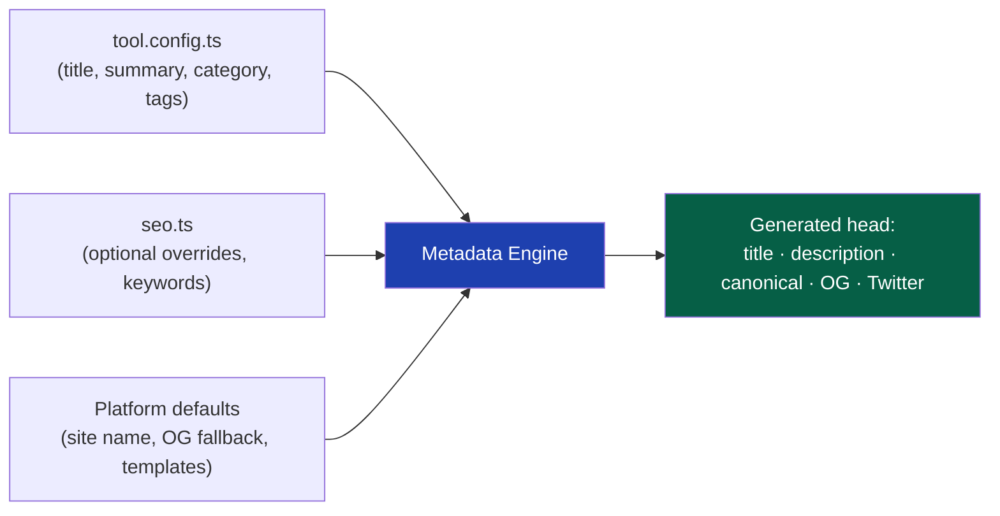
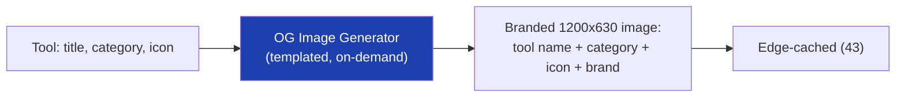
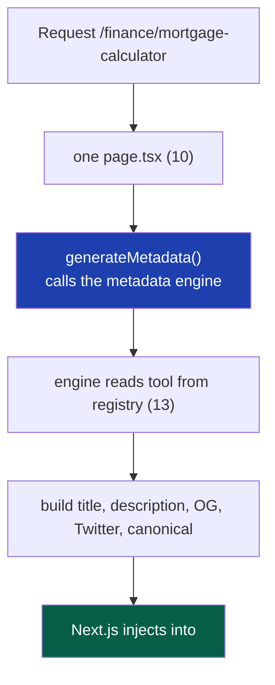

# 15 — Metadata Engine

> **Status:** Draft v1 · **Owner:** CTO / Senior SEO Architect · **Audience:** Everyone building tools or the engine; metadata is auto-generated, but you must understand how so you can supply the right inputs
> **Governed by:** `00`–`14`. This chapter details how the engine turns a tool's declaration into per-page metadata — titles, descriptions, Open Graph, Twitter Cards — automatically, uniquely, and optimally across 1,000+ tools. Structured data (JSON-LD) is `16`; this is the `<head>` metadata layer.

---

## 1. What Metadata Is and Why It's Make-or-Break

Metadata is the information *about* a page that lives in the HTML `<head>` — the title, description, and social-sharing tags. Users rarely see it directly, but it determines two revenue-critical things:
1. **How the page appears in Google search results** (the blue title + description snippet people decide whether to click).
2. **How the page appears when shared** (the card on social media, in messages, in Slack).

For a search-traffic business (`03`, R1), the metadata *is the storefront window* — it's what turns a Google impression into a click, and a click into a visit that earns ad revenue.

**Simple explanation:** metadata is the label on the product. When someone searches "mortgage calculator," Google shows them a list of labels (titles + descriptions). A clear, compelling label gets the click; a vague or missing one gets skipped — even if the tool behind it is excellent. The metadata engine's job is to give all 1,000 tools great labels automatically, so every one of them competes well in search results.

> **CTO note:** metadata quality has a direct, measurable revenue effect via **click-through rate (CTR)**. Two pages can rank in the same position, but the one with better metadata gets far more clicks — and more clicks means more visits, more ad impressions, *and* a positive ranking signal (Google notices which results people prefer). So the metadata engine isn't cosmetic; it's a compounding CTR optimization applied across every page at once. Improving the metadata *template* lifts all 1,000 tools simultaneously — leverage no manual approach could match.

---

## 2. The Core Principle: Generate, Don't Hand-Write

At 1,000+ tools, hand-writing metadata per page is impossible to do consistently and keep updated. So the engine **generates** each tool's metadata from its declaration (`13`), using smart templates with per-tool overrides where needed.



**The three inputs:**
1. **`tool.config.ts`** — the primary source (title, summary, category, tags).
2. **`seo.ts`** — optional per-tool overrides and specific keywords, when the defaults aren't ideal.
3. **Platform defaults** — templates, site name, fallback images, applied to every tool.

**Simple explanation:** instead of writing a title and description by hand for each of 1,000 tools, the engine builds them from what the tool already declared about itself, using a proven formula. A tool gets great metadata *for free* just by filling in its config. If a specific tool needs something custom, it can override via `seo.ts` — but the default is always good, so overrides are the exception, not the rule.

> **CTO note — "good default, rare override" is the design philosophy of the whole metadata engine.** If every tool *needed* a hand-crafted `seo.ts`, we'd be back to manual SEO at scale. The engine must produce *genuinely good* metadata from config alone, so that `seo.ts` overrides are reserved for the handful of high-traffic tools worth extra tuning. We measure success by how *few* tools need overrides.

---

## 3. Title Tag Generation

The `<title>` is the single most important metadata element — it's the biggest text in search results and a strong ranking signal.

### The title template

```
[Tool Title] — [Value Proposition] | [Site Name]

Examples:
  Mortgage Calculator — Estimate Your Monthly Payment | UToolios
  JWT Decoder — Decode & Inspect Tokens Online | UToolios
  BMI Calculator — Check Your Body Mass Index Free | UToolios
```

### Title rules

| Rule | Why |
|------|-----|
| **Lead with the primary keyword** (the tool name) | Google weights early words; matches the search query |
| **Under ~60 characters** (target the pixel limit) | Longer titles get truncated in results — the tail is wasted |
| **Include a value/action word** ("Estimate", "Free", "Online") | Improves CTR by promising a benefit |
| **Site name at the end** | Brand recognition without stealing keyword space |
| **Unique per tool** | Duplicate titles compete with each other and confuse Google |

**Simple explanation:** the title follows a formula: the tool's name first (because that's what people searched and what Google reads first), then a short benefit ("Estimate Your Monthly Payment"), then our brand. We keep it under ~60 characters because Google cuts off anything longer — so we front-load the important words. The engine builds this automatically from the tool's title and summary, guaranteeing every tool has a keyword-first, benefit-driven, correctly-sized title.

> **CTO note:** the ~60-character limit is a *hard* constraint many sites get wrong. A title that reads perfectly in the code but truncates to "Mortgage Calculator — Estimate Your Monthly Paym…" in results looks broken and loses CTR. The engine *enforces* the length (warning or trimming in CI, `39`), so no tool ships with a truncated title. Automated length enforcement is exactly the kind of consistency humans fail at across 1,000 pages.

---

## 4. Meta Description Generation

The meta description is the snippet below the title in search results. It doesn't directly affect ranking, but it heavily affects **CTR** — it's the sales pitch that earns the click.

### The description approach

```
[What the tool does] + [key benefit/how] + [subtle call to action]

Example (mortgage):
  Calculate your monthly mortgage payment instantly. Enter your loan
  amount, interest rate, and term to see payments, total interest,
  and more — free, no signup.
```

### Description rules

| Rule | Why |
|------|-----|
| **~150–160 characters** | The visible limit before truncation |
| **Front-load the value** | The end may be cut; lead with the benefit |
| **Include the primary keyword naturally** | Google bolds matching terms, drawing the eye |
| **Action-oriented, honest** | "Calculate instantly, free" earns clicks; no clickbait (`02`, C7) |
| **Unique per tool** | Duplicates hurt CTR and look spammy |

**Simple explanation:** the description is the two-line pitch under the title in search results. It tells the searcher exactly what they'll get and why to click *us*. The engine generates it from the tool's summary using a proven structure (what it does + the benefit + a gentle nudge), keeping it in the ~155-character sweet spot so it displays fully. Every tool gets a compelling, correctly-sized pitch without anyone writing it by hand.

> **CTO note — let Google override when it wants to.** Google increasingly rewrites descriptions based on the query. So our generated description is a *strong default*, not a guarantee of what shows. The lesson: don't over-invest in hand-crafting descriptions for tools where Google will rewrite them anyway. Provide a solid, honest default from config; save manual tuning for the top tools where every CTR point is worth real money.

---

## 5. Open Graph and Twitter Cards (Social Sharing)

When a tool link is shared (social media, messaging, Slack), these tags control the preview card — the image, title, and description that appear. A good card dramatically increases click-throughs on shared links (`03`, secondary/social traffic).

### What the engine generates

| Tag group | Purpose | Source |
|-----------|---------|--------|
| `og:title`, `og:description` | The shared card's title/text | tool config (reuses title/description logic) |
| `og:image` | The preview image (the big visual) | auto-generated per tool (see §6) or fallback |
| `og:url` | Canonical URL of the shared page | route (`14`) |
| `og:type`, `og:site_name` | Content type + brand | platform defaults |
| `twitter:card`, `twitter:title`, etc. | Twitter/X-specific card | mirrors OG with Twitter format |

**Simple explanation:** when someone pastes a UToolios link into a chat or posts it, the receiving app shows a preview card — a picture, a title, a blurb. These tags tell the app what to show. Without them, the link looks bare and gets fewer clicks. The engine fills them in for every tool automatically, so *every* shared link looks polished and clickable, whether it's tool #1 or tool #1000.

---

## 6. Dynamic Open Graph Images

The preview image is the most eye-catching part of a shared card, but hand-designing 1,000+ images is impossible. So we **generate them dynamically**.



| Aspect | Approach |
|--------|----------|
| **Generation** | A templated image (title + category + icon on a branded background), rendered on-demand |
| **Consistency** | One template → every tool's card looks like the same family (`02`, C10) |
| **Performance** | Generated once, then edge-cached; not re-rendered per view (`21`, `43`) |
| **Fallback** | A default branded image if generation ever fails |

**Simple explanation:** instead of a designer making 1,000 share images, we make *one template* — a nice branded background with slots for the tool's name, category, and icon. The engine fills the template per tool, producing a clean, on-brand image automatically. It's created once and cached at the edge, so it's fast. Every tool gets a professional-looking share card, and they all look like a consistent family — because they're the same template with different text.

> **CTO note:** dynamic OG image generation is a classic "does this cost us on every request?" trap. Generating an image is relatively expensive, so we **generate once and cache aggressively** (`21`) — never per-view. Get the caching wrong and a viral shared tool could hammer the image generator. This is the same server-cost discipline from `11`/`03`: anything generated on the server must be cached, or it becomes a scaling liability.

---

## 7. Metadata Uniqueness — The Anti-Duplication Guarantee

Duplicate metadata across pages is an SEO problem (`14`, §4): it makes pages compete with each other and signals low quality. With templated generation, the risk is that the template produces near-identical metadata for similar tools.

**How the engine guarantees uniqueness:**

| Mechanism | How |
|-----------|-----|
| **Metadata derives from unique tool data** | Each tool's distinct title/summary/keywords produce distinct output |
| **CI uniqueness check** | The build fails if two tools produce identical titles or descriptions (`39`) |
| **Category context woven in** | The same tool-type in different categories reads differently |
| **Override path for near-duplicates** | Genuinely similar tools use `seo.ts` to differentiate |

**Simple explanation:** because each tool declares its own title, summary, and keywords, the generated metadata is naturally different per tool. But to be safe, CI actively checks that no two tools ended up with the same title or description — if they did, the build fails and we differentiate them. This catches the edge case where two similar tools (say, two loan calculators) might otherwise get near-identical labels. Uniqueness isn't hoped for; it's *verified*.

> **CTO note:** the CI uniqueness check is a small piece of tooling with outsized value. As tools multiply, near-duplicates *will* occur (many "X calculator" tools with similar summaries). Catching them automatically at build time — rather than discovering months later in Search Console that pages are cannibalizing each other — is Automation First (`00`) preventing a slow-burning SEO problem. Verify uniqueness; don't assume it.

---

## 8. How Metadata Flows Through Next.js

Concretely, the engine plugs into Next.js's metadata system so this all happens at render/build time with zero per-tool code.



**Simple explanation:** Next.js has a built-in way to set page metadata (`generateMetadata`). Our single tool page uses it to ask the metadata engine "what's the metadata for this tool?" The engine looks up the tool and returns the full set of tags, which Next.js puts in the page's `<head>`. This runs automatically for every tool through the *one* page file (`10`) — no tool writes any metadata code. The tool declares; the engine + Next.js deliver.

---

## 9. Localization-Readiness

Because we'll go multi-language (`01`, `36`), the metadata engine is built to support translated metadata from the start — even though we don't translate on day one.

| Aspect | Design-now, use-later |
|--------|------------------------|
| Templates are locale-aware | Title/description templates can render per language |
| `hreflang` tags | Signal language/region variants to Google (`14`, `36`) |
| Per-locale OG images | The image template can render translated text |

**Simple explanation:** we don't translate metadata yet, but we build the engine so that *when* we add languages, translated titles and descriptions slot in without re-architecting. This is the "build the seam, defer the feature" discipline (`03`, `04`) applied to metadata — the doorway for localization is there; we walk through it when the time comes.

---

## 10. Summary

- Metadata is the **storefront window** for a search-traffic business — titles and descriptions turn Google impressions into clicks into ad revenue, so metadata quality is a direct, compounding **CTR** lever across all pages.
- The engine **generates** metadata from each tool's declaration rather than hand-writing it — the only approach that stays consistent and current across 1,000+ tools. Design philosophy: **great default from config, rare per-tool override** via `seo.ts`.
- **Titles** follow a keyword-first, benefit-driven, ~60-char template with automated length enforcement; **descriptions** are ~155-char honest pitches front-loading value.
- **Open Graph / Twitter Cards** are auto-generated so every shared link looks polished, with **dynamically-generated, aggressively-cached OG images** from one branded template (never rendered per-view — a cost trap avoided).
- **Uniqueness is verified in CI**, not assumed — the build fails if two tools produce identical titles/descriptions, catching the near-duplicate problem that programmatic scale creates.
- Metadata flows through Next.js `generateMetadata` on the **single tool page** — every tool gets full metadata with zero per-tool code.
- The engine is **localization-ready** (locale-aware templates, `hreflang`, per-locale images) — seam built now, feature deferred.

> Next: `16-STRUCTURED-DATA.md` — how the engine generates JSON-LD (SoftwareApplication, FAQ, HowTo, Breadcrumb, Organization, Website schemas) automatically, and how structured data wins rich results and voice-search visibility.

---

### Changelog
| Version | Date | Change | Reason |
|---------|------|--------|--------|
| v1 | (draft) | Initial metadata engine | Project inception |
