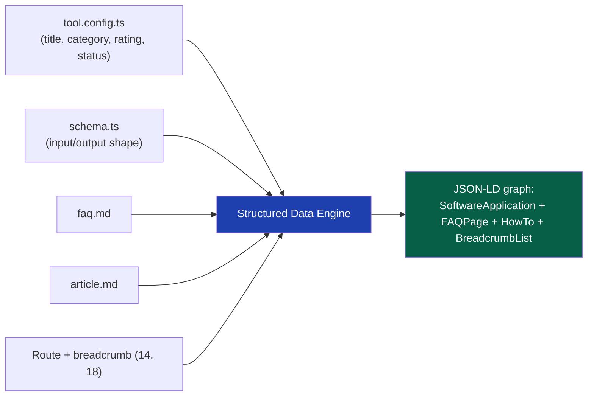
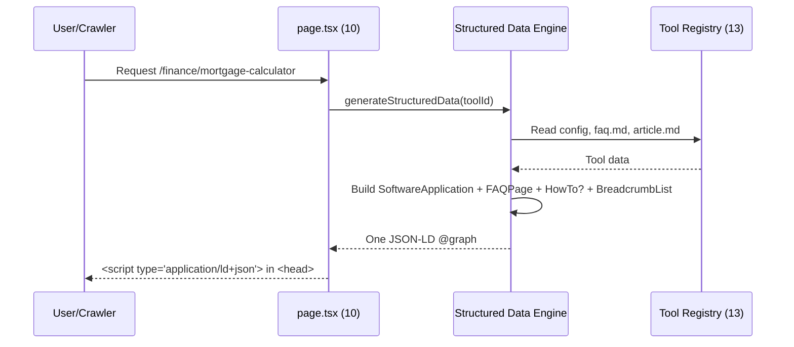

# 16 — Structured Data

> **Status:** Draft v1 · **Owner:** CTO / Senior SEO Architect · **Audience:** Everyone building tools or the engine; structured data is auto-generated, but the source content (`faq.md`, `article.md`) is human-written and must be accurate
> **Governed by:** `00`–`15`. This chapter details how the engine turns a tool's declaration and content into JSON-LD structured data — the machine-readable layer that unlocks rich results and voice-search answers. It sits directly below the metadata engine (`15`) in the `<head>`/`<body>` output pipeline.

---

## 1. What Structured Data Is and Why It's Worth Building Right

Structured data is a machine-readable description of a page's content, embedded as JSON-LD, following the shared vocabulary at schema.org. Search engines read it to understand *what a page actually is* — a piece of software, a set of questions and answers, a set of instructions — rather than guessing from prose. In return, they can render **rich results**: FAQ accordions in search, step-by-step HowTo cards, star ratings, breadcrumb trails instead of raw URLs, and direct answers read aloud by voice assistants.

For a long-tail SEO business (`03`, R1; `14`), structured data is a second, independent lever on top of good metadata (`15`). Metadata wins the click; structured data wins the *bigger, more prominent* search result — and increasingly, wins the answer itself when a user never clicks through at all (voice search, AI answer boxes, "position zero" snippets).

**Simple explanation:** imagine handing a librarian a book. If you just say "here's a book," they have to read the whole thing to categorize it. If you also hand them a filled-out index card — title, author, topic, is-it-a-cookbook-or-a-novel — they can slot it into the right shelf and recommend it correctly, instantly. JSON-LD is that index card, handed to Google for every one of our 1,000+ tools, so Google never has to *guess* that `mortgage-calculator` is a piece of interactive software with a FAQ section and a how-to guide attached.

> **CTO note:** structured data doesn't move rankings directly — schema.org markup isn't a ranking factor. What it moves is **eligibility for rich results and voice answers**, which move CTR and zero-click visibility. At our scale (millions of indexed pages, `01`), a small CTR lift compounded across every tool is real revenue — and rich-result eligibility is cheap to build once into the engine, impossible to retrofit across 1,000+ hand-built pages later.

---

## 2. The Core Principle: Same as Metadata — Generate, Never Hand-Write

Exactly as with metadata (`15`, §2), no tool author writes JSON-LD by hand. The engine derives every schema from the same declaration and content files that already power the route, the metadata, and the page itself (`13`). This is the single-source-of-truth principle applied to structured data: the `faq.md` a user reads on the page is the *exact same* `faq.md` that becomes `FAQPage` JSON-LD — never a second, hand-maintained copy that can drift out of sync.



**Simple explanation:** the engine doesn't invent facts about a tool — it *reflects* facts the tool already declared. If `faq.md` has three questions, the FAQ schema has exactly those three questions, word for word. If `article.md` has numbered steps, the HowTo schema has exactly those steps. Nobody maintains a separate "SEO version" of the content that can go stale; there is only ever one version, rendered two ways (visible HTML and invisible JSON-LD).

> **CTO note:** this single-source rule is the whole defense against the most common structured-data failure mode — markup that says one thing while the visible page says another (or nothing at all). Google's guidelines explicitly forbid marking up content that isn't visible to users, and violations get **manual actions** (rich-result eligibility revoked, sometimes site-wide). Deriving JSON-LD strictly from the same files that render the visible page makes that violation structurally impossible rather than a matter of author discipline.

---

## 3. The Schemas We Generate, and Why Each One Exists

| Schema | Generated from | What it unlocks |
|--------|-----------------|------------------|
| `SoftwareApplication` | `tool.config.ts` (name, category, description) | App-like rich result: category, "free," rating if present |
| `FAQPage` | `faq.md` | FAQ accordion directly in search results; voice-answer eligibility |
| `HowTo` | `article.md` (when it contains numbered steps) | Step-by-step rich result; voice "how do I…" answers |
| `BreadcrumbList` | Route + category tree (`14`, `18`) | Breadcrumb trail shown instead of the raw URL in results |
| `Organization` | Platform-level config (once, site-wide) | Brand knowledge panel eligibility, logo in results |
| `WebSite` + `SearchAction` | Platform-level config (once, site-wide) | Sitelinks search box under our homepage result |

Every tool page emits the first four (where applicable); `Organization` and `WebSite` are emitted **once**, site-wide, not per tool — there is no reason to repeat identical organization data on a million pages (§7).

### 3.1 `SoftwareApplication` — declaring what the tool *is*

```json
{
  "@type": "SoftwareApplication",
  "name": "Mortgage Calculator",
  "applicationCategory": "FinanceApplication",
  "operatingSystem": "Any (Web)",
  "offers": { "@type": "Offer", "price": "0", "priceCurrency": "USD" },
  "url": "https://utoolios.com/finance/mortgage-calculator"
}
```

This tells Google the page is interactive software, in the finance category, free, at this canonical URL. `applicationCategory` maps from the tool's declared category (`13`); `price: 0` is accurate for the ~95% of tools that are free client-side calculators, and becomes conditional once premium tools exist (Phase 3, §9).

**Simple explanation:** this is the tool introducing itself in the language search engines understand best: "I am a piece of software, I do finance things, I cost nothing, here's my address." Compare `mortgage-calculator` and `bmi-calculator` — same schema type, different `applicationCategory` (`FinanceApplication` vs. `HealthApplication`), generated automatically from each tool's own config.

### 3.2 `FAQPage` — turning `faq.md` into an answer machine

```json
{
  "@type": "FAQPage",
  "mainEntity": [
    {
      "@type": "Question",
      "name": "How is my monthly mortgage payment calculated?",
      "acceptedAnswer": { "@type": "Answer", "text": "..." }
    }
  ]
}
```

The engine parses `faq.md`'s markdown headings/body into `Question`/`Answer` pairs mechanically — no rewriting, no summarizing. What's on the page is what's in the schema, verbatim.

**Simple explanation:** think of `faq.md` as a stack of index cards, one question per card. The engine doesn't write new cards or edit them — it just photographs each card and staples the photographs together into the format Google reads. For `jwt-decoder`, a question like "Is my token sent to a server?" becomes both a visible FAQ item on the page *and* a line in the JSON-LD, letting Google potentially answer that exact question directly in search results or via a voice assistant, without the user even visiting the page.

> **CTO note — a real zero-click trade-off, not pure upside.** A great FAQ schema can get the answer shown directly in Google's results or spoken by a voice assistant — satisfying the user with no visit, no ad impression (`03`). But FAQ rich results also make our listing far more prominent than a plain blue link, pulling clicks for the *other* questions and for the tool itself, which voice search can't answer (nobody voice-searches "calculate my mortgage payment" and gets a useful spoken number). Net, FAQ schema is a visibility lever more than a cannibalization risk for interactive tools — it would matter more for a pure content/blog site.

### 3.3 `HowTo` — turning step-by-step `article.md` content into a rich card

When `article.md` contains a clearly numbered sequence ("Step 1: Enter your loan amount," "Step 2: Enter your interest rate," …), the engine emits `HowTo` with each step as a `HowToStep`. Not every tool's `article.md` has this shape — a reference tool like `jwt-decoder` may have explanatory prose with no natural steps, in which case **no `HowTo` is emitted at all** rather than a forced, awkward one (§8 covers this discipline in detail).

**Simple explanation:** `HowTo` schema is for content that's genuinely a recipe — first do this, then do that. `mortgage-calculator`'s article might naturally walk through "1. Gather your loan details, 2. Enter them, 3. Read your results" — that's a real HowTo. `jwt-decoder`'s article explaining what a JWT *is* isn't a sequence of steps, so it gets no `HowTo` schema — and that's correct, not a gap to fill.

### 3.4 `BreadcrumbList` — the trail, not just the address

```json
{
  "@type": "BreadcrumbList",
  "itemListElement": [
    { "@type": "ListItem", "position": 1, "name": "Home", "item": "https://utoolios.com/" },
    { "@type": "ListItem", "position": 2, "name": "Finance", "item": "https://utoolios.com/finance" },
    { "@type": "ListItem", "position": 3, "name": "Mortgage Calculator", "item": "https://utoolios.com/finance/mortgage-calculator" }
  ]
}
```

Generated directly from the same category tree and route (`14`) that already renders the visible breadcrumb UI (`18`) — again, one source, two renderings.

**Simple explanation:** instead of a raw, slightly intimidating URL in search results, Google can show "Home > Finance > Mortgage Calculator" — a trail a human reads more easily than a slug. It's built from the exact same category/route data everything else uses, so it can never disagree with the page's actual navigation.

---

## 4. How It All Combines: One `@graph` Per Page

A single tool page emits its schemas together as one JSON-LD `@graph`, not several disconnected `<script>` tags, so search engines can see the relationships between them (this FAQ belongs to this software application, at this breadcrumb position).



**Simple explanation:** rather than four separate stickers on the page, the engine assembles one combined document saying "this software application has this FAQ and this breadcrumb trail," cross-referenced. It runs through the same single `page.tsx` (`10`) every one of the 1,000+ tools shares — one code path, zero per-tool JSON-LD code.

---

## 5. `Organization` and `WebSite` — Site-Level, Not Per-Tool

Two schemas describe the *platform*, not any individual tool, and are emitted once — typically in the root layout — rather than duplicated on every page.

| Schema | Purpose | Emitted where |
|--------|---------|----------------|
| `Organization` | Brand identity: name, logo, URL, social profiles | Root layout, site-wide |
| `WebSite` + `SearchAction` | Declares the site and its internal search endpoint | Root layout, site-wide |

`WebSite`'s `SearchAction` is what enables Google's **sitelinks search box** — a search field directly under our homepage result in Google's results — pointing at our own search page (`24`, deferred to Phase 2's Meilisearch-backed search, static-search-backed until then).

**Simple explanation:** `Organization` is our business card — who we are, our logo, our official links — stated once, not repeated across every tool page (pointless duplication, not extra signal). `WebSite`/`SearchAction` tells Google "if someone wants to search within our site, here's how" — how some brands earn their own search box inside Google's results page.

> **CTO note:** an easy mistake when scaffolding fast is copy-pasting `Organization` JSON-LD into the per-tool template because "more schema is better." It isn't — repeating identical markup across a million pages adds weight and is exactly the low-value repetition structured-data spam guidelines call out (§7). Site identity is declared once, at the site level, where it belongs.

---

## 6. Rich Results and Voice Search — What We're Actually Optimizing For

| Rich result type | Driven by | User-facing effect |
|-------------------|-----------|---------------------|
| FAQ rich snippet | `FAQPage` | Expandable Q&A directly under the search listing |
| HowTo rich card | `HowTo` | Numbered step preview, sometimes with images |
| Breadcrumb trail | `BreadcrumbList` | Readable path instead of a raw URL |
| Sitelinks search box | `WebSite` + `SearchAction` | Search field under the homepage listing |
| Voice assistant answers | `FAQPage`, `HowTo` | Spoken answer to "how do I calculate my mortgage payment" style queries |

**Simple explanation:** rich results are Google giving our listing more visual real estate — an expandable FAQ, a step list, a breadcrumb — because we handed it enough structure to build one. Voice search works the same principle one step further: when someone asks a smart speaker a question, the assistant needs a clearly-labeled, unambiguous answer to read aloud, and `FAQPage`/`HowTo` markup is exactly that clearly-labeled answer, sourced straight from `faq.md`/`article.md`.

> **CTO note — don't over-promise rich results internally.** Google decides algorithmically whether to show a rich result even when eligible; markup earns *eligibility*, never a guarantee. Treating "we added FAQ schema" as "we will get the FAQ snippet," then treating its absence as a bug, is a mistake I've seen teams make. It isn't a bug — it's Google exercising discretion. The right mental model for anyone tracking this (`31`): a cheap lottery ticket bought for every page, with a rising win rate as the corpus grows — not a per-page guarantee.

---

## 7. Avoiding Markup Spam and Structured-Data Penalties

Google's structured data guidelines are explicit about misuse, and violations carry **manual actions** that can strip rich-result eligibility site-wide — not just for the offending page. At our scale, an engine-level mistake here is an engine-level penalty, not a one-page mistake.

| Anti-pattern | Why it's a problem | Our guardrail |
|--------------|----------------------|----------------|
| Marking up content not visible on the page | Explicitly against guidelines; can trigger manual action | JSON-LD is generated *only* from the same `faq.md`/`article.md` that renders visibly (§2) |
| Marking up irrelevant/keyword-stuffed FAQ answers | "FAQ spam" — a known, actively policed pattern | `faq.md` is real user-facing content, reviewed like any other content; CI checks for fabricated Q&A patterns (§8) |
| Forcing schemas that don't fit (e.g. `HowTo` on non-sequential content) | Low-quality markup, wasted crawl attention, potential penalty | HowTo is emitted only when `article.md` has genuine numbered steps (§3.3) |
| Duplicating identical `Organization`/`WebSite` data per page | Bloat, no signal, flagged as low-value repetition | Emitted once, site-wide (§5) |
| Fake ratings/reviews in `SoftwareApplication` | Explicitly banned; carries manual-action risk | No `aggregateRating` is emitted until we have **real** user ratings to report (Phase 2+, `03`) — never a placeholder number |
| Stale schema after content edits | Markup contradicts the current page | Because schema is *generated at render time* from the live content files, not cached separately, it can never go stale independent of the page (§2) |

**Simple explanation:** Google explicitly polices structured-data "spam" — marking things up that aren't really there, faking star ratings, forcing a HowTo onto content that isn't a how-to, just to grab a shinier search result. Getting caught doesn't just lose that one page's rich result; it can revoke rich-result eligibility across the whole site. Our rule is blunt: only mark up what's genuinely, visibly on the page, using the exact content that's there — never invent, never force, never duplicate for the sake of "more schema."

> **CTO note — the biggest structured-data risk for us specifically is the fake rating.** It's a tempting shortcut for a solo founder wanting listings to look established ("4.8 stars" is a real CTR lever) — and one of the most aggressively enforced violations in Google's guidelines. My rule: `aggregateRating` is simply **not emitted** until Phase 2+ gives us real, stored user feedback (`12`) to report honestly. No placeholder, no exception. A missing star rating costs a little CTR; a manual action for fake ratings can cost the *entire site's* rich-result eligibility. That trade is never close.

---

## 8. Validation Against Schema.org in CI — Trust, But Verify Automatically

Because structured data is generated by an engine running across 1,000+ tools, a bug in the generator is a bug on every page simultaneously — the same double-edged leverage seen throughout the plugin architecture (`13`). CI must catch it before it ships (`00`, N6, N7; `39`).

| Check | What it catches | Where |
|-------|-------------------|-------|
| **Schema.org structural validation** | Missing required fields, wrong types, malformed JSON-LD | CI, per build |
| **Google Rich Results Test parity check** | Whether Google itself would consider the page rich-result-eligible | CI (automated) + spot manual checks pre-launch of major changes |
| **Content-parity check** | FAQ/HowTo JSON-LD text must match the rendered `faq.md`/`article.md` exactly | CI, per tool |
| **No orphan schema** | `HowTo` isn't emitted when `article.md` lacks real steps; `FAQPage` isn't emitted when `faq.md` is empty | CI, per tool |
| **No duplicate site-level schema on tool pages** | `Organization`/`WebSite` never accidentally re-emitted per tool (§5) | CI, per build |
| **Breadcrumb/route consistency** | `BreadcrumbList` matches the actual route and category tree (`14`, `18`) | CI, per tool |

**Simple explanation:** before any tool goes live, an automated check plays "search engine" and inspects the generated JSON-LD the way Google would — valid, schema.org-compliant, matching what's visible, nothing missing or duplicated. This runs on every tool automatically, the same discipline as metadata uniqueness checks (`15`, §7) — because a structured-data bug is invisible on the rendered page, exactly the kind of silent failure that must be machine-caught (`14`, §9).

> **CTO note:** another instance of the "silent catastrophic bug" pattern from `14`. A malformed JSON-LD block doesn't break the page for a user — it quietly fails Google's parser, and we lose rich-result eligibility with zero visible symptom and zero complaint. It belongs in the same CI tier as canonical/robots checks: things that must never regress silently because nobody will ever file a bug report for them.

---

## 9. Phasing — What's Real Now vs. What Activates Later

Everything in §3–§8 is Phase 1 — client-side generation from static content files, requiring no database, no backend, no auth. Two things are explicitly deferred until later phases arrive for real reasons:

| Feature | Phase | Why deferred |
|---------|-------|---------------|
| `aggregateRating` in `SoftwareApplication` | Phase 2+ | Requires real, stored user ratings (`12`, Postgres); a placeholder is the fake-rating trap in §7 |
| Premium-tool `Offer` with nonzero `price` | Phase 3 | Requires billing/premium gating (`03`) to exist before the claim is true |
| Per-locale JSON-LD (translated FAQ/HowTo text) | Deferred with i18n (`36`) | JSON-LD must match the locale's rendered content; multi-language content doesn't exist yet |

We build the engine's shape to accept these inputs later (an optional `ratingData` field, an `offers` field already present but zero-valued) without re-architecting the generator — the seam-now, feature-later discipline applied throughout this document set (`03`, `04`, `15`, §9).

**Simple explanation:** the parts of structured data needing a database (real ratings), billing (real prices), or translations don't exist yet in Phase 1 (`04`), so they aren't switched on. When Phase 2's database or Phase 3's billing arrives, turning these on means filling in a field, not rebuilding the engine.

---

## Summary

- Structured data (JSON-LD) doesn't move rankings directly, but it wins **rich results** and **voice-search eligibility** — a compounding CTR and visibility lever on top of metadata (`15`).
- The engine **generates** every schema from the tool's existing `tool.config.ts`, `faq.md`, and `article.md` — never a hand-written, separately-maintained copy that can drift from the visible page.
- Per-tool schemas: **`SoftwareApplication`** (from config), **`FAQPage`** (verbatim from `faq.md`), **`HowTo`** (only when `article.md` has genuine numbered steps), **`BreadcrumbList`** (from the route/category tree) — combined into one `@graph` per page.
- Site-level schemas: **`Organization`** and **`WebSite` + `SearchAction`** are emitted **once**, site-wide, never duplicated per tool.
- Rich results and voice answers are earned eligibility, never guaranteed — Google decides algorithmically whether to render them.
- **Markup spam is actively avoided**: only visible content is marked up, `HowTo` is never forced onto non-sequential content, and — critically — **no fake `aggregateRating`** is ever emitted; real ratings wait for Phase 2's real data.
- **CI validates structured data against schema.org**, checks content-parity with the rendered page, and blocks orphan/duplicate schemas — because a broken JSON-LD block is a silent, invisible failure nobody reports.
- `aggregateRating`, premium `Offer` pricing, and per-locale JSON-LD are explicitly **deferred** to Phase 2/3/i18n, with the engine's shape already accepting those inputs when the time comes.

> Next: `17-PROGRAMMATIC-SEO.md` — how category clusters, related-tool linking, and content templates turn 1,000+ individual tool pages into a compounding topical-authority system.

---

### Changelog
| Version | Date | Change | Reason |
|---------|------|--------|--------|
| v1 | (draft) | Initial structured data architecture | Project inception |
