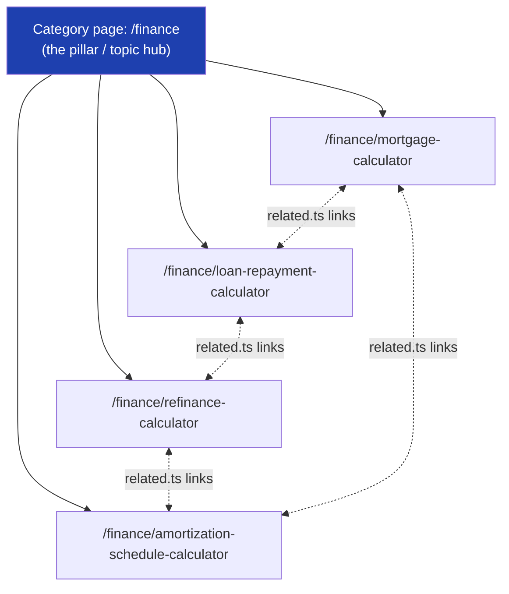
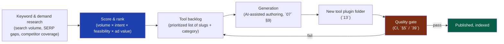
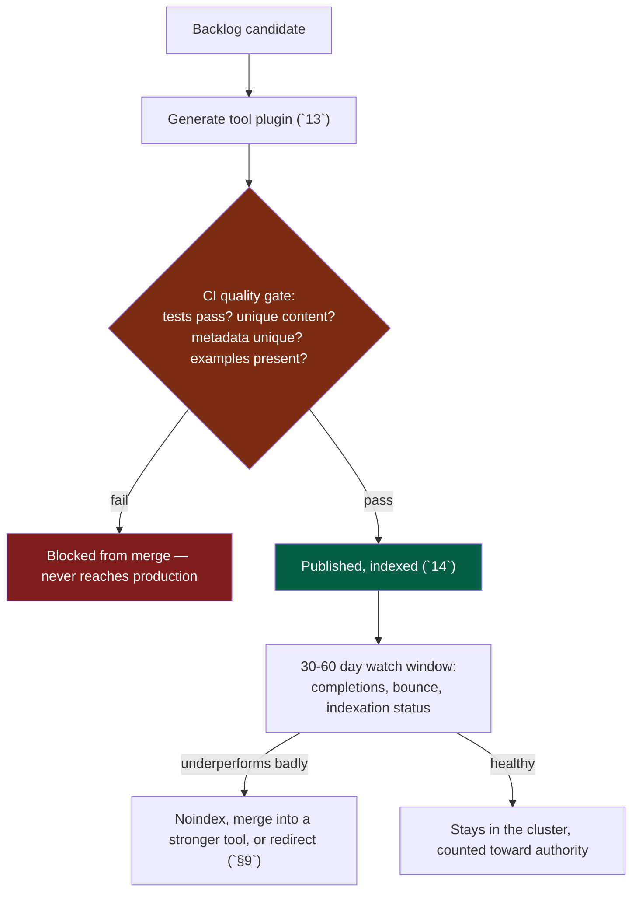

# 17 — Programmatic SEO

> **Status:** Draft v1 · **Owner:** CTO / SEO Architect · **Audience:** Everyone shipping tools — engineers, AI-assisted authors, and whoever owns the growth backlog
> **Governed by:** `00`–`16`. This chapter is where the plugin architecture (`13`) and the SEO foundation (`14`) meet the *growth engine*: how we decide what 1,000+ tools should even be, how we generate whole clusters of them without generating garbage, and how we defend against the single biggest risk of scale — thin content. Internal linking that stitches clusters together is `18`; keyword-to-metadata mechanics are `15`.

---

## 1. What "Programmatic SEO" Means Here (and What It Isn't)

Programmatic SEO is generating many search-optimized pages from a repeatable template plus structured data, instead of writing each page by hand. For UToolios this isn't optional — it's the *only* way one founder (and later a small team) produces the 1,000+ tools needed to hit 2-5M monthly visitors (`01`). Nobody writes 1,000 articles by hand; we build a system that produces 1,000 *good* tools.

But "programmatic" has a bad reputation, earned by a decade of doorway pages: `/best-plumber-in-<city>` × 20,000 cities, all near-identical, all thin, all eventually deindexed in a Google spam update. We generate pages programmatically too — but the unit we generate is a **working tool that solves a real, distinct problem**, not a paragraph of city names swapped into a template. That distinction is the entire chapter.

| Doorway-page programmatic SEO (what we avoid) | UToolios programmatic SEO (what we do) |
|---|---|
| Same content, one variable swapped (city, year) | Distinct calculation logic, distinct inputs/outputs per tool |
| No functional value — text only | Functional value — the page *does* something for the user |
| Generated once, never revisited | Generated, tested, then monitored and pruned (`§9`) |
| Volume is the goal | Volume is a *byproduct* of covering real demand |
| Quality checked never or manually | Quality checked in CI before publish (`§5`, `39`) |

**Simple explanation:** imagine two shopkeepers. One prints 20,000 nearly-identical flyers, changing only the town name, and pins them everywhere. The other builds 20,000 small, genuinely different vending machines, each solving one specific need (one dispenses bandages, one dispenses batteries), and puts them where people actually look for that thing. Both "scaled to 20,000 units" — but only one delivers real value at every unit. Our `mortgage-calculator`, `jwt-decoder`, and `tile-calculator` are vending machines, not flyers: each does distinct, verifiable work (`13`).

> **CTO note:** the industry conflates "programmatic SEO" with "content spam" because most of it *is* thin — a template plus a spreadsheet of nouns. Our defense isn't avoiding generation (we can't — the business model requires it, `03`); it's making the *generated unit* a working piece of software with its own `calculator.ts` and `tests.spec.ts` (`13`), not a paragraph. Google increasingly detects "helpful content" by behavioral signals — a tool that produces a correct number in two seconds beats 800 words of filler every time.

---

## 2. Content Clusters and Topic Authority

Google (and users) trust a site more when it demonstrates deep, connected coverage of a topic, not isolated pages. A **content cluster** is a category (a "pillar") plus every tool underneath it, cross-linked (`18`), so the whole cluster reads as one coherent body of expertise rather than a pile of disconnected pages.

Each category (`finance`, `developer`, `health`, `home`) is a topic cluster. The category-in-URL decision made in `14` (§3) exists precisely to make this clustering explicit and permanent. Crawling into `/finance` should surface a dense, obviously-related set of mortgage, loan, refinance, and amortization tools — each linking to the others via `related.ts` (`13`, §3.5; `18`) — signaling topical depth, not a scattershot of unrelated utilities.

**Simple explanation:** think of a category as a well-organized aisle in a hardware store, not a junk drawer. Someone needing a mortgage calculator should also find the refinance calculator and amortization schedule right next to it — the *actual next things they need*. Google reads the same signal: 40 deeply-connected finance tools look like authority; the same 40 tools scattered with no connective tissue look like 40 accidents.

Cluster health is something we track deliberately, not something that emerges by accident:

| Cluster signal | What we watch | Why it matters |
|---|---|---|
| Cluster depth | Tools per category over time | Thin categories (2-3 tools) read as low-authority; we prioritize backlog toward under-covered categories |
| Internal link density | Average related-tools per tool (`18`) | Sparse linking wastes the authority a cluster could pass around |
| Cluster completion | % of "obvious" tools in a topic that exist | A finance cluster missing a basic "loan calculator" is an obvious gap competitors will win |
| Cannibalization | Two tools targeting the same query | Wastes ranking potential by splitting relevance instead of consolidating it (`14`, §4) |

> **CTO note:** cluster completeness is a lever most solo-founder SEO projects ignore, chasing whatever keyword idea comes to mind next. We treat "finish the obvious cluster" as higher priority than "start a flashy new category" — an incomplete cluster ranks worse for *every tool in it*, since Google rewards topical completeness with more crawl and trust. A backlog that jumps categories looks productive but dilutes authority everywhere at once.

---

## 3. Demand Research: From Keyword to Tool Backlog

Programmatic generation only works if we're generating tools people actually search for. The backlog isn't invented at a whiteboard — it's derived from demand signals, ranked, and fed into the plugin pipeline (`13`).

### Where demand signals come from
- **Search data**: keyword volume/trend tools reveal what people actually type ("mortgage calculator" vs. "how much house can I afford calculator") — these often become *distinct tools*, not synonyms of one page.
- **SERP gap analysis**: is the top-ranking result a thin listicle, an ad-choked competitor tool, or a genuinely useful calculator? A weak SERP is an opportunity; a strong, fast incumbent is a signal to deprioritize.
- **Internal signals** (once we have traffic, `31`): site search queries with no matching tool and MSTC (Monthly Successful Tool Completions, `00`) trends by category reveal unmet demand from our own users.
- **Long-tail variants**: a core concept ("BMI") can spawn multiple genuinely distinct tools (`bmi-calculator`, `bmi-calculator-kids`) *only* if each has a real difference in inputs, formula, or audience — never a copy with a different `<h1>`.

### The keyword → tool mapping table

Every backlog entry is mapped to exactly one canonical slug (`09`) before generation starts, preventing two tools from being built for the same query later:

| Keyword cluster | Mapped tool slug | Category | Notes |
|---|---|---|---|
| "mortgage calculator", "monthly mortgage payment" | `finance/mortgage-calculator` | finance | Core, highest volume |
| "mortgage refinance calculator" | `finance/refinance-calculator` | finance | Distinct formula/inputs — genuinely separate tool |
| "jwt decoder", "decode jwt online" | `developer/jwt-decoder` | developer | Client-side only, no server round-trip (`11`, §5) |
| "tile calculator", "how many tiles do i need" | `home/tile-calculator` | home | Area + waste-factor formula |

**Simple explanation:** before we build anything, we do the same homework a shop owner does before stocking a shelf — checking what people actually ask for, how well it's currently served, and whether it's worth the shelf space. Each item that survives that homework gets exactly one, permanent "product SKU" (the slug) so we never accidentally stock the same item twice under two different labels.

> **CTO note:** the "one keyword cluster → one slug, decided *before* generation" rule is a cheap insurance policy against an expensive mistake. Without it, an AI-assisted backlog process will happily generate `loan-calculator` and `loan-repayment-calculator` for the same query, and they compete with each other in the SERP instead of Google picking one strong winner (`14`, §4). Deduplicating intent is a research-time cost; deduplicating *after* two live tools have split rankings for a year is a much larger one.

---

## 4. Generation Patterns: Variations, Comparisons, and Clusters

Not all programmatic pages are the same shape. Three patterns cover almost everything UToolios needs, and each has a different bar for "is this genuinely distinct content."

**Pattern A — Core tool + parameter variations.** One calculation engine, several distinct entry points where the *audience or default assumptions* genuinely differ (not just the headline text). Example: `bmi-calculator` (adult formula) vs. `bmi-calculator-kids` (growth-chart-based formula) — different `calculator.ts`, different disclaimers, different audience. Legitimate only when the underlying logic or output actually differs; the same formula with a renamed `<h1>` is a doorway page and must not ship (`§5`).

**Pattern B — Comparison / versus pages.** Pages like `loan-vs-lease-calculator` combine two existing calculators' outputs side-by-side, adding genuine synthesis (a decision table, a recommendation threshold) rather than restating both tools' descriptions. These earn their own slug only when the comparison itself is a distinct search intent with real volume.

**Pattern C — Category/topic hub pages.** The category pages from `§2` (`/finance`, `/developer`) aren't individual tools but curated, partly-automated aggregation pages: auto-populated tool listings (from the registry, `13`) plus a topic overview. These target head-terms ("finance calculators") no single tool can rank for alone.

| Pattern | Generation source | Distinctness bar | Risk if bar not met |
|---|---|---|---|
| A — Variation | Same engine family, different params/audience | Different formula, inputs, or output shown | Duplicate/near-duplicate content, cannibalization |
| B — Comparison | Two tools' outputs combined | Real synthesis (decision logic), not restated text | Thin "vs" page, no unique value |
| C — Hub | Registry query + overview copy | Genuinely useful aggregation + orientation | Weak, becomes a low-value index page |

**Simple explanation:** it's the difference between selling three different-sized screwdrivers (genuinely different tools for genuinely different jobs — Pattern A), a "screwdriver vs. drill" buying guide that actually helps someone decide (Pattern B), and the "tools aisle" sign that helps people find both (Pattern C). All three are useful. What's not useful is putting up ten identical screwdrivers with different price tags and calling it a product range.

---

## 5. The Quality Gate: Thin Content Is the Existential Risk

This is the section that matters most. `14` (§7) already established that "quality of the index beats size of the index" — thin, near-duplicate pages flooding the index can cause *site-wide* ranking damage, dragging down even the good tools. For a platform whose growth model is "generate many tools," this is not a background risk — it is **the** risk programmatic SEO must be architected around from day one.

### What counts as thin content, precisely

| Thin-content signal | Where enforced |
|---|---|
| `calculator.ts` is a copy/rename of another tool's | Code review + CI diff check (`39`) |
| `article.md` below a minimum length/uniqueness threshold vs. siblings | CI text-similarity check |
| `examples.ts` missing or trivial | CI: examples required, used as test fixtures (`13`, §3.4) |
| Near-duplicate title/description across tools | CI metadata-uniqueness check (`15`) |
| `tests.spec.ts` doesn't pass or doesn't exist | CI — build fails, cannot merge (`13`, §5) |
| High bounce, near-zero completions after a fair trial | Post-launch review (`§9`) |

### The quality index, not the page count

The North Star metric is **Monthly Successful Tool Completions (MSTC)** (`00`), not tool count, and not page count. A backlog of 50 low-completion tools is worse for the business than a backlog of 20 high-completion ones — worse for revenue (ads/affiliate need engaged sessions) and worse for SEO (thin pages drag the whole domain, `14`). Programmatic generation must be judged by the *quality index* it produces, never by raw throughput.

**Simple explanation:** a quality gate is a bouncer at the door of Google's index. Before any new tool is let in, it has to prove it's carrying something real — its own working logic, its own passing tests, its own examples, wording that isn't a copy of a sibling tool's. That's not paperwork for its own sake; it's the difference between the whole site being seen by Google as "1,000 useful pages" versus "200 useful pages buried under 800 near-duplicates," which is a much worse outcome for the 200 good ones too.

> **CTO note:** the single most dangerous failure mode is an AI-assisted generation pipeline (`07`, §9) that is *fluent* — it produces plausible `article.md` and `seo.ts` content for every backlog slug, all grammatically fine, all subtly interchangeable. Fluency is not distinctness. The gate must check *structural* uniqueness (different formula, different tested output, different examples) — not "does this read like acceptable English," which an LLM will pass every time regardless of whether the tool underneath is actually different.

---

## 6. When to Generate Programmatically vs. When Not To

Programmatic generation is a tool, not a mandate. Some pages should never be templated.

| Generate programmatically when… | Hand-build / skip when… |
|---|---|
| Demand research confirms real, distinct search volume (`§3`) | Volume is speculative — "might as well add it" |
| The variant has genuinely different logic, inputs, or audience | Same formula, different copy |
| The category cluster has an obvious, identifiable gap (`§2`) | Adding it would just pad the category, not close a gap |
| A comparison/hub page synthesizes real decision value | A "vs" page would just restate two existing descriptions |
| The tool is cheap to run (`serverSide: false`, `11` §5) | `serverSide: true` (OCR, PDF, image) — needs cost-modeling and rate-limit design *before* mass-generating variants, since each one is a per-request cost, not a free static page (`11`, §5) |
| It fits cleanly inside the plugin contract (`13`) | It would need special-casing in the engine — the contract, not the backlog, needs revisiting |

**Simple explanation:** we template the vending machine, not the exception. If ten machines are genuinely different (different snacks, different price points) templating them is efficient. An eleventh machine identical to the third with a different sticker isn't a new product — don't build it. And a machine that needs a technician on standby every time it's used (a `serverSide: true` tool like OCR) shouldn't be mass-produced before checking the standby cost makes sense at scale (`11`, §5).

> **CTO note:** the temptation, once a backlog pipeline exists, is to run it in one direction — always generate. The harder discipline is a backlog that also *rejects* candidates: noisy keyword volume, cosmetic variants, comparisons with no real decision content. A backlog process without a "no" outcome isn't prioritization, it's a queue. If close to zero raw candidates ever fail the distinctness bar in `§5`, the gate isn't being applied honestly.

---

## 7. Guardrails at Each Stage

Programmatic SEO fails safely only if guardrails exist at every stage of the pipeline, not just at the end.

| Stage | Guardrail | Failure mode prevented |
|---|---|---|
| Backlog | Keyword → single slug mapping, pre-registered (`§3`) | Duplicate tools targeting the same query |
| Generation | Must produce a valid `ToolPlugin` (`13`, §4) | Malformed tool can't compile; can't ship broken |
| Content | Uniqueness checks across `article.md`, `seo.ts`, `faq.md` vs. siblings | Near-duplicate metadata/content across the cluster |
| Correctness | `tests.spec.ts` must pass with real worked examples | Wrong answers shipped at scale |
| Indexation | Passes the gate before indexable; else stays `noindex`/`draft` (`14`, §7) | Thin/broken tools entering Google's index |
| Post-launch | 30-60 day watch window on completions and indexation (`§9`) | Silent, slow-burning thin-content drag never caught |

**Simple explanation:** think of airport security, not a single locked door — checkpoints at check-in, at the gate, and at boarding, so one missed problem doesn't make it all the way onto the plane. A tool that passes content-uniqueness still has to pass correctness tests; one that passes tests still spends a watch period judged on whether real users actually complete it.

---

## 8. Measuring, Pruning, and Iterating

Programmatic SEO is not "generate once and forget." Clusters need ongoing curation, exactly like a garden needs weeding, not just planting.

| Signal | Action |
|---|---|
| Tool ranks well, high MSTC | Reinforce: link more heavily from the cluster (`18`), consider a Silver→Gold tier upgrade (`02`, §5) |
| Tool ranks, low completion | Investigate UX/content — the calculation may be right but the page unclear; fix, don't delete |
| Tool never indexes after a fair window | Check for a technical or content-quality flaw before assuming the keyword was wrong (`14`, §9) |
| Tool cannibalizes a sibling tool's rankings | Consolidate into one stronger tool with a 301 redirect from the weaker slug (`14`, §3) |
| Whole category underperforms | Re-run demand research — the cluster mapping may be stale (`§3`) |

**Simple explanation:** a backlog isn't a one-way conveyor belt from "idea" to "published forever." It's closer to a farmer's field: plant based on research, watch what grows, consolidate plots that turn out to be the same crop, and stop watering the ones that never took root.

---

## Summary

- Programmatic SEO here means generating **working tools** from demand data and a plugin template (`13`) — not templated paragraphs with a variable swapped in; that distinction separates us from doorway-page spam.
- **Content clusters** (category pillar + linked tools, `18`) build topic authority; cluster *completeness* and link density beat chasing scattered new categories.
- The **backlog is derived from demand research** and maps every keyword cluster to exactly **one canonical slug** before generation starts, preventing later cannibalization.
- Three generation patterns cover most cases — **parameter variations**, **comparison pages**, **category hub pages** — each with its own distinctness bar.
- **Thin content is the existential risk** at scale (`14`, §7): CI quality gates check structural uniqueness (logic, tests, examples, metadata), not prose fluency, which AI generation will always pass regardless.
- The North Star is **quality index, not page count** — MSTC (`00`) judges the backlog, not tool volume.
- Programmatic generation is **not universal**: skip cosmetic variants, unproven demand, or `serverSide:true` tools needing cost-modeling first (`11`, §5); a healthy backlog rejects a meaningful share of candidates.
- Guardrails exist at every pipeline stage, and published clusters are **continuously pruned and consolidated**, not generated once and abandoned.

> Next: `18-INTERNAL-LINKING.md` — how `related.ts` and category hubs become the link graph that spreads authority across every cluster this chapter builds.

---

### Changelog
| Version | Date | Change | Reason |
|---------|------|--------|--------|
| v1 | (draft) | Initial programmatic SEO strategy | Project inception |
