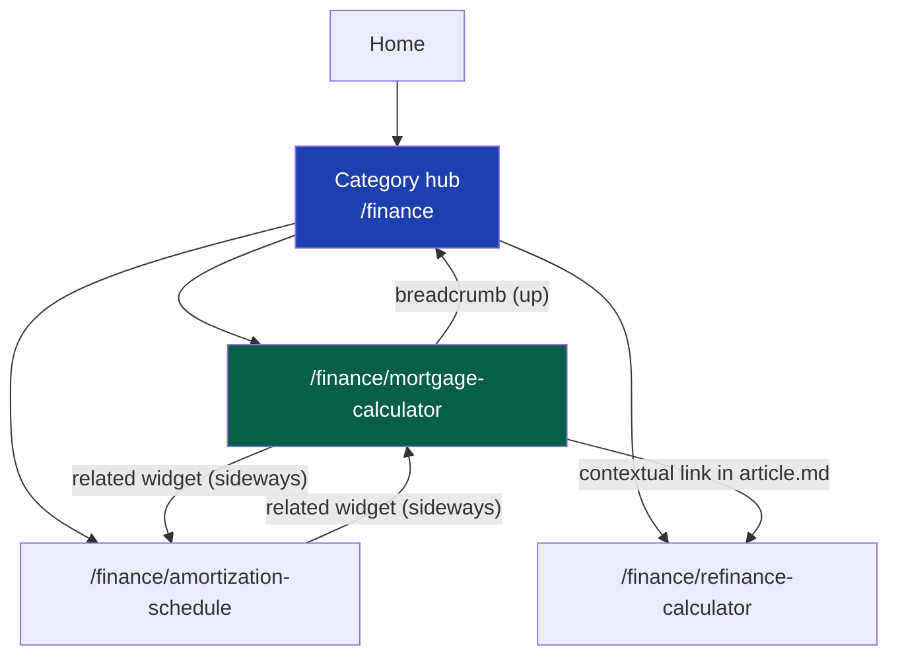
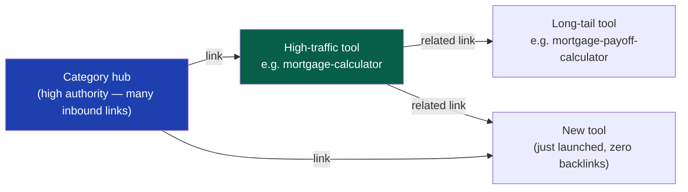
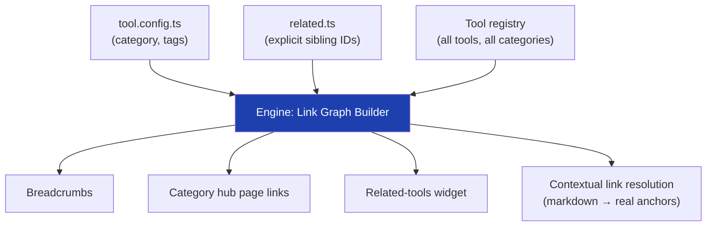

# 18 — Internal Linking

> **Status:** Draft v1 · **Owner:** CTO / Senior SEO Architect · **Audience:** Everyone — internal links are generated by the engine, but every tool author's `related.ts` and `article.md` shape them
> **Governed by:** `00`–`13`, and the SEO family: `14` (URLs/sitemaps/indexation), `15` (metadata), `16` (structured data), `17` (programmatic SEO / topic clusters). This chapter defines how pages point at each other, and why that graph is a first-class piece of architecture, not a UI afterthought.

---

## 1. Why Internal Links Are Two Levers, Not One

A sitemap (`14`, §5) tells Google a page *exists*. It does not tell Google — or a user — that a page *matters*, or what to do *next*. That job belongs to internal links, which do two jobs simultaneously:

1. **SEO authority flow.** Search engines distribute ranking signal ("link equity") through the link graph. A page with many inbound links from other reasonably-authoritative pages ranks better than an identical page sitting at the end of a sitemap with zero inbound links. At 1,000+ tools, the sitemap gets Google to *discover* every page; internal links decide which pages Google decides are *important enough to rank well*.
2. **Product navigation → MSTC.** Our North Star metric is Monthly Successful Tool Completions (`00`). A user who finishes the mortgage calculator and is offered the amortization-schedule calculator, right there, completes a *second* tool in the same session. Internal links are the mechanism that turns a single-tool visit into a multi-tool session — directly moving MSTC, not just rankings.

**Simple explanation:** the sitemap is the master list of every address in the city — useful for the postal service (Google's crawler), useless for a pedestrian deciding where to eat next. Internal links are the street signs and the shopkeeper saying "since you bought that, you'll probably want this too." Without them, every address is reachable but nobody — human or algorithm — knows which ones matter.

> **CTO note:** it's tempting to treat internal linking as "just a related-tools widget." Resist that framing. A widget is a UI feature; a **link graph** is an architectural asset that compounds — every new tool that links out and gets linked back makes the *whole graph* stronger, and every orphaned tool is a silent tax on the tools around it. We design the graph, not the widget.

---

## 2. The Four Link Surfaces

Every tool page carries internal links from four distinct surfaces. Each has a different job, a different position on the page, and a different generation source.

| Surface | Position | Job | Generated from |
|---------|----------|-----|-----------------|
| **Breadcrumbs** | Top of page | Show hierarchy; link up to category hub and home | `tool.config.ts` (`category`) — always present |
| **Category hub links** | Category page | Link *down* into every tool in that category | Tool registry (`13`) — one hub per category |
| **Related tools widget** | Below the answer / end of page | Link *sideways* to the 4–8 most relevant sibling tools | `related.ts` (explicit) + tag-similarity fallback |
| **Contextual in-article links** | Inside `article.md` / `faq.md` prose | Link *in context*, mid-sentence, where the connection is explained | Authored (or AI-generated) markdown links, resolved by the engine |

**Simple explanation:** breadcrumbs say where you are ("Home → Finance → Mortgage Calculator"). The category hub is the table of contents for a topic ("everything in Finance"). The related widget is the "customers also used" shelf. Contextual links are the sentence mid-article saying "once you know your payment, see the full [amortization schedule]" — the most natural, highest-value link because it's explained, not just listed.

---

## 3. The Link Graph and Authority Flow

Internal links form a directed graph: every tool is a node, every link an edge. Search engines conceptually distribute authority through this graph in a PageRank-like manner — a page linked from many well-linked pages accumulates more authority than one reachable only through a distant sitemap entry.

The practical implication: our **highest-traffic tools are the most valuable link real estate on the site.** A link from `mortgage-calculator` to a brand-new tool passes meaningfully more authority than a link from an obscure page. `related.ts` isn't cosmetic — which tools link to which determines how fast a new long-tail tool can rank at all.

| Concept | Implication | Where used |
|---------|-------------|------------|
| **Authority concentrates at hubs** | Category hubs and top-traffic tools should link generously downward/sideways | `17` |
| **Depth matters** | Keep every tool ≤ 2 clicks from its hub, hub ≤ 1 click from home | Crawl frequency, rankings |
| **New tools need a boost** | Zero external backlinks at launch; internal links are their *only* early authority | Update high-traffic `related.ts` to reference new siblings |
| **Silos reinforce relevance** | Denser within-category linking signals topical focus to Google | `17` |

> **CTO note:** there's a real trade-off between "link generously for authority flow" and "every link on a page dilutes the equity passed to each target" (§8). SEO folklore says to cap outbound links hard; the more accurate model is that a link from a *low-authority* page has little equity to dilute, while a link from a *high-authority* page is worth curating carefully. Don't apply the same link budget uniformly — spend the site's most valuable pages' links deliberately on tools that need the boost (new launches, orphans), not on whatever's merely alphabetically adjacent.

---

## 4. Auto-Generation from the Plugin Contract

Consistent with the whole platform (`13`), internal links are **not hand-wired per page** — they're derived from the tool's declared contract and the registry.

- **Breadcrumbs** need nothing from the tool author — computed purely from `category` + `slug` (`09`), always identical in shape.
- **Category hubs** are generated from the registry: every `published` tool in a category appears automatically, the same "one folder, zero platform changes" guarantee as `13`.
- **The related widget** starts from `related.ts`'s explicit list. If it has fewer than the minimum count (see §5), the engine **falls back to tag/category similarity** computed at build time, so the widget is never sparse.
- **Contextual links** are ordinary markdown links to other tool slugs inside `article.md`/`faq.md`. The engine validates at build time that every link resolves to a real, published tool — a broken one fails CI (`39`), the same way a broken canonical would (`14`, §4).

**Simple explanation:** the tool author writes one small file (`related.ts`) and maybe links a sibling tool or two naturally inside the help article. Everything else — breadcrumb trail, category listing, fallback suggestions — is computed by the engine, exactly like metadata (`15`) and structured data (`16`). No developer hand-builds a "related tools" section for any specific page.

---

## 5. Orphan Prevention

An "orphan" page has no meaningful inbound internal links — reachable only via the sitemap. Orphans get crawled rarely and rank poorly, and at scale they're easy to create by accident.

**Structural guarantee:** the Discover/Register stages (`13`, §5) mean every published tool automatically appears on its category hub — no tool is ever a *true* zero-inbound-link orphan by construction. The real risk is a **weak orphan**: a tool with only the hub link and nothing from the related widget or article content pointing to it.

| Check | Enforced by | Catches |
|-------|-------------|---------|
| In-degree ≥ 1 from the hub | Structural (registry-driven) — cannot fail | True orphans |
| In-degree ≥ 3 counting `related.ts` + fallback + contextual links | CI graph script (`39`) | Weak orphans |
| Every `related.ts` reference resolves to a real, published slug | Build-time validation | Dead links, wasted equity |
| No tool unreachable within 2 clicks of its hub | CI depth check | Deep-buried, low-crawl tools |

If a tool's `related.ts` is empty or too short, the engine's tag/category-similarity fallback (§4) guarantees the minimum in-degree automatically — orphan prevention is a build-time gate, not a manual audit.

**Simple explanation:** every new book is at least shelved in the right section (the category hub), so nothing's literally lost — but a book with no "if you liked this, try that" card still gets picked up far less. CI doesn't just check the shelf placement; it checks every book has enough recommendation cards, and generates them automatically if the author didn't provide enough.

> **CTO note:** orphan prevention is the same class of "silent, nobody-reports-it" failure called out in `14`, §9 for canonicals. A tool can pass every test and still quietly underperform for months because nothing links to it. Catching this in CI — a graph check, not a human remembering `related.ts` — is non-negotiable once we're past a few dozen tools.

---

## 6. Anchor-Text Strategy

Anchor text (the clickable words) is a ranking signal for the linked-to page — Google partially infers what a page is about from what other pages call it when linking to it.

| Rule | Example | Why |
|------|---------|-----|
| **Descriptive, not generic** | "amortization schedule calculator" not "click here" | Generic anchors carry no topical signal |
| **Match the target's canonical name** | Link to `mortgage-calculator` mostly as "mortgage calculator" | Reinforces the target's primary keyword (`17`) |
| **Vary naturally across contexts** | "see the full amortization breakdown" vs. "amortization schedule calculator" | Identical exact-match anchors site-wide look manipulative to spam systems |
| **Contextual links get the richest anchors** | Full descriptive phrase inside a sentence | Strongest internal-link signal we control |
| **Widget/breadcrumb anchors stay short** | Widget shows the tool's `title` field verbatim | Scannability over variation in list UI |

**Simple explanation:** if ten pages all link to the mortgage calculator using the exact same five words every time, it looks engineered rather than natural — the same way identical customer-review phrasing looks suspicious. We let anchor text vary naturally in prose while keeping it short and consistent in structured UI, exactly how a real, organically-written site behaves.

---

## 7. Bidirectional Linking and Reciprocity

If tool A lists tool B in `related.ts`, should B automatically list A back? Not always — relevance isn't always symmetric (a general "loan calculator" might reasonably link to a dozen specific loan-type calculators, none of which need to link back to all their siblings). But **asymmetric high-relevance pairs are usually a missed opportunity**, so we treat reciprocity as a *default suggestion*, not a hard rule.

| Rule | Mechanism |
|------|-----------|
| Explicit `related.ts` entries are directional (author's choice) | No forced symmetry — editorial judgment wins |
| CI flags strongly asymmetric pairs (A→B with high tag overlap, but B has no path back to A beyond the hub) | Reviewed, not auto-fixed — a human/AI decides whether to add the reverse link |
| The tag/category fallback (§4) is naturally near-symmetric | Two tools sharing tags tend to surface each other automatically |
| Category hub linkage is always bidirectional | Hub → tool, and tool's breadcrumb → hub, both generated together |

**Simple explanation:** if the mortgage calculator recommends the amortization schedule tool, that tool probably should recommend the mortgage calculator back — most users flow both directions. We don't force this blindly (some relationships are genuinely one-way, like a broad hub tool pointing to many specifics that don't each need to point back), but we flag suspicious cases where two clearly related tools reference neither each other.

---

## 8. Link Limits and Equity Dilution

More links is not strictly better. Each outbound link on a page divides that page's finite "equity" among its targets, and — separately — too many links overwhelm users and hurt MSTC by offering too many competing next-steps.

| Surface | Recommended cap | Rationale |
|---------|------------------|-----------|
| Breadcrumbs | 2–3 levels | Structural, never grows |
| Category hub → tools | All tools in category | A hub's *job* is exhaustive listing; dilution here is acceptable |
| Related-tools widget | 4–8 tools | Genuine choice without becoming noise |
| Contextual in-article links | 2–5 per article | High value per link; more turns the article into a link farm |

> **CTO note:** the instinct at a content-heavy, programmatic site is to "link everything to everything" for maximum SEO surface area. That's a mistake on both fronts — Google discounts pages that look like link directories, and users faced with 40 "related" links complete *fewer* tools, not more, because choice overload hurts task completion (directly hurting MSTC). Link generously at the *structural* layer (hubs, meant to be exhaustive); curate tightly at the *editorial* layer (widget, contextual links), where quantity works against both rankings and product goals.

---

## 9. Internal Linking and MSTC

Every link surface maps to a concrete MSTC lever:

| Link surface | MSTC mechanism |
|--------------|-----------------|
| Related-tools widget | Offers the next likely tool right after a completion — highest-converting surface for session depth |
| Contextual in-article links | Surfaces a relevant tool *before* the user asks, at the moment of highest intent |
| Category hub | Lets a user browse and discover several more tools in the same session |
| Breadcrumbs | Lets a user retreat one level to a sibling tool instead of bouncing entirely |

**Simple explanation:** a user who calculates a mortgage payment and is immediately offered "now see your full amortization schedule" is far more likely to complete a second tool than one who has to search for it. Internal links aren't just plumbing for Google — they're the cheapest lever we have for turning a one-tool visit into a multi-tool session, which is literally what our North Star metric measures.

---

## 10. Measuring and Maintaining the Link Graph

As with canonicals and indexation (`14`, §9), the link graph is tested and observed, not left to memory:

| Check | Phase | Mechanism |
|-------|-------|-----------|
| Orphan / weak-orphan detection (§5) | Phase 1 | Build-time CI graph script (`39`) — static registry, no DB needed |
| Broken contextual/related links | Phase 1 | Build-time validation against the registry |
| Click-through rate per link surface | Phase 2 | Needs analytics event storage (`31`), deferred until Postgres/Redis exist (`12`) |
| Graph-wide pseudo-authority simulation | Phase 2/3 | Offline batch job feeding suggestions back into `related.ts` review |
| Search-driven "related" ranking from real queries | Phase 2, via Meilisearch (`00` phasing) | Replaces the static tag-similarity fallback |

**Simple explanation:** in Phase 1 we already catch broken links and orphans for free, because the whole registry lives in the codebase at build time. Once real analytics and search exist in Phase 2, we upgrade from "similar tags, probably related" to "users actually move between these together" — a sharper signal, added only once there's real traffic to learn from (`00`, YAGNI).

---

## Summary

- Internal links do **two jobs at once**: they distribute SEO authority through the link graph, and they directly drive MSTC by surfacing the user's next likely tool.
- Four link surfaces cover every page: **breadcrumbs** (up), **category hubs** (down, exhaustive), **related-tools widget** (sideways, curated), **contextual in-article links** (in context, highest value per link).
- The link graph behaves like a **PageRank-style authority network** — high-traffic tools and category hubs are the site's most valuable link real estate and should be spent deliberately on new/under-linked tools.
- Links are **auto-generated from the plugin contract** (`related.ts`, `category`, tags, registry) — no page's links are hand-wired, consistent with the rest of the engine (`13`).
- **Orphan prevention is a build-time CI gate**: structural hub linkage guarantees no true orphans; a graph check catches *weak* orphans (thin in-degree) before they ship, with automatic tag-similarity fallback when `related.ts` is sparse.
- **Anchor text** should be descriptive and naturally varied in prose, short and consistent in structured UI — never generic, never robotically identical everywhere.
- **Reciprocity is a default suggestion, not a forced rule** — CI flags suspicious one-way high-relevance pairs for review rather than auto-linking blindly.
- **Link limits matter**: hubs can be exhaustive (that's their job), but the related widget and contextual links must stay curated — over-linking dilutes equity and actively hurts MSTC via choice overload.
- Measurement starts as free, build-time graph checks in Phase 1 and upgrades to usage-informed relevance once analytics and search exist in Phase 2 — the seam is built now, the heavy signal added when there's real traffic to learn from.

> Next: `19-AD-SLOT-ARCHITECTURE.md` — the `AdSlot` abstraction that keeps ad placement swappable across AdSense, Mediavine, and Raptive without ever hurting Core Web Vitals or sitting in front of the answer.

---

### Changelog
| Version | Date | Change | Reason |
|---------|------|--------|--------|
| v1 | (draft) | Initial internal linking architecture | Project inception |
