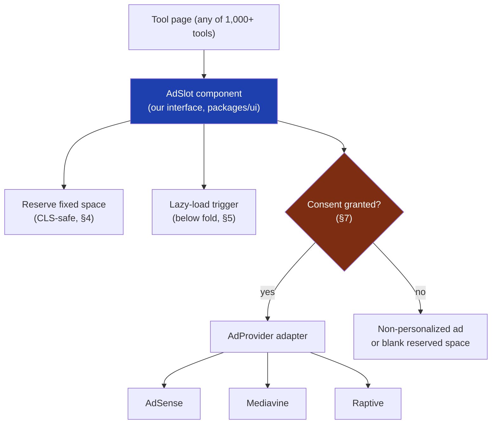
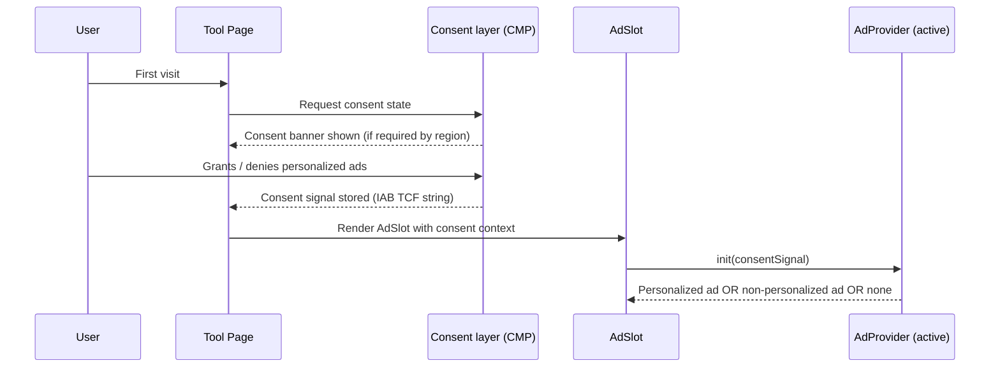

# 19 — Ads Architecture

> **Status:** Draft v1 · **Owner:** CTO / Principal Architect · **Audience:** Everyone shipping tool pages — ads touch every page the platform renders
> **Governed by:** `00`–`18`. This chapter is the detailed design behind the `AdSlot` abstraction introduced in `03` (R1) and referenced in the frontend layout (`10`, §4) and the plugin engine's "Provide" stage (`13`, §5). It must not contradict `02`'s C7 (Honest Monetization) or `00`'s N-series non-negotiables.

---

## 1. Why Ads Get Their Own Chapter

Display advertising is R1 — the foundation revenue stream that funds every other bet the business makes (`03`, §4). At the same time, ads are the single feature most likely to *destroy* the thing that earns revenue in the first place: fast, trustworthy, high-ranking pages (`00`, N3, N4). An ad network's tag is simple to drop into a page. Doing it in a way that survives a provider migration, a Core Web Vitals audit, a regulator, and a decade of scale is not simple at all. That gap is why ads get architecture, not just a `<script>` tag.

**Simple explanation:** anyone can nail a poster to a wall. A good architect designs the wall so posters can be swapped without cracking the plaster or blocking the fire exit. This chapter is the wall design, not the poster.

> **CTO note:** the temptation on day one is to paste the AdSense snippet directly into `page.tsx` and move on — it's faster, and revenue matters. I've rejected that path deliberately. The first ad tag we ever ship goes through the `AdSlot` abstraction from commit one, even though at that moment there is only one provider and the abstraction "isn't needed yet." Building it now costs an afternoon; retrofitting it across thousands of live tool pages later is a multi-week migration done under revenue pressure. This is a rare case where building the seam early beats YAGNI, because the provider switch (`03`'s AdSense → Mediavine → Raptive ladder) is not hypothetical — it's a scheduled, near-certain event.

---

## 2. The AdSlot Abstraction — Our Interface, Not the Vendor's

No tool, layout component, or page ever imports an ad network's SDK directly. Every ad placement on the platform is a call to our own `AdSlot` component, which is the *only* thing that knows a provider exists at all.

`AdSlot` is a **presentational contract**: given a placement identifier (`in-article`, `sidebar`, `below-result`) and a size hint, it reserves layout space, decides *when* to load (§5), checks consent (§7), and then hands off to whichever `AdProvider` is currently active. A tool's `tool.config.ts` only ever declares `flags.ads: true/false` (`13`, §3.1) — it never names a provider, a slot ID, or a script URL. That knowledge lives in exactly one place: the provider adapter.

**Simple explanation:** think of `AdSlot` as an electrical wall socket. Every appliance (tool page) plugs into the *same standard socket*. What's on the other side of the wall — solar, grid, or a generator (AdSense, Mediavine, Raptive) — is the power company's business, invisible to anyone plugging in a lamp. Change the power source and every socket in the building keeps working unchanged.

---

## 3. The AdProvider Interface — Swapping Networks Without Touching Tools

`AdProvider` is the TypeScript interface every ad network implementation must satisfy (Replaceable, `00` 4.10; SOLID, `00` 4.8). Conceptually:

| Method | Responsibility |
|--------|-----------------|
| `init()` | Load the network's script once, globally, respecting consent state |
| `renderSlot(placement, size)` | Fill a reserved `AdSlot` with this network's unit |
| `refresh(slotId)` | Refresh an ad in place (viewability-gated, §9) without a page reload |
| `teardown(slotId)` | Clean removal on navigation (SPA-safe, no leaked listeners) |
| `isReady()` | Reports load state so `AdSlot` can show a graceful empty state instead of a broken box |

Switching from AdSense to Mediavine to Raptive (`03`, §4) means writing one new adapter that implements this interface and flipping a config flag — **zero changes to any of the 1,000+ tool pages that call `AdSlot`.** Only the adapter and the ops flag selecting it know a provider changed; the tool config, the `AdSlot` component, and every page calling it stay untouched.

**Simple explanation:** the mortgage calculator and the JWT decoder both just say "I want an ad here." Neither one knows or cares whether that ad comes from AdSense today or Raptive next year — that decision is made once, centrally, the same way changing a country's electricity supplier doesn't require rewiring every house.

> **CTO note:** the honest trade-off here is a thin layer of indirection on every ad-bearing page, forever, even while we only have one provider. That's a real, small ongoing cost (an extra component render, one more file to reason about). I accept it because the alternative — vendor SDK calls scattered across the codebase — turns a one-file adapter swap into a grep-and-pray migration at exactly the moment (crossing 50k sessions/month, `03`) when engineering time is scarcest and the upgrade is most time-sensitive.

---

## 4. CLS-Safety — Reserved Space Is Not Optional

Cumulative Layout Shift (CLS) is a Core Web Vital and a ranking signal (`14`, §8; `20`). Ads are the single most common cause of layout shift on ad-funded sites, because ad creatives load asynchronously and arrive at unpredictable sizes. Our rule: **`AdSlot` always reserves its final pixel dimensions before any ad script runs**, using a fixed-size container with `aspect-ratio` or explicit min-height matched to the ad unit's declared size, never an auto-sizing `
`.

| Placement | Reserved size strategy |
|-----------|--------------------------|
| In-article (between result and article content) | Fixed height matching the most common creative size for that breakpoint; empty space rendered even if the ad never loads |
| Sidebar (desktop only) | Sticky container, fixed width/height, collapses entirely below the sidebar breakpoint (no reserved space wasted on mobile) |
| Below-result | Reserved height below the fold; never reserved above the tool's input/output (§6) |
| Native/in-feed on listing pages | Reserved height matching the surrounding card grid, so a loading ad doesn't push cards around |

**Simple explanation:** imagine a parking garage that only paints the parking-space lines *after* a car has already tried to park. Cars would collide with each other constantly. Reserved ad space is painting the lines first — the space exists and is stable whether or not a car (ad) ever shows up, so nothing else on the page has to jump out of the way.

> **CTO note — a real risk to flag:** reserved space *guarantees* CLS safety only if the ad network's actual creative sizes are known in advance and don't drift. Networks periodically push new "flexible" auto-size units to boost fill rate — a well-known CLS trap. We mitigate by pinning to documented standard IAB sizes only, refusing auto-size units even when a network recommends them, and gating any new unit size behind a CI Lighthouse check (`39`) before it ships.

---

## 5. Lazy Loading — Below the Fold, Never Render-Blocking

Ad scripts are heavy, third-party, and frequently the largest contributor to Total Blocking Time and LCP delay on ad-funded sites (`20`). `AdSlot` never loads a provider script eagerly on page load unless the placement is genuinely above the fold (rare, and still deferred behind the tool's own render).

| Rule | Mechanism |
|------|-----------|
| Ad scripts load after the tool's interactive result is ready | `AdSlot` defers `init()` until the tool component has hydrated |
| Below-fold ad units load only when scrolled near-viewport | `IntersectionObserver` with a rootMargin buffer, not on initial paint |
| No synchronous, render-blocking `<script>` tags in `<head>` | All provider scripts load `async`/deferred, injected by the adapter, never hand-authored per tool |
| Ad JS never shares the tool's main-thread budget during interaction | Tool logic (`calculator.ts`, pure and framework-free, `13`) runs and returns an answer with zero contention from ad scripts |

**Simple explanation:** we serve the meal before the waiter starts describing the dessert menu. The user's answer (the calculator result) is the meal — it must arrive fast and uninterrupted. Ads are the dessert menu, offered once the meal is already on the table, and only when the user has scrolled far enough to plausibly want it.

---

## 6. Placement Rules — Never in Front of the Answer (C7)

This is a product non-negotiable (`02`, C7), and the architecture enforces it structurally rather than trusting every tool author to remember it. `AdSlot` placements are a **fixed, small enumeration** defined once in the shared layout (`10`, §4) — `in-article`, `sidebar`, `below-result`, `footer` — and tools cannot invent new placements or pass arbitrary DOM positions.

| Forbidden pattern | Why it's structurally impossible here |
|--------------------|------------------------------------------|
| Interstitial over the tool | No `overlay` or `modal` placement exists in the `AdSlot` enum |
| Ad above the calculator input/output | The shared layout (`10`) renders `title → tool → explanation` before any ad slot is reachable |
| Fake "your result is loading…" delay to force an ad view | Tool logic (`calculator.ts`) is pure and synchronous/fast by contract (`13`, §3.3); there is no delay mechanism to hook into |
| Auto-refreshing ads that shift content the user is reading | `refresh()` is viewability-gated and geometry-locked (§9) — it swaps the creative in place, it never changes slot size |

**Simple explanation:** the mortgage calculator's answer — "Your monthly payment: $1,432" — always renders before a single ad pixel does. This isn't a style guideline a developer might forget; it's baked into the one shared layout every tool inherits (`10`), so there is no code path by which a tool page could show an ad before the answer even if someone tried.

---

## 7. Consent, GDPR, and the CMP Seam

We serve a global audience (`01`) and will have EU/UK/California visitors from day one, so consent handling is **not deferred** the way i18n or auth are — it activates in Phase 1, alongside the very first ad tag.

| Concern | Phase 1 approach | Later phase |
|---------|-------------------|--------------|
| Consent banner + IAB TCF signal | A lightweight, standards-based CMP (client-side, no backend needed) gates `AdSlot` before any provider `init()` | — |
| Regional detection (EU/UK/CA rules differ) | Edge-based geo detection at Cloudflare (`43`), no server round-trip needed | — |
| Non-personalized ad fallback | `AdProvider.init()` accepts a consent flag and requests non-personalized inventory when consent is withheld | — |
| Persistent, auditable consent log (compliance evidence) | Not needed yet — CMP's own local/edge storage is sufficient at Phase 1 traffic and legal exposure | Server-side consent audit trail once Postgres exists (`12`, Phase 2) |
| Per-user consent tied to an account | N/A — no accounts exist yet (`00`, phasing) | Ties into the auth/session model (`23`) once accounts ship in Phase 3 |

**Simple explanation:** the consent banner is a doorperson who asks "personalized ads OK, or plain ads only?" before anyone gets shown an ad at all — and we ask that question from day one, not once we're big enough to worry about regulators. What we *don't* build yet is a permanent filing cabinet of every consent decision ever made (that needs a database, `12`) — the doorperson's own notepad is enough until we have thousands of returning, logged-in users worth auditing centrally.

> **CTO note:** it's tempting to treat consent/CMP as a compliance checkbox bolted on later. That's backwards for us: ad revenue *is* the business (`03`, R1), and every major network (AdSense included) will refuse to serve ads — or serve at a fraction of the rate — without a valid consent signal in regulated regions. Skipping the CMP doesn't just risk a fine; it directly caps revenue on the traffic we're trying to monetize. Here, "do it properly from day one" and "protect revenue" point the same direction.

---

## 8. `ads.txt` and Inventory Integrity

`ads.txt` is a plain-text file at the site root (`06`, public assets) listing every company authorized to sell our ad inventory. It's how ad buyers and networks verify they're buying real UToolios inventory, not a spoofed/fraudulent copy of our pages.

| Requirement | How we meet it |
|-------------|------------------|
| One `ads.txt` at the domain root, always current | Generated/updated as part of onboarding each ad network (AdSense, then Mediavine, then Raptive), never hand-edited ad hoc |
| Lists every authorized seller + reseller ID | Each `AdProvider` adapter's onboarding checklist includes its `ads.txt` line |
| Kept in sync when networks are added/removed | Reviewed at every provider transition (§3) as part of the migration checklist |
| Served with correct content-type, cached at the edge | Static asset via Cloudflare (`43`), same delivery path as robots.txt (`14`, §6) |

**Simple explanation:** `ads.txt` is like a shop publicly posting "only these named suppliers are authorized to sell goods under our name." Without it, someone could scrape our pages, run their own ads on a copy, and siphon off revenue that should be ours — advertisers use this file to confirm they're buying the genuine article.

---

## 9. Viewability — Revenue Quality, Not Just Ad Count

An ad that loads but is never actually seen (below the fold, refreshed while off-screen, or rendered behind another element) earns nothing and still costs performance budget. We optimize for **viewable impressions**, using the IAB standard (≥50% of pixels in view for ≥1 continuous second for display units).

| Practice | Purpose |
|----------|----------|
| `refresh()` only fires when the slot is currently in viewport (IntersectionObserver-gated) | No wasted refresh cycles on off-screen ads |
| No more than a small, fixed number of slots per page | More ads per page has diminishing (and eventually negative) RPM returns once viewability drops and CWV degrades (`20`) |
| Slot count and placement tuned by measured viewability + RPM, not maximized on instinct | Revenue is optimized, not ad *count* |

**Simple explanation:** an ad nobody sees is like paying for a billboard installed inside a closed warehouse — the fee's the same, the value is zero. We'd rather run fewer ads that are reliably seen than pack the page with ads that mostly scroll past unseen while still slowing the page down.

---

## 10. The Performance Budget — Ad Weight as a First-Class Cost

Per `03`, §4, ad scripts are treated as a budgeted cost in CI (`20`, `39`), not an unlimited add-on.

| Budget | Enforcement |
|--------|--------------|
| Max additional JS weight attributable to ads per page | Measured and gated in CI; a provider script bloat regression fails the build like any other perf regression |
| Max number of third-party ad-related requests per page | Capped; new ad units must justify any increase |
| Lighthouse Performance score with ads present | Measured *with ads on*, not in a stripped-down "ads disabled" test run — the real page is what gets scored |
| CLS contribution attributable to ad slots | Must be ~0, verified against reserved-space rendering (§4) |

Ownership splits cleanly: RPM, fill rate, and viewability are a growth/business metric (`03`); CLS, LCP, and TBT *with ads present* are an engineering metric gated in CI (`20`, `39`); consent rate and regional compliance are a legal/ops metric monitored via CMP reporting.

**Simple explanation:** we don't ask "does the ad script run?" — we ask "how many kilobytes and how many milliseconds does this ad cost us, and is that cost worth the revenue it earns?" Just like a database query has a cost budget, an ad slot has a performance budget, checked automatically on every deploy so a network's script bloating over time gets caught immediately instead of silently eroding rankings for months.

---

## Summary

- Ads are architecture, not a script tag: every placement goes through our own **`AdSlot`** component, and every network integration implements our own **`AdProvider`** interface (`00`, 4.10) — built from the first commit, because the AdSense → Mediavine → Raptive migration (`03`) is scheduled, not hypothetical.
- Switching ad networks means writing one new adapter and flipping a config flag — **zero changes** to any tool page, enforced by the fact that tools only ever declare `flags.ads: true/false`.
- **CLS-safety is structural**: `AdSlot` always reserves final pixel dimensions before any script runs, pinned to standard IAB sizes only, CI-gated against creative-size drift.
- Ad scripts are **lazy-loaded, below-fold, and never render-blocking** — the tool's answer always renders and hydrates first.
- Placement is a **fixed, small enum** (`in-article`, `sidebar`, `below-result`, `footer`) with no interstitial or above-the-answer option — C7 (`02`) is enforced by the shared layout's structure, not developer discipline.
- **Consent/CMP activates in Phase 1**, not deferred, because regulated regions and ad-network policy both gate revenue on a valid consent signal from day one; only the *persistent server-side audit log* waits for Postgres (Phase 2, `12`).
- **`ads.txt`** is kept current at every provider transition to protect inventory integrity and prevent revenue leakage to spoofed copies of our pages.
- We optimize for **viewable impressions and RPM**, not raw ad count — more slots with lower viewability and worse Core Web Vitals is a net loss.
- **Ad weight is a first-class, CI-enforced performance budget** (`20`, `39`) — a script bloat regression fails the build exactly like any other performance regression.

> Next: `20-PERFORMANCE-ARCHITECTURE.md` — the Core Web Vitals budgets, caching strategy, and CI performance gates that this chapter's ad-weight rules plug into.

---

### Changelog
| Version | Date | Change | Reason |
|---------|------|--------|--------|
| v1 | (draft) | Initial ads architecture | Project inception |
