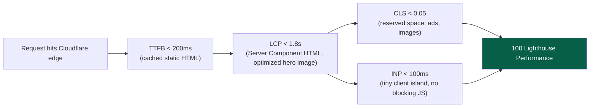
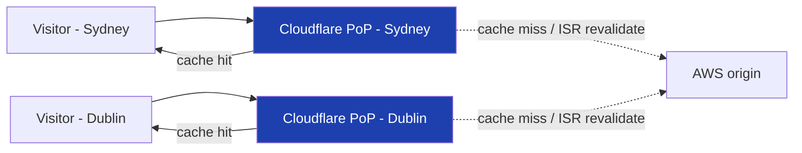
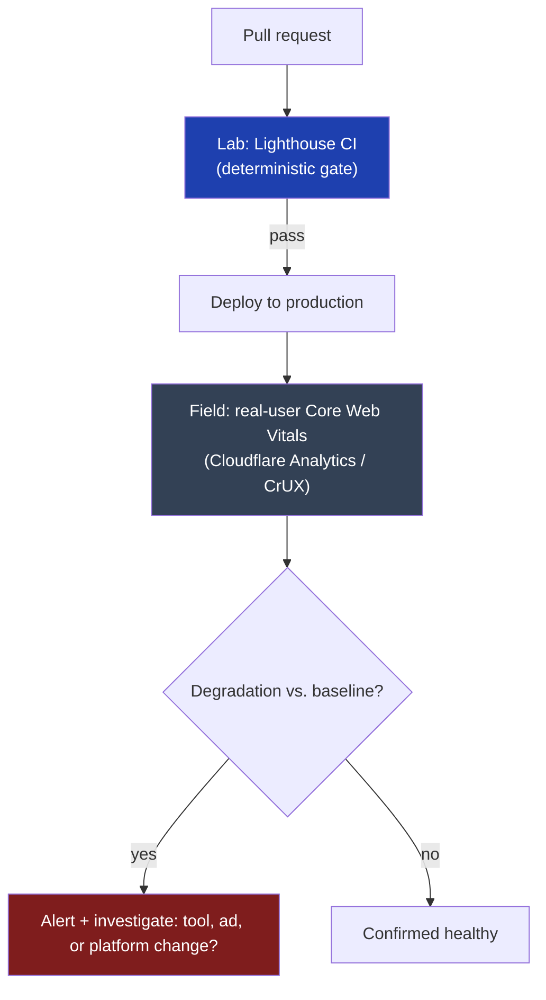

# 20 — Performance

> **Status:** Draft v1 · **Owner:** CTO / Principal Frontend Engineer · **Audience:** Everyone shipping a tool or touching the engine — performance is a gate every PR passes through, not a specialist's job
> **Governed by:** `00`–`19`. This chapter defines the *performance contract*: the numeric targets every tool must hit, the budgets CI enforces, and the mechanisms (rendering, images, fonts, splitting, edge) that make hitting them the path of least resistance. Frontend structure is `10`; caching is `21`; ads are `19`.

---

## 1. Why Performance Is Architecture, Not a Task

For most products, "make it faster" is a backlog item you get to eventually. For UToolios, performance **is the business model.** Our traffic strategy is organic search (`01`, B1; `14`), and Core Web Vitals are a direct Google ranking factor. A slow tool doesn't just annoy a user — it ranks lower, gets crawled less, and earns less ad revenue per session (`03`). Performance, SEO, and revenue are the same number wearing three hats.

So performance cannot be something we "check before launch." It has to be a **structural property** that the plugin engine (`13`) and frontend architecture (`10`) produce automatically for every tool, and that CI **refuses to let regress**.

**Simple explanation:** you could inspect a fleet's brakes once before each van leaves the depot — or build vans that physically can't start if an automatic brake check fails, every time. We build the second kind: a tool shipping slow JavaScript doesn't quietly worsen over time; the pipeline stops it before it reaches a user.

> **CTO note:** the biggest performance risk at our scale isn't one slow tool — it's *aggregate drift*. Adding "one small library" per tool feels harmless each time; multiplied across 1,000+ tools it's a platform-wide slowdown, expensive to find retroactively. Only an automated budget per tool (§3) defends against that — vigilance decays.

---

## 2. Core Web Vitals: The Targets

We target **100 Lighthouse Performance** and excellent Core Web Vitals as the *default state* for every tool page (`00`, Performance First), not an aspirational cleanup goal. These are the numbers that gate a release.

| Metric | What it measures | Target | Why it matters |
|---|---|---|---|
| **LCP** | Time until main content renders | **< 1.8s** (good: <2.5s) | Direct ranking factor; users judge "is this fast" almost entirely on LCP |
| **INP** | Responsiveness to clicks/typing (replaces FID) | **< 100ms** (good: <200ms) | A laggy calculator fails its core job (`02`, C3 Instant) |
| **CLS** | How much content jumps while loading | **< 0.05** (good: <0.1) | Ads/late images are the #1 cause; shifts misclick users onto ads |
| **TTFB** | How fast the server starts responding | **< 200ms** edge, <600ms origin | Everything else is downstream; static + edge delivery (§8) makes this trivial |

**Simple explanation:** judge a restaurant on four things — how fast the waiter greets you (TTFB), how fast the meal arrives (LCP), whether the table wobbles (CLS), and how fast the kitchen responds to a request (INP). We want all four excellent for every tool, not just the ones we remember to polish.

These targets apply to **every** tool page at Bronze tier and above (`02`, tier ladder) — there's no "slow tool, fix it later" tier. A tool that can't hit these numbers doesn't ship (`07`, CI gates).

---

## 3. The Performance Budget System — Enforced in CI

A target without enforcement is a suggestion. We turn Core Web Vitals into concrete, machine-checkable **budgets** attached to every tool, checked on every pull request (`07`).

| Budget | Limit | Enforced by |
|---|---|---|
| JS per tool page (first load) | **≤ 70KB** gzipped (excl. shared framework chunk) | Bundle analyzer in CI |
| CSS per page | **≤ 20KB** gzipped | Tailwind purge + CI check |
| Total page weight (excl. ads) | **≤ 300KB** | Lighthouse CI budget assertion |
| Third-party scripts | **0 render-blocking**; ads lazy below fold only | `[review]` + AdSlot contract (`19`) |
| Lighthouse Performance | **= 100** | Lighthouse CI, hard fail below 95 |
| Lighthouse SEO / Accessibility | **= 100** | Lighthouse CI (`14`, `36`) |

**Simple explanation:** a performance budget is a luggage weight limit at the airport — the scale doesn't negotiate, however good the reason for packing extra. If the `jwt-decoder` bundle creeps from 40KB to 75KB because someone imported a full date library for one formatting call, CI stops the merge, the same way the check-in scale stops the overweight bag.

> **CTO note:** per-tool budgets, not a site-wide average, are deliberate. An average lets ten lean tools hide one bloated one — and that tool still loads badly for its own visitors. The cost is a noisier CI; worth it because failure is attributable to one folder, one PR, one author.

Budgets are declared once, centrally, in the build tooling (Turborepo, `05`) — never per tool. An author never touches a budget config; they write a lean `calculator.ts` and let the engine (`13`) do the rest. Moving a budget (e.g. a shared engine feature needing a few more KB) is a deliberate, reviewed, platform-wide change, not a per-tool exception.

---

## 4. Rendering Strategy: Static, Edge, and Server Components

The frontend architecture (`10`) already establishes Server Components and static generation (SSG) as defaults. Performance is the *reason* those defaults exist:

| Decision (from `10`) | Performance effect |
|---|---|
| Server Components by default | Zero JS for non-interactive content (title, article, FAQ, related links) |
| `'use client'` pushed to leaf nodes | Only the calculator input/output ships JS, not the whole page |
| SSG for tool pages | Pre-built HTML; TTFB is a CDN cache hit, not a computation |
| ISR for content that changes (rates, thresholds) | Freshness without SSR's per-request cost |
| SSR reserved for genuinely per-request content | The *expensive exception*, never the default |

At 1,000+ tool pages, the only way to keep TTFB near-zero is for almost every page to be **pre-rendered and edge-cached** (`21`), not computed live. `mortgage-calculator` is built once at deploy time (or revalidated via ISR), pushed to Cloudflare's edge (`43`), and served identically fast to visitor #1 or #2,000,000.

**Simple explanation:** it's cooking each meal fresh the second a customer sits down, versus a bakery with fresh bread already on the shelf. Almost every tool page is "already baked." Only the truly dynamic part — live typing in the calculator — happens in the browser, on the user's own device.

---

## 5. JavaScript: Code Splitting and Tree Shaking

Because most tools are pure client-side calculations (`00`, N2), the temptation is to ship the calculator's logic as one blob of JS per page. Three disciplines keep it minimal:

1. **Route-level code splitting is automatic.** Next.js ships only the JS a route needs — visiting `/finance/mortgage-calculator` never downloads `/developer/jwt-decoder`'s code. Free from the framework.
2. **Component-level splitting for heavy islands.** An optional chart or rarely-used advanced mode loads via `next/dynamic` only when the user reaches for it.
3. **Tree shaking discipline at import time.** Tool logic is pure TypeScript with no framework imports (`13`, §3.3), so it tree-shakes cleanly. Rule: **import only the function you need** — `date-fns`'s single function, not all of `moment`.

**Simple explanation:** shipping a toolbox to a customer — you send exactly the wrench they bought, not the whole warehouse. The `tile-calculator` never makes a visitor download the `bmi-calculator`'s code, and a rarely-used "advanced settings" panel doesn't weigh down the basic experience.

> **CTO note:** the biggest tree-shaking failure isn't a single bad import — it's a **shared utility package that accumulates dependencies over time.** A `packages/utils` that starts lean and gradually absorbs a date library, a big-number library, a formatting library (each added for one tool) bloats *every* tool importing it, even ones that use none of those features. The fix is discipline: shared packages get their own budget review; "just add it to shared utils" is an architectural decision, not a convenience.

---

## 6. Images: Optimization and Layout Stability

Most tool pages are text- and input-heavy, so images carry less weight here than on a typical content site — but every image that does appear follows fixed rules:

- **`next/image` always**, never a raw `` — automatic responsive sizing, modern formats (AVIF/WebP with fallback), lazy loading below the fold.
- **Explicit `width`/`height` (or `fill` with a sized container)** on every image — this is what makes CLS near-zero; the browser reserves the space before the image loads.
- **Icons as inline SVG** (`icon.svg` per tool, `13`, §3), not image requests — zero round-trip, infinitely scalable, stylable to dark/light mode.
- **Static assets served from Cloudflare R2 + CDN** (`43`), never re-fetched from origin per request.

**Simple explanation:** every image ships with its exact final size stamped on the box *before* it arrives, so the page leaves the right-sized empty slot in advance — nothing shuffles to make room later. A `roof-pitch-calculator` article's truss diagram reserves its exact rectangle instantly; the image fades into a space already waiting for it, never pushing the text below it down.

---

## 7. Font Strategy

Fonts are a classic, easy-to-miss source of CLS (reflow on swap) and blocking render (a font request delaying LCP). Our approach:

| Rule | Why |
|---|---|
| `next/font`, self-hosted (never a Google Fonts `<link>`) | Removes an external request; served from our own edge |
| `font-display: swap` with matched fallback metrics | Text visible instantly in fallback, swaps with near-zero shift |
| One typeface, at most 2–3 weights | Every extra weight is another file (`10` design system) |
| Variable fonts over multiple static weight files | One file covers all weights instead of several |
| No decorative/icon web-fonts | Icons are inline SVG (§6) — one less blocking asset |

**Simple explanation:** loading a font from Google's servers is like sending a neighbor to the store for milk before you can start cooking — an extra trip, an extra delay. Self-hosting on our own edge means the milk is already in the fridge. With `font-display: swap`, a user reads the mortgage-calculator's headline in a close-looking fallback font instantly, then it swaps to the real brand font moments later without the line reflowing.

---

## 8. Edge Rendering and Global Delivery

Because tool pages are static/ISR by default (§4), the natural place to serve them from is **Cloudflare's edge network** (`04`, `43`), not a single origin region — the mechanism that makes TTFB targets achievable globally:

- Static HTML, JS, CSS, and image assets are cached at Cloudflare's edge PoPs worldwide.
- A visitor in Sydney and one in Dublin both get TTFB in tens of milliseconds from their nearest node, not a round trip to a single AWS region.
- Cloudflare also fronts WAF/DDoS protection and compression (`04`) — performance and security share the same layer.
- ISR revalidation happens at the origin; the *edge* keeps serving the last-known-good version until the new one is ready, so revalidation never slows a live request.

**Simple explanation:** it's one central library everyone mail-orders books from, versus a chain of local branch libraries stocked with the popular titles. Almost every visitor to the `bmi-calculator` is served instantly from their nearest branch (the edge cache); only when a branch lacks the book does it place a quick order to the central library (the origin) — and only that one branch waits.

True per-user edge personalization (SSR that varies by logged-in user) stays deferred to Phase 3 (`01`) — Phase 1's static/ISR model already delivers edge speed globally without needing per-user server logic. We build the seam (Cloudflare in front of everything) now, not per-user edge compute before there's a feature that needs it.

---

## 9. Measuring Performance: Lab, Field, and Regression Guarding

Budgets (§3) catch regressions *before* merge, but lab tests (a clean, simulated environment) don't perfectly predict what real users on real networks and devices experience. So we measure two ways:

| Layer | Tool | What it catches | When |
|---|---|---|---|
| **Lab (synthetic)** | Lighthouse CI, bundle analyzer | Regressions before they ship — deterministic, gates the PR | Every PR (`07`) |
| **Field (RUM)** | Cloudflare Web Analytics / CrUX, richer RUM via OpenTelemetry later (`21`) | What real users actually experience — devices, networks, geography | Continuous, post-deploy |
| **Alerting** | Threshold alert on field LCP/CLS/INP degradation | Silent regressions lab tests miss (e.g. a slow ad-network update) | Ongoing (`21`, `29-LOGGING`) |

**Simple explanation:** lab testing is a test-drive on a closed track before the car leaves the factory — controlled and repeatable. Field monitoring tracks how it performs once real owners drive it on real roads in real weather. We need both: the track test stops broken cars from shipping; field data catches what the track couldn't simulate — like an ad network's script quietly getting heavier after we've already deployed.

> **CTO note:** field data starts thin — Phase 1 traffic is too low for CrUX to publish per-page data for most tools. Lab budgets (§3) are the primary gate early; field monitoring grows load-bearing toward the 2–5M visitor target (`01`). Don't over-invest in RUM before there's traffic to make it meaningful — that depth is a Phase 2 (`21`) investment.

---

## 10. Ads and Third Parties: The Performance Tax

Ads are our primary revenue source (`03`) and also the single most common cause of Core Web Vitals damage on ad-funded sites — render-blocking scripts, layout shift, delayed interactivity. The `AdSlot` abstraction (`19`) keeps this tax bounded, held to the same budgets as everything else:

- Ad slots reserve their exact pixel space **before** the ad loads — zero CLS contribution by construction.
- Ad scripts load **lazily**, only for slots in or near the viewport — never render-blocking, never ahead of the tool's actual content.
- Ad weight counts against the page's total weight budget (§3) like any other asset — "it's the network's script, not our code" is not an exemption.
- Network migration (AdSense → Mediavine → Raptive, `03`, `19`) happens behind this one abstraction — each network's performance cost is measured before platform-wide rollout, not discovered after.

**Simple explanation:** an ad is a tenant renting a specific, pre-agreed room. It gets exactly that room, at that size, and can't move in early and block the front hallway (the LCP content). If a new tenant (switching AdSense to Mediavine) turns out to be a noisy neighbor slowing the house down, we find that out *before* moving every tool over, not after users start leaving.

---

## Summary

- **Core Web Vitals (LCP <1.8s, INP <100ms, CLS <0.05, TTFB <200ms) and 100 Lighthouse are the default state for every tool**, gated by CI, not a periodic aspiration.
- **Per-tool budgets (JS ≤70KB, CSS ≤20KB, page weight ≤300KB) are enforced automatically in CI**, catching regressions at the source and attributing them to one PR.
- **Server Components + static/ISR rendering (`10`) is the mechanism**, not a separate optimization pass — near-zero JS and instant TTFB fall out of following the architecture.
- **Code splitting and tree shaking are automatic at the route level**; shared utility packages need manual discipline as the most common source of silent bloat.
- **Images use `next/image` with explicit dimensions; icons are inline SVG** — both chosen to keep CLS near zero.
- **Fonts are self-hosted via `next/font` with `font-display: swap`** — no external request, no layout shift on swap.
- **Cloudflare's edge network delivers static/ISR pages globally**, making fast TTFB a property of the CDN, not per-region engineering.
- **Measurement is two-layered**: Lighthouse CI gates every PR (lab); real-user Core Web Vitals monitoring (field, deepening in Phase 2 with `21`) confirms production reality.
- **Ads are held to the same budget as everything else** via the `AdSlot` abstraction (`19`) — revenue never comes at the cost of the speed that earns the traffic.

> Next: `21-CACHING.md` — how ISR revalidation, Redis (Phase 2), and Cloudflare's edge cache work together to keep pages fast and fresh without recomputing on every request.

### Changelog

| Version | Date | Change | Reason |
|---|---|---|---|
| v1 | (draft) | Initial performance architecture | Project inception |
