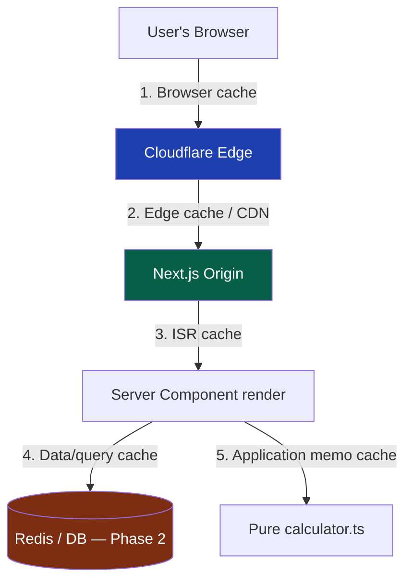
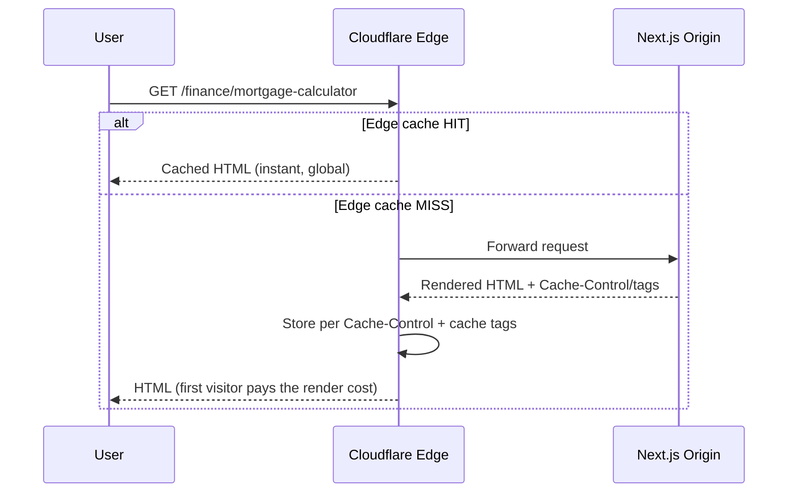
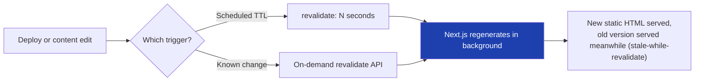
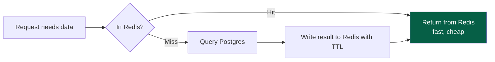
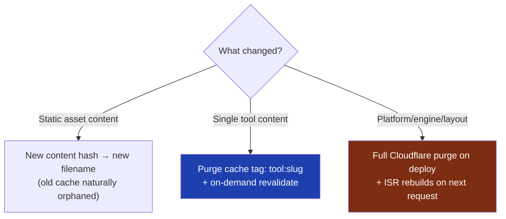

# 21 — Caching

> **Status:** Draft v1 · **Owner:** CTO / Platform Architect · **Audience:** Everyone shipping tools or platform code; caching decisions are made by the engine, but every engineer must understand the layers to avoid breaking them
> **Governed by:** `00-ENGINEERING-PRINCIPLES.md` and `04`, `10`, `11`, `12`, `14`, `15`, `20`, `43`. This chapter defines the caching strategy across every layer of the stack — browser, edge, ISR, data — and the one non-negotiable rule that makes the economics in `03` and the performance contract in `20` work.

---

## 1. Why Caching Is Not an Optimization Here — It's the Business Model

For most companies, caching is a performance nicety. For UToolios, it is closer to a **survival requirement**. The business model (`03`) depends on serving millions of monthly visitors, on thin ad-revenue margins, with a solo founder who cannot operate a fleet of servers. If every request executed real server work, the infrastructure bill would scale linearly with traffic — and traffic growth is exactly the thing we're chasing. Caching is what turns "more visitors" from a cost problem into a pure revenue opportunity.

**Simple explanation:** imagine a photocopier shop where 99% of requests are "give me a copy of page 12" — a page already photocopied an hour ago. You hand over a copy from the stack instead of hand-writing it again. Caching is that stack of pre-made copies. Almost nobody at UToolios should ever wait for a document to be written fresh.

> **CTO note:** the most dangerous caching mistake at our scale isn't caching too little — it's caching *invisibly and untested*, so a bad deploy silently serves a broken page to millions of users for hours because nobody invalidated the edge cache. Every layer in this chapter needs an explicit invalidation story before it ships. A cache without an invalidation plan is a bug generator, not a feature.

---

## 2. The Caching Rule

There is exactly one rule that governs every decision in this chapter:

> **Anything generated on the server must be cached.**

If a server (our Next.js app, a Route Handler, a future NestJS service) does real work to produce a response — rendering HTML, generating an OG image, running a calculation, querying a database — that output must be cached at the closest possible layer to the user, for as long as correctness allows. Uncached server work is either a bug or a deliberate, documented, rare exception (genuinely per-request personalization, which Phase 1 essentially has none of).

**Simple explanation:** in a restaurant kitchen, "anything cooked goes on the serving counter, not re-cooked per customer." If ten thousand people order the same soup, the kitchen makes one big pot and serves from it. Our "kitchen" is the server; the "soup" is a rendered page, an image, or a computed result.

> **CTO note:** this rule is deliberately absolute, not "cache when convenient." At 1,000+ tools built partly by AI-assisted generation (`01`), it's tempting to ship a Route Handler that "just computes and returns" without thinking about caching, because it works fine with one local test user. The rule exists to catch that blind spot before it becomes a viral-traffic cost incident (`11`, the server-tool danger zone).

---

## 3. The Five Cache Layers

Caching happens at five distinct layers, each with a different scope, lifetime, and invalidation mechanism. Understanding which layer answers a given request is the core skill this chapter teaches.

| Layer | Lives where | Typical lifetime | Introduced |
|-------|-------------|-------------------|------------|
| **1. Browser cache** | The visitor's device | Minutes to a year, by asset type | Phase 1 |
| **2. Cloudflare edge cache** | Cloudflare's global PoPs | Minutes to indefinite (until purge) | Phase 1 |
| **3. ISR (Next.js) cache** | Our origin's build/render output | Seconds to days, revalidated | Phase 1 |
| **4. Data/query cache** | Redis, in front of Postgres | Seconds to hours | Phase 2 |
| **5. In-process/app cache** | Server memory, request-scoped or module-scoped | A single request or process lifetime | Phase 1 (light), Phase 2 (heavier) |

**Simple explanation:** five nested layers of a filing system, closest to farthest from the "clerk" who does real work. First, the visitor's own drawer (browser cache) — no trip needed. Then Cloudflare's local filing cabinets worldwide (edge cache) — nearly as fast. Then our office's shelf of recently-typed documents (ISR) — a short walk. Then the archive room (Redis/DB) — a longer walk, only once heavier lookups exist. Almost every request should be answered by layer 1 or 2; real computation (layer 5) is the rare, last resort.

---

## 4. Layer 1 — Browser Cache

The browser cache is free, instant, and requires zero infrastructure — it's the first layer we should exploit fully.

| Asset type | Cache-Control | Why |
|------------|---------------|-----|
| Static assets with content-hashed filenames (JS/CSS bundles, `icon.svg` per tool) | `public, max-age=31536000, immutable` | The filename changes when content changes (`14`, cache-busting), so this URL's content never changes — cache forever |
| Fonts, images without hashed names | `public, max-age=604800, stale-while-revalidate=86400` | Rarely change; a week is safe, SWR smooths updates |
| HTML documents (tool pages) | `public, max-age=0, must-revalidate` at the browser, with edge/ISR doing the real caching (§5, §6) | HTML must reflect deploys quickly; the browser always asks Cloudflare, which usually answers from its own cache instantly |
| API/JSON responses (future public API, `26`) | Explicit `Cache-Control` per endpoint, typically short `max-age` + SWR | Balances freshness with the client cache |

**Simple explanation:** every file we send has a label: "keep forever" or "check back soon." A JS bundle named `app.a91f3c.js` gets the "forever" label because if the code ever changes, the filename changes too — no chance of serving stale code under a cached name. The HTML page gets a "check back" label — but checking back usually just means asking Cloudflare, which already has a fresh copy waiting (§5), so it still feels instant.

> **CTO note:** immutable + content-hash is Next.js's default behavior for build assets — we lean on it rather than reinventing it (`00`, `08`). The only caching effort that matters here is getting the *HTML* and *API* `Cache-Control` headers right, since those are ours to set per-route.

---

## 5. Layer 2 — Cloudflare Edge Cache

Cloudflare sits in front of every request (`04`, `43`) and is our first line of defense against origin load. Most visits should never reach the Next.js server at all.

| Concern | Approach |
|---------|----------|
| **What's cached at the edge** | Every static/ISR tool page, category page, sitemap, robots.txt, generated OG images (`15`, §6), static assets |
| **Cache key** | Full URL (path + relevant query params only where they affect content — most tool pages ignore tracking params like `utm_*`, `ref`) |
| **Respecting origin headers** | Cloudflare honors our `Cache-Control` / `s-maxage` from Next.js; we don't fight it with conflicting page rules |
| **Cache tags** | Each response carries a tag (e.g. `tool:mortgage-calculator`, `category:finance`) so we can purge precisely (§8) instead of nuking the whole cache |
| **Bypass rules** | Only for genuinely dynamic paths (future authenticated routes, Phase 3) — Phase 1 has essentially none |

**Simple explanation:** Cloudflare is a chain of local copy shops worldwide. The first person in, say, Sydney to visit the mortgage calculator triggers a real render at our origin — Cloudflare keeps a copy in its Sydney shop, and every other Sydney visitor gets it instantly, without our server waking up. We tag each copy (e.g. "this is the mortgage-calculator page") so that if we update just that tool, we tell Cloudflare "throw out only that copy," not the whole shelf.

> **CTO note — cache keys are a classic silent-bug source.** If tracking parameters (`?utm_source=twitter`) are allowed to vary the cache key, every marketing link fragments the cache into near-infinite "different" pages, and the hit rate collapses toward zero — quietly reintroducing full origin load under the appearance of a working cache. We strip marketing/tracking parameters from the key, the same discipline as canonical URLs (`14`, §4). Cache keys and canonicals should agree, or you get two sources of duplication.

---

## 6. Layer 3 — ISR (Incremental Static Regeneration)

ISR is Next.js's mechanism for content that's mostly static but occasionally changes — the right fit for the vast majority of our pages (`10`, §rendering strategy).

| Setting | Behavior |
|---------|----------|
| `revalidate: false` (pure SSG) | Content built once, never regenerated until the next deploy — most tool pages (calculators rarely change) |
| `revalidate: <seconds>` | Background regeneration after the TTL — used for pages with content that updates on a schedule (a tax-bracket tool after tax law changes, a trending/"popular tools" listing) |
| `on-demand revalidation` | A webhook/API call tells Next.js "this specific page is stale now" — used when we *know* a tool's content just changed (article edit, FAQ update) rather than waiting for a timer |

**Stale-while-revalidate at the ISR layer:** when a page's TTL expires, Next.js does **not** make the next visitor wait for a fresh render. It serves the last known-good static version immediately, while regenerating in the background — the *next* request after that gets the fresh copy. This is the same SWR principle used at the HTTP header level (§4) applied to whole-page regeneration.

**Simple explanation:** a bakery's display tray never sits empty while a new batch bakes — old loaves stay on the shelf, customers keep buying, and the tray is quietly replaced the moment the new batch is ready. Nobody stands at the counter watching bread bake. Our mortgage-calculator page works the same way: even when "due" for a refresh, visitors always get an instant page — never a loading spinner while the server regenerates.

> **CTO note:** the temptation with ISR is aggressive `revalidate` timers "just in case content changed," which quietly turns a free static page into one that regenerates (costs compute) far more often than needed. Default to `revalidate: false` for genuinely static tools; reserve TTLs or on-demand revalidation for the minority with real freshness needs. On-demand revalidation, triggered by the content-edit event itself, beats a timer when we know exactly when content changed — freshness *and* rare compute.

---

## 7. Layer 4 — Data/Query Cache (Redis, Phase 2)

Phase 1 has no database (`04`, `12`), so there is no query cache yet — this section documents the seam we design for, not something we build today.

| Aspect | Design |
|--------|--------|
| **What it caches** | Expensive, frequently-read, rarely-changing query results — e.g. a future tool's reference data (currency rates, tax tables), aggregated analytics for internal dashboards, search index warm results before Meilisearch (`12`, `31`) |
| **Cache key** | Deterministic key derived from the query's parameters — e.g. `rates:USD:2026-07-20` |
| **TTL strategy** | Short TTLs (seconds to minutes) for data that changes; explicit invalidation on write for data we control |
| **Cache-aside pattern** | App checks Redis first; on miss, queries Postgres, then writes the result to Redis before returning | 
| **Where it activates** | Phase 2, when a real database and real query load exist (`12`) |

**Simple explanation:** the archive-room layer. Once we have a real database, some questions get asked over and over with the same answer for a while — "what's today's mortgage interest rate baseline?" Instead of asking the database every time, we keep the recent answer in Redis, a much faster in-memory lookup, and only go back when it expires or we know it changed.

> **CTO note — build the seam now, not the feature.** We don't stand up Redis in Phase 1 because there's no state to cache yet — infrastructure with nothing to do (`00`, YAGNI). But future data-access code sits behind a repository interface (`12`) specifically so adding a Redis cache-aside layer in Phase 2 is a change *inside* that interface, invisible to callers — not a rewrite of ad-hoc database calls scattered through the codebase.

---

## 8. Layer 5 — Application/Compute Cache

Even within a single render or request, there's a cheaper layer: not re-doing work we've already done in this same process lifetime.

| Technique | Use case |
|-----------|----------|
| **React `cache()` / request memoization** | The same tool's config or metadata is read multiple times during one render (page + layout + JSON-LD) — memoize per-request so it's computed once |
| **Module-level memoization** | The tool registry (`13`) is built once per server process/build, not re-scanned per request |
| **Memoized pure calculators** | For calculator.ts functions with expensive computation (rare — most are trivial arithmetic), memoize on input within a request if the same inputs recur |

**Simple explanation:** a chef who needs the same chopped onions for three dishes on one ticket chops once and reuses the pile — not once per dish. Our tool-registry lookup and metadata generation work the same way: compute once per request/build, reuse everywhere that request needs it.

---

## 9. Cache Keys, Invalidation, and Cache Busting on Deploy

A cache is only as good as its invalidation story. Three mechanisms cover our needs:

| Mechanism | Used for | How |
|-----------|----------|-----|
| **Content-hashed filenames** | JS/CSS/static assets | The build pipeline hashes content into the filename — a new deploy produces new filenames, so old cached assets are simply never requested again, no purge needed |
| **Cache tags + targeted purge** | A single tool's content changes (article edit, FAQ update) | Purge only `tool:<slug>` at Cloudflare + trigger on-demand ISR revalidation for that route — never a full-site purge for a single-tool edit |
| **Full-site purge (deploy)** | A platform-wide change (layout, global metadata template, engine logic) | CI/CD purges the Cloudflare cache and lets ISR rebuild pages as they're next requested — used sparingly, since it briefly increases origin load |

**Simple explanation:** three ways to "tell the copy shops to throw out the old version." A renamed document (our JS bundles) makes old copies simply irrelevant. A single tool's page uses its tag: "throw out only this copy." A change affecting every page gets a full purge — a big, deliberate action taken rarely, not routine.

> **CTO note:** full-site purges are the caching equivalent of a hard reset — they work, but the *next* wave of visitors to every page pays the origin-render cost simultaneously, spiking load right after a deploy. As we scale toward millions of pages, favor targeted tag-based purges over full purges whenever the change is genuinely scoped, and treat full purges as an event worth watching in observability (`27`), not a routine deploy step.

---

## 10. OG Image Caching

Dynamically generated Open Graph images (`15`, §6) are a textbook case of "the rule" (§2) in action: they're server-generated, potentially expensive, and trivially cacheable because a given tool's OG image is identical for every viewer.

| Aspect | Approach |
|--------|----------|
| **Generation** | On first request for a given tool's OG image URL, generate once |
| **Cache-Control** | Long `max-age` + `immutable`-style caching at the edge, since the image only changes when the tool's title/config changes |
| **Edge caching** | Cloudflare caches the generated image exactly like any static asset — subsequent requests (from any social platform's crawler, anywhere) never regenerate it |
| **Invalidation** | Tied to the same tag-based purge as the tool's page (§9) — if the tool's title changes, purge its OG image tag too |

**Simple explanation:** the mortgage-calculator's share-card image looks identical no matter who shares the link — so we generate it once and hand out that same picture forever, like any other image file. It only changes if the tool's title or branding is edited, at which point we purge that one image alongside the page.

> **CTO note:** this is the "viral tool hammers the image generator" risk from `15` — without aggressive edge caching, a tool shared thousands of times in an hour would regenerate the *same* image thousands of times. Caching turns a potential cost incident into a non-event: generate once, serve forever until purged.

---

## 11. What We Deliberately Don't Build Yet

Consistent with phasing (`04`), several caching capabilities are seams, not builds, in Phase 1:

| Capability | Why deferred | Activates |
|------------|---------------|-----------|
| Redis data/query cache | No database, no query load yet | Phase 2 |
| Distributed cache invalidation across multiple app servers | Phase 1 is stateless/static; no server-side session state to invalidate | Phase 2/3 |
| Per-user/personalized caching (auth-aware) | No accounts yet | Phase 3 |
| API response caching with per-key rate/quotas | No public API yet | Phase 3 (`26`) |

**Simple explanation:** we're not installing a walk-in freezer for a food truck that sells three items today. When the menu grows (accounts, APIs, personalization), we build the storage that matches — interfaces are already shaped so that addition doesn't require ripping out the kitchen.

---

## Summary

- **The rule:** anything generated on the server must be cached — uncached server work is a bug or a rare, deliberate exception.
- Caching happens across **five layers**: browser cache, Cloudflare edge, Next.js ISR, data/query cache (Redis, Phase 2), and in-process compute memoization.
- **Browser cache** leans on content-hashed, immutable filenames for assets; HTML stays short-lived at the browser but is really served fresh-feeling via the edge.
- **Cloudflare edge cache** is the primary shield against origin load; cache keys must strip tracking parameters (mirroring canonical URL discipline, `14`) or the hit rate silently collapses.
- **ISR** is the default rendering strategy for tool pages — `revalidate: false` for static tools, TTL or on-demand revalidation for the minority with real freshness needs, with stale-while-revalidate ensuring nobody ever waits for a regeneration.
- **Redis/data caching** is a Phase 2 feature; Phase 1 builds the repository-interface seam so it slots in without a rewrite (`12`).
- **Cache busting** uses three mechanisms matched to change scope: content-hash renaming (assets), tag-based targeted purge (single tool), full purge (platform-wide changes, used sparingly and watched in observability).
- **Dynamically generated OG images** are generated once and cached aggressively — the concrete case study for why "generate, don't hurt yourself on scale" matters (`15`).
- Personalized, per-user, and API-quota-aware caching are explicitly deferred to Phase 2/3, matching auth and the public API.

> Next: `22-API-STANDARDS.md` — the conventions for endpoints, versioning, and error shapes once server-side and public APIs exist.

---

### Changelog
| Version | Date | Change | Reason |
|---------|------|--------|--------|
| v1 | (draft) | Initial caching strategy | Project inception |
