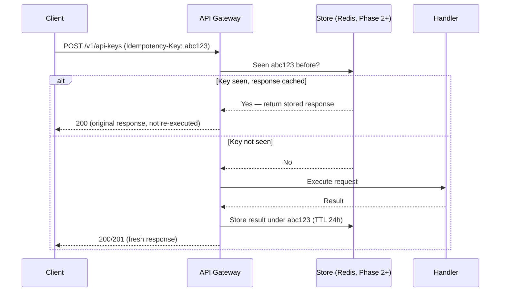
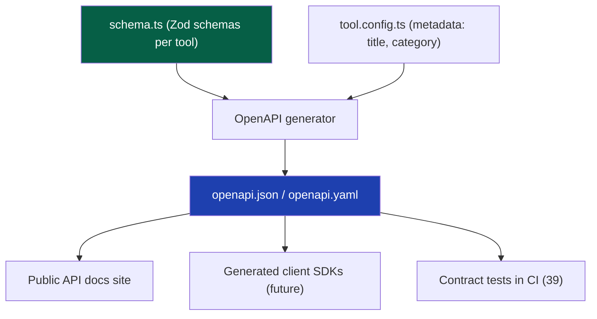

# 22 — API Standards

> **Status:** Draft v1 · **Owner:** CTO / Principal Backend Engineer · **Audience:** Everyone who will build, consume, or document a UToolios API endpoint
> **Governed by:** `00-ENGINEERING-PRINCIPLES.md`, and especially `03-BUSINESS-MODEL.md` (R4/R5), `04-ARCHITECTURE-OVERVIEW.md` (§7 phasing), `08-CODING-STANDARDS.md`, `11-BACKEND-ARCHITECTURE.md` (§6), and `13-TOOL-PLUGIN-ARCHITECTURE.md`.

---

## 1. What This Chapter Is, and When It Activates

This chapter defines the **contract shape** for every HTTP API UToolios ever exposes — the public, metered, monetizable API (R4/R5 in `03`) and every internal Next.js Route Handler our frontend calls today.

The **public API is a Phase 3 feature**. Per `04`, §7, it activates once the tool library is broad and stable enough that developers would depend on it, and once auth (`23`), tenancy (`24`), billing (`03`, R3), and security hardening (`25`) exist to support it. Shipping it earlier means an unmetered, unauthenticated attack surface with no revenue behind it — pure downside.

What is **not** deferred is the *discipline*. Every internal endpoint we write in Phase 1 and Phase 2 — the contact form handler, the light data-fetch stubs of `11`, §3 — follows these standards from the first line of code. When Phase 3 arrives, "launching the public API" becomes an exercise in **exposing already-conformant endpoints behind a gateway**, not redesigning them under deadline pressure.

**Simple explanation:** this chapter is the shape of every shipping container we will ever use, decided before we've shipped a single box. Right now we're only moving packages between our own warehouses (internal endpoints), but every crate is already built to the international shipping standard. The day we start shipping to outside customers, nothing needs repacking — we just open the loading dock.

> **CTO note:** the temptation on a solo-founder timeline is "it's just an internal endpoint, I'll clean it up later." Resist this specifically for API shape, because it costs almost nothing to do right the first time and real days to retrofit later once frontend code depends on the sloppy shape. Here, "correct" and "quick" are the same amount of work — this is a fixed convention, not extra engineering.

---

## 2. REST Conventions and Resource Naming

We use REST over HTTP/JSON as the default API style: boring, universally understood, cacheable by intermediaries (CDNs, browsers), and requiring no special client tooling — all of which matter for a long-tail developer audience discovering us through documentation, not a sales call.

| Rule | Convention | Example |
|------|-----------|---------|
| Resources are nouns, plural | `/tools`, `/conversions`, `/api-keys` | not `/getTools` |
| Nesting reflects ownership | `/tools/{slug}/examples` | not `/tool-examples?tool=slug` |
| HTTP verbs carry the action | `GET` read, `POST` create/compute, `PATCH` update, `DELETE` remove | never `POST /deleteTool` |
| Tool identity uses the canonical slug | `/v1/tools/mortgage-calculator` | matches URL, folder, analytics key (`09`) |
| Computation is a deliberate exception | `POST /v1/tools/{slug}/calculate` | it's an action, not CRUD, so `POST` with a body is correct |
| kebab-case in URLs, camelCase in bodies | `/v1/api-keys`, `{ "monthlyLimit": 1000 }` | consistent with `09` |

**Simple explanation:** a URL should read like a sentence a human can guess. `/v1/tools/jwt-decoder/calculate` reads as "in version 1, take the tool called jwt-decoder, and calculate." A developer who has never seen our docs should be able to guess a *second* endpoint's shape from the first one — that predictability is what makes an API pleasant to integrate against.

The single most important naming rule is already locked in at the platform level: **the tool's slug is canonical everywhere** — folder name, URL segment, `tool.config.ts` id, analytics event, search key, *and* API resource identifier (`09`). `POST /v1/tools/mortgage-calculator/calculate` and the web page `/finance/mortgage-calculator` refer to the identical entity — the API never invents a second name for a tool.

---

## 3. The Success/Error Envelope

Every response — success or failure — uses one consistent JSON shape. Consumers write one parsing path, not a different one per endpoint.

**Success:**
```json
{
  "success": true,
  "data": { "monthlyPayment": 1847.15, "totalInterest": 214974.12 },
  "meta": { "requestId": "req_9f2ac1", "version": "v1" }
}
```

**Error:**
```json
{
  "success": false,
  "error": {
    "code": "VALIDATION_ERROR",
    "message": "principal must be a positive number",
    "field": "principal"
  },
  "meta": { "requestId": "req_9f2ac1", "version": "v1" }
}
```

| Element | Rule |
|---------|------|
| `success` | Always present, always boolean — the first thing any client checks |
| `data` | Present only on success; shape is endpoint-specific, documented in the OpenAPI spec (§9) |
| `error.code` | Stable, machine-readable enum (`VALIDATION_ERROR`, `RATE_LIMITED`, `NOT_FOUND`) — never a raw exception message |
| `error.message` | Human-readable, safe to display, never a stack trace or internal detail (`25`) |
| `meta.requestId` | Correlates a client-reported issue with our own traces (`28`) |
| HTTP status | `200` success, `400` validation, `401`/`403` auth, `404` not found, `409` conflict, `429` rate limited, `500` our fault |

**Simple explanation:** imagine every restaurant on a food-delivery app printing receipts in a different format — some list tax first, some last, some skip it. The app would need custom code per restaurant. Our envelope is one receipt format for every "restaurant" (endpoint), so any client — including our own frontend — writes one receipt-reading function, forever.

> **CTO note:** resist letting `data` be null and relying on HTTP status alone, or skipping the envelope for "simple" endpoints. The moment one endpoint returns a bare array and another returns `{ data: [...] }`, every client needs endpoint-specific logic, and our own frontend's error handling forks into special cases. This consistency is what makes it feasible for a solo founder — later a small team — to maintain hundreds of endpoints without each one being a bespoke contract.

---

## 4. Versioning: URL-Based, Starting at `/v1`

All API routes are prefixed with an explicit version: `/v1/tools/bmi-calculator/calculate`. Full versioning strategy (deprecation windows, sunset headers, how `v2` gets introduced) lives in `49-VERSIONING.md`; this chapter commits to the mechanism.

| Decision | Value | Why |
|----------|-------|-----|
| Versioning location | URL path (`/v1/...`) | Visible in logs, curl-able, cacheable by URL — simpler than header-based versioning |
| First version | `v1` from day one, even internally | No endpoint is ever unversioned; no "v0 special case" to migrate away from later |
| Breaking changes | Require a new version (`/v2`); `v1` keeps working through a published deprecation window | An API is a promise; breaking it silently destroys developer trust (`03`, §7) |
| Additive changes | New optional fields, new endpoints — ship inside `v1` | Not breaking; don't force a version bump for them |

**Simple explanation:** `/v1` is the edition number printed on a legal contract. Everyone who signed the "v1" contract keeps the terms they signed, even after we draft a "v2" for new customers. Putting the version in the URL means anyone reading a log line or a curl command instantly knows which contract is in play — no digging through headers.

---

## 5. Pagination and Filtering

Any endpoint returning a collection (e.g., `GET /v1/tools`, `GET /v1/tools/{slug}/history` in Phase 3) is paginated from day one — never "add pagination once the list gets big," because that's a breaking change to a shape clients already depend on.

| Concern | Convention | Why |
|---------|-----------|-----|
| Style | Cursor-based (`?cursor=...&limit=50`), never raw offset | Offset pagination skips/duplicates rows under concurrent writes at scale; cursors don't |
| Limits | Default `20`, max `100`, enforced server-side | Prevents requesting an entire dataset in one call |
| Shape | `data` is the array; `meta.nextCursor` (nullable) signals more pages | Consistent with the envelope in §3 |
| Filtering | Explicit, documented query params: `?category=finance&tag=mortgage` | Every filterable field is a deliberate, indexed choice — no free-text query injection |
| Sorting | `?sort=field:asc` with a fixed allow-list | Prevents expensive sorts on unindexed columns |

**Simple explanation:** a phone book handed to you one page at a time, with a bookmark (`cursor`) marking exactly where to resume, never loses your place even if a listing is added while you're reading. Handing someone "entry 500 onward" (offset pagination) can skip or repeat entries if the book changed underneath them. We use the bookmark approach from the first list endpoint we ever build, so we never migrate clients off a fragile pattern later.

---

## 6. Idempotency

`POST` requests that create or mutate state (not the pure `calculate` endpoints, which are naturally idempotent given identical input) must support an `Idempotency-Key` header.



| Rule | Reason |
|------|--------|
| Client generates a UUID per logical operation, sends it as `Idempotency-Key` | Client controls retry safety, not the server guessing intent |
| Server stores `key → response` for a bounded TTL (e.g., 24h) | A retried request returns the *original* result, never double-executes |
| Missing key is allowed but discouraged, documented as "at-least-once" | Don't force complexity on every caller, but make the risk explicit |
| Pure calculation endpoints don't need this | Same input always produces the same output with no side effect to duplicate |

**Simple explanation:** paying a bill online, the confirmation page hangs, and unsure it went through, you click "Pay" again. Idempotency is the bank recognizing "this is the same payment attempt" (via the key you sent) and refusing to charge you twice, showing you the same receipt instead. This matters for anything with real consequence — creating an API key, upgrading a plan — never for a stateless calculation like the tile-calculator, which has no "twice" to worry about.

---

## 7. Rate Limiting and Metering

Rate limiting protects the platform from abuse and runaway cost (`03`, §7; `11`, §5); metering is how usage-based billing and quota enforcement work at all. Both apply per API key (§8), not just per IP, once keys exist.

| Layer | Mechanism | Applies to |
|-------|-----------|-----------|
| Edge | Cloudflare WAF rate limiting by IP | All traffic — first line of defense against floods |
| Application | Token-bucket per API key, backed by Redis (Phase 2+) | Authenticated calls — enforces the caller's plan tier |
| Signaling | `X-RateLimit-Limit/Remaining/Reset` headers; `429` with `Retry-After` when exceeded | Every response, so clients can self-throttle |
| Metering | Per-key, per-billing-period request counter | Feeds billing (`03`, R3) and usage dashboards |

**Simple explanation:** rate limiting is a bouncer capping how many people enter per minute, regardless of who they are. Metering is the till at the counter, counting exactly how many drinks each named member ordered this month so the bar can bill correctly. We need both: the bouncer stops any single customer (or attacker) from overwhelming the room, and the till is what makes usage-based pricing possible at all.

> **CTO note:** rate limiting and metering solve different problems, and conflating them is a common mistake. A generous rate limit with no metering means we can't bill accurately or spot a customer nearing their plan cap. Accurate metering with no rate limit means a misbehaving script can still take down shared infrastructure before the bill is even calculated. We ship both together or we don't ship the public API — a hard gate, same posture as the `serverSide: true` tool gate in `11`, §5.

---

## 8. API Keys and Authentication

API keys are the Phase 3 authentication mechanism for the public API — distinct from the end-user session auth covered in `23`. A key identifies a *developer/customer*, not necessarily a logged-in human.

| Property | Convention | Why |
|----------|-----------|-----|
| Format | Prefixed, high-entropy: `utk_live_...` / `utk_test_...` | Prefix makes a leaked key instantly identifiable in logs and scanners |
| Transport | `Authorization: Bearer ...` header only | Never in the URL — query strings leak into logs, history, referrer headers (`25`) |
| Storage | Hashed at rest, never logged in plaintext | A database leak must not leak usable keys |
| Scope | Plan tier + permitted scopes (read-only, calculate, write) | Least privilege by default (`00`, N1) |
| Rotation | Self-service revoke + regenerate, no support ticket | Reduces operational burden at scale |
| Tenancy | Keys map to an account/organization (`24`) | Same mechanism underpins individual and white-label (R5) access |

**Simple explanation:** an API key is a numbered gym membership card, not a face-recognized member — the gym only needs to know which tier the card belongs to and how many visits remain this month. If the card is lost or shared, the member cancels it and gets a new number, without changing their actual identity (their account). We store only a fingerprint of the card, never the raw number, so even we can't leak a usable key.

---

## 9. The OpenAPI Specification

Every public endpoint (and, in practice, every internal one — see §1) is described in a single OpenAPI 3.x specification, generated from the same TypeScript/Zod schemas that validate requests at runtime (`schema.ts`, `08`, §3) — never hand-written and never allowed to drift from the code.



| Benefit | Why it matters here |
|---------|----------------------|
| Single source of truth | The schema that validates a `calculate` request also documents it — docs can't drift from behavior |
| Auto-generated docs | With 1,000+ tools, hand-writing docs per endpoint doesn't scale — generation is mandatory (`00`, 4.5) |
| Contract testing in CI | The spec is a test fixture — a schema/spec mismatch fails the build |
| Future SDK generation | Client libraries can be generated from the spec instead of hand-maintained per language |

**Simple explanation:** rather than hand-writing a separate instruction manual for each of a thousand tools, we point a generator at the same blueprint (`schema.ts`) that already tells the server what a valid request looks like. The manual is always accurate because it's produced *from* the document that enforces the rules, not written separately by someone hoping to remember them correctly.

---

## 10. Public vs. Internal APIs

Not every endpoint is public, and the distinction is architectural, not just a marketing label.

| | Internal (now) | Public API (Phase 3) |
|---|-----------------|------------------------|
| Consumer | Our own Next.js frontend | External developers, white-label customers |
| Auth | None or simple internal checks | API keys, scoped, metered (§7, §8) |
| Stability | Changes freely with the frontend | Versioned, deprecation-windowed promise (§4, `49`) |
| Docs | Code comments only | Full OpenAPI spec, public docs site (§9) |
| Rate limiting | Edge-level only, generous | Per-key tiers at the application layer |
| Location | Next.js Route Handlers | Behind the API Gateway (`11`, §4), same underlying logic |

**The unifying fact, and the whole point of this chapter:** both categories call the exact same `calculator.ts` for a given tool. The public API is not a reimplementation of tool logic for external use — it is a new, authenticated, metered *door* into the identical pure function the web page already calls (`13`, §3.3; `04`, §4). A tool built once, correctly, powers the web page, the internal endpoint, and — when Phase 3 activates it — the public API, with zero duplicated business logic.

**Simple explanation:** `calculator.ts` is the one kitchen that cooks a dish. The web page is a waiter bringing that dish to a dine-in customer for free. The public API is a delivery service bringing the identical dish to a customer's door for a fee. Same kitchen, same recipe — just a different, monetized front door. We are not building a second kitchen for delivery orders.

> **CTO note:** R4 (public APIs) can be a high-leverage revenue stream (`03`, §7) precisely because of this reuse. If we ever catch ourselves writing tool-specific logic *inside* an API route handler instead of calling the shared `calculator.ts`, that's a Clean Architecture violation worth blocking in review — the tool now has two brains that can drift apart, and every bug fix has to remember to patch both.

---

## Summary

- The public API is a **Phase 3** feature (R4/R5, `03`), activated once the tool library is broad and auth, tenancy, billing, and security hardening exist — but every internal endpoint follows these standards starting today.
- **REST conventions**: plural noun resources, verbs via HTTP methods, the tool's canonical slug as the resource identifier, `calculate` as the deliberate action-endpoint exception.
- One consistent **success/error envelope** (`success`, `data`/`error`, `meta.requestId`) across every endpoint, with correct HTTP status codes.
- **URL-based versioning** starting at `/v1`; breaking changes require a new version and a published deprecation window (`49`).
- **Cursor-based pagination** and an explicit, indexed **filtering/sorting allow-list** from the first list endpoint.
- **Idempotency keys** for mutating `POST` requests so retries never double-execute; pure calculations don't need them.
- **Rate limiting** and **metering** are separate systems — both mandatory before the public API ships.
- **API keys** — prefixed, bearer-token, hashed at rest, scoped, tenant-mapped — are the public API's identity mechanism, distinct from end-user session auth (`23`).
- The **OpenAPI spec is generated from the same Zod schemas** that validate requests at runtime, never hand-written, feeding docs, contract tests, and future SDKs.
- **Public and internal endpoints both call the same `calculator.ts`** — the API is a new authenticated door into the same room, never a second implementation of tool logic.

> Next: `23-AUTHENTICATION.md` — the account and session model that API keys and public endpoints will build on.

---

### Changelog
| Version | Date | Change | Reason |
|---------|------|--------|--------|
| v1 | (draft) | Initial API standards | Project inception |
