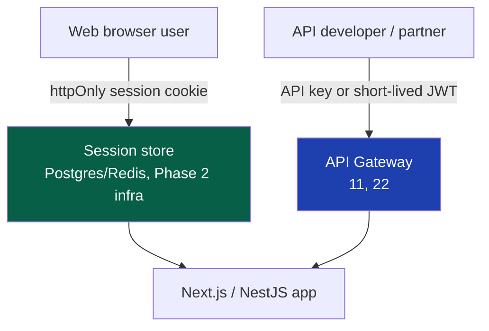
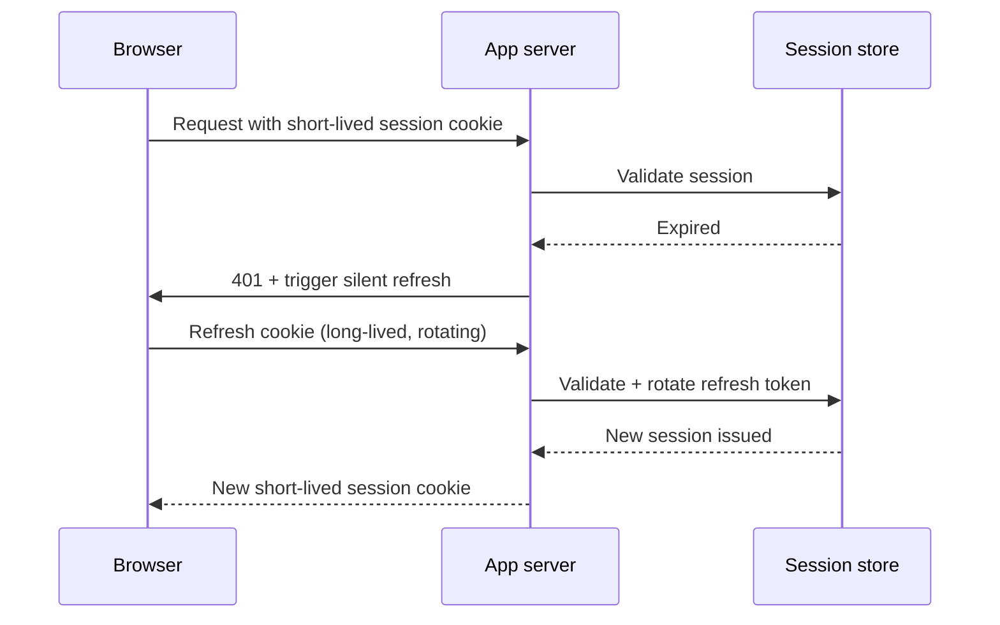

# 23 — Authentication

> **Status:** Draft v1 · **Owner:** CTO / Principal Backend Engineer · **Audience:** Everyone who will touch accounts, sessions, or the public API
> **Governed by:** `00-ENGINEERING-PRINCIPLES.md` and the relevant prior chapters (`03-BUSINESS-MODEL`, `04-ARCHITECTURE-OVERVIEW`, `11-BACKEND-ARCHITECTURE`, `12-DATABASE-ARCHITECTURE`).

---

## 1. Why This Chapter Exists Before It's Needed

UToolios launches with **zero accounts**. Phase 1 has no login, no signup form, no "my account" page — no tool in Phase 1 requires knowing who the user is. A mortgage calculator, a JWT decoder, and a tile calculator all work perfectly for a stranger.

So why write an authentication chapter now? Because authentication is a **load-bearing wall** (`00`, N1, N5), not furniture. The moment we introduce it — premium tiers, saved history, a metered public API (`03`, R3/R4) — it must be *correct on day one*: hashed correctly, sessioned correctly, rate-limited correctly. Retrofitting security into an existing user base is how breaches happen. So we design the target system in full now, and defer only the *implementation effort*, never the *thinking*.

**Simple explanation:** this chapter is the blueprint for a bank vault we haven't built yet. We're not pouring concrete today — but we're deciding exactly where the walls, the lock mechanism, and the alarm wiring go, so that when we do pour concrete, nobody is improvising the lock design under launch pressure.

> **CTO note:** the most dangerous way to build authentication is "ship something simple now, harden it later." Auth bugs don't degrade gracefully like a slow page — they leak every user's account at once. We do not write production auth code until this chapter's design is implemented in full: no "just cookies, we'll add hashing later," no "MFA is a v2 feature." The seam waits; the design, once built, does not.

---

## 2. Why Authentication Is Deferred to Phase 3 (and Only Phase 3)

Per `03` (R3, Premium) and `11` (§4, NestJS triggers), authentication activates when we have something worth authenticating *for*.

| Phase | Auth state | Why |
|-------|-----------|-----|
| **1 (now)** | None. Every tool works anonymously. | No accounts to protect; building auth now protects nothing and delays shipping tools. |
| **2** | None, or a minimal anonymous device ID for abuse signals only (`25`) | Server-side tools need *rate limiting*, not *identity* — a hashed IP/fingerprint is enough. |
| **3** | Full authentication (this chapter) activates | Premium tiers, saved data, and the metered public API require knowing *who* is asking. |

**The trigger conditions** (any one justifies building this chapter's design for real, matching `11` §4): launching **premium features** that need a persistent identity (saved calculations, ad-free tier); launching the **metered public API** with per-developer keys and quotas; or needing **audit trails** tied to a real actor, not an anonymous session.

**Simple explanation:** you don't install a security badge system in an office building before it has employees. You design where the badge readers will go — at every door that matters — while the building is still blueprints. Then you install the readers the week the first employee starts, not the week after someone walks in who shouldn't.

> **CTO note:** the temptation for a solo founder is to add "just a simple login" early because it feels like progress. Resist it. An auth system with zero real users is pure liability — an attack surface with no corresponding revenue, and the single feature most likely to be built wrong under time pressure. Every week auth doesn't exist is a week it can't be breached.

---

## 3. Sessions vs Tokens — The Core Decision

There are two ways to keep someone "logged in": **server-side sessions** (an opaque ID in a cookie, state on the server) and **JWTs** (a signed, self-contained token). UToolios uses **both**, deliberately, for different consumers.

| Consumer | Mechanism | Why |
|----------|-----------|-----|
| **Web app users** (browser) | **httpOnly, Secure, SameSite cookie session** | Cookies can't be read by JavaScript (XSS-resistant), are revocable instantly server-side, and need no client-side token-storage logic. |
| **Public API consumers** (`22`) | **API keys**, optionally short-lived JWTs for advanced/partner flows | Stateless verification scales horizontally; a key is easy to issue, rotate, and revoke per developer. |

**We do not use JWTs as the primary web session mechanism.** This is a deliberate, opinionated call that goes against a common industry default, so it deserves the reasoning spelled out.

### Why cookie sessions win for the web app

| Property | httpOnly session cookie | JWT in localStorage/JS-readable cookie |
|----------|--------------------------|------------------------------------------|
| **XSS exposure** | Token never touches JavaScript | A single XSS hole can exfiltrate the token |
| **Revocation** | Instant — delete the server-side session row | Hard — valid until expiry; needs a blocklist, defeating the "stateless" benefit |
| **Payload trust** | Server always re-checks the source of truth | Client can trust stale claims baked into the token |
| **Complexity for Next.js** | Low — framework and browser do the work | Higher — needs refresh rotation, storage strategy, blocklist infra |

**Simple explanation:** a session cookie is a coat-check ticket — meaningless on its own; the coat (real data) stays in the back room, and the counter can void your ticket instantly if something's wrong. A JWT is a *self-contained boarding pass* — anyone holding it can already prove who they are, powerful for a machine-to-machine API, but hard to "un-print" once issued. For our own logged-in users (mortgage-calculator premium history, saved JWT-decoder presets), we want the coat-check model.

> **CTO note:** "JWTs are stateless, so they scale better" is true, and it's the right trade for a public API where developers hold the credential and we accept slower revocation for not hitting a session store on every request. It's the *wrong* trade for our own web users, where instant revocation on a compromised account matters more than shaving one database read off a page we're already server-rendering. Don't cargo-cult "JWTs everywhere" — pick the mechanism per consumer.

---

## 4. Password Storage — argon2id, No Exceptions

If we ever store a password, it is hashed with **argon2id** — never bcrypt, never SHA-anything, never reversible encryption.

| Requirement | Value | Why |
|-------------|-------|-----|
| Algorithm | `argon2id` (hybrid mode) | Resists both GPU-cracking (side-channel) and time-memory trade-off attacks — the current best practice, ahead of bcrypt |
| Memory cost | ~19–64 MB per hash, tuned against real infra, not copied from a blog | Makes mass GPU cracking economically painful |
| Iterations / parallelism | Tuned so one hash takes ~250–500ms on production hardware | Balances login latency against attacker cost |
| Pepper | Optional app-level secret combined with the salt, stored outside the DB (secrets manager) | Protects against a DB-only leak (`25`, `45`) |
| Storage | Only hash + salt (argon2 embeds salt in its output) — never plaintext, even transiently in logs | A logged plaintext password is a permanent breach |

**Simple explanation:** hashing a password is like putting it through a one-way meat grinder — you can never get the original word back out, only compare "does grinding this new password produce the same output?" argon2id is the *slowest, most expensive* meat grinder we can afford at login time, on purpose — the cost that's a minor annoyance for one legitimate login (a fraction of a second) becomes prohibitively expensive for an attacker trying billions of guesses.

> **CTO note:** most password hashing failures aren't "we used the wrong algorithm" — they're "we logged the raw password during a debug session" or "it ended up in an error-tracking payload." The algorithm is the easy 10%. Never letting the plaintext exist outside the login request's memory is the hard 90%, enforced by redacting password fields at the schema level (`08`, Zod boundary validation) so logging middleware (`28`) never sees them — not left as a manual checklist item.

---

## 5. Social Login (OAuth) — Reducing Password Risk, Not Adding a Feature

We support OAuth (Google first, GitHub a natural second for a tool-builder audience) primarily as a **security improvement**, not a growth gimmick: every user who signs in via Google is a password we never have to store, hash, or worry about being reused from a breached site elsewhere.

| Step | Detail | Why |
|------|--------|-----|
| Flow | Standard OAuth 2.0 Authorization Code + PKCE, never the implicit flow | PKCE closes the interception vector the implicit flow is vulnerable to |
| Account linking | Match by verified email; require explicit confirmation before merging into an existing email/password account | Prevents takeover via a spoofed OAuth email claim |
| Our own session | OAuth success still ends in **our own httpOnly session cookie** (§3), never the provider's token used directly | Keeps our session model consistent regardless of login method |

**Simple explanation:** OAuth is like showing a government-issued passport to check into a hotel instead of the hotel inventing its own ID system. The hotel still hands you *its own* room key afterward. Google vouches for identity; we still issue our own session.

---

## 6. Email Verification and Account Integrity

An unverified email is treated as an unconfirmed claim, not a trusted identity.

| Rule | Why |
|------|-----|
| New accounts start `emailVerified: false` | Prevents signup with someone else's address |
| Verification link: single-use, time-limited (~24h), cryptographically random token | Prevents enumeration/replay |
| Sensitive actions (purchase, API key issuance) require `emailVerified: true` | Ties billing and access to a confirmed identity |
| Email change re-verifies the new address and notifies the old one | Classic account-takeover tripwire — the real owner gets a chance to react |

**Simple explanation:** email verification is a returned RSVP card. Anyone can *write* an address on a form, but until it confirms back, we treat it as unconfirmed — a venue won't seat a guest whose RSVP never came back.

---

## 7. Multi-Factor Authentication (MFA)

MFA is part of the Phase 3 design: offered for regular users, mandatory for the accounts that matter most operationally.

| Account type | MFA policy |
|--------------|------------|
| Regular premium user | Optional, TOTP-based (authenticator app), strongly encouraged at signup |
| API partner / high-quota key holder | Required before key issuance |
| Internal admin / staff accounts | Required, no exceptions — these accounts can affect all tools and all users |

We implement **TOTP (RFC 6238)** as the baseline second factor — works with any standard authenticator app, no SMS carrier dependency, no per-message cost. SMS-based MFA is explicitly avoided as a primary factor: SIM-swap risk makes it weaker than it appears, and it adds a recurring per-message vendor cost that doesn't belong in a lean cost model (`03`, §9).

**Simple explanation:** a password is one lock on the door. MFA is a second, different kind of lock — something you *have* (a phone generating a rotating code), not just something you *know*. Most users get a strongly recommended second lock; accounts that can affect the whole platform (admins, high-volume API partners) get it by policy, the way a bank vault requires two keys, not just the teller window.

---

## 8. Secure Cookies, Refresh, and Session Lifetime

The session cookie carries several hard requirements, enforced at the framework/infra level so no individual endpoint can accidentally skip one.

| Cookie attribute | Setting | Why |
|-------------------|---------|-----|
| `HttpOnly` | Always | JavaScript cannot read it — blocks token theft via XSS |
| `Secure` | Always (HTTPS only) | Never transmitted over plaintext |
| `SameSite` | `Lax` (or `Strict` for the most sensitive flows) | Mitigates CSRF by default |
| `Path` | Scoped narrowly | Reduces exposure surface |
| Expiry | Short-lived session cookie + a longer-lived, rotating refresh token in a separate httpOnly cookie | Balances "don't force re-login constantly" against "don't leave a stolen cookie valid forever" |

**Token refresh flow:**

**Refresh token rotation:** every time a refresh token is used, it is invalidated and replaced with a new one. If an old, already-rotated refresh token is ever presented again, that's a strong signal of theft/replay — the entire session family is revoked immediately, not just the one request.

**Simple explanation:** the session cookie is a day pass that expires fast on its own, so a stolen one goes stale quickly. The refresh token is a renewal slip in a locked drawer that issues a *new* day pass — and every use burns the slip and issues a fresh one. Reusing an already-burned slip proves a copy was stolen, so we lock out the whole session family rather than quietly issuing another.

---

## 9. Brute-Force and Credential-Stuffing Protection

Authentication endpoints are the most-attacked endpoints on any platform with accounts, so they get explicit defenses beyond generic rate limiting (`25`).

| Defense | Detail |
|---------|--------|
| **Per-account throttling** | Escalating delay / lockout after repeated failed attempts on one account |
| **Per-IP / per-fingerprint throttling** | Independent limit so one IP can't hammer many accounts (credential stuffing) |
| **CAPTCHA / proof-of-work challenge** | Triggered after a threshold of failures, not on every attempt (keeps friction low for legitimate users) |
| **Breached-password check at signup/reset** | Reject passwords found in known breach corpora, checked via k-anonymity hash-prefix lookup, never sending the full password to a third party |
| **Generic error messages** | "Invalid email or password" — never "no account with that email," which leaks account existence |
| **Alerting on anomalies** | Failed-login spikes feed our observability stack (`28`), not a silent counter |

**Simple explanation:** a few mistaken tries at a lock get you a short wait, not a permanent ban — fair to real users who fat-fingered a password. A bot trying a thousand passwords a second, or a thousand *different accounts* from one IP, is treated as an attack pattern and slowed to a crawl or challenged with a puzzle only a human can solve quickly.

> **CTO note:** aggressive brute-force protection can annoy legitimate users who forgot a password twice. We resolve this per `00` §5 — user-perceived quality (Tier 2) matters, but only after the security floor (Tier 1) is met. The throttling curve starts gentle and escalates, rather than locking an account hard after two failures. Security wins the conflict; the *shape* of the response is what we tune for UX.

---

## 10. Where This Lives in the System

Authentication is one module behind one interface, consistent with `00` (4.10, Replaceable) and `11` (§7).

| Concern | Owner |
|---------|-------|
| Password hashing, session issuance, OAuth callback handling | `auth` module (NestJS, Phase 3 — `11` §4) |
| Session validation on every request | A single guard/middleware, not duplicated per-route checks |
| "Can this user do X" decisions | **Not** this chapter — authorization, a distinct concern (`24`) |
| Rate limiting, WAF rules, secrets storage | `25-SECURITY` |
| API keys, quota enforcement for developers | `22-API-STANDARDS` |

**Simple explanation:** authentication answers "who are you?" Authorization (`24`) answers "what are you allowed to do?" Keeping these separate — rather than one tangled `if (user && user.isPremium && !user.banned)` check sprinkled everywhere — lets us add a new tier later by changing one authorization rule, without touching a line of login code.

---

## Summary

- Authentication is a **load-bearing wall** designed in full now; its **implementation is deferred to Phase 3** — nothing is protected by building it early, so the design must simply be *correct* the day it's built.
- **Web sessions use httpOnly, Secure, SameSite cookies**, instantly revocable; the **public API uses keys/short-lived JWTs** — chosen per consumer, not a blanket "JWTs everywhere" default.
- **Passwords are hashed with argon2id** — tuned cost, optional pepper, plaintext never persisted or logged.
- **OAuth (Google first)** reduces password liability; provider tokens exchange for our own session, never used directly.
- **Email verification** treats an email as unconfirmed until it round-trips; sensitive actions require it.
- **MFA (TOTP)** is encouraged for regular users, mandatory for admins and high-quota API partners; SMS MFA is avoided.
- **Refresh tokens rotate on every use**; reuse of a burned token revokes the whole session family.
- **Brute-force defenses** are explicit: per-account and per-IP throttling, breached-password checks, generic errors, and alerting.
- Authentication answers **"who are you"**; authorization (`24`) answers **"what can you do"** — two separate, composable concerns.

> Next: `24-AUTHORIZATION.md` — roles, permissions, entitlement checks, and how premium/API access decisions stay out of scattered `if` statements.

---

### Changelog
| Version | Date | Change | Reason |
|---------|------|--------|--------|
| v1 | (draft) | Initial authentication architecture | Project inception |
