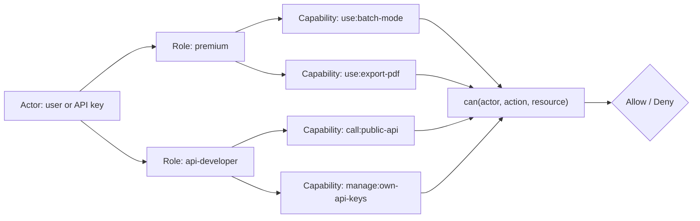
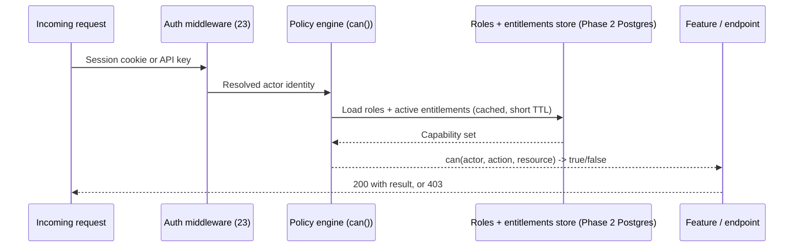

# 24 — Authorization

> **Status:** Draft v1 · **Owner:** CTO / Principal Backend Engineer · **Audience:** Everyone who will gate a feature, a route, or an API endpoint behind "is this allowed?"
> **Governed by:** `00-ENGINEERING-PRINCIPLES.md` and the relevant prior chapters (`03-BUSINESS-MODEL`, `11-BACKEND-ARCHITECTURE`, `13-TOOL-PLUGIN-ARCHITECTURE`, `22-API-STANDARDS`, `23-AUTHENTICATION`).

---

## 1. Why Authorization Is a Distinct Layer From Authentication

`23-AUTHENTICATION` answered "who are you?" This chapter answers a different question: **"now that we know who you are (or that you're nobody), what are you allowed to do?"** These stay separable on purpose, as an architectural rule (`00`, 4.10, Replaceable): a system answering both with one tangled check cannot evolve either without risking the other.

The failure mode we are explicitly designing against looks like this, scattered across a codebase:

```ts
// The anti-pattern this entire chapter exists to prevent
if (user && user.isPremium && !user.isBanned && user.plan !== "trial") {
  showBatchMode();
}
```

This line smashes together four responsibilities — authentication state, plan membership, ban status, a business rule about trials — duplicated, slightly differently, everywhere batch mode is checked. Add a fifth plan tier, a promo grant, or a "batch mode free during launch week," and someone must find and update every one of these `if` statements correctly, everywhere, forever.

**Simple explanation:** the bouncer checking ID at a nightclub door is authentication — "are you who your ID says you are?" A separate person deciding "is this ID holder on tonight's VIP list?" is authorization. If one person did both jobs from memory as the VIP list changed weekly, mistakes multiply. Splitting the jobs — one checks identity, one consults a rulebook — lets the rulebook change without retraining the ID checker.

> **CTO note:** this chapter matters before its Phase-3 activation date because **the shape of the check matters before the feature exists.** If the jwt-decoder ships in Phase 1 with a hardcoded `if (tool.slug === 'jwt-decoder')` anywhere, that's a smaller version of the same anti-pattern, and it metastasizes the same way `isFree` checks do. Ask "should this be a capability check, not an identity check?" now, while every capability check still resolves to `true` for everyone.

---

## 2. Why Full Authorization Activates in Phase 3 — and What We Build Today Instead

Per `03` (R3/R4) and `23` (§2), authorization has nothing real to gate until premium tiers and the metered public API exist. Building a full policy engine, role hierarchy, and entitlement store for zero paying accounts is gold-plating (`00`, Anti-Principles).

| Phase | Authorization state | What exists | Why |
|-------|---------------------|--------------|-----|
| **1 (now)** | No real gating | Every tool is free, anonymous, unlimited (within abuse-level rate limits, `25`) | Nothing to protect yet; the free tier *is* the whole product |
| **2** | Still no user-facing gating | Server-side tool rate limits (`21`, `25`) — a resource-cost control, not an authorization decision | Rate limiting answers "how much," not "who is allowed"; it's a different system |
| **3** | Full authorization (this chapter) activates | RBAC + capability checks, entitlements, resource ownership, admin roles | Premium tiers, API tiers, saved user data, and admin tooling all require real "can this actor do this?" decisions |

What we build **now**, as the seam, is the *shape* of the check — not its implementation. Every place that will eventually need a permission decision is already written as a call to an abstract policy function, even though that function currently has one rule: "anonymous users can do everything a Bronze/Silver/Gold tool (`02`, §5) allows, because there is no premium tier yet." When Phase 3 arrives, we replace the implementation behind that one function — we do not go hunting through the tool plugin folders (`13`) for hardcoded checks, because none were ever written.

**Simple explanation:** it's the difference between wiring a house for a security system before you can afford the monitoring contract, versus deciding to cut the wall open later. We run the wire (the `can()` call sites) through the walls today, at zero monthly cost, so that turning on the alarm service later is a subscription activation, not a renovation.

---

## 3. Capabilities, Not Roles: The Core Decision

The single most important design decision in this chapter: **authorization checks ask "can this actor perform this action on this resource?" — never "does this actor have this role?" or "does this actor have this boolean flag?"**

```ts
// What every check site looks like, in Phase 1 and in Phase 3 alike
if (can(actor, "use", "batch-mode")) {
  enableBatchMode();
}

if (can(actor, "call", "public-api:mortgage-calculator")) {
  return calculate(input);
}
```

The signature never changes. What changes, over time, is only the policy data behind `can()` — which roles/entitlements grant which capabilities. This is `03`'s locked-in instruction made concrete: *"features check a capability (`can('use','batch-mode')`), not a hardcoded `if (isFree)`."*

| Approach | What it hardcodes | What breaks when the business changes |
|----------|--------------------|------------------------------------------|
| `if (user.isPremium)` | A single boolean tier | Adding a mid-tier plan means finding and rewriting every check |
| `if (user.role === 'admin')` scattered per feature | The *role name* itself, everywhere it's used | Renaming a role, splitting one role into two, or granting one admin a narrower scope requires touching every call site |
| `if (can(actor, 'use', 'batch-mode'))` | Nothing — the decision is data, looked up centrally | Adding a plan, a promo grant, or a role split is a **policy data change**, zero call-site changes |

**Simple explanation:** imagine a gym with two ways to run entry. Way one: every door has a sign taped to it saying "Gold members only" — if the gym adds a Platinum tier, someone walks around retaping every door. Way two: every door asks the front desk system "does this card grant access here?" — and the gym only ever updates *the membership rules*, once. The mortgage-calculator's "export to PDF" button and the API's "batch endpoint" both ask the same one question — `can(actor, 'use', 'export-pdf')` and `can(actor, 'call', 'batch-endpoint')` — never a role name baked into the button's code.

> **CTO note:** the honest trade-off is indirection cost. A capability check is one hop further from "just read the boolean" — an engineer skimming the code sees `can(actor, 'use', 'x')` and has to look up what grants `x`, instead of seeing `user.isPremium` and understanding it instantly. I accept that deliberately: the alternative is fast to read today, expensive to change for the next five years of plan restructuring. This is Tier 3 (DX, `00` §5) yielding to Tier 2/1 concerns — a few seconds of lookup time beats a grep-and-replace every time pricing changes, which it will, repeatedly.

---

## 4. Roles as Capability Bundles (RBAC), Not the Source of Truth

Roles still exist — they are the practical, human-manageable layer on top of capabilities, not a replacement for them. A **role is just a named, reusable bundle of capability grants**, so we don't hand-assign forty individual capabilities to every new user.

| Role | Example capability bundle |
|------|----------------------------|
| `anonymous` | `use:*` for every Bronze/Silver/Gold tool marked public; no `save`, no `api-key:create` |
| `free-account` | `anonymous` bundle + `save:history`, `manage:own-profile` |
| `premium` | `free-account` bundle + `use:batch-mode`, `use:export-pdf`, `use:ad-free` |
| `api-developer` | `call:public-api` (scoped to their key's plan tier, `22` §8) + `manage:own-api-keys` |
| `support-staff` | `read:user-account` (for support tickets), explicitly **no** `write:*` |
| `admin` | Platform configuration, tool publishing controls, `read`/`write` on most resources |
| `superadmin` | Everything, including granting/revoking other admins — smallest possible set of holders |

The relationship is: **actor → one or more roles → many capabilities**, resolved once per request into a flat, cached capability set. The policy engine (§6) never asks "what role is this?" at the feature-check call site — only `can()` does that resolution, internally, once.



**Simple explanation:** a role is a keyring, not a single key. Handing someone the "premium" keyring is faster than handing them ten individual keys, but the doors themselves — `use:batch-mode`, `use:export-pdf` — don't care which keyring got you there. Deciding "premium" should also open a new door (a `use:priority-support` capability) means adding one key to the keyring definition; every premium user gets it instantly, with zero code touched at the door itself.

---

## 5. Entitlements: Premium Tiers and API Tiers

An **entitlement** is a capability grant with metadata attached — usually a limit, a time window, or a source. Roles answer "can they at all"; entitlements answer "how much, and why." This is where premium subscriptions and API plan tiers actually live.

| Entitlement example | Grants | Metadata |
|----------------------|--------|----------|
| Premium subscription (active) | Role `premium` | `expiresAt`, `billingSource` (Stripe subscription id) |
| API plan: `pro` | `call:public-api` with quota | `requestsPerMonth: 100000`, `rateLimit: 50/min` (`22`, §8) |
| Promotional grant | Role `premium` for 14 days | `grantedBy: 'launch-promo-2027'`, `expiresAt` |
| White-label tenant seat (R5) | Scoped role within an organization | `organizationId`, `seatRole: 'member' \| 'owner'` |

Entitlements are the layer that changes constantly (a subscription lapses, a promo ends, a plan is upgraded) — which is why they must **not** be baked into the role check itself. `can()` resolves entitlements at read time and treats an expired one as if the grant never existed; no separate cleanup job strips a role from a lapsed user, because the check is always live, never cached past its `expiresAt`.

**Simple explanation:** a gym membership card doesn't stop being a physical card the day payment fails — but the system checked live at the turnstile simply stops saying yes. We never rely on remembering to confiscate the card (deleting a role from a user row); the turnstile always asks the live system. For the mortgage-calculator's "save this scenario" feature, a lapsed premium subscription means `can(actor, 'save', 'scenario')` starts returning `false` the day billing fails — no manual cleanup required.

> **CTO note:** the tempting shortcut is to store `user.plan = 'premium'` as a column and check it directly, skipping the entitlement/expiry layer "because we only have one plan for now." Don't. The day we add an annual-vs-monthly split, a grandfathered price, or a 14-day promo grant, that column can't express any of it, and the fix is a data migration touching every user row instead of an addition to the entitlements table. This is one of the cheaper non-negotiables to build right up front — it costs almost nothing extra on day one of Phase 3 and saves a rewrite in month three.

---

## 6. Policy Centralization — the Single `can()` Authority

There is exactly **one** module in the system that knows how roles, entitlements, and resource ownership combine into an allow/deny decision. Every guard, every UI conditional, every API middleware calls into it — none of them re-implement the logic.

| Layer | How it calls the policy | Never does |
|-------|--------------------------|------------|
| NestJS route (`11`, §4) | `@RequireCapability('use', 'batch-mode')` decorator → guard calls `can()` | Inline role checks inside a controller method |
| Server Component / route handler (`10`) | `await can(actor, 'save', 'scenario')` before rendering the save button | Trusting a client-side flag to decide whether to render it |
| Public API (`22`) | API-key middleware resolves entitlements once per request, attaches a resolved capability set to the request context | Re-querying entitlements per downstream check |
| Admin panel | Same `can()`, different role set (`admin`, `superadmin`) | A separate, parallel "admin permissions" system |



Because this is one module, it is the one place that gets **deep test coverage** (`00`, N7) — every role/entitlement combination against every capability is a table-driven test, not a hope that scattered `if` statements agree with each other.

**Simple explanation:** one rulebook, one referee. The mortgage-calculator's export button, the jwt-decoder's "save token history" feature, and the public API's batch endpoint all ask the same referee the same style of question. We test the referee exhaustively once, instead of testing forty scattered implementations of "roughly the same rule."

---

## 7. Resource Ownership and Multi-Tenancy

Capabilities answer "can this kind of actor do this kind of thing" — they do not, by themselves, answer "does this specific user own *this specific* saved calculation?" That second question is **resource ownership**, a related but distinct check that must run alongside the capability check, never instead of it.

| Check | Question | Example |
|-------|----------|---------|
| Capability | Can a `premium` actor use `save:history` at all? | Yes — the role grants it |
| Ownership | Does *this* actor own *this* saved scenario (`scenarioId: 4821`)? | Only if `scenario.ownerId === actor.id` (or actor belongs to the owning organization) |

Both checks are required together: `can(actor, 'read', scenario)`, where the policy function, given a *resource instance* rather than just a resource type, checks capability **and** ownership as one decision. This prevents "premium user A can read premium user B's saved mortgage scenario" — a bug a capability-only check would never catch, since both users legitimately hold the `read:scenario` capability.

For white-label/API partner tenancy (`03`, R5; `22`, §7), ownership generalizes to **organization membership**: a resource belongs to an `organizationId`, and the check becomes "does the actor's organization membership include this resource's organization, at a seat role that permits this action?" The policy shape is unchanged — the owner is just an organization instead of an individual.

**Simple explanation:** a hotel keycard system is capability-based — every guest's card opens *a* room, that's the capability. But your card only opens *your* room — that's ownership. A hotel checking only "is this a valid keycard," not "which room does *this* card open," would let any guest walk into any room. UToolios applies the same two-part check to every saved scenario, every API key, every organization's white-label dashboard.

---

## 8. Admin Separation and Elevated-Risk Accounts

Admin and staff access is treated as a categorically different risk tier from customer-facing roles, not just "a role with more capabilities."

| Control | Regular user roles | Admin / staff roles |
|---------|----------------------|------------------------|
| MFA | Optional, encouraged (`23`, §7) | **Mandatory, no exceptions** |
| Session lifetime | Standard | Shorter, re-authentication required for sensitive actions |
| Network/UI surface | Public app | Separate admin surface (distinct route namespace or subdomain), never exposed in the public bundle |
| Audit logging | Standard request logs | Every admin action logged with actor, target resource, before/after state, and reason (`28`, `25`) |
| Capability scope | Broad but bounded (a paying customer's own data) | Explicitly least-privilege even within admin — `support-staff` gets `read`, not `write`, unless a specific action requires it |
| Granting other admins | N/A | Restricted to `superadmin`, itself a very small, actively audited set |

**Simple explanation:** every employee at a bank can walk in the front door, but the vault requires a second, separate path, and every opening is logged with who, when, and why — even for employees allowed in. A support engineer troubleshooting a billing issue doesn't get the same blanket "admin" role that edits tool content or issues refunds; they get exactly the `read:user-account` capability the ticket requires, following least privilege (`00`, N1) down to internal tooling, not just the public surface.

> **CTO note:** a common shortcut at small scale is "there's only me, I'll just have one `admin` account for everything." Reasonable for Phase 1/2 — but the policy model must treat this as a *temporary population size*, not a *permanent assumption*. If `admin` is hardcoded as "the founder's account" rather than "a role assignable to any actor, resolved the same way as everyone else," the first hire who needs limited admin access forces a redesign instead of a role assignment.

---

## 9. Enforcement Points — Never Trust the Client

Authorization decisions are made **server-side, every time**, regardless of what the UI shows. Hiding a button is a UX courtesy, never a security boundary.

| Layer | What it does | What it must never do |
|-------|---------------|-------------------------|
| UI (React Server/Client Components, `10`) | Hides/disables controls the actor can't use, for a clean experience | Be the *only* place the check happens |
| API route / NestJS guard (`11`, `22`) | Re-checks `can()` independently of what the client sent | Trust a client-supplied `role` or `plan` field in the request body |
| Edge (Cloudflare, `43`) | Coarse checks only (e.g., a banned IP, a malformed API key format) | Make fine-grained business authorization decisions — too far from the data to resolve entitlements correctly |

**Simple explanation:** a store might grey out an "employee discount" button on self-checkout for a regular customer, but the till's actual price calculation doesn't trust that the button was greyed out — it checks the employee ID independently. If a customer found a way to click a hidden button, the price still wouldn't change.

---

## 10. Testing, Auditing, and Evolving Policy

Because `can()` is the single authority (§6), it is also the single place authorization bugs would live — which makes it the highest-leverage place to invest in tests.

- **Deny by default.** Any actor/action/resource combination not explicitly granted returns `false`. A missing rule is a silent rejection, never a silent allow — the opposite of most accidental security holes.
- **Table-driven tests** enumerate every role × capability × resource-ownership combination that matters, run in CI (`07`), not verified by hand per pull request.
- **Policy changes are reviewed like security changes**, not like feature flags — a new capability grant on the `admin` role gets the same review weight as a new database migration.
- **Every deny is observable** (`28`): a spike in `403`s on a specific capability is either an attack, a broken client, or a botched policy rollout — and it should be visible on a dashboard, not discovered from a user complaint.

**Simple explanation:** we don't wait for someone to accidentally walk through an unlocked door to discover it was unlocked. We write down every door and every keyholder in a table, and a test suite tries every combination automatically whenever the rulebook changes — the way a bank re-verifies its entire vault access list after a policy change, rather than trusting nobody notices a mistake.

> Next: `25-SECURITY.md` — the platform-wide security model (rate limiting, secrets, headers, WAF) that authentication and authorization both sit inside.

---

## Summary

- **Authorization is a distinct layer from authentication** (`23`) — "who are you" and "what can you do" stay separable so either can evolve without touching the other.
- **Authorization is fully deferred to Phase 3** (nothing exists to gate yet), but every check site is written today as `can(actor, action, resource)` — the seam is built now, the policy data behind it arrives later.
- **Capability-based checks (`can('use','batch-mode')`) replace hardcoded role/boolean checks (`isFree`, `isPremium`)** everywhere — a locked-in rule from `03`, made concrete here — because it turns pricing/plan changes into data edits, not code hunts.
- **Roles are named bundles of capabilities**, not the source of truth themselves — they exist for human-manageable assignment, resolved into a flat capability set by the policy engine.
- **Entitlements** (premium subscriptions, API plan tiers, promo grants) carry the metadata — limits, expiry, source — that makes a capability grant temporary and live-checked, never a static column that drifts out of sync.
- **One centralized `can()` policy engine** is the sole authority every guard, UI conditional, and API middleware calls — never re-implemented per feature.
- **Resource ownership** (and its generalization, organization/tenancy membership for white-label R5) is checked alongside capability, not instead of it, to stop "right role, wrong resource" bugs.
- **Admin and staff access is a separate risk tier**: mandatory MFA, a distinct surface, full audit logging, and least-privilege scoping even within "admin," so the model scales past a solo founder without a redesign.
- **Authorization is always enforced server-side**; hiding a UI control is courtesy, never the security boundary.
- **Deny-by-default, table-driven tests, and observable denies** keep policy correctness machine-verified, not memory-dependent (`00`, 4.10).

---

### Changelog
| Version | Date | Change | Reason |
|---------|------|--------|--------|
| v1 | (draft) | Initial authorization architecture | Project inception |
