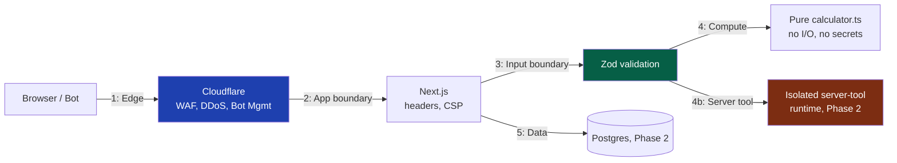
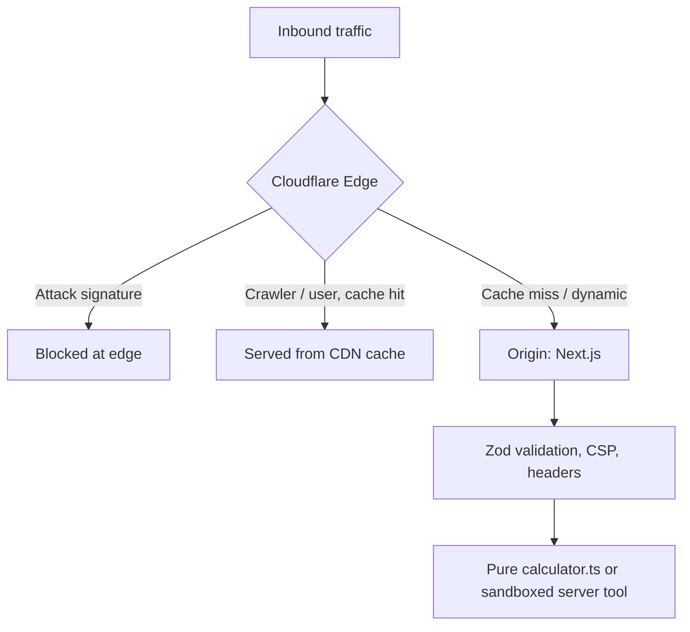

# 25 — Security

> **Status:** Draft v1 · **Owner:** CTO / Principal Security Engineer · **Audience:** Everyone who writes a line of code, a CI job, or a Cloudflare rule
> **Governed by:** `00-ENGINEERING-PRINCIPLES.md` and the relevant prior chapters (`04-ARCHITECTURE-OVERVIEW`, `11-BACKEND-ARCHITECTURE`, `13-TOOL-PLUGIN-ARCHITECTURE`, `22-API-STANDARDS`, `23-AUTHENTICATION`, `24-AUTHORIZATION`).

---

## 1. Security by Default, Not by Memory

UToolios's security model rests on one premise: **security cannot depend on a human remembering to do the right thing on tool #847.** With one solo founder shipping tools daily, and AI generating a growing share of them, any control that lives only in a developer's head or a review checklist eventually gets skipped — not from carelessness, but from volume. So every control here is enforced **structurally**: by the framework, by CI, by the platform engine, or by Cloudflare, never by convention alone.

This mirrors `00`'s Tier-1 quality floor and `08`'s type-safety discipline: push the decision as early and as automatic as possible. A plugin author writing `calculator.ts` for a new BMI variant shouldn't need to think about CSRF, CSP, or SQL injection — the platform engine, not the plugin, owns those. The plugin contract (`13`) enforces the *shape* of a tool; this chapter enforces the *safety* of the platform running every tool.

**Simple explanation:** a good commercial kitchen doesn't rely on every new cook remembering food-safety rules from a poster — it builds safety into the equipment: the fryer auto-shuts-off, raw and cooked stations are physically separated. UToolios builds security into the platform the same way, so an unsafe `calculator.ts` from a new tool simply can't burn the building down, no matter how many recipes ship per day.

> **CTO note:** "we'll do a security pass before launch" is a trap here — there is no single launch, there are 1,000+ tiny launches, shipped continuously and increasingly by AI-assisted generation. A review done once at a fixed point is stale the next day. The only model that scales is security as a **CI gate and a platform guarantee**, checked on every commit, not a periodic audit.

---

## 2. Threat Modeling — Assets, Adversaries, Trust Boundaries

| Asset | Why it matters | Primary adversary |
|-------|-----------------|--------------------|
| Visitor trust / SEO standing | One visible compromise (redirect, defacement) damages both search trust and ad-network standing (`19`) | Opportunistic attackers, spam injectors |
| Ad revenue integrity | Business model depends on legitimate impressions (`03`, `19`) | Click-fraud bots, ad injection |
| User-submitted data (a JWT pasted into `jwt-decoder`, a rate into `mortgage-calculator`) | Sensitive input, even with no accounts | Network eavesdroppers, malicious extensions |
| Server-side tool compute (OCR, PDF, image, Phase 2) | Real metered cost per request | Abuse bots amplifying the AWS bill |
| Origin infrastructure | Servers, DB (Phase 2+), secrets | Credential thieves, supply-chain attackers |
| Public API (Phase 3) | Per-developer quotas, billing correctness (`22`) | Credential stuffing, key theft |

The key modeling insight: **most tools never cross boundary 4b or 5 at all.** A pure client-side calculator's whole trust boundary is "did the browser run untampered JavaScript" — there is no server compute to abuse and no database row to leak, because neither exists.

**Simple explanation:** a threat model is a floor plan with the doors marked. Most rooms (`bmi-calculator`, `tile-calculator`, `percentage-calculator`) have one door — the browser tab — and it locks itself. A few rooms with expensive machinery (an OCR tool running real server compute) get a reinforced second door with its own alarm, because that's the room a burglar could actually cost us money in.

---

## 3. Client-Side Tools as an Attack-Surface Reduction Strategy

This is the single most important security decision in the platform, and it flows directly from `13`: the overwhelming majority of tools are pure, client-side, framework-free functions with no server round-trip for their computation.

| Property | Client-side tool (`mortgage-calculator`, `jwt-decoder`) | Server-side tool (`pdf-ocr`, `image-compress`) |
|----------|------------------------------------------------------------|---------------------------------------------------|
| Where computation runs | User's browser | Our servers |
| Attack surface on our infra | None | Real: CPU/memory exhaustion possible |
| Data sent to our servers | None — input never leaves the browser | Yes, the payload itself |
| Rate limiting required | No | Yes, mandatory (`§8`) |
| Must be sandboxed | No | Yes (`13`) |

A user pasting a secret token into `jwt-decoder` decodes it **entirely in browser memory** — the value never touches our network, logs, or database. This is a deliberate security posture, not an incidental performance win (`20`): data we never receive cannot be breached, logged, or subpoenaed from us.

**Simple explanation:** it's the difference between doing arithmetic on your own kitchen counter versus mailing your receipt to a stranger to add up. `mortgage-calculator` computes on the visitor's own counter — we never see the loan amount, so there's nothing on our servers for an attacker to steal.

> **CTO note:** security spend should be radically asymmetric. Applying the same paranoia — WAF tuning, rate-limit budgets, sandbox effort — uniformly across 1,000 tools is wasted when 950 of them have near-zero server attack surface. Concentrate hardening on the `serverSide: true` minority (`13`); don't dilute attention pretending every folder is equally dangerous.

---

## 4. HTTP Security Headers, Locked at the Platform Layer

Every response — every one of the potential millions of indexed pages — carries the same header set, set once in middleware, never per route.

| Header | Value | Purpose |
|--------|-------|---------|
| `Content-Security-Policy` | Strict, nonce-based; `default-src 'self'`; no `unsafe-inline`/`unsafe-eval`; explicit allowlist for ad/analytics origins | Blocks XSS execution even if injection occurs |
| `Strict-Transport-Security` | `max-age=63072000; includeSubDomains; preload` | Forces HTTPS, submitted to the HSTS preload list |
| `X-Content-Type-Options` | `nosniff` | Stops MIME-sniffing into script execution |
| `X-Frame-Options` / `frame-ancestors` | `DENY` | Prevents clickjacking |
| `Referrer-Policy` | `strict-origin-when-cross-origin` | Limits referrer leakage |
| `Permissions-Policy` | Deny by default, opt in per tool | Shrinks the browser API surface for injected scripts |
| `Cross-Origin-Opener-Policy` | `same-origin` | Isolates the tab from cross-origin attacks |

The CSP allowlist for third-party script origins is generated from the same **AdSlot abstraction** (`19`) used to swap ad networks — one source of truth, not a hand-edited list per network migration.

**Simple explanation:** CSP is a guest list at the door. Even if a troublemaker (an XSS payload) sneaks in a side door, the inner room (script execution) still checks IDs — the troublemaker is inside the building but can't reach the room where damage happens.

> **CTO note:** a strict CSP is harder to wire with vendor snippets that assume inline `<script>` tags. Adding `unsafe-inline` "just for now" under launch pressure blocks almost nothing — it's security theater that still scores green on an automated header check while providing near-zero real protection. If a vendor can't work under a strict policy, demand a nonce-compatible integration; don't weaken the policy.

---

## 5. Input Validation and Output Escaping — the Zod Boundary

Every piece of data crossing a trust boundary (§2) is validated with **Zod**, per `08`'s "any is banned, validate at the edge" rule.

| Boundary | Validated with | Failure mode if skipped |
|----------|-----------------|---------------------------|
| Tool form input → `calculator.ts` | Zod schema in `schema.ts` (`13`) | Malformed input crashes or misbehaves in the pure function |
| API request body/query (Phase 3) | Zod on the controller boundary | Injection, type confusion reach business logic |
| Webhook payloads (Phase 2/3) | Zod schema + signature verification | Forged events processed as legitimate |
| User strings rendered to the DOM | React's default escaping; `dangerouslySetInnerHTML` banned outside a reviewed markdown pipeline | Stored/reflected XSS |

Output escaping is mostly free with React. The one place raw-ish content renders is `article.md`/`faq.md` bodies (`13`, `14`) — founder- or AI-authored long-form SEO content — sanitized through a strict tag/attribute allowlist, and never fed from visitor input.

**Simple explanation:** validating at the boundary is a bouncer checking IDs at the door, not trusting whoever's already at the bar. Each tool's `schema.ts` checks that `jwt-decoder`'s input actually looks like a JWT-shaped string before the pure decode function touches it, so a hostile string fails cleanly at the door.

---

## 6. Injection Defense — Parameterized Queries, Never String-Built SQL

This activates fully in Phase 2 (`12`) with Postgres/Prisma, but the rule is fixed now so it's never violated on day one.

- **Prisma is the only DB access path**; it parameterizes by construction — string-concatenated SQL is banned; the rare `$queryRaw` requires tagged-template parameterization, never interpolation, plus a mandatory review flag.
- The same discipline covers any shell-out, path construction, or template rendering: **user input is never concatenated into a command, path, or query** — always passed as a parameter to an API built for untrusted values.
- Server-side tools touching the filesystem treat filenames as hostile: sanitized, randomly generated internal names, never the user-supplied name used directly on disk.

**Simple explanation:** a parameterized query is a filled-out library request slip, not a shouted sentence hoping the librarian parses it right. "Find the book titled ___" with the blank as *data* means a mischievous title like "; delete all books;" is just a weird title to search for, not an instruction.

---

## 7. CSRF Protection

CSRF matters wherever a cookie-authenticated session can trigger a state change — activating meaningfully in Phase 3 (accounts, premium actions) and partially in Phase 2 (abuse-signal cookies).

| Control | Detail |
|---------|--------|
| `SameSite=Lax`/`Strict` on all session cookies | Blocks the cookie on most cross-site requests by default (`23`) |
| CSRF token (double-submit / synchronizer) on `POST`/`PUT`/`DELETE` | Defense-in-depth beyond `SameSite`, since attribute support varies |
| Origin/Referer check on mutating requests | Cheap extra signal against cross-origin mutation |
| No state change ever on a plain `GET` | Removes link-based/image-tag CSRF entirely |

Phase 1 has nothing to CSRF — no sessions, no mutating endpoints. Listed now so the pattern is built into request handling before the first mutating endpoint exists, not patched on after.

**Simple explanation:** CSRF is a forged instruction riding on a victim's own login — like mailing a bank a pre-signed withdrawal slip, hoping it doesn't check you actually asked for it. `SameSite` cookies plus a CSRF token are the bank calling back to confirm.

---

## 8. Rate Limiting and Abuse Prevention

Rate limiting is the primary economic defense for the "danger zone" in `03`/`13`: server-side tools that cost real money per request.

| Layer | Mechanism | Scope |
|-------|-----------|-------|
| Edge (Cloudflare) | Rate-limiting rules, per-IP/ASN thresholds, bot-score-aware throttling | First line, before traffic reaches origin |
| Application (Phase 2) | Redis-backed token bucket per session/IP-hash, scoped per `serverSide: true` tool | Precise per-tool cost control |
| Public API (Phase 3) | Per-key quota/burst limits (`22`) | Billing-aligned, returns `429` + `Retry-After` |

Every limit response is a clean, documented `429` — never a silent drop — so a legitimate power user gets a clear signal, not a mystery failure.

**Simple explanation:** rate limiting is "one ticket per person per hour" at an expensive ride. `percentage-calculator` needs no ticket booth — free, self-serve, no per-use cost. An OCR tool is the expensive ride: real cost per run, so it gets a booth, a queue, and a cap.

> **CTO note:** rate limiting server-side tools isn't optional hardening — it's the line item keeping `03`'s cost model true. Without it, one scripted abuser hammering an OCR endpoint turns a "cost-modeled" tool into a five-figure surprise bill in a weekend. Threat-model the bill, not just the data.

---

## 9. Secrets, Dependency and Container Scanning

| Concern | Control |
|---------|---------|
| Secrets storage | Managed secrets store (AWS Secrets Manager / SSM), injected as env vars at runtime — never committed, never hardcoded |
| Secret leakage | Pre-commit + CI secret-scanning blocks a matching credential before it enters history |
| Scoping | Secrets scoped per environment/service — a leaked staging key never grants production access |
| Rotation | Scheduled, low-friction by design, so a suspected leak is an hours-long fix |
| Log redaction | Fields named `token`/`secret`/`password`/`key` redacted by default in logging middleware (`28`), not by a manual checklist |
| npm/pnpm dependencies | Automated advisory scanning on every PR and a daily scheduled scan; lockfile committed and verified in CI (`07`) |
| Container images (Phase 2) | Image CVE scanning on every build, blocking on critical/high severity |
| SBOM | Generated per release for fast "are we affected by CVE-X" answers |

CI treats a critical/high vulnerability in a production dependency as a **build-blocking failure**, per `00`'s "quality is machine-enforced" principle — not a message someone might read next week.

**Simple explanation:** secrets management is a landlord-managed key safe with an audit log, not a key taped under the doormat. Dependencies are ingredients bought from a supplier — every delivery is scanned for contamination before it reaches the kitchen, and an SBOM is the receipt showing exactly which batch went into which dish.

---

## 10. Cloudflare and Least Privilege — the Outer Wall and the Inner Doors

Per `04`, Cloudflare sits in front of everything as the first, cheapest layer of defense.

| Capability | Defends against |
|------------|-------------------|
| WAF (managed rulesets) | Known injection/exploit patterns, blocked before reaching the app |
| DDoS protection | Volumetric and application-layer floods absorbed at the edge |
| Bot Management | Distinguishes scrapers/credential-stuffing bots from real visitors and legitimate crawlers (we want Googlebot, not a scraper cloning tool pages) |
| Edge rate limiting | Throttling before any origin compute is spent (§8) |
| CDN caching (R2) | A cached static tool page is a page an attack never reaches app code for |

Least privilege applies inside that wall to every credential and role: per-service IAM roles rather than one shared "app" credential, CI/CD tokens scoped to exactly what they need, database roles (Phase 2) limited to the CRUD they perform, third-party keys scoped to read/write only what's required, and human production access as a rare, logged, time-boxed exception rather than a standing credential.

**Simple explanation:** Cloudflare is the security checkpoint around the whole property — most visitors and crawlers never reach the building at all, served a cached copy straight from the fence line. Least privilege is giving the cleaning crew a key to the lobby and offices they clean, not a master key that also opens the vault — if that key is lost, the blast radius is the lobby, not the building.

> **CTO note:** it's tempting to lean on Cloudflare so heavily that origin defenses atrophy — "the WAF will catch it." Don't. A common real failure mode is someone finding the origin IP and hitting it directly, skipping Cloudflare entirely. Origin infrastructure must be independently secure, with every layer in §3–§9 holding on its own; Cloudflare is a strong first filter, not a substitute for defense in depth.

---

## Summary

- Security is **structurally enforced** (framework, CI, edge), not left to memory — necessary at 1,000+ AI-assisted tool launches by a solo founder.
- Threat modeling separates **client-side tools** (near-zero server attack surface and cost) from the **server-side minority** (`serverSide: true`), concentrating hardening effort accordingly.
- **Client-side computation is a deliberate security posture**: data we never receive cannot be breached, logged, or leaked.
- **Strict, nonce-based CSP** plus a full security-header set ships on every response, generated from the same AdSlot source of truth used for ad-network swapping (`19`).
- **Zod validation at every trust boundary** plus React's default escaping cover input/output safety; the one raw-content path goes through a sanitizing markdown pipeline.
- **Prisma-only, parameterized queries** ban string-built SQL and command/path injection from Phase 2 (`12`) onward.
- **CSRF defenses** (`SameSite` + tokens + Origin checks) are designed now, activated with the first mutating endpoint (`23`).
- **Rate limiting** at edge, app, and API-key layers protects the server-side cost model (`03`), not just the data.
- **Secrets, dependencies, and containers** are scanned and scoped structurally; CI blocks builds on critical/high CVEs.
- **Cloudflare (WAF, DDoS, bot management, edge limiting, CDN caching)** is the outer wall; origin-level defenses hold independently — defense in depth, not a single point of trust.
- **Least privilege** applies to every credential, IAM role, and human access path — no shared "god" credentials anywhere.

> Next: `26-COMPLIANCE-AND-PRIVACY.md` — GDPR/CCPA, cookie consent, data retention, and how an ad-funded, global-traffic platform stays compliant tool by tool.

---

### Changelog
| Version | Date | Change | Reason |
|---------|------|--------|--------|
| v1 | (draft) | Initial security architecture | Project inception |
