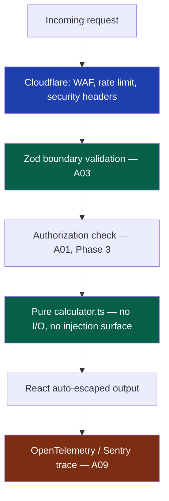

# 26 — OWASP Compliance

> **Status:** Draft v1 · **Owner:** CTO / Principal Security Engineer · **Audience:** Every engineer who ships a tool, an API route, or a CI check
> **Governed by:** `00-ENGINEERING-PRINCIPLES.md` and the relevant prior chapters (`08-CODING-STANDARDS`, `11-BACKEND-ARCHITECTURE`, `12-DATABASE-ARCHITECTURE`, `13-TOOL-PLUGIN-ARCHITECTURE`, `22-API-STANDARDS`, `23-AUTHENTICATION`, `25-SECURITY`).

---

## 1. Why This Chapter Exists

`25-SECURITY` defines UToolios's general security posture — the WAF, secrets management, rate limiting, and the `serverSide: true` danger-zone gate for expensive tools. This chapter is narrower and more mechanical: it takes the **OWASP Top 10 (2021)**, the industry's canonical list of web application risks, and maps every single item to a concrete, named control already implied by our locked-in architecture. Where a control doesn't exist yet, this chapter says so explicitly and states which phase activates it.

The reason this deserves its own chapter rather than a paragraph in `25` is auditability. A solo founder, an AI-assisted contributor, or a future auditor should be able to open one document and answer "where do we handle SQL injection?" without reconstructing the answer from five other chapters. OWASP compliance is not a badge bolted on before an enterprise sales call (though it will help there, `03`) — it is a **checklist we run against ourselves continuously**, enforced in CI (`40`) wherever mechanically detectable, and reviewed by hand where it isn't.

**Simple explanation:** think of the OWASP Top 10 as a fire marshal's standard inspection checklist for buildings — blocked exits, faulty wiring, missing extinguishers. Most of those checklist items are things a well-built building already satisfies by design (wide-enough doors, code-compliant wiring), not something bolted on the week before the inspection. This chapter is us walking our own building against that checklist, room by room, and writing down exactly which wall, pipe, or sensor satisfies each line — for the mortgage-calculator's form inputs as much as for the future JWT-decoder API endpoint.

> **CTO note:** the OWASP Top 10 is written for the median web application — one with a database, a login form, and server-rendered pages full of user-controlled state. In Phase 1, UToolios has none of that: no accounts, no database, mostly pure client-side calculators. Half the Top 10 (A01 Broken Access Control, A07 Auth Failures, much of A02 Cryptographic Failures) is close to *inapplicable today* because there is nothing to authorize or authenticate. That is not a reason to skip this chapter — it is exactly why we write the target design now while the pressure is low, so the muscle already exists the day Phase 3 turns auth and billing on. Compliance theater performed only for an enterprise RFP, with no real controls behind it, is worse than no compliance chapter at all.

---

## 2. OWASP ASVS — Level Selection

The **OWASP Application Security Verification Standard (ASVS)** is the detailed, testable companion to the Top 10 — hundreds of specific requirements grouped into three levels of assurance. We pick a target level deliberately rather than aiming vaguely at "OWASP compliant."

| Level | Meaning | Typical target | Our stance |
|-------|---------|-----------------|------------|
| **L1** | Opportunistic — defends against the most common, automatable attacks | Every public-facing web app, no exceptions | **Target for all of Phase 1**, fully enforced |
| **L2** | Standard — defends against a motivated, moderately-resourced attacker; covers most business logic and data-handling requirements | Apps handling meaningful user data, accounts, or payments | **Target from Phase 2/3 onward**, once accounts, premium billing, and the public API exist |
| **L3** | Advanced — defends against a well-resourced, dedicated attacker (nation-state-grade); military, medical, critical-financial-infrastructure tier | Apps where a breach is catastrophic beyond brand damage | **Not targeted.** Disproportionate to our risk profile; revisit only if a specific enterprise/white-label contract (R5, `03`) contractually requires specific L3 controls, and scope those narrowly rather than adopting L3 platform-wide |

**Simple explanation:** ASVS levels are fire-code tiers for different building types. L1 is the code every office building must meet — smoke detectors, marked exits. L2 is the stricter code for a building holding valuables — a bank branch, with a vault and cameras. L3 is the code for a nuclear facility. We're building an office park of small free tools today, heading toward a vault (premium accounts, billing) in Phase 3 — nuclear-facility-grade controls for a mortgage calculator would waste effort that should go into shipping tools.

The relevant ASVS chapters map onto existing docs, so "targeting L1/L2" isn't abstract:

| ASVS chapter | Where it lives in UToolios |
|--------------|------------------------------|
| V1 Architecture, Design, Threat Modeling | `04-ARCHITECTURE-OVERVIEW`, this chapter |
| V2 Authentication, V3 Session Management | `23-AUTHENTICATION` (Phase 3) |
| V4 Access Control | `24-AUTHORIZATION` (Phase 3) |
| V5 Validation, Sanitization, Encoding | `08-CODING-STANDARDS` (Zod boundary, §3 below) |
| V7 Error Handling and Logging | `25-SECURITY`, `28-OBSERVABILITY` |
| V8 Data Protection | `12-DATABASE-ARCHITECTURE`, `25-SECURITY` |
| V9 Communications | `25-SECURITY` (TLS, HSTS) |
| V12 File and Resources | §7 below (server-side tool danger zone) |
| V13 API and Web Service | `22-API-STANDARDS` |
| V14 Configuration | `07-DEVELOPMENT-WORKFLOW`, `40-CI-CD` |

---

## 3. OWASP Top 10 (2021) — Full Map at a Glance

| # | Risk | Primary UToolios exposure | Primary control | Activates |
|---|------|---------------------------|-------------------|-----------|
| A01 | Broken Access Control | Premium content, API keys, admin tools | Authorization layer (`24`), scoped API keys (`22`) | Phase 3 |
| A02 | Cryptographic Failures | Password storage, data in transit/at rest | argon2id (`23`), TLS everywhere, encrypted secrets (`25`) | Now (transit) / Phase 3 (at rest) |
| A03 | Injection | Zod-validated inputs, no raw SQL, no `eval` | Zod at every boundary (`08`), Prisma parameterized queries (`12`) | Now |
| A04 | Insecure Design | Server-side tool cost/abuse blowup | `serverSide: true` gate, threat modeling per tool category (§7, `25`) | Now |
| A05 | Security Misconfiguration | Default framework configs, verbose errors, open CORS | Hardened Next.js/Cloudflare config, CSP, no stack traces to clients (§6) | Now |
| A06 | Vulnerable and Outdated Components | 1,000+ tools, many dependencies | Automated dependency scanning in CI (§6, `40`) | Now |
| A07 | Identification and Authentication Failures | Login, sessions, MFA | Full auth design (`23`) | Phase 3 |
| A08 | Software and Data Integrity Failures | Supply-chain, CI/CD pipeline, unsigned artifacts | Lockfiles, signed commits/releases, SRI for any third-party script (§5) | Now |
| A09 | Security Logging and Monitoring Failures | Silent breaches, undetected abuse | OpenTelemetry/Sentry (`28`), alerting on anomalies (`25`) | Phase 2 |
| A10 | Server-Side Request Forgery (SSRF) | Any tool that fetches a caller-supplied URL (PDF/image tools) | No user-supplied fetch targets; strict allow-lists if ever needed (§7) | Now (as a design constraint) |

**Simple explanation:** this table is the whole inspection report on one page — every checklist item from the fire marshal, one line each, with the exact fix and which stage of construction it belongs to. Some items (A03 Injection, A05 Misconfiguration) matter on day one because we're already writing code and shipping a public site. Others (A01, A07) genuinely don't apply yet because the "room" they protect — the accounts system — hasn't been built.

---

## 4. Broken Access Control (A01) and Authentication Failures (A07)

Today, UToolios has no user-specific state to protect — every visitor gets the identical mortgage-calculator, the identical jwt-decoder. There is, quite literally, nothing to "break into." That changes the moment Phase 3 introduces premium tiers and the metered public API.

| Control | Detail | Phase |
|---------|--------|-------|
| Deny-by-default authorization | Every protected resource requires an explicit grant; nothing is "public by omission" | Phase 3, per `24` |
| Object-level checks | A logged-in user can only read/modify *their own* saved calculations, never another user's by guessing an ID | Phase 3 |
| Scoped API keys | A key grants exactly the scopes it was issued (read, calculate, write), never blanket admin | Phase 3, per `22` §8 |
| Session integrity | httpOnly, Secure, SameSite cookies; instant server-side revocation | Phase 3, per `23` §3, §8 |
| Admin surface isolation | Internal/admin tooling lives on a separate, more tightly access-controlled surface, never a hidden route on the public app | Phase 2+ |

**Simple explanation:** broken access control is a hotel where Room 204's key card also happens to open Room 205 because nobody tested it. We prevent this by never trusting "the request looks like it came from the right person" — every sensitive read/write re-checks, server-side, that the requester actually owns the resource, the way a real hotel re-swipes your key at every door rather than assuming the elevator ride proves you belong on that floor.

> **CTO note:** the most common real-world A01 isn't a clever attack — it's an engineer forgetting one `WHERE userId = ?` clause, or trusting a client-supplied ID without re-validating ownership server-side. This is why `24-AUTHORIZATION` mandates a single, centralized authorization layer rather than scattered per-route `if` checks (`00`, 4.10 Replaceable): a missing check becomes a code-review-catchable pattern violation in one module, not a needle in a thousand hand-rolled handlers.

---

## 5. Injection (A03) and Software/Data Integrity Failures (A08)

Injection is where UToolios's architecture already does most of the work for us, by construction rather than by vigilance.

- **No raw SQL, ever.** Prisma's parameterized query builder is the only database access path (`12`); string-concatenated queries are not a pattern that exists in the codebase to begin with.
- **Zod at every boundary.** Every tool's `schema.ts` validates input *before* it reaches `calculator.ts` — untyped, unvalidated `unknown` never touches business logic (`08`, `13` §3). A calculator that receives a string where it expects a number fails validation, not silently coerces and computes garbage.
- **No `eval`, no dynamic `Function()` construction**, banned by ESLint rule, no exceptions for "just this one dynamic formula tool."
- **Output encoding by framework default.** React/Next.js escapes rendered output automatically; `dangerouslySetInnerHTML` is banned outside of a narrow, reviewed allow-list (sanitized article/FAQ markdown, `17`).

Software/data integrity (A08) is about trusting the *build and supply chain*, not just runtime input:

| Control | Detail |
|---------|--------|
| Lockfiles committed and enforced | `pnpm-lock.yaml` is the source of truth; CI fails on lockfile drift (`40`) |
| No unpinned `curl \| sh` in CI or Dockerfiles | Every install step is version-pinned |
| Third-party scripts (ad tags, analytics) | Loaded with Subresource Integrity (SRI) where the vendor supports it; sandboxed/deferred otherwise (`19`, `25`) |
| CI pipeline itself | Runs on pinned action versions (`uses: actions/checkout@<sha>`, not `@main`) — an unpinned Action is a supply-chain hole into every build |

**Simple explanation:** the jwt-decoder tool takes a string of arbitrary user-pasted text and parses it. The injection risk isn't SQL (there's no database call in that path) — it's trusting that string to be well-formed. `schema.ts` rejects malformed input before the parser sees it, and decoded claims render through React's auto-escaping, so a token engineered to contain `<script>` in a claim value displays as inert text, never executes. The defense isn't a JWT-decoder-specific filter — it's the same Zod-boundary-plus-React-escaping pattern every one of the thousand tools gets for free.

---

## 6. Security Misconfiguration (A05) and Vulnerable Components (A06)

Misconfiguration is the risk category most likely to bite a solo-founder project, because it's rarely a bug in *our* code — it's a default left un-hardened in someone else's.

| Control | Detail |
|---------|--------|
| Content-Security-Policy | Strict CSP with a nonce/allow-list per script source, no `unsafe-inline` by default; ad-network exceptions scoped narrowly (`19`, `25`) |
| Security headers | `X-Content-Type-Options: nosniff`, `X-Frame-Options`/frame-ancestors, `Strict-Transport-Security`, `Referrer-Policy` — set once at the Cloudflare/edge layer, not per-route |
| No verbose errors to clients | Stack traces and internal error detail never leave the server; the API envelope's `error.message` is always a safe, generic string (`22` §3) |
| CORS | Explicit allow-list of origins for the public API; never `Access-Control-Allow-Origin: *` on anything that isn't a genuinely public, unauthenticated read |
| Dependency scanning | Automated (Dependabot/Renovate + `npm audit`/`pnpm audit` or Snyk) running in CI on every PR and on a schedule (§9) |
| Framework defaults reviewed, not assumed | Next.js/NestJS default configs are read and deliberately set, not shipped as-is (a default that's fine for a demo isn't automatically fine at 2–5M monthly visitors) |

**Simple explanation:** misconfiguration is a new office building whose keycard system ships with a default master password nobody changed — not a flaw in the keycard system, a step skipped during move-in. Every framework default, CDN setting, and dependency version is something we deliberately reviewed and set, not something accepted because it worked in a tutorial.

> **CTO note:** a strict "block the PR on any known vulnerability" policy sounds rigorous but will, at 1,000+ tools with a wide dependency tree, generate constant low-severity noise (a dev-only package with a theoretical, unreachable vuln) that trains engineers to click through alerts unread. We gate CI on **high/critical severity in production dependencies only**, routing medium/low findings to a weekly triage queue instead — a policy that keeps the high-signal alerts actually read.

---

## 7. Server-Side Request Forgery (A10) — The Danger Zone's Sharpest Edge

SSRF deserves its own section because it intersects directly with `25`'s "danger zone" tools — anything `serverSide: true` that processes files (image conversion, PDF merging, OCR). The classic SSRF attack: a tool accepts a URL from the user ("fetch this image and convert it"), and the server fetches it — including URLs pointing at internal infrastructure (`http://169.254.169.254/...` cloud metadata endpoints, internal admin panels, other services on the private network) that the *user* could never reach directly, but our *server* can.

| Rule | Why |
|------|-----|
| **Default policy: no tool accepts a server-fetched, user-supplied URL.** Every server-side tool takes a direct file upload, never a "fetch this URL for me" parameter. | Eliminates the entire risk class by design rather than mitigating it — the strongest possible control |
| If a future tool genuinely needs URL-fetching (e.g., "import from a link") | Requires: a strict allow-list of permitted domains, DNS resolution re-checked against a private-IP-range denylist *after* redirect-following (not just the initial hostname), and a short timeout with no retries | Reviewed and approved per-tool, not a platform-wide default |
| Outbound requests from server-side tools run in a network-restricted sandbox | Even a bypassed application-level check can't reach internal infrastructure if the sandbox's network egress is restricted (`25`) | Phase 2, when server-side tools launch |

**Simple explanation:** imagine a photocopier at the front desk that will copy any document you hand it — but a clever visitor instead hands it a note saying "go copy whatever's in the manager's locked filing cabinet, then hand it to me." A well-run front desk never lets the copier fetch anything on its own initiative; it only copies what's physically handed over. Our server-side tools work the same way: they process what you upload directly. None of them are designed to "go fetch something" on your behalf from an address you supply — closing off the entire SSRF attack path rather than trying to carefully police which addresses are safe to fetch.

> **CTO note:** the tempting counter-argument is "but a 'convert an image from a URL' feature is genuinely useful and users will ask for it." That's true, and it's exactly the kind of feature request that should trigger a deliberate threat-modeling review (`25`) before it ships, not a quick addition to an existing image tool. The cost-benefit here is stark: the feature saves a user one upload click; a mishandled version of it can expose internal AWS metadata credentials. Given the economics (`03`, §9 — server-side tools already carry real compute cost), the default answer to "can we add URL-fetching" should be no until a specific tool's business case clears a specific security review, not an engineering convenience granted by default.

---

## 8. Compliance Checklist

A living checklist, reviewed at each phase gate (`04` §7) and whenever a new tool category is added:

| # | Item | Phase | Status source |
|---|------|-------|----------------|
| 1 | All inputs validated with Zod at the boundary, no `unknown`/`any` reaching business logic | Now | ESLint + CI (`08`, `40`) |
| 2 | No raw SQL string concatenation anywhere in the codebase | Now | Prisma-only DB access rule, code review (`12`) |
| 3 | CSP, HSTS, `X-Content-Type-Options`, `X-Frame-Options` set at the edge | Now | Cloudflare config, header audit in CI |
| 4 | Dependency scan runs on every PR; high/critical vulns block merge | Now | CI job (`40`) |
| 5 | No server-side tool accepts a caller-supplied fetch URL | Now | Architecture review, `13` plugin contract linting |
| 6 | No stack traces or internal errors returned to any client | Now | API envelope contract test (`22`) |
| 7 | Secrets never committed to git; all secrets in a managed secrets store | Now | Pre-commit secret scanner + CI scan (`25`, `40`) |
| 8 | Passwords hashed with argon2id; no plaintext password ever logged | Phase 3 | `23` §4 |
| 9 | Sessions are httpOnly/Secure/SameSite cookies with rotating refresh tokens | Phase 3 | `23` §3, §8 |
| 10 | Authorization checks centralized, deny-by-default, object-level ownership verified | Phase 3 | `24` |
| 11 | API keys hashed at rest, scoped, prefixed, rotate self-service | Phase 3 | `22` §8 |
| 12 | Rate limiting + metering both live before the public API ships | Phase 3 | `22` §7 |
| 13 | Structured logging with anomaly alerting (failed logins, abuse spikes) | Phase 2/3 | `25`, `28` |
| 14 | Threat model reviewed for every new `serverSide: true` tool category before launch | Phase 2 | `25` |
| 15 | ASVS L1 requirements re-verified quarterly; L2 requirements verified before each Phase 2/3 feature ships | Ongoing | Manual + CI where automatable |

---

## 9. CI Enforcement — What's Machine-Gated Today

Consistent with `00` (4.5, Automation First) and `08`, this chapter is only credible if its most important lines are enforced by CI (`40`), not memory.

| Check | Tool | Blocks merge? |
|-------|------|----------------|
| `any` banned, no dynamic `eval`/`Function` | ESLint (custom rule set) | Yes |
| TypeScript strict mode | `tsc --noEmit` | Yes |
| Dependency vulnerabilities (high/critical) | `pnpm audit` / Dependabot / Snyk | Yes |
| Secret scanning (API keys, tokens accidentally committed) | Pre-commit hook + CI secret scanner | Yes |
| Security headers present on responses | Automated header assertion test | Yes |
| Lockfile matches `package.json` | `pnpm install --frozen-lockfile` | Yes |
| OpenAPI spec matches Zod schemas | Contract test (`22` §9) | Yes |
| Pinned GitHub Action versions (no `@main`/`@latest`) | Lint rule on workflow YAML | Yes |
| New `serverSide: true` tool without a documented threat-model review | PR template checkbox + reviewer gate | Yes (manual gate, not fully automatable) |
| Full ASVS L2 requirement sweep | Manual review | No — quarterly audit, tracked as a recurring task |

**Simple explanation:** a fire marshal's checklist is only useful if someone actually walks the building with it. We don't rely on an engineer remembering to check for exposed secrets before every commit — the check runs automatically and refuses the commit if it finds one, the same way a smoke detector doesn't wait for someone to remember to test it.

---

## Summary

- This chapter maps the full **OWASP Top 10 (2021)** to concrete UToolios controls, distinguishing what's active **now** (injection defense, misconfiguration hardening, SSRF-by-design elimination, dependency scanning) from what activates in **Phase 2/3** (auth failures, access control, logging/monitoring at scale) per `04`'s phasing.
- We target **OWASP ASVS Level 1** fully today, moving to **Level 2** once accounts, billing, and the public API exist (Phase 2/3); **Level 3** is explicitly out of scope as disproportionate to our risk profile, unless a specific enterprise contract requires narrowly-scoped L3 controls later.
- **Injection (A03)** is prevented by construction: Zod validation at every boundary, Prisma-only DB access, no `eval`, React's automatic output escaping.
- **SSRF (A10)** is eliminated by policy, not mitigated case-by-case: no tool accepts a caller-supplied fetch URL; server-side tools take direct uploads only.
- **Misconfiguration and vulnerable components (A05/A06)** are handled by hardened defaults (CSP, security headers) and automated, severity-tiered dependency scanning that avoids alert fatigue.
- **Access control and authentication (A01/A07)** are fully designed in `23`/`24` but deliberately deferred in implementation until Phase 3, when there's something real to protect.
- A living **compliance checklist** (§8) and a **CI enforcement map** (§9) make this chapter auditable, not aspirational — most line items are machine-gated, and the ones that aren't (threat-model reviews, quarterly ASVS sweeps) are explicit recurring obligations, not implicit hopes.

> Next: `27-ACCESSIBILITY-COMPLIANCE.md` — WCAG conformance target and how a11y is enforced the same way security is here.

---

### Changelog
| Version | Date | Change | Reason |
|---------|------|--------|--------|
| v1 | (draft) | Initial OWASP Top 10 / ASVS compliance mapping | Project inception |
