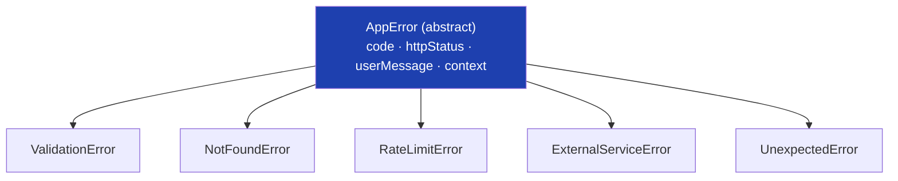
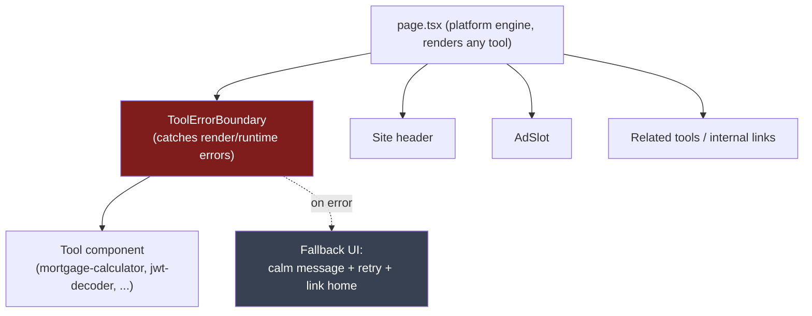
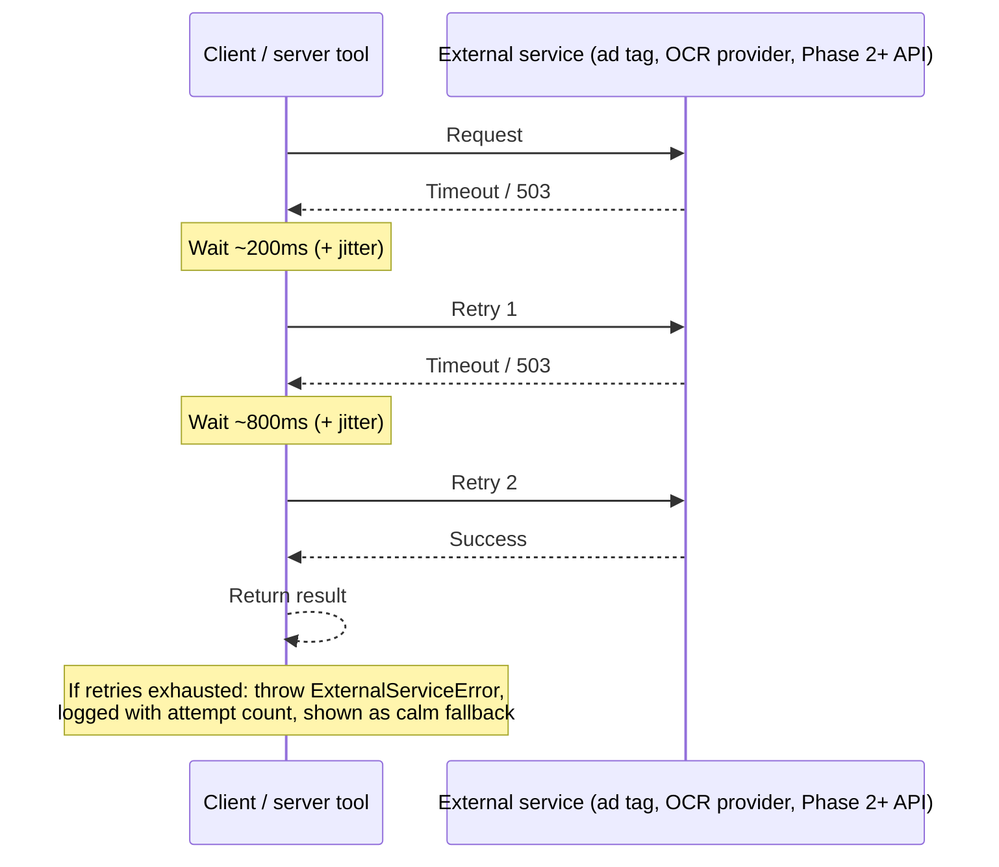
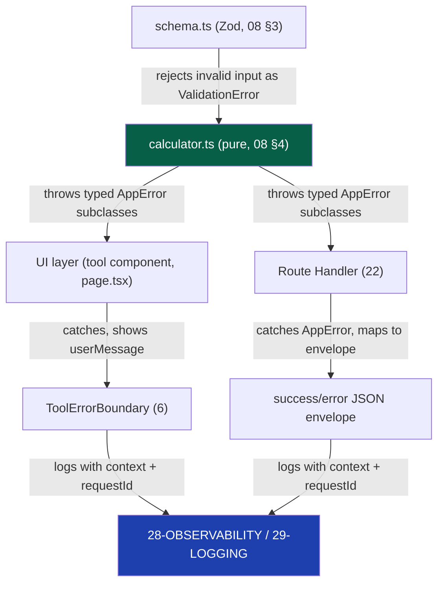

# 27 — Error Handling

> **Status:** Draft v1 · **Owner:** CTO / Principal Engineer · **Audience:** Everyone who writes code that can fail — human or AI (which is everyone)
> **Governed by:** `00-ENGINEERING-PRINCIPLES.md` and the relevant prior chapters, especially `08-CODING-STANDARDS.md` (§5), `10-FRONTEND-ARCHITECTURE.md`, `13-TOOL-PLUGIN-ARCHITECTURE.md`, `22-API-STANDARDS.md` (§3), `25-SECURITY.md`, `28-OBSERVABILITY.md`, and `29-LOGGING.md`.

---

## 1. Why This Chapter Exists

`08-CODING-STANDARDS.md`, §5 already states the non-negotiable rules in one paragraph: never swallow errors, fail fast at boundaries, degrade gracefully in the UI, use typed errors, log with context, keep user-facing messages human. That paragraph is correct and it is not enough. At one tool, "don't swallow errors" is a habit. At 1,000+ tools, written across years, partly by a solo founder, partly by AI, partly by future engineers who never read `08` closely — "don't swallow errors" has to be a **system**: a shared vocabulary for what kind of error this is, a shared shape for carrying it, a shared place it gets caught, and a shared way it's shown to a human versus recorded for us.

This chapter is that system: the error taxonomy, the typed-error contract, where errors are caught and how the UI degrades, how transient failures get retried, how one failure across three layers (browser, edge, server) is tied together with one ID, and the hard line between what a user sees and what an engineer sees.

**Simple explanation:** `08` is the rule "always wear a seatbelt." This chapter is the seatbelt's actual engineering — buckle, pretensioner, airbag coordination, crash-test standard. The rule is easy to state; building the thing that makes it hold under a real crash is the harder part.

> **CTO note:** the biggest error-handling failure mode on a solo-founder timeline isn't a missing `try/catch` — it's writing `catch (e) { console.log(e) }` at 11pm to make a red squiggly go away, and never returning to it. That line compiles, ships, and quietly deletes an entire class of future bug reports. Every rule below exists to make that shortcut *harder to write* than the correct version, because willpower doesn't survive contact with a deadline.

---

## 2. Error Taxonomy: Not All Failures Are the Same Failure

The first design decision is refusing to treat every `throw` the same way. We split errors into two families, and each family into concrete types.

| Family | Meaning | Whose fault | Typical response |
|--------|---------|-------------|-------------------|
| **Expected / Validation errors** | The input, state, or environment is invalid in a way we anticipated | Usually the caller (bad input) | Reject with a clear, specific message; no alert paged, no stack trace shown |
| **Unexpected / System errors** | Something we did not anticipate broke: a bug, an outage, a network failure | Ours (bug) or infrastructure's (outage) | Log with full context, show a calm generic message, alert if it recurs |

Within those two families, every error in the codebase is one of a small, fixed set of concrete types:

| Type | Family | Example in UToolios | HTTP status (API, `22`) |
|------|--------|----------------------|--------------------------|
| `ValidationError` | Expected | `principal` on mortgage-calculator is negative | `400` |
| `NotFoundError` | Expected | `/finance/not-a-real-tool` requested | `404` |
| `RateLimitError` | Expected | A caller exceeds their per-key quota (`22`, §7) | `429` |
| `UnauthorizedError` | Expected | A Phase 3 premium endpoint called without a valid session (`23`) | `401`/`403` |
| `ExternalServiceError` | Unexpected (to the caller), anticipated (by us) | An ad network's tag fails to load; an OCR provider times out (`11`, §5) | `502`/`503` |
| `UnexpectedError` | Unexpected | A null pointer in `calculator.ts` we didn't foresee; a Prisma connection drop (Phase 2) | `500` |

**Simple explanation:** a restaurant kitchen sorts problems the same way. "The customer ordered a dish we don't serve" (validation) gets a polite correction from the waiter, not a fire drill. "The walk-in freezer just died" (system) triggers the manager, a log entry, and a calm cover story to the dining room ("that dish is temporarily unavailable") — never "our freezer broke, panic." Treating a wrong order like a freezer failure, or vice versa, wastes everyone's time and trust.

> **CTO note:** this taxonomy is worth little as a mental model alone. It has to exist as actual TypeScript classes (§3) the compiler and linter can see — a taxonomy enforced by "remembering the difference" degrades the moment a second person, or an AI generating tool #620, touches the code without having read this document.

---

## 3. Typed Errors, Not Strings

**Rule:** we never `throw` a bare string, a bare `Error`, or an ad-hoc object. Every error thrown inside UToolios code extends a small, shared base class defined once in `packages/core`.

```
// packages/core/errors.ts
export abstract class AppError extends Error {
  abstract readonly code: string;          // stable, machine-readable — mirrors 22's error.code
  abstract readonly httpStatus: number;    // how the API layer reports it (22, §3)
  abstract readonly userMessage: string;   // safe, human, shown as-is in the UI
  readonly context?: Record<string, unknown>; // technical detail — logs only, never the UI

  constructor(message: string, context?: Record<string, unknown>) {
    super(message);                        // technical message — for logs, never for users
    this.context = context;
    this.name = this.constructor.name;
  }
}

export class ValidationError extends AppError {
  readonly code = 'VALIDATION_ERROR';
  readonly httpStatus = 400;
  readonly userMessage: string;
  constructor(userMessage: string, technicalMessage: string, context?: Record<string, unknown>) {
    super(technicalMessage, context);
    this.userMessage = userMessage;
  }
}
```

Every other type in §2's table (`NotFoundError`, `RateLimitError`, `ExternalServiceError`, `UnexpectedError`, …) follows the identical shape. A tool's `calculator.ts` or a Route Handler never invents a new ad-hoc shape — it picks the existing type that matches, or (rarely, in review) a new subclass is added once, to the shared file, for everyone.



**Simple explanation:** a bare `throw new Error('bad input')` is a sticky note with a scribble on it — the next person guesses what it means. A typed `ValidationError` is a filled-out incident form with a field for the customer-facing note and a field for internal detail. Both "report" the same problem; only one is useful three months later when someone else is debugging it.

> **CTO note:** the split inside `AppError` — `message` for logs, `userMessage` for humans — is the single most important line in this chapter, and the one most likely to be violated under pressure by writing `userMessage = err.message` "just this once." That once is how a raw database connection string ends up rendered on a live tool page. Treat any code assigning `userMessage` from anything but a hand-written literal as a review blocker.

---

## 4. Fail Fast at Boundaries, Degrade Gracefully in the UI

These are two different rules for two different layers, and conflating them is the most common mistake.

**Fail fast at the boundary** means: the moment untrusted input crosses into our system — a form submission, a query param, an API request body — it is validated immediately by the tool's `schema.ts` (`08`, §3; `13`), and rejected with a specific `ValidationError` before any calculation logic runs. We do not let bad data limp deeper into the system hoping something downstream handles it.

**Degrade gracefully in the UI** means the opposite instinct at the opposite layer: once something *has* gone wrong — validation rejected input, or an unexpected error occurred — the user is never shown a blank page, a stack trace, or a frozen spinner. They see a specific, calm, actionable message, and the rest of the page (navigation, related tools, ads) keeps working wherever possible.

| Boundary | Fails fast how | UI degrades how |
|----------|-----------------|-------------------|
| Form input on a tool page | `schema.ts` rejects invalid values on blur/submit | Inline field error: "Interest rate must be between 0 and 100" |
| Client-side calculation throws unexpectedly | Caught immediately at the call site, never left to bubble to `window.onerror` unhandled | Tool's result panel shows a calm fallback; rest of the page (header, ads, related tools) renders normally |
| API request (`22`) | Zod schema validation before the handler runs | `400` with `error.code` + `error.message`, envelope shape from `22`, §3 |
| Server-dependent tool (OCR, PDF, `11`, §5) | Input size/type/rate checked before the expensive operation starts | "This file couldn't be processed — try a smaller file or a different format," not the raw provider error |

**Simple explanation:** a security checkpoint at a stadium turns you away at the gate if your ticket is invalid (fail fast) — it does not let you inside and hope an usher catches you later. But if the scoreboard's electronics glitch mid-game (unexpected failure), the stadium doesn't evacuate everyone — the game keeps playing while a specific, contained fix happens to just the scoreboard. Two different failure philosophies, applied at two different points, both in service of the same goal: contain the damage as early and as narrowly as possible.

> **CTO note:** "graceful degradation" is sometimes used as an excuse to swallow an error quietly and show a blank state with no message at all — the UI didn't crash, so it feels done. That is not graceful degradation; that is a silent failure with better CSS. Graceful degradation is defined as: *the user always knows something specific went wrong and what to do next* — never "the page just quietly didn't work."

---

## 5. Never Swallow Errors

Restated plainly because it is the rule most often broken under time pressure: **every `catch` block does at least two things — logs with context, and either re-throws a typed error or produces a defined fallback the user can see.** A `catch` block that does neither is a bug factory: the error still happened, we just deleted the evidence.

```
// BANNED — the classic silent swallow
try {
  const result = calculate(input);
} catch (e) {
  console.log(e);   // gone the moment the tab closes; no context; no user feedback
}

// CORRECT
try {
  const result = calculate(input);
  return result;
} catch (err) {
  logger.error('bmi-calculator: calculation failed', { toolId: 'bmi-calculator', input, err }); // 29-LOGGING
  throw new UnexpectedError('bmi-calculator calculation threw', { input });
  // caller (error boundary, §6, or API handler, 22 §3) turns this into a user-safe response
}
```

| Anti-pattern | Why it's banned |
|---------------|------------------|
| Empty `catch {}` | The error is deleted; we lose all evidence it ever happened |
| `catch (e) { console.log(e) }` only | Logged nowhere durable (`29`); no user feedback; no re-throw |
| Catching `Error` broadly and returning `null`/`undefined` | Callers can't distinguish "no result" from "it broke" — pushes the ambiguity downstream |
| Catching and re-throwing the *exact same* generic `Error` | Adds no context; might as well not have caught it |

**Simple explanation:** think of every `catch` block as a form that must be filled out completely before it's filed — who, what, when, and what happens next. A `catch` that does nothing is an incident nobody wrote down: from the outside it looks like nothing happened, but the actual problem is still out there, waiting to bite the next user, except now with zero trail leading back to it.

---

## 6. React Error Boundaries: Containing UI Failures

A JavaScript exception thrown during React's render can, unhandled, unmount the entire page. On a platform where each tool is an independently generated, self-contained plugin (`13`), one broken tool must never be able to take down the header, footer, ads, or the rest of the site around it.

**Rule:** every tool render is wrapped in a React Error Boundary at the platform-engine layer (`page.tsx`, per `13`, §2) — not per-tool, so tool authors never have to remember to add one.



| What the boundary does | What it explicitly does NOT do |
|---------------------------|-------------------------------|
| Catches render-time and lifecycle errors thrown by the tool's component tree | Catch errors inside event handlers or `async` code (React boundaries don't) — those are caught explicitly in the handler itself, per §5 |
| Logs the error with `toolId`, correlation ID (§8), and component stack (`28`, `29`) | Silently reset without logging |
| Renders a calm, tool-scoped fallback ("Something went wrong with this calculator. [Try again] [Back to Tools]") | Blank the whole page — header, ads, and navigation keep rendering |
| Offers a reset action that re-mounts just the tool | Force a full page reload as the only recovery path |

**Simple explanation:** a shopping mall doesn't shut its doors because one store's cash register jammed. Security tapes off that one storefront, puts up a "temporarily closed, sorry for the inconvenience" sign, and every other shop — plus the mall's lights, escalators, and directory — keeps running exactly as before. The error boundary is that tape and that sign, scoped to one store (one tool) at a time.

> **CTO note:** because event-handler and `async` errors slip past React's error boundary by design, teams sometimes assume "we have an error boundary" means "we're covered." We are not — the boundary is one layer of a defense-in-depth stack: schema validation (fail fast, §4), explicit `try/catch` around every async calculation and every event handler (§5), the boundary catching what leaks through render, and a global `window.onerror`/`unhandledrejection` listener (`28`) as the final backstop that guarantees nothing vanishes unlogged.

---

## 7. Retries and Backoff for Transient Failures

Not every failure deserves a retry, and retrying the wrong thing turns a minor blip into a self-inflicted outage. The rule: **retry only operations that are both idempotent and plausibly transient** — network calls to external services, not user input validation, not calculations.

| Failure | Retry? | Strategy |
|---------|--------|----------|
| `ValidationError` (bad user input) | Never | Retrying identical bad input produces the identical error — show the message instead |
| Network call to an ad network, analytics endpoint, or external API (Phase 2+ server tools, `11` §5) | Yes | Exponential backoff with jitter, bounded attempts |
| Database query timeout (Phase 2, Postgres) | Yes, narrowly | 1–2 retries only; a persistently failing query is a bug, not a blip |
| `RateLimitError` (`429`) | Yes, respecting `Retry-After` | Backoff to the server-specified time, not our own guess (`22`, §7) |
| Any error inside `calculator.ts` itself | Never | Pure functions (`08`, §4) are deterministic — retrying gets the identical result or the identical throw |



**Simple explanation:** if you knock on a door and nobody answers, knocking again a few seconds later is reasonable — maybe they were in another room. Knocking again instantly, twenty times, is how you get the door slammed and the neighbors called. Exponential backoff is "wait a little longer between each knock, and eventually accept nobody's answering" — protecting the external service exactly the way we'd want to be protected ourselves under load (`22`, §7).

> **CTO note:** retries without a hard cap are a common cause of cascading outages — a struggling downstream service gets hammered by everyone's retries at once, which is exactly what pushes it from "slow" to "down." Every retry loop in this codebase has a maximum attempt count and an explicit final `throw`. "Retry forever" is never an acceptable default, even for something as seemingly harmless as a single ad tag.

---

## 8. Correlation IDs: Tying One Failure Across Every Layer

A single user-visible failure can touch the browser, Cloudflare's edge, our Route Handler, and (Phase 2+) a server-side tool sandbox or database. Without a shared identifier, debugging means guessing which server log, at which minute, matches which user's report.

**Rule:** every request generates (or receives) a **correlation ID** — the same `requestId` referenced in `22`'s response envelope — at the earliest possible point, and that ID is threaded through every log line, every thrown error's context, and every response back to the client.

| Layer | What happens with the correlation ID |
|-------|----------------------------------------|
| Browser | Generated client-side for pure client-only tool errors (e.g., BMI calculator throwing in the browser); attached to the error report sent to `28` |
| Edge / Route Handler | Generated (or read from an inbound header) per request; attached to every log line for that request (`29`) |
| API response | Returned as `meta.requestId` in every success *and* error envelope (`22`, §3) — visible to the caller |
| Server-side tool sandbox (Phase 2, `11` §5) | Passed into the sandboxed process so a cost/timeout failure in an isolated worker still traces back to the originating request |
| Support / bug report | The user (or our own AdSense/affiliate partner in Phase 3) pastes the `requestId`; we grep every layer's logs for that one string and see the whole story |

**Simple explanation:** a correlation ID is a tracking number stamped on a package the instant it's dropped off, and carried on every leg of its journey — the local depot, the plane, the sorting facility, the delivery van. If the package gets lost, you don't have to describe it in prose to five different companies; you give the one tracking number and everyone instantly finds the exact same story from their own records. A user reporting "the mortgage-calculator broke around 3pm" is a mystery; a user reporting "the mortgage-calculator broke, requestId `req_9f2ac1`" is a five-minute log search.

> Correlation IDs are the connective tissue between this chapter and `28-OBSERVABILITY.md` (traces) and `29-LOGGING.md` (structured log format) — this chapter defines *that* every error carries one; those chapters define *how* it's generated, propagated, and queried.

---

## 9. User-Facing vs. Internal Messages

This is the most operationally important split in the whole chapter, restated here as its own section because it is so easy to violate under pressure (§3's CTO note).

| | User-facing (`userMessage`) | Internal (`message` + `context`) |
|---|---|---|
| Audience | The person using the tool | Us — logs, traces, alerts (`28`, `29`) |
| Content | Plain language, specific, actionable | Full technical detail: stack, input, `toolId`, correlation ID |
| Tone | Calm, never blaming the user or the system dramatically | Neutral, exhaustive |
| Contains | Never a stack trace, file path, SQL, provider name, or internal error code | Everything — this is exactly where that detail belongs |
| Example | "Enter a loan term between 1 and 40 years." | `ValidationError: term=45 exceeds MAX_TERM_YEARS=40 { toolId: 'mortgage-calculator', requestId: 'req_9f2ac1' }` |
| Example (unexpected) | "Something went wrong. Please try again — if this keeps happening, let us know." | `TypeError: Cannot read properties of undefined (reading 'rate') at calculate() { toolId, requestId, input }` |

**Simple explanation:** a doctor's chart and a patient's after-visit summary describe the identical visit in two completely different registers. The chart says "acute pharyngitis, prescribed amoxicillin 500mg TID x10d, review in 2 weeks if no improvement" — dense, precise, for professionals. The after-visit summary says "you have a throat infection; take your antibiotic three times a day for ten days; call us if you're not feeling better in two weeks." Same event, same underlying facts, two audiences, two vocabularies. Showing a user the "chart" version — a stack trace on the jwt-decoder page — is as unhelpful and alarming as handing a patient their raw clinical notes and no explanation.

> **CTO note:** the security angle matters as much as the UX angle here. A stack trace or raw provider error leaking to the UI is a `25-SECURITY.md` concern, not just a polish issue — it can reveal file paths, library versions, internal service names, or (worse, for server-side tools in Phase 2) fragments of another user's data. Treat "does this error message leak internals" as a security review question, not a copywriting one.

---

## 10. Where This Lives in Code

Concretely, error handling is layered the same way the rest of the architecture is layered (`04`, `13`):



The rule that keeps this simple at 1,000+ tools: **`calculator.ts` only ever throws — it never catches-and-swallows, and it never renders anything.** Catching, logging, and choosing what a human sees happens exactly twice — once in the API Route Handler (`22`, §3), once in the UI's error boundary and event handlers (§5, §6) — never scattered ad hoc inside individual tools. A new tool author (human or AI) writing `calculator.ts` for tool #700 only has to know one thing: pick the right `AppError` subclass and throw it. Everything downstream already knows what to do with it.

---

## Summary

- Errors are split into a **taxonomy**: expected (`ValidationError`, `NotFoundError`, `RateLimitError`, `UnauthorizedError`) vs. unexpected (`ExternalServiceError`, `UnexpectedError`) — each with a defined HTTP status and response posture.
- Every error is a **typed `AppError` subclass** from `packages/core` — never a bare string or generic `Error` — carrying a machine-readable `code`, an `httpStatus`, a human `userMessage`, and technical `context` for logs only.
- **Fail fast at the boundary** (`schema.ts` rejects bad input immediately); **degrade gracefully in the UI** (a calm, specific message and a page that otherwise keeps working) — two different rules for two different layers.
- **Never swallow an error**: every `catch` logs with context and either re-throws a typed error or produces a defined, visible fallback.
- **React error boundaries** wrap every tool render at the platform-engine layer, containing a broken tool to its own panel — combined with explicit `try/catch` around async/event-handler code and a global backstop listener, as defense in depth.
- **Retries with exponential backoff and a hard cap** apply only to idempotent, plausibly transient operations (external services, rate limits) — never to validation errors or pure calculations.
- **Correlation IDs** (`requestId`) are generated at the earliest layer and threaded through every log line, thrown error, and API response, turning "it broke around 3pm" into a five-minute log search.
- **User-facing messages are always human and never leak internals**; **internal messages carry full technical detail** for logs and traces — conflating the two is both a UX and a security (`25`) problem.
- `calculator.ts` only ever **throws**; catching, logging, and deciding what a human sees happens in exactly two places (API layer, UI layer) — never scattered per-tool.

> Next: `28-OBSERVABILITY.md` — how thrown errors, correlation IDs, and traces become dashboards and alerts we actually act on.

---

### Changelog
| Version | Date | Change | Reason |
|---------|------|--------|--------|
| v1 | (draft) | Initial error handling standards | Project inception |
