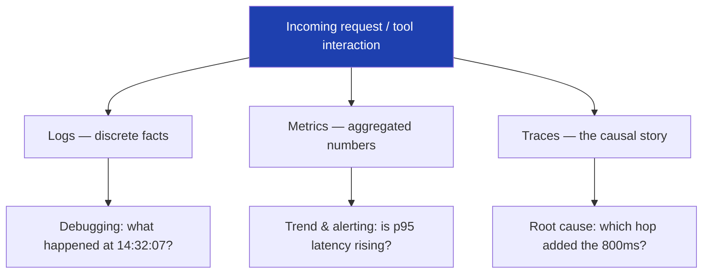
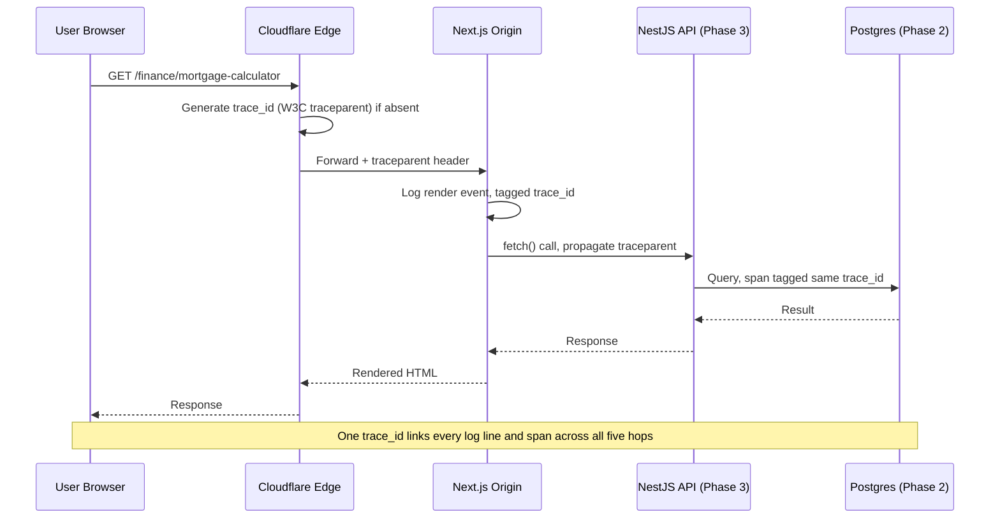
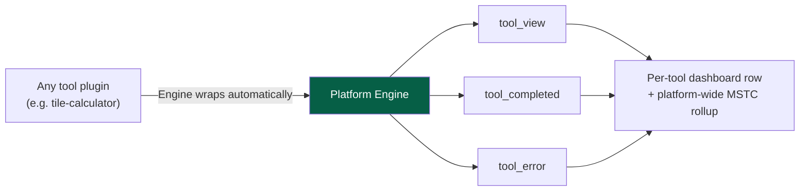
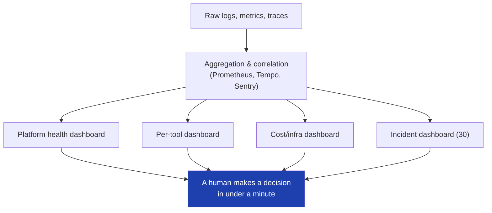

# 28 — Observability

> **Status:** Draft v1 · **Owner:** CTO / Platform Architect · **Audience:** Every engineer shipping platform code or tool plugins; the observability stack is centrally owned, but every request and every tool must speak its language
> **Governed by:** `00-ENGINEERING-PRINCIPLES.md` and `04`, `11`, `13`, `20`, `21`, `22`, `29-LOGGING`, `30`. This chapter defines how UToolios sees itself in production — logs, metrics, and traces, correlated end-to-end, per-tool and platform-wide — so that "it's slow" or "it's broken" is never a guess.

---

## 1. Why This Chapter Exists — N6

`00-ENGINEERING-PRINCIPLES.md` names observability as one of the load-bearing walls, not a nice-to-have:

> **N6 — Observability hooks:** You cannot fix what you cannot see; at scale, "it's slow" is unactionable without traces. Retrofitting tracing means touching every service path.

That last clause is the reason this chapter exists before we have a backend, a database, or a single paying customer. Instrumentation is the rare category of engineering work that is *cheap to build in from day one and expensive to bolt on later* — every route, every plugin, every API contract we ship in Phase 1 either carries an observability hook or doesn't, and "doesn't" means touching 1,000+ tool folders later to retrofit it. We pay a small, constant tax now instead of a large, one-time tax at the exact moment we can least afford downtime: when traffic is already scaling past what one founder can manually watch.

**Simple explanation:** imagine driving a car with no dashboard — no speedometer, no fuel gauge, no engine light. It might run fine for a while, but the first time something goes wrong, you have no idea if you're overheating, out of fuel, or just imagining it. Observability is the dashboard. We install the gauges when we build the car, not after it breaks down on the highway with passengers aboard (users, at 2-5M/month).

> **CTO note:** the single most common failure mode for a solo-founder SaaS isn't a missing feature — it's a silent regression nobody notices until a user complains on Twitter, days after it started. At our scale target, by the time a human notices, thousands of tool completions have already failed. Observability's real job is compressing "days until we notice" down to "minutes," which directly protects the North Star metric (`00`): Monthly Successful Tool Completions (MSTC) is unmeasurable — and unprotectable — without it.

---

## 2. The Three Pillars

Observability rests on three distinct signal types. Each answers a different question, and none substitutes for the others.

| Pillar | Answers | Shape | Example at UToolios |
|--------|---------|-------|----------------------|
| **Logs** | "What exactly happened, in this one event?" | Discrete, timestamped, structured records | `tool_error` event: `{ tool: "jwt-decoder", error: "invalid_base64", trace_id: "..." }` |
| **Metrics** | "How much / how often / how fast, in aggregate?" | Numeric time series (counters, gauges, histograms) | `tool_execution_duration_ms{tool="mortgage-calculator"}` p95 |
| **Traces** | "What was the end-to-end journey of *this one request*, across every hop?" | A tree of timed spans sharing one trace ID | A single page view → edge → render → (Phase 2) API call → DB query, all one trace |

**Simple explanation:** think of investigating a delayed flight. The *log* is the gate agent's note: "14:32, flight delayed, reason: late inbound aircraft." The *metric* is the airline's dashboard showing average delay minutes across all flights this month. The *trace* is the full chain of events for this one flight: the inbound aircraft's late landing, the gate-change, the boarding delay, the taxi wait — each a timed segment of the same journey. You need the note to know what happened, the dashboard to know if it's a pattern, and the chain to know *why*.

> **CTO note:** teams often stand up metrics first because dashboards feel impressive, then discover metrics alone can't answer "why did *this* request fail" — only traces can, because traces preserve per-request causality that aggregation destroys. We commit to instrumenting traces from Phase 2 onward specifically because retrofitting causal context after a system has fragmented into multiple services (Next.js origin + NestJS backend, `11`) is materially harder than propagating a trace ID that already exists.

---

## 3. OpenTelemetry — The Unifying Instrumentation Layer

We standardize on **OpenTelemetry (OTel)** as the single instrumentation API across the entire stack, precisely because "Everything Replaceable" (`00`) applies to observability backends as much as to ad networks (`19`) or search engines (`31`). OTel is vendor-neutral: the code that emits a span or a metric never hard-codes "send this to Grafana" — it emits to the OTel SDK, and an exporter, configured once, decides the destination.

| Layer | What emits telemetry | Exporter destination (Phase 2+) |
|-------|------------------------|-----------------------------------|
| Next.js app (Server Components, Route Handlers) | OTel Node SDK via `instrumentation.ts` | OTel Collector → Prometheus (metrics) + Grafana Tempo (traces) |
| NestJS backend (Phase 3) | OTel Node SDK, auto-instrumented HTTP/DB clients | Same Collector |
| Client-side (browser) | Web Vitals + Sentry Browser SDK | Sentry (errors + performance), lightweight beacon for RUM |
| Edge (Cloudflare) | Cloudflare's own request logs + Logpush | Fed into the same Collector/log pipeline (`29`) |
| Infra (Docker, GitHub Actions) | Build/deploy timers and exit codes | Grafana (ops dashboards) |

**Simple explanation:** OpenTelemetry is like using a universal power adapter instead of wiring every appliance directly into the wall. Every part of the system — the Next.js app today, the NestJS backend tomorrow — "plugs in" the same way. If we ever switch from self-hosted Grafana to a vendor (Honeycomb, Datadog), we change the adapter's destination socket, not every appliance in the building.

> **CTO note — resist the urge to stand up the full OTel Collector + Prometheus + Grafana stack in Phase 1.** With no backend and no database, there is nothing yet worth tracing across services — a Collector with one source (the Next.js edge functions) is operational overhead with no payoff (YAGNI, `00`). Phase 1's actual observability need is narrower and is met by Sentry (client + server errors, with basic performance traces) and Cloudflare/Vercel analytics for Core Web Vitals (`20`). The OTel *API* is still used from day one in the sense that we structure log events and IDs to be trace-ready (§4) — we just don't stand up the *backend infrastructure* until Phase 2 gives us something worth aggregating.

---

## 4. Correlation — One Trace ID, Every Hop

The single most valuable piece of plumbing in this chapter is trivial to describe and easy to get wrong: **every request gets one trace ID, generated at the earliest possible point, and that ID travels with the request through every hop, appearing in every log line, span, and error report it touches.**

We use the **W3C Trace Context** standard (`traceparent` / `tracestate` headers) rather than inventing our own correlation header — it's what OTel, Sentry, and Cloudflare already understand natively, so propagation is largely automatic once instrumentation is wired up, not a bespoke header we maintain forever.

| Phase | What correlation looks like |
|-------|-------------------------------|
| **Phase 1** | Cloudflare assigns a request ID; Next.js middleware reads or generates a `traceparent`-compatible ID and attaches it to every server log line and every Sentry event for that request. No cross-service hop exists yet, but the ID format is already trace-ready. |
| **Phase 2** | Route Handlers calling the database, Redis, or Meilisearch propagate the same trace ID into query spans — a slow page now shows *which* backing call was slow, not just "the page was slow." |
| **Phase 3** | The trace crosses a real network boundary into NestJS (`11`) and back. This is where correlation earns its keep: without it, "the API is slow" and "the page is slow" look like two unrelated incidents instead of one caused-by-the-other one. |

**Simple explanation:** think of a hospital patient wristband with a barcode. Every department the patient passes through — reception, triage, X-ray, pharmacy — scans that same barcode instead of writing a new file each time. If something goes wrong, any doctor can scan the wristband and see the *entire* visit in order, not five disconnected paper notes. The trace ID is that wristband, stamped once at the front door (Cloudflare) and read at every department the request visits.

> **CTO note:** the temptation is to skip trace-ID plumbing in Phase 1 because "there's only one service, correlation is trivial." That's exactly the trap N6 warns about — the *code paths* that generate and forward the ID need to exist before the second service does, or Phase 3's very first cross-service incident becomes a multi-day archaeology exercise instead of one Grafana Tempo query. Building the header-propagation habit now, while it's low-stakes, is what makes it free later.

---

## 5. SLIs and SLOs — Defining "Good Enough"

Metrics without a target are just numbers on a screen. We define **Service Level Indicators (SLIs)** — the thing we measure — and **Service Level Objectives (SLOs)** — the target we hold ourselves to — for the handful of signals that actually predict user-visible pain or business risk.

| SLI | Definition | Phase 1 SLO | Phase 2+ SLO |
|-----|------------|-------------|----------------|
| **Availability** | % of tool page requests served successfully (2xx/edge cache hit) | 99.9% | 99.95% |
| **Tool completion success rate** | % of tool interactions that reach a valid result without a `calculator.ts` error | 99.5% per tool | 99.9% per tool |
| **Page latency (LCP)** | 75th-percentile field LCP per tool (`20`) | < 2.5s | < 2.5s |
| **API latency (Phase 3)** | p95 response time for public API endpoints (`22`) | n/a — no API yet | < 300ms |
| **Error budget burn** | Rate of SLO violation vs. allowed budget over a rolling 30 days | Tracked informally | Formal error budget with alerting (`30`) |

**Simple explanation:** an SLO is like a restaurant's promise: "your table will be ready within 15 minutes of your reservation, 95% of the time." It's not a promise of perfection — it's an honest, measurable target that lets the restaurant (and the customer) know when something is actually wrong versus normal variance. Our mortgage-calculator's SLO isn't "never errors" — it's "errors in fewer than 1 in 200 completions," a number we can actually track and defend.

> **CTO note:** don't back into SLOs by copying industry defaults (99.99% availability sounds impressive on a slide) without pricing what it costs to hold. At solo-founder scale, chasing 99.99% (52 minutes of downtime/year) on infrastructure with no on-call rotation is a fantasy number that creates false alarms, not reliability. Start with honest, currently-achievable SLOs (Phase 1 targets above are deliberately modest), tighten them as Phase 2 infrastructure (load balancing, redundancy) actually earns the tighter number, and let error-budget burn — not vanity targets — drive the alerting thresholds defined in `30`.

---

## 6. Per-Tool Observability — The Plugin Contract's Hidden Fourth Dimension

The Tool Plugin Architecture (`13`) already guarantees every tool exposes the same fixed files. Observability adds an implicit, engine-provided contract on top: **every tool automatically emits the same three lifecycle events**, without the tool author writing any instrumentation code.

| Event | Fired when | Tags |
|-------|------------|------|
| `tool_view` | The tool's page renders/becomes interactive | `tool` (canonical slug, `09`), `category`, `locale` |
| `tool_completed` | The user reaches a valid result (a successful `calculator.ts` call with valid input) | `tool`, `category`, `duration_ms` |
| `tool_error` | `calculator.ts` throws, or Zod validation (`schema.ts`) rejects input in a way that indicates a bug rather than expected user error | `tool`, `category`, `error_type`, `trace_id` |

This is what makes MSTC (`00`) a real, queryable number instead of an aspiration: it is the platform-wide sum of `tool_completed` events, sliceable by tool, category, or time — because every one of 1,000+ tools emits it identically, the *same way the canonical-naming discipline (`09`) makes analytics keys match folder names.*

**Simple explanation:** imagine every till in a supermarket chain is wired to report the same three things automatically — "customer approached," "sale completed," "till jammed" — without the cashier having to remember to log anything. Head office instantly knows total sales across 1,000 stores, or can zoom into "till #340 (jwt-decoder) jams unusually often." Because every tool plugin is built on the same engine, every "till" reports identically — a new tool #1,001 gets this dashboard row for free, zero extra code.

> **CTO note:** the risk here is metric-label cardinality. With 1,000+ tools, a `tool` label on every metric is 1,000+ time-series per metric name — manageable, but a *second* uncontrolled high-cardinality label (e.g. raw user input values, or a per-session ID on a metric rather than a trace) can blow that into millions of series and make the metrics backend itself the next cost incident. The rule: tags on metrics are a small, fixed, engine-controlled vocabulary (tool slug, category, locale, error type) — anything higher-cardinality belongs in a trace or a log, never a metric label.

---

## 7. What We Instrument — The Golden Signals

Beyond per-tool events, the platform instruments the four "golden signals" (Google SRE terminology) at every relevant layer.

| Signal | Platform-wide example | Per-tool example |
|--------|--------------------------|----------------------|
| **Latency** | TTFB, edge cache hit latency (`21`) | `calculator.ts` execution time; LCP for that tool's page |
| **Traffic** | Requests/min by route, cache hit ratio | `tool_view` rate per tool/category |
| **Errors** | 5xx rate, Sentry error rate, build failures | `tool_error` rate; Zod validation-rejection rate (expected vs. bug) |
| **Saturation** | Server CPU/memory (Phase 2 servers), Redis connection pool (Phase 2), rate-limit rejections on server-side tools (`11`) | Server-side tool (OCR/PDF, `11`) queue depth and cost-per-request |

We also explicitly instrument the things unique to our business model:

- **Ad-related performance impact** — does an ad slot's load correlate with LCP/CLS regressions for a given tool (`19`, `20`)?
- **Edge cache hit ratio per route** — a silent drop here is a cost and latency problem before it's a user complaint (`21`).
- **Build/deploy pipeline health** — CI duration, deploy success rate, time-to-rollback (`07`) — because a broken deploy pipeline for a solo founder is as production-critical as a broken server.

**Simple explanation:** the golden signals are the four vital signs a doctor always checks first — pulse, temperature, blood pressure, breathing — regardless of what specifically brought the patient in. Whatever tool, whatever incident, we always know how fast it's responding, how much traffic it's under, how often it's failing, and how close to capacity it's running, before drilling into anything tool-specific.

---

## 8. Dashboards — From Telemetry to Decisions

Raw telemetry is not observability until someone can look at a screen and make a decision in under a minute. Dashboards are audience-specific, not one giant screen.

| Dashboard | Audience | Key panels |
|-----------|----------|-------------|
| **Platform health** | Founder/CTO, daily glance | Availability, error budget burn, top-5 slowest tools, cache hit ratio, deploy status |
| **Per-tool detail** | Debugging a specific tool | `tool_view`/`tool_completed`/`tool_error` rates, p50/p95 latency, recent error samples with trace links |
| **SEO/traffic** | Growth decisions (ties to `31-ANALYTICS`) | Organic sessions per tool/category, MSTC trend, indexation status |
| **Cost/infra** | Budget guardrails (`03`) | Server-side tool invocation counts and cost estimate, Cloudflare bandwidth, ad revenue vs. infra cost |
| **Incident/on-call** | Active incident response (`30`) | Active alerts, error-budget burn rate, recent deploys (correlate regressions to releases) |

> **CTO note:** a dashboard nobody looks at is a maintenance liability, not an asset — it still needs updating when a metric name changes, and it gives false confidence that "we have observability" when in fact nobody's eyes ever land on it. Start with one dashboard (platform health) actually reviewed daily, and only add the others as the specific decision they support becomes real (a second engineer needing the per-tool dashboard to debug; an actual on-call rotation needing the incident dashboard). Dashboards should be pulled into existence by a decision they enable, not pushed out because "we should have one."

---

## 9. Where Observability Ends and Its Neighbors Begin

This chapter deliberately stops short of two adjacent concerns, owned by their own chapters so this one doesn't sprawl:

| Boundary | Owned by | Relationship |
|----------|----------|----------------|
| **Structured log format, retention, PII scrubbing** | `29-LOGGING` | This chapter says *what* gets logged and correlated (trace IDs, tool lifecycle events); `29` says *how* — the schema, storage, and retention rules |
| **Alerting rules, on-call, incident response, postmortems** | `30` | This chapter defines the SLIs/SLOs and the signals; `30` defines what happens when a signal crosses a threshold — who gets paged, how, and what the runbook says |

**Simple explanation:** if this chapter is "install the dashboard and gauges in the car," `29` is "the glovebox manual describing exactly what each gauge measures and how long we keep the trip logs," and `30` is "what you actually do when the check-engine light comes on — pull over, call for help, or keep driving to the next town." All three matter; conflating them makes each chapter harder to follow and harder to keep current independently.

---

## 10. Phasing — What Activates When

| Capability | Phase 1 | Phase 2 | Phase 3 |
|------------|---------|---------|---------|
| Client error tracking (Sentry) | Yes | Yes | Yes |
| Core Web Vitals / RUM | Yes (Cloudflare/Vercel analytics) | Yes, richer | Yes |
| Trace-ID generation & propagation habit | Yes (single-hop, trace-ready) | Yes (crosses into DB/Redis/Meilisearch calls) | Yes (crosses into NestJS network hop) |
| OTel Collector + Prometheus + Grafana Tempo | No (no payoff yet, YAGNI) | Yes | Yes |
| Per-tool lifecycle events (`tool_view`/`completed`/`error`) | Yes (even client-side-only tools can emit these) | Yes | Yes |
| Formal SLOs with error-budget alerting | Informal targets only | Formal, feeds `30` | Formal, per-API-endpoint too |
| Distributed tracing across independent services | N/A — one service | Partial (app ↔ data layer) | Full (app ↔ NestJS ↔ data layer) |

**Simple explanation:** we don't wire a hospital's full multi-department barcode system for a solo GP's clinic with one room — but we do put a patient-ID field on the very first intake form, so that when the clinic grows into a hospital, every department that gets added already knows how to read it.

> **CTO note:** the discipline that makes this phasing safe is the same one governing every deferred feature in this constitution (`00`, `04`): we build the *seam* — event names, tag vocabulary, trace-ID propagation — now, at near-zero cost, and defer the *infrastructure* — Collector, Prometheus, Grafana — until Phase 2's real backend gives it something to aggregate. Getting this order backwards (infra first, seam later) is how teams end up running expensive observability stacks that don't actually answer the questions that matter, because the underlying events were never structured to answer them.

---

## Summary

- Observability is a load-bearing wall (N6), not a nice-to-have — retrofitting instrumentation across 1,000+ tools and multiple services later is far more expensive than building the hooks in from day one.
- The **three pillars** — logs (what happened), metrics (how much/often), traces (the causal story) — answer different questions and are all required; none substitutes for another.
- **OpenTelemetry** is the vendor-neutral instrumentation API used everywhere, so the observability backend (Grafana, Sentry, or a future vendor) stays swappable (`00`, Everything Replaceable).
- **Correlation via a single trace ID**, propagated via W3C Trace Context headers from Cloudflare through Next.js and (later) NestJS and the database, is the one piece of plumbing that must exist before the second service does.
- **SLIs/SLOs** turn raw signals into honest, currently-achievable targets — starting modest in Phase 1, tightened only as real infrastructure earns the tighter number, and feeding error-budget-based alerting in `30`.
- **Per-tool observability** is automatic: the engine emits `tool_view`/`tool_completed`/`tool_error` for every plugin identically, which is what makes MSTC a real, queryable metric rather than an aspiration.
- We instrument the **golden signals** (latency, traffic, errors, saturation) plus business-specific signals: ad-performance impact, edge cache hit ratio, and deploy pipeline health.
- **Dashboards** are audience-specific and pulled into existence by a real decision they enable, not pushed out speculatively.
- Structured log schema/retention belongs to `29-LOGGING`; alerting rules and incident response belong to `30` — this chapter defines the signals, not what happens when they fire.
- Phase 1 ships the trace-ready seam and client-side error tracking; the full OTel Collector/Prometheus/Grafana stack activates in Phase 2 when a real backend exists to aggregate.

> Next: `29-LOGGING.md` — structured log schema, retention, and PII handling across every layer.

---

### Changelog
| Version | Date | Change | Reason |
|---------|------|--------|--------|
| v1 | (draft) | Initial observability strategy | Project inception |
