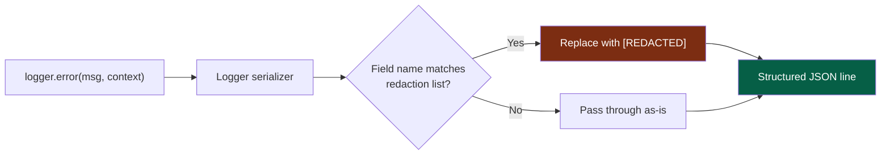
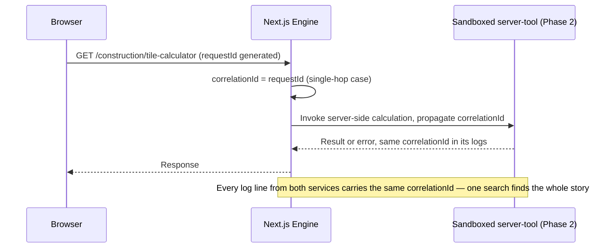

# 29 — Logging

> **Status:** Draft v1 · **Owner:** CTO / Platform Architect · **Audience:** Everyone who writes platform engine code, tool plugins, or API handlers — every log line either helps debug an incident at 2am or costs money doing nothing
> **Governed by:** `00-ENGINEERING-PRINCIPLES.md` and the relevant prior chapters (`08-CODING-STANDARDS`, `11-BACKEND-ARCHITECTURE`, `13-TOOL-PLUGIN-ARCHITECTURE`, `22-API-STANDARDS`, `25-SECURITY`, `28-OBSERVABILITY-MONITORING`).

---

## 1. Why Logging Gets Its Own Chapter

It would be easy to fold logging into observability (`28`) and call it done. We give it a separate chapter because logging has a property metrics and traces don't: **every log line is a decision an engineer makes at the moment they write it**, one call site at a time, thousands of times across a codebase heading toward 1,000+ tool plugins. Metrics dashboards and trace spans are mostly generated by the platform engine automatically; log lines are written by hand, in tool code, in API handlers, in the engine itself — and bad habits here compound linearly with every new `packages/tools/<category>/<slug>/` folder we add.

A `console.log("error")` written once is a minor annoyance. The same pattern copy-pasted by an AI-assisted generation pipeline (`01`) across 500 tools is a platform-wide incident: unsearchable, unfilterable, and — if it happens to log a raw user input containing an email address or an API key — a compliance problem at scale. This chapter exists so that logging is a **contract enforced by a shared logger interface**, not a convention every contributor has to remember.

**Simple explanation:** think of logs as the platform's black box flight recorder. One badly-labeled note in a pilot's private notebook is forgivable. The same sloppy shorthand used by every pilot in a fleet of a thousand planes, with no shared format, is useless the day an investigator actually needs it. We standardize the flight recorder format before the fleet gets large, not after the first crash.

> **CTO note:** logging is the cheapest observability investment we can make and the easiest one to get wrong invisibly. Nobody notices bad logging until the day it matters — a production incident, a security review, a GDPR data-subject request — at which point it's too late to go back and add structure to logs already written and rotated out. We pay this cost once, in the logger interface, rather than thousands of times, at every call site.

---

## 2. What Activates When — Logging Across the Phases

Logging exists from day one — Phase 1 has no database or backend, but it still runs code, and code still fails. What changes across phases is *where logs go* and *how much infrastructure sits behind them*, not whether structured logging discipline applies.

| Phase | What exists | Where logs go |
|-------|-------------|----------------|
| **1 (now)** | Next.js on Cloudflare, client-side tools, no server-side tools, no database | Structured JSON to stdout, captured by the platform's native log stream (Cloudflare/Vercel logs) + Sentry for exceptions (`28`) — no dedicated aggregation service yet |
| **2** | Server-side tools (`11`, sandboxed OCR/PDF/image tools), Redis, Postgres, observability stack (`28`) stood up | Centralized log aggregation (§8) becomes real: a shipped pipeline, retention policy, dashboards, alerting on log-derived signals |
| **3** | NestJS backend, auth, public API, billing | Per-tenant/per-API-key log context added; audit-grade logging for billing and access events |

**The design in this chapter is built for Phase 2 scale from day one** — the *logger interface* and *log shape* (structured JSON, levels, context, redaction) are Phase 1 requirements with zero excuse to skip, because retrofitting structure into unstructured historical logs is not possible; you can only start doing it correctly from here forward. What's deferred to Phase 2 is purely the aggregation *infrastructure* — the pipe the logs flow into, not the format of what flows through it.

**Simple explanation:** we're not deferring "writing legible notes" until Phase 2 — we're deferring the filing cabinet. Every note is written in the same structured format from day one; we just don't yet have a warehouse to file years of them in, because Phase 1 doesn't generate years of volume yet.

---

## 3. Structured JSON Logging — the One Format

Every log line UToolios ever emits is a single-line JSON object, never a free-text string. This is non-negotiable and enforced by the shared logger (§9), not left to discipline.

```json
{"timestamp":"2026-07-20T04:12:33.482Z","level":"error","message":"Tool calculation failed","toolId":"mortgage-calculator","category":"finance","requestId":"req_9f2a1c","correlationId":"corr_7be0d4","errorCode":"CALC_INVALID_INPUT","durationMs":4,"env":"production"}
```

| Property | Rule |
|----------|------|
| One event per line | No multi-line stack-trace dumps interleaved with other requests' logs — a stack trace is a field (`stack`) inside the same JSON object, not separate lines |
| Machine-parseable first | Human readability is a *secondary* concern solved by log-viewer tooling (`28`), never by hand-formatting the log line itself |
| Fixed core fields | `timestamp`, `level`, `message`, `requestId` (or `correlationId`) are present on every single log line, tool-generated or platform-generated |
| No string interpolation of data into `message` | `message` is a short, constant, greppable phrase ("Tool calculation failed"); the *variable* data (which tool, which input) lives in named fields, never concatenated into the sentence |

**Simple explanation:** compare a doctor's note that says "patient had bad reaction to medicine X at 3pm, dose 200mg" (readable but unsearchable across ten thousand charts) to a structured hospital form with separate fields for drug name, dose, and time. The JSON log is the form. You can instantly answer "show me every failure of the mortgage-calculator in the last hour" by filtering a field — you can't reliably grep that out of a thousand slightly-differently-worded sentences.

> **CTO note:** the temptation, especially with AI-assisted tool generation (`01`), is `console.log(\`Tool ${toolId} failed: ${err}\`)` — it reads fine in a local terminal and is actively harmful in aggregate. A template string is not a data structure; the moment you have two tools failing at once in a shared log stream, string logs interleave into an unreadable mess and cannot be filtered by field. We ban raw `console.log`/`console.error` for anything except throwaway local debugging never committed (`08`, lint rule) — everything else goes through the shared logger.

---

## 4. Log Levels — What Each One Means and Who Reads It

| Level | Meaning | Example | Who acts on it |
|-------|---------|---------|-----------------|
| `fatal` | Process cannot continue; platform-wide impact | Engine failed to load the tool registry at boot | Pages on-call immediately (`28`) |
| `error` | A request or operation failed; user-visible or data-affecting | A tool's `calculator.ts` threw on valid input; a server-side tool's sandbox crashed | Triggers alert if rate exceeds threshold (`28`); triaged next business day otherwise |
| `warn` | Something unexpected but recovered from, or a signal worth watching | Zod validation caught malformed input at the boundary (`08`); an ad slot failed to fill and fell back | Reviewed in aggregate, not paged |
| `info` | Normal operational events worth recording | Tool page rendered; ISR revalidation triggered; API key issued | Used for dashboards and audit trails, no action |
| `debug` | Verbose detail for local/staging investigation | Full input payload for a failing calculation, before redaction rules strip it | Disabled by default in production; enabled per-request via a debug flag when investigating |

The rule that keeps this table meaningful: **`error` is reserved for things a human should be able to act on.** A tool rejecting invalid user input with a clean validation message is not an `error` — it's expected system behavior, logged at `info` or `warn` at most. If everything gets logged as `error`, the level stops meaning anything and alerting drowns in noise (`28`).

**Simple explanation:** hospital triage tags — black (fatal), red (error, immediate), yellow (warn, watch closely), green (info, routine), and a doctor's private working notes (debug) that don't leave the room unless someone asks for them. If every patient gets tagged red, the triage nurse can no longer tell who's actually dying — the same failure mode as logging every event at `error`.

> **CTO note:** a common mistake is logging a user's *invalid input* (a malformed JWT pasted into the jwt-decoder, an out-of-range number in the mortgage-calculator) at `error` level. That's not our system failing — that's our system working, correctly rejecting bad input at the Zod boundary (`08`). Reserve `error` for *our* failures (a bug, an unhandled exception, a dependency timeout). Conflating the two guarantees alert fatigue the first week real traffic arrives.

---

## 5. Context-Rich Logs — No Bare Strings, Ever

A log line without context is close to useless at scale. Every log emitted from tool code or the platform engine carries a minimum context envelope, not just a message.

| Field | Always present? | Purpose |
|-------|------------------|---------|
| `toolId` | Yes, for any tool-scoped event | The canonical slug (`09`, `13`) — same identifier as the URL, the analytics event, and the plugin folder name, so one field joins logs to everything else |
| `category` | Yes, for tool-scoped events | Groups related tools for aggregate dashboards (e.g. all `finance/*` tool errors) |
| `requestId` | Yes, every request | Unique per HTTP request — the thread that ties one user's single page load together |
| `correlationId` | Yes, when a request spans multiple services | Survives across engine → server-tool sandbox → future NestJS API (`22`) boundaries (§7) |
| `input` (redacted/hashed) | Only when safe (§6) | Enough to reproduce a bug without exposing what the user typed |
| `durationMs` | Yes, for any operation with a measurable cost | Feeds both debugging and the performance budget (`20`) |
| `env`, `region` | Yes | Distinguishes production from staging, and (later) which edge region served the request |

Compare the two log lines below — same underlying event, radically different value:

```
"Calculation failed"                                  // useless — which tool? whose request? why?
```

```json
{"level":"error","message":"Calculation failed","toolId":"tile-calculator","category":"construction","requestId":"req_a91f","durationMs":2,"errorCode":"DIVIDE_BY_ZERO_TILE_AREA"}
```

**Simple explanation:** "the printer broke" tells facilities nothing. "Printer HP-3F on floor 2 jammed on tray 2 at 9:14am, error code 13.02" gets it fixed in one visit. `toolId`, `requestId`, and an `errorCode` are the equivalent of the printer model, location, and diagnostic code — the difference between a five-minute fix and a scavenger hunt through every log line from that hour.

---

## 6. PII Redaction and No Secrets in Logs

This is the section with zero tolerance for exceptions, and it is governed jointly with `25-SECURITY`.

| Rule | Enforcement |
|------|-------------|
| **Never log raw passwords, tokens, API keys, session cookies, or full JWTs** | Enforced at the logger level via a redaction list matched against field names (`password`, `token`, `apiKey`, `authorization`, `cookie`, `secret`) — redacted to `"[REDACTED]"` regardless of call site intent |
| **Never log full user input for PII-bearing tools without redaction** | The jwt-decoder, for example, decodes tokens that may contain real emails or user IDs in their payload — logs capture *that a decode happened and whether it succeeded*, never the decoded claims themselves |
| **Prefer hashing over storing raw values when input must be correlated** | If we need to know "did the same input cause two different failures," we log a one-way hash of the input, not the input itself |
| **Free-text fields are the highest-risk surface** | Any field that can contain arbitrary user-typed text (a calculator's numeric input is low-risk; a "notes" or "description" field, if any tool ever has one, is high-risk) gets explicit redaction review before logging is added |
| **Redaction happens in the logger, not per call site** | An engineer calling `logger.error()` cannot forget to redact — the shared logger's serializer strips known-sensitive field names before the line is ever written, matching the defense-in-depth principle from `23` (schema-level redaction) |



**Simple explanation:** the redaction rule is a mail-room policy, not a per-employee promise. Instead of trusting every one of a thousand employees to remember "don't photocopy the contents of anything marked confidential," the copier itself refuses to reproduce anything on a blocklist of document types. Our logger is that copier — it strips known-sensitive fields automatically, so a tired engineer debugging an incident at midnight physically cannot leak a password into a log line by forgetting a manual step.

> **CTO note:** redaction-by-field-name is good, not perfect — it catches `password` and `apiKey` but won't catch a secret embedded inside a free-text field with no matching name. As we approach Phase 3 (auth, billing, API keys with real financial stakes), this deserves upgrading to pattern-based scanning (regex for token-shaped strings, credit-card-shaped strings) at the logger boundary, not just field-name matching. We start with the cheap 80% solution now and schedule the harder 20% (`25`) before real secrets exist to leak — not after.

---

## 7. Correlation IDs — Tracing One Request Across Boundaries

A `requestId` identifies one HTTP request. A **correlation ID** identifies one *logical operation* that may span multiple boundaries — the engine rendering a page, a server-side tool's isolated sandbox execution (`11`), and eventually a call into the public API (`22`) or NestJS backend (Phase 3). Without it, debugging a slow or failed request that crosses two services means manually correlating timestamps — error-prone and slow exactly when speed matters most.



| Rule | Detail |
|------|--------|
| Generated once, at the edge | A correlation ID is minted the moment a request enters our system (Cloudflare/Next.js middleware), never regenerated downstream |
| Propagated explicitly | Passed via a header (e.g. `x-correlation-id`) to any downstream service call — server-tool sandbox, future NestJS service, future public API |
| Returned to the client on error | Included in error responses (`22`) so a user reporting "the JWT decoder is broken" can hand support one ID that pulls the entire trace |
| Never used as the sole identifier for personalization or tracking | It identifies a *request*, not a *person* — it is not a substitute for the authentication identity that arrives in Phase 3 |

**Simple explanation:** a correlation ID is the tracking number stamped on a package the moment it enters the shipping system. Every warehouse, truck, and sorting facility it passes through logs against that same number, so "where is package #4471829 right now" is one lookup, not a phone call to five different warehouses comparing notes by hand.

---

## 8. Centralized Log Aggregation and Retention

Phase 1 logs live wherever the hosting platform's native log stream keeps them (Cloudflare/Vercel function logs) plus exception capture in Sentry — sufficient for a solo founder debugging a handful of daily issues, and explicitly not built out further, per YAGNI (`00`, `04`).

Phase 2 introduces a real aggregation pipeline, activated by the same trigger as the rest of the observability stack (`28`): server-side tools, real traffic volume, and a need to correlate logs across more than one running process.

| Aspect | Phase 2 design |
|--------|-----------------|
| **Aggregation target** | A managed log platform (e.g. Grafana Loki or a cloud-native equivalent, consistent with the Grafana/Prometheus/OTel stack already locked in `00`/`28`) — not a bespoke in-house log server |
| **Shipping** | Structured JSON lines shipped via the platform's native log drain / OTel collector, no custom parsing of unstructured text required, because the format was already structured from Phase 1 |
| **Retention** | Tiered: `error`/`fatal` retained longest (e.g. 90 days) for incident postmortems and trend analysis; `info`/`debug` retained shortest (e.g. 7–14 days), since their value decays fastest |
| **Access control** | Log access is itself access to potentially sensitive operational data — scoped to engineering, not exposed publicly, and itself covered by the redaction rules in §6 even internally |
| **Cost ownership** | Log volume is a line item reviewed against the cost model (`03`, `20`) — retention windows and sampling (§9) are tuned deliberately, not left to grow unbounded |

**Simple explanation:** Phase 1 is a shoebox of receipts under the founder's desk — fine for one person's taxes. Phase 2 is a proper filing system with labeled folders (retention tiers) and a lock on the cabinet (access control) — necessary the moment there's enough volume, and enough at stake, that "I'll just remember where I put it" stops working.

> **CTO note:** retention is a cost-versus-blast-radius trade, not a "keep everything forever, storage is cheap" default. At millions of monthly requests, `debug`-level logs at full retention would dwarf every other infrastructure cost combined for near-zero ongoing value after the first week. We tier retention by level deliberately — the same discipline `21` applies to caching (match the mechanism to the actual need) applied to logs.

---

## 9. Sampling at Scale

Once traffic reaches millions of requests a month, logging *every* `info`-level event in full becomes both expensive and useless — nobody reads a billion identical "tool rendered successfully" lines. Sampling keeps signal without the cost of exhaustive volume.

| Log level | Sampling policy at scale |
|-----------|---------------------------|
| `fatal` / `error` | **Never sampled** — every single failure is logged in full; these are rare relative to total traffic and always worth keeping |
| `warn` | Logged in full up to a rate ceiling per tool per minute, then sampled (e.g. 1-in-N) if a single misbehaving tool starts flooding |
| `info` | Sampled by default at scale (e.g. 1-in-100 or adaptive), with counters (not full log lines) tracking the aggregate volume for dashboards (`28`) |
| `debug` | Off in production by default; enabled per-request via an explicit debug flag/header when actively investigating, never sampled *on* broadly |

**Simple explanation:** a security camera doesn't need to keep every single frame of an empty hallway forever — it keeps everything around the one moment something actually happened, and thins out the routine footage. We do the same with `info`-level noise: keep aggregate counts for trends, keep full detail around anything resembling a problem, and never let "just in case" become "log literally everything, forever."

> **CTO note:** sampling `error`/`fatal` logs is the one line we will not cross even under cost pressure — a sampled-out error is an incident nobody knows happened. If log volume costs ever become a real problem, the fix is smarter sampling of `info`/`debug` noise, not gambling on which failures we bother to record.

---

## 10. Where This Lives in the Code

Consistent with `00` (Replaceable, Testable) and the plugin architecture (`13`), logging is one small interface, not a library sprinkled with implementation details throughout tool code.

| Concern | Owner |
|---------|-------|
| Logger interface (`logger.info/warn/error/fatal(message, context)`) | `packages/core` — a thin, framework-free interface tool code and engine code both depend on |
| Redaction rules, field-name blocklist | Implemented once inside the logger's serializer (§6), configuration-driven so the list can grow without touching call sites |
| Correlation ID generation/propagation | Middleware in the Next.js engine (Phase 1) and future NestJS interceptor (Phase 3, `11`) — never something tool code generates itself |
| Where logs actually go (stdout, Sentry, Loki) | A swappable transport behind the same interface — Phase 1's "stdout + Sentry" and Phase 2's "centralized aggregation" are two implementations of one contract, not a rewrite |

Tool code (`calculator.ts`, `schema.ts`) never imports a concrete logging library directly — it stays framework-free per `13`, and any logging a tool genuinely needs happens at the engine boundary that wraps it, not inside the pure function itself.

**Simple explanation:** every tool plugin has one electrical socket to plug into, not a bare wire it has to wire correctly itself. The socket (logger interface) is designed once, correctly, with the safety features (redaction, correlation IDs) built into the socket — a new tool folder never has to re-implement or remember them; it just plugs in.

---

## Summary

- Logging gets its own chapter because it's a hand-written decision at every call site, and bad patterns compound across 1,000+ tools built partly by AI-assisted generation — a shared logger interface, not per-engineer discipline, is what enforces the contract.
- **Every log line is structured JSON**, one event per line, with a short constant `message` and variable data in named fields — never string-interpolated free text.
- **Five log levels** (`fatal`, `error`, `warn`, `info`, `debug`) each have a clear owner and action; expected validation rejections are not `error` — reserving that level for genuine system failures keeps alerting meaningful.
- **Context-rich logs are mandatory**: `toolId`, `category`, `requestId`, `correlationId`, `durationMs` accompany every event — bare strings without context are treated as a defect, not a style preference.
- **PII redaction and secret-stripping happen in the logger itself**, matched against a field-name blocklist, so no individual engineer can forget to redact a password, token, or API key (ties to `25-SECURITY`).
- **Correlation IDs** are minted once at the edge and propagated across every service boundary a request touches, so one ID pulls the entire cross-service story during an incident.
- **Phase 1** ships structured logs to native platform logs + Sentry; **Phase 2** activates centralized aggregation, tiered retention, and access control, matching the observability stack's activation trigger (`28`).
- **Sampling** applies to high-volume `info`/`debug` noise at scale — `error`/`fatal` logs are never sampled, because a sampled-out failure is an incident nobody knows happened.
- Logging lives behind one small interface in `packages/core` — tool code stays framework-free; the transport (stdout, Sentry, Loki) is swappable without touching a single call site.

> Next: `30-DOCUMENTATION.md` — how tool authorship, ADRs, and this constitution itself stay maintained as the platform scales past a solo founder.

---

### Changelog
| Version | Date | Change | Reason |
|---------|------|--------|--------|
| v1 | (draft) | Initial logging architecture | Project inception |
