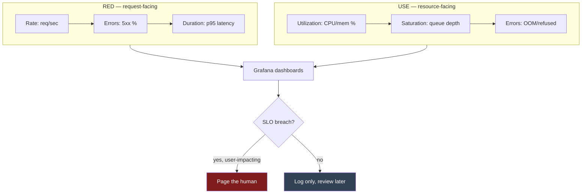
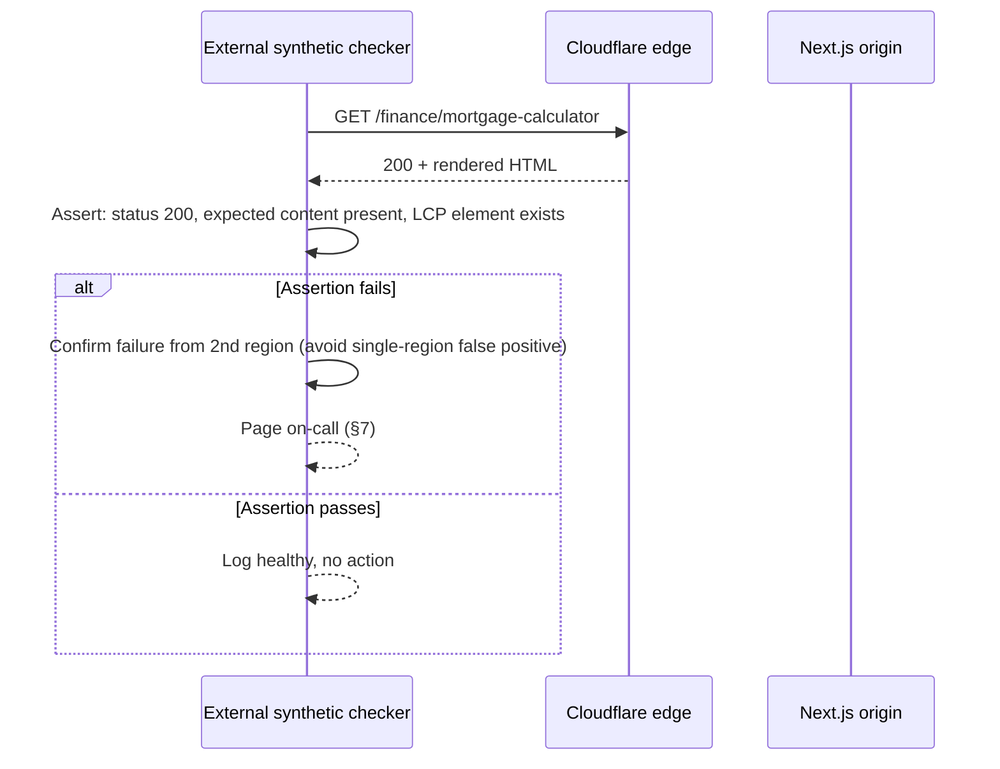
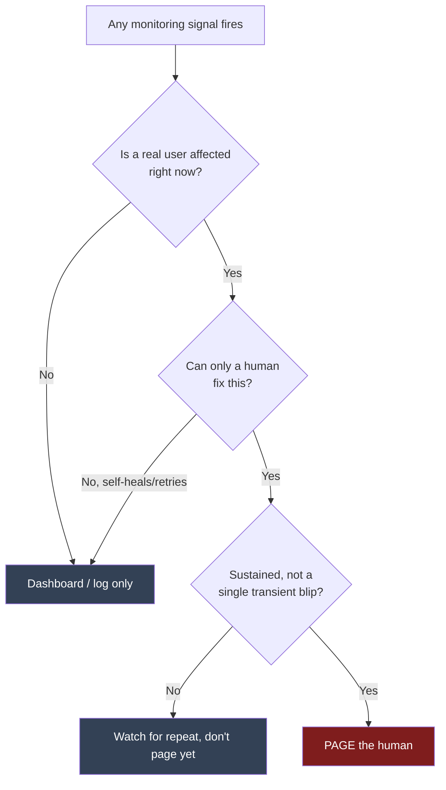

# 30 — Monitoring

> **Status:** Draft v1 · **Owner:** CTO / Solo Founder (on-call of one) · **Audience:** Whoever is carrying the pager — which, for a long time, is exactly one person
> **Governed by:** `00-ENGINEERING-PRINCIPLES.md` and the relevant prior chapters (`04-ARCHITECTURE-OVERVIEW`, `20-PERFORMANCE`, `21-CACHING`, `25-SECURITY`, `28-OBSERVABILITY`, `29-LOGGING`, `31-ANALYTICS`).

---

## 1. Monitoring Is Not Observability — and Both Are Not Analytics

`28-OBSERVABILITY` builds the raw material: traces, metrics, and structured logs (`29-LOGGING`) flowing out of every service via OpenTelemetry. `31-ANALYTICS` answers business questions: how many people used the `mortgage-calculator` this month, what's our MSTC. This chapter sits between them and answers one narrower, sharper question: **is the system healthy right now, and does a human need to be told?**

Monitoring turns the telemetry `28` collects into dashboards a person can read at a glance (Grafana), a place errors land instead of vanishing (Sentry), a heartbeat check from outside our own infrastructure (uptime/synthetic checks), and — the hardest part — a small, disciplined set of **alerts** that page a human only when a real user is actually affected.

| Concern | Chapter | Answers |
|---|---|---|
| Raw telemetry: traces, metrics, structured logs | `28`, `29` | What happened, in detail, for any given request |
| **Health & alerting (this chapter)** | `30` | Is it broken right now, and who needs to know? |
| Business/product metrics | `31` | Are we growing, and where? |

**Simple explanation:** think of a building's fire-safety system. The sensors wired into every room are observability (`28`) — they're always recording temperature and smoke. The panel in the security office that lights up red and the alarm that actually rings is monitoring (this chapter). A monthly report on how many people visited the building is analytics (`31`). All three matter, but only one of them should ever wake someone up at 3 a.m.

> **CTO note:** it is tempting, as a solo founder, to treat "I have Sentry installed" as "I have monitoring." Error tracking alone tells you code threw an exception — it says nothing about whether the site is actually up, whether tool pages are rendering correctly, or whether a silent regression (a cache misconfiguration serving stale HTML to everyone, `21`) is quietly killing SEO traffic with zero exceptions thrown anywhere. Monitoring has to cover availability and correctness, not just crashes.

---

## 2. The RED and USE Methods — Two Lenses, Not One

Two complementary, well-established frameworks structure every dashboard and alert in this chapter, so dashboards don't turn into an unstructured pile of graphs someone eyeballs and hopes covers everything.

**RED** (Rate, Errors, Duration) — for anything that serves *requests*: tool pages, Route Handlers, and, from Phase 3 onward, the public API and NestJS services (`11`, `22`).

| Signal | Question | Example metric |
|---|---|---|
| **Rate** | How much traffic is arriving? | Requests/sec per route, per tool category |
| **Errors** | What fraction is failing? | 5xx rate, unhandled exception rate (Sentry-sourced) |
| **Duration** | How long do requests take? | p50/p95/p99 latency per route |

**USE** (Utilization, Saturation, Errors) — for *resources*: the origin servers, the cache layers, and any server-side tool compute (`13`) that has a real, finite capacity to exhaust.

| Signal | Question | Example metric |
|---|---|---|
| **Utilization** | How busy is the resource? | CPU/memory % on origin instances, Redis memory usage (Phase 2) |
| **Saturation** | Is work queuing up waiting for it? | Request queue depth, DB connection pool wait time (Phase 2) |
| **Errors** | Is the resource itself failing? | OOM kills, connection refusals, Redis eviction rate |

**Simple explanation:** RED is watching the front counter of a shop — how many customers are walking in, how many walk out unhappy, how long the line takes. USE is watching the kitchen behind it — is the oven running too hot, is there a backlog of orders piling up, is any equipment actually broken. A shop can look fine at the counter (RED healthy) while the oven is one order away from overheating (USE degrading) — you need both views, or you only find out about capacity problems after they've already caused an outage.

Phase 1 has almost no USE surface — there's no database, no Redis, no server-side compute for most tools (`04`). RED against Next.js Route Handlers and Cloudflare's edge is the primary lens until Phase 2 introduces Postgres, Redis, and isolated server-tool runtimes with real capacity limits worth watching.

---

## 3. Grafana Dashboards — What Actually Gets a Screen

Dashboards are built from the metrics `28-OBSERVABILITY` exports via OpenTelemetry into Prometheus, visualized in Grafana. The discipline that keeps this useful at 1,000+ tools is **tiering** — not every tool gets its own dashboard; the platform gets a small number of dashboards that scale by structure, not by tool count.

| Dashboard | Scope | Primary audience |
|---|---|---|
| **Platform Health** | RED across all routes, aggregated; edge cache hit rate (`21`); Core Web Vitals field data (`20`) | First screen opened during any incident |
| **Tool Category Health** | RED broken down by category (`finance`, `developer`, `health`, …) — one row per category, not per tool | Spotting a category-wide regression (e.g. a shared component used by all `finance/*` tools) |
| **Server-Side Tool Danger Zone** | USE + RED for every `serverSide: true` tool (`13`) — the economic-risk minority | Watching cost-relevant compute specifically |
| **Infrastructure** | USE for origin compute, Redis, Postgres connections (Phase 2) | Capacity planning |
| **Deploy Correlation** | Vertical annotation on every dashboard marking deploy timestamps | Answering "did the last deploy cause this?" in seconds |

**Simple explanation:** picture a single-pilot cockpit, not a wall of a thousand identical gauges — one gauge per tool would be unreadable noise at scale. Instead there's one altitude gauge for the whole aircraft (Platform Health), a handful of system gauges grouped by function (fuel, hydraulics — Category Health), and a specially highlighted warning light only for the few systems that can actually run out of fuel mid-flight (the server-side tool danger zone). A solo founder needs a cockpit they can scan in ten seconds, not a data center's worth of individual dials.

> **CTO note:** the instinct with dashboarding tools is to build one for every new tool as it ships — "just in case." Resist this. A per-tool dashboard for tool #40 is fine; a per-tool dashboard for tool #900 is a dashboard nobody opens, decaying quietly until it's actively misleading (a broken panel nobody notices because nobody looks). Dashboards must be structured by **category and by risk tier** so they scale sub-linearly with tool count — exactly the same principle `13` applies to the plugin engine itself: the platform grows by folder count, not by platform code, and dashboards should follow the same law.

---

## 4. Sentry — Errors, Not Noise

Sentry is the error-tracking layer: every unhandled exception, every failed API call, every client-side JS error is captured with a stack trace, breadcrumbs, and release/version context (`29-LOGGING` defines the structured-context discipline that makes these useful rather than cryptic).

| Configuration choice | Why |
|---|---|
| **Source maps uploaded per deploy** | A minified production stack trace is useless without a source map to de-minify it back to the actual `calculator.ts` line |
| **Release tagging** | Every error is attributed to the exact deploy that shipped it — critical for "did this start after the last release" triage |
| **Fingerprinting grouped per tool slug** | An exception thrown from `mortgage-calculator`'s `calculator.ts` is a distinct issue from the same error class in `tile-calculator` — grouping by tool prevents one noisy tool from drowning out a rare one |
| **Sample rate tuned by traffic, not fixed at 100%** | At millions of monthly requests, 100% error capture on a noisy, low-severity client error (e.g. a browser extension conflict) is cost and noise without added signal; sample intelligently, always capture 100% of *new* error types |
| **PII scrubbing** | Consistent with `25-SECURITY`'s "we never receive what we don't need" posture — no raw tool input (a pasted JWT, a mortgage figure) is ever attached to an error event |

**Simple explanation:** Sentry is the shop's incident log — not a diary of every customer sneeze, but a record of every time something actually broke, who was working (which deploy), and enough detail to reproduce and fix it. Grouping by tool slug is like filing each broken register under the specific register's name instead of one giant "stuff went wrong" folder — so a chronic problem with the `jwt-decoder`'s input parser doesn't get buried under a flood of unrelated `bmi-calculator` noise.

> **CTO note:** Sentry catches exceptions — code that *throws*. It says nothing about a tool that runs without error but returns a mathematically wrong answer (a rounding bug in `percentage-calculator` that silently gives users the wrong number). That failure mode is a correctness bug, not an availability bug, and it's caught by `tests.spec.ts` (`13`, `39-TESTING`) and user-reported feedback — not by monitoring. Don't let "Sentry is quiet" become false reassurance that every tool is computing correctly; monitoring proves the system is *running*, not that it's *right*.

---

## 5. Uptime and Synthetic Checks — Monitoring from Outside

Everything in §3 and §4 depends on our own infrastructure being reachable and instrumented in the first place. If Cloudflare, DNS, or the origin itself goes fully dark, an internally-hosted dashboard may go dark with it. So an **external** check — run from infrastructure we don't control, that doesn't depend on our stack being up to report on our stack being up — is a separate, mandatory layer.

| Check type | What it verifies | Frequency |
|---|---|---|
| **Basic uptime ping** | The homepage and a handful of high-traffic tool pages return `200` from multiple global regions | Every 1–5 minutes |
| **Synthetic transaction** | A scripted flow — load `mortgage-calculator`, fill inputs, confirm the correct output renders — not just "did the page return 200" | Every 5–15 minutes |
| **DNS/SSL/certificate expiry checks** | Domain and certificate are valid and not approaching expiry | Daily |
| **Cross-region checks** | A regression visible only from certain geographies (a misconfigured Cloudflare edge rule) is caught, not just an origin-region-only check | Every check, multi-region by default |

**Simple explanation:** internal dashboards are like a shop owner watching CCTV from inside the shop — useless the moment the power (and the CCTV) goes out. An external synthetic check is a mystery shopper who physically walks up to the storefront from outside, on their own transport, and reports back whether the doors actually open and the till actually works — independent of whether anything inside the shop is functioning at all. The synthetic check on `mortgage-calculator` doesn't just confirm the page loads; it confirms a user can actually type numbers in and get a mortgage payment back.

> **CTO note:** a bare uptime ping ("did `/` return 200") is necessary but weak — Cloudflare can serve a cached 200 from the edge while the origin behind it is fully broken, masking a real outage until the cache expires. The synthetic transaction check that actually exercises a tool's calculation is what catches the scarier, quieter failure: the site *looks* up but is silently serving broken or stale functionality to real users.

---

## 6. Defining SLOs — the Thing We Actually Alert On

An **SLO (Service Level Objective)** is a target we hold ourselves to; an alert fires only when we're at risk of missing it. Without explicit SLOs, "alert on everything" is the default, and that default is what causes alert fatigue (§7). SLOs are deliberately few, deliberately generous while traffic is low, and tightened as real usage — and real risk — grows.

| SLO | Target (Phase 1) | Why this, not stricter |
|---|---|---|
| **Availability** (successful response rate, platform-wide) | 99.9% over 30 days | Matches a realistic single-person-operated, Cloudflare-fronted static site — not an enterprise 99.99% that assumes an on-call team |
| **Latency** (p95 TTFB, cached routes) | < 500ms | Generous headroom above the `20`-defined <200ms edge target; the SLO is the alerting floor, not the performance goal |
| **Error rate** (5xx, platform-wide) | < 0.5% of requests over 5 minutes | Distinguishes "a handful of odd requests" from "something is actually broken" |
| **Synthetic transaction success** | 100% of scheduled checks pass, 2 consecutive failures before paging | Avoids paging on a single transient blip (§7) |

An **error budget** is the practical tool this produces: 99.9% availability over 30 days permits roughly 43 minutes of downtime that month before the SLO itself is breached. Spending that budget on a deliberate, well-communicated migration is fine; burning it silently on flaky deploys is the signal to slow down and fix root causes, per `00`'s "quality is machine-enforced, not left to memory" ethos applied to reliability.

**Simple explanation:** an SLO is the promise you make to yourself about how good is "good enough," and the error budget is the amount of imperfection you're allowed to spend before that promise is broken. It's like a personal fitness goal of "run 20 miles a week" — missing one day because of a planned rest is fine and expected; missing every day for two weeks means something's actually wrong and needs attention, not a bigger goal poster on the wall.

> **CTO note:** resist importing "five-nines" targets from big-tech playbooks that assume a 24/7 on-call rotation across time zones. A solo founder chasing 99.99% availability will burn out chasing noise for gains a handful of users will never notice, while the actually load-bearing SLO — Core Web Vitals staying fast enough to keep ranking (`20`) — gets less attention than it deserves. Set SLOs that match the operating model you actually have, and tighten them deliberately as revenue (and the ability to hire) justifies the extra rigor.

---

## 7. Alert Fatigue Is the Real Enemy — Page Only on User Impact

This is the section that matters most for a solo founder: an alert that fires and doesn't require immediate action trains the on-call person (the only person) to start ignoring the pager. That's not a hypothetical — it's the single most common cause of missing the *real* incident, buried in a stream of noise from ones that weren't.

**The rule:** a page (phone call, SMS, push — something that interrupts sleep or focus) fires **only** when a real user is currently, actually affected, and only a human can fix it. Everything else is a dashboard entry, a log line, or a next-business-day ticket.

| Signal | Page? | Why |
|---|---|---|
| Synthetic transaction fails from 2+ regions, confirmed | **Yes, page** | Real users are, right now, unable to complete a tool — direct MSTC impact |
| SLO error budget burn rate spikes sharply (fast-burn alert) | **Yes, page** | At current rate, the monthly SLO will be blown within hours — real, ongoing user impact |
| Single Sentry exception, first occurrence, low volume | No — log, review next business day | One error is not yet a pattern; premature paging trains ignoring the pager |
| CPU/memory utilization elevated but no error/latency impact yet | No — dashboard only | A USE warning sign, not yet a RED user-facing problem; watch, don't wake anyone |
| Non-critical background job (e.g. a scheduled sitemap regeneration) fails once | No — retry + log | Self-healing systems (`28`) shouldn't need a human for their first failure |
| Dependency vulnerability scan finds a new high-severity CVE (`25`) | No — CI-blocking + ticket | Urgent, but not "wake up now" urgent — it blocks the next merge, which is enough pressure |

**Simple explanation:** a smoke detector that beeps for a burnt piece of toast every single week teaches the household to yank the battery out — right before the week there's an actual fire. The whole discipline in this section is picking a detector sensitive enough to catch a real fire but not so twitchy it fires on toast. For UToolios, "toast" is a single rare exception on one tool; "fire" is real visitors, right now, unable to get an answer from a tool that's supposed to be instant.

> **CTO note:** the most common mistake teams make copying "SRE best practice" wholesale is treating every SLO breach or every error as equally page-worthy. For a one-person team this is actively dangerous — it produces exactly the fatigue that causes the real incident to get slept through. A better model than a flat threshold is a **multi-window, multi-burn-rate alert**: page fast on a sharp spike (budget burning in hours), page slower/next-morning on a slow leak (budget burning in days). This single change is disproportionately valuable for solo-founder ops — it's the difference between "pager only rings for things that matter" and "pager rings constantly, gets muted, matters stop being caught."

---

## 8. Runbooks — Write the Fix Down Before You Need It at 3 A.M.

A page without a runbook means the on-call person starts debugging cold, from first principles, at the worst possible time. A **runbook** is a short, specific, pre-written document per alert type: what this alert means, how to confirm it's real, the most likely causes ranked by probability, and the first three commands/checks to run.

| Runbook section | Content |
|---|---|
| **Alert name & meaning** | Plain language: what condition triggered this, in one sentence |
| **Impact** | What a real user is experiencing right now (e.g. "tool pages in the `finance` category are returning 500s") |
| **First checks** | The 2–3 fastest ways to confirm scope: dashboard link, recent-deploys link, affected-category breakdown |
| **Likely causes, ranked** | Ordered by historical frequency — "bad deploy" is nearly always first for a solo-founder shop shipping daily (`07`) |
| **Mitigation** | The fastest safe action — usually rollback (`07`, `40-CI-CD`) — before root-causing |
| **Escalation** | For a team of one, this is "none" today; the field exists so it's a two-line addition, not a redesign, once a second engineer exists |

**Simple explanation:** a runbook is the laminated card taped inside a fuse box that says "if the kitchen lights go out, check breaker 4 first, it trips when the microwave and kettle run together." Without it, every outage is solved from scratch, under stress, at 2 a.m. With it, most incidents resolve in minutes because the most common cause and the fix are already written down, tested, and waiting.

> **CTO note:** runbooks decay silently if nobody re-reads them until the night they're needed — and that's exactly the night you discover the dashboard link in the runbook 404s because the dashboard got renamed. Runbooks need the same discipline as everything else in `00`: a lightweight, scheduled review (quarterly is enough at this stage) rather than a "write once, trust forever" document. The cheapest version of this discipline is simply re-running the runbook's own first-checks steps whenever a dashboard changes shape.

---

## 9. What Ties to `28` — the Division of Labor

`28-OBSERVABILITY` and this chapter are two halves of one system, and the seam between them matters enough to state explicitly so neither chapter quietly duplicates the other.

| Responsibility | Owned by |
|---|---|
| Instrumenting code with OpenTelemetry spans/metrics | `28` |
| Structured, context-rich log format (`08`'s "log with context" rule) | `29` |
| Storing/exporting metrics to Prometheus | `28` |
| **Visualizing metrics as dashboards, defining SLOs, deciding what pages a human** | `30` (this chapter) |
| Correlating a trace ID across a request's full path for debugging | `28` |
| **Sentry error capture and grouping, uptime/synthetic checks, runbooks** | `30` (this chapter) |

`28` builds the pipes; `30` decides what comes out of the tap and who gets called if the water stops. A new tool never needs to touch either layer directly (`13`) — the platform engine emits the same telemetry shape for every tool automatically, and this chapter's dashboards/alerts are structured by category and risk tier (§3), not rebuilt per tool.

---

## 10. What We Deliberately Don't Build Yet

Consistent with phasing (`04`), monitoring depth scales with what there is to monitor — a seam, not an over-build, in Phase 1.

| Capability | Why deferred | Activates |
|---|---|---|
| Multi-person on-call rotation / escalation policies | One person is on-call; escalation has nobody to escalate to | Phase 3, when hiring begins |
| Database/Redis-specific USE dashboards | No Postgres or Redis exists yet (`12`, `21`) | Phase 2 |
| Public API SLOs, per-customer status page | No public API/billing commitments exist yet (`22`) | Phase 3 |
| Deep RUM-driven Core Web Vitals alerting | Traffic too low for statistically meaningful field data (`20`) | Grows through Phase 2 as traffic approaches target (`01`) |
| Chaos engineering / game days | Premature without a team to run and learn from them | Post-Phase 3, once reliability engineering has dedicated headcount |

**Simple explanation:** we're not installing a hospital's multi-ward paging system for a single-doctor clinic. The clinic still needs a working phone and a clear list of "if X happens, do Y" — that's what this chapter builds now. The bigger system gets built when there's an actual team and actual scale that need it, not before.

---

## Summary

- Monitoring is distinct from observability (`28`, raw telemetry) and analytics (`31`, business metrics) — it answers one question: is the system healthy right now, and does a human need to be told?
- **RED** (Rate, Errors, Duration) covers request-facing signals; **USE** (Utilization, Saturation, Errors) covers resource-facing signals — dashboards and alerts are built from both lenses, not one.
- **Grafana dashboards are tiered** — Platform Health, Category Health, the server-side tool danger zone, and Infrastructure — never one dashboard per tool, so dashboarding scales sub-linearly with tool count.
- **Sentry** captures unhandled exceptions with release/version context and per-tool-slug grouping, but proves the system is *running*, not that a tool's math is *correct* — correctness is `tests.spec.ts`'s job (`13`, `39`).
- **External uptime and synthetic transaction checks** verify the system from outside our own infrastructure, and actually exercise a tool's calculation — not just a bare 200 status.
- **SLOs are set for the operating model we actually have** (solo founder, Cloudflare-fronted static site) — 99.9% availability, generous latency headroom — not imported five-nines targets that assume a 24/7 team.
- **The core discipline: page only on confirmed, sustained, user-impacting problems that need a human.** Everything else is a dashboard, a log line, or a next-business-day ticket — alert fatigue is the mechanism by which the real incident gets missed.
- **Runbooks** turn a 3 a.m. cold-start debugging session into a five-minute, pre-written first response, and need periodic review so their links and assumptions don't quietly rot.
- `28` builds the telemetry pipes; `30` decides what dashboard shows it and who gets paged — a clean division of labor, not overlapping ownership.
- Multi-person on-call, DB/Redis-specific dashboards, public API SLOs, and deep RUM alerting are explicit Phase 2/3 seams, matched to when there's a team, a database, and traffic to justify them.

> Next: `31-ANALYTICS.md` — turning the same telemetry into Monthly Successful Tool Completions and the other numbers that drive product and revenue decisions.

---

### Changelog
| Version | Date | Change | Reason |
|---------|------|--------|--------|
| v1 | (draft) | Initial monitoring and alerting strategy | Project inception |
