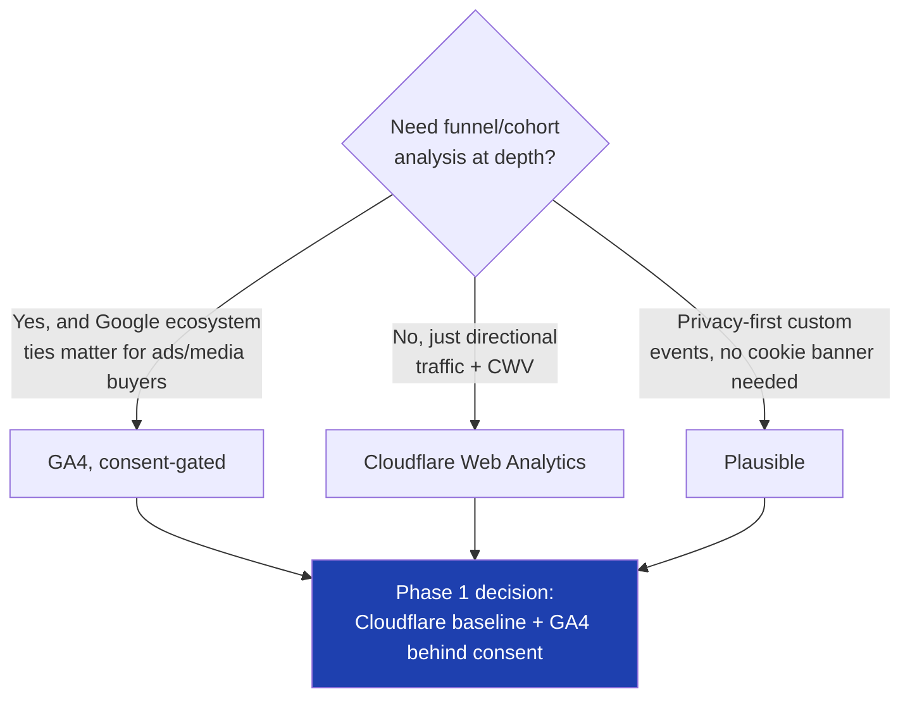
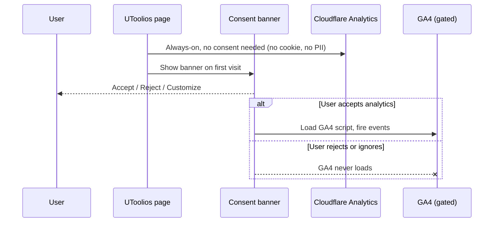
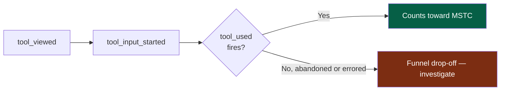
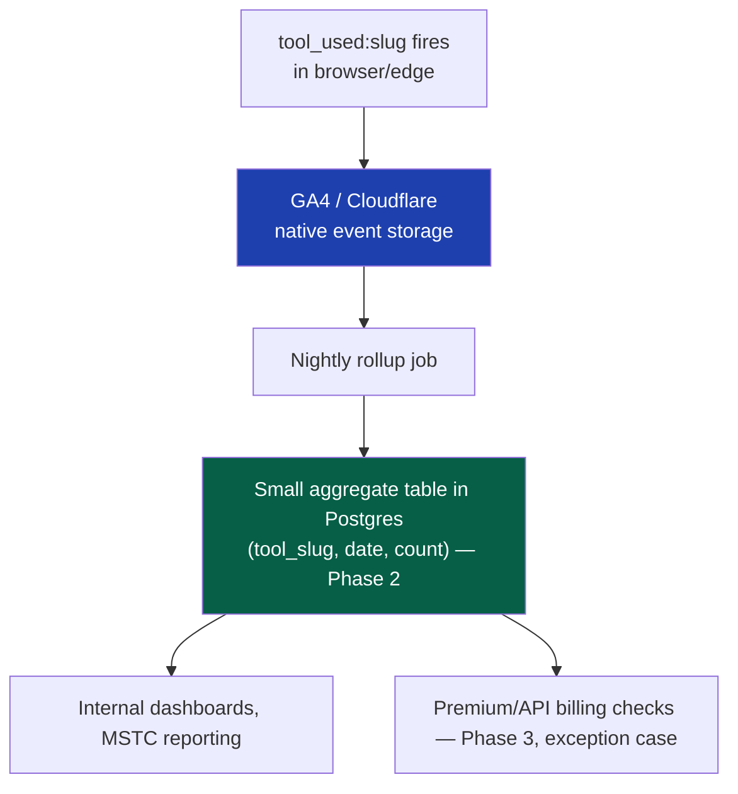

# 31 — Analytics

> **Status:** Draft v1 · **Owner:** CTO / Solo Founder (product analytics of one) · **Audience:** Whoever decides what gets built next, and whoever has to explain to an advertiser or advertiser-network why traffic looks the way it does
> **Governed by:** `00-ENGINEERING-PRINCIPLES.md` and the relevant prior chapters (`09-NAMING-CONVENTIONS`, `12-DATABASE-ARCHITECTURE`, `13-TOOL-PLUGIN-ARCHITECTURE`, `25-SECURITY`, `28-OBSERVABILITY`, `30-MONITORING`).

---

## 1. Analytics Answers a Different Question Than `28` and `30`

`28-OBSERVABILITY` and `30-MONITORING` exist to answer "is the system healthy right now, and does a human need to be told?" Analytics exists to answer a completely different question: **are we growing, where, and is anyone actually finishing what they came to do?**

| Concern | Chapter | Answers |
|---|---|---|
| Raw telemetry: traces, metrics, structured logs | `28`, `29` | What happened, in detail, for any given request |
| Health & alerting | `30` | Is it broken right now, and who needs to know? |
| **Business/product metrics (this chapter)** | `31` | Are we growing, where, and are users succeeding? |

A trace ID and a `tool_used` event can, in principle, describe the same underlying moment — a visitor loaded `mortgage-calculator` and got a number back — but they're consumed by different people for different reasons, at different volumes, retained on different timelines, and stored in different systems entirely (§6). Conflating them is the single most common analytics mistake at scale: teams pipe every click into the same store that holds financial-grade metering data, and end up with a system too slow for either job.

**Simple explanation:** a hospital's vital-signs monitor (observability, `28`) beeps continuously and is thrown away after the shift — nobody archives ten years of heartbeat traces. The hospital's discharge register (analytics) keeps a much smaller, much more durable record: who came in, what they were treated for, whether they walked out cured. Both matter. Only one of them is what the hospital's board reviews quarterly to decide whether to open a second wing.

> **CTO note:** it's tempting to reach for "just query the OpenTelemetry traces" for a growth question, because the data is technically already there. Resist this. Traces are optimized for debugging a single request; analytics needs to answer "how many *distinct* people completed the `bmi-calculator` this week" cheaply, repeatedly, and without touching PII-sensitive request payloads. Building the analytics answer on top of the observability pipeline couples two systems with opposite volume/retention/privacy requirements — the moment one needs to change, the other breaks.

---

## 2. Evaluating the Platform: GA4 vs. Cloudflare Analytics vs. Plausible

Three real candidates, each with a genuinely different trade-off. None is a strict winner — the choice tracks the phase and the privacy posture we've committed to.

| Platform | Model | Strength | Weakness for us |
|---|---|---|---|
| **Google Analytics 4 (GA4)** | Free, client-side JS tag, cookie-based by default, Google's data warehouse | Richest feature set (funnels, audiences, BigQuery export), zero infra to run, familiar to every advertiser/media buyer we'll eventually talk to | Third-party cookies + client-side script hurt privacy posture and page weight (`20`); data leaves our infrastructure into Google's; sampling kicks in at volume; not GDPR-friendly by default in the EU without consent-mode configuration |
| **Cloudflare Web Analytics** | Free, already-present at the edge (`04`), no client-side JS beacon at all — reads from the edge request logs | Zero performance cost (no script shipped to the browser at all), no cookies, privacy-friendly by construction, already paid for as part of our CDN | Coarse: page views, referrers, countries, Core Web Vitals — no event taxonomy, no funnels, no per-tool completion tracking |
| **Plausible (self-hosted or cloud)** | Lightweight (~1KB) script, no cookies, EU-hosted option, simple event API | Privacy-first by design, tiny script, supports custom events, good aggregate dashboards | Weaker at deep funnel/cohort analysis than GA4; self-hosting adds an operational surface (another service to run, patch, back up) that competes with Phase 1's "no backend yet" constraint (`04`) |



**The Phase 1 decision:** run **Cloudflare Web Analytics unconditionally** (it costs nothing — no script, no cookie, nothing to consent to, because it never touches the browser or personal data — and it's already sitting at the edge per `04`) as the privacy-safe baseline for aggregate traffic and Core Web Vitals. Layer **GA4 behind a consent gate** (§3) for the funnel and event-level detail advertisers and our own product decisions need — GA4's ecosystem ties (Google Ads, Search Console, AdSense reporting, `19`) matter enough at this business model that avoiding it entirely leaves real signal on the table. Plausible is re-evaluated as a GA4 replacement if EU traffic share, consent-rate friction, or Google-dependency risk make an independent, privacy-first analytics vendor worth the added operational line-item — but it is not a Phase 1 build, because standing up (or paying for) a second analytics vendor before the first one has even been proven out is exactly the over-build `00`'s YAGNI principle warns against.

**Simple explanation:** Cloudflare Web Analytics is like a store's foot-traffic counter mounted above the door — it silently counts everyone who walks in without asking their name, and it's already bolted to the doorframe we own. GA4 is like a detailed customer survey at the register — much richer, but it requires asking first (consent), and the data goes into a filing cabinet in someone else's building (Google's). Plausible is a similar survey run entirely on our own filing cabinet, but we have to build and maintain that cabinet ourselves. We start with the free counter everyone gets by default, add the richer survey only for people who agree to it, and only consider building our own cabinet if the rented one stops fitting.

> **CTO note:** the honest trade-off here is dependency risk versus feature richness. GA4 is free and powerful specifically because Google is the primary buyer of the ad inventory this whole business model runs on (`03`, `19`) — using their analytics stack alongside their ad stack is a pragmatic alignment of incentives, not just a feature choice. The cost is architectural lock-in to Google's taxonomy and reporting UI. We mitigate this the same way we mitigate every third-party dependency in this constitution: behind our own event-emission interface (§4), so if GA4 needs replacing later, we swap the sink, not the instrumentation scattered through 1,000+ tool folders.

---

## 3. Privacy-First by Default, Consent Where It's Legally Required

Analytics collects data about real people, which puts this chapter squarely inside the boundary `25-SECURITY` draws around "we minimize what we collect and protect what we must." Two principles govern every decision here, in order of priority:

1. **First-party and aggregate wherever it's sufficient.** Cloudflare Web Analytics never needs consent because it never runs client-side JS, never sets a cookie, and never ties an event to an individual — it's structurally incapable of being a privacy problem. Prefer this shape everywhere it answers the question.
2. **Consent before anything identifying.** GA4 (or any client-side, cookie-capable tool) only loads *after* a visitor has made an affirmative choice via a **Consent Management Platform (CMP)** banner, and only loads the scope they agreed to. No dark patterns, no pre-ticked boxes, no "analytics" bundled silently into "necessary" cookies.

| Consent state | What loads |
|---|---|
| No interaction yet / banner not answered | Cloudflare Web Analytics only (no consent needed, structurally cookie-free) |
| Rejected | Cloudflare Web Analytics only — the site works identically, no feature is gated behind accepting tracking |
| Accepted (analytics category) | GA4 loads, with IP anonymization and Google's Consent Mode signals passed through |
| Accepted (advertising category, separate toggle) | Ad personalization signals (`19`) — analytics and ad consent are separate toggles, not one bundled checkbox |



**Simple explanation:** think of a shop with a foot-traffic counter above the door (always on, counts silhouettes, no names) and a loyalty-card scanner at the register (only scans if you hand over the card). Nobody has to consent to being counted as a silhouette walking in — there's nothing personal in that count. But nobody's loyalty card gets scanned until they've actually handed it over. Using the `jwt-decoder` never requires accepting anything to get an answer; declining the banner changes only whether GA4 sees the visit, never whether the tool works.

> **CTO note:** a genuinely honest trade-off worth naming — rejecting consent-gated GA4 for a meaningful share of EU visitors means a real, permanent blind spot in the funnel data (§5) for that traffic. The temptation is to make acceptance "easier" through banner design (pre-selected toggles, confusing wording) to recover that signal. Don't. Beyond the legal exposure (GDPR/ePrivacy, `26`), a business built on long-tail SEO trust cannot afford to be the site that dark-patterned its way past a privacy choice — that reputational cost compounds against exactly the organic trust signals `14`/`17` depend on. Accept the blind spot; it's real, and Cloudflare's aggregate numbers still tell us directional truth even where GA4 can't.

---

## 4. The Event Taxonomy — Keyed on the Canonical Slug

`09-NAMING-CONVENTIONS` (§5) establishes the platform's single most load-bearing rule: **one concept, one canonical name, everywhere** — folder, URL, config `id`, database column, and analytics event all share the exact same `kebab-case` slug string. Analytics inherits this directly and is arguably where it pays off hardest, because it's the layer a non-engineer (a future marketer, an ad-network account manager) will query most often.

**The core event:**

```
tool_used:<slug>
```

Every tool emits exactly this event shape, with the slug as both a suffix in the event name and a property — redundant on purpose, because different analytics tools query differently (some filter well on event name, some on properties) and duplicating a free string costs nothing.

| Event | Fires when | Key properties |
|---|---|---|
| `tool_viewed:<slug>` | Tool page rendered and interactive | `slug`, `category`, `referrer_type` (search/direct/internal-link) |
| `tool_input_started:<slug>` | First keystroke/interaction with any input field | `slug` |
| `tool_used:<slug>` | A calculation/transformation successfully completes (the core "success" event, §5) | `slug`, `category`, `input_shape` (e.g. `"3-field"` — never raw input values) |
| `tool_error:<slug>` | Calculation fails validation or throws | `slug`, `error_category` (never raw error text or user input, `25`) |
| `tool_shared:<slug>` | Result share/copy/export action used | `slug`, `share_method` |
| `related_tool_clicked:<slug>→<target_slug>` | Internal link (`18`) followed to another tool | `slug`, `target_slug` |

Because the engine — not each tool author — owns event emission (`13`), a tool author never writes analytics code. `calculator.ts` stays a pure, framework-free function (`04`); the platform's rendering shell fires `tool_used:<slug>` the instant `calculator.ts` returns successfully, with the slug read directly off `tool.config.ts`. Adding tool #501 produces correctly-taxonomized events automatically — zero platform code changes, exactly the guarantee `13` makes for everything else.

**Simple explanation:** imagine every product in a warehouse had its barcode printed identically on the box, the shelf label, the invoice, and the sales report — you could trace one product from delivery truck to sales chart using one number, no translation needed. `mortgage-calculator` is that barcode: the same string is the folder name, the URL, the database row, and the analytics event (`tool_used:mortgage-calculator`). When a specific tool's usage spikes or drops, there's exactly one string to search across every system to find out why.

> **CTO note:** the discipline that actually matters here isn't the taxonomy table above — it's that the taxonomy is enforced by the engine, not by convention that individual tool authors (increasingly AI-generated, `00` B3) are trusted to remember. A generated tool that gets the slug right in `tool.config.ts` but wrong in a hand-rolled analytics call is a silent data-quality bug that's invisible until someone notices a tool with suspiciously zero recorded usage. Event emission belongs in the shared rendering shell precisely so no tool folder can get it wrong.

---

## 5. The North Star: Monthly Successful Tool Completions (MSTC)

`00-ENGINEERING-PRINCIPLES` names **Monthly Successful Tool Completions (MSTC)** as the platform's North Star metric. This chapter is where MSTC is actually defined, computed, and protected from the metrics that look similar but measure the wrong thing.

**Definition:** MSTC counts a `tool_used:<slug>` event — a successful completion, not a page view, not a click, not a session — deduplicated per visitor per tool per session, summed across all tools, over a rolling calendar month.

| Metric | What it measures | Why it's *not* the North Star |
|---|---|---|
| Page views | Someone loaded a URL | Says nothing about whether they got what they came for — a bounced visitor and a satisfied one both counted equally |
| Sessions | Someone visited the site | Doesn't distinguish one tool used well from ten tools abandoned |
| Ad impressions | An ad rendered | Directly monetizable (`19`) but actively *misaligned* as a North Star — optimizing for impressions over completions is how a site degrades into something users leave, which kills long-term SEO and revenue both |
| **MSTC (North Star)** | A **visitor got a correct answer from a tool** | Directly reflects the product's entire reason to exist — everything else (traffic, ads, affiliate, premium) is downstream of people actually completing tools |



**The funnel this defines** (View → Input Started → Used) is the single most useful diagnostic surface in the whole analytics layer. A tool with high views but low completions (e.g. a `tile-calculator` visitor loading the page but never getting a result) points at a UX or clarity problem in the tool itself; a tool with high views *and* high completions but low return visits points at a different problem entirely (discoverability of related tools, `18`). MSTC broken down per category, per tool, and per traffic source turns "are we growing" from a vague feeling into a specific, actionable, per-tool-folder answer.

**Simple explanation:** a restaurant doesn't measure success by how many people walked past the window (page views) or even walked in the door (sessions) — it measures how many people ordered a meal, got it, and ate it (completions). A `bmi-calculator` visitor who lands on the page, types in a height and weight, and sees their BMI is a completed meal. A visitor who lands, gets confused by an unclear field label, and leaves without an answer walked in and walked back out hungry — and no amount of ad impressions served during that visit changes that the core product failed them.

> **CTO note:** the sharpest trade-off in this whole chapter is that ad revenue (§ 19, this business's actual near-term income) is measured in impressions and RPM, while the North Star is measured in completions — and these two numbers can diverge. It is entirely possible to juice short-term ad revenue by adding friction that increases page views without increasing completions (extra clicks before showing a result, more ad-laden intermediate steps). This constitution rejects that trade explicitly: MSTC governs product decisions, ad revenue is a downstream consequence of a healthy MSTC, never the other way around (`19`'s "ads never sit in front of the answer" rule is this principle enforced in the UI layer). A CTO who lets the ad-revenue dashboard become the de facto North Star, because it's the number that pays the bills this month, is trading long-term compounding SEO/retention value for a short-term number — watch for this drift specifically, because it's the single most common way an ad-funded content business quietly poisons itself.

---

## 6. Keeping High-Volume Events Out of Postgres

`12-DATABASE-ARCHITECTURE` (§7 CTO note) already flags this explicitly: usage/analytics tables grow *fast* — a row per tool completion, across millions of monthly completions at target scale (`01`) — and left unmanaged become the platform's single biggest, slowest table, dragging down every query that touches it.

The rule this chapter enforces: **raw, per-event analytics data never lands in the primary application database.** Postgres (Phase 2 onward, `12`) holds only what genuinely needs relational integrity — accounts, billing records, entitlements. Everything at `tool_used:<slug>` volume lives in purpose-built analytics stores instead.

| Data | Lives in | Why |
|---|---|---|
| Raw per-event stream (`tool_used:<slug>` at full volume, every occurrence) | GA4 / Cloudflare Analytics native storage (BigQuery export for GA4 if deep analysis is ever needed) | Purpose-built for high-cardinality, high-volume event data; querying it doesn't compete with application-critical Postgres load |
| Rolled-up daily/monthly aggregates (MSTC per tool, per category) | A small, slow-growing Postgres table (Phase 2 onward) — one row per tool per day, not one row per event | Small enough for relational joins against tool metadata (`13`), premium entitlement checks (`24`), and internal dashboards, without ever ingesting raw event volume |
| Billing-relevant metering (API call counts against a paid quota, Phase 3) | Postgres, because correctness and auditability matter for money | This *is* the kind of data `12` says belongs in Postgres — it's the exception, not the pattern |



**Simple explanation:** a national retail chain doesn't log every single till-scan of every barcode, forever, in the same database that holds employee payroll and store leases — that database would grind to a halt under the sheer scan volume, and payroll doesn't need that detail anyway. Instead, scan data lives in a system built for high-volume retail data, and only a nightly summary ("store #12 sold 4,200 units of item X yesterday") lands in the smaller system that also runs payroll. UToolios does the same: raw `tool_used:mortgage-calculator` events live in GA4/Cloudflare's own storage, and only a tiny daily count row ever reaches Postgres.

> **CTO note:** this separation is not premature optimization — it's avoiding a specific, well-documented failure mode. A metering table with one row per event, at millions of monthly completions, becomes the largest table in the database within months, and every unrelated query (an account lookup, an entitlement check) starts competing with it for I/O and cache. The fix applied *after* that table has already grown to tens of millions of rows is a painful, downtime-risking migration; the fix applied *before* is simply "don't put it there in the first place." Because Postgres doesn't exist until Phase 2 anyway (`04`, `12`), this constraint costs nothing to honor now and prevents a real Phase 2/3 incident later.

---

## 7. Instrumentation — Where Events Actually Get Fired

Consistent with `13`'s plugin contract, event instrumentation lives in exactly one place: the shared rendering shell that every tool page runs through, never in a tool's own `calculator.ts` or `schema.ts`.

| Layer | Responsibility |
|---|---|
| `calculator.ts` (per tool) | Pure computation. Never imports an analytics client, never knows analytics exists (`04`'s framework-free core). |
| Rendering shell (`page.tsx`, shared, `10`) | Fires `tool_viewed`/`tool_input_started`/`tool_used`/`tool_error` automatically, reading `slug`/`category` off `tool.config.ts` |
| Analytics client wrapper (`packages/core`) | A thin, swappable interface (`trackEvent(name, props)`) behind which GA4/Cloudflare/Plausible calls actually live — the CTO note in §2 depends on this existing |
| CMP integration | Gates whether the GA4 branch of the wrapper is even initialized (§3) |

This mirrors the `AdSlot` abstraction pattern from `19` almost exactly: a thin interface the platform depends on, with the actual vendor SDK swappable behind it without touching a single tool folder.

**Simple explanation:** every tool plugs into the same electrical socket in the wall (the rendering shell); the wiring behind that socket wall (the analytics client wrapper) is our own, and we can rewire what's behind the wall — swap GA4 for Plausible, add a new vendor — without any tool ever needing to know or care what's plugged in on the other side.

---

## 8. What Ties to `12`, `09`, `30`

| Chapter | The seam |
|---|---|
| `09-NAMING-CONVENTIONS` | Defines the canonical-slug rule this chapter's entire event taxonomy is built on (§4) — analytics doesn't invent naming, it inherits it |
| `12-DATABASE-ARCHITECTURE` | Defines where aggregates *do* eventually land in Postgres (Phase 2), and flags the exact high-volume-table risk this chapter's §6 rule prevents |
| `30-MONITORING` | Shares the same underlying event stream in principle, but asks "is it broken" while this chapter asks "are we growing" — see §1's table; the two never share a dashboard or an alert threshold |
| `13-TOOL-PLUGIN-ARCHITECTURE` | The reason instrumentation lives in the shell, not the tool — engine-owned event emission is a direct consequence of the plugin contract |
| `19-ADS-ARCHITECTURE` | The consent-gate mechanics (§3) are shared infrastructure — one CMP, two consent categories (analytics, advertising), not two banners |

---

## 9. What We Deliberately Don't Build Yet

Consistent with phasing (`04`), analytics depth scales with what there is to analyze — a seam now, not an over-build.

| Capability | Why deferred | Activates |
|---|---|---|
| Self-hosted Plausible / independent analytics vendor | Cloudflare + consent-gated GA4 already covers Phase 1 needs; a second vendor is operational weight without a proven gap | Re-evaluated if GA4 dependency risk or EU consent-rate friction becomes measurably costly |
| Postgres-backed aggregate MSTC tables | No Postgres exists yet (`04`, `12`) — MSTC is read directly from GA4/Cloudflare dashboards in Phase 1 | Phase 2, alongside the database's arrival |
| Cohort/retention analysis, LTV modeling | Needs accounts to define a "returning identified user" meaningfully (`23`) | Phase 3, alongside auth |
| Public API usage analytics / per-customer dashboards | No public API exists yet (`22`) | Phase 3 |
| A/B testing / experimentation platform | Needs enough traffic per tool for statistical significance, and a real hypothesis backlog | Grows through Phase 2 as traffic approaches the `01` target |

**Simple explanation:** we're not building a full business-intelligence warehouse for a site that doesn't have a database yet. Phase 1 analytics is deliberately just enough to know which tools work and which don't — read straight from GA4/Cloudflare's own dashboards. The bigger system (aggregated Postgres tables, cohort analysis, experimentation) gets built exactly when there's a database, accounts, and traffic volume that make it worth the operational cost.

> Next: `32-DOCUMENTATION.md` — how tool authorship, ADRs, and this constitution itself stay maintained as the platform scales past a solo founder.

---

### Changelog
| Version | Date | Change | Reason |
|---------|------|--------|--------|
| v1 | (draft) | Initial analytics and North Star metric strategy | Project inception |
