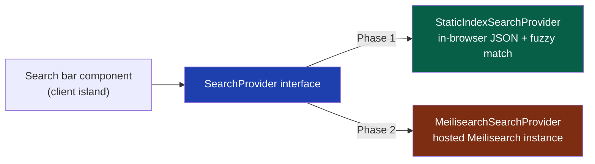
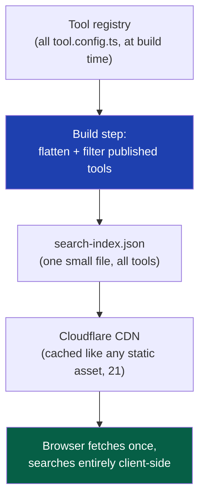
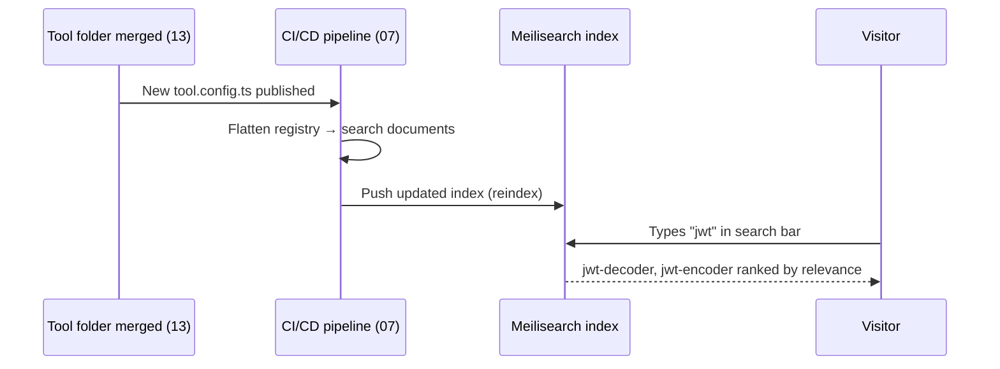

# 32 — Search

> **Status:** Draft v1 · **Owner:** CTO / Principal Architect · **Audience:** Frontend engineers, the future search/relevance owner, anyone adding a tool
> **Governed by:** `00-ENGINEERING-PRINCIPLES.md` and the relevant prior chapters (`04-ARCHITECTURE-OVERVIEW`, `13-TOOL-PLUGIN-ARCHITECTURE`, `14-SEO-ARCHITECTURE`, `18-INTERNAL-LINKING`, `21-CACHING`).

---

## 1. What Search Has to Do — and What It Isn't

UToolios's primary discovery channel is external: long-tail SEO (`14`, `17`) that lands a visitor directly on `/finance/mortgage-calculator` from Google. Site search is not that channel. Its job is narrower and entirely internal: once a visitor is *on* UToolios — on the homepage, a category page, or an unrelated tool — let them find any of the (eventually) 1,000+ other tools in under a second, without waiting on Google to re-crawl anything.

This matters most in three recurring situations: a visitor who lands on `bmi-calculator` and wants `body-fat-percentage-calculator` next; a returning visitor who half-remembers "that JWT thing" and types `jwt`; and — critically — a **brand-new tool that hasn't been indexed by Google yet**. Internal linking (`18`) handles the "related tools" case structurally. Search handles the "I know roughly what I want, let me type it" case, and it is often the *only* way a freshly-shipped tool gets discovered at all before its own SEO ranks.

> **CTO note:** it's tempting to treat search as a nice-to-have UI widget. It isn't. At 1,000+ tools, a visitor who can't find the right tool in the search box bounces to Google and searches *there* instead — handing a session, and the ad impressions in it, back to a competitor's result. Search is a retention feature disguised as a UI feature; it directly protects Monthly Successful Tool Completions (`00`, `31`) by keeping the visitor inside the platform.

**Simple explanation:** think of UToolios as a very large hardware store. SEO is the sign on the highway that gets a customer to pull in for "cordless drill." Once they're inside, they don't want to walk every aisle to find sandpaper too — they want a directory they can type into. That directory is this chapter. It doesn't replace the highway signs; it keeps the customer shopping once they've already walked through the door.

---

## 2. The Search Interface — Replaceable by Design

Consistent with `00`'s "Everything Replaceable" principle, no component in the platform calls a search backend directly. Every query goes through one interface, defined once in `packages/core`:

```ts
interface SearchProvider {
  search(query: string, options?: SearchOptions): Promise<SearchResult[]>;
}

interface SearchOptions {
  category?: string;      // facet filter
  limit?: number;
  locale?: string;        // seam for Phase-3 i18n
}

interface SearchResult {
  slug: string;           // canonical id (09) — doubles as the route
  title: string;
  category: string;
  summary: string;
  score: number;
}
```

The UI — a search bar, a results dropdown, a category filter — is written once against `SearchProvider` and never against a specific backend. Two implementations exist across the platform's lifetime: `StaticIndexSearchProvider` (Phase 1, §4) and `MeilisearchSearchProvider` (Phase 2, §6). Swapping one for the other is a configuration change and a new file behind the same interface — not a UI rewrite.



**Simple explanation:** this is the same "wall socket" pattern as `AdSlot` (`19`) and the tool plugin contract itself (`13`). The search bar plugs into a standard socket; what's on the other end of the wire — a flashlight battery today, the city power grid tomorrow — is an implementation detail the socket doesn't need to know about.

> **CTO note:** the temptation with any interface like this is to over-generalize it up front — add fields "just in case" for facets, typo tolerance, or synonyms that only Meilisearch will ever use. Resist it. The interface above is deliberately minimal: it's exactly what a static JSON index can satisfy today. Phase 2 extends `SearchOptions`, it doesn't rewrite the contract — YAGNI (`00`) applies to interfaces as much as to infrastructure.

---

## 3. The Tool Registry Is the Single Source of Truth

Nothing about search introduces new data entry. Every tool already declares `id`, `title`, `category`, `summary`, and `tags` in its `tool.config.ts` (`13`) — the exact fields a search index needs. The engine's build-time discovery step (`13`, §2: Discover → Validate → Register) is extended with one more output: a flattened, search-ready document per tool, written once at build time and consumed identically by whichever `SearchProvider` is active.

| Registry field (`13`) | Search index field | Purpose |
|---|---|---|
| `id` / `slug` | `slug` | Canonical identifier and route (`09`) |
| `title` | `title` | Primary matched/displayed field |
| `summary` | `summary` | Secondary matched field, shown in result preview |
| `tags` | `tags` (searchable, not displayed) | Catches synonyms and related terms ("home loan" → `mortgage-calculator`) |
| `category` | `category` | Facet (§5) |
| `tier` | `tier` | Ranking signal (§7) |
| `status` | (filtered) | Only `published` tools ever reach the index |

**Simple explanation:** the search index is a photocopy of the same move-in form every tool already filled out for the engine (`13`) — nobody writes a separate "search entry" for a tool, the same way nobody re-types their address for a second directory once they've given it to the building manager once. One source of truth, two consumers (the routing engine and the search index).

---

## 4. Phase 1 — A Static, Prebuilt Index

At Phase 1 scale (tens to low hundreds of tools, no database, no backend — `04`), a full search service is a solution in search of a problem. Instead, a build step walks the tool registry and emits a single static JSON file, `search-index.json`, published to Cloudflare's CDN (`21`) exactly like any other static asset — cached hard, invalidated only on deploy.



The browser fetches this file once (a few tens of KB even at 1,000 tools — it holds only `slug`, `title`, `summary`, `tags`, `category`, no article content) and searches it entirely client-side, with zero server round-trips per keystroke. Matching is done with a small, dependency-light fuzzy-match library rather than exact substring matching, so a typo ("mortgae") or a partial word still surfaces `mortgage-calculator`.

| Option | Bundle cost | Typo tolerance | Verdict |
|---|---|---|---|
| Exact substring match (hand-rolled) | ~0 KB | None | Too brittle — a single typo returns nothing |
| Fuse.js | ~7 KB gzipped | Good, configurable | **Chosen for Phase 1** — small, no dependencies, well-understood |
| FlexSearch | ~5–15 KB depending on config | Good | Viable alternative; Fuse.js's simpler API wins for a solo founder's maintenance load |
| A hosted search API in Phase 1 | Network round-trip + real infra cost | N/A | Rejected — no backend exists yet (`04`); wildly disproportionate to tens of tools |

**Simple explanation:** this is a phone book printed once a day and handed to every visitor at the door. Flipping through a small, well-organized phone book with your finger is instant and costs nothing to operate — no phone line, no operator, no server. It only becomes the wrong tool once the phone book gets thick enough that flipping through it by hand (or, here, transferring and fuzzy-matching an ever-larger JSON blob in the browser) stops being instant.

> **CTO note:** the honest limitation of Phase 1 search: it has no real relevance model. Fuse.js's fuzzy scoring is "good enough" for a few hundred short tool titles, but it has no concept of popularity, no faceted filtering UI worth building against a client-side blob, and no typo tolerance tuned per language. That's a deliberate, named trade-off, not an oversight — the alternative (standing up a search service for a catalog small enough to fit in a phone's memory) would be over-engineering for zero users, which `00` explicitly forbids.

---

## 5. What Triggers Phase 2

The static index doesn't fail suddenly — it degrades gradually, and the triggers below are watched, not guessed at:

| Trigger | Why it breaks the static model |
|---|---|
| Catalog size (roughly 500–1,000+ published tools) | The JSON payload and in-browser fuzzy-match cost start showing up in bundle size and low-end-device CPU time — a `20`-relevant regression |
| Need for real faceted browsing (filter by category **and** tier **and** "server-side only" simultaneously, with live counts) | Client-side filtering over a flat array doesn't scale to compound facets with counts the way a real search engine does natively |
| Need for relevance tuned by actual usage (boost tools with high MSTC, `31`) | A static index has no server-side place to apply a ranking signal that updates without a full redeploy |
| Multi-language tool titles/synonyms (i18n, deferred per `00`) | Client-side fuzzy match has no per-language tokenization; a real search engine does |
| Query volume high enough that instant, typo-tolerant, faceted search materially affects MSTC | The business case for the operational cost of a search service now exists — it didn't before |

Until two or more of these are true simultaneously, Phase 1's static index is the correct, cheapest, fastest-possible answer — not a placeholder to feel embarrassed about.

---

## 6. Phase 2 — Meilisearch, and Why Not Elasticsearch/OpenSearch

When the triggers in §5 fire, the `MeilisearchSearchProvider` implementation activates behind the same `SearchProvider` interface (§2) — the UI does not change. Meilisearch, not Elasticsearch or OpenSearch, is the deliberate choice for this workload.

| Dimension | Elasticsearch / OpenSearch | Meilisearch |
|---|---|---|
| Operational footprint | JVM-based, cluster coordination (nodes, shards, replicas), meaningful memory floor even for a small index | Single Rust binary, no JVM, no cluster to reason about at this scale |
| Time-to-first-query | Hours to configure analyzers, mappings, and relevance manually | Minutes — typo tolerance, prefix search, and sane ranking rules are on by default |
| Typo tolerance | Requires explicit fuzzy-query configuration per field | Built in, tuned automatically by word length |
| Query latency for this workload | Sub-50ms achievable, but requires tuning | Sub-50ms out of the box for catalogs of this size |
| Fit for the actual job (instant, typo-tolerant lookup over a few thousand short documents) | Over-built — Elasticsearch's strength is complex aggregations and log/analytics workloads (already `28`'s and Prometheus's job here) | Purpose-built for exactly this: instant-search UX over a product/content catalog |
| Team size this assumes | Effectively expects a person who owns search/relevance full-time | A solo founder can run and reason about the whole thing |

> **CTO note:** this is a case where the "boring, industry-standard" choice (Elasticsearch) is actually the wrong pick for the job, and picking it out of habit would be over-engineering, not rigor. Elasticsearch earns its operational cost when the workload is genuinely complex — heavy aggregations, huge multi-tenant indices, or log analytics (a job `28-OBSERVABILITY` already gives to a purpose-built pipeline). A catalog search over a few thousand short tool documents is not that workload, and running a JVM cluster to serve it is capacity nobody at this stage has to spend babysitting. The honest trade-off: Meilisearch is a younger project with a smaller ecosystem and fewer enterprise integrations — if UToolios someday needs deep faceted analytics *inside* the search engine itself, that's a re-evaluation point, not an assumption baked in today.

**Simple explanation:** Elasticsearch is an industrial warehouse-management system built for warehouses the size of small cities — powerful, but it needs a dedicated logistics team to run. Meilisearch is a very good, purpose-built shop directory kiosk: plug it in, it works instantly, typo-tolerant, and one person can maintain it. UToolios, even at 1,000+ tools, is closer to a very large shop than a logistics network — the kiosk is the right tool.

---

## 7. Index Design — Documents, Facets, Ranking

In Phase 2, one Meilisearch document per tool is generated by the same registry-flattening build step described in §3 — the source of truth never changes, only the consumer does. The index adds three things a static JSON blob can't reasonably offer:

| Feature | Configuration |
|---|---|
| **Facets** | `category`, `tier`, `serverSide` — filterable with live result counts in the UI |
| **Ranking rules** | Meilisearch's default order (typo → words → proximity → attribute → exactness) plus one custom rule: boost by `tier` and, once available, a normalized popularity score derived from MSTC (`31`) |
| **Searchable attributes, weighted** | `title` weighted highest, `tags` next, `summary` last — a query matching the title should always outrank one only matching body summary text |
| **Synchronization** | Reindex triggered by the same CI/CD deploy pipeline (`07`) that publishes a new tool — never a manual step, so the index can never silently drift from the registry |



**Simple explanation:** the ranking rules are the shop directory kiosk deciding what to show first when someone types "phone" — an exact-title match ("Phone Charger Calculator") outranks something that merely mentions phones once in a paragraph, and a popular, frequently-used tool nudges ahead of an obscure one when both are otherwise equally good matches. None of this is hand-tuned per tool — it's one small set of rules applied uniformly across every document, exactly like the plugin engine applies one contract uniformly across every tool (`13`).

---

## 8. Instant-Search UX

The UX contract is identical across both phases — only the backend behind `SearchProvider` differs — and is non-negotiable regardless of which implementation answers the query:

| Requirement | Detail |
|---|---|
| Debounced input | ~150ms debounce before firing a query — avoids a query per keystroke |
| Results as you type | No "press enter" required; results update live in a dropdown below the search bar |
| Highlighted matches | The matched substring in `title`/`summary` is visually highlighted in results |
| Keyboard navigation | Arrow keys move through results, `Enter` navigates, `Esc` closes — no mouse required |
| Category facet chips (Phase 2) | Filter results by category without leaving the search box |
| Empty-state guidance | No results still shows a helpful state — top categories or "try a broader term" — never a bare blank box |
| Analytics event on search | Every query (term + result count + whether a result was clicked) is logged as an event (`31`) — this is also the raw signal that eventually feeds the popularity ranking boost in §7 |

The search UI is a client component (`10`) — an interactive island rendered inside an otherwise static/SSG page (`04`) — so it never forces a tool page itself into server-side rendering.

---

## 9. Relevance Signals Over Time

Phase 1 relevance is static and manual: ranking rules and field weighting are set once and revisited occasionally. Phase 2 introduces the possibility of a genuine feedback loop — the same MSTC and search-analytics events described in §8 feeding back into §7's popularity boost, so a tool that reliably helps visitors complete their task climbs naturally, while a tool nobody finishes using does not.

> **CTO note:** this feedback loop is worth building deliberately, not accidentally. A naive version — "boost by raw click count" — is trivially gamed by anything that inflates impressions without real usage, and it also unfairly buries a brand-new, genuinely useful tool that hasn't accumulated clicks yet. The signal worth boosting on is *completion* (a real calculation run, per `31`'s MSTC definition), not *click*, and new tools need a deliberate grace-period floor in the ranking so the rich-get-richer dynamic doesn't calcify the top results forever.

---

## 10. What We Deliberately Don't Build Yet

| Capability | Why deferred | Activates |
|---|---|---|
| Meilisearch itself | No backend/database exists yet in Phase 1; a static index is faster to ship and free to run (`04`) | Phase 2, per the triggers in §5 |
| Per-query search analytics dashboards | No meaningful query volume yet to analyze | Phase 2, alongside `31-ANALYTICS` maturing |
| Multi-language indexing/synonyms | i18n itself is deferred platform-wide (`00`) | Whenever i18n activates, layered onto the existing Meilisearch index rather than a rebuild |
| Personalized/semantic (vector) search | A meaningful relevance win only once usage data and catalog size justify the added complexity and cost | Post-Phase 3, revisited only if instant keyword+facet search stops being sufficient |
| Public search API for white-label/partner use | No public API exists yet (`22`) | Phase 3, as one more facet of the public API surface |

**Simple explanation:** we're not installing an airport-scale flight-information board for a corner store's door directory. The static JSON version built today does the whole job for the traffic and catalog size that actually exist; the bigger board gets built exactly when the store has grown enough aisles that visitors start getting lost without one.

---

## Summary

- Site search is an internal discovery and retention tool, not a substitute for SEO (`14`, `17`) — it protects MSTC by keeping a visitor inside the platform once they've already landed.
- All search access goes through one `SearchProvider` interface (`00`'s "Everything Replaceable") — the UI is written once and never coupled to a specific backend.
- The tool registry (`13`) is the single source of truth for search documents — a build step flattens `tool.config.ts` fields into search documents; nobody ever hand-enters a separate search entry.
- **Phase 1**: a static, prebuilt `search-index.json`, generated at build time, served from Cloudflare's CDN (`21`), searched entirely client-side with a small fuzzy-match library (Fuse.js) — fast, typo-tolerant enough, and free to run.
- **Phase 2 triggers**: catalog size, need for real faceted filtering, usage-based relevance ranking, and multi-language search — watched signals, not guesses, before standing up real infrastructure.
- **Meilisearch, not Elasticsearch/OpenSearch**, is the Phase 2 choice: purpose-built for instant, typo-tolerant catalog search, single-binary operational simplicity, sub-50ms latency by default — matched to a solo-founder operating model, with the honest trade-off of a smaller ecosystem than Elasticsearch.
- Index design adds category/tier/server-side faceting, weighted searchable fields, and a popularity ranking boost sourced from MSTC (`31`) — synchronized automatically through the same CI/CD pipeline that ships every tool (`07`).
- Instant-search UX (debounce, live results, highlighting, keyboard nav, empty-state guidance, analytics events) is identical across both phases — only the backend behind the interface changes.
- Relevance signals should be built on genuine tool completions, not raw clicks, with a grace period for new tools so ranking doesn't calcify around early winners.
- Multi-language search, personalized/semantic search, per-query analytics dashboards, and a public search API are explicit later-phase seams, not gaps in today's design.

> Next: `33-INTERNATIONALIZATION.md` — the i18n seam this chapter's Meilisearch design anticipates but does not yet activate.

---

### Changelog
| Version | Date | Change | Reason |
|---------|------|--------|--------|
| v1 | (draft) | Initial search strategy | Project inception |
