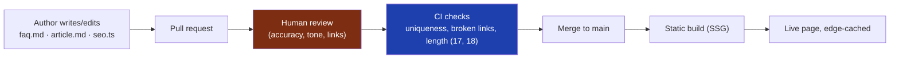
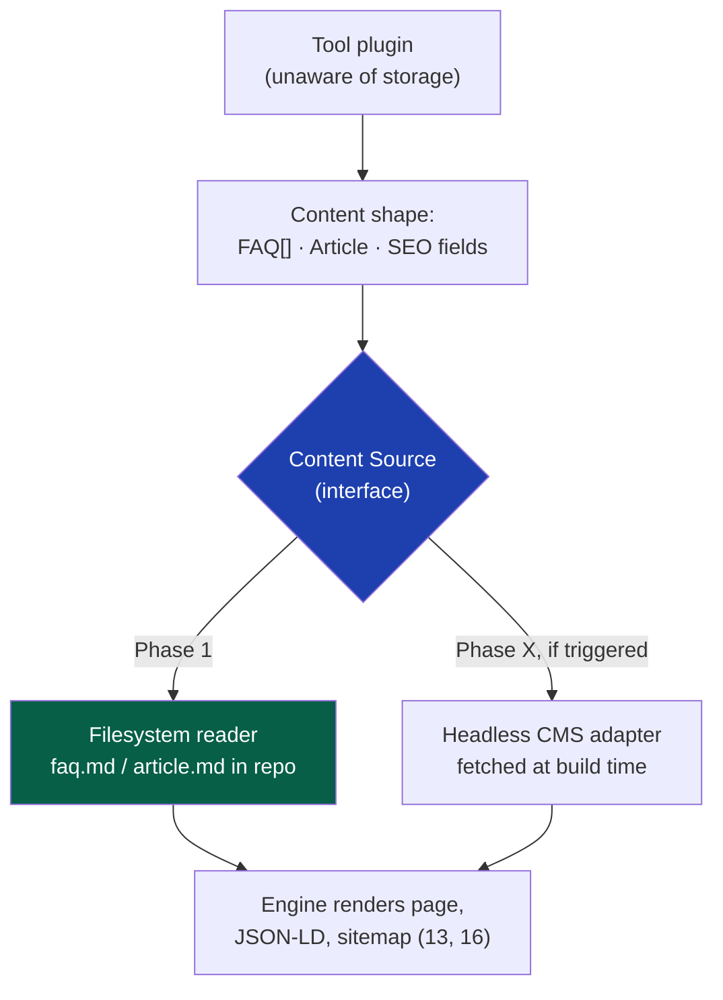

# 33 — Content Management: Files First, a CMS Only When Files Break

> **Status:** Draft v1 · **Owner:** CTO / Principal Architect · **Audience:** Everyone who writes or edits tool content — engineers, the AI content pipeline, and any future non-technical editor
> **Governed by:** `00-ENGINEERING-PRINCIPLES.md` and the relevant prior chapters, particularly `06` (Repository Structure) and `13` (Tool Plugin Architecture). Ties directly to `34` (AI-assisted content generation) and `17` (Programmatic SEO).

---

## 1. The Question This Chapter Answers

Every tool ships with real editorial content: `faq.md`, `article.md`, and the copy inside `seo.ts` (`13`, §3). Someone — a founder, an AI pipeline, eventually a hired writer — has to create that content, review it, edit it, and keep it accurate for years. The question this chapter answers: **where does that content live, who is allowed to change it, and how?**

The locked-in answer for Phase 1: **content lives in files, in git, next to the code it belongs to. There is no CMS.** This chapter explains why that's correct at our current scale, exactly where it stops being correct, and what we build — and just as importantly *don't* build yet — when that day comes.

**Simple explanation:** think of the difference between keeping recipes as handwritten cards in a single labeled box (files in git) versus building a shared recipe database with logins, approval workflows, and a search UI (a CMS). At one cook and 500 recipes, the box is faster, cheaper, and it's genuinely hard to lose a card. At fifty cooks and 50,000 recipes across twelve kitchens, the box collapses and the database earns its cost. The mistake is building the database on day one, for one cook.

---

## 2. What "Content" Means Inside the Plugin Contract

Content is not a vague concept here — it is a fixed, typed part of the plugin contract every tool already obeys (`13`, §3):

| File | What it holds | Consumed by |
|------|---------------|-------------|
| `faq.md` | Question/answer pairs, verbatim | On-page FAQ + `FAQPage` JSON-LD (`16`) |
| `article.md` | Long-form explanatory copy, sometimes numbered steps | On-page help content + `HowTo` JSON-LD (`16`) |
| `seo.ts` | Title, meta description, keyword intent | Metadata engine (`15`) |
| `examples.ts` | Worked input/output examples | On-page examples + test fixtures (`13`) |
| `related.ts` | Related tool slugs | Internal linking (`18`) |

Every one of these is **just a file in the tool's folder** (`06`), written in Markdown or plain TypeScript, checked into the monorepo like any source file. There is no separate "content database" today, and — this is the important part — there doesn't need to be one at a tool count in the hundreds or low thousands maintained by a tiny team.

**Simple explanation:** `article.md` for `jwt-decoder` is a text file sitting in `packages/tools/developer/jwt-decoder/article.md`. Opening it in a text editor is the entire "content management system" — no login screen, no publish button, no workflow state machine, just a file, git, and a pull request.

---

## 3. Why Files-First Is the Right Starting Point

| Reason | Why it matters at our stage |
|--------|------------------------------|
| **Zero new infrastructure** | Phase 1 has no database, no backend (`04`, `11`) — a CMS would mean standing up exactly the stateful system we've deliberately deferred |
| **Free versioning, free audit trail** | Git already gives us every edit, every author, every timestamp, forever (§4) |
| **Content and code review in one place** | A pricing-formula change and its explanation in `article.md` land in the *same* pull request, reviewed together |
| **Perfect for one founder + AI generation** | Files are trivially read/written by scripts and LLMs; a CMS API is one more integration surface for a solo founder generating hundreds of tools (`07`, §9) |
| **No vendor, no monthly bill, no lock-in** | At near-zero revenue (`03`), every recurring SaaS cost is scrutinized; a CMS subscription for a team of one is pure YAGNI |

> **CTO note:** the instinct to reach for "a proper CMS" early is almost always a status signal, not an engineering one — it *feels* like a real company. A CMS's entire value proposition is coordinating **multiple non-technical people editing shared content concurrently, with workflow and permissions**. We have one editor (the founder) and a machine (the AI pipeline), both perfectly comfortable with git. Paying that CMS tax before the coordination problem exists is money spent on a problem we don't have.

---

## 4. Versioning, Audit, and Rollback — Already Solved by Git

A dedicated CMS's headline features — version history, who-changed-what, and rollback — are things git gives us for free the moment a file is committed.

| CMS feature | Git equivalent |
|-------------|-----------------|
| Version history per content item | `git log -- path/to/article.md` |
| Diff between versions | `git diff <sha1> <sha2> -- article.md` |
| Who changed what, when | Commit author + timestamp (already required, `07`) |
| Rollback to a prior version | `git revert` on the offending commit |
| Draft vs. published state | Open PR vs. merged to `main` |
| Approval workflow | Required PR review (`07`, branch protection) |

**Simple explanation:** a CMS's "version history" tab is trying to recreate `git log`. We already have the real thing — a complete, tamper-evident history of every content change ever made, at no extra cost. Turning on a CMS just to get versioning is buying a filing cabinet for documents already stored in a fireproof archive next door.

This matters for correctness too: if a tax-rate change in `article.md` turns out wrong (`08`, the annual-update comment convention), `git blame` identifies exactly which commit introduced it and when — the same forensic tool used for a code regression (`27`, `29`).

---

## 5. The Editorial Workflow in Phase 1

Content changes — human-written or AI-drafted — follow the *exact same* pipeline as a code change (`07`), because content **is** code from git's point of view: a branch is created (by a person or the AI content pipeline, `34`); `faq.md`/`article.md`/`seo.ts` are written or edited; CI runs the content-specific gates already defined elsewhere in this documentation (uniqueness against siblings, `17` §5; broken-link detection, `18`; FAQ/HowTo shape validation, `16` §8; title/description length, `15`); a human reviews the pull request for factual accuracy and tone, not just green CI; and merge triggers a rebuild, with the page going live statically generated and edge-cached (`20`, `21`, `43`).

> **CTO note — human review is the control that must never be automated away.** CI can catch a duplicate paragraph or a broken link, but it cannot catch "this mortgage explanation is subtly wrong." As the AI pipeline (`34`) generates more of the first draft, the discipline that matters most is that **a human still reads every `article.md` and `faq.md` before merge** — the same non-negotiable already stated for AI-generated tool logic (`00`, N7). Fluent is not correct, and financial/health calculator content is exactly where a confident, wrong sentence causes real harm and real liability.

**Simple explanation:** think of the AI content pipeline (`34`) as a fast, tireless intern who drafts every FAQ and article overnight. A good manager still reads the drafts before they go out under the company's name — not because the intern is usually wrong, but because *when* they're wrong, it's the company's name on the mistake.

---

## 6. Where Files-First Starts to Break

Files-first is correct *now*. It is not correct forever. The honest engineering question isn't "will we ever need a CMS" — almost certainly yes, eventually — it's "what specific, observable condition tells us the day has arrived." Vague milestones ("when we're a real company") are not triggers; concrete pain is.

| Signal | Why files stop working |
|--------|--------------------------|
| **Non-developer editors join** | A hired writer/editor who doesn't know git or Markdown front-matter needs a UI, not a pull request |
| **Editorial workflow needs states beyond open/merged** | E.g. "drafted → fact-checked → legal-reviewed → scheduled → published," each owned by a different person |
| **Scheduled/embargoed publishing** | "Publish this rate-table update at midnight on the 1st" isn't something git branches do natively |
| **Very high edit *volume*, low edit *risk*** | Hundreds of trivial FAQ tweaks a week turn PR review into a bottleneck disproportionate to the risk |
| **True multi-language content at scale** | Translators editing the same content across a dozen locales concurrently is a coordination problem files handle poorly (ties to i18n, `36`) |
| **Non-tool marketing content grows** | A blog or help center not tied 1:1 to a plugin folder starts wanting its own structure |

**Simple explanation:** the box of recipe cards is fine until you hire five cooks who've never used git, or need "publish this recipe at 9am Tuesday, in French, after the head chef signs off." That's a genuinely different shape of problem — and that's the real signal, not a headcount number or a calendar date.

> **CTO note:** notice that *tool logic and structure* (`calculator.ts`, `schema.ts`, `tool.config.ts`) are **not** on this list, and never will be — that stays engineer-owned, type-checked, and git-reviewed forever, CMS or no CMS (`13`). The CMS question is scoped strictly to editorial *prose*. Conflating "we need a CMS for content" with "move the whole tool folder into a CMS" would destroy the plugin contract that makes the platform work (`13`, §1).

---

## 7. The Target Design: A Content-Source Abstraction, Not a Rewrite

The critical decision to make **now**, while there's no CMS, is architectural insurance: the engine must never read `faq.md`/`article.md` by assuming "these are always files on disk." It reads them through a small internal interface — a **content source** — so storage is swappable later without touching the plugin contract or any tool folder.

Concretely: the engine calls something shaped like `getToolContent(slug)` and gets back a typed object (`{ faq: FaqItem[]; article: ArticleBody; seo: SeoFields }`). Today that function reads and parses Markdown files from the tool's folder. If a CMS arrives, that *same function signature* instead calls the CMS's API at build time and maps its response into the identical shape. **Nothing downstream — the page renderer, the JSON-LD generator, the sitemap, internal linking — knows or cares which one happened.**

**Simple explanation:** it's a power adapter. The `jwt-decoder` page plugs into "content," not into "a file" or "a CMS" specifically. Today that socket is wired to a filing cabinet; tomorrow it could be rewired to a cloud service, and the tool never notices, because the plug shape never changed — the same "Everything Replaceable" discipline already applied to ad networks (`19`), auth providers (`23`), and the ORM (`12`).

This is a few hours of work to build correctly now, and it's what prevents a painful, risky migration later — the interface, not the CMS, is the thing worth building before it's strictly needed.

---

## 8. Evaluating a Headless CMS, When the Day Comes

When a genuine trigger from §6 arrives, the evaluation should weigh three families of option, not just pick the most popular SaaS name.

| Option | Model | Fit for us |
|--------|-------|------------|
| **Git-based headless CMS** (e.g. Tina, Keystatic, Decap) | Still commits Markdown/MDX to the repo, adds a friendly UI on top | Smallest jump from where we are — keeps git as source of truth; strongest fit for our workflow |
| **API-first headless CMS** (e.g. Sanity, Contentful, Payload, Strapi) | Content lives in the CMS's own database, fetched via API at build time | Best for true editorial workflows (states, scheduling, roles); adds an external dependency and a monthly cost |
| **Self-hosted, open-source CMS** | We run and own the CMS ourselves | More control, no vendor lock-in; more ops burden (`30`, `44`) taken on ourselves |

Whichever family, the deciding criteria are the same: does it preserve **build-time** fetching (we're static/ISR by default, `04`, §7); does it stay **diffable** enough not to lose git's audit trail (§4); can the **AI content pipeline** (`34`) write to it as easily as files today; does it support **localization** if the trigger was multi-language scale (`36`); and what's the true **cost at our volume**, modeled before commitment.

> **CTO note:** the CMS decision deserves the rigor of the database decision (`12`), not "which one has the nicest demo." A CMS we can't cleanly export *out* of is a worse trap than the friction it was meant to solve — vendor lock-in on years of editorial content is a business risk, not an inconvenience. Plan the exit before signing up.

---

## 9. Migration Path — Files to CMS Without Breaking the Contract

Because of the content-source abstraction (§7), migration is scoped and safe, not a rewrite: **bulk-import** existing `faq.md`/`article.md`/`seo.ts` into the CMS via script (mechanical, since the shape is already fixed by the plugin contract); **add the CMS adapter** alongside the existing filesystem reader; **migrate tools in batches**, verifying output is byte-identical (same FAQ text, same JSON-LD) before the next batch; **keep the filesystem reader working** as the safety net for anything unmigrated; and **retire the old files** only once every consumer (JSON-LD, sitemap, internal linking) is proven correct against the CMS in production — pre-migration git history kept permanently as an archival record.

**Simple explanation:** this is the same expand → migrate → contract pattern used for risky database schema changes (`12`, §6). Nobody flips a switch on 1,000+ live, ranking pages at once; each tool migrates on its own schedule, and any tool can be trivially rolled back to reading its file if something looks wrong.

---

## 10. What Doesn't Change, Even With a CMS

Whatever happens on the content-storage side, three things stay fixed, because they are the plugin contract itself (`13`), not a content-storage detail: the **canonical slug** stays the one true identifier — folder name, URL, config id, analytics key, and (if it exists) CMS record key are still the same string (`09`); the **shape** of content stays typed and validated, so a CMS entry for `article.md` must satisfy the exact same schema the engine has always expected, with CI still rejecting malformed content regardless of where it was authored (`17`, §5); and **tool logic never moves into the CMS** — `calculator.ts`, `schema.ts`, and `tool.config.ts` remain engineer-owned files in the monorepo, forever.

**Simple explanation:** whichever filing system holds the `mortgage-calculator`'s FAQ text, the mortgage math itself never lives there — it stays in code, tested, type-checked, reviewed like any other logic. The CMS question is entirely about *where the words live*, never about *where the answers come from*.

---

## Summary

- **Phase 1 has no CMS.** All tool content (`faq.md`, `article.md`, `seo.ts`) lives as files in git, beside the code — reviewed via the same pull-request workflow as code (`07`).
- Files-first wins today on infrastructure cost, free versioning/audit via git, unified code+content review, and scriptability for a solo founder and an AI content pipeline (`34`).
- Git already provides everything a basic CMS's "version history" tab promises: full history, diffs, blame, and rollback, at zero additional cost.
- **Human review before merge is non-negotiable** as AI drafts more content — fluent is not the same as correct, especially for financial/health calculators.
- Files stop working on concrete signals — non-developer editors, real workflow states, scheduled publishing, high-volume low-risk edits, or true multi-language scale (`36`) — never on a calendar or headcount milestone.
- The insurance to build **now**: a **content-source abstraction** the engine reads through, so storage is swappable without ever touching the plugin contract (`13`).
- When triggered, evaluate git-based, API-first, and self-hosted CMS options against build-time fit, diffability, scriptability, localization, and true cost — and plan the exit before signing up.
- Migration follows expand → migrate → contract, per tool, with the filesystem reader as a safety net until every consumer is proven correct against the CMS.
- The canonical slug, the content schema, and the strict separation of prose from tool logic never change, no matter the storage layer.

> Next: `34-AI-CONTENT-GENERATION.md` — how the AI pipeline drafts `faq.md`/`article.md`/`seo.ts` at scale, and the review gate that keeps it trustworthy.

---

### Changelog
| Version | Date | Change | Reason |
|---------|------|--------|--------|
| v1 | (draft) | Initial CMS strategy | Project inception |
