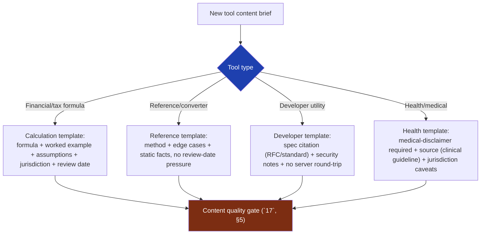
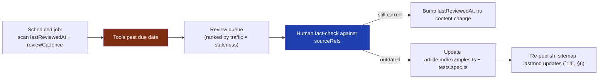
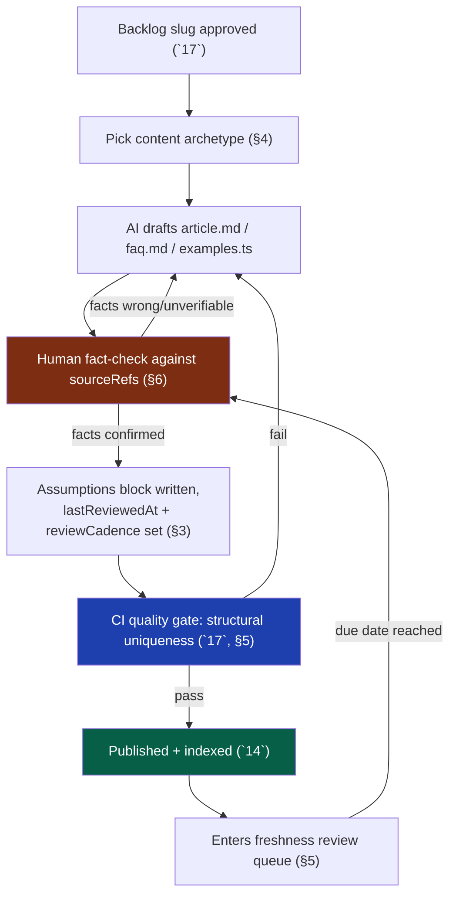

# 34 — Content Engine

> **Status:** Draft v1 · **Owner:** CTO / Content Systems Lead · **Audience:** Everyone authoring or reviewing `faq.md`/`article.md`/`examples.ts`, and anyone operating the AI-assisted generation pipeline
> **Governed by:** `00`-`33`. This chapter defines the discipline that keeps `article.md`, `faq.md`, and `examples.ts` (`13`, §3.4) accurate, distinct, and current at 1,000+-tool scale. It is the human/process layer that `17` (Programmatic SEO) assumes exists and that `35` (AI Tool Generation) must plug into.

---

## 1. Why Content Needs Its Own Chapter

`13` defined *where* content lives (fixed files inside each tool folder) and `17` defined *when* we're allowed to generate a tool at all (real, distinct demand). Neither chapter answers the question this one exists to answer: **once a tool exists, how do we keep its words correct, trustworthy, and non-thin for years, across 1,000+ tools, most of it AI-drafted?**

This is a different problem from code correctness. A bug in `calculator.ts` is caught by `tests.spec.ts` (`02`, C2) — the compiler and CI enforce it mechanically. But a sentence in `article.md` claiming "the current UK higher-rate tax threshold is £50,270" isn't something a type system can verify. Prose facts drift, tax years roll over, formulas get superseded, and nothing red-squiggles when they do. Content is the one part of the plugin contract that code-level enforcement (`13`, §4) cannot fully protect — which is exactly why it needs its own explicit process, not an assumption that "AI wrote it, so it's handled."

**Simple explanation:** `tests.spec.ts` is a smoke alarm for the math — it screams the moment a number is provably wrong. There is no equivalent alarm for a stale sentence like "as of 2023, the standard deduction is…" written in 2024 and never revisited. This chapter is the fire-inspection schedule for the words on the page — the thing that catches what the smoke alarm structurally cannot.

> **CTO note:** it is tempting to treat this chapter as a formality once `17`'s CI quality gate exists — "we already check for thin/duplicate content, so we're covered." That gate checks *structural* uniqueness (`17`, §5), not *factual currency*. A tool can be structurally excellent — unique formula, unique tests, unique examples — and still state a 2023 tax bracket in 2027. Structural uniqueness and factual freshness are orthogonal risks; this chapter exists because the first one is already solved and the second one is not.

---

## 2. E-E-A-T as an Engineering Requirement, Not a Marketing Slide

Google's quality guidelines evaluate content on **Experience, Expertise, Authoritativeness, Trustworthiness (E-E-A-T)**. For a site whose entire traffic model is organic long-tail search (`01`, B1), this isn't a nice-to-have framing — it's a direct input to whether a page ranks at all, especially for **YMYL (Your Money or Your Life)** categories like finance and health, which Google scrutinizes hardest.

| E-E-A-T pillar | What it means for a UToolios tool | Where it's engineered |
|---|---|---|
| **Experience** | The content reads like it was written by someone who has actually used/needed this calculation | `article.md` written with real worked scenarios, not abstract prose |
| **Expertise** | The formula/logic is demonstrably correct, sourced from an authoritative reference | Source citation in code comments (`08`, §4) + `article.md` |
| **Authoritativeness** | The site as a whole is seen as a coherent, deep resource on a topic | Cluster completeness and internal linking (`17`, §2; `18`) |
| **Trustworthiness** | Assumptions are stated, sources are cited, the page doesn't overclaim | Assumptions block on every page (`02`, §4; `08`) + review dates (§3 below) |

For YMYL categories specifically, we hold a higher bar: every `mortgage-calculator`, `income-tax-calculator`, or `bmi-calculator` must cite its formula source and jurisdiction (tax law is not the same in the UK, US, and Australia) rather than presenting a bare number as universal truth.

**Simple explanation:** imagine two people answering "how much tax will I pay?" at a dinner party. One says a number with total confidence and no context. The other says "based on the 2026-27 UK tax year rates published by HMRC, assuming you're not Scottish-rate and have no other income, it's approximately £X — here's the source." Both might be right, but only the second person has *earned* your trust, and Google's ranking systems (built to mimic exactly this kind of trust judgment) reward the second pattern.

> **CTO note:** E-E-A-T is not a checklist you satisfy once — it's a standing cost of operating in YMYL categories. A common mistake is chasing volume into finance/health/legal topics (`17`, §3) without budgeting for the ongoing fact-maintenance those categories demand (§4, §5 below). If we can't commit to keeping a category's assumptions current, we should deprioritize it in favor of categories where facts don't expire — a unit converter's formula doesn't change with a fiscal year; a tax calculator's does, every year, without fail.

---

## 3. The Assumptions Block: Stated Facts, Stated Dates

`08` (§4) already establishes that code comments must cite sources and review dates for real-world rules. The content layer mirrors this at the page level: **every tool that encodes an assumption the user can't see in the inputs must state it, and state when it was last verified.**

```
## Assumptions
- Tax year: 2026-27 (UK). Source: gov.uk/income-tax-rates.
- Assumes England/Wales/NI rates (not Scottish rate).
- Last verified: 2026-04-06 (start of tax year).
- Next scheduled review: 2027-04-06.
```

This block is not decorative — it is a **structured, machine-checkable field**, not free prose. `tool.config.ts` (or a co-located `content.meta.ts`) carries `lastReviewedAt` and `reviewCadence` as typed fields the engine reads, the same way it reads `tier` or `serverSide` (`13`, §3.1). CI and the ops dashboard both query this field; it does not live only inside `article.md`'s prose where nothing but a human reading it would ever notice it's overdue.

| Field | Type | Purpose |
|---|---|---|
| `lastReviewedAt` | date | When a human last confirmed the stated facts are still true |
| `reviewCadence` | enum: `annual` \| `quarterly` \| `on-source-change` \| `static` | How often this tool's facts can legitimately drift |
| `sourceRefs` | string[] | Citations backing the formula/assumptions |
| `jurisdiction` | string, optional | Where this applies (tax/legal/health tools) |

**Simple explanation:** think of it like a food product's "best before" date and ingredient list, stamped on the package, not buried in a marketing brochure. `mortgage-calculator`'s label says "uses standard UK repayment amortization, no assumptions about rate changes over the term, reviewed 2026-01-15." A `unit-converter`'s label says "conversion factors are physical constants, `static`, never expires." Different products, different shelf lives — but every product has a visible date.

> **CTO note:** the honest failure mode here is building the `lastReviewedAt` field and then never actually querying it — it becomes exactly the kind of decorative metadata this section is trying to avoid. The field only earns its keep if §5's dashboard actually surfaces overdue tools and someone is accountable for clearing the queue. A date nobody reads is worse than no date, because it *looks* like a safety mechanism while providing none.

---

## 4. Content Templates Per Tool Type

Not every tool's content has the same shape. Forcing a tax calculator and a JWT decoder into an identical article template produces the exact "fluent but interchangeable" thinness `17` (§5) warns about. We define a small set of content archetypes, and every tool picks the one that fits.



| Archetype | Example tools | Article shape | Freshness pressure |
|---|---|---|---|
| **Calculation (financial)** | `mortgage-calculator`, `income-tax-calculator` | Formula explanation, worked example, assumptions block, jurisdiction | High — annual/quarterly (§5) |
| **Reference/converter** | unit converters, `bmi-calculator` (adult formula) | Method explanation, edge cases (e.g. negative/zero input handling), no legislative dependency | Low — mostly `static` |
| **Developer utility** | `jwt-decoder`, base64/hash tools | Spec citation (RFC 7519 for JWT), explicit "runs entirely client-side, nothing sent to a server" trust statement (`11`, §5) | Low, but security claims must stay true across dependency upgrades |
| **Health/medical** | `bmi-calculator`, BMR/calorie tools | Mandatory medical disclaimer, clinical-guideline citation, explicit "not medical advice" framing | Medium — guideline bodies (WHO, NHS) revise periodically |

Every archetype still fills the same fixed files (`article.md`, `faq.md`, `examples.ts`, `13` §3.4) — the template controls *what goes inside* those files, not the contract's shape. This keeps the plugin contract uniform (`13`, §4) while letting content genuinely differ by domain, which is also what keeps sibling tools from reading as interchangeable (`17`, §5).

**Simple explanation:** a cookbook has one fixed structure per recipe (ingredients, method, serving size) but a soup recipe and a cake recipe fill that structure with completely different content. We're doing the same thing: `mortgage-calculator` and `jwt-decoder` both have an `article.md`, but one is built around "here's the formula and this year's tax rules," the other around "here's the RFC and why your token never leaves your browser." Same shape, genuinely different substance — which is the opposite of the thin-content pattern `17` warns against.

---

## 5. Freshness Cadence and the Review Queue

Every tool's `reviewCadence` (§3) feeds a single operational queue: which tools are due for a fact check, and when. This is not a "nice to revisit someday" list — it is a scheduled, tracked operational process, the content equivalent of dependency-update or certificate-renewal cadences elsewhere in the stack.

| Cadence | Applies to | Trigger |
|---|---|---|
| `annual` | Tax/fiscal-year-dependent tools | Fixed calendar date (e.g. UK tax year start) |
| `quarterly` | Fast-moving reference data (e.g. interest-rate-sensitive tools) | Fixed calendar cadence |
| `on-source-change` | Tools tied to an external spec/standard (RFCs, WHO guidelines) | Manual trigger when the source publishes a revision |
| `static` | Physical constants, pure math, timeless conversions | Never — but re-verified opportunistically during any unrelated edit |



This queue is ranked by **traffic × staleness**, not FIFO — a high-traffic tax calculator six months overdue matters far more than a near-zero-traffic tool a year overdue. This is the content-layer equivalent of MSTC-driven prioritization (`00`): review effort follows where users (and revenue) actually are.

**Simple explanation:** this is exactly like a restaurant's health-inspection schedule crossed with a triage nurse's priority order. Every dish (tool) has a due date for re-inspection, but the walk-in fridge everyone eats from daily (`mortgage-calculator`, high traffic) gets checked before the rarely-ordered side dish (a niche unit converter), even if the side dish's due date came first on the calendar.

> **CTO note:** at solo-founder scale (`00`, §6.3) this queue can be a spreadsheet or a lightweight script output — it does not need a dedicated content-ops platform on day one (YAGNI). What it *cannot* be is purely informal memory. A founder juggling 200+ tools cannot reliably recall which ones cite a 2024 tax year without a system tracking it explicitly. The queue's value is proportional to how mechanically it's generated, not how sophisticated the tooling is.

---

## 6. Human Review of Facts: The Non-Negotiable Checkpoint

`07` (§9) already establishes that AI-generated *code* requires a human checkpoint specifically for conceptual correctness — "the tests pass" never substitutes for "the formula is actually right." Content carries the identical risk in a form that's harder to catch: **an AI can write fluent, confident, well-structured prose that states a wrong fact**, and unlike a wrong formula, nothing in CI will fail on it.

| What AI does well | What AI must never be trusted to do alone |
|---|---|
| Draft prose structure, tone, readability | Assert a specific figure (tax bracket, medical threshold, legal limit) without a human verifying the source |
| Generate FAQ question variety | Decide which facts are jurisdiction-specific vs. universal |
| Produce worked examples matching `calculator.ts` output | Invent a source citation ("hallucinated citation" is a known LLM failure mode) |
| Flag its own uncertainty when prompted to | Silently omit an assumption because it wasn't asked about |

The rule, mirroring `07` (§9) exactly: **AI drafts, a human verifies every factual claim against a named, checkable source before the tool ships or a review is closed out.** This is not a lint rule that can be automated away — verifying that "£50,270 is the correct 2026-27 UK higher-rate threshold" requires a human (or, longer-term, a verified-source lookup service) checking an authoritative reference, not re-reading the AI's own confident phrasing.

```mermaid
sequenceDiagram
    participant AI as AI content draft
    participant Human as Human reviewer
    participant Source as Named source (gov.uk, RFC, WHO...)
    participant CI as CI (`17`, §5)
    AI->>Human: Drafts article.md, faq.md, assumptions block
    Human->>Source: Verifies every stated fact against citation
    Source-->>Human: Confirms or contradicts
    Human->>AI: Confirmed facts kept; wrong ones corrected
    Human->>CI: Content submitted with lastReviewedAt set
    CI->>CI: Structural checks (uniqueness, links, schema)
    CI-->>Human: Pass -> merge; fail -> back to draft
```

**Simple explanation:** treat AI-drafted content like a junior researcher's first draft of a report — well-written, plausible, occasionally confidently wrong about a specific number it wasn't actually sure of. A good editor doesn't re-read the sentence more carefully to catch that; they check the number against the original source. That's a different skill than proofreading, and it's the one step in this pipeline that stays human even as everything else accelerates.

> **CTO note:** the seductive failure mode is letting "the AI cited a source" satisfy the checkpoint. An LLM can generate a plausible-looking citation ("Source: HMRC 2026 guidance") that doesn't actually say what the text claims, or doesn't exist at all. The human check is specifically: open the source, read the actual number, confirm the match — not confirm that a source *string* is present. A citation field that's never actually opened is worse than no citation field, for the same reason a `lastReviewedAt` nobody queries is worse than no date (§3).

---

## 7. Avoiding Thin AI Content at the Prose Level

`17` (§5) defines thinness structurally (duplicated formulas, missing tests, near-duplicate metadata). This section defines it at the level `17` explicitly leaves to this chapter: **prose that is individually fluent but collectively interchangeable.**

| Thin-prose signal | Why it happens with AI generation | Mitigation |
|---|---|---|
| Generic opening paragraph ("In today's world, calculating X is important...") | LLM default filler pattern | Banned opening-pattern list checked in review; templates start with the answer/formula, not throat-clearing |
| FAQ answers that restate the question with "yes"/"no" and nothing else | Low-effort prompt, no real user-question research | FAQ questions sourced from actual "People Also Ask" / search-console query data, not invented |
| Article reads identically to a sibling tool with nouns swapped | Same prompt template run twice with different `{{toolName}}` variable | Human review compares against the nearest sibling tool before merge, not just in isolation |
| No concrete numbers, only vague ranges | AI hedges when it isn't confident of a fact | Forces the §6 fact-check: either the number is verified and stated, or the claim is removed |
| Disclaimers copy-pasted verbatim across unrelated tools | Templated boilerplate treated as "content" | Disclaimers are legitimately shared (`08`) but don't count toward the tool's *unique* content requirement in CI (`17`, §5) |

**Simple explanation:** it's the difference between a real tour guide who's actually walked the streets they're describing, and a chatbot re-arranging the same five sentences about "this vibrant city" for every destination on a list. Both produce grammatically correct paragraphs. Only one is telling you something true and specific about *this* place. Our `article.md` for `tile-calculator` needs to say something a tile-calculator article needs to say (waste factor, grout-line adjustment) — not something any home-improvement calculator's article could say.

---

## 8. The Content Pipeline End to End

Tying the process together, from backlog entry (`17`, §3) to a stated, dated, verified page:



Note the loop back from the review queue into fact-checking — content is never "done forever." A tool that passed the gate on day one re-enters the same human fact-check step on its next scheduled review, closing the loop this chapter opened in §1: code correctness is a one-time proof; content correctness is a maintained state.

---

## 9. Ownership and Accountability

At solo-founder scale, one person owns this end-to-end; the roles below are the target shape once a small team exists, and map cleanly onto that transition.

| Role | Responsible for | Phase |
|---|---|---|
| Content/founder (today) | Drafting prompts, fact-checking, running the review queue | Now |
| Subject-matter reviewer (finance/health) | Verifying YMYL claims against authoritative sources for their domain | As categories grow and volume justifies specialization |
| Content ops tooling owner | Building/maintaining the review-queue automation (§5) | Phase 2, alongside observability (`28`-`30`) |

**Simple explanation:** today, one person wears every hat in this pipeline — that's fine and expected for a solo founder (`00`, §6.3). The point of naming the roles now isn't to hire immediately; it's so that when a second person joins, there's already a clear seam to hand a role to, instead of untangling "who's supposed to check this" after the fact.

> Next: `35-AI-TOOL-GENERATION.md` — the generation pipeline that drafts the code and content this chapter governs, and how its output is forced through the same human and CI checkpoints defined here.

---

## Summary

- Content correctness is a **maintained state**, not a one-time proof — unlike `tests.spec.ts`, no compiler catches a stale fact, so this chapter defines the explicit process that does.
- **E-E-A-T** is engineered, not marketing: sourced formulas, stated assumptions, and cluster completeness (`17`, §2) are what earn ranking trust, especially in YMYL categories (finance, health).
- Every tool carries a **structured, typed assumptions block** — `lastReviewedAt`, `reviewCadence`, `sourceRefs`, optional `jurisdiction` — queried by tooling, not left as unread prose.
- **Content templates per tool archetype** (calculation, reference, developer, health) keep prose genuinely distinct while the plugin contract's file shape (`13`) stays uniform.
- A **freshness review queue**, ranked by traffic × staleness, turns "someday recheck this" into a scheduled, tracked operational process.
- **Human fact-check against a named source is non-negotiable** for AI-drafted content — mirroring `07`'s rule that "tests pass" never substitutes for "the formula is right," here "a citation exists" never substitutes for "the citation was actually opened and confirmed."
- Thin AI prose is caught at the sentence level (generic openers, restated-question FAQs, swapped-noun siblings) in addition to `17`'s structural checks.
- Ownership starts as one person wearing every hat and has a clear seam to split as the team grows.

### Changelog
| Version | Date | Change | Reason |
|---------|------|--------|--------|
| v1 | (draft) | Initial content engine strategy | Project inception |
