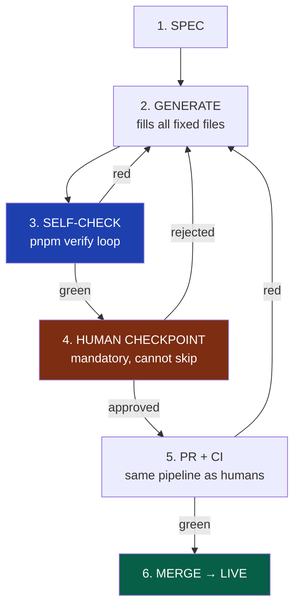
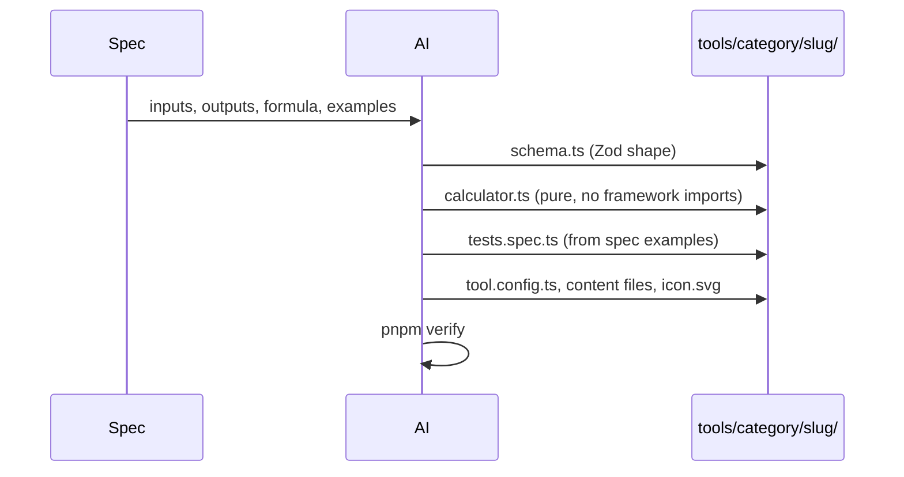
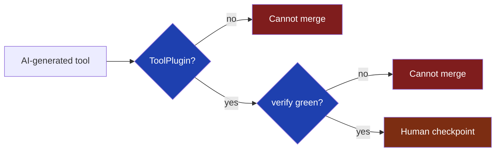

# 35 — AI Tool Generation

> Status: Draft v1 · Owner: CTO / Principal Architect · Audience: Everyone who generates, reviews, or merges an AI-authored tool
> Governed by: 00-ENGINEERING-PRINCIPLES.md and the relevant prior chapters (07, 13, 39).

---

## 1. Why This Chapter Exists

UToolios reaches 1,000+ tools only if a solo founder (or small team) can produce tools far faster than they can hand-write them. AI is not a bolted-on experiment — it is the production line for Bet B3 (`01`, `03`): the platform's unit economics assume the *marginal cost of tool #501* is a folder and a review, not a week of engineering.

Chapters `07` and `13` already established the two halves this chapter connects: `13` defines the **contract** — the exact, compiler-checked shape every tool must satisfy (`ToolPlugin`) — and `07` §9 sketched the **AI-assisted workflow**, naming its one non-negotiable rule: a human confirms conceptual correctness before anything ships.

This chapter is the **detailed operating manual** for that rule: the pipeline from spec to merged tool, the guardrails that keep AI output safe by construction, and — most importantly — *why the human checkpoint cannot be automated away*, no matter how good the model gets.

**Simple explanation:** if `13` is the USB standard for tools and `07` is the daily commuter route, this chapter is the factory-floor procedure for the robot arm now building most of the parts — fast and mostly right, but never allowed past the inspection station.

> **CTO note:** this chapter is deliberately skeptical of its own subject. AI generation makes the business model work *and* is the thing most likely to quietly poison it — a wrong formula ships looking identical to a right one until a user's mortgage payment is off by $40/month and they never come back (`02`, C2). Every guardrail below exists because "the AI wrote a test and it passed" is not evidence of correctness — it's evidence of self-consistency, a much weaker claim.

---

## 2. The Pipeline, End to End

AI tool generation follows the exact same folder and contract as human-authored tools (`13`, §3) — no special "AI path" through the codebase. Only *who* fills in the files, and *how many checkpoints* run first, differs.

Four things are easy to get wrong in practice, so they're stated explicitly:

1. **The AI never writes outside the standard folder.** No "draft" location, no AI-only files. If it isn't in the exact shape `13` demands, it doesn't exist to the engine.
2. **Self-check is iterative and silent.** The AI loops `pnpm verify` (`07`, §6) before a human ever looks — compute time is cheap; human review time on lint errors is not.
3. **The human checkpoint is a hard stop, not a suggestion**, regardless of how many times self-check comes back green (Section 6).
4. **CI is identical for AI and human output** — a merged AI-generated tool is indistinguishable to the engine, router, and ops stack, `13`'s promise applied to authorship, not just code.

**Simple explanation:** think of the AI as a fast apprentice draftsperson, turning "draw me a tile calculator" into a technical drawing in minutes. No drawing reaches the workshop floor until a licensed engineer signs it — not because the apprentice is bad, but because someone accountable must certify the load calculations, every time, with no exceptions for a good track record.

---

## 3. The Spec — What Goes Into the AI, Precisely

Generation quality is bounded by spec quality. A vague prompt ("make a paint calculator") produces a plausible-looking but under-specified tool. The spec is therefore a **structured input**, not a sentence — closer to a ticket than a chat message.

| Spec field | Purpose | Example (tile-calculator) |
|---|---|---|
| `name` / slug | Canonical identity (`09`) | `tile-calculator` |
| `category` | Folder placement (`06`) | `home` |
| `inputs` | Exact variables, units, ranges | length/width (m), tile size (cm), waste % |
| `outputs` | Exact result fields, units | tiles needed, boxes needed, total area (m²) |
| `formula source` | The authoritative logic, cited | area ÷ tile-area × waste factor; cite source if regulatory |
| `known-good examples` | 3+ worked pairs a human trusts | seeds `examples.ts` and `tests.spec.ts` |
| `edge cases` | Zero, negative, huge, fractional inputs | 0 m² room, negative tile size |
| `serverSide` flag | Client-only vs. needs a server (`11`, §5) | `false` |
| `regional/legal sensitivity` | Flags jurisdiction- or time-dependent formulas | tax brackets, unit systems, currency |

**Simple explanation:** the spec is the recipe card, not a vague craving. For the **mortgage-calculator**, the spec doesn't say "calculate mortgages" — it specifies principal, rate, term, compounding convention, and worked examples a human has independently verified against a bank's amortization table. The AI is never asked to *invent* the formula; only to *implement* one the spec already states, with sources.

> **CTO note:** the biggest lever for output quality is spec discipline, not model choice. A prompt asking the AI to both *decide* the formula and *implement* it collapses two different risk profiles into one step, hiding the riskier one (deciding) inside the easier one (implementing). Force every non-trivial spec to name its formula source separately — no source named means the tool needs a domain-expert pass before generation, not after.

---

## 4. Stage 2 in Detail — From Spec to Files

Generation fills the fixed-name files in the same order `07` §5 prescribes for humans, because uniformity between human and AI authorship is the point (`00`, 6.2).

A few generation rules worth being explicit about:

- **`schema.ts` is generated first**, because everything downstream depends on it — a small, checkable Zod shape that narrows the AI's solution space before the riskiest file (`calculator.ts`) is written.
- **`calculator.ts` must contain zero framework imports**, checked mechanically (`08`, §4; `13`, §3.3) — an AI importing `next/navigation` into pure logic fails the build immediately, which is the point: framework-free logic is what lets one function power web, API, and mobile later (`03`, R4).
- **`tests.spec.ts` is derived from the spec's examples, not invented by the AI.** The AI never becomes the sole author of the proof its own logic is correct — the worked examples came from the human. This is the single most important guardrail in the pipeline, expanded in Section 6.
- **Content files are lower-risk but not risk-free**: an AI hallucinating a fact in `article.md` (e.g. a wrong tax-year threshold) is a real failure mode even when `calculator.ts` is correct. Content gets the same human read, just a lighter bar.

**Simple explanation:** for the **jwt-decoder**, the AI doesn't decide what "decoding a JWT" means — the spec already says: split on `.`, base64url-decode header and payload, verify structure, never verify signature client-side without a documented reason. The AI writes that exactly, then proves it against real, known-good tokens the human already trusts. If it silently decided "decoding" should also validate expiry, that's the scope-creep the spec exists to prevent.

---

## 5. The ToolPlugin Type and `pnpm verify` as the Safety Gate

This is where `13`'s central decision pays its biggest dividend for AI specifically: because `ToolPlugin` is a TypeScript type, not a documented convention, AI output is checked by the *same compiler* that checks human output, with no interpretation gap.

| Gate | What it catches in AI output |
|---|---|
| TypeScript / `ToolPlugin` compile check | Missing fields, wrong shapes, malformed config |
| Zod schema at the boundary | Inputs the AI didn't consider (negative numbers, huge strings) |
| `pnpm verify` — lint, typecheck, test, a11y, contract (`07`, §6) | Style drift, broken logic, inaccessible markup, contract violations |
| CI — identical pipeline, no AI exception (`07`, §8) | Anything that slipped past local verify |

**Determinism from rigid structure** is the underlying mechanism: because every tool has *exactly* the same file names, type shape, and verification commands, output is evaluated against a fixed, mechanical target, not a fuzzy notion of "good code." This is what makes generation *safe to scale* — 500 tools built this way are 500 tools checked identically, not 500 bespoke reviews.

**Simple explanation:** a spell-checker catches typos but doesn't know if the essay's argument is true. `pnpm verify` and `ToolPlugin` are an excellent spell-checker: they guarantee the **bmi-calculator** compiles, has the right fields, and passes its own tests. None of that guarantees its category thresholds are the current WHO-recommended ones — that gap is Section 6.

> **CTO note:** it's tempting to treat "all automated checks green" as a proxy for "safe to merge" — usually good enough for human-authored code. For AI-generated tools it is not, and conflating the two is the most likely way these guardrails erode under deadline pressure. Automated checks prove *internal consistency*; only a human with domain judgment can attest to *external correctness*.

---

## 6. The Mandatory Human Checkpoint

This is the non-negotiable step. It exists because of one well-documented failure mode: **an AI can write a test that agrees with its own wrong formula.** If the model misunderstands compound interest, it confidently generates `calculator.ts` with the wrong math *and* `tests.spec.ts` with expected values computed the same wrong way — and every gate in Section 5 goes green, because internal consistency is all those gates check.

The checkpoint has a narrow job. The reviewer is not re-reading the whole diff for style — CI already did that. The reviewer answers exactly these questions:

1. **Is the formula conceptually correct**, verified against an independent source — textbook, regulator, a competitor tool known to be right — not just internally consistent with the AI's own tests?
2. **Are the stated assumptions true and current** — tax year, unit system, rounding, edge-case handling as a real user expects, not just as the AI guessed?
3. **Do the worked examples match an independently verifiable source**, not merely `calculator.ts`'s own output?
4. **Is anything stated as fact in the content actually true** (dates, thresholds, legal claims), rather than a plausible-sounding hallucination?

None of this duplicates CI, which only proves the code compiles, the tests pass, and inputs are validated.

**Simple explanation:** imagine grading an exam where the student also wrote their own answer key. A perfect match proves only self-consistency. Someone with the *real* answer key — an independent, trusted source — has to check the work. For the **mortgage-calculator**, that's a bank's amortization table, not anything the AI produced.

> **CTO note:** resist letting a second AI perform this checkpoint "for speed." A second model catches some errors but shares the first model's blind spot for anything both were trained to get subtly wrong the same way, and has no accountability when a wrong tool ships. The checkpoint's value is a named human who can answer "how do you know this is right?" with something other than "the AI's own test passed." We don't optimize this away as models improve — the cost of being wrong, silently, at scale, never shrinks.

This checkpoint is recorded, not implicit: the Definition of Done in `07`, §10 already requires "(If AI-generated) a human confirmed the formula and assumptions" as a checked box on every PR — this chapter is that checkbox's full specification.

---

## 7. Guardrails Beyond the Type System

Some risks aren't caught by "does it compile" and need separate enforcement.

| Guardrail | What it prevents |
|---|---|
| No framework imports in `calculator.ts` | Coupling pure logic to Next.js/React, breaking reuse across web/API/mobile (`03`, R4) |
| No `fetch`/network calls unless `serverSide: true` is declared | A tool silently depending on an external API, changing its cost/reliability profile unreviewed (`11`, §5) |
| Banned pattern list (`any`, unchecked assertions) | Reaching for `any` to hide a type error instead of fixing the real shape mismatch (`08`) |
| Zod at every boundary, no bare `JSON.parse` | Trusting user input carelessly (`26-OWASP-COMPLIANCE`) |
| Secrets/credential scan on generated files | A hallucinated placeholder key that looks real, or one copied from training data |
| Duplicate-slug/formula check against the registry | Regenerating a near-duplicate of an existing tool instead of reusing it (`13`, §5) |
| Regional-sensitivity flag | Jurisdiction- or year-dependent tools (tax, currency) routed to a stricter, dated review |

**Simple explanation:** these are extra safety rails on the factory floor, beyond "does the part fit" — a sensor that stops the line if the robot arm reaches for the wrong bin (an external API when none was asked for), even though the part it produces might technically fit the socket.

---

## 8. Scaling Generation Without Scaling Risk

Reaching 1,000+ tools means generation runs in batches; review must keep pace without becoming the bottleneck the platform was built to avoid.

- **Spec backlog, not ad-hoc prompting.** Specs (Section 3) are queued and prioritized by expected search volume/SEO opportunity (`17`), so generation tracks business value.
- **Batch generation, sequential review.** The AI drafts many tools in parallel; the checkpoint stays a strictly sequential, single-reviewer gate — batching generation is fine, batching *approval* is the shortcut Section 6 forbids.
- **Formula-source library.** Common families (loan math, unit conversion, BMI-style formulas) get one once-reviewed, cited source many specs reuse — tool #380 reusing a verified family reviews faster than tool #12 did, because the domain risk was already retired, not because the checkpoint was skipped.
- **Review time is a first-class constraint on generation rate.** If specs outpace what a human can responsibly check, the fix is slowing generation or adding a reviewer — never lightening the checkpoint (`00`, Tier 1 over Tier 4).

> **CTO note:** the honest constraint on reaching 1,000 tools is not model throughput — it's trustworthy human review throughput. A backlog of drafted-but-not-yet-checked tools in PRs is a healthy queue; merging past the checkpoint under time pressure is the one thing this chapter exists to prevent.

---

## 9. What This Pipeline Deliberately Does Not Do (Yet)

Consistent with the phasing elsewhere in this documentation, a few adjacent capabilities are named but explicitly deferred:

- **Fully autonomous merge (no human checkpoint) is never planned**, at any phase, for tools whose correctness matters to a real-world decision (money, health, legal). Section 6's reasoning doesn't weaken as models improve — the failure mode is structural, not a capability gap.
- **Automated fact-checking against live external sources** (e.g. auto-verifying a tax threshold via a government API) is a Phase 2+ enhancement once there's a server tier and budget (`11`, `12`) — today it's done manually against a cited source.
- **A dedicated review UI/dashboard** is deferred until backlog volume justifies it (YAGNI, `00`, 4.8) — a PR list and the Definition of Done checklist (`07`, §10) suffice at current scale.

---

## Summary

- AI tool generation follows the identical folder and contract as human-authored tools (`13`) — no separate AI path, only a faster, more heavily-gated one.
- Pipeline: structured **spec** → AI **generates** the fixed files → AI **self-checks** via `pnpm verify` → mandatory **human checkpoint** → identical **PR/CI** → merge.
- The spec is structured (inputs, outputs, cited formula, worked examples, edge cases) — vague prompts produce plausible-but-underspecified tools.
- `ToolPlugin` + `pnpm verify` + CI (`07`, `13`) give **determinism from rigid structure**: every tool is checked against the same mechanical target, making generation safe to scale.
- Automated gates prove **internal consistency**, not **external correctness** — an AI can write a test that agrees with its own wrong formula, which is why the human checkpoint is never automated away.
- Extra guardrails (no framework imports in logic, no silent network calls, no `any`, secrets scanning, duplicate detection, regional-sensitivity flags) catch what the type system alone cannot.
- At scale, **review throughput — not generation throughput — is the real constraint**; slowing generation is always preferred over lightening the checkpoint, at any future phase.

> Next: 39-TESTING-STRATEGY.md — how `tests.spec.ts` is structured, what "proof of correctness" means in CI, and how test fixtures connect back to the worked examples this chapter requires in every spec.

---

### Changelog
| Version | Date | Change | Reason |
|---------|------|--------|--------|
| v1 | (draft) | Initial AI tool generation pipeline | Project inception |
