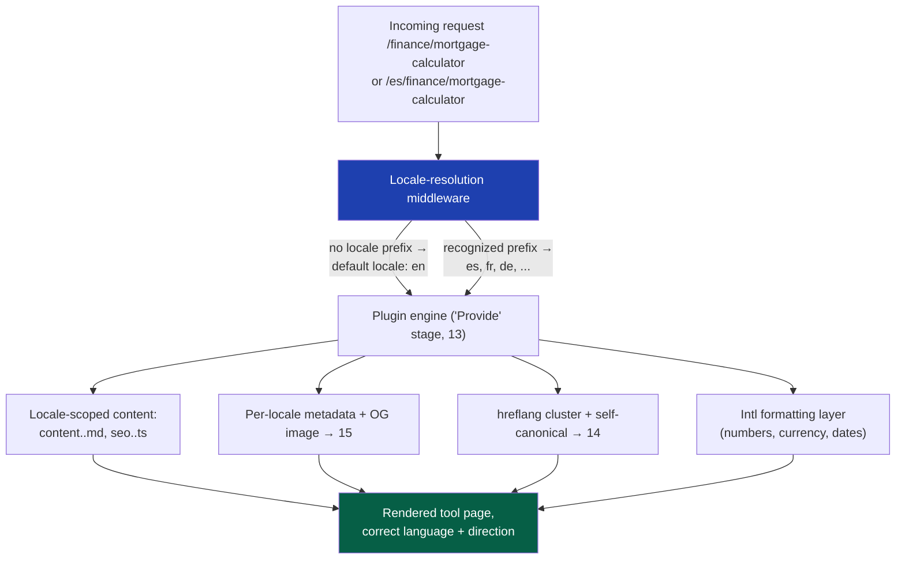
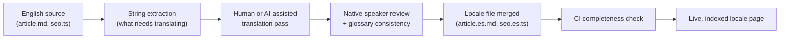

# 36 — Localization

> **Status:** Draft v1 · **Owner:** CTO / Senior Frontend Architect · **Audience:** Everyone touching routing, metadata, or tool content — localization is a platform seam every tool inherits, not a per-tool feature
> **Governed by:** `00-ENGINEERING-PRINCIPLES.md` and the relevant prior chapters, in particular `13` (plugin contract), `14` (SEO architecture), `15` (metadata engine), and `38`.

---

## 1. Why Localization Is a Seam Now, a Feature Later

UToolios ships Phase 1 in English only, with no database, no auth, and no server (`00`). It would be easy to conclude that localization (i18n/l10n) is therefore out of scope until some future phase. That conclusion is half right and half dangerous.

It is right that we will not translate a single tool, hire a translator, or add a second `<html lang>` value in Phase 1. Translation is expensive, ongoing work with no payoff until there is proven non-English search demand (`03`, R1) — building it early is exactly the premature investment `00`'s YAGNI principle exists to prevent.

It is dangerous because **URL structure is permanent** (`09`): once a tool's URL is indexed by Google, it can never be renamed without losing accumulated ranking (`14`). If we ship English at `/[category]/[tool-slug]` today and later decide non-English locales need a `/en/` prefix "for consistency," we face two bad choices: break every indexed English URL, or live forever with English unprefixed and every other locale prefixed. The second choice is actually the *correct* permanent design — but it must be decided **before** the first English URL is indexed, not after.

**Simple explanation:** think of localization like plumbing for a house extension you haven't built yet. You don't need the extra bathroom today, but if you don't leave a stub pipe in the foundation now, adding it later means jackhammering the slab. This chapter pours that stub pipe: the routing shape, the metadata hooks, and the formatting rules are decided and built now; the actual translated content for the `mortgage-calculator` or `jwt-decoder` pages arrives only when the phase gate opens (§9).

> **CTO note:** the single most expensive localization mistake is not translating too late — it's choosing a URL scheme that only *looks* locale-ready. Many teams add `useRouter().locale` logic without ever deciding whether the default locale gets a path prefix. Decide that now, in writing, even though only one locale exists. Reversing it after 50,000 English pages are indexed is a multi-month SEO recovery project, not a refactor.

---

## 2. The Locale Architecture at a Glance



**Simple explanation:** one request comes in; a thin layer decides which language it's for; the same plugin engine that already builds every tool's page (`13`) just gets handed a language tag alongside the tool slug. No tool author writes locale-switching logic — the engine does it once, for every tool, the same way it already handles metadata and structured data.

---

## 3. Locale-Prefixed Routing

The routing rule, fixed now:

| Locale | URL pattern | Example |
|---|---|---|
| Default (English) | `/[category]/[tool-slug]` — **no prefix** | `/finance/mortgage-calculator` |
| Any other locale | `/[locale]/[category]/[tool-slug]` | `/es/finance/mortgage-calculator` |

The default locale stays unprefixed **permanently**, because those URLs are the ones that will be indexed first and longest. Every future locale is additive — a new prefixed branch — never a rename of what exists. This is the App Router equivalent of the classic "as-needed" locale prefix pattern (implementable with a library such as `next-intl`, or a small hand-rolled middleware; the specific library is chosen when Phase 2/3 activates this chapter, per `05`'s "boring, swappable dependencies" stance).

Mechanically, in Phase 1 the seam is just a `middleware.ts` that:
1. Reads the first path segment.
2. If it matches a known locale code (`es`, `fr`, `de`, …), keeps it and passes the remainder to the engine as `{ locale, category, slug }`.
3. If it doesn't match — which, in Phase 1, is every request — treats the whole path as `{ locale: 'en', category, slug }` and renders normally.

No cookie-based or `Accept-Language`-based redirect ever changes the URL a user or crawler lands on. Silent redirects based on browser language are an SEO anti-pattern: they show Googlebot (which requests with no meaningful `Accept-Language`) a different experience than a real Spanish user gets, and they break shareable links. Language switching in the UI is an explicit link to the prefixed URL, never a server-side guess-and-redirect (`26`, avoid surprising the client).

**Simple explanation:** imagine a library where the English section always sits at the front doors with no sign needed, and every other language has its own clearly labeled aisle — "Spanish," "French" — built onto the side of the same building. Nobody has to relabel the English aisle to add French later.

---

## 4. hreflang and Per-Locale Canonicals

Once more than one locale exists, two SEO primitives from `14` extend directly:

- **Self-referencing canonical per locale.** The `/es/finance/mortgage-calculator` page's `<link rel="canonical">` points to itself — never back to the English URL. Canonicalizing every locale to English would tell Google the Spanish page is a duplicate, and it would stop ranking in Spanish search results entirely.
- **`hreflang` alternate cluster.** Every localized version of a tool links to every other version, plus an `x-default` pointing at the unprefixed English URL:

```html
<link rel="alternate" hreflang="en" href="https://utoolios.com/finance/mortgage-calculator" />
<link rel="alternate" hreflang="es" href="https://utoolios.com/es/finance/mortgage-calculator" />
<link rel="alternate" hreflang="x-default" href="https://utoolios.com/finance/mortgage-calculator" />
```

This cluster is generated by the engine from one signal: which locales a given tool folder actually has translated content for (§8). It is never hand-maintained per tool — with 1,000+ tools and eventually a dozen locales, that would be tens of thousands of link tags to keep in sync by hand, an obvious violation of `00`'s "generate, don't hand-maintain" principle already applied to metadata (`15`) and structured data (`16`).

> **CTO note:** a common and costly failure mode is emitting an `hreflang` tag for a locale that doesn't actually have a translated page yet — a 404 or, worse, an English page silently served under a Spanish URL. Google treats broken hreflang clusters as a trust signal failure across the *whole* cluster, not just the broken link. The engine must only emit hreflang links for locale variants that pass a translation-completeness check (§8), never for locales that are merely "configured."

---

## 5. What Actually Gets Translated

Three layers of a tool need translation, and they are not the same effort:

| Layer | Source of truth | Example |
|---|---|---|
| **UI chrome** | Shared platform dictionary (labels, buttons, nav) | "Calculate," "Reset," "Share" |
| **Tool content** | Per-tool files: `article.md`, `faq.md`, `examples.ts` labels | The explanation of amortization on `mortgage-calculator` |
| **Metadata** | `seo.ts` per-locale overrides, feeding `15`'s engine | Localized `<title>`, meta description, OG text |

UI chrome is translated once and reused across all 1,000+ tools — the highest-leverage translation work in the system, since it pays off on every page at once, the same way a metadata template improvement does (`15`). Tool content is the long tail: `article.md` and `faq.md` are most of the words on a page and most of the translation cost, which is why translation is gated on demonstrated demand (§9) rather than done speculatively for all 1,000 tools.

**OG images** deserve their own note. UToolios generates Open Graph images programmatically (`15`, `16`) rather than hand-designing per-tool artwork — the same mechanism extends to locales by re-running the same image template with the localized title string, rather than commissioning a new image per locale. A `jwt-decoder` OG image says "JWT Decoder — Free Online Tool" in English and "Decodificador de JWT — Herramienta Gratuita" in Spanish, generated from the same layout at request or build time.

**Simple explanation:** think of UI chrome like the "Exit" and "Push" signs in a building — translate them once, and every room benefits. Tool content is like the safety manual specific to one room — worth translating only for the rooms people actually visit.

---

## 6. Number, Currency, Date, and Unit Formatting

This is the one piece of localization infrastructure built in **Phase 1**, regardless of whether a second language ever ships — because getting it right is nearly free now and getting it wrong is invisible until a UK or Indian user complains that "1,234.56" or "12,34,567" looks broken.

The rule, consistent with Clean Architecture (`04`, `13`): **`calculator.ts` never formats anything.** It is pure, framework-free, and locale-free — it takes and returns plain numbers (a `number`, never a formatted `string`). Formatting happens exactly once, at the presentation edge, using the native `Intl` API:

```ts
// calculator.ts — pure, locale-free, returns a plain number
export function monthlyPayment(principal: number, rate: number, months: number): number {
  const r = rate / 12;
  return (principal * r) / (1 - Math.pow(1 + r, -months));
}

// view layer — locale-aware formatting only
new Intl.NumberFormat(locale, { style: 'currency', currency }).format(monthlyPayment(...));
```

This single discipline is what lets `mortgage-calculator`'s math be tested once (`13`, `39`) and displayed correctly as `$1,234.56`, `1.234,56 €`, or `₹1,23,456` (Indian digit grouping) without a single branch in the calculation logic. The same principle covers dates (`Intl.DateTimeFormat`) and units — a `tile-calculator` computing area in square meters vs. square feet is a *locale-and-region* formatting concern, not a math concern, and stays out of the pure function.

| Concern | API | Owned by |
|---|---|---|
| Currency symbol, decimal/thousands separator | `Intl.NumberFormat` | View layer |
| Date format (DD/MM vs MM/DD) | `Intl.DateTimeFormat` | View layer |
| Unit system (metric/imperial) | Explicit user input or locale default, passed *into* `calculator.ts` as a parameter | Pure function, as an explicit argument — never inferred silently |

**Simple explanation:** the calculator is the kitchen scale — it always weighs in grams internally, honestly, everywhere. The plate you serve it on shows grams, ounces, or catties depending on who's eating — but the scale itself never lies or changes its mind based on the diner.

---

## 7. Right-to-Left (RTL) Support

Arabic and Hebrew locales (a Phase 2/3 addition, §9) require mirrored layout, not just translated strings. The seam decisions to make now, cheaply, while the component library is still small:

- Use Tailwind's **logical properties** (`ms-`, `me-`, `ps-`, `pe-`, `text-start`, `text-end`) instead of physical ones (`ml-`, `mr-`, `text-left`) in shared layout components from day one — this costs nothing in English and makes RTL a CSS-attribute flip (`dir="rtl"` on `<html>`) rather than a rewrite.
- Icons that imply direction (arrows, "next" chevrons) must be authored as mirrorable SVGs or use a directional wrapper, not baked-in transforms.
- Numerals inside RTL text still read left-to-right (Arabic-Indic or Western digits are not mirrored) — this needs Unicode bidi isolation (`<bdi>` or CSS `unicode-bidi: isolate`) around any number embedded in translated copy, otherwise a formatted currency value can visually scramble inside an RTL sentence.

Visual regression coverage for RTL layouts is a testing concern that belongs with the platform's broader content and visual QA practice (`38`), not a one-off manual check — it must run in CI once RTL locales exist, the same way any other rendering regression is caught.

> **CTO note:** RTL is frequently underestimated because "the translation works fine" — the strings render, nothing crashes, and it ships. The actual failure mode is subtler: a mirrored layout with un-mirrored icons, or a number that visually reverses inside a sentence, reads as *broken* to a native RTL reader even though no error is thrown. Budget real design review time for the first RTL locale; don't treat it as "translation plus a CSS flag."

---

## 8. Translation Workflow: Files First, TMS Later

Phase 1 and early Phase 2 translation, if it happens at all, is **file-based** — plain-text content living in the repo, versioned like code:

```
packages/tools/finance/mortgage-calculator/
  article.md          # English, source of truth
  article.es.md        # Spanish translation
  faq.md
  faq.es.md
  seo.ts               # English metadata
  seo.es.ts            # Spanish metadata overrides
```

The engine treats `article.md` as the source of truth and `article.<locale>.md` as an optional override; if the locale file is absent, the tool simply doesn't exist in that locale (§9) rather than falling back silently. This keeps translation reviewable in ordinary pull requests, diffable, and requiring no new infrastructure — consistent with `05`'s "don't add a system until the simple thing breaks."

A minimal CI check enforces completeness per locale-tool pair: a locale file missing required frontmatter fields (title, description) fails the build, rather than shipping a half-translated page that silently falls back to English strings in one section.



**When this graduates to a Translation Management System** (Crowdin, Lokalise, Phrase, or similar) is a capacity decision, not a tool-count decision. The trigger conditions:

| Signal | Why it forces a TMS |
|---|---|
| More than ~5 active locales | Git-diff review of translation files stops being humanly reviewable |
| A dedicated translator or agency involved | Non-engineers need a UI, not a pull request workflow |
| Update velocity outpaces manual sync | Source content (English) changes faster than translations can be re-reviewed by hand |

Until any of these are true, a TMS is pure overhead — another vendor, another API, another thing that can silently drift out of sync (`21`'s caching-invalidation lesson applies equally to translation-invalidation: a stale translation that quietly diverges from an updated English source is worse than no translation).

**Simple explanation:** today, translating a tool page is like a small publishing team editing chapters in a shared document with track changes — that works fine for a handful of languages. A TMS is hiring a whole translation department with its own software — worth it once you have real translators and real volume, wasted money before that.

---

## 9. Fallback Strategy and Thin-Content Discipline

The single biggest SEO risk in localization is **thin or duplicate content**: a locale page that exists as a URL but shows mostly-English text with three translated sentences bolted on. Google penalizes this, and it damages the *entire domain's* quality signal, not just that one page (`14`, `17`).

The rule: a `/[locale]/[category]/[tool-slug]` route is only generated, only linked in the locale switcher, only included in that locale's sitemap, and only given an `hreflang` entry, if **all required content files exist and pass the completeness check** for that locale. There is no partial state visible to users or crawlers — a tool is either fully present in a locale or it does not exist in that locale at all (it 404s or, better, the locale switcher simply omits it and offers the English version as `x-default`).

This is deliberately stricter than showing an English fallback with a "not yet translated" banner. A banner-fallback page is still a URL, still gets crawled, and still risks being flagged as thin — the safer default is that the page simply doesn't exist until it's real.

---

## 10. What Phase Activates This, and Why Not Sooner

| Capability | Built now (Phase 1) | Activated |
|---|---|---|
| `Intl` number/date/currency formatting | Yes — cheap, needed even for English-only regional variance | Phase 1 |
| Logical CSS properties, mirrorable icons | Yes — near-zero cost while the component library is small | Phase 1 |
| Locale-prefix routing middleware, unprefixed default locale | Yes — the seam, no second locale live | Phase 1 |
| Actual translated tool content | No | Phase 2, gated on evidence of non-English search demand for specific tools |
| RTL locale (Arabic/Hebrew) | No | Phase 2/3, after LTR locales prove the pipeline |
| Translation Management System | No | Phase 2/3, gated on locale/translator count (§8) |

The gate for translating a given tool into a given locale is data, not ambition: keyword-volume evidence (`14`, `17`) that "calculadora de hipoteca" or an equivalent has meaningful, ad-monetizable search volume, weighed against the one-time and ongoing cost of maintaining that translation as the English source evolves. Translating all 1,000+ tools into a dozen languages speculatively is exactly the kind of scale-first-then-need-arrives inversion `00` and `02` warn against.

---

## Summary

- Localization is a **seam decided now, a feature shipped later** — the routing shape and formatting discipline are permanent architectural choices; the translated content itself is deferred until demand is proven.
- **English stays unprefixed at `/[category]/[tool-slug]` forever**; every other locale is additive at `/[locale]/[category]/[tool-slug]` — this avoids ever renaming an indexed URL (`09`, `14`).
- **Self-referencing canonicals per locale plus a generated `hreflang` cluster** (with `x-default`) keep localized pages competing in their own market instead of being treated as English duplicates.
- Translation spans three layers with very different leverage: **UI chrome** (translate once, reuse everywhere), **tool content** (`article.md`/`faq.md`, the long tail), and **metadata/OG images** (generated from the same templates as `15`/`16`, just with localized strings).
- **`calculator.ts` stays pure and locale-free forever** — all number, currency, date, and unit formatting happens at the view layer via the native `Intl` API, never inside the calculation logic.
- **RTL support is a layout discipline (logical CSS properties, mirrorable icons, bidi-isolated numerals) adopted cheaply now**, activated for real when Arabic/Hebrew locales ship.
- Translation workflow starts as **plain files reviewed like code**; a Translation Management System is adopted only when locale count, translator headcount, or update velocity actually demand it — not preemptively.
- **A locale page either exists fully or doesn't exist at all** — no thin, partially-translated, or English-fallback pages are ever indexed, protecting the whole domain's quality signal.
- Translating any specific tool into any specific locale is gated on keyword-demand evidence (`14`, `17`), not built speculatively across all tools and languages at once.

> Next: `37-...md` — the next platform-wide cross-cutting concern.

---

### Changelog
| Version | Date | Change | Reason |
|---------|------|--------|--------|
| v1 | (draft) | Initial localization architecture | Project inception |
