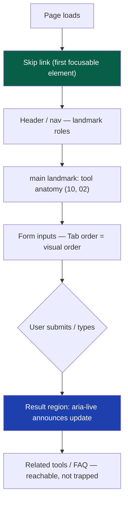
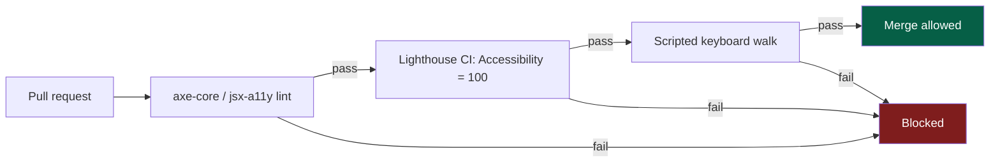

# 37 — Accessibility

> **Status:** Draft v1 · **Owner:** CTO / Principal Frontend Engineer · **Audience:** Everyone building UI — the design system, the layout, or a tool's interactive island
> **Governed by:** `00-ENGINEERING-PRINCIPLES.md` and the relevant prior chapters: `10-FRONTEND-ARCHITECTURE.md` (component/layout ownership), `13-TOOL-PLUGIN-ARCHITECTURE.md` (the plugin contract), `14-SEO-ARCHITECTURE.md` (the semantic-HTML overlap), `07-DEVELOPMENT-WORKFLOW.md` (CI gates).

---

## 1. Why Accessibility Is a Platform Property, Not a Feature

At most companies, accessibility is a checklist applied late, by one team, under deadline pressure. At UToolios that model cannot work: we will have 1,000+ tools built largely solo, then increasingly by AI generation (`00`). If accessibility depended on each tool author remembering ARIA rules, we'd ship 1,000 different levels of correctness — most wrong, discovered only when a screen-reader user complains or a regulator writes a letter.

So we treat accessibility as a **property of the shared platform** — the design system (`packages/ui`) and the layout (`10`) — that every tool inherits automatically the moment it's built from approved building blocks. A tool author who uses `<Input label="Loan amount" />` instead of a raw `<input>` cannot build an inaccessible field even if they never think about accessibility once. The entire strategy of this chapter in one sentence: **concentrate the hard work in the few places it multiplies, so correctness scales for free to the many places it's consumed.**

**Simple explanation:** think of building codes for wheelchair ramps. A city doesn't inspect every citizen's understanding of ramp gradients — it writes the gradient into the building code and certifies the *contractors' standard components* once. Every building built from certified components is automatically compliant. We do the same: certify `packages/ui` once; every one of 1,000+ tools built from it is automatically compliant.

> **CTO note:** the honest risk here is concentration itself — a `packages/ui` accessibility bug isn't one tool's bug, it's a platform-wide bug replicated across every page using that component. `packages/ui` gets a *deeper* audit bar than any single tool, and a shared-component change is a higher-risk PR (`07`) than editing one tool's `calculator.ts`. Concentrating the work also concentrates the blast radius — worth it, but it must be managed, not ignored.

---

## 2. The Standard We Hold: WCAG 2.2 AA

We target **WCAG 2.2 Level AA** as the floor for every page, not an aspirational ceiling. AA is the standard actually used by regulators (ADA case law in the US, EN 301 549 in the EU), by enterprise procurement questionnaires we'll face once we sell APIs (`22`), and by every major audit tool — including Lighthouse's Accessibility category, which lets us gate on it mechanically (§8).

| WCAG principle | What it requires | Where we implement it |
|---|---|---|
| **Perceivable** | Content presentable in more than one way (text alternatives, contrast, adaptable layout) | `packages/ui` tokens, alt text, semantic HTML |
| **Operable** | All functionality available from a keyboard, with enough time, without triggering seizures | Focus management (§4), no keyboard traps |
| **Understandable** | Content is readable and behaves predictably | Plain-language copy (`14`), consistent layout (`10`) |
| **Robust** | Content works with assistive technology, now and in the future | Valid semantic HTML + correct ARIA (§6) |

We do not chase AAA site-wide — it includes criteria (e.g. sign-language interpretation for video, 7:1 contrast) that are either irrelevant to a text-and-forms utility platform or actively at odds with brand and density. We apply AAA-level rigor selectively where it costs little, but we don't claim a standard we haven't earned. Claiming AA and hitting it beats claiming AAA and missing it.

**Simple explanation:** AA is a building meeting full fire-and-safety code — the level that actually matters for inspections and real safety. AAA is adding marble floors and a helipad — nice, mostly irrelevant to the code. We build to code, properly, everywhere.

---

## 3. The Accessible-by-Default Design System

`packages/ui` (`10`, §5) is where accessibility lives. Every component a tool author can reach for is built once, audited once, correct by construction:

| Component | Accessibility built in |
|---|---|
| `Input`, `Select`, `Textarea` | Associated `<label>`, `aria-describedby` for errors, visible focus ring, correct mobile `inputmode` |
| `Button` | Real `<button>`, disabled/loading state announced (`aria-busy`) |
| `ResultCard` | Result announced via `aria-live="polite"` on update (`13`) |
| `Accordion` (FAQ, `13`) | `aria-expanded`, keyboard-operable, correct `button`/`region` pairing |
| `Tabs` (e.g. metric/imperial) | Arrow-key navigation, `role="tablist"` |
| `Modal` (rare) | Focus trap, `Esc` to close, focus returns to trigger |
| `Tooltip` | Keyboard-reachable, not hover-only; dismissible |

A tool author never builds a checkbox, dropdown, or accordion from scratch — they compose from this list. The plugin contract (`13`) doesn't *require* accessibility as a separate obligation; it's satisfied automatically by only ever importing from `packages/ui` for interactive elements, already the architectural default (`10`, §5).

**Simple explanation:** the `mortgage-calculator`'s loan-term dropdown and the `bmi-calculator`'s unit toggle are both built from the same `Select`/`Tabs` component. Fix a keyboard bug once, and both tools — and 998 others — are fixed simultaneously.

> **CTO note:** the temptation, once AI is generating tools (`00`), is for a generated tool to reach past `packages/ui` and hand-roll a "slightly custom" input because the design system lacks the exact widget imagined. That's the biggest way accessibility debt re-enters a platform that has otherwise solved it structurally. The guardrail is a lint rule (`08`) flagging raw interactive HTML inside a tool folder — a missing widget gets added *to `packages/ui`*, reviewed once, never bypassed per tool.

---

## 4. Keyboard Operability and Focus Management

Every tool must be fully usable with a keyboard alone — no mouse, no touch. This is both a WCAG requirement (Operable) and a practical one: switch users, some screen-reader users, and power users all navigate this way.

Rules enforced across the layout and design system:

- **Every interactive element is reachable via `Tab`**, in a logical order matching the visual layout — DOM order = tab order; we never use positive `tabindex` to reorder.
- **Focus is always visible.** A visible focus ring (`packages/ui` token, not `outline: none`) on every focusable element — removing this for aesthetics is the single most common accessibility bug on the web.
- **No keyboard traps.** A user can always `Tab` or `Esc` out of any component, including the rare modal.
- **Skip link** at the top of every page (shared layout, `10` §4): "Skip to main content," bypassing header/nav on every load — with 1,000+ pages, used constantly.
- **Focus management after interaction.** When a calculator produces a result (`jwt-decoder`, `mortgage-calculator`), focus isn't silently moved; the result is announced via `aria-live` (§3) so a screen-reader user hears it without losing their place in the form.

**Simple explanation:** imagine using the `tile-calculator` with your eyes closed, using only Tab and Enter. You should be able to reach every field, fill it in, trigger the calculation, and hear the answer — in the same order a sighted mouse user would naturally move through the page. If at any point you get stuck, or the answer appears silently with no way to discover it, the tool has failed its most basic accessibility obligation.

---

## 5. Screen-Reader Support: Landmarks, Semantics, and Structure

Screen readers (VoiceOver, NVDA, JAWS, TalkBack) navigate primarily by **landmarks** and **heading structure**, not by reading top to bottom. The shared layout (`10`, §4) guarantees both automatically:

| Landmark | Purpose |
|---|---|
| `<header role="banner">` | Site header, nav |
| `<nav>` | Primary navigation, breadcrumbs (`18`) |
| `<main>` (one per page) | The tool itself — where a screen-reader user jumps directly |
| `<aside>` | Related tools, ads container — clearly separated from the answer |
| `<footer role="contentinfo">` | Site footer |

All provided by the shared layout (`10`, §4) — never authored per tool.

Heading structure follows the tool anatomy (`02`, §4; `14`): one `<h1>` (the tool name), then `<h2>`s in a fixed order (Result, How it works, FAQ, Related tools) — never skipped levels, never used purely for visual size (that's a Tailwind token, `10` §6). This is also exactly what `14-SEO-ARCHITECTURE.md` wants for crawlability — accessibility and SEO doing the *same work, counted twice* (§10).

Every meaningful image gets real alternative text; every purely decorative image is marked `alt=""` so screen readers skip it rather than reading a meaningless filename.

**Simple explanation:** a screen-reader user on the `jwt-decoder` doesn't listen to the whole page start-to-finish — they jump landmark to landmark like scanning a table of contents, then drill into `<main>`. If `<main>` doesn't exist, or the heading order jumps from `<h2>` to `<h4>`, that user loses the map entirely, on every one of a thousand pages, not just one.

---

## 6. ARIA: A Last Resort, Applied Correctly

The first rule of ARIA: **use semantic HTML instead of ARIA whenever possible.** A `<button>` is already a button to every assistive technology — no `role="button"` needed. ARIA describes the handful of patterns HTML doesn't natively support (live regions, tab groups, expanded/collapsed state).

| Situation | Correct approach |
|---|---|
| A clickable element | Real `<button>`, not `
` |
| A result updating without reload | `aria-live="polite"` region (§3) |
| An expandable FAQ answer | `aria-expanded` + `aria-controls`, pre-built in `Accordion` |
| A validation error | `aria-invalid="true"` + `aria-describedby` |
| A required field | Native `required` + visible label indicator |
| Decorative icon | `aria-hidden="true"` |

Because these patterns live in `packages/ui`, a tool author never writes raw ARIA attributes — they configure a component prop (`<Input error="..." />`) and the component emits the correct ARIA underneath. Incorrect ARIA is worse than no ARIA — a wrong `aria-live` value or mismatched `aria-controls` id actively misinforms assistive technology rather than merely omitting information.

> **CTO note:** the most common ARIA mistake once tools are AI-generated is *ARIA sprinkled everywhere "to be safe."* Overuse is real — a page where every `
` has a `role` and `aria-label` often confuses a screen reader more than plain HTML. The lint rule (§3) also flags hand-written `aria-*` inside a tool folder, outside a small documented allow-list. New ARIA behavior is a reviewed `packages/ui` change — never a per-tool improvisation.

---

## 7. Contrast, Motion, and Forms

**Contrast.** Every text/background pairing in the Tailwind token set (`10`, §6) meets or exceeds WCAG AA contrast ratios (4.5:1 normal text, 3:1 large text/UI components) — checked once at the token level. Because tools can't use arbitrary colors (`10`, §6), a tool author cannot accidentally ship low-contrast text; the palette has no failing combination in it.

**Reduced motion.** Any animation (accordion expand, result transition) respects `prefers-reduced-motion`, implemented once via a shared motion token/hook rather than per component. Users with vestibular disorders who've set this OS preference get an instant, non-animated experience automatically, on every tool.

**Forms.** Forms are the core interaction on this platform — nearly every tool *is* a form (`02`, C3). The rules:

| Rule | Why |
|---|---|
| Real, associated `<label>` — never a placeholder standing in for one | Placeholders disappear on input, unreliable for assistive tech |
| Errors announced (`aria-live`) and described (`aria-describedby`), not color-only | Color-blind and screen-reader users both need a non-color signal |
| Units explicit in the label, not implied by placement | Screen readers may not convey visual proximity |
| Touch targets ≥ 24×24px (WCAG 2.2, `10` mobile-first) | Motor-impairment and mobile usability overlap |

**Simple explanation:** picture a form where the currency sign floats beside the box instead of inside the label. A sighted user infers "oh, that's dollars." A screen-reader user, hearing only "edit text, blank," has no idea. On the `mortgage-calculator`, the label reads "Loan amount (USD)" — understandable with eyes closed, exactly as clear as with eyes open.

---

## 8. CI Gates: 100 Lighthouse Accessibility, Enforced

Accessibility is only real if checked automatically, the same way performance and SEO are (`20`, `14`) — not a manual QA pass we hope someone remembers.

| Gate | Tool | Catches | Blocks merge? |
|---|---|---|---|
| **Lighthouse Accessibility = 100** | Lighthouse CI (`07`) | Contrast, missing labels, ARIA misuse, landmark issues | Yes — hard fail below 100 |
| **Automated a11y linting** | `axe-core` / `eslint-plugin-jsx-a11y`, `a11y` CI step (`07`) | Static issues at author-time | Yes |
| **Keyboard-only smoke test** | Scripted Tab/Enter/Esc walk | Keyboard traps, broken focus order | Yes, for interactive islands |
| **Manual screen-reader spot-check** | VoiceOver/NVDA, sampled | What automation misses — announcement quality | Periodic, deferred to Phase 2 (§9) |

**Simple explanation:** the way a spell-checker underlines a typo before you hit publish, our CI pipeline flags an accessibility mistake before a tool reaches a real user — a missing label on the `bmi-calculator`'s height field fails the build exactly like a missing semicolon would, with no human needing to notice it by eye.

> **CTO note:** automated tools catch roughly 30-50% of real WCAG issues industry-wide — excellent at contrast, missing labels, and structural ARIA, blind to whether an announcement actually makes sense read aloud. 100 Lighthouse Accessibility is a necessary floor, not a certification of full compliance. We don't oversell it as "fully WCAG audited" — it's "automatically gated, plus periodic manual verification" (§9), the honest claim for a solo-founder Phase 1 team.

---

## 9. What's Deferred, and Why the Seam Is Built Now

Full manual auditing — professional audits, assistive-technology test matrices, a dedicated specialist — is not a Phase 1 activity for a solo founder building 1,000 tools before revenue exists (`00`, YAGNI). What we build now is the **seam**: correctness guaranteed at the design-system level (§3) and gated in CI (§8), so manual auditing — when justified by scale or an enterprise compliance requirement (`22`, Phase 3) — has a tiny surface (~30 components, not 1,000 tools) rather than starting from zero.

| Phase | Accessibility posture | Trigger |
|---|---|---|
| **Phase 1 (now)** | Accessible-by-default `packages/ui`, CI-gated 100 Lighthouse, lint-enforced | — |
| **Phase 2** | Periodic manual screen-reader spot-checks, RUM-informed sample prioritization (`21`, `30`) | Traffic volume makes sampling meaningful |
| **Phase 3** | Formal WCAG 2.2 AA conformance statement (VPAT) for enterprise/API customers (`22`, `23`) | Enterprise procurement requires it |

This mirrors how we phase auth, database, and NestJS elsewhere (`04`, `11`, `23`): build the mechanism that scales for free now, defer the expensive specialist-driven layer until a concrete need — enterprise sales, real scale — actually arrives.

**Simple explanation:** we're not hiring an accessibility auditor before we have users, the same way we're not hiring a DBA before we have a database (`12`). But every tool is built from certified-accessible parts from day one, so when an auditor eventually looks, they're auditing 30 well-built components instead of triaging 1,000 tools with no discipline.

---

## 10. Where Accessibility Overlaps SEO and Performance

Accessibility, SEO (`14`), and performance (`20`) are not separate disciplines competing for engineering time — to a large degree they are the *same underlying work*, evaluated through three lenses:

| Practice | Accessibility benefit | SEO benefit (`14`) | Performance benefit (`20`) |
|---|---|---|---|
| Semantic HTML, landmarks | Screen-reader navigation | Crawler understands structure | Smaller DOM, less JS to fake it |
| Server-rendered content (`10`) | Content present without JS for struggling AT | Crawlable without executing JS | Faster LCP, smaller bundle |
| Explicit image dimensions (`20`, §6) | Stable layout aids cognitive accessibility | Core Web Vitals ranking factor | Near-zero CLS |
| One `<h1>`/heading hierarchy | Table-of-contents navigation | Relevance signal | — |
| Labeled, structured forms | Form completion | indirect | — |

This is why Lighthouse scores all four categories (Performance, SEO, Accessibility, Best Practices) from the same audit run (`10`, §8; `20`, §2) — they're genuinely correlated, not unrelated homework. A tool built correctly from `packages/ui` and the shared layout tends to score near 100 on all four simultaneously, because the underlying discipline is what all four are measuring, from different angles.

**Simple explanation:** flossing helps your teeth, your breath, and your dentist bill — one habit, three benefits. Building the `tile-calculator` from semantic, server-rendered, properly-labeled components makes it accessible, makes it rank, and makes it fast — one disciplined build, three scores.

---

## Summary

- We target **WCAG 2.2 Level AA** everywhere — the standard used by law, procurement, and Lighthouse — not an unearned AAA claim.
- Accessibility is a **property of `packages/ui` and the shared layout** (`10`), audited once and inherited by every one of 1,000+ tools.
- **Keyboard operability** and **focus management** (`aria-live` announcements) are handled by shared components and the layout, never per tool.
- **Screen-reader support** rests on correct landmarks and a fixed heading structure (`02`, `14`) provided automatically by the layout.
- **ARIA is a last resort**, applied correctly inside `packages/ui` only — a lint rule blocks raw ARIA and interactive HTML in tool folders.
- **Contrast, reduced motion, and form labeling** are solved at the token/component level once, immune to per-tool regression.
- **CI gates enforce 100 Lighthouse Accessibility** plus `axe-core`/`jsx-a11y` linting and a scripted keyboard walk on every PR (`07`) — automation catches roughly half of real issues, honestly.
- **Manual audits and VPATs are deliberately deferred** to Phase 2 (sampling) and Phase 3 (enterprise statements, `22`) — the seam built now keeps that later audit small.
- **Accessibility, SEO, and performance are largely the same discipline**, why one well-built tool scores near 100 on all three.

> Next: `38-INTERNATIONALIZATION.md` — the target multi-language design, and why i18n stays deferred behind a content-agnostic seam until Phase 2/3 traffic justifies translating 1,000+ tools.

---

### Changelog

| Version | Date | Change | Reason |
|---|---|---|---|
| v1 | (draft) | Initial accessibility architecture | Project inception |
