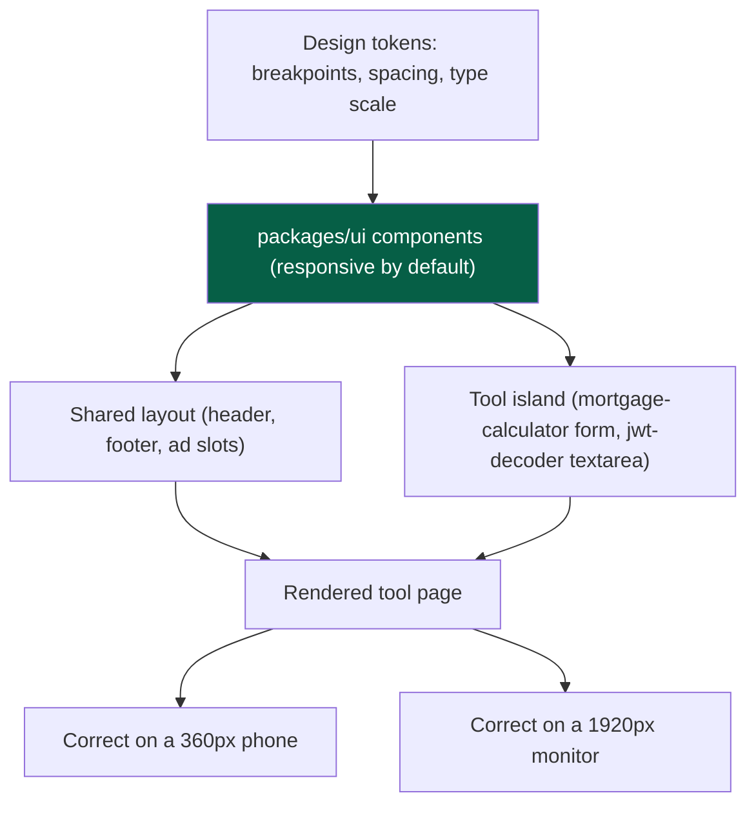
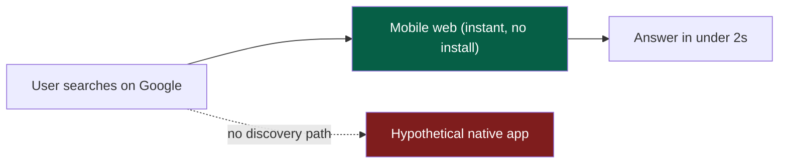
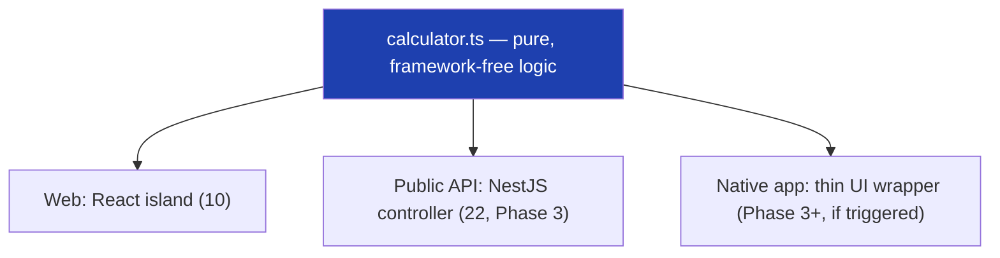

# 38 — Mobile

> **Status:** Draft v1 · **Owner:** CTO / Principal Frontend Engineer · **Audience:** Everyone building the frontend or a tool's interactive island — mobile is the majority device, not an edge case
> **Governed by:** `00-ENGINEERING-PRINCIPLES.md` and the relevant prior chapters, in particular `10-FRONTEND-ARCHITECTURE.md` and `20-PERFORMANCE.md`.

---

## 1. Mobile Is the Primary Device, Not a Breakpoint

Long-tail SEO traffic (`01`, Bet B1; `14`) arrives overwhelmingly from search on phones. For most tool categories — unit conversions, quick math, "how much is X in Y" — the realistic session is someone standing in a hardware store checking a `tile-calculator`, or glancing at a `bmi-calculator` result on a train. If UToolios is slow or fiddly on a mid-range Android phone on patchy 4G, it fails the majority of its users, not a minority we can deprioritize.

This chapter's position is deliberately blunt: **mobile web is not a variant of the desktop experience — it is the baseline the desktop experience is checked against.** We design and test mobile-first, and we treat "works great on my laptop" as an incomplete definition of done.

**Simple explanation:** think of a food truck menu board versus a sit-down restaurant's leather-bound menu. Design the leather-bound version first and shrink it to fit the truck's small board, and you get cramped text for the majority of your customers, who are walking past on foot. Design the truck board first — clear, big, fast to read at a glance — and the sit-down menu is easy to expand from there.

> **CTO note:** it is tempting, especially for a solo founder building fast, to prototype on a widescreen monitor and "make it responsive later." That ordering optimizes for the minority of sessions (desktop) at the expense of the majority (mobile), and retrofitting touch targets and layout later is far costlier than building them in from tool #1.

---

## 2. Responsive, From the Design System — Not Per Tool

Because every tool is rendered through the same shared layout and the same `packages/ui` component library (`10`, §4–5), responsiveness is a property we build **once**, in the design system, not something each tool author reasons about. A tool author writes `<Input label="Loan amount" />` and `<ResultCard />`; they never write a media query.

| Layer | Responsibility | Where enforced |
|---|---|---|
| Design tokens | One set of breakpoints and fluid type/spacing scales | Tailwind preset, `packages/config` (`10`, §6) |
| `packages/ui` components | Every shared component (`Button`, `Input`, `Accordion`, `ResultCard`) responsive and touch-safe by construction | `packages/ui` |
| Shared layout | Header, nav, footer, ad slots collapse/reflow correctly, once, centrally | Layout (`10`, §4) |
| Tool's interactive island | Composes only from `packages/ui` primitives; no bespoke breakpoints | Tool folder (`13`) |

**Simple explanation:** it's the same picture-frame idea from `10` — we don't reshape a thousand individual frames for a thousand wall sizes. We design one frame that resizes correctly, and every painting (tool) that goes into it resizes correctly for free. The `mortgage-calculator`'s inputs, buttons, and result card aren't specially coded for mobile — they're built from `packages/ui` blocks already made to behave correctly at 360px and at 1920px.

> **CTO note:** the alternative — each tool author hand-tuning breakpoints — doesn't just cost time, it *guarantees inconsistency* at scale. With AI generating a growing share of tool code (`00`, `13`), responsiveness stays correct across thousands of AI-authored tools only if the responsive logic lives in the handful of components the AI composes from, never in freeform CSS it has to get right each time.

---

## 3. Performance on Low-End Devices

`20-PERFORMANCE.md` sets Core Web Vitals targets (LCP < 1.8s, INP < 100ms, CLS < 0.05) as the default for every tool. Those targets are measured against **mid-tier and low-end mobile hardware on throttled connections**, not a developer's fast laptop on fibre — because that is the honest median of our traffic, especially in markets where cheaper Android devices dominate.

| Risk specific to mobile | Mitigation |
|---|---|
| Slower CPUs make JS parsing/execution the bottleneck, not just download size | Client JS budget (`20`, §3) enforced regardless of connection |
| Variable/throttled 3G/4G networks | Static/ISR + edge caching (`20`, §4, §8) — most of the page is already-baked HTML |
| Touch input adds latency if JS is heavy | `'use client'` islands minimal, pushed to leaf nodes (`10`, §2) — keeps INP low on modest CPUs |
| Ads disproportionately heavy on low-end devices | `AdSlot` lazy-loading and reserved space (`19`, `20`, §10) apply identically — no laxer mobile ad budget |

**Simple explanation:** a video streams fine on a fast laptop with good Wi-Fi but stutters badly on an older phone on patchy 4G — same file, wildly different experience. We test as if every visitor has the older phone and the patchy signal, because a meaningful share of them do. If the `jwt-decoder` feels instant on a five-year-old, throttled Android phone, it feels instant everywhere.

> **CTO note:** Lighthouse CI's default mobile emulation (throttled CPU and network) should be the profile we gate on, not the unthrottled desktop profile — an easy setting to get wrong that quietly hides mobile regressions until real users hit them. Verify it explicitly; don't assume the default matches our intent.

---

## 4. Touch UX: Designed, Not Just "Not Broken"

Mouse-and-keyboard interaction patterns don't automatically translate to touch. The design system encodes touch-specific rules so every tool inherits them:

| Rule | Why | Enforced in |
|---|---|---|
| Minimum touch target **44×44px** (WCAG 2.5.5 / Apple HIG) | Smaller targets cause mis-taps on number pads and toggles | `packages/ui` sizing |
| No hover-only interactions | Touch has no hover state; a reveal-on-hover element is invisible on mobile | Component rule; `[review]` |
| Numeric inputs trigger the numeric keyboard (`inputmode="decimal"`) | A loan-amount field popping the full alphabetic keyboard is friction on every session | `Input` variants |
| Sticky/visible primary action on long forms | "Calculate" shouldn't scroll out of reach on a tall multi-field tool | `packages/ui` layout pattern |
| Generous spacing between adjacent controls | Prevents accidental taps on the wrong toggle | Design tokens (`10`, §6) |
| Correct `viewport` meta, no forced zoom | Avoids double-tap-to-zoom traps | Root layout (`10`, §4) |

**Simple explanation:** think of ATM buttons versus a desktop mouse cursor. A mouse pointer can precisely hit a tiny checkbox; a fingertip cannot — ATM buttons are deliberately large and spaced because fingers, often in a hurry, need margin for error. Every input on the `tile-calculator` is sized and spaced like ATM buttons, not mouse-cursor targets.

> **CTO note:** touch UX bugs are hard to catch from a desk, because the reviewer is usually testing with a mouse. Require an actual phone (or Chrome DevTools' touch emulation plus a periodic real-device pass) for any new shared component in `packages/ui` — a component with a touch problem affects every tool, not one.

---

## 5. Progressive Web App (PWA): A Deliberate, Narrow Bet

An installable, offline-capable PWA is *possible* for a Next.js site with relatively little effort — a web app manifest and a service worker. But we treat it as an **opt-in enhancement for specific tools, not a platform-wide commitment**: most of our traffic is a single, unrepeated search visit (`01`, B1). A user who lands on `unit-converter`, gets their answer, and leaves has no natural moment to be prompted to "install" anything — and an aggressive install prompt actively harms the instant-answer experience we optimize for (`02`, C3).

| PWA capability | Where it earns its cost | Where it doesn't |
|---|---|---|
| Installable (manifest + icons) | A tool with genuine repeat/offline use | The long tail of one-shot, single-search tools |
| Offline support (service worker cache) | Pure client-side calculators with no data dependency | Anything relying on fresh server data (rates, ISR content) |
| Add-to-home-screen prompt | Never as an interruptive first-visit prompt | — |
| Push notifications | Not applicable to our tool model currently | Everywhere, for now |

**Simple explanation:** a PWA install prompt is like a shop clerk asking "want to join our loyalty program?" the instant you walk in to buy one thing. For a customer leaving right after a single purchase, that's friction, not value; for a weekly regular, it's genuinely useful. We only offer the "loyalty card" (installability) where repeat use is plausible — never as a platform-wide default nagging every one-time visitor to `roman-numeral-converter`.

> **CTO note — trade-off, stated honestly:** a full PWA push (install prompts, background sync, push notifications) is a plausible idea for a *reference-tool* subset of the catalog someday, but it isn't free — service workers add cache-invalidation complexity (`21`) and a whole class of "stale cached version" bugs, exactly the operational surface a solo founder should avoid before there's clear demand. We keep the *seam* (Next.js supports PWA primitives natively) but don't build the full experience platform-wide until a tool's usage pattern justifies it (`02`, tier ladder — a Gold-tier enhancement, not a baseline).

---

## 6. Why Web-First, Before Native

A native iOS/Android app is explicitly **not** part of the Phase 1 or Phase 2 plan, and the reasoning is architectural and economic, not just "not enough time":

1. **Mobile web already reaches 100% of our acquisition channel.** Organic search (`01`, B1; `14`) sends users to a URL, not an app store listing. A native app is invisible to that traffic unless the user already knows to look for it — which, for a brand-new utility site, almost no one does.
2. **One page template already serves every device class.** The frontend architecture (`10`) renders any of 1,000+ tools through one shared, responsive layout. A native app needs its own UI layer, its own release cycle, and its own way of "adding tool #501" — undermining the "zero platform code changes per tool" promise (`13`).
3. **App stores add cost and friction with no offsetting benefit yet.** Review cycles, platform fees, two more codebases to keep in sync — all before a single confirmed user has asked for it.
4. **The core value needs no app.** "Convert these units" or "decode this JWT" benefits from loading in under two seconds from a search result, which mobile web already does (`20`) — not from a native shell.

**Simple explanation:** imagine a hardware store where every customer walks in off the street. A fully-stocked storefront anyone can enter instantly serves 100% of that foot traffic. A "members-only back room" requiring a separate application and a special key (the app-store install) serves only the tiny fraction who already knew to ask. We perfect the storefront (mobile web) before considering the back room (native app).

> **CTO note:** the urge to build a native app early is usually emotional, not evidential — apps "feel" like a real product. Resist it. An app built before product-market fit is validated is a maintenance burden with no revenue behind it; the same hours spent on more tools or better SEO produce far more MSTC (`00`, North Star) growth per hour invested at this stage.

---

## 7. The Reuse Guarantee: Native Later Uses the Same `calculator.ts`

When native apps *do* eventually make sense (§8), Clean Architecture (`04`, `13`, §3.3) already guarantees the hard part is solved: **the pure calculation logic is never rewritten.**

Every tool's `calculator.ts` is deliberately framework-free — no React, no Next.js, no DOM, no browser APIs. It is pure TypeScript: given validated inputs, it returns an answer. That purity is what makes it portable to *any* consumer:

| Consumer | What it wraps `calculator.ts` in | What stays identical |
|---|---|---|
| Web (today) | A React island (`10`) reading form state, rendering `ResultCard` | The math/logic itself |
| Public API (Phase 3, `22`) | A NestJS controller receiving a validated request body | The same math/logic |
| Native app (Phase 3+, if built) | A thin native UI (React Native / Swift / Kotlin) calling the same package, or the API | The same math/logic |

**Simple explanation:** think of `calculator.ts` as the recipe itself — the exact steps and quantities, independent of what kitchen it's cooked in. Today the recipe runs in the "kitchen" of a web browser. Tomorrow, an API or native-app "kitchen" follows the *same recipe*, unchanged — only the surrounding kitchen differs. The `mortgage-calculator`'s payment math, once written and tested, is written once, forever.

This is not a future aspiration bolted on later — it is *why* the plugin contract insists on framework-free logic from tool #1 (`13`, §3.3). We aren't "preparing for native" as extra work; native-readiness comes free from keeping the architecture clean for reasons (testability, API reuse) that matter regardless of whether native ever ships.

> **CTO note:** this is the strongest argument for the Clean Architecture discipline in `13` — it turns "should we build native?" from a rewrite decision into a UI-wrapping decision. A team that let calculator logic leak into React components would face rewriting 1,000+ tools' math for native; we'd only write thin native UI wrappers around logic that already exists and is already tested.

---

## 8. When Native Activates, and the Trigger That Justifies It

Native apps are deferred, tentatively, to **Phase 3 or later** — the same phase that introduces auth, premium tiers, and the public API (`01`, `23`, `24`, `22`). We schedule it by **evidence**, not calendar date.

| Trigger condition | Why it justifies the investment |
|---|---|
| A meaningful share of returning users specifically request offline/installed access | Signals real repeat-use demand the PWA seam (§5) can't fully satisfy |
| Premium tiers exist and native meaningfully improves retention or upsell | Direct revenue tie-in, not just a "nice to have" |
| Usage data shows a specific tool category with genuine daily-repeat behavior (e.g. a trade tool used constantly by tradespeople) | Justifies native *for that category*, not the whole platform blindly |
| The public API (`22`) and auth (`23`) already exist and are stable | Native needs a stable backend contract to build against |

Until one of these is true, the honest answer is: **we build the seam, not the app** — framework-free `calculator.ts` for every tool (already true, `13`), a stable versioned public API contract (Phase 3, `22`) a native client could call, and a design system (`10`) whose tokens could inform a native design language later.

We do **not** pre-build app-store developer accounts, iOS/Android CI pipelines, push infrastructure, or a mobile-specific backend — before the trigger fires, that is speculative infrastructure for zero users (`00`, YAGNI).

**Simple explanation:** you don't build a delivery-truck fleet before confirming people want home delivery — you make sure the inventory system (the API, the pure logic) is solid enough that when delivery is clearly wanted, adding trucks is a logistics decision, not a rebuild.

> **CTO note:** the riskiest failure mode isn't "we never build native" — it's building it *too early*, on founder enthusiasm rather than user signal, then maintaining two more codebases solo while 1,000+ web tools still need building. Every hour on a premature native app is an hour not spent on the SEO surface area (`14`–`18`) that is the validated growth lever today.

---

## 9. Summary

- **Mobile web is the baseline experience**, not a responsive afterthought — the majority of organic search traffic (`01`, B1) arrives on phones.
- **Responsiveness lives in the design system (`packages/ui`) and shared layout (`10`), never per tool** — a tool author composes from responsive, touch-safe primitives and gets correctness for free.
- **Performance targets (`20`) are measured against low-end mobile hardware and throttled networks**, the honest median device profile, not the developer's laptop.
- **Touch UX is designed, not assumed**: 44×44px targets, no hover-only interactions, correct input modes, generous spacing — enforced in shared components, checked in review.
- **PWA is a narrow, opt-in enhancement** for tools with genuine repeat-use signal — not a platform-wide install-prompt push that would harm the single-visit, instant-answer experience.
- **Native apps are explicitly deferred to Phase 3+**, activated by evidence (repeat-use demand, premium tie-in, stable public API) — not by calendar date or founder enthusiasm.
- **The reuse guarantee is already built in**: every `calculator.ts` is pure, framework-free logic (`13`, §3.3), so web, API (`22`), and any eventual native app call the *identical* function — native, if it ships, is a UI-wrapping exercise, not a rewrite.
- **We build the seam now; we build the app only when the trigger fires** — YAGNI (`00`) applied to the most expensive possible platform expansion.

> Next: `39-PWA-AND-OFFLINE.md` — the narrow PWA implementation contract for opt-in tools, service worker cache strategy, and the cache-invalidation risks that keep it deliberately scoped.

---

### Changelog

| Version | Date | Change | Reason |
|---|---|---|---|
| v1 | (draft) | Initial mobile strategy | Project inception |
