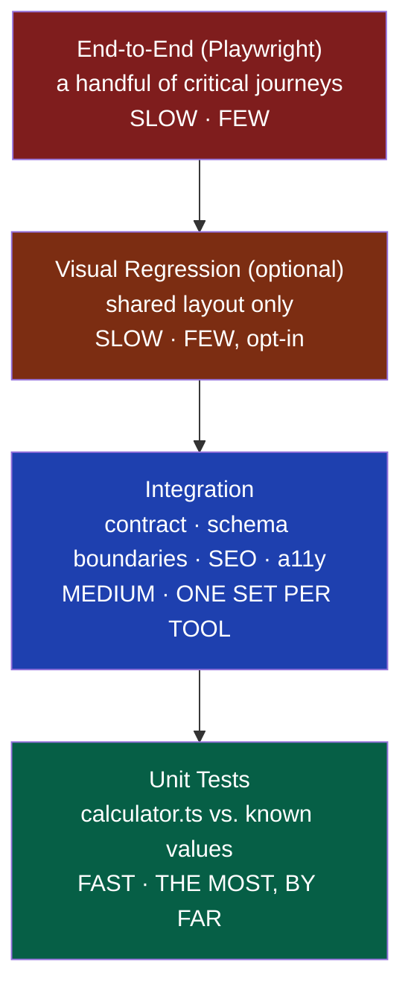
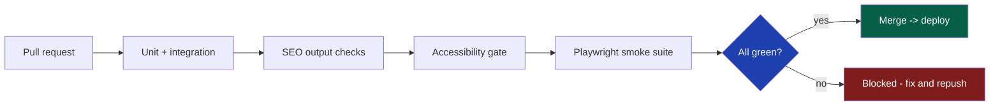

# 39 — Testing

> Status: Draft v1 · Owner: CTO / Principal Architect · Audience: Everyone who writes, reviews, or generates a tool — this is how "it works" becomes a provable claim
> Governed by: 00-ENGINEERING-PRINCIPLES.md and the relevant prior chapters, especially 07-DEVELOPMENT-WORKFLOW.md (the `pnpm verify` loop), 13-TOOL-PLUGIN-ARCHITECTURE.md (the contract these tests enforce), 35-AI-TOOL-GENERATION.md (why an AI's own tests aren't proof), and 37-ACCESSIBILITY.md (the a11y layer of this pyramid).

---

## 1. Why Testing Is a Platform Property, Not a Checklist

UToolios's value proposition rests on one word: **correct**. A visitor trusts the `mortgage-calculator`'s monthly payment, the `bmi-calculator`'s category, the `jwt-decoder`'s decoded payload — enough to make a real decision or share the page. If a fraction of 1,000+ tools are subtly wrong, trust erodes silently, long before Sentry (`30`) would show a symptom. Nothing throws when a formula returns the wrong number.

At this scale — thousands of tools, many written by a solo founder under time pressure, an increasing share generated by AI (`35`) — testing cannot depend on any individual remembering to be careful. It has to be **structural**: the same fixed file (`tests.spec.ts`, `13`, §3.5) in every folder, the same commands, the same merge gate, human or AI. Testing is not QA bolted on at the end; it's the mechanism that turns "I believe this is right" into "this is proven right, mechanically."

**Simple explanation:** think of a chain of pharmacies. Nobody trusts a pharmacy because the pharmacist looks trustworthy — they trust it because every batch is tested against a known-good reference before it reaches a shelf, regardless of who mixed it. `tests.spec.ts` is that batch test. The `tile-calculator` and the `mortgage-calculator` both get tested the same mechanical way before going live.

> **CTO note:** the biggest risk isn't a tool with zero tests — CI catches that loudly (§11). The real risk is a tool whose tests pass and are still wrong, because the test was written to match the code instead of reality. Everything from §3 onward exists to keep that gap as small as structurally possible.

---

## 2. The Test Pyramid, Shaped by a Thousand Tools

The classic pyramid — many fast unit tests, fewer integration tests, very few slow end-to-end tests — applies almost unmodified, but the *why* is sharper: with 1,000+ tools, anything not fast per-tool becomes a CI cost and a feedback-loop problem, not just an inconvenience.

| Layer | Proves | Runs against | Frequency |
|---|---|---|---|
| Unit | `calculator.ts` returns known-correct output | Pure functions | Every save/PR |
| Integration | Contract satisfied; schema rejects bad input; (Phase 2) server/DB boundaries hold | Contract, Zod, API | Every PR |
| SEO output | Canonical, metadata, structured data, links correct & unique | Rendered routes (`14`,`15`,`16`,`18`) | Every PR |
| Accessibility | Landmarks, labels, contrast, keyboard path meet WCAG AA (`37`) | Rendered page | Every PR |
| End-to-end | A few critical journeys work in a real browser | Full stack | Every PR |
| Visual regression | Layout hasn't silently broken | Shared layout, samples | Optional (§8) |

**Simple explanation:** most weight sits at the bottom because that's where correctness lives — the math. The higher layers catch *different* failures (a broken canonical, an unreachable button) that unit tests structurally cannot see, not a second proof of the math.

---

## 3. Unit Tests: `calculator.ts` Is the Foundation

Every `tests.spec.ts` (`13`, §3.5) exists to prove one thing: for known inputs, `calculator.ts` returns the known-correct output. Because it's a pure function with zero framework imports (`08`, §4; `13`, §3.3), it's the cheapest, fastest thing on the platform to test — no DOM, no network, no database.

| Requirement | Why |
|---|---|
| ≥3 known-good input→output pairs from an independent source | Proves the formula matches reality, not just internal logic (`35`, §6) |
| ≥2 edge cases (zero, negative, boundary, huge values) | Real users submit garbage; the tool must fail predictably |
| Assertions on exact values, not "it returns a number" | A type-only check passes for `NaN`, `-1`, or `Infinity` |
| Reuses `examples.ts` fixtures | One verified number set powers user-facing examples *and* proof (DRY, `00`) |

**Simple explanation:** for the `tile-calculator`, a good unit test isn't "does it return a number" — it's "given a 4m × 3m room and 30cm tiles with 10% waste, does it return exactly the tile and box count a tiler would calculate by hand?"

> **CTO note:** a common anti-pattern is a test asserting `expect(result).toBeDefined()`, or one that re-derives its expected value by calling the same formula the code uses. Both give 100% "passing" with zero proof. A test with no independently-sourced expected value should be treated as equivalent to no test — it looks like coverage, it isn't.

---

## 4. Integration Tests: Contract, Schema Boundaries, and the Database Seam

One layer up, integration tests prove pieces work together, not just in isolation:

- **Contract satisfaction** — does the tool satisfy `ToolPlugin` (`13`, §4)? Mostly caught by the compiler, but the engine's discover/validate stage (`13`, §5) also runs in CI against the full `packages/tools/` tree, catching a tool that compiles alone but collides with another (duplicate slug, duplicate route).
- **Schema boundary tests** — Zod schemas (`schema.ts`) are tested against wrong types, missing fields, out-of-range values — proving the boundary rejects bad input before it reaches `calculator.ts`.
- **Server-tool boundaries (Phase 2+)** — for `serverSide: true` tools (`11`, §5), tests exercise real rate-limit/sandbox/timeout behavior rather than mocking it away, since that's where cost and abuse risk live.
- **Database-touching tests (Phase 2, deferred)** — once Postgres/Prisma exist (`12`), integration tests run against a disposable test database (`12`, §7), never production, so a bad migration is caught before it touches real data.

**Simple explanation:** unit tests prove the brain does the math right; integration tests prove the tool is correctly wired into the building — its front door (schema) stops garbage, and it's on the master directory (registry) without colliding with another tenant.

> **CTO note:** database-backed integration tests are explicitly a Phase 2 activation (`12`, `04`), not Phase 1. Standing up a disposable test-database pipeline for a platform with no database yet would be pure YAGNI cost. The seam built now — schema-boundary tests, contract validation — is what Phase 2 extends, not replaces.

---

## 5. SEO Output Tests: Canonical, Metadata, Structured Data, Links

SEO output isn't visual — it's machine-readable tags a human rarely inspects, which is exactly why it needs automated tests, not eyeballs.

| Check | Catches |
|---|---|
| One canonical per route, pointing to itself (or a declared alternate) | Every page canonicalizing to the homepage — silently de-indexing the whole site (`14`, §4) |
| Title/description within length limits and unique across all tools | A truncated or duplicated tag across 1,000 pages, invisible without diffing (`15`) |
| JSON-LD present, valid, matching the declared schema.org type | A generator bug that's wrong on every page at once (`16`) |
| Every internal link resolves to a real, published tool | A broken link leaking equity, confusing users (`18`, §5) |
| Every tool has in-degree ≥3 incoming links | Orphan pages that will never rank (`18`, §5) |
| Sitemap has every published tool exactly once | Crawling stale or unpublished URLs (`14`) |

**Simple explanation:** nobody reads a `<link rel="canonical">` tag on 1,000 pages by eye, the same way nobody proofreads a phone book aloud. A script does — comparing every generated tag against its rule, failing loudly the instant one is wrong.

> **CTO note:** these checks matter more than almost any other category here for one reason — a wrong canonical or missing JSON-LD produces **zero user-visible symptom**. The page looks perfect. Nobody files a bug. Google quietly stops indexing it. If a machine can't verify it, assume it's silently broken at scale (`00`).

---

## 6. Accessibility Tests: the a11y Gate

Accessibility testing (`37`, §8) is a first-class rung of this pyramid, not an afterthought. Because `packages/ui` and the shared layout are where accessibility structurally lives (`37`, §3), most correctness is proven once — but every tool page is still gated per-PR via **Lighthouse Accessibility = 100** (hard-blocking), **`axe-core`/`eslint-plugin-jsx-a11y`** static analysis, and a **scripted keyboard walk** (Tab/Enter/Esc through form → result → related tools) proving no keyboard trap and a logical focus order.

**Simple explanation:** the `jwt-decoder`'s paste-and-decode flow gets walked by a script pretending to be a keyboard-only user, every PR — the same way a spell-checker runs on every save. This layer is not re-specified here; `37`, §8 is canonical — this chapter just names it as a mandatory rung every tool climbs.

---

## 7. End-to-End Tests: Minimal, Playwright, Smoke-Only

E2e tests run a real browser against a real build through an actual user journey — the most realistic layer, and deliberately the smallest.

**What we run**, using Playwright: homepage → category → tool → submit → result; a tool's ad slot reserves space without shifting layout (`19`); search → click → correct page (`32`); invalid input → correct inline error.

**What we don't do:** run an e2e test per tool. With 1,000+ tools, opening a real browser per tool would be slow, flaky, and expensive — the anti-pattern the pyramid exists to prevent. A handful of *representative* journeys exercising shared machinery (routing, layout, ads, search, forms) gives nearly the confidence a full per-tool suite would, at a fraction of the cost.

**Simple explanation:** we don't send a mystery shopper into every branch of a thousand-store chain — we send them to a representative handful sharing the same layout and checkout, because a shared-system problem shows up in all of them equally. `calculator.ts` correctness is proven per-tool by unit tests; shared machinery is proven by a small, curated e2e suite.

> **CTO note:** the temptation over time is "let's add one e2e test for the new tool, it's only one more." Resist this by default. A genuinely unusual interaction pattern (a multi-step wizard, a file upload) can justify one targeted addition — but the default for tool #501 is zero new e2e tests, because correctness and platform wiring are already proven elsewhere.

---

## 8. Visual Regression: Optional and Deferred by Default

Pixel-diffing a rendered page against a known-good screenshot catches unintended layout shifts, but is expensive to maintain — screenshots go stale with every deliberate design change, and cross-runner font/anti-aliasing flakiness is a known, chronic cost.

Our stance: **optional, applied narrowly** — to the shared layout (header, footer, ad slot) and a small sample of representative tool pages (one per category), never to every one of 1,000+ pages or to content-only changes.

**Simple explanation:** we photograph the building's lobby and a few sample apartments after a renovation, not every apartment after every paint touch-up — the cost of the latter would dwarf the value caught.

> **CTO note:** if flakiness ever exceeds signal, the fix is a smaller sample and stricter thresholds, not abandoning it. We don't invest further here until the design system is large and stable enough that regressions become a real, recurring cost — Phase 1/2 YAGNI, not neglect.

---

## 9. Coverage Philosophy: Test Behavior, Not a Percentage

UToolios sets no global coverage percentage target, deliberately. Coverage measures *lines executed*, not *correctness proven* — a suite can hit 100% line coverage on `calculator.ts` while asserting nothing more than "it ran without throwing." The bar is behavioral instead: independently-sourced known-good values plus meaningful edge cases (§3), schema boundaries tested against realistic bad input, and SEO/a11y output checked against its actual rule — not against "the page rendered." A tool at 60% coverage with three verified worked examples beats one at 100% whose assertions only mirror its own code.

**Simple explanation:** a driving test doesn't pass you for turning the wheel a set number of times — it passes you for parking correctly and stopping at the actual sign. Coverage percentage is "did you touch the wheel"; behavioral testing is "did you actually drive correctly." We grade on the second.

> **CTO note:** coverage is still useful as a *smell detector* — 20% coverage on a `calculator.ts` almost certainly hides an untested branch — but it must never become the definition of done. Chasing a number invites the §3 anti-pattern: tests that execute lines without asserting anything true. Use it to find gaps, never to certify quality.

---

## 10. Write the Test With the Logic — and the AI-Generated Test Caveat

`07`, §5 establishes the build order: schema → logic → tests → config → content, with tests written *before or alongside* `calculator.ts`. This chapter makes that a hard rule, because a test written after the fact, by the same author that wrote the logic, is far more likely to confirm what the code does than what it should do. Writing the test alongside the logic forces worked examples to come from an independent source first — a textbook, a regulator's table, a competitor tool known to be correct — with the code written *against* those numbers.

**The AI-generated test caveat** ties directly to `35`, §6, and is the entire reason that chapter's human checkpoint exists. An AI can, and will, write `calculator.ts` with a subtly wrong formula and `tests.spec.ts` with expected values computed the *same wrong way*. Every gate in this chapter shows green regardless, because those gates prove internal consistency, not external correctness (`35`, §5): the code compiles, its own tests pass — but that proves nothing about whether the formula matches an independent source, ranges reflect real usage, or content is factually true.

This is why `35`'s spec requires worked examples supplied by a human *before* generation, and why an AI-generated tool's `tests.spec.ts` is expected to be **derived from those pre-supplied examples**, never invented fresh by the model. The human checkpoint (`07`, §10; `35`, §6) is, concretely, a check that this chapter's tests are testing the *right* thing — not merely that they exist and pass.

**Simple explanation:** imagine a student grading their own exam with an answer key they wrote themselves. A perfect score proves only self-consistency. `tests.spec.ts` is a real answer key only when its expected values came from somewhere the code's author didn't control.

---

## 11. CI Gates: The Machine-Enforced Pipeline

Every layer above is wired into `pnpm verify` (`07`, §6) and CI (`07`, §8); AI-generated and human-written tools pass the identical gate (`35`, §2) — no lighter path for either.

| Gate | Layer | Blocks merge? |
|---|---|---|
| `pnpm test` | Unit + integration | Yes |
| Contract validation (discover/validate) | Integration | Yes |
| SEO output checks (canonical, metadata, JSON-LD, links, orphans) | SEO | Yes |
| Lighthouse Accessibility = 100 + `axe-core`/`jsx-a11y` | Accessibility | Yes |
| Scripted keyboard walk | Accessibility | Yes, interactive islands |
| Playwright smoke suite | End-to-end | Yes |
| Visual regression (where applied) | Visual | Yes, scoped |

**Simple explanation:** `pnpm verify` locally and CI remotely run the exact same checklist — the whole pyramid, on every change, whether it's a human's new `bmi-calculator` or an AI-generated `paint-calculator` batch. Green means every layer held; red means something specific and fixable failed, never a vague "it broke."

> **CTO note:** the discipline that keeps this sustainable at 1,000+ tools is that no layer is ever skipped "just this once." The moment one exception is granted, the gate becomes a suggestion — exactly what a tired solo founder, or an AI generating in batches, will eventually skip. The gate must be uncomfortable to bypass, by construction, not by willpower.

---

## Summary

- Testing is a **platform property**, not individual diligence — the same fixed `tests.spec.ts`, commands, and merge gate, human- or AI-authored.
- The **pyramid**, most to least: unit tests of `calculator.ts`, integration tests (contract + schema, DB seam deferred to Phase 2), SEO output tests, accessibility tests, a small curated Playwright e2e suite, and optional narrow visual regression.
- **Unit tests need independently-sourced known values**, not self-referential assertions — a test that only checks "returns a number" proves nothing.
- **SEO output tests** (canonical, metadata, JSON-LD, links, orphans) matter disproportionately because a broken tag has zero user-visible symptom while silently de-indexing pages (`14`,`15`,`16`,`18`).
- **Accessibility tests** (Lighthouse 100, `axe-core`, keyboard walk) are a mandatory rung, fully specified in `37`, §8.
- **E2e stays deliberately small** — a handful of journeys exercising shared machinery, not one test per tool.
- **Coverage philosophy: behavior over percentage** — coverage is a smell detector for gaps, never a certification of quality.
- **Write the test with the logic, not after** — for AI-generated tools this is non-negotiable, since an AI can write a test that agrees with its own wrong formula; only pre-supplied, independently-sourced values (`35`, §3) make a test real proof.
- **CI runs the identical gate for every tool**, and no layer is skipped under pressure — the gate's value depends on it never becoming optional.

> Next: 40-CI-CD.md — how these gates wire into the pipeline itself: build caching, affected-only test runs at 1,000-tool scale, deployment promotion, and rollback.

---

### Changelog
| Version | Date | Change | Reason |
|---------|------|--------|--------|
| v1 | (draft) | Initial testing strategy | Project inception |
