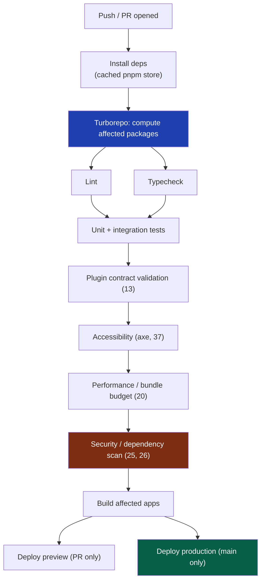
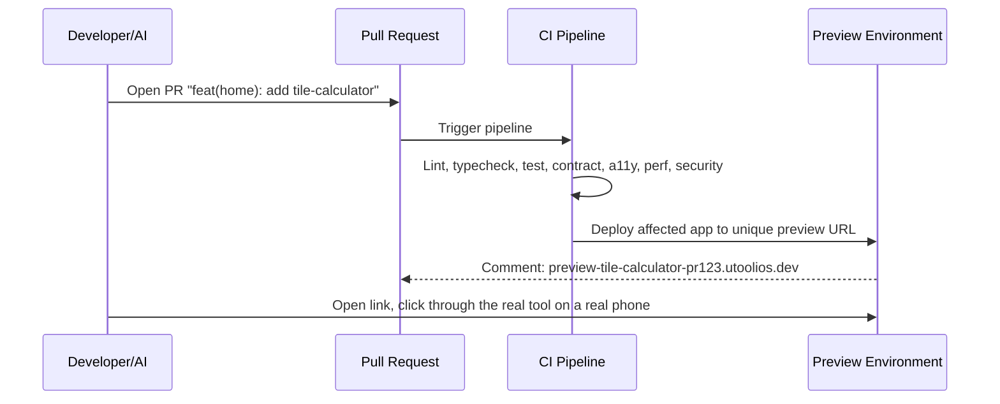
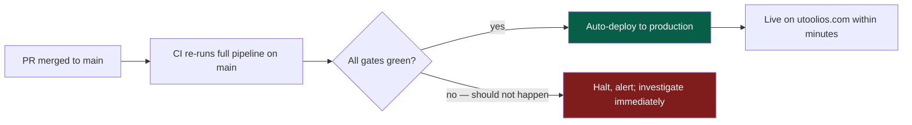
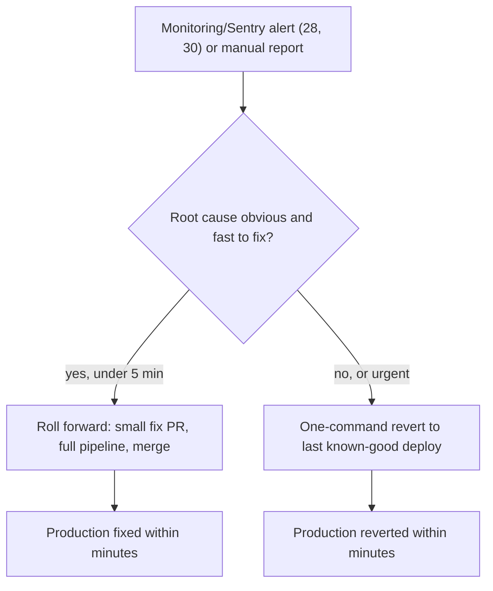

# 40 — CI/CD

> **Status:** Draft v1 · **Owner:** CTO / Developer Experience Lead · **Audience:** Anyone pushing code or merging a PR — human or AI
> Governed by: `00-ENGINEERING-PRINCIPLES.md` and the relevant prior chapters, in particular `05-MONOREPO-STRATEGY.md`, `07-DEVELOPMENT-WORKFLOW.md`, `13-TOOL-PLUGIN-ARCHITECTURE.md`, and `37-ACCESSIBILITY.md`.

---

## 1. What This Chapter Is: the Seatbelt, Automated

`07` gave you the Golden Path a human follows every day: pull, branch, build, `pnpm verify`, push, PR, merge, deploy. `05` (§7) named the risk that makes that loop necessary: in a monorepo, **one broken commit can affect everything** — the shared engine, the shared layout, and by extension all 1,000+ tool pages at once. This chapter is the machine that enforces the loop and stops that risk from ever reaching production: the GitHub Actions pipeline, its quality gates, preview deploys, auto-deploy, and rollback.

The rule that governs everything below: **any check CI runs must also be runnable locally via `pnpm verify` (`07`, §6), and any check `pnpm verify` runs, CI must run too.** There is no check that exists only on the server, and no shortcut that exists only on a developer's machine. The pipeline is the *exact same checks*, run automatically, on infrastructure nobody can skip by being tired or in a hurry.

**Simple explanation:** a pilot runs a pre-flight checklist manually (`pnpm verify`); the flight computer runs the identical checklist again, automatically, and refuses to let the plane take off if anything fails (CI). Both check the same things — the automation exists so a rushed pilot can't skip a step and still get airborne.

> **CTO note:** for a solo founder, CI feels like ceremony spent on an audience of one. It isn't. The moment you're tired, distracted, or accept an AI-generated tool without reading every line, CI is the only thing standing between a bad calculation formula and a live URL Google has already indexed. Skipping CI "just this once" is exactly the failure mode it exists to prevent.

---

## 2. Pipeline Stages, in Order

Every push and every PR runs the same pipeline. Stages are ordered cheapest-and-fastest-first, so a trivial mistake (a lint error) fails in seconds, not after minutes of waiting on an expensive stage.

| # | Stage | What it does | Budget |
|---|-------|---------------|--------|
| 1 | Install | Restores the pnpm store cache | Seconds |
| 2 | Affected graph | Turborepo computes exactly which packages/tools changed (§3) | Seconds |
| 3 | Lint | ESLint + Prettier on affected packages (`08`, `09`) | Seconds |
| 4 | Typecheck | `tsc --noEmit`, strict mode, `any` banned (`08`) | Seconds–minutes |
| 5 | Test | Known-value tests for `calculator.ts`, plugin-contract integration tests | Minutes |
| 6 | Contract validation | Every touched tool folder satisfies the `ToolPlugin` type + fixed-name files (`13`) | Seconds |
| 7 | Accessibility | axe-core pass against rendered tool pages (`37`) | Minutes |
| 8 | Performance | Lighthouse CI, mobile-throttled profile; client JS budget (`20`, `38`) | Minutes |
| 9 | Security | Dependency/secret scan, SAST pass (`25`, `26`) | Minutes |
| 10 | Build | Builds only affected apps (mostly `apps/web`) | Minutes |
| 11 | Deploy | Preview (PR) or production (`main`) — §5, §6 | Minutes |

**Simple explanation:** the pipeline is airport checkpoints, cheapest first — ID check, then bag scan, then the slower full security screening. A missing ID is caught in seconds, long before the slow line. Similarly, a lint typo is caught in seconds, long before the pipeline spends minutes running Lighthouse against a mobile-throttled connection.

---

## 3. Turborepo: Affected-Only and Remote Cache

`05` (§5) established Turborepo as the tool that keeps a 1,000+ tool monorepo fast by rebuilding only what changed. CI is where that payoff is realized at its largest scale, because CI runs on every single push, all day, forever.

Two mechanisms do the work:

1. **Affected-only task graph.** Turborepo diffs the current branch against `main`'s content hash per package. If you touched only `packages/tools/home/tile-calculator`, the blast radius is that package plus its dependents (the web app's route renderer) — not the other 999 tool folders. Lint, typecheck, and test all run against that reduced set.
2. **Remote cache.** Turborepo caches task outputs (build artifacts, lint/test results) keyed by a hash of the inputs, shared across every CI run and developer machine. If a task ran with identical inputs before — anywhere — its result is fetched instantly instead of recomputed.

| Without affected-only + remote cache | With affected-only + remote cache |
|---|---|
| Every push re-lints/typechecks/tests all 1,000+ tools | Only the touched tool(s) + shared packages run |
| CI minutes scale linearly with catalog size | CI minutes scale with *change size*, roughly flat |
| A one-line `jwt-decoder` fix waits on unrelated tools' tests | Verdict returns in similar time whether the catalog has 50 or 5,000 tools |

**Simple explanation:** a warehouse inspector who must re-inspect an entire thousand-box shelf every time one box changes doesn't scale. A smart inspector re-checks only the changed box (affected-only), and reuses an earlier verdict for an identical box (remote cache) instead of re-opening it. Editing the `bmi-calculator` should never cost CI minutes proportional to how many *other* tools exist.

> **CTO note — remote cache is a cost and correctness lever, not a nice-to-have:** without affected-only scaling, CI cost and wait time would eventually erode the daily-builder feedback loop `07` depends on. But remote cache has a sharp edge: it trusts identical inputs always produce identical outputs. A task with hidden non-determinism (wall-clock time, an undeclared env var) will silently serve a stale, wrong verdict. Declare every real input explicitly in `turbo.json`; treat "flaky because of caching" as a caching-config bug, not a test bug.

---

## 4. Quality Gates in Detail

Each gate exists to catch one class of failure that would otherwise reach production. None are optional; none can be skipped by label or admin override on `main` (§7).

| Gate | Catches | Tooling | Chapter |
|---|---|---|---|
| Lint | Style violations, banned patterns, cross-tool imports | ESLint | `08`, `09` |
| Typecheck | Type errors, `any` usage, plugin-contract shape mismatches | `tsc --strict` | `08` |
| Unit/integration test | Wrong math in `calculator.ts`, broken engine behavior | Vitest/Jest | `13` |
| Contract validation | Tool folder missing a fixed-name file or violating `ToolPlugin` | Custom contract checker + TS compiler | `13` |
| Accessibility | Missing labels, poor contrast, keyboard traps, missing landmarks | axe-core | `37` |
| Performance/bundle budget | A dependency silently bloats client JS, regresses LCP/INP | Lighthouse CI, bundle-size diff | `20`, `38` |
| Security/dependency scan | Known-vulnerable dependency, leaked secret, OWASP patterns | Dependency scanner, secret scanner, SAST | `25`, `26` |

**Simple explanation:** seven specialist inspectors, each trained to catch one kind of problem — a grammar checker won't catch a wiring fault. Running all seven means no single blind spot lets a bad tool through: the `mortgage-calculator`'s interest-rate math is checked by the test gate, its keyboard accessibility by the a11y gate, a newly added heavy date-formatting library by the bundle-budget gate — independently, every time.

> **CTO note — a11y and performance are the two gates most tempting to soften under deadline pressure, and the two you must not soften.** A broken test blocks you today; a silently-regressed bundle budget or an inaccessible form compounds invisibly across every future tool that copies the pattern, and by the time it shows up in real metrics it's already replicated across hundreds of pages. Retrofitting a11y or performance discipline across a 500-tool catalog later is an order of magnitude more expensive than enforcing it from tool #1.

---

## 5. Preview Deploys: Every PR Gets a Real, Shareable URL

Every open PR automatically deploys to a unique, isolated preview URL (Cloudflare/Vercel-class preview environments) as its final pipeline stage, once all gates are green.

Why this matters specifically for UToolios:

- **You review the actual rendered tool page**, not just a diff — critical for SEO metadata, JSON-LD structured data (`16`), and layout, none of which are fully evaluable from source code alone.
- **A real device/network check is possible before merge** — open the preview URL on an actual phone to confirm the touch UX and performance feel promised in `38`, rather than trusting a Lighthouse score alone.
- **AI-generated tools (`35`) get a human-clickable checkpoint** that satisfies the human-review requirement from `07`, §9 — "the formula runs and looks right" is verified against a live page, not a diff.

**Simple explanation:** a preview deploy is a fitting room, not a mirror. A diff tells you the fabric changed; the preview URL lets you try the garment on — see the `tile-calculator`'s form render, tap through it on your phone, confirm the FAQ accordion opens — before anyone else ever sees it live.

> **CTO note:** preview environments cost real infrastructure minutes/dollars at scale, and with a solo builder opening many small PRs a day that cost is easy to ignore until it isn't. Set an automatic preview-environment expiry (torn down N days after merge/close) so stale previews don't accumulate as an invisible, forever-growing cost — an automated cleanup job, not manual memory.

---

## 6. Auto-Deploy on Merge to Main

`main` is always deployable, by construction: nothing merges into it without every gate in §4 passing. Deployment to production is therefore not a separate, ceremonial event requiring a human to "push the button" — it is the automatic, boring consequence of a merge.

The pipeline re-runs in full on `main` after merge, not merely on the PR branch — this catches the rare case where two independently-green PRs combine into a broken `main` (e.g., two tools both editing a shared `related.ts` link graph in ways that pass individually but conflict together). If that "should not happen" branch ever fires, treat it as a process incident, not routine noise: the gate itself likely needs strengthening.

**Simple explanation:** because every PR is already fully checked before merge, merging is like a factory line where final inspection already happened at the previous station — shipping afterward is just what happens next, not a separate sign-off. The safety comes from *never letting an unchecked item reach that point*, not from a human gatekeeper at the end.

> **CTO note — auto-deploy only works if the gates are genuinely trustworthy:** the moment you think "I'll just merge this one without waiting for CI, it's tiny," you've found a gap in the pipeline, not a case for an exception. If small changes routinely feel safe to skip-check, fix the gate (better affected-only scoping, §3) — never build a habit of bypassing it. A bypass habit, once formed, eventually bypasses the change that actually mattered.

---

## 7. Required Checks and Branch Protection: the Seatbelt, Literally

`05` (§7) named CI and branch protection together as the monorepo's mandatory seatbelt. This is where that seatbelt is configured, concretely, in GitHub's branch protection rules on `main`:

| Rule | Setting | Why |
|---|---|---|
| Require status checks to pass before merging | All stages in §2/§4 marked required | No merge is possible while any gate is red — not a suggestion, a hard block |
| Require branches to be up to date before merging | Enabled | Prevents merging a PR tested against a stale `main` that has since changed underneath it |
| Require pull request before merging | Enabled, no direct pushes to `main` | Even the founder cannot push straight to `main` — the PR is the only door in |
| Include administrators | Enabled | The rules apply to the repo owner too — no "just this once, I'm the CTO" override |
| Require linear history / no force-push to `main` | Enabled | Preserves an honest, reconstructable history for `git bisect` and rollback (§8) |
| Require CODEOWNERS review (once a second contributor exists) | Deferred until Phase 3+ team growth | Solo-founder phase has no second reviewer to require; the automated gates are the review |

**Simple explanation:** branch protection is the physical seatbelt latch, not just the advice to wear one. A car can have a seatbelt sitting unbuckled — that protects no one. Branch protection makes wearing it non-optional: the merge button simply will not activate until the belt (all required checks) is buckled (green), for every driver, including the owner.

> **CTO note — "Include administrators" is the single highest-leverage checkbox in this chapter,** and the one a solo founder is most tempted to disable "temporarily" during a late-night push. Nearly every incident postmortem that begins "I merged directly because CI was slow" traces back to this checkbox being off. Leave it on, permanently; if CI is genuinely too slow, fix its speed (§3), never the gate around it.

---

## 8. Rollback: Fast, Boring, and Rehearsed

Because `main` deploys automatically, rollback must be equally fast and equally automatic — a bad deploy should be reversible in the time it takes to notice it, not the time it takes to write and review a fix.

Two mechanisms, chosen by severity:

1. **Instant revert to last known-good deployment.** Every deploy is an immutable, versioned artifact (not an in-place mutation), so reverting is "point production traffic back at the previous deploy" — a platform-level action (Cloudflare/Vercel-class instant rollback), not a `git revert` + rebuild + re-deploy cycle. Default for anything serious: stop the bleeding first, diagnose after.
2. **Roll-forward via a normal PR.** For a small, well-understood issue, a fix pushed through the *exact same* pipeline (§2) is often just as fast as a revert, and avoids losing whatever else shipped in the same deploy. Default for minor, well-diagnosed issues.

**Simple explanation:** a flickering new light fixture — flip the switch back to the old fixture instantly (revert) rather than rewiring the room in the dark (diagnosing live in production). Once the lights are back on the known-good fixture, fix the new one properly through the front door (a normal PR).

> **CTO note — rehearse rollback before you need it, not during an incident:** the worst time to learn "instant rollback" actually takes eleven manual steps is the first real outage. It should be a single command or dashboard click, tested deliberately at least once outside a real incident — adrenaline is a terrible environment to discover process for the first time. Treat "can we roll back in under two minutes, right now" as a fact to verify periodically, not an assumption to trust.

---

## 9. What Runs Where: Solo-Founder Phase vs. Later

The pipeline described above is intentionally sized for a solo founder from day one — it is not "the enterprise version we'll build later." What *does* change by phase is scope, not rigor:

| Aspect | Phase 1 (today) | Phase 2+ (`21`, `28`, `30`) | Phase 3+ (`22`, `23`) |
|---|---|---|---|
| Gates in §4 | All active, full strictness | + server-tool sandboxing checks (`19`, `25`) | + API contract tests (`22`), auth-flow tests (`23`) |
| Deploy target | Static/ISR frontend only (`04`) | + server-tool runtime, cache layer (`21`) | + NestJS service, DB migration gate |
| Rollback scope | Frontend deploy only | + cache invalidation on rollback (`21`) | + DB migration rollback discipline (`12`) |

We build the pipeline's full rigor now, on a small surface area, so adding Phase 2/3 gates later is additive configuration, not a rewrite of CI culture. A team that only starts caring about quality gates once it has a database and a second engineer has to retrofit discipline under pressure; we never have that retrofit because it was never optional.

**Simple explanation:** the same seam-building principle as `04` and `38`, applied to process instead of code — we run the full checklist on a smaller aircraft today, so flying a bigger aircraft later means adding a few checklist items, not writing the whole checklist from scratch under pressure.

---

## 10. Summary

- CI/CD is the automated enforcement of the same checks `pnpm verify` runs locally (`07`) — the rule is strict and bidirectional: any check CI runs, `verify` must run too, and vice versa.
- The pipeline runs cheapest-first: install → Turborepo affected graph → lint → typecheck → test → contract validation (`13`) → accessibility (`37`) → performance budget (`20`, `38`) → security scan (`25`, `26`) → build → deploy.
- **Turborepo's affected-only graph and remote cache** keep CI cost and wait time roughly flat as the catalog grows from 50 to 5,000+ tools — the mechanism that makes daily CI runs sustainable at scale (`05`).
- **Every PR deploys to a real, isolated preview URL** so tool pages, SEO metadata, and touch UX can be verified on a live page and a real device before merge — and the required human checkpoint for AI-generated tools (`07`, §9) has something real to click through.
- **Merging to `main` auto-deploys** — because nothing merges without every gate green, deployment is the boring, automatic consequence of merge, not a separate ceremonial step.
- **Branch protection is the literal seatbelt latch**: required status checks, no direct pushes, and "include administrators" with no exceptions — the rule applies to the founder exactly as it applies to everyone who joins later.
- **Rollback is fast, boring, and rehearsed**: instant revert to a known-good deploy for anything serious, roll-forward via the normal pipeline for small, well-understood fixes — and the "can we roll back right now" capability is tested periodically, not assumed.
- The full pipeline's rigor exists from Phase 1; later phases add gates (server-tool sandboxing, auth flows, DB migrations) additively, never retrofitting discipline that should have existed from tool #1.

> Next: `41-DEPLOYMENT-INFRASTRUCTURE.md` — the concrete hosting, edge, and environment topology (Cloudflare, AWS, environments) that this pipeline deploys into.

---

### Changelog

| Version | Date | Change | Reason |
|---|---|---|---|
| v1 | (draft) | Initial CI/CD pipeline | Project inception |
