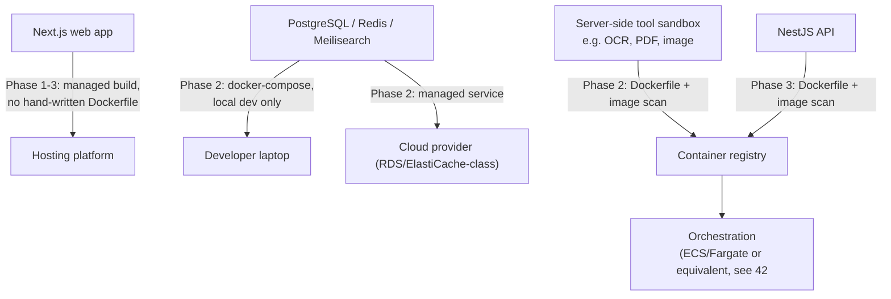
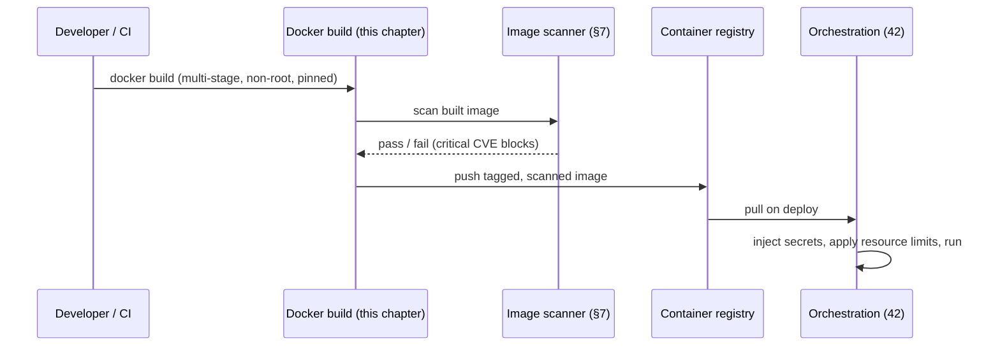

# 41 — Docker

> **Status:** Draft v1 · **Owner:** CTO / Principal Platform Engineer · **Audience:** Anyone building, running, or deploying a containerized service — Phase 2 backend engineers first, everyone by Phase 3
> **Governed by:** `00-ENGINEERING-PRINCIPLES.md` and the relevant prior chapters, in particular `05-MONOREPO-STRATEGY.md`, `07-DEVELOPMENT-WORKFLOW.md`, `11-BACKEND-ARCHITECTURE.md`, `12-DATABASE-ARCHITECTURE.md`, and `40-CI-CD.md`.

---

## 1. When Docker Enters the Picture (and When It Deliberately Doesn't)

This chapter is easy to over-apply, so start with the boundary. Per the phasing (`04`, `11`), Phase 1 UToolios is a static/ISR Next.js site with no database, no auth, and no backend service — it deploys straight from Git to a managed hosting platform (Vercel-class or Cloudflare-fronted). **There is nothing to containerize in Phase 1.** The web app's build output is the artifact; the platform's own build pipeline turns source into a running edge deployment. Hand-writing a Dockerfile for that would be pure ceremony — infrastructure with no job to do.

Docker earns its place when we introduce **things that must run continuously, hold state, or execute untrusted work**:

| Trigger | Phase | What gets containerized |
|---|---|---|
| PostgreSQL, Redis, Meilisearch for local dev | Phase 2 | Nothing shipped to prod — just `docker-compose` on the laptop |
| Isolated **server-side tools** (OCR, PDF, image processing) | Phase 2 | Each sandboxed service, per `11` §8 and `25-SECURITY` |
| Observability stack pieces run outside a managed SaaS | Phase 2 | Self-hosted Grafana/Prometheus if we choose that route (`28`) |
| NestJS API service | Phase 3 | The API container itself |

**Simple explanation:** think of Docker as a shipping container for software. It's brilliant when you have cargo that needs to survive being moved between ships, trucks, and ports unchanged — a database, a sandboxed PDF-processing worker, an API server. It's useless overhead if all you're doing is mailing a single, already-addressed letter — which is what deploying a static Next.js build to a hosting platform is. We reach for the shipping container exactly when we have cargo worth containerizing.

> **CTO note:** the temptation for a solo founder is to "Dockerize everything" on day one because it feels professional. Resist it. Every Dockerfile is a maintenance surface — base image CVEs to patch, build times to keep fast, a registry to secure. Phase 1 has zero backend processes; a Dockerfile there is a solution hunting for a problem. This chapter builds the seam now, in writing, so Phase 2 engineers don't reinvent it under deadline pressure — but no container runs in production until a real service exists to run.

---

## 2. What Gets Containerized, Concretely

By Phase 2, three categories of workload justify a container:

1. **Local development infrastructure** — Postgres, Redis, Meilisearch. These are third-party services we consume, not code we ship; `docker-compose.yml` spins up a disposable, identical copy on every machine.
2. **Server-side tool sandboxes** — the "economic danger zone" tools flagged `serverSide: true` (`13`, `11` §8). An OCR tool that shells out to a CPU-heavy library must not run in the same process as the web app; it runs in its own container with its own resource limits, so a runaway request can't take down anything else.
3. **The NestJS API** — Phase 3. Same Dockerfile discipline as the sandboxes, deployed behind the same patterns.

What does **not** get a Dockerfile: the Next.js web app itself, at least not by default. Managed platforms build it from source directly. If we ever self-host for cost or control reasons, *then* the web app gets a container too — but that's an infrastructure decision made on evidence (`42`), not a default.



---

## 3. Multi-Stage Dockerfiles: the Standard Shape

Every service Dockerfile in this project follows the same three-stage pattern, regardless of which tool sandbox or service it builds. Consistency here means one engineer can read any container in the monorepo and immediately understand it.

```dockerfile
# ---- Stage 1: deps ----
# Install dependencies in isolation so this layer caches
# independently of source-code changes.
FROM node:20-slim AS deps
WORKDIR /app
COPY pnpm-lock.yaml package.json ./
COPY packages/tool-sandbox-ocr/package.json ./packages/tool-sandbox-ocr/
RUN corepack enable && pnpm install --frozen-lockfile --filter tool-sandbox-ocr...

# ---- Stage 2: build ----
# Compile TypeScript, run only what's needed for THIS service.
FROM node:20-slim AS build
WORKDIR /app
COPY --from=deps /app/node_modules ./node_modules
COPY . .
RUN pnpm --filter tool-sandbox-ocr build

# ---- Stage 3: runtime ----
# Minimal, non-root, only the compiled output + prod deps.
FROM gcr.io/distroless/nodejs20-debian12 AS runtime
WORKDIR /app
USER nonroot
COPY --from=build --chown=nonroot:nonroot /app/packages/tool-sandbox-ocr/dist ./dist
COPY --from=build --chown=nonroot:nonroot /app/node_modules ./node_modules
EXPOSE 8080
CMD ["dist/main.js"]
```

The pattern has one job: **the final image contains nothing that isn't required to run the service.** No compiler, no pnpm, no source maps unless intentionally kept for Sentry (`28`), no shell in the ideal case.

| Stage | Contains | Discarded before shipping? |
|---|---|---|
| `deps` | Lockfile, `node_modules` (incl. dev deps) | Yes — only its output is copied forward |
| `build` | Full source, TypeScript compiler, build tools | Yes — only compiled `dist/` is copied forward |
| `runtime` | Compiled JS, production `node_modules`, distroless base | No — this is what ships |

**Simple explanation:** it's like packing for a work trip versus moving house. The `deps` and `build` stages are the messy move — boxes everywhere, tools out, packing tape, receipts. The `runtime` stage is the suitcase you actually board the plane with: only what you need for the trip, nothing extra to lose or have stolen. If the mortgage-calculator's amortization logic ever needed a heavier server-side PDF-export sibling, that sibling's shipped image would contain the PDF renderer and nothing else — not the TypeScript compiler that built it.

> **CTO note:** distroless (or Alpine as a lighter fallback) isn't a style preference — it's attack-surface reduction. A base image with a full shell and package manager gives an attacker who gets code execution a toolbox to escalate with. Distroless often can't even run `sh` — if the OCR sandbox is compromised via a malicious upload, the blast radius stops at "no shell to pivot from." The trade-off is debuggability: `docker exec -it ... sh` doesn't work. We accept that because these are sandboxed, low-trust services by design (`11` §8); observability (`28`, `29`) is how we debug them, not an interactive shell.

---

## 4. Non-Root, Always

Every runtime stage runs as a non-root user. This is non-negotiable for any container that touches user-supplied input (every server-side tool sandbox, by definition):

```dockerfile
USER nonroot
```

or, on a base image without a pre-baked `nonroot` user:

```dockerfile
RUN addgroup --system app && adduser --system --ingroup app app
USER app
```

**Simple explanation:** running a container as root is like giving every guest at a hotel a master key instead of a room key. If a malicious PDF exploits a parsing bug in our PDF-tool sandbox, a root process inside the container can, in the worst case, escape to the host or trash the container's filesystem freely. A non-root process is confined to what its limited user account can touch — the blast radius shrinks by design, not by luck.

This ties directly into `26-OWASP-COMPLIANCE` (least privilege) and `25-SECURITY` (defense in depth): non-root containers are one layer in a stack that also includes read-only filesystems where possible, dropped Linux capabilities (`--cap-drop=ALL`), and per-request resource limits (CPU/memory ceilings so one runaway OCR job can't starve the host).

---

## 5. Reproducible Builds

A container that builds differently on the founder's laptop, in CI, and in production is a container nobody can trust. Reproducibility is enforced through:

- **Pinned base images by digest**, not just tag: `node:20-slim@sha256:...` rather than bare `node:20-slim`. Tags are mutable; digests are not. A tag can silently point to a new image tomorrow — a digest cannot.
- **Frozen lockfiles**: `pnpm install --frozen-lockfile` inside the build — the same discipline as CI (`40-CI-CD`), extended into the container build itself. No install is allowed to resolve to a different dependency tree than what's committed.
- **No network calls during build beyond package installation** — no "curl a script and run it" steps (`26-OWASP-COMPLIANCE` already bans unpinned `curl | sh`), so a build today produces the same bits as a build next year, network conditions aside.
- **Deterministic `COPY` ordering** — dependency manifests copied and installed *before* source code, so source-only changes don't bust the expensive install layer (this doubles as the caching strategy in §6).

> **CTO note:** "reproducible" doesn't mean "byte-identical forever." Base images get security patches; that's intended drift, not a bug. What we're protecting against is *unintended* drift — a build silently picking up a different transitive dependency, or a "latest" tag moving under us between deploy and rollback. Pin what must be stable (lockfile, our dependency tree); patch on purpose, on a schedule, what shouldn't be (base image), via §7 — don't let either happen by accident.

---

## 6. docker-compose for Local Development (Phase 2)

Phase 2 introduces the first stateful dependencies: PostgreSQL, Redis, and Meilisearch (`12`, `21`, `32`). None of these need to be installed on a developer's machine directly — `docker-compose.yml` at the repo root gives every contributor (or AI agent) an identical local stack in one command, continuing the "productive in minutes" promise from `07`.

```yaml
services:
  postgres:
    image: postgres:16-alpine
    environment:
      POSTGRES_USER: utoolios
      POSTGRES_PASSWORD: local_dev_only
      POSTGRES_DB: utoolios
    ports: ["5432:5432"]
    volumes: ["pgdata:/var/lib/postgresql/data"]
    healthcheck:
      test: ["CMD-SHELL", "pg_isready -U utoolios"]
      interval: 5s
      retries: 5

  redis:
    image: redis:7-alpine
    ports: ["6379:6379"]

  meilisearch:
    image: getmeili/meilisearch:v1.9
    environment:
      MEILI_MASTER_KEY: local_dev_only
    ports: ["7700:7700"]
    volumes: ["meilidata:/meili_data"]

volumes:
  pgdata:
  meilidata:
```

Running `docker-compose up -d` (wrapped by a `pnpm dev:services` script per `07`'s "one command" philosophy) gives a working Postgres + Redis + Meilisearch in seconds, torn down cleanly with `docker-compose down -v` when a developer wants a clean slate.

**Simple explanation:** without this, every developer installs and configures Postgres, Redis, and Meilisearch by hand — three different ways, on three different machines, drifting from production the whole time. `docker-compose.yml` is a single recipe card: run one command, get the exact same kitchen every time, whether you're a human developer or an AI agent generating and testing a new tool (`35`).

> **CTO note:** local `docker-compose` services are deliberately *not* the same images/config as production databases. Production Postgres is a managed service (RDS-class) with backups, replicas, and monitoring we don't reimplement in Compose; local Compose exists purely to unblock development against a real Postgres wire protocol. Don't let "it works in Compose" substitute for testing against real staging before Phase 2 ships (`40-CI-CD` covers that gate).

---

## 7. Image Scanning

Every image that reaches a registry is scanned before it's allowed to run anywhere beyond a developer's laptop. This happens in two places:

1. **In CI** (`40-CI-CD`), as a required check before merge: the built image is scanned for known CVEs in the OS packages and language dependencies baked into it. A `critical`-severity finding fails the pipeline; the merge is blocked until the base image is bumped or the dependency is patched.
2. **On a schedule**, against images already deployed: base images accumulate newly-disclosed CVEs after they ship (a vulnerability found next month in a library baked in today). A recurring scan catches that drift and opens a ticket automatically rather than relying on someone remembering to check.

| Check | Tool class | Blocks merge? |
|---|---|---|
| OS/package CVEs in the built image | Container image scanner (e.g. Trivy-class) | Yes, on critical/high |
| Dependency CVEs (npm advisories) | Same scanner, or `pnpm audit` | Yes, on critical |
| Dockerfile anti-patterns (root user, `ADD` over `COPY`, missing pinning) | Linter (e.g. Hadolint-class) | Yes |
| Secrets accidentally baked into a layer | Secret scanner | Yes, always |

**Simple explanation:** scanning an image before it ships is like a food safety inspection before a shipping container of produce leaves port — not after it's already on supermarket shelves. It's far cheaper to reject a bad base image in a two-minute CI check than to discover, after 10,000 API requests have been served, that the container had a known-exploitable library in it the whole time.

> **CTO note:** scanning finds *known* CVEs; it doesn't find the malicious-PDF-triggers-a-buffer-overflow class of problem, and it's a false sense of completeness if treated as the whole security story. It's one control among several — non-root, sandboxing, resource limits, WAF at Cloudflare (`25`, `26`). Budget for regularly bumping base images even at zero alerts; "no known vulnerabilities today" is a snapshot, not a guarantee.

---

## 8. Layer Caching and Build Speed

With eventually dozens of server-side tool sandboxes (and the NestJS API in Phase 3), slow container builds become a daily tax across the whole team — the same failure mode `05-MONOREPO-STRATEGY` and `40-CI-CD` already solve for JS builds via Turborepo's cache. Docker gets the equivalent treatment:

- **Order `COPY` from least- to most-frequently-changed.** Lockfiles first (change rarely), source code last (changes every commit) — §3's example copies `package.json`/`pnpm-lock.yaml` before `pnpm install`, so a source-only commit reuses the whole `deps` layer untouched.
- **Use BuildKit cache mounts** for package manager caches (`RUN --mount=type=cache,target=/root/.local/share/pnpm/store pnpm install`), so even a lockfile change doesn't re-download every package.
- **Share a remote build cache in CI** so a fresh runner doesn't rebuild every layer from zero — matching the "don't rebuild what didn't change" principle Turborepo already applies to the JS monorepo.
- **One Dockerfile per service**, not one giant Dockerfile branching for every sandbox type — that turns into unreadable, uncacheable spaghetti fast. Per-service Dockerfiles stay small and independently cacheable, the container equivalent of "one folder = one tool" (`13`).

**Simple explanation:** layer caching is why a good pizza kitchen preps dough, sauce, and cheese ahead of time and only assembles + bakes to order. If every pizza started from milling flour, Friday night would grind to a halt. Ordering Docker instructions from "rarely changes" to "changes every commit" means a code-only change rebuilds in seconds, not minutes, because Docker reuses every layer above the point where nothing changed.

---

## 9. Where This Ties to 42 and Beyond

This chapter defines *what a correct image looks like* — the artifact. It deliberately stops short of *where that image runs*, which belongs to `42`: orchestration choice, how secrets are injected into a running container (never baked into the image — `25`), autoscaling, health checks, and rollback. Building the container correctly and running it reliably are separate concerns on purpose (`00`), so either can change without the other needing a rewrite.



---

## Summary

- Phase 1 has **no containers** — the Next.js web app deploys straight from source via a managed platform; hand-writing a Dockerfile there is unneeded ceremony.
- Docker earns its place in **Phase 2**: local `docker-compose` for Postgres/Redis/Meilisearch, and isolated Dockerfiles for sandboxed server-side tools (OCR, PDF, image). The NestJS API joins in **Phase 3**.
- Every service Dockerfile follows the same **three-stage pattern** (`deps` → `build` → `runtime`), shipping a minimal, ideally distroless, runtime image with nothing but compiled code and production dependencies.
- Containers **always run as non-root**, with dropped capabilities and resource limits, because server-side tools process untrusted user input by definition.
- Builds are **reproducible**: base images pinned by digest, lockfiles frozen, no ad-hoc network calls baked into the build.
- `docker-compose.yml` gives every developer (and AI agent) an **identical local stack** in one command, distinct from — and not a substitute for — real staging/production infrastructure.
- Every image is **scanned in CI before merge** and **rescanned on a schedule** after deploy, because new CVEs appear in old images even when nothing in our code changed.
- **Layer ordering and cache mounts** keep builds fast as the number of sandboxed services grows, mirroring the caching discipline already applied to the JS monorepo.
- This chapter defines the **image**; `42` defines **where it runs** — a deliberate separation so either can evolve independently.

> Next: `42-DEPLOYMENT.md` — where these images run: orchestration, secrets injection, autoscaling, health checks, and rollback.

---

### Changelog
| Version | Date | Change | Reason |
|---------|------|--------|--------|
| v1 | (draft) | Initial Docker/containerization strategy | Project inception |
