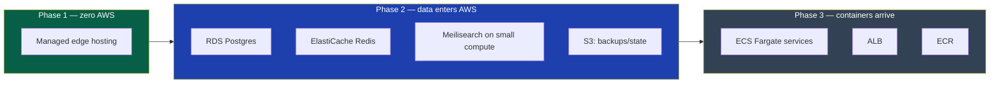
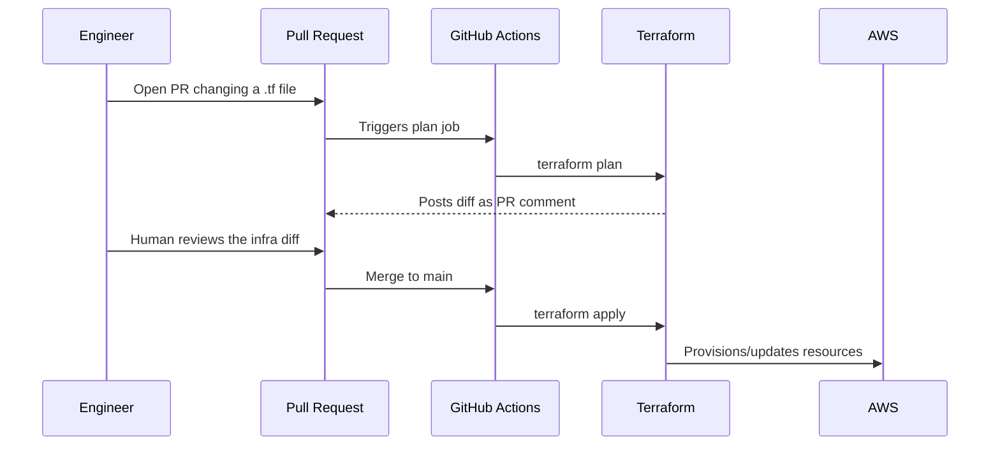
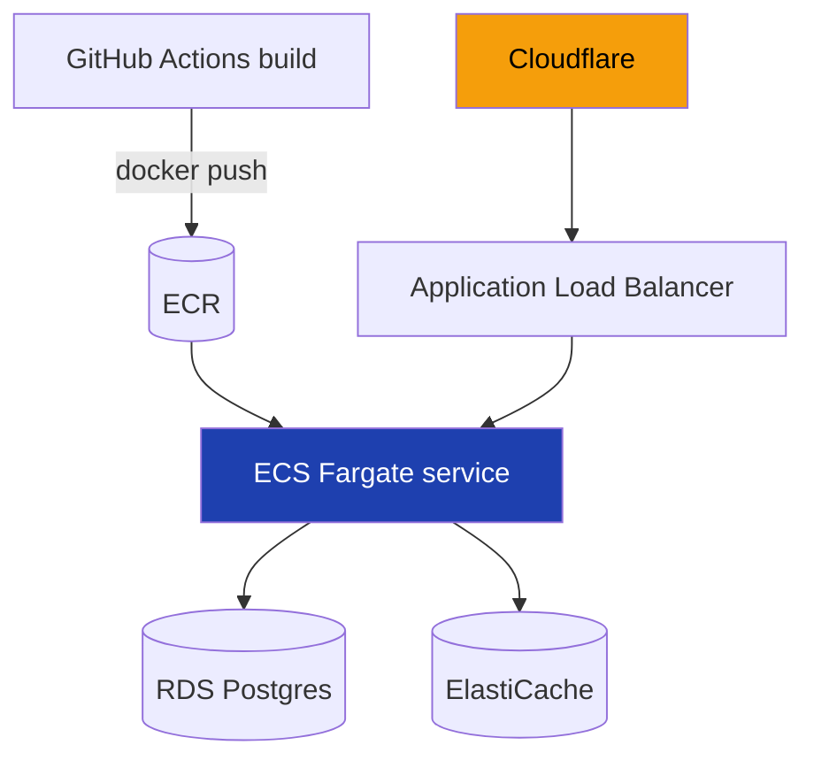
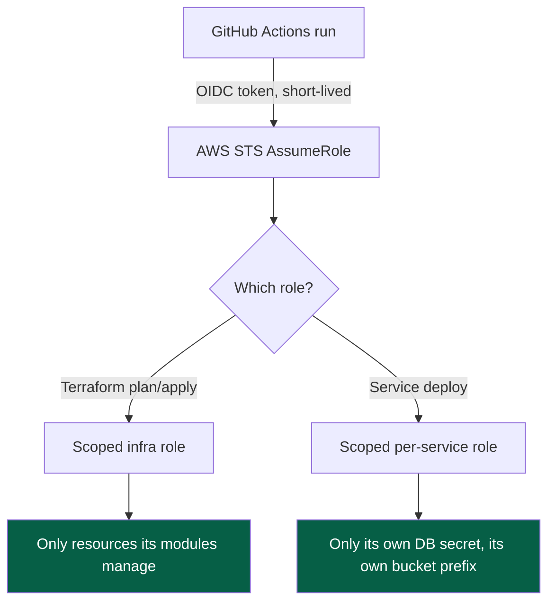

# 42 — AWS Infrastructure

> **Status:** Draft v1 · **Owner:** CTO / Solo Founder (acting infra team of one) · **Audience:** Whoever next touches a `terraform plan`, an IAM policy, or an AWS bill
> **Governed by:** `00-ENGINEERING-PRINCIPLES.md` and the relevant prior chapters (`04-ARCHITECTURE-OVERVIEW`, `05-MONOREPO-STRATEGY`, `11-BACKEND-ARCHITECTURE`, `12-DATABASE-ARCHITECTURE`, `25-SECURITY`, `40-CI-CD`, `43-CLOUDFLARE`, `45-SECRETS-MANAGEMENT`).

---

## 1. Scope of This Chapter — What "AWS" Means Here, and What It Doesn't

This chapter is about the **compute, data, and network substrate that AWS provides once there is something on the server side worth running** — not about the edge. `43-CLOUDFLARE` owns the layer every request actually hits first: CDN, WAF, DDoS protection, bot management, and R2 object storage. This chapter owns everything Cloudflare hands off to, once Phase 1's zero-backend static site grows a real origin worth talking about: managed databases, container compute, load balancing, and the Terraform that describes all of it as code.

The relationship is strict and one-directional: **Cloudflare sits in front of AWS, never the other way around.** Every request a user makes reaches Cloudflare first; only the fraction that can't be served from cache or the edge reaches an AWS-hosted origin at all (`04`, `21-CACHING`). This chapter never re-litigates edge behavior — it starts at the point Cloudflare forwards a request onward, and it stops at the point secrets and credentials are actually generated and rotated, which is `45`'s job.

| Question | Owned by |
|---|---|
| What happens before a request reaches our origin at all | `43-CLOUDFLARE` |
| **What runs on AWS, how it's provisioned, and how it scales** | `42` (this chapter) |
| How secrets, API keys, and credentials are generated, stored, and rotated | `45-SECRETS-MANAGEMENT` |
| Database schema, migrations, query patterns | `12-DATABASE-ARCHITECTURE` |
| What container image gets built and how it gets deployed | `40-CI-CD` |

**Simple explanation:** think of a restaurant with a storefront (Cloudflare) and a kitchen out back (AWS). Customers only ever interact with the storefront — most of them are served instantly from what's already plated at the counter (cache) and never see the kitchen at all. This chapter is the kitchen: the ovens, the walk-in fridge, who's allowed to hold which keys, and the blueprint the contractor used to build it. It is deliberately not about the counter, and it is deliberately not about which supplier delivers the flour under lock and key — that's a different chapter (`45`).

---

## 2. What Runs Where — the Phase-by-Phase Map

Consistent with the phased build (`04`, §6), AWS's footprint starts at **zero** and grows only when a real capability needs it. This is the single most important table in this chapter — everything else elaborates on it.

| Component | Phase 1 (now) | Phase 2 | Phase 3 |
|---|---|---|---|
| Next.js origin | Managed edge/serverless hosting (§4) — no AWS | Same, or AWS-hosted if traffic/cost tips the balance (§4) | Same |
| Database | None | **RDS PostgreSQL** (Multi-AZ once real traffic exists) | RDS, read replicas as needed |
| Cache / sessions / rate-limit store | None | **ElastiCache Redis** | ElastiCache, scaled |
| Search | Static prebuilt index at the edge (`32`) | Meilisearch on small AWS compute | Same, scaled |
| Object storage (hot, public, egress-heavy) | Cloudflare R2 only | R2 primary | R2 primary |
| Object storage (backups, AWS-native integrations) | None | **S3** for RDS snapshots, Terraform state, DR archives | Same |
| Backend services (auth, billing, public API, NestJS) | Don't exist | Don't exist yet | **ECS Fargate** |
| Container registry | None | None | **ECR** |
| Load balancing | Handled by managed hosting/Cloudflare | Same | **Application Load Balancer** in front of ECS |

**Simple explanation:** it's a lease that grows one room at a time. Phase 1 doesn't rent AWS space at all — the whole shop fits in a small, fully-managed unit. Phase 2 rents a back office for the filing cabinets (database) and the quick-reference shelf (cache). Phase 3 finally rents the actual production floor (containers) because by then there are enough distinct backend jobs — auth, billing, a metered API (`11`, `22`, `23`, `24`) — to justify a floor of their own. Nobody signs the Phase 3 lease on day one for a store that's still empty.

> **CTO note:** the temptation with a locked-in stack that names "AWS" is to provision an AWS account, a VPC, and an RDS instance in week one because "that's the plan." Resist it. An idle RDS instance with zero real users still costs real money every single day, and an empty VPC is one more thing to secure, patch, and reason about for zero benefit. The stack decision in `00`/`04` is about *where we're going*, not *what we provision first*. The account can exist (§5 covers why it should, early, for IAM/billing hygiene), but the resources inside it should track actual need, not the roadmap.

---

## 3. Infrastructure as Code — Terraform Is the Only Way Infrastructure Changes

From the moment any AWS resource exists, it exists because Terraform created it — never because someone clicked "Create Instance" in the console. This is non-negotiable for the same reason `08-CODING-STANDARDS` bans undocumented magic in application code: infrastructure that isn't in version control is infrastructure nobody can review, diff, roll back, or reproduce.

| Discipline | What it means in practice |
|---|---|
| **Everything is a module** | Reusable Terraform modules for "an RDS instance," "an ECS service," "an S3 bucket with our standard lifecycle policy" — a new environment composes modules, it doesn't hand-roll resources |
| **State is remote and locked** | Terraform state lives in S3 with DynamoDB locking (or Terraform Cloud) — never a local `.tfstate` file on a laptop, which is a single point of loss and a merge-conflict machine |
| **Plan before apply, always in CI** | `terraform plan` output is posted on the pull request; a human reads the diff of *infrastructure*, same review discipline as a diff of *code* (`07-DEVELOPMENT-WORKFLOW`) |
| **No manual console changes** | If the console was used to fix something under pressure, the very next action is codifying that change in Terraform before it's considered done — otherwise the next `apply` silently reverts it |
| **One workspace per environment** | Phase 2's staging RDS instance and production RDS instance are the same module, different variables — not two hand-maintained copies that drift apart |

**Simple explanation:** Terraform is the architect's stamped blueprint, not a verbal instruction to the builder. A builder who changes the wiring on-site because it seemed faster, without updating the blueprint, leaves the next builder working from a document that lies about what's actually there. Every wall AWS builds for us must trace back to a line in a `.tf` file someone reviewed — the same "no undocumented magic" rule `08` applies to code applies here to infrastructure.

> **CTO note:** for a solo founder, the honest risk with Terraform isn't complexity — it's *skipping it under pressure* ("I'll just fix this one thing in the console, I'll codify it later"). That "later" is exactly how drift accumulates until nobody, including future-you, can reconstruct what production actually looks like from the repo. The fix isn't more discipline willpower — it's making the PR-based plan/apply flow the *only* path that has AWS credentials at all (§9), so there is no faster path to take.

---

## 4. Phase 1 — Deliberately Not AWS: Edge/Managed Hosting + Cloudflare

Phase 1's entire origin is a managed hosting platform that runs Next.js natively (Server Components, ISR, Route Handlers) at the edge, sitting behind Cloudflare (`43`) for CDN, WAF, and R2. There is no AWS account provisioning anything a user-facing request touches. This is a deliberate reading of `00`'s Prime Directive: AWS earns its place when there's a database, a queue, or a container to run — not by default, because it's the name in the stack list.

| Why not AWS from day one | Why the managed edge platform instead |
|---|---|
| No database, no backend, no auth exist yet (`04`, §6) — nothing AWS is uniquely good at is needed | Native Next.js support (ISR, Server Components) with zero infrastructure to manage |
| An idle EC2/ECS footprint costs money and attention with zero users | Scales to zero cost at zero traffic, scales up automatically as traffic grows — matches a pre-revenue solo-founder cost curve |
| Standing up a VPC, security groups, and IAM for a static site is pure ceremony | Deploys are `git push` — matches the "ship daily" cadence (`07`) |

**Simple explanation:** you don't lease a warehouse to store a handful of boxes — you use a storage unit that scales with what you actually have, and you upgrade to the warehouse the month your inventory genuinely needs one. Phase 1's "warehouse" is a managed hosting platform sized exactly to a static/edge-rendered site with a plugin engine (`13`) and zero server-side state.

The seam for AWS is already built, though — not as running infrastructure, but as a documented target: the storage interface in `11-BACKEND-ARCHITECTURE` already treats R2/S3 as swappable, the data-tier diagram in `04` already shows where Postgres and Redis attach, and this chapter's Terraform modules (§3) are written and tested against a throwaway sandbox account well before Phase 2 needs them live. When the trigger fires (§7), the switch is "apply the module," not "design the module."

---

## 5. Regions — One Region Now, a Second Only When Latency or Compliance Demands It

AWS resources, once they exist (Phase 2 onward), live in a **single primary region** chosen for proximity to the founder's operations and the bulk of expected traffic, not speculative global presence. Cloudflare already solves *edge* latency globally regardless of where the AWS origin sits (`43`) — a visitor in Tokyo gets a cached response from a Tokyo point-of-presence whether the origin database lives in Virginia or Sydney. Multi-region AWS compute solves a different, narrower problem: origin-latency for *uncached* requests and disaster recovery, and it's expensive and operationally heavy enough to defer until a specific, named need justifies it.

| Driver for adding a second AWS region | Phase it plausibly triggers |
|---|---|
| A large, latency-sensitive user base in a second geography hitting *uncached, per-request* paths (e.g. a heavy server-side tool, `13`) | Phase 3, and only if the server-side tool danger zone (`13`, `25`) actually shows this pattern in real usage |
| A specific enterprise/compliance requirement (data residency) from a real paying customer | Phase 3, customer-driven only |
| Disaster recovery beyond a single-region backup/restore posture (`44`) | Evaluated after Phase 2's backup-and-restore discipline is proven, not before |

**Simple explanation:** Cloudflare's global network is like a chain of local pharmacies that can fill 95% of prescriptions from what's already on their own shelves, everywhere in the world. The one AWS-hosted central warehouse only gets contacted for the rare prescription no local branch can fill. Building a second central warehouse only makes sense once a specific region generates enough of those rare requests, or once a specific customer contractually requires their records to physically stay in a specific country — not as a precaution against a problem that doesn't exist yet.

> **CTO note:** multi-region active-active AWS deployments are one of the most over-engineered patterns solo founders copy from big-tech blog posts. They roughly double operational complexity (data replication, split-brain handling, region failover testing) for a benefit — protection against a single-region outage — that a good single-region setup with tested backups (`44`) and Cloudflare absorbing edge traffic already mitigates for the vast majority of real incidents. Single region, done properly, with a genuinely tested restore process, beats two regions done sloppily.

---

## 6. Phase 2 — Managed Data Services Enter AWS

Phase 2 is the first phase where AWS actually runs anything, and it runs exactly two categories of thing: **managed data services** and the **small compute Meilisearch needs** (`32`). Nothing here is self-managed where a managed equivalent exists — running our own Postgres or Redis on raw EC2 trades a subscription fee for an ongoing operational burden that isn't our differentiator.

| Service | AWS choice | Why managed, not self-hosted |
|---|---|---|
| PostgreSQL | **RDS** (Multi-AZ once traffic justifies it) | Automated backups, patching, failover — `12`'s migration and backup discipline assumes a managed engine underneath it |
| Redis | **ElastiCache** | Same reasoning; a self-managed Redis cluster is an outage waiting for a founder who's also doing product, SEO, and support |
| Meilisearch | Small container (Fargate or a single right-sized instance) | Not fully managed by AWS itself, but small and stateless enough that self-hosting it is a reasonable, contained exception — it isn't holding data of record |
| Terraform state, RDS snapshots, DR archives | **S3** | AWS-native integrations (RDS automated snapshots, Terraform's S3 backend) work best with S3 specifically, not R2 |

---

## 7. R2 vs. S3 — Preferring R2 for Anything That Gets Downloaded

Both object stores exist in the target architecture, and the split is deliberate rather than redundant: **R2 for anything a user's browser or a crawler fetches repeatedly, S3 for anything that is primarily AWS-internal.** The deciding factor is egress cost, because at UToolios's traffic ambitions (2–5M monthly visitors, `01`) egress is the line item that scales with success and quietly punishes it.

| | Cloudflare R2 | AWS S3 |
|---|---|---|
| Egress (data leaving to the internet) | **Zero egress fees** | Billed per GB, scales directly with traffic |
| Best fit | Public, hot, repeatedly-fetched assets: generated OG images (`15`), user-uploaded files for server-side tools (`13`) that get served back, static exports | AWS-native operational data: RDS snapshots, Terraform state, DR archives, anything consumed by other AWS services rather than end users |
| Integration depth | Native fit with Cloudflare CDN caching already in front of everything (`21`, `43`) | Native fit with RDS/Terraform/other AWS services that expect S3 specifically |
| Where it's already assumed in this documentation | `04`'s data-tier diagram, `11`'s storage-interface abstraction | This chapter, `12`'s backup discipion (`44`) |

**Simple explanation:** imagine two different storage rooms. One (R2) is right next to the shop's front counter with a deal that says "take anything out for free, as many times as customers ask" — perfect for the posters and flyers (public files) customers grab constantly. The other (S3) is the back-office archive that mostly talks to other back-office systems (the accounting software's automated backups) and rarely gets pulled by a customer directly — a small, occasional egress bill there doesn't matter, because that's not where the volume is.

Both sit behind the same `storage` interface defined in `11-BACKEND-ARCHITECTURE` — application code calls `storage.put()` / `storage.get()`, never an S3 or R2 SDK directly, so which provider backs a given bucket is a configuration decision, not a code change, and moving a bucket's traffic pattern from "internal" to "public and hot" later doesn't require touching a single call site.

> **CTO note:** "prefer R2 for egress cost" is the right default, but don't let it become dogma applied blindly to every bucket. A bucket that genuinely is AWS-internal (an RDS snapshot nobody downloads over the public internet) gains nothing from R2 and loses the tight native integration S3 has with the rest of AWS's backup/restore tooling (`44`). The rule is "which store minimizes cost *for this specific access pattern*," not "R2 everywhere because R2 was mentioned as cheaper."

---

## 8. Phase 3 — Containers Arrive: ECS Fargate for NestJS Services

When Phase 3's real, sustained backend complexity arrives — accounts, billing, a metered public API, dedicated services (`04`, §7; `11`; `22`–`24`) — it runs as containers on **ECS with Fargate**, not a self-managed EC2 fleet and not Kubernetes/EKS.

| Choice | Reasoning |
|---|---|
| **ECS over EKS** | Kubernetes' operational surface (cluster upgrades, node management, a second control plane to secure and patch) is a cost with no payoff for a handful of services run by a small team — ECS gives the same "declare a task, run N copies, autoscale" outcome with a fraction of the operational weight |
| **Fargate over EC2 launch type** | No EC2 instances to patch or right-size ourselves; pay per task, not per idle instance — matches the same "scale with actual load" philosophy as Phase 1's managed edge hosting |
| **ECR for images** | CI builds and pushes the Docker image (`05-MONOREPO-STRATEGY`, `40-CI-CD`) once per merge; ECS pulls from ECR — the same image is what ran in CI's tests, closing the "works in CI, breaks in prod" gap |
| **ALB in front of ECS** | Health checks, path-based routing between services, TLS termination before Cloudflare's own edge TLS — standard, boring, well-understood |

**Simple explanation:** Fargate is renting a fully-serviced kitchen station by the hour instead of buying and maintaining your own restaurant kitchen (EC2) or building an entire commercial kitchen-management franchise (Kubernetes) for a handful of dishes. It's the middle option that matches the actual number of "chefs" (services) Phase 3 introduces — auth, billing, the public API gateway — without either under- or over-building the kitchen around them.

Because the tool logic itself is framework-free (`00`, `13`), the code these containers run is the *same* `calculator.ts` already powering Phase 1's client-side tools — Phase 3 is a new place that logic runs, not a rewrite of the logic itself.

---

## 9. Cost Control and Tagging — Every Resource Has an Owner and a Budget

At 1,000+ tools and millions of monthly requests, an unmonitored AWS bill is how a business model built on razor-thin ad margins (`03`) quietly bleeds. Cost discipline is structural, not a monthly spreadsheet review.

| Control | What it does |
|---|---|
| **Mandatory tags on every resource** | `Project`, `Environment` (staging/production), `Phase`, `Owner` — enforced by a Terraform policy check in CI (`26-OWASP-COMPLIANCE`'s CI-gating pattern, applied to cost) that fails the plan if tags are missing |
| **AWS Budgets with alerts** | A hard monthly ceiling per environment, alerting well before it's breached — not discovered after the invoice arrives |
| **Cost anomaly detection** | Flags a sudden spike (e.g. a bot hammering a `serverSide: true` tool, `13`, `25`) automatically, tied into the same alerting discipline as `30-MONITORING` |
| **Per-service cost attribution** | Tags make it possible to answer "what does the OCR tool actually cost us per request" — the exact number `13`'s server-side danger-zone cost-modeling requirement (`00`, `03`) needs before a tool ships |

**Simple explanation:** every box in the AWS warehouse gets a label saying which department ordered it and for which project — so when the monthly bill arrives, nobody has to play detective to find out why it's higher, and a smoke alarm goes off well before the warehouse actually catches fire financially.

---

## 10. Least-Privilege IAM — No Human or Service Has More Than It Needs

IAM is where this chapter and `45-SECRETS-MANAGEMENT` meet directly: this chapter defines *what roles exist and what they're scoped to*; `45` defines *how the credentials behind those roles are generated, stored, and rotated*.

| Principle | Applied here |
|---|---|
| **No long-lived AWS access keys, anywhere** | CI authenticates to AWS via **OpenID Connect (OIDC)** federation from GitHub Actions — a short-lived, per-run token, never a static key sitting in a secrets store waiting to be leaked |
| **One role per service, scoped to only what it touches** | The container running the `HeavyTools` service (`04`) can read/write its own S3 prefix and its own RDS credentials secret — nothing else; it cannot touch the billing service's database, mirroring `24-AUTHORIZATION`'s "least privilege" applied to infrastructure instead of application data |
| **Terraform's own execution role is scoped, not admin** | The role that runs `terraform apply` in CI has exactly the permissions the modules it manages need — not blanket `AdministratorAccess`, so a compromised CI pipeline can't silently provision or exfiltrate arbitrarily |
| **Human console access is break-glass, not routine** | Day-to-day changes go through the Terraform PR flow (§3); a human IAM login to the console is logged, alerted on, and reserved for genuine incident response |

**Simple explanation:** this is giving the cleaning crew a key that opens the lobby and the offices they clean — never a master key to the vault (`25`'s exact analogy, applied one layer down into AWS itself). If the OCR service's credentials leak, the blast radius is the OCR service's own storage prefix, not the billing database, not Terraform's ability to reshape the entire account. Least privilege is what turns "one compromised container" from an existential event into a contained, recoverable one.

> **CTO note:** the actual failure mode to design against isn't a sophisticated attacker defeating IAM — it's a solo founder, moving fast, granting a role `*` on a service in month one "to unblock myself," and never coming back to tighten it once things work. The discipline that survives real life is making the *scoped* role the path of least resistance: a Terraform module that already generates a correctly-scoped policy for "an ECS service that needs its own RDS secret and its own S3 prefix" is easier to reach for than hand-writing a broad policy under deadline pressure.

---

## Summary

- This chapter owns AWS's compute, data, and network substrate; `43-CLOUDFLARE` owns the edge in front of it; `45-SECRETS-MANAGEMENT` owns how credentials are generated and rotated — Cloudflare always sits in front of AWS, never the reverse.
- **Phase 1 runs zero AWS resources** — a managed edge hosting platform behind Cloudflare is sufficient and cheaper for a static/client-side site with no database and no backend (`04`).
- **Terraform is the only way infrastructure changes** — remote locked state, PR-reviewed plans, no manual console changes, one set of modules parameterized per environment.
- **Regions stay single until a named need — latency, compliance, or a tested DR requirement — justifies a second one**; Cloudflare already solves global edge latency independently of where the AWS origin sits.
- **Phase 2 brings RDS Postgres and ElastiCache Redis** as managed services, plus small compute for Meilisearch — never self-managed database engines.
- **R2 is preferred for anything downloaded repeatedly** (zero egress fees); **S3 is preferred for AWS-internal data** (backups, Terraform state) that benefits from native AWS integration — both sit behind one `storage` interface so the choice is configuration, not code.
- **Phase 3 introduces ECS Fargate** (not EKS, not raw EC2) for NestJS services, fronted by an ALB, images built by CI and pushed to ECR.
- **Cost control is structural**: mandatory tags, AWS Budgets, anomaly detection, and per-service cost attribution — feeding directly into the server-side tool cost-modeling requirement from `13` and `00`.
- **IAM is least-privilege by default**: OIDC federation instead of long-lived keys, one scoped role per service, a scoped (not admin) Terraform execution role, and console access as break-glass rather than routine.

> Next: `43-CLOUDFLARE.md` — the edge layer that sits in front of everything this chapter describes.

---

### Changelog
| Version | Date | Change | Reason |
|---------|------|--------|--------|
| v1 | (draft) | Initial AWS infrastructure strategy | Project inception |
