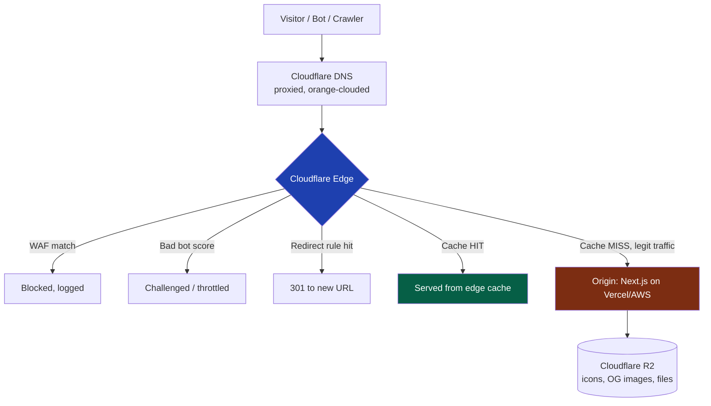
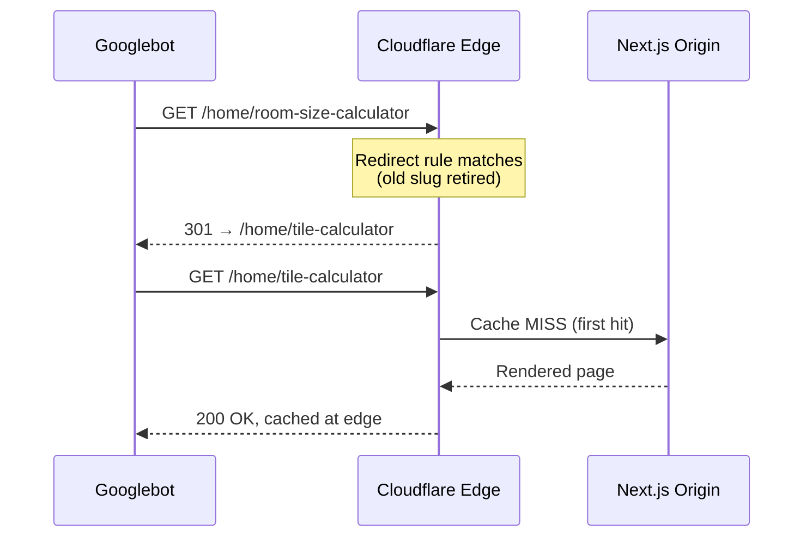

# 43 — Cloudflare

> **Status:** Draft v1 · **Owner:** CTO / Principal Platform Engineer · **Audience:** Everyone who touches DNS, deploy config, or a redirect rule — this is the front door for every one of the platform's requests
> **Governed by:** `00-ENGINEERING-PRINCIPLES.md` and the relevant prior chapters (`04-ARCHITECTURE-OVERVIEW`, `14-SEO-ARCHITECTURE`, `19-ADS-ARCHITECTURE`, `20-PERFORMANCE`, `21-CACHING`, `25-SECURITY`).

---

## 1. Cloudflare Is the Front Door, Not an Add-On

Every architecture diagram in this constitution (`04`, `20`, `21`, `25`) draws the same box first: a request arrives, and before it ever reaches Next.js, it passes through Cloudflare. That ordering is not cosmetic. For a solo founder running a platform aimed at millions of monthly visitors on ad-revenue margins (`03`), Cloudflare is the single vendor decision that simultaneously buys **performance, security, and cost control** — three problems that would otherwise each need their own specialist, their own budget line, and their own on-call rotation.

The alternative — running our own CDN edge, our own WAF, our own DDoS scrubbing, our own object store, our own DNS — is a multi-person job at a company with zero engineers to spare for it. Cloudflare's free and low-tier plans give a solo founder infrastructure that would otherwise require a platform team. This chapter is where that leverage gets specified precisely, so "Cloudflare handles it" is a documented, reviewable configuration — not a hand-wave.

**Simple explanation:** think of Cloudflare as the building's reception desk, security gate, and mailroom combined, sitting in front of an office that only has one employee. Visitors are greeted, screened, and handed a photocopy of the document they asked for before the employee is ever bothered — and the employee only gets involved for the rare request nobody has a copy of yet.

> **CTO note:** the biggest risk in an edge-first architecture is treating the edge as infallible and never testing what happens when it isn't. Cloudflare has outages. Every control in this chapter must degrade gracefully — a WAF rule that's too strict fails closed and blocks legitimate traffic; a cache rule that's wrong serves stale content to millions before anyone notices (`21`). Every rule here ships with a rollback plan, not just an "on" switch.

---

## 2. What Sits at the Edge — the Full Capability Map

| Capability | What it does for UToolios | Chapter tie-in |
|---|---|---|
| CDN caching | Serves static/ISR tool pages from 300+ edge locations, close to the visitor | `20`, `21` |
| WAF (managed rulesets) | Blocks known injection/exploit signatures before they reach origin | `25` |
| DDoS protection | Absorbs volumetric and application-layer floods at the edge, invisibly | `25` |
| Bot management | Separates good crawlers (Googlebot) from scraper/credential-stuffing bots | `25`, `14` |
| R2 object storage | Zero-egress-fee storage for tool icons, OG images, generated PDFs (Phase 2) | `13` |
| DNS | Authoritative DNS, proxied ("orange-clouded") for every public hostname | — |
| Page Rules / Cache Rules | Fine-grained cache-key and TTL control per route pattern | `21` |
| Edge redirects | 301s for the rare slug/category change, without touching origin | `14`, `09` |
| SSL/TLS | Universal HTTPS, HSTS-ready, automatic certificate management | `25` |
| Argo / Smart Routing (later) | Faster origin round-trips for the cache-miss path, once traffic justifies the cost | `20` |

The insight to hold onto through the rest of this chapter: **the fastest, cheapest, safest request is one that never reaches the origin at all.** Every section below is really answering "how do we push more of that flowchart's traffic into the `CACHE` box and out of the `ORIGIN` box."

---

## 3. DNS — Everything Proxied, Nothing Exposed

All public hostnames (`utoolios.com`, `www`, `api.utoolios.com` in Phase 3, any staging subdomain) are managed as Cloudflare DNS records with the proxy status ("orange cloud") **on** — never "DNS only" (grey cloud) for anything user-facing.

| Rule | Reason |
|---|---|
| Proxy every public A/CNAME record | An unproxied record exposes the real origin IP, letting an attacker bypass the WAF/DDoS layer entirely and hit origin directly |
| DNSSEC enabled | Prevents DNS spoofing/cache-poisoning against our zone |
| Origin firewall allow-lists Cloudflare IP ranges only | Even if the origin IP leaks, direct requests that don't carry Cloudflare's signature are refused (`25`) |
| Staging/preview subdomains never publicly linked, still proxied | Consistency — no "trusted internal" exception that becomes the weak link |

**Simple explanation:** an unproxied DNS record is like printing the building's back-door address on a public flyer — the front desk (WAF, bot management) becomes optional if anyone can walk around it. Proxying every record means the only door in existence is the one with the security gate.

> **CTO note:** this is the single most common real-world failure mode of "we have a WAF" setups — someone finds the origin's IP (an old DNS record, a leaked header, a misconfigured mail server) and hits it directly, skipping Cloudflare entirely (`25`, §10). Locking the origin firewall to Cloudflare's published IP ranges is cheap insurance against a mistake that otherwise silently nullifies everything else in this chapter.

---

## 4. CDN Caching — the Default Path for Every Tool Page

Per `21`, caching is not an optimization here, it's the business model. Cloudflare's CDN is the outermost cache tier, sitting in front of Next.js's own ISR cache (`10`, `21`). The two are complementary, not redundant:

| Layer | What it caches | Invalidated by |
|---|---|---|
| Cloudflare edge cache | Fully rendered HTML/assets, keyed by URL | Cache Rule TTL, deploy-time purge, tag-based purge |
| Next.js ISR cache (origin) | Rendered pages awaiting the next revalidation window | `revalidate` window, on-demand revalidation (`21`) |

A tool page (`/finance/mortgage-calculator`) is static or ISR by default (`20`). Its **first** request after a purge is a cache MISS that hits origin, renders once, and every subsequent request across every edge location worldwide is served from that edge cache until the TTL or an explicit purge — meaning the overwhelming majority of the "2-5M monthly visitors" target traffic (`01`) never executes a single line of Next.js server code.

**Simple explanation:** it's the difference between a chef re-cooking the same dish for every single customer versus cooking it once and holding a tray of ready plates at every counter in a hundred-branch restaurant chain. `bmi-calculator` gets cooked once per content change, then served instantly from a thousand counters (edge locations) worldwide.

> **CTO note:** the trap here is caching too aggressively without a tested purge path. A typo fix in `mortgage-calculator`'s `article.md` (`13`) that doesn't propagate for 24 hours because nobody wired tag-based purge into the deploy pipeline is a real, embarrassing failure mode. Every cache rule in this chapter ships paired with its purge mechanism — see §7.

---

## 5. Cache Rules and Page Rules — Cache Keys That Match Our Architecture

Cloudflare's Cache Rules (the modern replacement for legacy Page Rules, still used for a handful of simple redirect cases) define **what gets cached and how the cache key is built**, per URL pattern.

| Route pattern | Cache behavior | Reasoning |
|---|---|---|
| `/[category]/[tool-slug]` | Cache everything, edge TTL matched to ISR `revalidate` window; cache key ignores marketing query params (`?utm_*`) | One tool page shouldn't fragment into hundreds of cache entries because of ad-campaign query strings |
| `/sitemap*.xml`, `/robots.txt` | Cache aggressively, short TTL, purge on tool-list change | Crawlers hit these constantly; must reflect the current tool set within minutes, not hours (`14`, `17`) |
| Static assets (`/_next/static/*`, icons, fonts) | Cache forever (immutable, content-hashed filenames) | Content-hashed URLs never need invalidation — a new build gets a new URL |
| `/api/*` (Phase 3 public API) | Bypass cache entirely, rely on app-level rate limiting/caching (`22`) | Per-key, per-request responses must never be shared across callers |
| `/_health`, internal probes | Bypass cache | Must reflect real-time origin state |

**Simple explanation:** a cache key is which stack of pre-made copies a request gets routed to. Stripping `?utm_source=newsletter` from the cache key means someone arriving from an email and someone arriving from organic search both get handed the *same* pre-made copy of `tile-calculator`, instead of Cloudflare wastefully making a fresh copy for every possible campaign tag.

> **CTO note:** query-string cache-key normalization is easy to get backwards. Strip *marketing* params (`utm_*`, `fbclid`, `gclid`) from the cache key — they don't change the response. Never strip a param that legitimately changes content (a units toggle passed server-side, for instance) — that would leak one visitor's variant to another. Get this wrong and you either fragment the cache pointlessly or serve the wrong content to the wrong visitor; test both directions in CI against real tool routes.

---

## 6. Edge Redirects — 301s for Slug and Category Changes

Per `14` and `09`, a tool slug is meant to be permanent — but "rare" is not "never." A miscategorized tool, a genuine rename before meaningful traffic exists, or a category restructuring will occasionally require moving a URL. When that happens, the redirect is an **edge-level 301**, not an origin-level one.

| Why at the edge, not in Next.js `next.config.js` redirects | Reason |
|---|---|
| Speed | A 301 served from Cloudflare's edge is sub-millisecond and never touches origin compute — the old URL costs nothing to keep alive |
| Decoupled from deploys | Adding a redirect doesn't require a full app rebuild/deploy — critical when the founder needs to fix a mis-slugged tool same-day |
| Survives origin migration | If the origin platform ever changes (unlikely, but `00`'s "everything replaceable" principle applies), redirect rules keep working independently |
| Crawlability | Search engines resolve the redirect at the network edge closest to them, minimizing crawl-budget cost of the hop (`17`) |

The redirect map itself is version-controlled — a simple structured file (old-slug → new-slug, with the change date and reason) that both generates the Cloudflare redirect rule (via Terraform/API, `07`) and feeds the sitemap generator (`14`) so the old URL is dropped and the new one appears, atomically, in the same deploy.

**Simple explanation:** a 301 redirect is a forwarding notice on an old mailbox that never expires — mail (link equity, crawler trust) keeps arriving at the old address for years after someone moves, and the forwarding notice quietly sends it to the right place. Doing this forwarding at the post office (the edge) rather than making every letter travel all the way to the new house first is strictly faster.

> **CTO note:** the discipline that makes this cheap is treating slug changes as rare and deliberate — per `09`, a slug is reviewed precisely because it's a near-irreversible public contract. Redirect rules are a safety net for the occasional mistake or genuine restructure, not a routine tool. A platform that renames slugs often is quietly bleeding SEO equity on every hop (`14`) no matter how fast the edge redirect is; fix the naming discipline upstream, don't lean on 301s as a substitute for getting the slug right the first time.

---

## 7. Cache Invalidation and Purging — the Other Half of Every Cache Rule

Per `21`'s core warning — "a cache without an invalidation plan is a bug generator" — every caching decision in §4-5 pairs with an explicit purge path.

| Trigger | Purge mechanism | Scope |
|---|---|---|
| New tool published, or existing tool's content/config changes | CI/CD deploy step calls Cloudflare's purge-by-tag API for that tool's cache tag | Single tool page + its related pages that embed it (`18`) |
| Sitewide layout/engine change (new header, new AdSlot placement) | Full zone purge, deliberately rare | Entire site — accepted brief cache-miss spike |
| Sitemap regenerated | Purge `/sitemap*.xml` specifically | Sitemap files only |
| Emergency (bad deploy, security incident) | Manual "Purge Everything," logged and reviewed after | Entire zone, break-glass only |

Purges are tied to **cache tags**, not blanket URL purges, so publishing tool #847 doesn't force a re-render of the other 846 tools sharing the same layout shell. This is the same tag-based invalidation discipline as `21`'s ISR revalidation, extended to the edge tier.

**Simple explanation:** tag-based purging is labeling every pre-made copy with which recipe it came from, so updating the `mortgage-calculator` recipe only means reprinting *that* stack of copies — every other tool's stack on the shelf stays untouched and instantly servable.

---

## 8. R2 Object Storage — Files Without Egress Fees

Cloudflare R2 stores the platform's binary assets: tool icons (`icon.svg`, per `13`'s fixed-file contract), generated OG/social preview images, and — from Phase 2 onward — files produced by server-side tools (a compressed image, a generated PDF) before they're returned to the user or discarded.

| Property | Why R2, specifically | Chapter tie-in |
|---|---|---|
| Zero egress fees | At millions of monthly page views, S3-style per-GB egress charges on every icon/OG-image fetch would scale badly; R2 charges for storage and operations, not egress | `03` |
| S3-compatible API | No bespoke SDK to learn or maintain; drop-in familiarity, keeps the storage layer replaceable (`00`) | `13` |
| Colocated with the CDN | Assets served from R2 sit behind the same edge cache as everything else — one performance story, not two | `20`, `21` |
| Direct integration with Cloudflare Workers (future) | If any edge-side processing is ever needed (image resizing at the edge, for example), R2 is already in the same network | Deferred, revisit if the need arises |

Server-side tool outputs (Phase 2, `13`'s `serverSide: true` tools) that must be returned to a user are written to R2 with a short-lived signed URL and a lifecycle rule that deletes them automatically after a fixed retention window — we are not in the business of permanently warehousing user-uploaded files, and doing so would create both a cost and a compliance liability we don't need.

**Simple explanation:** R2 is a storage unit at the edge of town rather than across the country — and unlike a normal storage unit, it doesn't charge a toll every time something is taken *out* of it. For a site where every visitor's browser fetches a tool's icon, that "no toll on exit" detail is the difference between a rounding-error bill and a real line item at scale.

> **CTO note:** R2's zero-egress pricing is a genuine structural cost advantage over S3 for a high-traffic, ad-revenue-margin business, and it's the right default. The trade-off is being on one vendor's storage product; per `00`'s "everything replaceable" principle, assets are still accessed through our own storage interface (not R2 SDK calls scattered through the codebase), so a future migration — if R2 ever stops being the right fit — is a swap behind that interface, not a rewrite.

---

## 9. WAF, DDoS, and Bot Management — Cross-Reference, Not Duplication

The security posture of these three capabilities — managed WAF rulesets, volumetric/application-layer DDoS absorption, and bot-score-based throttling of scrapers versus legitimate crawlers — is specified in full in `25` (§10 specifically). This chapter doesn't repeat that content; it locks in that **all three live at the Cloudflare edge layer**, ahead of origin, as a first-class architectural commitment rather than an optional add-on toggled later.

The one addition specific to this chapter: bot management rules are tuned to explicitly **allow** the crawlers the SEO strategy depends on (`14`, `17`) — Googlebot, Bingbot, and known good AI-crawler agents where a policy decision has been made to allow them — while still challenging or blocking scraper bots attempting to clone tool pages wholesale. Getting this allow-list wrong in either direction is costly: too permissive invites content-scraping and reduces our SEO differentiation; too aggressive throttles the exact crawlers the entire traffic strategy depends on.

**Simple explanation:** the security gate needs a guest list that recognizes the mail carrier (Googlebot) by sight and waves them straight through, while still stopping someone wheeling out photocopies of every room in the building (a scraper bot cloning `article.md` content across all 1,000 tools).

---

## 10. SSL/TLS — Encrypted Everywhere, Managed at the Edge

| Setting | Value | Reason |
|---|---|---|
| Encryption mode | Full (Strict) | Origin also presents a valid certificate; traffic is encrypted edge-to-origin, not just visitor-to-edge |
| Certificate management | Cloudflare Universal SSL, auto-renewed | No manual certificate rotation to forget |
| Minimum TLS version | 1.2, with 1.3 preferred | Drops legacy insecure handshakes |
| HSTS | Enabled, `includeSubDomains`, submitted to the preload list | Forces HTTPS before the first request even leaves the browser (`25`) |

This is the edge half of the HSTS header set specified in `25` — the header is emitted by the app, but the certificate and the enforcement of the TLS handshake itself belongs to Cloudflare, since it terminates the connection first.

---

## 11. Ownership, Change Control, and the "Everything Replaceable" Boundary

Cloudflare configuration (DNS records, cache rules, redirect rules, WAF settings) is managed as **code**, not through untracked dashboard clicks — Terraform (or Cloudflare's own API via a versioned script) applied through the same CI/CD pipeline as everything else (`07`, `40`). A redirect rule or cache-TTL change is a pull request with a diff, reviewable and revertible, exactly like a change to `calculator.ts`.

Per `00`'s "everything replaceable" principle, no application code calls Cloudflare-specific APIs directly except through a thin internal abstraction (the same pattern as the AdSlot abstraction in `19`) — so a hypothetical future move to another edge provider is a configuration migration, not a rewrite of tool code. In practice, given the depth of R2/WAF/DDoS/bot-management integration documented here, that migration would be expensive regardless; the abstraction exists to keep *application* code decoupled, not to pretend the infrastructure choice is trivial to reverse.

**Simple explanation:** the security-gate rulebook lives in a shared, version-controlled binder, not in one guard's head or a dashboard nobody else can see — so when the founder is out sick, or hands off ops work later, the next person can read exactly why a rule exists and change it safely.

---

## Summary

- Cloudflare sits in front of every request as the **front door**: CDN, WAF, DDoS, bot management, DNS, R2, SSL, and redirects, in one vendor, at a cost a solo founder can actually carry.
- **DNS is fully proxied** ("orange-clouded") on every public record; the origin firewall trusts only Cloudflare's IP ranges, closing the "bypass the edge entirely" hole that undermines every other control.
- **CDN caching is the default path** for tool pages, layered above Next.js ISR (`21`) — the goal is that the overwhelming majority of traffic never reaches origin compute at all.
- **Cache Rules** define precise, per-route cache keys — stripping marketing query params, never stripping content-affecting ones — paired with **tag-based purging** so publishing one tool never invalidates the other 999.
- **Edge 301 redirects** handle the rare slug/category change (`14`, `09`) instantly and independent of app deploys — a safety net for mistakes, not a substitute for getting slugs right the first time.
- **R2** stores icons, OG images, and (Phase 2) server-tool outputs with zero egress fees, accessed through our own storage interface, not scattered SDK calls.
- **WAF/DDoS/bot management** security specifics live in `25`; this chapter locks in that they run at the edge, ahead of origin, with bot rules tuned to welcome real crawlers and block scrapers.
- **SSL/TLS is Full (Strict)**, auto-renewed, HSTS-enforced — encryption from visitor to edge and edge to origin both.
- All configuration is **version-controlled infrastructure-as-code**, reviewed like application code, keeping the platform replaceable in principle even where switching in practice would be costly.

> Next: `44-INTERNATIONALIZATION.md` — the seam for multi-language tool content, deferred until real non-English demand justifies it.

---

### Changelog
| Version | Date | Change | Reason |
|---------|------|--------|--------|
| v1 | (draft) | Initial Cloudflare edge architecture | Project inception |
