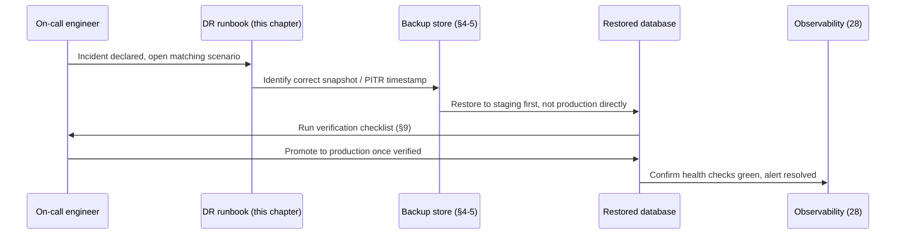

# 44 — Backups

> **Status:** Draft v1 · **Owner:** CTO / Principal Platform Engineer · **Audience:** Anyone who will ever run a migration, hold an on-call pager, or be woken up at 3am because something is gone
> **Governed by:** `00-ENGINEERING-PRINCIPLES.md` and the relevant prior chapters, in particular `12-DATABASE-ARCHITECTURE.md`, `25-SECURITY.md`, `28-OBSERVABILITY.md`, `40-CI-CD.md`, and `41-DOCKER.md`.

---

## 1. The One Rule This Chapter Exists to Enforce

A backup you have not restored is not a backup. It is a hope, dressed up in a cron job and a green checkmark. `12` already planted this flag (§8): "the measure of a backup system is a successful restore, full stop." This chapter is where that promise becomes a concrete, scheduled, owned practice — RPO/RTO targets, what gets backed up and how, where copies live, and a disaster-recovery runbook that gets *rehearsed*, not just written and filed away.

**Simple explanation:** imagine a fire extinguisher mounted on the wall that nobody has ever actually pulled the pin on. It might work. It might be empty, expired, or missing a part. You don't find out until the kitchen is on fire — the worst possible moment to discover the answer. A backup strategy without restore drills is that fire extinguisher. This chapter is the fire drill, scheduled on the calendar, not left to "we'll figure it out if it ever happens."

> **CTO note:** the single most common cause of catastrophic data loss at small companies isn't "we had no backups" — it's "we had backups, and they didn't work when we needed them." Corrupted dumps, expired credentials to the backup bucket, a restore script nobody updated after a schema migration, a backup that only covers the database and silently misses the object storage bucket holding user uploads. Every one of these passes a "backup exists" check and fails a "backup restores" check. We only trust the second kind of check.

---

## 2. When This Chapter Activates

Per the phasing (`04`, `11`, `12`), **backups are a Phase 2 concern**. Phase 1 UToolios has no database, no accounts, no server-side state — the entire site is reproducible at any moment by re-running the build from git. There is nothing to back up because there is nothing stateful to lose.

| Phase | State that exists | Backup posture |
|---|---|---|
| **Phase 1** | None — static/ISR pages, pure client-side calculators (`13`) | Source in git *is* the backup; a lost deployment is a re-deploy, not a disaster |
| **Phase 2** | PostgreSQL (accounts, metering, audit logs — `12`), Redis (cache, disposable), R2/object storage (uploads for server-side tools), Meilisearch index | This chapter activates in full |
| **Phase 3** | + billing records, premium entitlements, API keys | Backup scope grows; RPO tightens for financial data (§3) |

**Simple explanation:** you don't insure a rental car you don't own. Phase 1 UToolios owns no data — the mortgage-calculator and jwt-decoder run entirely in the visitor's browser, compute an answer, and keep nothing. The moment we introduce a `users` table or a metering row per tool run (`12`), we've created something that can be lost forever if a disk fails — and *that's* the moment this chapter's machinery turns on, not before.

> **CTO note:** resist the urge to "set up backups early just in case." An empty database backed up nightly is busywork that trains nobody and protects nothing. Build the seam — this document, the runbook template, the tooling choice — now, in writing, so Phase 2 engineers implement against a plan instead of inventing one under launch pressure. But the actual cron jobs, encrypted buckets, and drill calendar switch on when real rows exist to lose.

---

## 3. RPO and RTO: Naming the Target Before Building the System

Before choosing a backup tool, we name what "acceptable loss" and "acceptable downtime" mean — otherwise "we have backups" is a slogan, not an engineering requirement.

- **RPO (Recovery Point Objective)** — the maximum data we're willing to lose, measured in time. An RPO of 5 minutes means: in the worst case, we lose at most the last 5 minutes of writes.
- **RTO (Recovery Time Objective)** — the maximum time we're willing to be down or degraded while restoring. An RTO of 1 hour means: from "database is gone" to "database is back and serving," at most 60 minutes pass.

| Data class | Example | RPO target | RTO target | Why this tier |
|---|---|---|---|---|
| **Transactional core** | Accounts, billing/entitlements (Phase 3), audit logs | ≤ 5 minutes | ≤ 1 hour | Money and identity — losing minutes of writes here means real customer harm |
| **Metering / analytics** | Tool usage counts (`12`, `31`) | ≤ 1 hour | ≤ 4 hours | Painful to lose but reconstructable in part from logs (`29`); not customer-facing money |
| **Search index** | Meilisearch index (`32`) | N/A (rebuildable) | ≤ 2 hours | Derived data — rebuilt from source content, never the source of truth itself |
| **Uploaded user content** | Files passed to server-side tools (`11` §8, `25`) | ≤ 15 minutes | ≤ 2 hours | User-supplied, non-reconstructable if lost mid-processing |
| **Config, IaC, tool content** | Terraform, `tool.config.ts`, `article.md` | 0 (git is authoritative) | Minutes | Already versioned in git — see §6 |

**Simple explanation:** RPO answers "how much can we afford to lose?" and RTO answers "how long can we afford to be down?" A bank's transaction ledger has a near-zero RPO — losing even a minute of transfers is unacceptable. A blog's page-view counter can tolerate losing an hour and nobody notices. We don't apply one blanket backup policy to everything; we tier it, so the account and billing tables (the ones that would genuinely hurt someone if lost) get the tightest targets, and disposable caches get none at all.

> **CTO note:** it's tempting to set every RPO/RTO to "as close to zero as possible" because it sounds safest. It isn't free — a 5-minute RPO on every table means continuous streaming backups, PITR infrastructure, and testing overhead applied uniformly, which is expensive and distracts from the tables that actually need it. A solo founder's first version of this table should be honest about what's genuinely catastrophic (accounts, money) versus merely annoying (a day-old metering count) and spend engineering effort accordingly.

---

## 4. What Actually Gets Backed Up, and Where

| System | Backed up? | Method | Where it lives |
|---|---|---|---|
| PostgreSQL | Yes | Continuous WAL archiving (PITR) + nightly full snapshot | Separate AWS account/region from production (§5) |
| R2 / object storage (uploads) | Yes | Cross-region bucket replication | Different Cloudflare/AWS region |
| Redis | **No** | N/A — pure cache, rebuilt from Postgres on cold start (`21`) | — |
| Meilisearch index | **No** | N/A — derived data, rebuilt from tool content/DB on demand (`32`) | — |
| Git (config, IaC, `packages/tools/**`) | Yes, implicitly | Git's own distributed-clone model | GitHub + every developer/CI clone (§6) |
| Secrets (API keys, DB credentials) | Yes, separately | Secrets manager's own versioning/backup, never in a DB dump | Vault-class service, encrypted (`25`) |

**Simple explanation:** not everything deserves a backup — only things that are the *only copy* of something we can't regenerate. Redis and the Meilisearch index are photocopies of information that lives permanently elsewhere (Postgres, the tool content in git); if we lose the photocopy, we just make a new one from the original. Postgres and uploaded user files, by contrast, are the *originals* — if those disappear with no backup, they're gone forever. We spend backup effort only on originals.

---

## 5. Automated Database Backups and Point-in-Time Recovery

PostgreSQL (`12`) gets two complementary layers, not one:

1. **Continuous WAL (Write-Ahead Log) archiving** — every committed transaction's log is streamed continuously to durable storage. This is what makes **Point-in-Time Recovery (PITR)** possible: we can reconstruct the database as it existed at *any specific second* in the retention window, not just at the moment of last night's snapshot. This is what protects the ≤5-minute RPO for the transactional core (§3) — a bad migration or an accidental `DELETE` at 2:17pm can be recovered to 2:16:59pm, not rolled back to last midnight.
2. **Nightly full snapshots** — a complete, independent base image, retained on a rolling window (e.g. 35 daily, 12 monthly). Snapshots are the fast path for a full-instance rebuild and a second, independent recovery mechanism if WAL archiving itself has a gap.

| Layer | Recovers from | Speed | Granularity |
|---|---|---|---|
| WAL/PITR | "we need the exact state at 2:16:59pm before the bad migration" | Slower — replays log forward from base | To the second |
| Nightly snapshot | "the whole instance/region is gone" | Faster — restore the image directly | To the last snapshot |

**Simple explanation:** think of WAL archiving as a security camera recording continuously, and the nightly snapshot as a full photograph of the room taken once a day. If a customer's account got corrupted at 2:17pm, we rewind the security footage to 2:16:59pm. If the entire building burned down, we don't rewind footage — we rebuild from the last full photograph and accept we're back to yesterday's state, faster than replaying a full day of footage.

> **CTO note:** managed database services (RDS-class, per `12`'s "boring, dependable" philosophy) bundle both of these out of the box — this is one of the strongest arguments for paying for a managed Postgres instead of self-hosting on a bare EC2/VM in Phase 2. Self-hosting Postgres to save money and then hand-rolling WAL archiving and PITR is a classic false economy: it looks cheaper on the infra bill and is dramatically more expensive the first time a restore is needed under pressure and the homemade script has a bug nobody caught, because nobody had rehearsed it (§8).

---

## 6. Config, IaC, and Tool Content: Git *Is* the Backup

Unlike the database, our infrastructure-as-code, tool configuration, and content (`06`, `13`, `33`, `34`) don't need a separate backup pipeline — **git's distributed model already is one.** Every developer clone, every CI runner checkout, and GitHub's own storage are independent, geographically distributed copies of the exact same history. Losing GitHub itself would be a serious incident, but not a data-loss one: any recent clone reconstructs the full repository, including every `tool.config.ts`, every `article.md`, and every Terraform/IaC file, with full commit history intact.

This is precisely why the platform engine's design (`13`) — thousands of tools as plain files in git rather than rows in a database — pays a quiet backup dividend: **there is no tool-content backup job to write, monitor, or drill, because git was never a single point of failure to begin with.**

**Simple explanation:** a shared Google Doc that only one person has ever opened is a single point of failure. A book that a thousand libraries each hold a physical copy of is not — burn one library down and the book survives, unchanged, in every other copy. Git repositories work like the thousand libraries: the moment `git clone` ran on a second machine, the "one canonical name, one folder" tool architecture (`13`) — the jwt-decoder's `calculator.ts`, `schema.ts`, and `article.md` together — already exists in full on every developer's laptop and every CI runner, with nothing extra to configure.

> **CTO note:** this only holds if we actually *use* git as intended — don't let generated or fetched content (AI-drafted tool copy from `35`, before it's committed) live only in a database or a scratch directory that nobody backs up. The rule is simple: if it's not in a git commit, it doesn't count as durably stored, full stop. Anything that matters gets committed, even auto-generated content, before we consider it safe.

---

## 7. Backup Encryption and Offsite Storage

A backup that isn't encrypted is a second copy of every breach risk the primary database carries — arguably worse, because backups are often checked less frequently and live longer. Every backup artifact in this system is:

- **Encrypted at rest**, using the cloud provider's server-side encryption (KMS-managed keys), consistent with the encryption-at-rest standard set for primary data (`25`, `26`).
- **Encrypted in transit**, whenever WAL segments or snapshots move between regions or accounts.
- **Stored offsite from production** — a genuinely separate account and region from the one running the live database. "Offsite" here means "survives the production AWS account being compromised or deleted," not merely "a different folder in the same account."
- **Access-restricted independently** — the credentials that can *write* a backup are not the same credentials that can *delete* one; ideally the backup store has its own immutability/retention lock so even a compromised production credential can't erase history it created (`25`, least-privilege).

| Control | Protects against |
|---|---|
| Encryption at rest (KMS) | Stolen disk/snapshot being readable |
| Separate account/region | A single compromised or deleted AWS account taking out both primary and backup |
| Write-only backup credentials, immutable retention | Ransomware-style attack that deletes backups to force payment, or an insider/compromised-credential wipe |
| Access logging on the backup store | Detecting unauthorized access to backups themselves (`29`) |

**Simple explanation:** it does no good to lock your front door and then leave a spare key taped under the doormat labeled "spare key." Encrypting the primary database but leaving backups in plaintext, in the same account, reachable by the same compromised credentials, is exactly that — an attacker who gets in doesn't even need to break the encryption on the live database; they just read the unencrypted backup sitting one folder over. Offsite, encrypted, separately-credentialed backups mean a single point of compromise — even a bad one — doesn't take out both the original and every copy of it.

> **CTO note:** the ransomware playbook increasingly targets backups *first* — encrypt or delete the backups, then the primary, so the victim has no recovery path but paying. Immutable/write-once retention on the backup store (many object storage providers support this natively, e.g. object lock) is the single highest-leverage control against that specific scenario, and it's a checkbox, not a project. Enable it before the first backup is ever written, not after an incident teaches the lesson.

---

## 8. The Disaster-Recovery Runbook

A runbook is the difference between "we know roughly what to do" (true right after writing it, false three months and one team member later) and "anyone on the team can execute this correctly at 3am, half-awake, under pressure." Every scenario below gets a written, versioned runbook stored in the repository, not a wiki page or someone's memory.

| Scenario | Runbook must answer |
|---|---|
| Primary database instance lost | Which snapshot/PITR target to restore to, exact commands, who has permission, expected duration |
| Accidental data corruption (bad migration, bad `DELETE`) | How to PITR to the exact pre-incident second without losing *unrelated* good writes made since |
| Object storage bucket lost or corrupted | Replica bucket promotion steps, verification checklist |
| Entire cloud region down | Cross-region failover order: database, object storage, then application layer (`42`) |
| Backup credentials/pipeline itself compromised | Rotation steps, and how we'd even detect this (`25`, `29`) |

Each runbook entry follows the same shape: **preconditions → exact commands → verification steps → rollback if verification fails → who is authorized to execute it.** No step should require someone to "figure it out" live — that's what the drill in §9 exists to eliminate in advance.

**Simple explanation:** a runbook is a pilot's pre-flight checklist, not a general description of how planes fly. A pilot facing an engine warning doesn't improvise from first principles under stress — they follow a specific, numbered, tested checklist built for exactly that failure. Our DR runbook plays the same role: when the database is gone, nobody should be inventing the restore procedure live. They open the document, follow the steps, and the outcome is predictable regardless of who's on call or how stressed they are.

---

## 9. Restore Rehearsal Cadence: The Part Everyone Skips

This is the section that separates a real backup system from a false sense of security. A restore drill is a scheduled, calendared event where we actually restore a real backup to a real (isolated) environment and verify the result — not a tabletop discussion.

| Drill | Cadence | What's verified |
|---|---|---|
| **Full database restore to staging** | Monthly | Latest snapshot restores cleanly; application boots against it; row counts and spot-checked records match expectations |
| **PITR to an arbitrary past timestamp** | Quarterly | We can recover to a *specific second*, not just the latest snapshot — proves the WAL chain is intact, not just present |
| **Object storage cross-region restore** | Quarterly | Replica bucket has the data, permissions are correct, application can read from it |
| **Full DR runbook execution, unannounced within the team** | Every 6 months | The *documented* procedure works end-to-end, executed by someone who didn't write it, timed against the RTO target |
| **Backup credential/pipeline audit** | Quarterly | Backup jobs are still running, credentials haven't silently expired, alerts fire correctly on a simulated failure |

Every drill produces a short, dated record: what was restored, how long it took, what broke, what was fixed. **A drill that reveals a problem is a success, not a failure** — that's the entire point of doing it in a low-stakes rehearsal instead of a real incident.

> **CTO note:** as a solo founder, the honest failure mode isn't "we never wrote a DR plan" — it's "we wrote it once in month 3 and never opened it again while the schema, the infra, and the team changed underneath it." Put these drills on a recurring calendar reminder alongside the equivalents already established for CI/CD health (`40`) and monitoring review (`30`), and treat a missed drill exactly like a missed security patch: a tracked, visible gap, not a silent one. If solo-founder bandwidth genuinely can't sustain the full cadence above, shrink the drill scope before skipping it entirely — a 15-minute monthly "restore latest snapshot to a throwaway instance and count rows" beats a beautifully detailed plan that's never been run once.

**Simple explanation:** this is a smoke detector with a "test" button, and the discipline of actually pressing it monthly instead of assuming the battery is fine because the light is green. The light being green (backup job completed successfully) tells you a file was written somewhere. Pressing the test button (restoring it and checking the data) tells you the thing will actually save you when the room fills with smoke. We schedule the button-press, on the calendar, the same way we'd schedule anything else non-negotiable.

---

## 10. Alerting on Backup Health

Backups are pointless if a silent failure goes unnoticed for weeks. Backup health is wired into the same observability stack as everything else (`28`, `29`, `30`):

| Signal | Alert condition |
|---|---|
| Nightly snapshot job | Fires an alert on any failure or on "no successful run in 25 hours" |
| WAL archiving lag | Alerts if archived WAL falls more than a few minutes behind the primary |
| Cross-region replication lag (object storage) | Alerts if replica falls behind beyond the RPO target for uploads |
| Backup store access | Unexpected delete/modify attempts on the backup bucket alert immediately (`25`) |
| Drill overdue | A calendar-driven alert if a scheduled drill (§9) is skipped |

**Simple explanation:** a backup job failing silently at 2am on a Tuesday, with nobody finding out until the restore is needed six weeks later, is the single most common way "we had backups" turns into "we didn't, actually." Treating a failed backup job exactly like a production outage — an alert that pages someone, not a log line nobody reads — is what closes that gap.

---

## Summary

- Backups activate in **Phase 2**, when the first real state (accounts, metering, uploads) exists; Phase 1 has nothing stateful to lose, so nothing to back up.
- Every data class gets an explicit **RPO/RTO target**, tiered by real consequence — tight for accounts/billing, looser for rebuildable caches and search indexes.
- **PostgreSQL** gets two layers: continuous **WAL archiving for PITR** (recover to any second) plus **nightly full snapshots** (fast full-instance rebuild) — both ideally from a managed database service, not hand-rolled.
- **Redis and the Meilisearch index are never backed up** — they're derived data, rebuilt from Postgres/tool content on demand; only originals get backup effort.
- **Git is already the backup** for config, IaC, and tool content — its distributed-clone model means there's no separate pipeline to build for `packages/tools/**`.
- Backups are **encrypted at rest and in transit, stored offsite** (separate account/region), with **write-only, immutable-retention credentials** distinct from the ones that can delete them — the specific defense against ransomware-style backup destruction.
- A written, versioned **disaster-recovery runbook** covers each realistic failure scenario with exact commands, verification steps, and named authority — never "figure it out live."
- **Restore drills are scheduled and rehearsed**, not theoretical: monthly full restores, quarterly PITR and cross-region checks, twice-yearly full runbook execution by someone other than the author. A drill that finds a problem is the system working as intended.
- Backup **health is alerted on**, exactly like production incidents — a silently failed backup job is the most common way "we had backups" becomes "we didn't."

> Next: `45-INCIDENT-RESPONSE.md` — on-call rotation, severity levels, postmortems, and the human process for when something goes wrong despite all of this.

---

### Changelog
| Version | Date | Change | Reason |
|---------|------|--------|--------|
| v1 | (draft) | Initial backup, RPO/RTO, and disaster-recovery strategy | Project inception |
