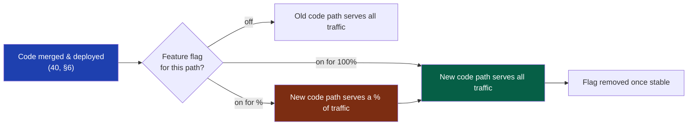
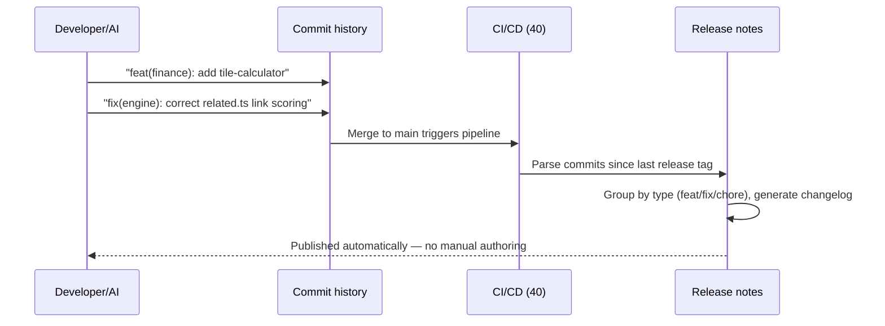

# 46 — Release Strategy

> **Status:** Draft v1 · **Owner:** CTO / Developer Experience Lead · **Audience:** Anyone shipping a change to production — human or AI
> Governed by: `00-ENGINEERING-PRINCIPLES.md` and the relevant prior chapters, in particular `07-DEVELOPMENT-WORKFLOW.md`, `13-TOOL-PLUGIN-ARCHITECTURE.md`, `19-ADS-ARCHITECTURE.md`, and `40-CI-CD.md`.

---

## 1. What This Chapter Is: Deploy Is Not Release

`40` built the machine that gets code from a green merge to running production infrastructure, automatically, in minutes. This chapter answers a different question: once code is *running* in production, when does it actually become *visible and active for users*? Those two events — code running, and code being used — sound identical, but treating them as the same thing is the single most common way a small, capable team creates large, avoidable incidents.

**Deploy** = the new code is on the servers/edge, compiled, ready to execute.
**Release** = a real user's request is actually served by that new code path.

For most of UToolios's history so far, these have collapsed into one event: merge to `main`, CI goes green, the new tool page is live, done (`40`, §6). That is correct and sufficient for the overwhelming majority of changes — a copy fix on the `jwt-decoder`'s FAQ, a new pure-function tool folder, a CSS tweak. This chapter exists for the minority of changes where collapsing deploy and release together is the wrong call: a rewritten `calculator.ts` formula on a high-traffic tool, a new server-dependent tool (`19`, §7), a change to the shared engine that touches every one of 1,000+ pages at once.

**Simple explanation:** deploying is stocking a new product on the warehouse shelf. Releasing is putting it on the store floor where customers can pick it up. A retailer can stock a product today and choose to put it on the floor next Tuesday, or to a handful of test stores first — the truck already arrived; when customers see it is a separate decision. UToolios needs that same separation for its riskier changes, even though most days the truck arrives and the shelf and the floor are the same thing within minutes.

> **CTO note:** for a solo founder, building a full release-management system before you have meaningful traffic is exactly the over-engineering `00` warns against. The right move is not "build a release train"; it is "build the one seam — feature flags — that lets you decouple deploy from release *when a specific change actually needs it*," and otherwise keep shipping the boring, fast, continuous-deploy path from `40` for everything else. Most tools never need this chapter's machinery at all.

---

## 2. The Core Idea: Decoupling Deploy from Release

The mechanism that separates the two events is the **feature flag**: a runtime switch, checked in code, that decides whether a given code path is active for a given request, independent of whether that code is deployed.



This flips the traditional risk model. Without flags, "ship the change" and "expose the change to users" are the same action, so the only lever you have against a risky change is *delaying the merge* — batching work, holding branches open, the classic "release branch" anti-pattern that `07` already rejects for UToolios's trunk-based workflow. With flags, the merge stays small, frequent, and continuous (`40` is untouched), and the *exposure* is what gets throttled, gradually, and independently of the code's arrival on the server.

**Simple explanation:** think of a stage play with the new scenery already built and standing behind the curtain. The curtain (the flag) decides what the audience sees, not whether the scenery exists. The carpenters (developers) can keep building and adjusting backstage every day; opening night (release) is a separate decision made when the scenery is actually ready to be seen.

---

## 3. Continuous Deployment Stays the Default

Nothing in this chapter weakens `40`'s rule that every green merge to `main` auto-deploys to production. That remains the default path for the large majority of changes: new tool folders, copy edits, most bug fixes, most refactors of `calculator.ts` where the plugin contract (`13`) and its known-value tests already give strong confidence. Continuous deployment is cheap, fast, and — because CI's gates are trustworthy (`40`, §7) — safe by default.

| Change type | Deploy strategy | Why |
|---|---|---|
| New tool folder (pure client-side) | Continuous deploy, no flag | Fully isolated by the plugin contract (`13`); a bug in `tile-calculator` cannot affect `bmi-calculator` |
| Copy/content/FAQ edit | Continuous deploy, no flag | No logic risk; reviewed via preview URL (`40`, §5) |
| Bug fix with a known-value regression test | Continuous deploy, no flag | Test suite is the safety net (`13`, `39`) |
| Rewritten formula on a high-traffic tool (e.g. `mortgage-calculator`) | Deploy + flag, gradual rollout | Wrong output at scale is a trust and SEO risk; blast radius is one popular page |
| New server-dependent tool (OCR, PDF; `19`, §7) | Deploy + flag, gradual rollout | Cost and abuse risk (`19`); needs real-traffic validation before full exposure |
| Shared engine/layout change (route renderer, ad slot logic) | Deploy + flag, gradual rollout | Blast radius is every one of 1,000+ tool pages at once |

The decision of *which* row a change falls into is made in code review, using the same "load-bearing wall vs. furniture" question `00` already teaches: a change whose failure mode is small, isolated, and cheaply reversible ships continuously with no ceremony; a change whose failure mode is wide, expensive, or user-trust-affecting gets a flag.

---

## 4. Feature Flags: the Off Switch for Risk

A feature flag is a boolean (or percentage, or allow-list) check, read at request time, that gates a code path. For UToolios, flags live behind our own thin interface — never a direct third-party SDK call in tool or engine code — consistent with the Replaceable principle (`00`, §4.10).

```ts
// packages/core/flags/flags.ts — illustrative shape, not final API
interface FeatureFlags {
  isEnabled(flagKey: string, context?: { toolSlug?: string; requestId?: string }): boolean;
  variant(flagKey: string, context?: { requestId?: string }): string;
}
```

Every tool and engine module asks *this* interface, never a vendor SDK, for the same reason `32` keeps search behind `search.query()` and `19` keeps ads behind `AdSlot`: the flag *provider* is swappable furniture, the flag *interface* is the load-bearing part.

| Phase | Flag implementation | Why this is enough for now |
|---|---|---|
| Phase 1 (today) | A small config object (env var or static JSON, read at build/edge time), `isEnabled(key)` checks a short list of active flags | Zero users, zero database (`04`); a static list of a handful of active flags is genuinely sufficient |
| Phase 2 | Same interface, backed by Redis-cached config (`21`) so flags can flip without a redeploy | Once server-tools and real traffic exist, flipping a flag without waiting for a deploy becomes worth the cost |
| Phase 3 | Same interface, backed by a real flag/experimentation service (LaunchDarkly-class or self-hosted), with per-user/segment targeting | Auth (`23`) gives us real user identity to target segments; premium gating (Phase 3 business model) needs the same targeting primitive |

**Simple explanation:** a flag is a light switch wired ahead of time, even in a room nobody uses yet. In Phase 1 the switch is a simple physical toggle at the breaker box (a config file you edit and redeploy). Later, it becomes a smart switch you can flip from an app without an electrician visiting (Redis-backed, no redeploy). The wiring in the wall — the interface every room's lightbulb calls — never changes; only what's behind the switch gets smarter.

> **CTO note — flags are a liability, not a free lever:** every flag is a second code path that must be tested, and a forgotten flag left at 50% for six months is worse than the deploy it was meant to protect — it becomes silent, undocumented branching logic that violates the Anti-Principle against hidden coupling (`00`, §7). The rule: every flag is created with a named owner and a removal date in its PR description, and CI's contract validation (`40`, §4) should flag (no pun intended) any flag older than a set threshold — start with a manual quarterly audit in Phase 1; automate the staleness check once Phase 2's observability stack (`28`) exists.

---

## 5. Gradual and Canary Rollouts

Once a change ships behind a flag, exposure ramps up in stages rather than flipping instantly from 0% to 100%. This is the mechanism that turns "the new mortgage formula might be subtly wrong" from a full-site incident into a contained, quickly-detected, cheaply-reverted blip.

```mermaid
flowchart TD
    Deploy["New code deployed, flag off (0%)"] --> Internal["Stage 1: founder/internal only<br/>(allow-list of request IDs)"]
    Internal --> Canary5["Stage 2: 5% of traffic"]
    Canary5 --> Monitor1{Metrics healthy?<br/>(28, 30, 31)}
    Monitor1 -->|yes| Canary25["Stage 3: 25% of traffic"]
    Monitor1 -->|no| Rollback1["Flag to 0%, investigate"]
    Canary25 --> Monitor2{Metrics healthy?}
    Monitor2 -->|yes| Full["Stage 4: 100% of traffic"]
    Monitor2 -->|no| Rollback2["Flag to 0%, investigate"]
    Full --> Remove["Flag removed once stable for N days"]
    style Canary5 fill:#7c2d12,color:#fff
    style Full fill:#065f46,color:#fff
    style Rollback1 fill:#7f1d1d,color:#fff
    style Rollback2 fill:#7f1d1d,color:#fff
```

What "metrics healthy" means is defined per change, before the rollout starts, not improvised mid-rollout — otherwise there is no honest bar to clear:

| Change type | Health signal to watch | Source |
|---|---|---|
| Rewritten formula | Error rate, known-value spot checks against production logs, unexpected input-range triggers | `28`, `29` |
| New server-side tool | Latency, cost-per-request against the pre-launch cost model (`19`, §7), rate-limit trigger rate | `21`, `28` |
| Shared engine/layout change | Core Web Vitals (LCP/INP/CLS), overall error rate across a sample of tool pages | `20`, `30` |
| Ads/monetization change | Ad viewability, CWV impact, revenue-per-session | `19`, `31` |

**Simple explanation:** a canary rollout is a chef tasting a new recipe on the smallest possible party before it goes on the full menu — first the kitchen staff (internal-only), then one quiet table (5%), then a busier section (25%), then the whole restaurant, and only once nobody at the earlier tables sent a plate back. If the `bmi-calculator`'s new unit-conversion logic is subtly wrong for imperial units, a 5% canary catches it from a few hundred sessions, not a few hundred thousand.

> **CTO note — canary percentages are meaningless without real traffic to canary against.** At near-zero visitors, a 5% cohort might be three people; "healthy metrics" is noise, not signal. In Phase 1, the honest substitute for statistical canarying is *staged, deliberate, human-observed rollout*: internal-only, then a specific low-traffic tool as a bellwether, then broader — judged by eye against logs, not by a dashboard threshold. Do not fake statistical confidence you don't have; the discipline of staging still has value even when the sample size doesn't support a p-value.

---

## 6. Instant Rollback: One Layer Below the One in `40`

`40` (§8) already covers rolling back an entire deploy — pointing production traffic back at the previous immutable build. Feature flags add a second, faster, narrower rollback layer *underneath* that one: instead of reverting the whole deploy, you flip one flag to 0% and the specific risky path disappears while everything else the same deploy shipped stays live.

| Rollback layer | Scope | Speed | When to use |
|---|---|---|---|
| Flag flip (this chapter) | One feature/code path | Seconds; no rebuild, no redeploy | The problem is isolated to a flagged change; everything else in the deploy is fine |
| Deploy revert (`40`, §8) | Entire deploy (everything merged since the last known-good point) | Minutes; platform-level instant rollback | The problem isn't isolated to one flag, or there was no flag around the change |

This is precisely why risky changes get a flag in the first place: it converts an incident that would otherwise require a full deploy revert (losing whatever else shipped in that deploy) into a single, surgical, seconds-fast switch. The two mechanisms are complementary, not competing — flags handle the common risky-change case; deploy revert remains the backstop for anything a flag didn't anticipate.

**Simple explanation:** it's the difference between unplugging one faulty appliance versus cutting power to the whole house. If the new dishwasher (a flagged formula change) is sparking, unplug just the dishwasher — the lights, fridge, and everything else stay on. Cutting the main breaker (a full deploy revert) is still there for the day something goes wrong that isn't behind any single switch.

---

## 7. Release Notes: Generated, Not Written

UToolios enforces Conventional Commits (`feat:`, `fix:`, `chore:`, `refactor:`, etc.) as part of its commit discipline (`07`, `08`). Release notes are a direct, mechanical output of that discipline, not a document anyone writes by hand:



A commit-parsing tool (e.g. a `semantic-release`-class step, chosen and swappable behind our own script per the Replaceable principle) walks commits since the last tag, groups them by Conventional Commit type, and produces a changelog entry and a version bump automatically. This matters for three concrete reasons at UToolios's scale:

1. **A thousand-tool catalog generates a high volume of small merges daily.** Hand-writing release notes for that volume is either skipped (so nobody has a record of what shipped when — an Observability gap, `00` N6) or becomes its own daily chore competing with actual building time.
2. **It gives incident response a fast, trustworthy timeline.** "What changed in the last 24 hours" (needed when investigating a regression, `28`) is a query against generated notes, not a memory exercise.
3. **It is the natural place to record which flags moved stage** (§5) alongside which commits shipped — a single artifact answering both "what code changed" and "what became visible" without conflating the two, which is the entire point of this chapter.

**Simple explanation:** it's a receipt printer at checkout, not a cashier writing a summary by hand. Every scanned item (a Conventional Commit) prints itself onto the receipt (the changelog) in the right category, automatically, the instant it's scanned — nobody transcribes the day's sales into a notebook afterward.

> **CTO note:** Conventional Commits only produce useful release notes if commit messages are honest about type — a `fix:` that's actually a `feat:` in disguise (because "fix" felt safer to write under deadline) quietly corrupts the semantic-versioning signal downstream. Treat commit-type accuracy as a lint-adjacent discipline (`08`), not a formality; a linter can catch the *format* of a Conventional Commit, but only review catches whether `fix:` versus `feat:` was chosen honestly.

---

## 8. Release Strategy by Tool Risk Tier

Pulling §3 through §7 together, every change resolves to one of three concrete release postures, mapped directly to the risk tiers already established by `13` and `19`:

| Tier | Example | Deploy | Flag? | Rollout |
|---|---|---|---|---|
| **Low risk** — pure client-side tool, new or edited | `jwt-decoder`, `tile-calculator`, most of the 1,000+ catalog | Continuous, auto-deploy (`40`) | No | Instant, full |
| **Medium risk** — high-traffic tool formula rewrite, shared UI component | `mortgage-calculator` recalculation logic, a shared `AdSlot` change | Continuous deploy, flag on the specific path | Yes | Staged (§5), days not weeks |
| **High risk** — server-dependent tool, shared engine/route-renderer change | New OCR tool (`19`, §7), a route-renderer change touching all tool pages | Continuous deploy, flag on the specific path | Yes | Staged, internal-only first, longer soak |

This table is the practical answer to "do I need a flag for this PR?" — reviewers check which row a change belongs to, the same way they already check plugin-contract compliance (`13`) and a11y (`37`) in every review.

---

## 9. What This Looks Like by Phase

| Aspect | Phase 1 (today) | Phase 2 (`21`, `28`) | Phase 3 (`22`, `23`) |
|---|---|---|---|
| Flag storage | Static config, redeploy to change | Redis-backed, flip without redeploy | Real flag service, per-user/segment targeting |
| Canary signal | Manual, human-observed (§5 CTO note) | Automated dashboards (`28`, `30`) gate stage advancement | Statistically significant cohorts at real scale; experimentation platform |
| Release notes | Generated changelog, single audience (the founder, future contributors) | Same, plus feeding incident timelines (`28`) | Same, plus public-facing changelog for API consumers (`22`) |
| Rollback | Flag flip + deploy revert (`40`) | + cache invalidation on rollback (`21`) | + DB migration rollback discipline (`12`) |

We build the flag *interface* now, deliberately thin, so that Phase 2 and 3's smarter backends are a swap behind that interface, not a redesign of how every tool and engine module asks "am I on?" — the same seam-now, feature-later discipline `04` and `40` already established for the platform's heavier infrastructure.

**Simple explanation:** the wiring standard for the light switch is decided on day one — a simple on/off signal, checked the same way everywhere. Whether that signal comes from a breaker box today or a smart-home hub in three years, no lightbulb in the house needs rewiring when the hub arrives.

---

## Summary

- **Deploy and release are two different events**, and this chapter's entire purpose is giving UToolios a deliberate way to separate them for the minority of changes where collapsing them is risky.
- **Continuous deployment remains the default** for the large majority of changes (new tools, copy fixes, well-tested bug fixes) — nothing here slows down the fast path established in `40`.
- **Feature flags are the mechanism that decouples deploy from release**: code ships to production continuously; a flag decides who actually sees it, gated behind our own interface (never a direct vendor SDK call) for Replaceability.
- **Gradual/canary rollouts** stage exposure from internal-only to a small percentage to full, judged against named health signals defined before the rollout starts — honestly staged, human-observed in Phase 1 rather than fake-statistical.
- **Flag flips are a faster, narrower rollback layer** underneath the full deploy-revert mechanism from `40` — surgical for isolated problems, with deploy revert as the backstop.
- **Release notes are generated from Conventional Commits**, never hand-written — a mechanical output of existing commit discipline (`07`, `08`) that also gives incident response an honest timeline.
- **Every change maps to one of three risk tiers** (low/medium/high) that decides, mechanically, whether it needs a flag and how it rolls out — reviewers check this the same way they check plugin-contract compliance.
- **The flag interface is built now, deliberately thin**; smarter flag backends (Redis-backed, then a real experimentation service) arrive additively in Phase 2/3, never requiring a rewrite of how tools ask "am I on?"

> Next: `47-INCIDENT-RESPONSE.md` — what happens when a release (flagged or not) goes wrong in production and someone has to respond.

---

### Changelog

| Version | Date | Change | Reason |
|---|---|---|---|
| v1 | (draft) | Initial release strategy | Project inception |
