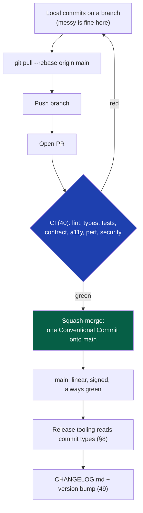
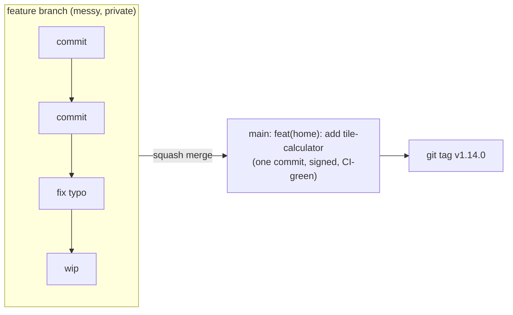
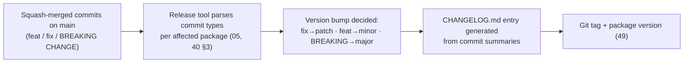

# 47 — Git Strategy

> **Status:** Draft v1 · **Owner:** CTO / Developer Experience Lead · **Audience:** Anyone committing code, content, or configuration — human or AI
> Governed by: `00-ENGINEERING-PRINCIPLES.md` and the relevant prior chapters, in particular `05-MONOREPO-STRATEGY.md`, `06-REPOSITORY-STRUCTURE.md`, `07-DEVELOPMENT-WORKFLOW.md`, `40-CI-CD.md`, and `45-SECRETS-MANAGEMENT.md`.

---

## 1. Why Git History Is Part of the Constitution, Not Just Plumbing

`07` gave you the daily loop. `40` gave you the machine that enforces it. This chapter governs the layer underneath both: the actual shape of the history that loop produces. It's tempting to treat Git as background plumbing — "commit early, commit often, whatever, it works." At 10 tools that's true and harmless. At 500+ tools, with an AI generating a meaningful share of the changes (`35`) and a founder who wasn't there for a commit made six weeks ago, the *shape* of history becomes a working tool in its own right: it's how you find out which commit broke the `mortgage-calculator`'s amortization math, which release introduced a regression, and what actually shipped in v1.14.0 without re-reading every diff by hand.

History is either an asset you can query, or an archive you can only scroll. This chapter makes it the former: every commit means something specific, machine-readable, attributable, and verifiable — by construction, not by discipline you have to remember.

**Simple explanation:** think of history as a ship's log, not a diary. A diary can say "did some stuff on the boat today." A ship's log records what happened, when, who was on watch, and why a course changed — because someone will need to reconstruct events later, possibly during an emergency. `git log` should read like a ship's log for UToolios, not a diary.

> **CTO note:** the honest failure mode here isn't "no Git strategy" — it's a strategy nobody ever writes down, followed loosely for six months, then abandoned the first time it's inconvenient. A one-person team has zero social pressure to keep commit hygiene; nobody is reviewing your commit messages. That's exactly why it has to be *mechanically* enforced (§8, `40`) rather than left to willpower on a tired Tuesday night.

---

## 2. Conventional Commits: The Commit Message Contract

Every commit message follows the [Conventional Commits](https://www.conventionalcommits.org/) format:

```
<type>(<scope>): <short summary, imperative mood>

<optional body: why this change, not just what>

<optional footer: BREAKING CHANGE:, Co-authored-by:, Refs:>
```

| Type | Meaning | Example |
|---|---|---|
| `feat` | A new capability (usually a new tool) | `feat(finance): add mortgage-calculator` |
| `fix` | A bug fix | `fix(finance/mortgage-calculator): correct rounding in amortization schedule` |
| `docs` | Documentation only, no code behavior change | `docs(47): clarify signed-commit setup` |
| `refactor` | Restructures code with no behavior change | `refactor(engine): extract metadata builder from route renderer` |
| `perf` | A measurable performance improvement | `perf(web): lazy-load below-fold ad slot` |
| `test` | Adds or corrects tests only | `test(bmi-calculator): add zero-height edge case` |
| `build` | Build system or dependency changes | `build(deps): bump zod to 3.23` |
| `ci` | CI/pipeline configuration | `ci: raise Turborepo remote cache TTL` |
| `chore` | Maintenance with no production code effect | `chore: update .gitignore` |
| `style` | Formatting only, no logic change | `style: run prettier over packages/tools` |
| `revert` | Reverts a previous commit | `revert: revert "feat(home): add tile-calculator"` |

The **scope** is the package or tool folder the change touches — usually the category/slug from `13`, e.g. `finance/mortgage-calculator` or `dev/jwt-decoder`. A **breaking change** is marked either with `!` after the type (`feat(api)!: rename response field`) or a `BREAKING CHANGE:` footer — this is the exact signal `49-VERSIONING` reads to decide a major version bump.

**Simple explanation:** a Conventional Commit is a shipping label, not a note to yourself. A courier reading a package label doesn't need your life story — they need "fragile," "this side up," "return to sender." `feat(finance): add mortgage-calculator` tells every future reader — human, CI, or a changelog generator — exactly what kind of thing happened and where, in under a second.

> **CTO note:** the discipline pays for itself exactly once, automatically, forever — that's the whole argument for it. A human-written changelog is a chore that gets skipped under deadline pressure; a changelog *generated from* commit types (§8) can't be skipped because it isn't optional manual work. If you only remember one rule from this chapter, make it this one: never accept `git commit -m "stuff"` from yourself or an AI, ever, even at 11pm.

---

## 3. Commit Hygiene: Small, Atomic, Honest

A commit is the smallest unit of *reviewable, revertible* change — not the smallest unit of typing.

| Do | Don't |
|---|---|
| One logical change per commit (add the tile-calculator's schema, then its logic, then its tests — or one commit if genuinely one unit of thought) | One commit that adds a tool, fixes an unrelated typo in `08-CODING-STANDARDS.md`, and bumps a dependency |
| Write the *why* in the body when it isn't obvious from the diff | Leave a bare `fix: bug` with no context for the next reader (you, in six weeks) |
| Commit working, `pnpm verify`-passing states (`07`, §6) | Commit deliberately broken intermediate states "to save progress" — use a local WIP branch or `git stash` instead |
| Keep unrelated changes in separate commits even within one PR | Bundle a security fix inside a routine feature commit, making it hard to isolate later |

The test for "is this commit small enough": *could I revert only this commit, cleanly, without dragging in something unrelated?* If the answer is no, it's not atomic yet.

**Simple explanation:** imagine reverting a single Lego brick from a wall versus reverting a section that's been glued together. An atomic commit is a single brick — remove it, the rest of the wall stands. A commit that mixes three unrelated changes is glue — you can't take one part back without risking the rest, exactly the position you don't want to be in when the `jwt-decoder`'s signature-verification fix turns out to have a bug and the same commit also touched the shared layout.

---

## 4. PR-Based Flow, Even Solo

`07` (§8) already established that every change — yours, an AI's, or a future teammate's — goes through a pull request, never a direct push to `main`. This chapter names *why that's a Git-history decision, not just a process one*: a PR is the unit that gets **squash-merged** (§7) into one clean commit on `main`, carries the CI verdict (`40`) as a permanent, queryable record attached to that commit, and is where a signed, reviewed, Conventional-Commit-compliant message actually gets written — often rewritten from a messier sequence of in-progress commits on the branch.



The branch you work on and its exact naming/lifetime rules (feature branches, hotfix branches, when a branch is allowed to live longer than a day) are `48-BRANCHING`'s job. This chapter only asserts the invariant that constrains it: **whatever branch model `48` specifies, it must resolve to a squash-merged, linear commit on `main`.**

**Simple explanation:** think of the branch as your messy garage workbench — sawdust everywhere, three false starts, a commit called `wip: trying something`. Nobody else needs to see the workbench. What leaves the garage and goes on the truck (the squash-merged commit on `main`) is the single, finished, labeled piece: `feat(home): add tile-calculator`.

---

## 5. Monorepo Git Practices

`05` and `06` already decided this is one repository holding the platform engine, every tool, and this documentation. That decision has direct Git consequences:

- **Scope every commit and PR title to the package it touches.** In a repo that will eventually hold 1,000+ tool folders, `fix(finance/mortgage-calculator): ...` is searchable and `git log --grep` friendly; `fix: bug` is not.
- **`.gitignore` and `.gitattributes` are load-bearing.** Build output, `node_modules`, `.next`, coverage reports, and the pnpm store never enter history (`06`). `.gitattributes` normalizes line endings across contributors' machines and marks generated files (e.g. any build-time-generated sitemap fragments) as generated, so diffs and `git blame` stay meaningful on hand-written files.
- **No binary bloat.** `icon.svg` per tool (`13`) is fine — it's small, hand-authored, and text-diffable. Generated OG images, screenshots, or anything with a real byte footprint belongs in Cloudflare R2 (`43`), referenced by URL, never committed. A monorepo's git history is permanent and every clone re-downloads all of it; don't let convenience today become clone-time pain at 1,000 tools.
- **`CODEOWNERS` is deferred, not skipped.** With one contributor, requiring a second reviewer is meaningless — CI's automated gates *are* the review (`07`, §8; `40`, §7). The file is scaffolded with a single wildcard rule (`* @founder`) now, so that adding real per-package ownership at Phase 3 (once a second engineer exists) is a config edit, not a new process invented under pressure.
- **Partial clone / sparse-checkout is a scaling lever kept in reserve.** At 1,000+ tool folders, a fresh `git clone` will still be fast because tool folders are small text and one SVG each — the repo's byte weight scales with *content*, not media. If clone time ever genuinely degrades, `git clone --filter=blob:none` and sparse-checkout of active packages are the fix. We name the lever here and don't pull it until a real clone-time complaint exists — pulling it early adds workflow friction (`07`) for a problem that doesn't exist yet.

**Simple explanation:** a monorepo is one big filing cabinet instead of a thousand shoeboxes. That's a deliberate trade (`05`) — but it means every drawer label (commit scope) and every rule about what's allowed inside (`.gitignore`) matters more, because there's only one cabinet and everyone's papers are in it together.

> **CTO note:** the temptation in a fast-growing tool catalog is to let `git add .` become a reflex. Resist it. `git add .` in a monorepo with 1,000 folders is how an unrelated debug `console.log` in the `bmi-calculator` quietly rides along inside a commit that's supposed to be about the `tile-calculator`. Stage deliberately (`git add <path>`, or review `git status`/`git diff --staged` before every commit) — it costs five seconds and prevents commits that lie about their own scope.

---

## 6. Signed Commits: Verifiable Authorship

Every commit merged to `main` is cryptographically signed (GPG or SSH signing — SSH signing via an existing SSH key or a hardware key is the lower-friction choice for a solo founder and is fully supported by GitHub). `git config commit.gpgsign true` (or the SSH equivalent) is part of the one-time machine setup in `07` (§3), so signing isn't a step anyone remembers to do — it happens on every commit by default.

Why this matters at UToolios's scale, specifically:

| Reason | Why it matters here |
|---|---|
| **Proves a commit really came from the claimed author** | With AI tools generating code (`35`) and eventually a second engineer, "who actually wrote this" stops being self-evident from a `git log` name field alone, which anyone can set to anything |
| **Supply-chain integrity** | A signed, verified commit is one more barrier against a compromised machine or stolen credential pushing unreviewed code — relevant given `25`/`26`'s threat model |
| **A visible trust signal** | GitHub shows a "Verified" badge on signed commits; an unverified commit on `main` should be treated as an anomaly worth investigating, not routine |

The signing key itself is protected the same way any other credential is — generated once, stored per `45-SECRETS-MANAGEMENT`'s rules (ideally on a hardware key or the OS keychain, never as a plaintext file committed anywhere), and rotated if ever suspected of compromise.

**Simple explanation:** a signed commit is a notarized signature, not just a name typed at the bottom of a letter. Anyone can type "Sujit" at the end of an email; a notary's seal proves the specific person who holds a specific, hard-to-fake credential actually signed it. GitHub's "Verified" badge is that seal for `git log`.

> **CTO note — signing authenticates the human, not the correctness of the code.** Don't let "it's signed and verified" become a substitute for "a human confirmed the formula is right" (`07`, §9). Signing answers *who committed this*; it says nothing about *whether the AI-suggested tax-bracket formula in a new calculator is actually correct*. Keep those two checks distinct — one is cryptography, the other is judgment, and conflating them is how a subtly wrong but properly signed commit ends up on `main`.

---

## 7. Meaningful History: Rebase, Squash, and `git bisect`

The policy, end to end:

1. **Rebase locally, never merge `main` into a feature branch.** `git pull --rebase` keeps your branch's commits replayed cleanly on top of the latest `main`, avoiding noisy "Merge branch 'main' into feat/x" commits that add no information.
2. **Squash-merge every PR into exactly one commit on `main`.** Whatever exploratory mess existed on the branch — three false starts, a `wip:` commit, a `fix typo` commit fixing your own typo from ten minutes earlier — collapses into the single, well-formed Conventional Commit message written at merge time (§2).
3. **`main` has linear history, no merge commits, and no force-pushes** (`40`, §7). This is what makes `git bisect` actually usable: it can binary-search a straight line of commits, each one representing a complete, CI-verified state, to find exactly which change introduced a regression in the `jwt-decoder`'s signature check.
4. **Tags mark releases**, not arbitrary points — an annotated, signed tag (`v1.14.0`) on the commit that release corresponds to, produced by the versioning mechanism in §8.



**Simple explanation:** rebasing is redrawing your route on an up-to-date map before you set off, instead of arguing with an outdated one mid-journey. Squashing is handing in a clean final essay, not the twelve rough drafts that got you there. `git bisect` on a linear, always-green history is like flipping through a well-kept logbook to find the exact page where something changed — trying to do the same on a tangled, merge-commit-heavy history is like searching a notebook where pages were torn out and re-inserted out of order.

> **CTO note — squash-merge has a real cost, and it's worth naming honestly.** It discards the fine-grained authorship of intermediate commits (useful if you ever want "who wrote this exact line, in what earlier attempt"). For a solo founder building 1,000+ small, independent tool folders, that cost is low — the atomic unit that matters is "the PR that added the `tile-calculator`," not its internal drafting history. If UToolios later has large, multi-week feature branches with genuinely distinct sub-changes worth preserving individually, revisit this default in `48-BRANCHING` rather than fighting it here on a per-PR basis.

---

## 8. Linking Commits to Changelog and Versioning

Conventional Commits (§2) aren't a stylistic preference — they're the input to an automated pipeline that produces two artifacts nobody has to write by hand:



Because the monorepo (`05`) holds many independently-versioned units — the platform engine, and eventually public API contracts (`22`, `49`) — the release tool operates **per affected package**, using Turborepo's affected-graph output (`40`, §3) to know which packages a given commit actually touched, not a single whole-repo version number. A commit scoped `fix(finance/mortgage-calculator)` only bumps and changelogs that tool's entry; it never forces an unrelated version bump on the `jwt-decoder`.

This chapter owns the mechanism — the commit-message contract that makes automated changelog and version generation possible at all. The *policy* it feeds — what a major vs. minor version means for a public API consumer, deprecation windows, how `v2` gets introduced — is `49-VERSIONING`'s job. `47`, `48`, and `49` form one continuous chain: this chapter defines what a commit *means*, `48-BRANCHING` defines what path it takes to `main`, and `49-VERSIONING` defines what a resulting version number *promises* to the outside world.

**Simple explanation:** think of commit types as ingredient labels on everything that goes into a factory. A machine downstream doesn't need a human to reread every ingredient and write a report — it reads the labels and automatically prints "this batch contains a new feature and a bug fix" (the changelog) and decides the batch number (the version) based on rules already agreed on. The labeling discipline in §2 is what makes that machine possible at all.

---

## 9. AI-Generated Commits: Attribution Without Confusion

Because AI generates a meaningful share of tool code (`35`, `07` §9), commit authorship needs an explicit convention rather than an implicit assumption:

- **The human who reviewed and merged the PR is the accountable committer and signer** (§6) — never the AI. Signing authenticates a human decision to accept the change, which is the actual checkpoint that matters (`07`, §9).
- **AI-drafted or AI-authored changes carry a trailer**, e.g. `Generated-by: <tool/model>`, in the commit body — a factual record, not a disclaimer that shifts accountability. It costs nothing and answers "was this AI-assisted" for free, later, without archaeology.
- **The commit message itself still follows Conventional Commits exactly** — the AI can draft it, but it's held to the same §2 contract as anything a human types, because downstream changelog/version tooling (§8) can't tell the difference and shouldn't need to.

**Simple explanation:** think of a junior engineer's PR that a senior engineer reviews and merges under their own name — the senior engineer is accountable for what shipped, but the PR description still honestly notes "drafted by [junior]." The AI is the junior engineer here; the human merging it is the one whose signature is actually on the commit.

---

## 10. What This Buys UToolios at Scale

None of this is ceremony for its own sake — each piece is aimed at a specific future pain point that's cheap to prevent now and expensive to retrofit later:

| Practice | Pain it prevents at 500–1,000+ tools |
|---|---|
| Conventional Commits (§2) | Manually writing release notes for hundreds of tool additions a quarter |
| Atomic, scoped commits (§3) | Reverting a broken `mortgage-calculator` fix without also reverting an unrelated doc edit bundled into the same commit |
| Squash-merged, linear `main` (§7) | `git bisect` taking hours instead of minutes when a shared-engine regression affects many tool pages at once (`05`, §7) |
| Signed commits (§6) | An unreviewable "who actually wrote this" question once a second engineer and AI-generated code coexist |
| Per-package versioning (§8) | A single whole-repo version number that means nothing once the platform ships a public API (`22`, `49`) with real external consumers |

**Simple explanation:** every rule in this chapter is a small, cheap habit today that stands in for an expensive investigation later — the same trade `00`'s Prime Directive makes everywhere else in this constitution: pay a little, continuously, instead of a lot, once, in a crisis.

---

## Summary

- Git history is a queryable working tool, not an archive — every commit is meaningful, attributable, and verifiable by construction, because nobody remembers to make it so under deadline pressure.
- **Conventional Commits** (`feat`, `fix`, `docs`, `refactor`, `perf`, `test`, `build`, `ci`, `chore`, `style`, `revert`, plus `BREAKING CHANGE`) are the mandatory message format — they are the machine-readable input that later generates changelogs and drives versioning (`49`).
- **Commits are atomic and honest**: one logical, revertible change each, with the *why* in the body when it isn't obvious from the diff.
- **Every change goes through a PR, even solo** — the branch is a private workbench; only a clean, squash-merged commit reaches `main`. The branch model itself belongs to `48-BRANCHING`.
- **Monorepo practices** scope commits to the package touched, keep binaries out of history (they belong in R2, `43`), and defer `CODEOWNERS` real ownership rules to Phase 3 without skipping the scaffold.
- **Commits are signed** (GPG or SSH) by default from the one-time setup onward — proving authorship, not correctness; a signed commit still needs a human to have confirmed the logic is actually right (`07`, §9).
- **`main` is linear and always green**: rebase locally, squash-merge into `main`, no merge commits, no force-pushes — the precondition that makes `git bisect` fast and reliable.
- **Commit types feed an automated release pipeline**, bumping versions and generating `CHANGELOG.md` per affected package, using Turborepo's affected-graph (`40`) — this chapter defines the mechanism, `49-VERSIONING` defines the promise a resulting version number makes to the outside world.
- **AI-generated changes are attributed via a trailer**, but the human who reviews and merges remains the sole accountable, signing committer.

> Next: `48-BRANCHING.md` — the branch model, naming, lifetime, and protection rules that this chapter's commits flow through on their way to `main`.

---

### Changelog

| Version | Date | Change | Reason |
|---|---|---|---|
| v1 | (draft) | Initial Git strategy | Project inception |
