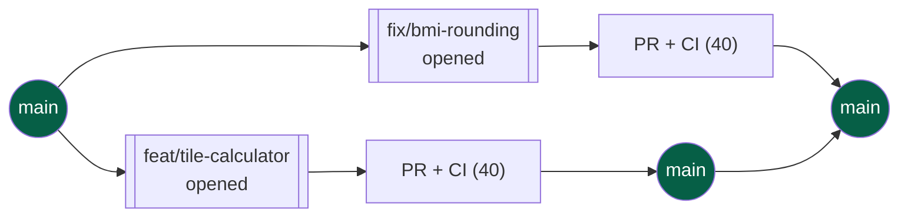
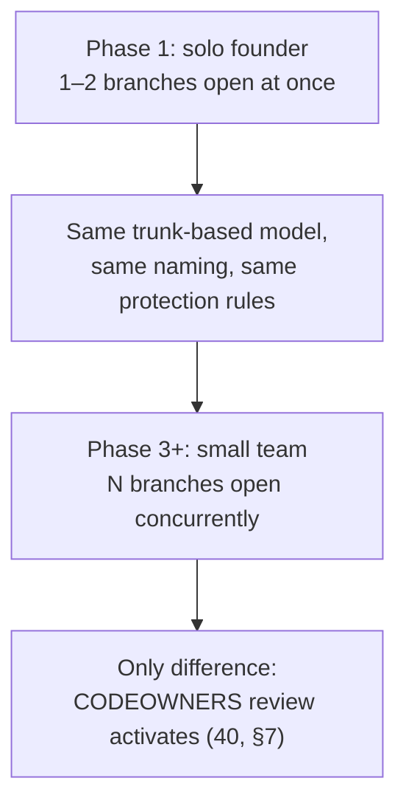

# 48 — Branching

> **Status:** Draft v1 · **Owner:** CTO / Developer Experience Lead · **Audience:** Anyone opening a branch or a PR — human or AI
> Governed by: `00-ENGINEERING-PRINCIPLES.md` and the relevant prior chapters, in particular `05-MONOREPO-STRATEGY.md`, `07-DEVELOPMENT-WORKFLOW.md`, and `40-CI-CD.md`.

---

## 1. What This Chapter Is: the Shape of Collaboration, Decided Before It's Needed

`07` gave you the daily loop (pull → branch → build → verify → PR → merge). `40` gave you the machine that guards `main` (pipeline stages, required checks, rollback). Neither chapter answers a more basic question: **what does a branch mean here, how long does it live, and what happens when a second person — or a second AI agent — starts opening branches at the same time as you?**

That question has to be answered once, in writing, before it matters — not improvised the day a contributor joins and asks "so… what's our Git workflow?" This chapter is that answer: **trunk-based development**, with short-lived branches, a fixed naming scheme, and `main` treated as the single source of truth that is always deployable. It is a solo-founder-today decision that is also the team's Git workflow on day one of Phase 3 — nothing about it changes when headcount grows, only its *volume* of concurrent branches does.

**Simple explanation:** think of `main` as the one shared, always-correct master recipe book in a restaurant kitchen. A branch is a chef stepping to a side table to test a tweak to one dish. The rule is: the side-table experiment is small, it's resolved within the same shift, and either it goes into the master book (merge) or it's discarded — nobody keeps a personal, diverging copy of the recipe book running for weeks while the real kitchen moves on without it.

> **CTO note:** branching strategy is one of the few technical decisions that is almost purely social, not technical — Git will happily support GitFlow, trunk-based, or total chaos. The cost of getting it wrong isn't a bug, it's *merge hell*: branches that drift so far from `main` that reconciling them becomes a multi-day archaeology project. For a catalog aiming at 1,000+ tool folders (`13`), where most changes touch exactly one folder, trunk-based is not a stylistic preference — it's the only model where the blast radius of a stale branch stays small.

---

## 2. Trunk-Based Development: `main` Is Reality

There is exactly one long-lived branch: `main`. Every other branch is a short-lived offshoot created for one task and deleted the moment it merges. There is no `develop`, no `staging` branch, no per-environment long-lived branch. `main` **is** what is either already live in production or one green pipeline run away from being live (`40`, §6).

| Concept | Our answer |
|---|---|
| Long-lived branches | `main` only |
| Where "the truth" lives | `main`, always — never a branch, never someone's laptop |
| How environments differ | Same commit on `main`, different deploy targets/config (`41`, `42`) — not different branches |
| How releases happen | Continuous — every merge to `main` is a release candidate; auto-deploy (`40`, §6) makes most of them the release |

This is a deliberate rejection of environment-per-branch models. A `staging` branch that diverges from `main` for days is, by definition, a second reality that has to be reconciled later — exactly the divergence this chapter exists to prevent. Environment differences belong in configuration and deploy targets (`41`, `42`), never in a parallel Git history.

**Simple explanation:** imagine two GPS apps that both claim to know your current location, but one hasn't synced in three days. You wouldn't trust it for a turn — you'd trust whichever one is live right now. `main` is the GPS that's always live. A long-lived `staging` branch is the one that hasn't synced, quietly getting more wrong every day it's ignored.

---

## 3. Short-Lived Feature Branches: the Only Kind We Create

Every branch off `main` exists for exactly one unit of work — one tool, one bug fix, one refactor — and is deleted the moment it merges. There is no reuse of a branch across tasks, and no branch that outlives the PR it belongs to.

A branch's target lifespan is measured in **hours to a couple of days**, not weeks. The plugin architecture (`13`) makes this realistic rather than aspirational: because a tool is one self-contained folder, the natural unit of work — "build the mortgage-calculator" — is small enough to branch, build, verify, and merge inside a single sitting. If a branch is still open after several days, that is a signal the task was sliced too large, not evidence the branch is "just taking a while."

| Branch age | Status |
|---|---|
| < 1 day | Normal — the expected case for almost every tool PR |
| 1–3 days | Acceptable for a genuinely larger platform change (engine, layout) |
| > 3 days, still open | Warning sign: slice the work smaller, or land it behind a flag (§7) |
| > 7 days, still open | Treat as a process incident — stale branches get closed or force-decided |

**Simple explanation:** a short-lived branch is a library book borrowed overnight — you know exactly when it's due back. A long-lived branch is a book borrowed with no due date, which is how books quietly disappear from circulation. We only issue overnight loans.

---

## 4. Branch Naming: One Scheme, No Exceptions

Every branch name follows a fixed `type/short-description` pattern, all lowercase, kebab-case, mirroring the same discipline already used for tool slugs and URLs (`09`).

| Prefix | Used for | Example |
|---|---|---|
| `feat/` | A new tool, new capability, or new platform feature | `feat/tile-calculator`, `feat/related-tools-widget` |
| `fix/` | A bug fix in an existing tool or the platform engine | `fix/bmi-rounding`, `fix/sitemap-duplicate-entries` |
| `chore/` | Non-behavioral maintenance: deps, config, tooling | `chore/upgrade-nextjs`, `chore/eslint-strict-mode` |
| `docs/` | Documentation-only changes (including this repository) | `docs/48-branching` |
| `refactor/` | Internal restructuring with no behavior change | `refactor/extract-schema-validator` |
| `ci/` | Pipeline/workflow changes (`40`) | `ci/cache-turborepo-remote` |
| `hotfix/` | Urgent production fix, same rules as `fix/` plus expedited review | `hotfix/jwt-decoder-crash` |

The prefix is not decoration — it is machine-readable metadata. CI (`40`) and any future release-notes tooling can group changes by prefix without parsing commit bodies, and it gives a human skimming `git branch -a` an instant sense of risk level (a `feat/` branch touching a brand-new tool folder is low-risk by construction; a `refactor/` branch touching the plugin engine warrants closer attention).

**Simple explanation:** it's the same reason a hospital color-codes wristbands instead of writing a paragraph on each one — a glance at `hotfix/` should carry the same urgency as a glance at a red wristband, immediately, with zero reading required.

> **CTO note:** resist the temptation to fold ticket numbers into branch names (`feat/JIRA-4521-tile-calc`) before there is a ticketing system that actually needs it. A branch name that encodes a slug (`feat/tile-calculator`) is self-documenting forever; one that encodes a ticket ID becomes a dangling reference the moment that tracker is migrated or retired. Add the ticket reference to the PR description, not the branch name — descriptions are disposable, branch identity is not.

---

## 5. `main` Is Always Shippable — Not Just Always Green

`40` enforces that nothing merges to `main` without every required check passing. This chapter adds the stronger, upstream discipline that makes that guarantee meaningful: **every commit on a branch should leave the codebase in a state you would be comfortable deploying**, not just the final commit before merge. A branch is not a scratchpad where anything goes as long as the last push is clean — it is a sequence of small, individually coherent steps.

This matters for two concrete reasons:

1. **`git bisect` stays useful.** If an intermediate commit is deliberately broken ("WIP, will fix next commit"), bisecting a regression across it wastes time chasing a fault that was never real.
2. **Squash-merge (`47`) hides the mess, but doesn't remove the risk.** We squash a branch's commits into one on merge for a clean `main` history, but a broken intermediate commit still forces a manual, ugly, ad hoc rebase to fix before you can merge at all.

**Simple explanation:** it's the difference between a chef who tastes and adjusts at every step versus one who dumps unfinished ingredients in a pan and "fixes it at the end." Both might plate the same dish, but only the first one can stop safely at any point along the way — which is exactly what you need when you're interrupted mid-task on a solo, daily-builder schedule (`07`, §1).

---

## 6. Branch Protection and Required Checks: Enforced, Not Requested

`40` (§7) is the canonical reference for the concrete GitHub branch protection ruleset — required status checks, no direct pushes, linear history, "include administrators" with no exceptions. This chapter's job is narrower: **`main` is the only branch that ruleset ever needs to protect**, because it is the only branch that lives long enough to need protecting. A `feat/` branch that lives four hours has no protection rule of its own — its safety comes entirely from the fact that it can only rejoin reality through a protected PR into `main`.

| Branch | Protected? | Why |
|---|---|---|
| `main` | Yes — full ruleset (`40`, §7) | The only branch that is ever "production" or one merge away from it |
| `feat/*`, `fix/*`, `chore/*`, etc. | No | Short-lived and disposable by design; protecting them would add ceremony with no corresponding risk |
| Any future release branch | Not planned (see §7) | Trunk-based development has no release branch to protect |

This asymmetry is the point: protection effort concentrates entirely on the one branch that matters, instead of being diluted across a branching model with several "important" branches to keep in sync.

**Simple explanation:** a bank vaults its one safe heavily and doesn't bother bolting locks onto the trolley used to wheel cash between counters — the trolley's safety comes from never being left unattended long enough to need its own lock. `main` is the safe; every `feat/` branch is the trolley.

---

## 7. No Long-Lived Divergent Branches: Why We Reject GitFlow

GitFlow-style models (`develop`, `release/*`, long-lived `feature/*` branches merged only at release time) exist to solve a problem UToolios does not have: coordinating scheduled, versioned releases across a large team with slow QA cycles. We ship continuously (`40`, §6), most changes are additive (a new tool folder touches nothing else, `13`), and there is no release train to gate against.

| Dimension | GitFlow | Trunk-based (our model) |
|---|---|---|
| Long-lived branches | `main` + `develop` (+ release branches) | `main` only |
| Integration frequency | Batched, at release time | Continuous, multiple times a day |
| Merge conflict risk | Grows with branch age — resolved in large, risky batches | Stays small — resolved constantly, in small increments |
| Fit for 1,000+ independent tool folders | Poor — adds ceremony with no matching benefit | Excellent — most PRs touch one folder and merge in minutes |
| Fit for a solo founder | Actively harmful — extra branches to babysit alone | Matches the one-person, daily-loop reality (`07`) |

The one legitimate reason to want a long-lived branch — "this feature is big and I'm not ready to expose it" — is solved without a long-lived branch at all: land the code on `main` behind a feature flag, dark-launched and disabled, and flip it on when ready. This keeps integration continuous (avoiding the very divergence a long branch would cause) while still controlling *exposure* rather than *integration*. A new tool category, a redesigned layout, or an in-progress AI-generation pipeline change (`35`) can all be merged incrementally, hidden from users, and turned on with a config change rather than a branch merge.

> **CTO note:** feature flags are not free — every flag is a small piece of permanent-feeling conditional logic that someone has to remember to remove. The trade-off is worth it because the alternative (a branch that diverges from `main` for two weeks while a feature is built) is strictly worse: it defers *all* the integration pain to one large, risky moment instead of spreading it thin and continuous. Discipline required: every flag gets a removal task the day it's created, not "eventually." A flag with no removal date is a long-lived branch wearing a disguise.

---

## 8. Solo Today, Team-Ready Tomorrow

Nothing in this model is a placeholder that gets replaced when a second engineer or a second AI agent joins — it is the same model at higher concurrency.

| What changes as the team grows | What does not change |
|---|---|
| Number of concurrent `feat/`/`fix/` branches | The naming scheme (§4) |
| CODEOWNERS review becomes a required check (`40`, §7) | Trunk-based model, no `develop` branch |
| More PRs racing to merge into `main` per day | `main` always shippable (§5), always protected (§6) |
| Possible per-area code ownership (e.g., a contributor who owns `packages/tools/finance/*`) | The rule that all branches are short-lived and deleted on merge |

The only thing that was ever deferred is **human review as a required gate** — in the solo phase, the automated pipeline (`40`) *is* the review, because there is no second person to review against. The moment a second contributor exists, CODEOWNERS-based required review slots into the exact same branch protection ruleset already in place — an additive configuration change, not a redesign of how branches work. This mirrors the phasing pattern used throughout the project (`04`, `38`, `40`, §9): build the seam that scales now, activate the feature only when the real need — a second reviewer — actually arrives.

**Simple explanation:** a single-lane bridge with clear traffic rules doesn't need new rules when a second car starts using it — it needs a second lane painted on, using the exact same signage. We're painting the second lane's markings into the design now, even though only one car (you) is driving on it today.

---

## 9. Rebasing, Merge Strategy, and Branch Hygiene

Day-to-day mechanics, tying together `07` and `47`:

- **Sync before you branch, and periodically while it's open:** `git pull --rebase` (or fetch + rebase) on `main` before creating a branch, and again if `main` moves meaningfully while your branch is still open. This is why branches stay short-lived in practice, not just in policy — a branch that's rebased daily never has far to travel.
- **Merge strategy into `main`: squash merge, always.** Each PR becomes exactly one commit on `main`, with a clear, conventional commit message (`47`). This keeps `main`'s history linear and readable — one line per unit of shipped work, not a tangle of "wip", "fix typo", "actually fix it" commits.
- **Delete the branch on merge.** GitHub's "delete branch after merge" is enabled repo-wide. A merged branch has done its job; keeping it around adds clutter and invites someone to accidentally keep building on top of already-merged, now-stale code.
- **Stale branch cleanup is automatic, not manual memory.** A scheduled check flags any branch untouched for more than a few days so it never silently rots — consistent with the branch-age budget in §3.

**Simple explanation:** squash-and-delete is like a hotel room being fully reset after checkout — the guest's mess (intermediate commits) never becomes the next guest's problem, and the room (branch) is immediately ready to be issued fresh rather than accumulating clutter room by room.

---

## Summary

- **Trunk-based development, one long-lived branch:** `main` is the single source of truth; there is no `develop`, no `staging` branch, no long-lived `release/*` branch.
- **Every other branch is short-lived by design** — created for one task, targeted to live hours to a couple of days, and deleted the moment it merges; a branch open past a week is treated as a process problem, not routine.
- **Fixed naming scheme, no exceptions:** `feat/`, `fix/`, `chore/`, `docs/`, `refactor/`, `ci/`, `hotfix/` — descriptive slugs, not ticket IDs, mirroring the same kebab-case discipline used for tool URLs (`09`).
- **`main` is always shippable, not merely always green** — commits within a branch should each be individually coherent, so `git bisect` stays useful and squash-merge (`47`) never has to hide a genuinely broken history.
- **Branch protection concentrates entirely on `main`** (full ruleset in `40`, §7); short-lived branches need no protection of their own because they never live long enough to need it.
- **We reject GitFlow deliberately** — no benefit for a continuously-shipping, mostly-additive, 1,000+-tool-folder catalog. Big, in-progress work ships behind a feature flag on `main`, not on a long-lived branch — with a removal date set the day the flag is created.
- **Solo today, team-ready tomorrow with zero redesign:** the only thing Phase 3 adds is CODEOWNERS-based required review (`40`, §7) slotting into the same protection ruleset — an additive config change, never a rewrite of the branching model.
- **Hygiene is automated, not memorized:** rebase before and during a branch's life, squash-merge into `main`, auto-delete on merge, and flag stale branches on a schedule.

> Next: `49-VERSIONING.md` — how releases, changelogs, and semantic version numbers are managed on top of this continuously-shipping trunk.

---

### Changelog

| Version | Date | Change | Reason |
|---|---|---|---|
| v1 | (draft) | Initial branching strategy | Project inception |
