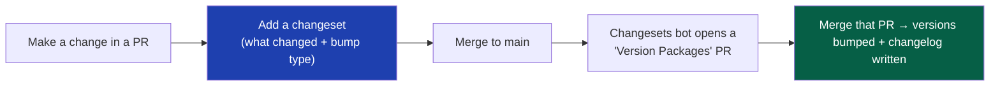
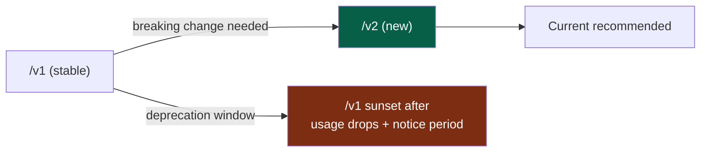
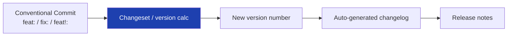

# 49 — Versioning

> **Status:** Draft v1 · **Owner:** CTO / Principal Engineer · **Audience:** Everyone who publishes a package, changes the plugin contract, or evolves the public API
> **Governed by:** `00`–`48`, especially the plugin contract (`13`), API standards (`22`), and release strategy (`46`). This chapter defines *how we number and evolve everything that has a version* — packages, the public API, the tool contract, and tool content — so change never silently breaks something downstream.

---

## 1. Why Versioning Is a Promise, Not a Number

A version number is a **contract with everyone who depends on you**. When the public API is `v1`, developers build against it expecting it not to break. When `packages/core` is `2.3.0`, every package importing it trusts that a `2.x` upgrade won't break their code. Versioning is how we make change *safe* across a system with thousands of interdependent parts (`05`).

**Simple explanation:** a version number is like the "use by" and "recipe unchanged" labels on a food product. If a customer's favorite sauce suddenly tastes different but the label is identical, they feel betrayed. If the label clearly says "new recipe," they can decide. Versioning is how we tell everyone downstream — other packages, API customers, 1,000 tools — exactly what kind of change just happened, so nothing breaks by surprise.

> **CTO note:** the single most expensive versioning mistake is a *silent breaking change* — shipping something incompatible under a version number that implies compatibility. For our API business (`03`, R4), that means broken customer integrations and lost trust. For our monorepo, it means a subtle bug rippling across tools. Every rule in this chapter exists to make breaking changes *loud, deliberate, and opt-in* — never silent.

---

## 2. Semantic Versioning — The Universal Language

We use **Semantic Versioning (SemVer)** everywhere a version applies: packages, the public API, and the tool contract. SemVer encodes the *nature* of a change in three numbers: `MAJOR.MINOR.PATCH`.

| Part | Bumped when | Means for consumers | Example |
|------|-------------|---------------------|---------|
| **MAJOR** (`2`.0.0) | A breaking change | "You must change your code to upgrade" | Removed a field; changed a function signature |
| **MINOR** (2.`3`.0) | A backward-compatible feature | "New stuff, safe to upgrade" | Added an optional config field |
| **PATCH** (2.3.`1`) | A backward-compatible fix | "Bug fix, safe to upgrade" | Corrected a rounding error |

**Simple explanation:** the three numbers tell a story at a glance. If only the last number changed (a patch), it's a safe bug fix — upgrade without worry. If the middle changed (minor), there's a new optional feature but nothing you relied on broke. If the *first* number changed (major), something you depend on changed shape and you need to check your code. Everyone in the software world reads these numbers the same way, so we don't have to explain our intentions — the number does it.

> **CTO note:** SemVer only works if we're *honest* about what's breaking. The temptation is to sneak a breaking change into a minor bump "because it's small." That erodes the entire trust system — once consumers learn our minor bumps sometimes break, they stop trusting any upgrade and pin old versions forever. Discipline here is non-negotiable: **if it can break a consumer, it's a MAJOR bump, full stop.**

---

## 3. Versioning the Monorepo Packages (Changesets)

Our packages (`packages/core`, `packages/ui`, `packages/engine`, etc., `05`) each have their own version. We manage these with **Changesets** — a tool built for versioning many packages in one monorepo.



### How it works
1. When you change a package, you add a **changeset** — a small file declaring *which* packages changed and *what kind* of bump (major/minor/patch) each needs, in plain words.
2. On merge, Changesets accumulates these.
3. When ready to release, Changesets computes the new version numbers (respecting dependencies between packages) and generates a changelog automatically.

**Simple explanation:** instead of manually deciding version numbers (error-prone across many packages), each change comes with a little note saying "this is a patch to `ui`" or "this breaks `core`." A tool reads all those notes and works out the correct new version for every package *and* every package that depends on them — then writes the changelog for us. It turns versioning from a manual chore into an automated, accurate step.

> **CTO note:** the reason Changesets matters *specifically* for us is dependency propagation. If `packages/core` gets a major bump, everything importing it may need attention. Doing that math by hand across a growing monorepo is exactly the kind of error-prone manual toil the platform exists to eliminate (`00`, Automation First). Let the tool compute the ripple; humans just declare intent.

---

## 4. Versioning the Public API

The public API (`22`, `03` R4) is our highest-stakes version because external customers depend on it and we cannot force them to upgrade.

### The strategy: version in the URL
```
https://api.utoolios.com/v1/finance/mortgage-calculator
https://api.utoolios.com/v2/...   (when a breaking change is unavoidable)
```

| Rule | Why |
|------|-----|
| **Major version in the URL path** (`/v1/`) | Clear, unmissable; customers pin to a version explicitly |
| **Only MAJOR changes create a new URL version** | Minor/patch changes are backward-compatible, same `/v1/` |
| **Old versions stay running during a deprecation window** | Customers get time to migrate; no sudden breakage |
| **Deprecation is announced + dated + monitored** | We watch usage of old versions before sunsetting |



**Simple explanation:** the API's major version lives right in the web address (`/v1/`). Customers who built on `/v1/` keep working forever within `/v1/` — we only add compatible improvements there. If we ever *must* break something, we stand up `/v2/` alongside it and give `/v1/` customers a clear, generous window (with reminders) to move. We never yank the rug — we build a new floor and let people step over when ready.

> **CTO note — resist versioning the API too eagerly.** Every live version is a maintenance burden (you run and secure `/v1` *and* `/v2`). So we design `v1` carefully to last, add features compatibly, and treat a `v2` as a rare, serious event — not a routine. The best API version strategy is the one you rarely need to exercise because v1 was designed to absorb change (optional fields, extensible responses, per `22`).

---

## 5. Versioning the Tool Plugin Contract

The `ToolPlugin` contract (`13`) is versioned *internally* — it's not public, but 1,000+ tools depend on it, so evolving it safely is critical.

| Change type | How we handle it |
|-------------|------------------|
| **Additive (new optional field)** | Minor bump; existing tools untouched — they just don't use it |
| **Additive (new required field)** | A codemod backfills every tool, then the field becomes required |
| **Breaking (changed/removed field)** | Contract MAJOR bump + a **codemod** migrates all tools in one pass |

**The codemod is the key.** Because tools are uniform (`00`, §6.2) and the contract is a single TypeScript type, a script (codemod) can mechanically update *all* tools when the contract changes, and the compiler flags any it missed.

**Simple explanation:** when we improve the "shape" every tool must fit, we don't hand-edit 1,000 folders. New optional things are safe automatically. If we ever must change something fundamental, we write one script that rewrites all 1,000 tools at once — and TypeScript then double-checks that none were left behind. This is uniformity's biggest payoff: you can upgrade every tool simultaneously *because they're all the same shape* (`13`, §7).

> **CTO note:** this is why the contract being a *type* (not a convention) is load-bearing here. A codemod can only reliably rewrite uniform, machine-parseable structures. If tools were hand-built snowflakes, a contract change would be a 1,000-file manual migration — the exact rewrite-hell we architected the whole platform to avoid. Versioning the contract safely is a *direct dividend* of the plugin architecture.

---

## 6. Versioning Tool Content

Tool *content* (the formula's assumptions, tax rates, article text) also changes over time and needs its own lightweight versioning — especially for correctness-critical tools (`02`, C2; `34`).

| Practice | Why |
|----------|-----|
| **`reviewedAt` / `dataVersion` in content** | Shows when a formula's assumptions were last verified (`08`, `34`) |
| **Content changes tracked in git** | Full history of what a tool computed and when it changed |
| **User-visible "last updated" where it matters** | Trust signal for finance/tax/health tools (E-E-A-T, `34`) |
| **Recompute/cache invalidation on content change** | Cached results (`21`) refresh when the formula changes |

**Simple explanation:** a tax calculator's answer for 2024 differs from 2025 because the *rules* changed, not the code. So each tool records when its data/assumptions were last reviewed, and git keeps the history. If someone asks "what did this tool say last March?", we can answer. And when we update a formula, the cached old answers are cleared so nobody sees stale numbers.

> **CTO note:** content versioning is easy to forget because it's not "code," but for a platform encoding real-world rules, a stale formula is a *correctness bug* that silently gives wrong answers. The `reviewedAt` date is our early-warning system: a tool whose data hasn't been reviewed in too long gets flagged for re-verification. This ties content versioning directly to the trust moat (`01`, B5).

---

## 7. How Versioning Connects to Releases and Changelogs

Versioning doesn't stand alone — it drives releases (`46`) and changelogs, all from Conventional Commits (`47`).



- A `fix:` commit implies a **patch**; a `feat:` implies a **minor**; a `feat!:` or `BREAKING CHANGE` implies a **major**.
- The version bump and changelog are generated from these, so the changelog is always accurate and never hand-maintained.

**Simple explanation:** the way you *write your commit message* (`47`) already declares the kind of change — a fix, a feature, or a breaking change. Versioning tools read those messages to pick the right new version number and write the release notes automatically. Discipline in one small place (commit messages) buys correct versioning and changelogs everywhere, for free.

---

## 8. Summary

- A version number is a **promise to everyone downstream**; the cardinal rule is **no silent breaking changes** — breaking changes must be loud, deliberate, and opt-in.
- We use **SemVer** (`MAJOR.MINOR.PATCH`) everywhere, honestly — if it can break a consumer, it's a MAJOR bump, no exceptions, because dishonest bumps destroy the whole trust system.
- **Monorepo packages** are versioned with **Changesets**, which computes correct numbers across package dependencies and auto-writes changelogs — eliminating error-prone manual version math.
- The **public API** versions its MAJOR in the URL (`/v1/`), keeps old versions running through a dated deprecation window, and treats a `v2` as a rare, serious event — because every live version is a maintenance burden.
- The **plugin contract** evolves via optional fields and **codemods** that rewrite all 1,000 tools at once — a direct dividend of the type-enforced, uniform plugin architecture.
- **Tool content** is versioned too (`reviewedAt`, git history, cache invalidation) — because a stale formula is a silent correctness bug in a trust-dependent platform.
- Versioning is **driven by Conventional Commits**, so version numbers, changelogs, and release notes are all generated accurately rather than hand-maintained.

> Next: `50-DOCUMENTATION-STANDARDS.md` — how this constitution stays alive: ADRs, the docs-with-code rule, comment discipline, and keeping documentation trustworthy over a decade.

---

### Changelog
| Version | Date | Change | Reason |
|---------|------|--------|--------|
| v1 | (draft) | Initial versioning strategy | Project inception |
