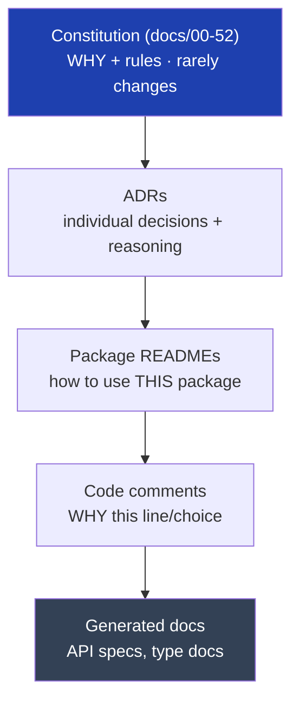

# 50 — Documentation Standards

> **Status:** Draft v1 · **Owner:** CTO / Principal Engineer · **Audience:** Everyone who writes code, makes a decision, or will one day try to understand why something is the way it is
> **Governed by:** `00`–`49`. This `docs/` folder *is* the engineering constitution. This chapter defines how documentation stays trustworthy, current, and useful over a decade — including the meta-rules for the very documents you're reading.

---

## 1. Why Documentation Is Infrastructure, Not Overhead

Most teams treat docs as a chore done after the "real work." For UToolios, documentation is **load-bearing infrastructure**, for one specific reason from the constitution (`00`, §6.3): **this platform is built daily by a solo founder and increasingly by AI.** If knowledge lives only in one person's head, the project dies the week they're unavailable, and an AI has nothing reliable to follow.

**Simple explanation:** documentation is the project's *external brain*. Code tells you *how* the system works right now; docs tell you *why* it was built that way and *what* the rules are. When you put the project down for two weeks and come back, or when a new engineer (or a prompt) joins, the docs are what let them continue without re-deriving every decision from scratch. A project you can't hand off is a project that can only ever have one contributor — and that ceiling kills the 10-year vision.

> **CTO note:** the failure mode I'm guarding against is the "expert bottleneck" — where only the original author understands the system, so all work funnels through them and nothing can be delegated (to humans *or* AI). Great documentation is what breaks that bottleneck. For an AI-assisted platform (`03`, B3), it's even more critical: an AI can only follow rules that are *written down*. Undocumented conventions are invisible to the very collaborators we're betting on.

---

## 2. The Documentation Layers

Not all documentation is the same. We have distinct layers, each with a different purpose, audience, and lifespan.

| Layer | Answers | Lifespan | Example |
|-------|---------|----------|---------|
| **Constitution** (`docs/00-52`) | Why we build this way; the rules | Years; amended deliberately | This document |
| **ADRs** (Architecture Decision Records) | Why *this specific decision* was made | Permanent record, even when superseded | "Why we chose Meilisearch over Elasticsearch" |
| **Package READMEs** | How to use/develop this package | Changes with the package | `packages/engine/README.md` |
| **Code comments** | Why this line/choice (not what) | Lives with the code | The tax-rate comment in `08`, §8 |
| **Generated docs** | Exact API/type shapes | Auto-updated from code | OpenAPI spec (`22`), TypeScript types |

**Simple explanation:** think of it like a company's records. The constitution is the founding charter (rarely changes, governs everything). ADRs are the meeting minutes (permanent record of *why* each big decision was made). READMEs are the departmental handbooks (how to work in this specific area). Code comments are sticky notes on individual tricky parts. Generated docs are the auto-updated inventory list. Each has its place; confusing them (e.g., putting a permanent decision in a code comment) means it gets lost.

---

## 3. Architecture Decision Records (ADRs)

The constitution captures *current* rules. But over 10 years we'll make hundreds of specific decisions, and future-us will ask "why did we do it *that* way?" ADRs answer that.

### What an ADR is
A short, dated document capturing **one decision**: the context, the options considered, the choice made, and the consequences. Stored in `docs/adr/`, numbered, never deleted (even when superseded — a superseded ADR links to the one that replaced it).

### The ADR template
| Section | Content |
|---------|---------|
| **Title + status** | e.g. "ADR-014: Defer NestJS to Phase 3" · Accepted/Superseded |
| **Context** | What situation forced a decision |
| **Options considered** | The realistic alternatives + their trade-offs |
| **Decision** | What we chose |
| **Consequences** | What this makes easy, what it makes hard |

**Simple explanation:** an ADR is a snapshot of your reasoning at the moment you decided something important. A year later, when someone asks "why aren't we using a separate backend yet?", the ADR shows the *thinking* — the options, the trade-offs, the call — so they don't second-guess a well-reasoned decision or, worse, undo it without understanding it. It's how we remember not just *what* we decided but *why*.

> **CTO note:** the highest-value ADRs are the ones documenting decisions that "look wrong" without context — like deferring NestJS (`04`, §7) or choosing static search first (`32`). Without the ADR, a future engineer sees "no proper backend" and assumes it was an oversight, then "fixes" it by over-building. The ADR preserves the *reasoning* so deliberate choices aren't mistaken for gaps. Every one of the CTO challenges I've flagged in this constitution should become an ADR.

---

## 4. The Golden Rule: Docs Change With Code

The number one reason documentation dies is **drift** — the code changes but the docs don't, so the docs become lies, and lying docs are worse than none. Our defense is a single hard rule:

> **Documentation is updated in the *same pull request* as the change it describes.**

| Enforced by | How |
|-------------|-----|
| PR review checklist | "Does this change need a docs update? Is it included?" (`review`) |
| CI checks | Broken doc links fail the build; changed public APIs require updated specs |
| Definition of Done (`00`, `07`) | A change isn't done until its docs reflect reality |

**Simple explanation:** we never let code and its documentation drift apart, because the moment they disagree, people stop trusting the docs entirely — and untrusted docs are dead docs. So changing the behavior and updating its description happen *together*, in one pull request, reviewed as one unit. If you rename a config field, the doc mentioning it changes in the same breath. Docs stay true because updating them is part of the change, not a follow-up someone forgets.

> **CTO note:** "we'll update the docs later" is the single most reliable way to end up with wrong documentation. Later never comes, and each un-updated change makes the docs a little more false until nobody believes them. Coupling docs to code in the same PR is the only mechanism I've seen actually keep documentation honest at scale. It's a small tax per change that prevents total documentation bankruptcy.

---

## 5. Code Comment Discipline

Reiterating and formalizing the rule from `08`, §8, because it's a documentation concern: **comments explain *why*, not *what*.**

| Comment this | Never comment this |
|--------------|--------------------|
| Why a formula uses a specific constant + its source | What the code obviously does |
| A non-obvious edge case or workaround | Commented-out old code (git remembers) |
| A link to the spec/regulation a rule comes from | Restating the function name |
| A `TODO(owner): reason` with an owner and reason | Vague `// fix later` |
| The review date for time-sensitive data | Decorative banners |

**Simple explanation:** good code already says *what* it does through clear names (`09`). Comments are precious space reserved for what code *can't* say — the reasoning, the source of a magic number, the sneaky edge case, the "don't refactor this, here's why." A comment explaining `i++` is noise; a comment saying "capped at 100% per HMRC spec §4.2, review each tax year" is gold that prevents a future correctness bug.

---

## 6. Documentation for AI Collaborators

Because AI generates tools and code (`35`, B3), our documentation has a second audience with different needs than humans. AI-friendly docs are a first-class concern.

| Principle | Why it matters for AI |
|-----------|------------------------|
| **Rules stated explicitly, not implied** | An AI can't infer "what everyone just knows"; it needs it written |
| **One canonical source per fact** | Contradictory docs make AI output inconsistent |
| **Concrete examples alongside rules** | AI follows examples more reliably than abstract descriptions |
| **Machine-parseable where possible** | The `_template/` folder (`06`) documents the tool shape *as runnable structure* |

**Simple explanation:** a human engineer can read between the lines and use judgment. An AI takes what's written literally. So our docs spell out rules that a senior human might consider "obvious," give concrete examples, and — best of all — encode conventions as *actual code templates* (`06`, `_template/`) the AI can copy rather than descriptions it must interpret. The clearer and more example-rich the docs, the more reliable every AI-generated tool becomes.

> **CTO note:** the most powerful documentation for AI isn't prose at all — it's the enforced contract (`13`, the `ToolPlugin` type) and the `_template/` folder. These are documentation that *can't* be misread because they're executable. Wherever we can turn a written rule into an enforced structure, we should — it documents the rule *and* guarantees it simultaneously. Prose explains; structure enforces. We want both, and we prefer structure for anything an AI must follow exactly.

---

## 7. Keeping the Constitution Alive

This `docs/00-52` set is only valuable if it stays accurate. Its own maintenance rules:

| Rule | Detail |
|------|--------|
| **Amendments are deliberate + versioned** | Change via the governance process (`00`, §8); bump version, date it, record the reason in the changelog |
| **Cross-references stay valid** | CI checks that referenced chapter numbers/links exist |
| **Contradictions are bugs** | If two chapters conflict, that's a defect to resolve, not tolerate |
| **The constitution is reviewed periodically** | A scheduled re-read to catch drift from reality |
| **New major areas get new chapters** | The structure grows; we don't cram everything into existing files |

**Simple explanation:** a constitution nobody keeps current becomes fiction. So we treat these docs like code: changes are deliberate and dated, references are checked automatically, contradictions are treated as bugs to fix, and we periodically re-read to make sure they still match reality. The document that governs everything must itself be governed.

---

## 8. Summary

- Documentation is **load-bearing infrastructure**, not overhead — it's the project's external brain that lets a solo-built, AI-assisted platform be handed off, delegated, and continued across the years.
- We maintain distinct **layers**: the constitution (why + rules), **ADRs** (individual decisions + reasoning), package READMEs (how to use), code comments (why this line), and generated docs (exact shapes) — each with its own purpose and lifespan.
- **ADRs preserve the reasoning** behind decisions that look wrong without context (deferring NestJS, static-search-first), so deliberate choices aren't mistaken for gaps and undone.
- **The golden rule — docs change in the same PR as the code** — is the only reliable defense against drift, because the moment docs and code disagree, all docs become untrusted and dead.
- **Comments explain why, not what**, reserving precious comment space for reasoning, sources, and edge cases that code can't express.
- **AI collaborators are a first-class doc audience** — explicit rules, canonical facts, concrete examples, and (best of all) conventions encoded as enforced structure (`_template/`, the `ToolPlugin` type) that can't be misread.
- **The constitution itself is kept alive** — amendments are deliberate and versioned, cross-references are CI-checked, and contradictions are treated as bugs.

> Next: `51-TECHNICAL-DEBT-PREVENTION.md` — how the architecture structurally prevents debt from accumulating, and how we track and pay down the debt we do take on.

---

### Changelog
| Version | Date | Change | Reason |
|---------|------|--------|--------|
| v1 | (draft) | Initial documentation standards | Project inception |
